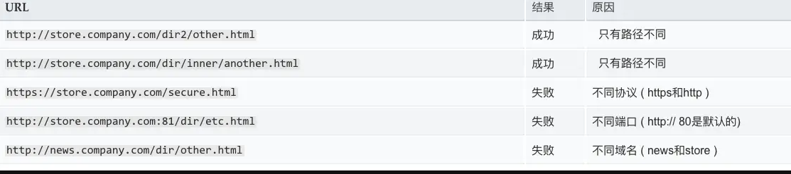
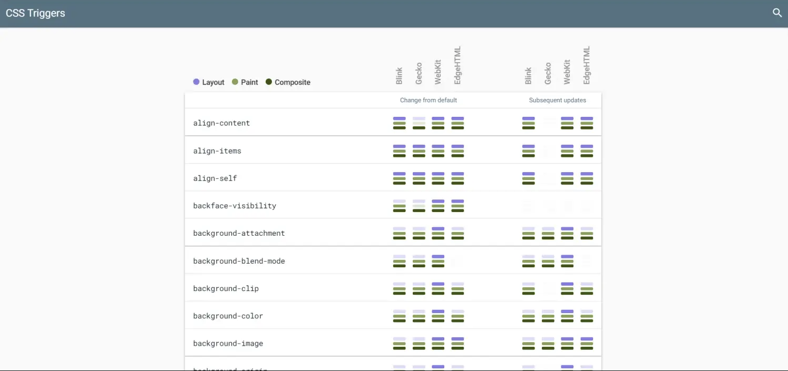

## 解析CSS选择器？

浏览器**从右往左**（也称为自底向上）解析 CSS 选择器，这样的匹配节点的方式可以快速、准确的与 render 树上的节点进行匹配，避免了许多无效匹配。浏览器需要评估的规则越少，样式引擎执行的速度就越快。

例如：

```css
.menu ul li a {
  color: plum;
}
```

浏览器会先检查 `a`、`li`、`ul`，然后是 `.menu`。

这是因为当浏览器扫描页面时，它只需要查看当前的节点和之前扫描过的所有节点。

需要注意的是，浏览器在获得完整的节点时就开始处理，无需等待整个页面，除非它找到一个脚本，在这种情况下，它会暂时暂停并完成脚本的执行，然后继续执行。

如果是相反的方式，则效率会很低，因为浏览器在第一次检查时找到了它正在扫描的元素，但随后被迫继续在文档中查找所有其他选择器。为此，浏览器需要有整个 html，并可能需要扫描整个网页之前，它才开始 css 绘制。

这与大多数 lib 解析 DOM 的方式相反。DOM 就是在这里构建的，它不需要扫描整个页面，只需找到第一个元素，然后继续匹配其中的其他元素。

详细内容你可以在 [Why do browsers match CSS selectors from right to left?](https://stackoverflow.com/questions/5797014/why-do-browsers-match-css-selectors-from-right-to-left) 查看，进行讨论。


## 解析CSS？

- 一旦 CSS 被浏览器下载，CSS 解析器就会被打开来处理它遇到的任何 CSS。
- 根据 CSS 词法和句法分析 CSS 文件、`<style>` 标签包含的内容以及 DOM 元素的 `style` 属性内嵌的 CSS。这其实也就是内联、行内和外部引入样式的三种方式。
- 每个 CSS 文件都被解析成一个样式表对象（`StyleSheet object`），可以通过 `document.styleSheets` 获取。这个对象包含了带有选择器的 CSS 规则，和对应 CSS 语法的对象（选择器、属性和属性各自值的数据结构）
- 当使用特定的解析器生成器时，CSS 解析器可以是自顶向下或自下而上的。


## 解析HTML？

> 译自 [HTML parsing](https://github.com/alex/what-happens-when#html-parsing)。

浏览器渲染引擎从网络层取得请求的文档，一般情况下文档会分成 8KB 大小的分块传输。

HTML 解析器的主要工作是对 HTML 文档进行解析，生成解析树。

解析树是以 DOM 元素以及属性为节点的树。DOM 是**文档对象模型（Document Object Model）**的缩写，它是 HTML 文档的对象表示，同时也是 HTML 元素面向外部（如 JavaScript）的接口。树的根部是 **Document** 对象。整个 DOM 和 HTML 文档几乎是一对一的关系。

**解析算法**：

HTML 不能使用常见的自顶向下或自底向上方法来进行分析。主要原因有以下几点:

- 语言本身的“宽容”特性
- HTML 本身可能是残缺的，对于常见的残缺，浏览器需要有传统的容错机制来支持它们
- 解析过程需要反复。对于其他语言来说，源码不会在解析过程中发生变化，但是对于 HTML 来说，动态代码，例如脚本元素中包含的 `document.write()` 方法会在源码中添加内容，也就是说，解析过程实际上会改变输入的内容

由于不能使用常用的解析技术，浏览器创造了专门用于解析 HTML 的解析器。解析算法在 HTML5 标准规范中有详细介绍，算法主要包含了两个阶段：**标记化（tokenization）和树的构建**。

**解析结束之后**：

浏览器开始加载网页的外部资源（CSS，图像，JavaScript 文件等）。

此时浏览器把文档标记为**可交互的（interactive）**，浏览器开始解析处于**推迟（deferred）**模式的脚本，也就是那些需要在文档解析完毕之后再执行的脚本。之后文档的状态会变为**完成（complete）**，浏览器会触发**加载（load）**事件。

注意解析 HTML 网页时永远不会出现**无效语法（Invalid Syntax）**错误，浏览器会修复所有错误内容，然后继续解析。


## 浏览器同源策略

> [**同源策略**](https://developer.mozilla.org/en-US/docs/Web/Security/Same-origin_policy)是一个重要的安全策略，它用于限制一个 [origin](https://developer.mozilla.org/zh-CN/docs/Glossary/Origin) 的文档或者它加载的脚本如何能与另一个源的资源进行交互。它能帮助阻隔恶意文档，减少可能被攻击的媒介。

跨域其实就是同源策略这种限制引起的。

**那么怎么样才算是同源呢？**

同源是指**协议 + 域名（主域名、子域名）+ 端口**三者相同，即便两个不同的域名指向同一个 IP 地址，也非同源。

下表给出了相对 `http://store.company.com/dir/page.html` 同源检测的示例:



浏览器中的大部分内容都是受同源策略限制的，但是以下三个标签可以不受限制：

- 加载图片的 ``
- 引用 CSS 样式的 `<link href=xxx>`
- 引用 JS 脚本的 `<script src=xxx>`

这就有了第一种解决跨域限制的方法：**JSONP**。它便是利用了不受同源策略限制的机制，可以在不同源的情况下请求资源。（这里不过多介绍，后面有资源链接自己看）

**但要注意**，普通的脚本和加上 `type="module"` 的脚本对 CORS（跨源资源共享）的处理方式不同。

```html
<!-- 不是 CORS 的请求 -->
<script src="https://example.com/script.js"></script>

<!-- CORS 请求 -->
<script type="module" src="https://example.com/script.js"></script>
```

如果你在模块上下文中请求 JavaScript 文件，则响应需要定义一个 `Access-Control-Allow-Origin` 头，否则它将受到浏览器同源策略的影响。

解决跨域的方案有很多种，详细内容可以阅读阮一峰老师的[浏览器同源政策及其规避方法](https://www.ruanyifeng.com/blog/2016/04/same-origin-policy.html)。

###  -更多资料

- [跨域资源共享 CORS 详解](https://www.ruanyifeng.com/blog/2016/04/cors.html)
- [10 种跨域解决方案（附终极大招）](https://juejin.cn/post/6844904126246027278)


## 浏览器重绘、回流和合成

重排和重绘是[关键渲染路径](https://developer.mozilla.org/zh-CN/docs/Web/Performance/Critical_rendering_path)中的两步，本文将介绍它们两个的影响。

###  -重绘

重绘（Repaint）是指浏览器重新绘制网页的过程。在重绘中，浏览器会根据渲染树重新绘制每个节点。

当对元素所做的更改明显改变其外观但不影响其布局时，会触发重绘。

常见的情况包括：更改元素的颜色或背景色、边框样式、不透明度、阴影、可见性等。

[根据 Opera 的说法](https://dev.opera.com/articles/efficient-javascript/?page=3#reflow)，重绘是昂贵的，因为浏览器必须验证 DOM 树中所有其他节点的可见性。

> 重绘是在[关键渲染路径](https://github.com/lio-zero/blog/blob/main/%E6%B5%8F%E8%A7%88%E5%99%A8/%E5%85%B3%E9%94%AE%E6%B8%B2%E6%9F%93%E8%B7%AF%E5%BE%84.md)中的 Paint 阶段，将渲染树中的每个节点转换成屏幕上的实际像素，这一步通常称为绘制或栅格化。

###  - 回流（Reflow）

回流/重排是指浏览器重新计算网页布局的过程。在回流中，浏览器会根据渲染树重新计算每个节点的位置和大小。

当网页中的内容、样式或者结构发生变化时，会触发回流。常见的情况如下：

- 改变页面元素的尺寸，如宽度、高度、字体等。
- 添加或删除页面元素。
- 更改页面元素的类名或者样式。
- 更改页面元素的内容。
- 改变浏览器窗口大小。
- 滚动页面。

回流对性能更为关键，因为它涉及到影响部分页面（或整个页面）布局的更改。

> 回流是在[关键渲染路径](https://github.com/lio-zero/blog/blob/main/%E6%B5%8F%E8%A7%88%E5%99%A8/%E5%85%B3%E9%94%AE%E6%B8%B2%E6%9F%93%E8%B7%AF%E5%BE%84.md)中的 Layout 阶段，计算每一个元素在设备视口内的确切位置和大小。当一个元素位置发生变化时，其父元素及其后面的元素位置都可能发生变化，代价极高。

关于回流和重绘需要注意一点的是，**回流必定会发生重绘，但重绘不一定会引起回流**。

###  - 合成（Composite）

合成是指浏览器将多个图层合并成一个最终的屏幕显示的过程。

在浏览器中，每个元素会被渲染成一个图层。当有多个图层重叠时，浏览器会根据这些图层的层级关系，将它们合并成一个最终的显示。

合成过程是按照层级顺序进行的，先合成的图层在底层，后合成的图层在上层。在这个过程中，浏览器会根据各个图层的样式和透明度进行相应的处理，最终得到最终的显示。

但合成是一个很耗时的过程，因此，通过减少不必要的图层数量来减少合成次数可以提高性能。除了减少合成次数外，还有一种方法可以提高合成的性能：**GPU 加速**。

### - GPU 加速

合成和 GPU 加速有着密切的关系。

在浏览器中，合成过程是由 CPU 进行的，因此当图层数量增加或者图层样式变得复杂时，合成的性能会受到影响。

而 GPU 加速则是指利用 GPU 的高性能进行合成，这样可以大大提高合成的性能。

通过 GPU 加速，浏览器可以将合成过程中的大量运算转移到 GPU 上进行，这样可以减少 CPU 的工作量，提高网页渲染性能。

可以使用以下几种方式来开启 GPU 加速：

- CSS 3D 变换 — 使用 CSS 3D 变换属性，如 `transform: translateZ()` 或 `transform: rotateX()` 等，可以让浏览器使用 GPU 来进行图形渲染。
- CSS 硬件加速 — 使用 CSS 属性如 `transform`、`opacity`、`filter` 等可以让浏览器使用 GPU 来进行图形渲染。
- WebGL — 使用 WebGL 可以在浏览器中使用 GPU 来进行 3D 图形渲染。
- requestAnimationFrame — 使用 `requestAnimationFrame` 来控制动画，可以让浏览器优化动画性能并使用 GPU 来渲染。
- canvas — 使用 `canvas` 可以让浏览器使用 GPU 来进行图像处理和渲染。

需要注意的是，GPU 加速并不能给所有类型的操作都带来性能提升，对于一些特殊的操作，甚至会降低性能，需要根据实际情况进行权衡。例如，使用多个层级的 3D 变换可能会导致性能问题，过多的硬件加速可能会增加带宽和内存的使用。因此，在使用 GPU 加速时，需要根据网页的具体需求和目标设备的性能来选择使用哪些方式。

###  - 提升为合成层好处

在提升为合成层的情况下，会直接跳过 layout 和 paint 阶段，直接进入非主线程处理的部分，即直接交给合成线程处理。

将元素提升为合成层可以带来以下优势：

- 合成层的位图，会交由 GPU 合成，它会比 CPU 处理要快
- 当需要 repaint 时，只需要 repaint 本身，不会影响到其他的层
- 元素提升为合成层后，将不会触发 layout 和 paint 阶段。

###  - 如何减少回流和重绘？

频繁的触发回流和重绘会影响网站的性能，应该尽量避免这种情况的发生。

如何减少回流和重绘，其实对应的就是减少它会触发的情况，这在上文已经有所介绍，更为详细的内容可以查阅[介绍下重绘和回流（Repaint & Reflow），以及如何进行优化](https://github.com/Advanced-Frontend/Daily-Interview-Question/issues/24)。

你可以在 [CSS Triggers](http://csstriggers.com/) 上了解哪些 CSS 属性会引起回流、重绘和合成。



> **Tips**：CSS Triggers 已不在维护。

需要知道一点，**重绘由于 DOM 位置信息不需要更新，省去了布局过程，因此性能上优于回流**。

###  - 更多资料

上面介绍的比较浅，感兴趣的继续往下阅读：

- [你真的了解回流和重绘吗](https://zhuanlan.zhihu.com/p/52076790)
- [前端性能优化：细说浏览器渲染的重排与重绘](http://www.imooc.com/article/45936)
- [ON LAYOUT & WEB PERFORMANCE](https://kellegous.com/j/2013/01/26/layout-performance/)
- [REFLOWS & REPAINTS: CSS PERFORMANCE MAKING YOUR JAVASCRIPT SLOW?](http://www.stubbornella.org/content/2009/03/27/reflows-repaints-css-performance-making-your-javascript-slow/)
- [详谈层合成（composite）](https://juejin.cn/post/6844903502678867981)
- [CSS GPU Animation: Doing It Right](https://www.smashingmagazine.com/2016/12/gpu-animation-doing-it-right/)
- [Accelerated Rendering in Chrome](https://web.dev/speed-layers/)
