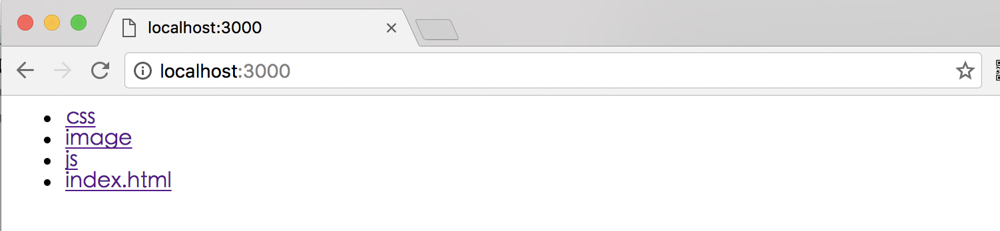

# koa-static中间件使用

## 使用例子
demo源码

[https://github.com/ChenShenhai/koa2-note/blob/master/demo/static-use-middleware/](https://github.com/ChenShenhai/koa2-note/blob/master/demo/static-use-middleware/)

```js
const Koa = require('koa')
const path = require('path')
const static = require('koa-static')

const app = new Koa()

// 静态资源目录对于相对入口文件index.js的路径
const staticPath = './static'

app.use(static(
  path.join( __dirname,  staticPath)
))


app.use( async ( ctx ) => {
  ctx.body = 'hello world'
})

app.listen(3000, () => {
  console.log('[demo] static-use-middleware is starting at port 3000')
})

```

#### 效果

##### 访问[http://localhost:3000](http://localhost:3000)


##### 访问[http://localhost:3000/index.html](http://localhost:3000/index.html)


##### 访问[http://localhost:3000/js/index.js](http://localhost:3000/js/index.js)


