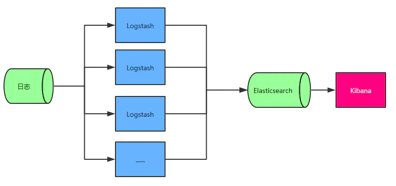
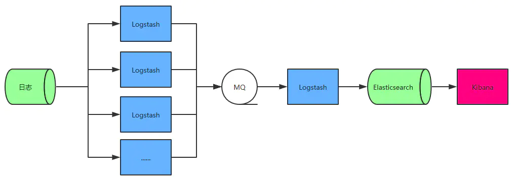
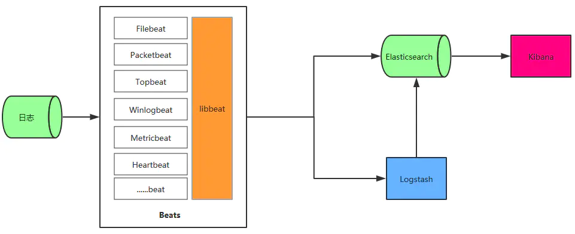

# ELK

**Elasticsearch**

分布式搜索和分析引擎。具有高可伸缩、高可靠和易管理等特点。基于 Apache Lucene 构建，能对大容量的数据进行接近实时的存储、搜索和分析操作。

**Logstash**

日志收集器。搜集各种数据源，并对数据进行过滤、分析、格式化等操作，然后存储到 Elasticsearch。

**Kibana**

数据分析和可视化平台。与 Elasticsearch 配合使用，对其中数据进行搜索、分析、图表展示。

**Filebeat**

一个轻量级开源日志文件数据搜集器，Filebeat 读取文件内容，发送到 Logstash 进行解析后进入 Elasticsearch，或直接发送到 Elasticsearch 进行集中式存储和分析。

## 架构介绍

基于 ELK 的使用方式，Logstash 作为日志搜集器，Elasticsearch 进行日志存储，Kibana 作为日志呈现，大致以下几种架构。

### 架构一

图中 Logstash 多个的原因是考虑到程序是分布式架构的情况，每台机器都需要部署一个 Logstash，如果确实是单服务器的情况部署一个 Logstash 即可。

前面提到 Logstash 会对数据进行分析、过滤、格式化等操作，这一系列操作对服务器的 CPU 和内存资源的消耗都是比较高的，所以这种架构会影响每台服务器的性能，所以并不推荐采用。

### 架构二

相比于架构一，增加了一个 MQ 和 Logstash， Logstash 的输出和输入支持 Kafka、Redis、RabbitMQ 等常见消息队列， MQ 前的 Logstash 只作为日志收集和传输，并不解析和过滤，先将日志加入队列，由 MQ 后面的 Logstash 继续解析和过滤，这样就不至于每台服务器消耗资源都很多。

### 架构三

这种架构是基于架构二简化来的，实际在使用过程中也是可以采取的，日志直接进入 MQ，Logstash 消费 MQ 数据即可。

### 架构四

这种架构在日志数据源和 Logstash（或 Elasticsearch） 中增加了 Beats 。Beats 集合了多种单一用途数据采集器，每款采集器都是以用于转发数据的通用库 libbeat 为基石，beat 所占的系统 CPU 和内存几乎可以忽略不计，libbeat 平台还提供了检测机制，当下游服务器负载高或网络拥堵时，会自动降低发生速率。下面的例子我们使用 Filebeat 来对文件日志的收集，其他的 beat 可以忽略。

架构四相比于架构二，如果将每台服务器上部署的 Logstash 都换成对应的 Beats ，那就是更理想的架构了。

不管怎么样，对于日志解析和过滤的 Logstash 资源消耗还是比较高的，所以如果需要，可以将 Logstash 的部署使用分布式，Elasticsearch 的部署使用集群来强化整个日志系统。

---

**参考资料：**

- [🛠 Elastic stack（ELK）on Docker](https://github.com/deviantony/docker-elk)
- [📝 ELK + Filebeat 搭建日志系统](https://juejin.im/entry/6844903520592723975)
- [📝 中小型研发团队架构实践：集中式日志 ELK](https://juejin.im/entry/6844903518671732743)
- [📝 ELK 日志分析方案](https://juejin.im/post/6844903702902358030)
- [📝 从 ELK 到 EFK](https://juejin.im/entry/6844903504448864270)
