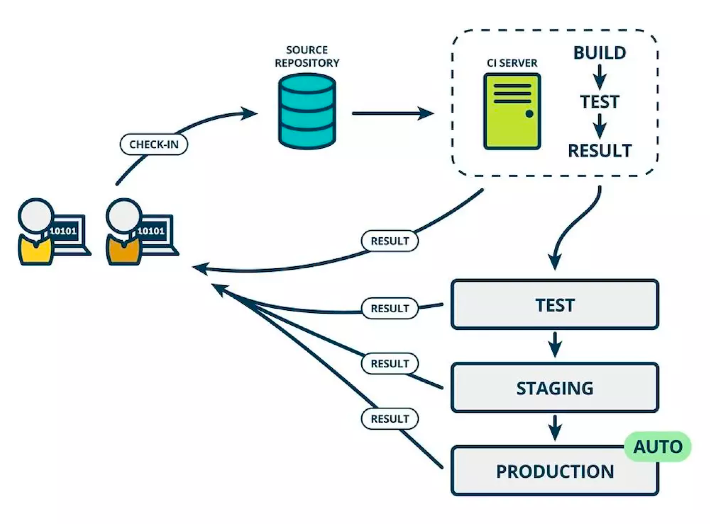

# 持续部署

> **Continuous deployment (CD)** is a software engineering approach in which software functionalities are delivered frequently through automated deployments.

**持续部署**（Continuous Deployment，简称 CD），它是在持续交付的基础上打通最后一公里的工作，就是把手动部署到生产环境的方式升级为自动部署。看下图和上图在最后部署到生产环境中的区别。
