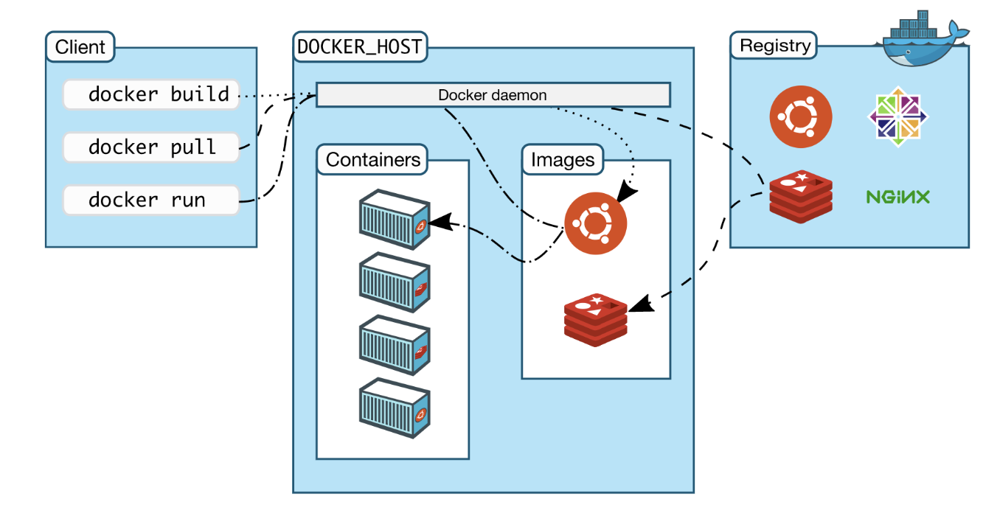

# 基本概述

容器技术对进程进行封装隔离，属于操作系统层面的虚拟化技术。由于隔离的进程独立于宿主和其它的隔离的进程，因此称为容器。Docker 在容器的基础上，进行了进一步的封装，从文件系统、网络互联到进程隔离等等，极大的简化了容器的创建和维护。使得 Docker 技术比虚拟机技术更为轻便、快捷。

主要目标：通过对应用组件的封装、分发、部署、运行等生命周期的管理，达到应用级别的一次封装，到处运行。

## 组成

Docker 包括三个基本概念：

- 镜像 Image
- 容器 Container
- 仓库 Repository

理解这三个概念，就理解了 Docker 的整个声明周期。

参考 [Docker Overview](https://docs.docker.com/engine/docker-overview/)

### 镜像 Image

Docker 镜像是 **一个特殊的文件系统**，除了提供容器运行时所需的程序、库、资源、配置等文件外，还包含了一些为运行时准备的一些配置参数（如匿名卷、环境变量、用户等）。镜像不包含任何动态数据，其内容在构建之后也不会被改变。

Docker 设计时，就充分利用 Union FS 的技术，将其设计为分层存储的架构。 镜像实际是由多层文件系统联合组成。

镜像构建时，会一层层构建，前一层是后一层的基础。每一层构建完就不会再发生改变，后一层上的任何改变只发生在自己这一层。

比如，删除前一层文件的操作，实际不是真的删除前一层的文件，而是仅在当前层标记为该文件已删除。

在最终容器运行的时候，虽然不会看到这个文件，但是实际上该文件会一直跟随镜像。

例如：这个镜像文件包含了一个完整的 Ubuntu 系统，我们可以在 Ubuntu 镜像基础之上安装了 Redis、Mysql 等其它应用程序，可以回顾下 Docker 架构一瞥 在 `DOCKER_HOST` 里面有个 images。

镜像构建时，会一层层构建，前一层是后一层的基础。每一层构建完就不会再发生改变，后一层上的任何改变只发生在自己这一层。


### 容器 Container

镜像和容器的关系，就像是面向对象程序设计中的 类 和 实例 一样，镜像是静态的定义，容器是镜像运行时的实体。容器可以通过 Docker API 创建、启动、停止、删除、暂停等。

在默认情况下，容器与其它容器及其主机是隔离的，拥有自己的独立进程空间、网络配置。

容器由其镜像以及在创建或启动容器时提供的任何配置选项定义。当容器被删除时，对其状态的任何未存储在持久存储中的更改都会消失。

按照 Docker 最佳实践的要求，容器不应该向其存储层内写入任何数据，容器存储层要保持无状态化。所有的文件写入操作，都应该使用 **数据卷（Volume）**、或者**绑定宿主目录**，在这些位置的读写会跳过容器存储层，直接对宿主（或网络存储）发生读写，其性能和稳定性更高。

```
容器 = 镜像 + 读写层
```

- 容器用来运行程序，是读写层
- 镜像用来安装程序，是制度层

### 仓库 Registry

仓库是集中存放镜像文件的场所。

有时候狐白仓库和仓库注册服务器（Registry）混为一谈，并不严格区分。实际上，仓库注册服务器上往往存放着多个仓库，每个仓库中又包含了多个镜像，每个镜像有不同的标签（tag）。

## 作用

Docker 可以将应用以集装箱的方式进行打包，通过镜像的方式可以实现在不同的环境下进行快速部署，在团队中还可实现一次打包，多次共享，使用 Docker 可以轻松的为任何应用创建一个轻量级的、可移植的、自给自足的容器。

例如，我们在本地将编译测试通过的程序打包成镜像，可以快速的在服务器环境中进行部署，有时也能解决不同的开发环境造成的问题 “明明我本地是好的，但是一到服务器就不行”。

## 优点

- 高效的利用系统资源（节约成本）
- 持续交付与部署（敏捷）
- 多平台的迁移更容易（可移植性）
- 容易的沙箱机制（安全性）

## 使用场景

- Use Cases
- 简化配置
- 代码流水线（Code Pipeline）管理
- 提高开发效率
- 隔离应用
- 整合服务器
- 调试能力
- 多租户环境
- 快速部署

## 虚拟机架构

中间部位为我们进行 Docker 操作的宿主机，其运行了一个 Docker daemon 的核心守护程序，负责构建、运行和分发 Docker 容器。

左边为 Docker 客户端，其与 Docker 守护进程进行通信，客户端会将 build、pull、run 命令发送到 Docker 守护进程进行执行。

右边为 Docler 注册表存储 Docker 镜像，是一个所有 Docker 用户共享 Docker 镜像的服务，Docker daemon 与之进行交互。



Docker 创建的所有虚拟实例共用同一个 Linux 内核，对硬件占用较小，属于轻量级虚拟机。

```

应用 应用
系统库 系统库
docker引擎
宿主机系统
硬件

```

---

**参考资料：**

- [一文零基础教你学会 Docker 入门到实践](https://cnodejs.org/topic/5d8c0df7e86cfb0d2a645c61)
