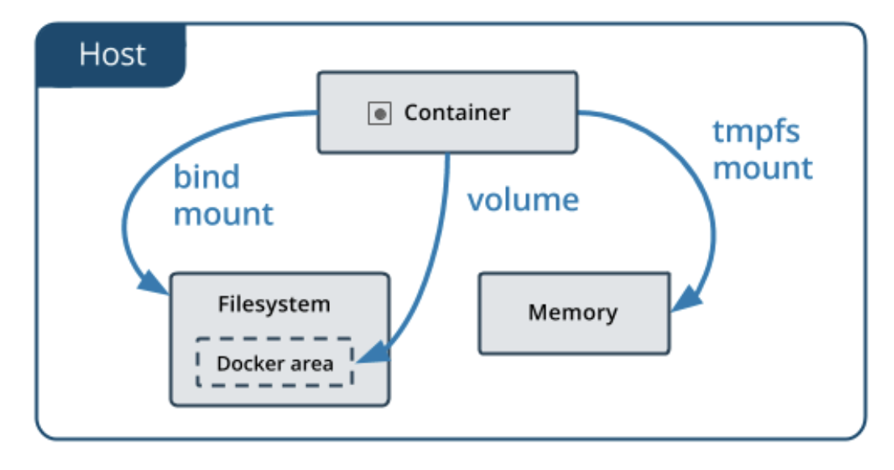
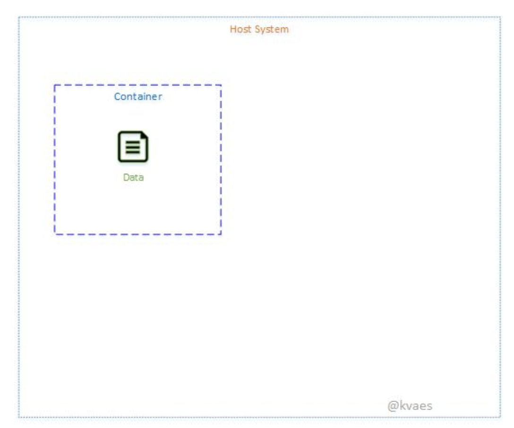
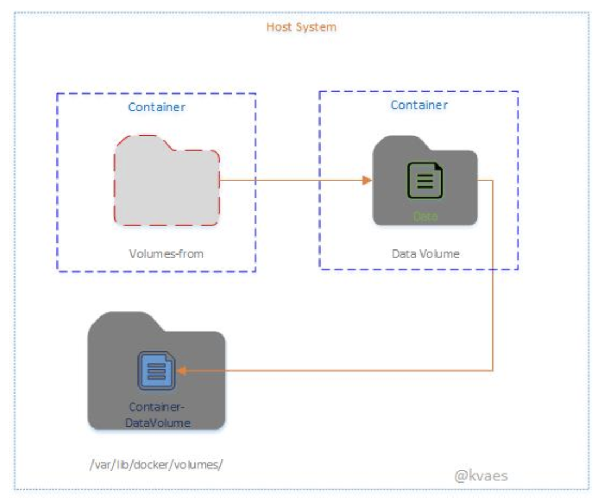
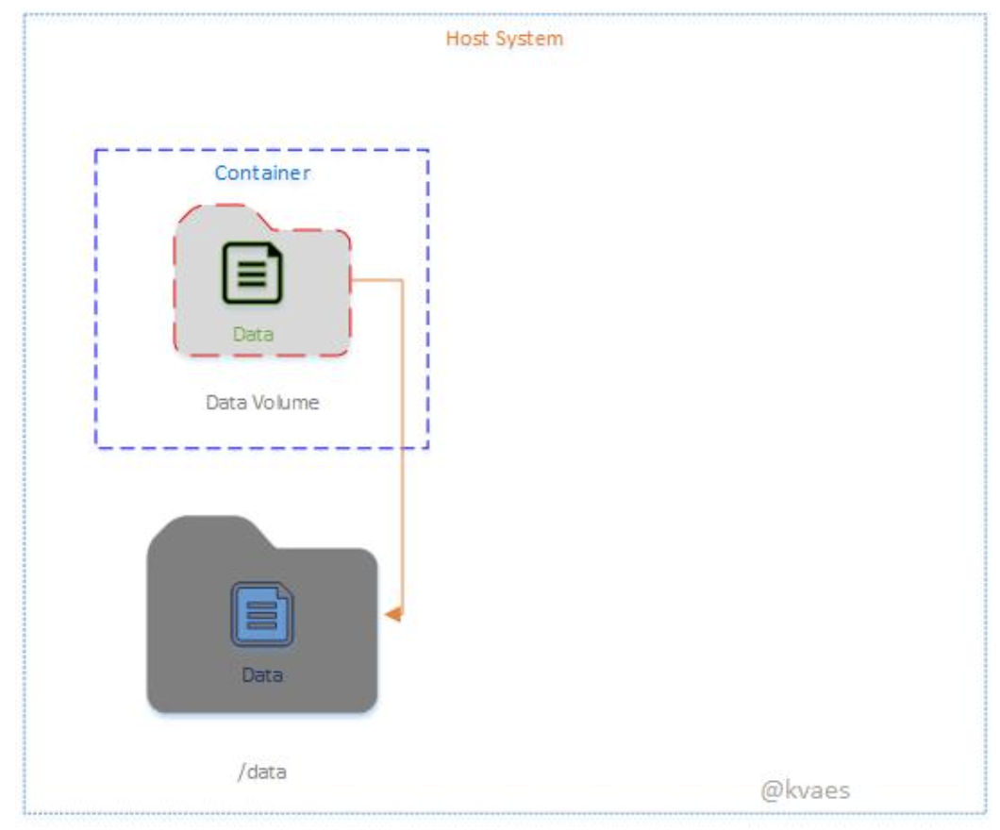
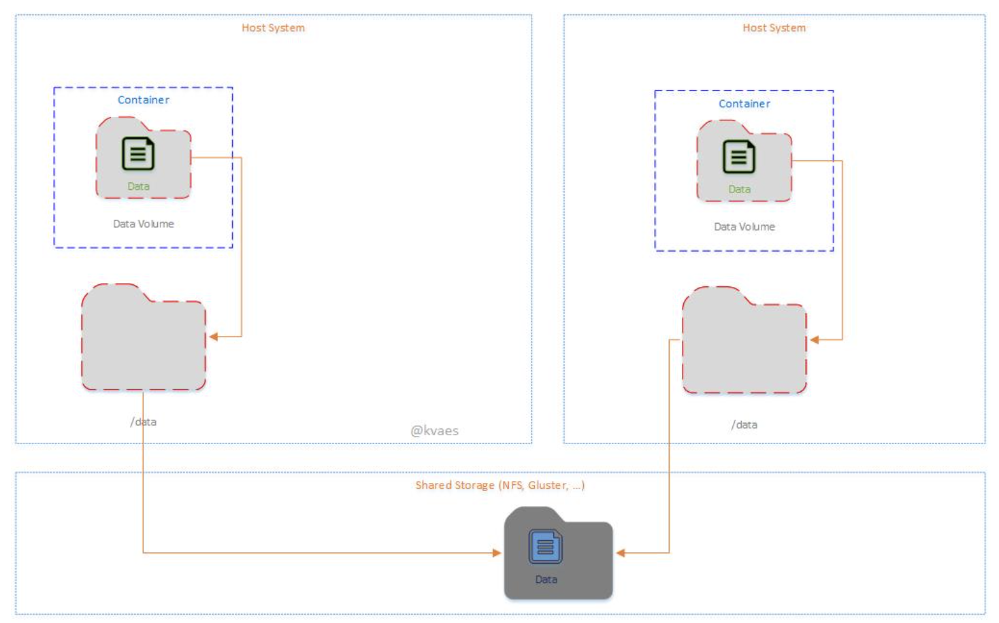

# 持久存储模式

默认容器的数据的读写发生在容器的存储层，当容器被删除时数据将会丢失。所以我们应该尽量保证容器存储层不发生写操作，为了实现数据的持久化存储我们需要选择一种方案来保存数据。

本文将讨论保证数据持久性的几种模式：

- **默认模式**：不支持任何持久性
- **数据卷**：容器持久性
- **仅含数据的容器**：容器持久性
- **从主机映射而得的卷**：容器持久性
- **从主机映射而得的卷，存储后端是共享存储**：主机持久性
- **Convoy 卷插件**：主机持久性

上述几种持久性是什么意思呢？

- **容器持久性**：升级容器并不会移除数据
- **主机持久性**：主机失效也不会引起数据丢失

当前有以下几种实现方式：

- 数据卷（Volumes）
- 挂载主机目录 (Bind mounts)
- tmpfs mounts



## 默认模式

这是最基本的一种持久存储模式。

创建容器时没有指定任何与卷相关的选项，数据保存在容器内部。前文已经提及，升级容器会导致容器数据丢失。如果容器是无状态的，这当然没问题；如果容器是有状态的，需要持久保存数据（例如，数据库容器），默认模式显然就不适合了。



## 数据卷

`数据卷` 是一个可供一个或多个容器使用的特殊目录，它绕过 UFS，可以提供很多有用的特性：

- 数据卷可以在容器之间共享和重用
- 对数据卷的修改会立马生效
- 对数据卷的更新，不会影响镜像
- 数据卷默认会一直存在，即使容器被删除

使用数据卷的目的是持久化容器中的数据，以在容器间共享或防止数据丢失（写入容器存储层的数据会丢失）。

> ⚠️ **注意**：`数据卷` 的使用，类似于 Linux 下对目录或文件进行 mount，镜像中的被指定为挂载点的目录中的文件会隐藏掉，能显示看的是挂载的 `数据卷`。

### 创建数据卷

在创建容器时指定 `volume` 选项。数据卷位于主机系统的特定位置下（例如，`/var/lib/docker/volumes/<container_name>/_data` 目录下，可用 `docker inspect` 命令查看），升级容器时不会改动这些数据。


使用数据卷的步骤一般分为两步：

1. 创建一个数据卷
2. 使用 `-v` 或 `--mount` 参数将数据卷挂载容器指定目录中，这样所有该容器针对该目录的写操作都会保存在宿主机上的 Volume 中

```bash
# 创建名为 vol 的数据卷
$ docker volume create vol
```

### 只包含数据的容器

只包含数据的容器与典型的数据卷相比略有不同。首先创建一个数据卷容器（通常以 `busybox` 或 `alpine` 为基础镜像），然后在启动主容器时使用 `-volumes-from` 选项，把数据卷容器的所有卷映射到主容器内。这是一种典型的随从模式实现。



### 查看数据卷的具体信息

```bash
# 格式
$ docker inspect <volume-name>
```

```bash
# 查看所有的 数据卷
$ docker volume ls

# 查看指定数据卷的信息
$ docker volume inspect vol
[
    {
        "Driver": "local",
        "Label": {},
        "Mountpoint": "/var/lib/docker/volumes/vol/_data",
        "Name": "vol",
        "Options": {},
        "Scope": "local"
    }
]
```

可以看到创建的数据卷 `vol` 保存在目录 `/var/lib/docker/volumes` 下，以后所有针对该 Volume 的写数据都会保存到目录 `/var/lib/docker/volumes/vol/_data` 下。

### 启动挂载数据卷的容器

在用 `docker run` 命令的时候，使用 `--mount` 或者 `-v` 标记来将 `数据卷` 挂载到容器里。在一次 `docker run` 中可以挂载多个数据卷。

**--mount 参数**

下面创建一个名为 `app` 的容器，并加载一个 `数据卷` 到容器的 `/webapp` 目录。

```bash
$ docker run -d -P \
    --name app \
    --mount source=vol, target=/webapp \
    training/webapp \
    python app.py
```

`source` 指定 Volume，`target` 指定容器内的文件或文件夹。

**-v 参数**

```bash
$ docker run -d \
  --name=nginxtest \
  -v nginx-vol:/usr/share/nginx/html \
  nginx:latest
```

挂载成功后，容器从 `/usr/share/nginx/html` 目录下读取或写入数据，实际上都是从宿主机的 `nginx-vol` 数据卷中读取或写入数据。因此 Volumes 或 Bind mounts 也可以看作是容器和宿主机共享文件的一种方式。

`-v` 参数使用冒号分隔 `source` 和 `destination`，冒号前半部分是 `source`，后半部分是 `destination`。

> 如果你挂载一个还不存在的数据卷，Docker 会自动创建它。（因此创建数据卷那异步非必需）

如果容器中的待挂载的目录不是一个空目录，那么该目录下的文件会被复制到数据卷中。Bind mounts 下，宿主机上的目录总会覆盖容器中的待挂载目录。

`-v` 参数和 `--mount` 参数总的来说功能几乎相同，唯一的区别是在运行一个 service 时只能够 `--mount` 参数来挂载数据卷。

### 只读数据卷

某些情况下，我们希望某些数据卷对某个容器来说是只读的，可以通过添加 `readonly` 选项来实现：

```bash
# 使用 --mount
$ docker run -d \
    --name=nginxtest \
    --mount source=nginx-vol,destination=/usr/share/nginx/html,readonly \
    nginx:latest

# 使用 -v
$ docker run -d \
    --name=nginxtest \
    -v nginx-vol:/usr/share/nginx/html:ro \
    nginx:latest
```

### 删除数据卷

```bash
$ docker volume rm vol
```

`数据卷` 是被设计用来持久化数据的，它的生命周期独立于容器，Docker 不会在容器被删除后自动删除 `数据卷`，并且也不存在垃圾回收这样的机制来处理没有任何容器引用的 `数据卷`。如果需要在删除容器的同时移除数据卷。可以在删除容器时候使用 `docker rm -v` 这个命令。

无主的数据卷可能会占据很多空间，要清理请使用以下命令：

```bash
# 删除所有未使用的 volumes
$ docker volume prune
```

## 挂载主机目录

### 从主机映射而得的数据卷

这种模式是把主机的目录映射为容器的数据卷。在数据卷模式中，容器的文件夹实际上保存在主机 `/var/lib/docker/volumes/` 目录下面的一个文件。而从主机映射的卷是直接建立容器与主机之间的目录映射。这种方式与数据卷模式具有相同的优点，也可以混合使用这两种模式。这种模式的主要缺点是容器与主机之间的权限（UID/GID）映射。



### 挂载主机目录作为数据卷

使用 `--mount` 标记可以指定挂载本地主机的目录到容器中，需要指定 `type=bind`。

```bash
$ docker run -d \
    --name=nginxtest \
    # -v /usr/local/web:/usr/share/nginx/html \
    --mount type=bind,source=/usr/local/web,target=/usr/share/nginx/html \
    nginx:latest
```

上面的命令加载宿主机上的 `/usr/local/web` 目录到容器的 `/usr/share/nginx/html` 目录。

这个功能在进行测试的时候十分方便，比如用户可以放置一些程序到本地目录中，来查看容器是否正常工作。本地目录的路径必须是 **绝对路径**，以前使用 `-v` 参数时如果本地目录不存在 Docker 会自动为你创建一个文件夹，现在使用 `--mount` 参数时如果本地目录不存在，Docker 会报错。

### 挂载本地主机文件作为数据卷

`--mount` 标记也可以从主机挂载单个文件到容器中。

```bash
$ docker run --rm -it \
    # -v $HOME/.bash_history:/root/.bash_history \
    --mount type=bind,source=$HOME/.bash_history,target=/root/.bash_history \
    ubuntu:18.04 \
    bash
```

这样就可以记录在容器输入过的命令了。

> 如果你是用 Bind mounts 挂载宿主机目录到一个容器中的非空目录，那么此容器中的非空目录中的文件会被隐藏，容器访问这个目录时能够访问到的文件均来自于宿主机目录。这也是 Bind mounts 模式和 Volumes 模式最大的行为上的不同。

### 从主机映射而得的数据卷，存储后端是共享存储

把共享存储（例如， NFS, Gluster ...）的文件夹映射为主机的文件夹，再映射为容器的卷。这种模式的主要优点是：即使主机失效，容器的数据也不会丢失。



## 非持久化的数据存储

Volumes 和 Bind mounts 模式使我们能够在宿主机和容器间共享文件从而我们能够将数据持久化到宿主机上，以避免写入容器存储层带来的容器停止后数据的丢失的问题。

如果你使用 Linux 运行 Docker，那么避免写入数据到容器存储层还有一个方案：tmpfs mounts。

tmpfs mounts，顾名思义，是一种非持久化的数据存储。它仅仅将数据保存在宿主机的内存中，一旦容器停止运行，tmpfs mounts 会被移除，从而造成数据丢失。

### 使用方法

我们可以在运行容器时通过指定--tmpfs 参数或--mount 参数来使用 tmpfs mounts

```bash
$ docker run -d \
  -it \
  --name tmptest \
  --mount type=tmpfs,destination=/app \
  nginx:latest

$ docker run -d \
  -it \
  --name tmptest \
  --tmpfs /app \
  nginx:latest
```

> 使用 `--tmpfs` 参数无法指定任何其他的可选项，并且不能用于 Swarm Service。

使用 `docker container inspect tmptest` 命令，然后查看 Mounts 部分可以看到：

可选选项：

- `tmpfs-size`：挂载的 tmpfs 的字节数，默认不受限制
- `tmpfs-mode`：tmpfs 的文件模式，例如 700 或 1700。默认值为 1777，这意味着任何用户都有写入权限。

```bash
$ docker run -d \
  -it \
  --name tmptest \
  --mount type=tmpfs,destination=/app,tmpfs-mode=1770 \
  nginx:latest
```

## 使用场景总结

### Volumes

1. 在多个容器间共享数据
2. 无法确保 Docker 主机一定拥有某个指定的文件夹或目录结构，使用 Volumes 可以屏蔽这些宿主机差异
3. 当你希望将数据存储在远程主机或云提供商上
4. 当你希望备份，恢复或者迁移数据从一台 Docker 主机到另一台 Docker 主机，Volumes 是更好的选择

### Bind mounts

1. 在宿主机和容器间共享配置文件。例如将 nginx 容器的配置文件保存在宿主机上，通过 Bind mounts 挂载后就不用进入容器来修改 nginx 的配置了
2. 在宿主机和容器间共享代码或者 build 输出。例如将宿主机某个项目的 target 目录挂载到容器中，这样在宿主机上 Maven build 出一个最新的产品，可以直接在容器中运行，而不用生成一个新的镜像
3. Docker 主机上的文件或目录结构是确定的

### tmpfs mounts

1. 当你因为安全或其他原因，不希望将数据持久化到容器或宿主机上，那你可以使用 tmpfs mounts 模式。

---

**参考资料：**

- [Docker：Storage Patterns for Persistence](https://kvaes.wordpress.com/2016/02/11/docker-storage-patterns-for-persistence/)
