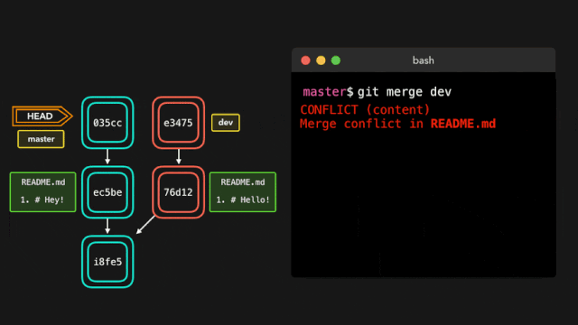

---
nav:
    title: DevOps系列
    path: /DevOps
    order: 5
title: 合并 git merge
order: 14

group:
  path: /git
  title: git
  order: 9
---

# 合并 git merge

> Join two or more development histories together
>
> 用于将两个或两个以上的开发历史加入(合并)一起。

## 合并分支

以在你的工作目录中 **获取（fetch）** 并 **合并（merge）** 远端的改动。

如果你要合并指定分支到当前分支，`branch` 为需要合并到当前分支的名称。

```bash
git merge <branch1> <branch2> ...
```

## 快速向前合并

当当前分支与正在合并的分支相比没有额外提交时，可能会发生快速向前合并，Git 首先尝试执行最简单的选择 Fast-forward 模式合并不会创建新的提交，而是合并当前分支中合并的分支上的提交。


现在，在 `dev` 分支上所做的所有更改都在 `master` 分支上可用。那么，No-fast-foward 是怎么回事？

## 非快速向前合并

如果您当前的分支与要合并的分支相比没有任何额外的提交，那就太好了，但不幸的是，这种情况很少发生！如果我们在当前分支上提交了要合并的分支没有的更改，git 将执行 No-fast-foward 合并。使用 No-fast-foward 合并，Git 在活动分支上创建一个新的合并提交。提交的父提交指向活动分支和要合并的分支！


合并冲突修复的过程 ，动画演示如下：



完美的合并！🎉 主分支现在包含我们对 `dev` 分支所做的所有更改。

## 合并冲突解决

场景：假设有一个分支 A，像 master 分支提交 PR，然后发生无法自动解决的冲突，PR 提示不能执行 merge 合并

Pull Request / Merge Request 发生冲突时的解决方法：

1. 本地 `checkout` 检出并切换到 A 分支，`pull` 拉取更新到最新代码
2. 在本地 A 分支上，`merge` 合并远程分支 `master`
3. 会提示无法合并，手动解决完冲突提交到 A 分支
4. 回到 PR，会发现 PR 已经无冲突
5. 让有 `merge` 权限的人进行 `merge` 即可

---

**参考资料：**

- [使用 Git fetch 和 Git merge 手动解决一次 pull request 冲突](https://juejin.im/post/5ebd6c9b6fb9a043661f9034)
- [当我们 git merge 的时候到底在 merge 什么](https://juejin.im/post/5ed313e1518825432a359565)
