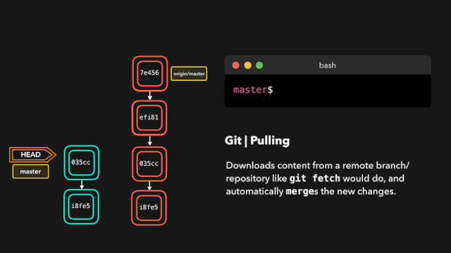

---
nav:
    title: DevOps系列
    path: /DevOps
    order: 7
title: 拉取 git pull
order: 18

group:
  path: /git
  title: git
  order: 9
---

# 拉取 git pull

> Fetch from and integrate with another repository or a local branch
>
> 用于从另一个存储库或本地分支获取并集成（整合）。



## 获取版本修改记录

```bash
# 更新本地仓库至最新改动
git pull

# 当本地分支与远程分支没有共同祖先
git pull --rebase origin master
```
