# Jenkins 工作实战笔记整理

## 一、Jenkins介绍

**简单历史**


Jenkins的前身是Hudson，采用JAVA编写的持续集成开源工具。Hudson由Sun公司在2004年启动，第一个版本于2005年在java.net发布。2007年开始Hudson逐渐取代CruiseControl和其他的开源构建工具的江湖地位。在2008年的JavaOne大会上在开发者解决方案中获得杜克选择大奖（Duke's Choice Award）。

在2010年11月期间，因为Oracle对Sun的收购带来了Hudson的所有权问题。主要的项目贡献者和Oracle之间，尽管达成了很多协议，但有个关键问题就是商标名称“Hudson”。甲骨文在2010年12月声明拥有该名称并申请商标的权利。  因此，2011年1月11日，有人要求投票将项目名称从“Hudson”改为“Jenkins”。2011年1月29日，该建议得到社区投票的批准，创建了Jenkins项目。

2011年2月1日，甲骨文表示，他们打算继续开发Hudson，并认为Jenkins只是一个分支，而不是重命名。因此，Jenkins和Hudson继续作为两个独立的项目，每个都认为对方是自己的分支。到2013年12月，GitHub上的Jenkins拥有567个项目成员和约1,100个公共仓库，与此相对的Hudson有32个项目成员和17个公共仓库。到现在两者的差异更多，应该说Jenkins已经全面超越了Hudson。此外，大家可能是出于讨厌Oracle的情绪，作为Java开发者天然地应该支持和使用Jenkins。

后面Hudson被Oracle捐给了Eclipse基金会，所以右边这老头有个Eclipse的光环加持。

为什么Jenkins更受大家欢迎。

由开发者主导、面向开发者 


首先，曾经是Hudson开发人员中的99%都转向了Jenkins的开发，其中包括最初的创建者川口清子（Kohsuke  Kawaguchi）。他独自写了大部分代码，并且他的经验是Hudson各种高级特性的关键来源。Jenkins的开发社区更活跃。所以对很多人而言，从血统上看Hudson是后娘养的，Jenkins才是亲生的！

 治理和社区 

Jenkins开发社区的管理是很开放的。 有一个独立的董事会，其中包括来自Yahoo!,  CloudBees，Cloudera和Apture等多家公司的长期以来的Hudson开发人员。每次会议后，他们定期举行治理会议并发表意见，征询公众意见。他们还将所有代码都捐赠给公共利益软件组织（SPI），以确保社区持续开放。

 稳定性 

分手后，针对Jenkins的贡献不断持续增加，Jenkins制定了新的长期支持发布线。社区定大约每三个月发布一次稳定版本的补丁。

 插件的平台 

Jenkins支持超过1000个插件。凭借多样而强大的插件Jenkins成了整个开发生命周期中的一个中心点。

到了2017年，两者的发展差异更大了。Jenkins应该说是CI工具中公认的老大，而Hudson不仅不能与Jenkins比，跟其他CI工具比也没什么优势，完全沉沦了。

slant网站对一系列CI工具做了一次对比，其中Jenkins和Hudson的情况如下。

 1、基本面问题 

| 工具               | Jenkins | Hudson |
| ------------------ | ------- | ------ |
| 最好的CI工具       | 1       | 22     |
| 最好的JAVA CI工具  | 1       | 7      |
| 最好的自托管CI工具 | 3       | 4      |

 2、其他支持 

| 工具                     | Jenkins | Hudson |
| ------------------------ | ------- | ------ |
| 对Window支持最好         | 1       | 无排名 |
| 最好的开源CI工具         | 1       | 无排名 |
| 对BitBucket的支持        | 2       | 无排名 |
| 对移动开发者支持最好的CI | 4       | 无排名 |

 3、更多特征 

| Jenkins                                                       | Hudson                                    |
| ------------------------------------------------------------- | ----------------------------------------- |
| 免费且开源                                                    | 与Jenkins共享了很多代码，安装还是挺简单的 |
| 关键的环境变量可以安全存储                                    |                                           |
| 支持多个SCM，包括SVN, Mercurial, Git。集成了GitHub和Bitbucket |                                           |
| 高度可配置                                                    |                                           |
| 资源和教程很多                                                |                                           |
| 安装运行简单                                                  |                                           |
| 分布式的构建也能高效运行                                      |                                           |
| 可跨平台部署                                                  |                                           |
| 很多高质量的插件                                              |                                           |
| 得奖无数                                                      |                                           |
| 庞大的社区                                                    |                                           |


#### 1、Jenkins 功能

- 持续的软件版本发布/测试项目。
- 监控外部调用执行的工作。

#### 3、Jenkins 概念

Jenkins是一个功能强大的应用程序，允许**持续集成和持续交付项目**，无论用的是什么平台。这是一个免费的开源项目，可以处理任何类型的构建或持续集成。集成Jenkins可以用于一些测试和部署技术。Jenkins是一种软件允许持续集成。

#### 4、Jenkins 目的

- 持续、自动地构建/测试软件项目。


- 监控软件开放流程，快速问题定位及处理，提提高开发效率。


#### 5、Jenkins 特性

- 开源的java语言开发持续集成工具，支持CI，CD。


- 易于安装部署配置：可通过yum安装,或下载war包以及通过docker容器等快速实现安装部署，可方便web界面配置管理。


- 消息通知及测试报告：集成RSS/E-mail通过RSS发布构建结果或当构建完成时通过e-mail通知，生成JUnit/TestNG测试报告。


- 分布式构建：支持Jenkins能够让多台计算机一起构建/测试。


- 文件识别:Jenkins能够跟踪哪次构建生成哪些jar，哪次构建使用哪个版本的jar等。


- 丰富的插件支持:支持扩展插件，你可以开发适合自己团队使用的工具，如git，svn，maven，docker等。


#### 6、产品发布流程

产品设计成型 -> 开发人员开发代码 -> 测试人员测试功能 -> 运维人员发布上线


- 持续集成（Continuous integration，简称CI）


- 持续交付（Continuous delivery）


- 持续部署（continuous deployment） 

## 二、Jenkins CI/CD 流程

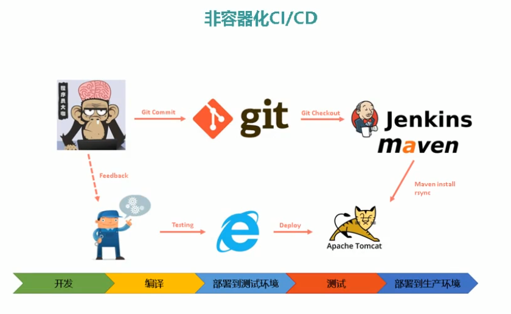

说明：这张图稍微更形象一点，上线之前先把代码git到版本仓库，然后通过Jenkins将Java项目通过maven去构建，这是在非容器之前，典型的自动化的一个版本上线流程。那它有哪些问题呢？

如：它的测试环境，预生产环境，测试环境。会存在一定的兼容性问题 （环境之间会有一定的差异） 


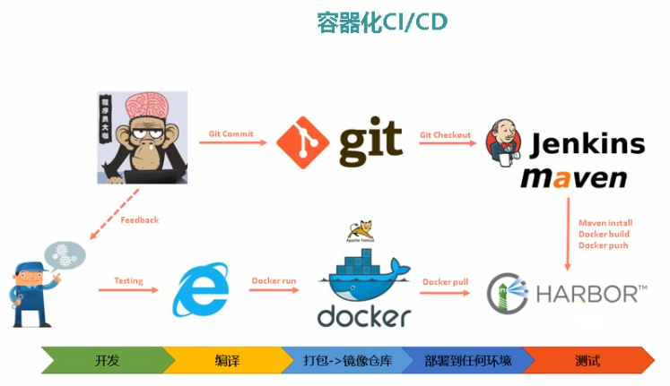

 

说明：它这里有一个docker harbor 的镜像仓库，通常会把你的环境打包为一个镜像，通过镜像的方式来部署。

## 三、部署Jenkins 

| IP         | 主机名     |
| ---------- | ---------- |
| 172.16.1.2 | jenkins    |
| 172.16.1.3 | web        |
| 172.16.1.4 | git/gitlab |

### 1、部署GIT

IP：172.16.1.4，git 服务器进行如下操作

#### 1、安装 git

```shell
[root@qfedu.com ~]# yum install -y git
```

创建git用户并设置密码为123456（为开发人员拉代码时设置的用户）

```shell
[root@qfedu.com ~]# useradd git
[root@qfedu.com ~]# passwd git
```

#### 2、创建仓库

```shell
[root@qfedu.com ~]# su - git  #切换到git用户下
[git@qfedu.com ~]$ mkdir -p repos/app.git  #在git用户家目录下创建一个repos目录，repos目录下创建各个项目的目录
[git@qfedu.com ~]$ cd repos/app.git
[git@qfedu.com ~]$ git --bare init #初始化仓库，如果不初始化，这仅仅就只是一个目录
#查看初始化后仓库信息
[git@qfedu.com app.git]$ ls -a
. .. branches config description HEAD hooks info objects refs
```

配置完仓库后，我们需要找一台机器测试是否能够成功从仓库中拉取代码，或者上传代码到该仓库。

IP：172.16.1.5，web服务器进行测试

#### 3、安装 git 客户端 

拉取代码

```shell
[root@qfedu.com ~]# yum install -y git   #首先还是安装git
[root@qfedu.com ~]# mkdir -p test
[root@qfedu.com ~]# cd test
[root@qfedu.com test]# git clone git@172.16.1.4:/home/git/repos/app.git  ##测试clone远端git仓库
[root@qfedu.com test]# ls 
app
```

#### 4、push 测试

```shell
[root@qfedu.com app]# touch index.html
[root@qfedu.com app]# git add .
[root@qfedu.com app]# git commit -m "test" 
#第一次的话会有报错警告，说让配置邮箱和姓名。配置一下即可，或者直接执行给出的命令执行即可。
[root@qfedu.com app]# git push origin master #提交到主分支（默认分支）
```

测试成功！

#### 5、补充：配置免秘钥

##### 1、172.16.1.5 服务器生成公钥

```shell
[root@qfedu.com ~]# ssh-keygen
[root@qfedu.com ~]# cat /root/.ssh/id_rsa.pub 
ssh-rsa AAAAB3NzaC1yc2EAAAADAQABAAABAQDmmIOOJCRjlcNyM9zQ4yNeSFgJhBYZUTHMJ3D6sy6IgyOQi/LW9IzBF8mVjmc9wBzQBzg9obCJ/2YiGtvgl00v8A6Clamx6XdQpHPbnVcgHznhEhaa5X0TONcyJ0/z9e8wdppafAsrgRYdpRcXfrPC7xlzDIRpjgWG9YEMzrqCDcWAoWLMYvr2GHwhFyJa5OpMNGH5NjaWJbzYlgdP5cwh/QX04xVZ0QKghQsol9HmbRbqJ8Hl8WrgDoy2BPE41XKEwR4drgUGCFXZDH4s9ZodC4zI76TWIyCeKKM0XbTNHRU6Cb6xWb/iFhpsa7m14A5usUH6RfIjzJBr3IcyUkk3 root@qfedu.com
```

##### 2、172.16.1.4 git 服务器进行配置

```shell
[git@qfedu.com ~]$ mkdir -p .ssh
[git@qfedu.com ~]$ chmod 700 .ssh/  # 给予目录700权限
[git@qfedu.com ~]$ vi .ssh/authorized_keys  # 写入172.16.1.5服务器的公钥
ssh-rsa AAAAB3NzaC1yc2EAAAADAQABAAABAQDmmIOOJCRjlcNyM9zQ4yNeSFgJhBYZUTHMJ3D6sy6IgyOQi/LW9IzBF8mVjmc9wBzQBzg9obCJ/2Yi
Gtvgl00v8A6Clamx6XdQpHPbnVcgHznhEhaa5X0TONcyJ0/z9e8wdppafAsrgRYdpRcXfrPC7xlzDIRpjgWG9YEMzrqCDcWAoWLMYvr2GHwhFyJa5OpM
NGH5NjaWJbzYlgdP5cwh/QX04xVZ0QKghQsol9HmbRbqJ8Hl8WrgDoy2BPE41XKEwR4drgUGCFXZDH4s9ZodC4zI76TWIyCeKKM0XbTNHRU6Cb6xWb/i
Fhpsa7m14A5usUH6RfIjzJBr3IcyUkk3 root@qfedu.com
[git@qfedu.com ~]$ chmod 600 .ssh/authorized_keys  # 给予文件600权限
```

### 2、Jenkins 安装配置

#### 1、jenkins 安装

官网： [https://jenkins.io](https://jenkins.io/)

插件：http://updates.jenkins-ci.org/download/plugins/

##### 1、安装 java 环境（jenkins 依赖 java 环境）

```shell
[root@qfedu.com tools]# ls                 # 查看解压包
jdk-8u45-linux-x64.tar.gz
[root@qfedu.com tools]# tar zxf jdk-8u45-linux-x64.tar.gz    # 解压
[root@qfedu.com tools]# mv jdk1.8.0_45/ /usr/local/jdk1.8    # 移动至指定目录
[root@qfedu.com tools]# vim /etc/profile    # 配置环境变量
JAVA_HOME=/usr/local/java
export MAVEN_HOME=/usr/local/maven
export JRE_HOME=/usr/local/java/jre
export CLASSPATH=.:$JAVA_HOME/lib:$JRE_HOME/lib:$CLASSPATH
export PATH=$JAVA_HOME/bin:$JRE_HOME/bin:$MAVEN_HOME/bin:$PATH
[root@qfedu.com tools]# source /etc/profile  # 配置生效
[root@qfedu.com tools]# java -version        # 查看java版本
java version "1.8.0_45"
Java(TM) SE Runtime Environment (build 1.8.0_45-b14)
Java HotSpot(TM) 64-Bit Server VM (build 25.45-b02, mixed mode)
```

##### 2、yum 安装 jenkins

```shell
[root@qfedu.com ~]# cd
# 导入jenkins源
[root@qfedu.com ~]# rpm --import https://pkg.jenkins.io/redhat-stable/jenkins.io.key
# 导入jenkins官方证书
[root@qfedu.com ~]# yum install -y jenkins
# 安装jenkins（安装的是最新的LTS版本）

[root@qfedu.com ~]# rpm -ql jenkins   # 查看yum都安装了哪些东西
/etc/init.d/jenkins
/etc/logrotate.d/jenkins
/etc/sysconfig/jenkins
/usr/lib/jenkins
/usr/lib/jenkins/jenkins.war
/usr/sbin/rcjenkins
/var/cache/jenkins
/var/lib/jenkins
/var/log/jenkins
```

#### 2、配置文件

##### 1、查询 yum 下载 Jenkins 安装的文件

```shell
[root@qfedu.com ~]# rpm -ql jenkins
/etc/init.d/jenkins         # 启动文件
/etc/logrotate.d/jenkins    # 日志分割配置文件
/etc/sysconfig/jenkins      # jenkins主配置文件
/usr/lib/jenkins            # 存放war包目录
/usr/lib/jenkins/jenkins.war   # war 包 
/usr/sbin/rcjenkins         # 命令
/var/cache/jenkins          # war包解压目录 jenkins网页代码目录
/var/lib/jenkins            # jenkins 工作目录
/var/log/jenkins            # 日志
```

##### 2、修改配置文件

**配置文件说明**：

```shell
[root@qfedu.com ~]# grep "^[a-Z]" /etc/sysconfig/jenkins
JENKINS_HOME="/var/lib/jenkins"    # jenkins工作目录
JENKINS_JAVA_CMD=""
JENKINS_USER="jenkins"             # jenkinx启动用户
JENKINS_JAVA_OPTIONS="-Djava.awt.headless=true"
JENKINS_PORT="8080"                # 端口
JENKINS_LISTEN_ADDRESS=""
JENKINS_HTTPS_PORT=""
JENKINS_HTTPS_KEYSTORE=""
JENKINS_HTTPS_KEYSTORE_PASSWORD=""
JENKINS_HTTPS_LISTEN_ADDRESS=""
JENKINS_DEBUG_LEVEL="5"
JENKINS_ENABLE_ACCESS_LOG="no"
JENKINS_HANDLER_MAX="100"          # 最大连接
JENKINS_HANDLER_IDLE="20"
JENKINS_ARGS=""
```

##### 3、启动 jenkins

- 首先需要修改一下启动脚本，文件在/etc/init.d/jenkins


- 因为jenkins的启动脚本默认java路径为：/usr/bin/java


- 但是我们新安装的java路径并不是在这个，所以我们需要新添加路径。如图下所示：


- 新路径地址为：/usr/local/jdk1.8/bin/java


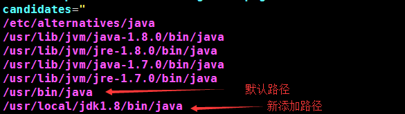

接下来启动：

```shell
[root@qfedu.com ~]# systemctl start jenkins
```

#####  3、验证安装

```shell
[root@qfedu.com ~]# ps -ef|grep jenkins
jenkins   16037      1  1 16:20 ?        00:00:13 /usr/local/jdk1.8/bin/java -Dcom.sun.akuma.Daemon=daemonized -Djava.awt.headless=true -DJENKINS_HOME=/var/lib/jenkins -jar /usr/lib/jenkins/jenkins.war --logfile=/var/log/jenkins/jenkins.log --webroot=/var/cache/jenkins/war --daemon --httpPort=8080 --debug=5 --handlerCountMax=100 --handlerCountMaxIdle=20
root      16107   1215  0 16:39 pts/1    00:00:00 grep --color=auto jenkins
[root@qfedu.com ~]# netstat -lnutp|grep jenkins
[root@qfedu.com ~]# netstat -lnutp|grep 8080
tcp6       0      0 :::8080                 :::*                    LISTEN      16037/java
```

#### 3、jenkins配置（web页面）

##### 1、管理员密码获取

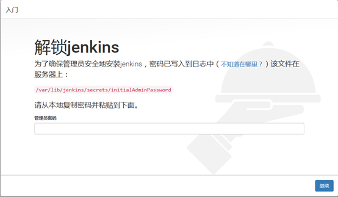

```shell
[root@qfedu.com ~]# cat /var/lib/jenkins/secrets/initialAdminPassword
5d3f57bea6e546139fc48ea28f9d5ae5
```

##### 2、安装插件 （选择在线安装）

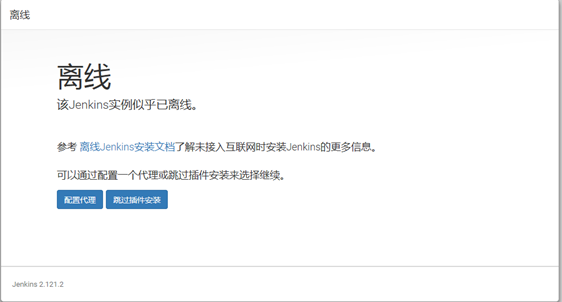

出现离线安装解决方法：

###### 1、修改 /var/lib/jenkins/updates/default.json

jenkins 在下载插件之前会先检查网络连接，其会读取这个文件中的网址。默认是访问谷歌，肯定监测失败，所以将图下的google改为[www.baidu.com](http://www.baidu.com/)即可，更改完重启服务。

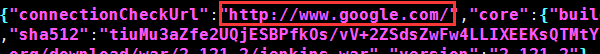

###### 2、 修改/var/lib/jenkins/hudson.model.UpdateCenter.xml

该文件为jenkins下载插件的源地址，改地址默认jenkins默认为：https://updates.jenkins.io/update-center.json，就是因为https的问题，此处我们将其改为http即可，之后重启jenkins服务即可。

其他国内备用地址（也可以选择使用）：

https://mirrors.tuna.tsinghua.edu.cn/jenkins/updates/update-center.json

http://mirror.esuni.jp/jenkins/updates/update-center.json

在修复完之后，我们发现离线问题已经解决

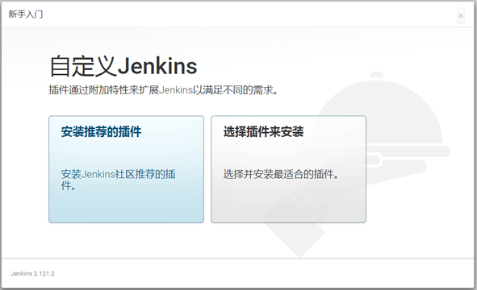


选择安装推荐的插件：

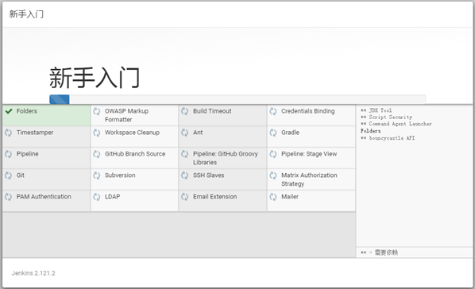

##### 3、创建第一个管理员用户

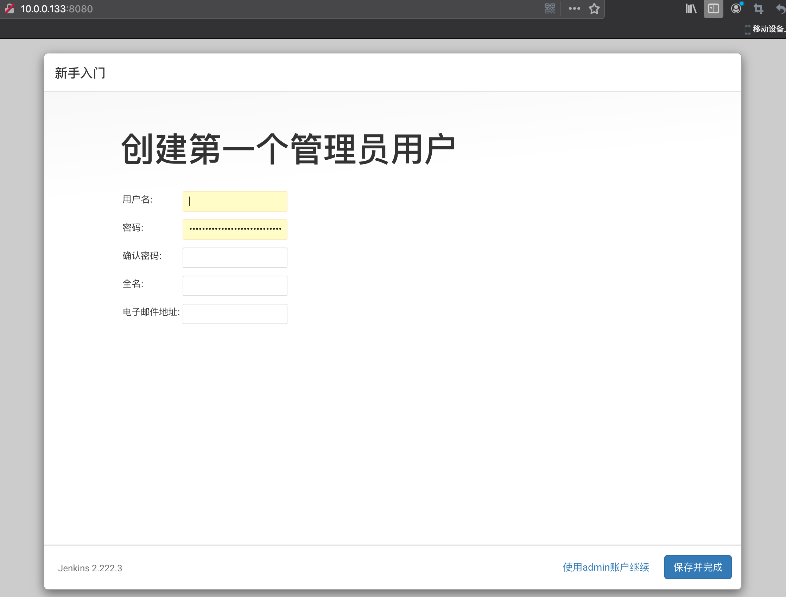

##### 4、url 配置

之前版本没有这个选项，这里默认即可:

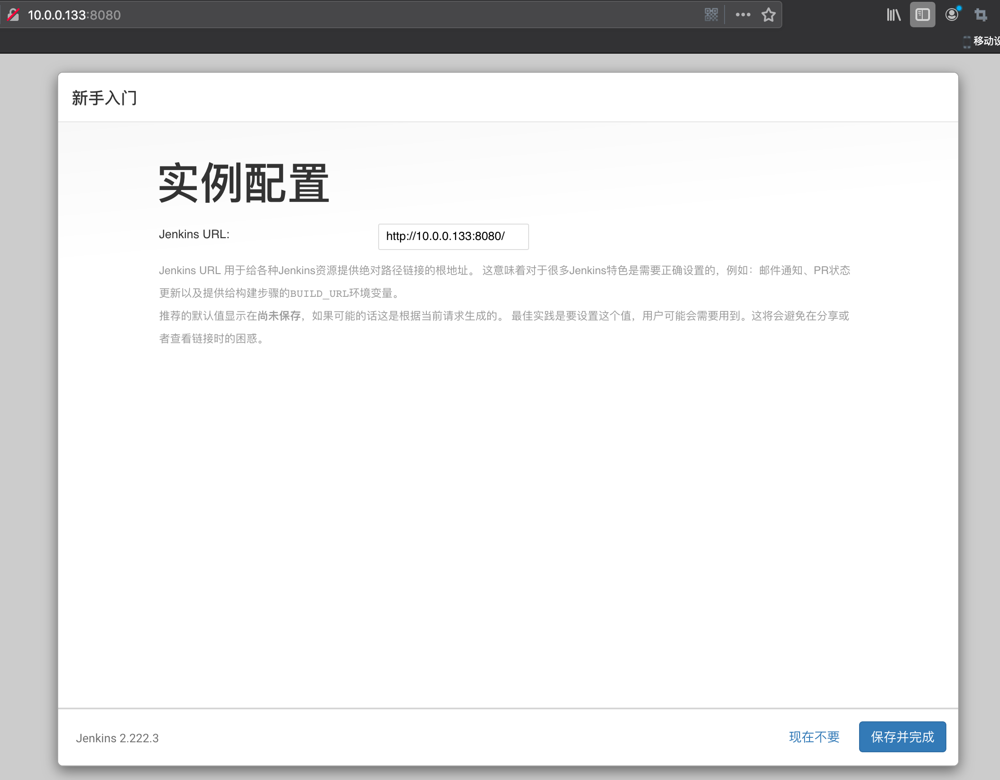

##### 5、安装完成

出现如下页面时，表示安装完成

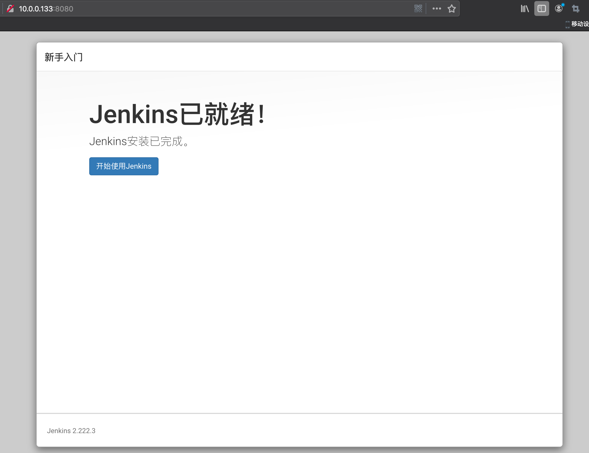


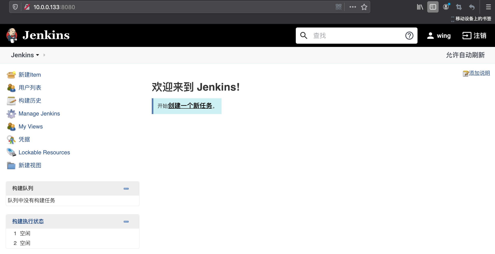

这里面有很多配置，下面我们只介绍我们要用到的要修改的配置（之后案例会用到的）。我们不需要全部都配置，等需要什么的时候再去研究一下即可。

##### 6、配置 jdk、git、maven

系统管理->全局工具配置

jdk：可以自动安装，但是我们已经安装了，这里写入我们jdk的路径即可

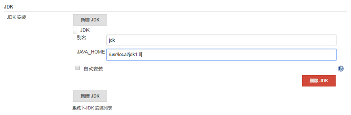

git:

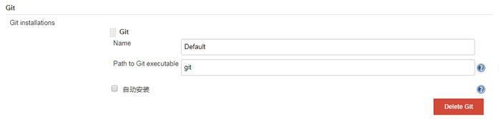

maven：

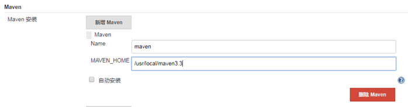

##### 7、jenkins 下载插件失败处理办法

jenkins 下载插件失败,提示：

```shell
java.io.IOException: Downloaded file /app/jenkins_home/plugins/jacoco.jpi.tmp does not match expected SHA-1, expected 'CtK02wHdFOxTutqhUQzmue6uvpg=', actual 'YGO05utKyaaFzpGCgCE95GS0WsU='
    at hudson.model.UpdateCenter.verifyChecksums(UpdateCenter.java:1783)
    at hudson.model.UpdateCenter.access$1100(UpdateCenter.java:147)
    at hudson.model.UpdateCenter$InstallationJob.replace(UpdateCenter.java:1934)
    at hudson.model.UpdateCenter$UpdateCenterConfiguration.install(UpdateCenter.java:1178)
    at hudson.model.UpdateCenter$DownloadJob._run(UpdateCenter.java:1653)
    at hudson.model.UpdateCenter$InstallationJob._run(UpdateCenter.java:1848)
    at hudson.model.UpdateCenter$DownloadJob.run(UpdateCenter.java:1624)
    at java.util.concurrent.Executors$RunnableAdapter.call(Executors.java:511)
    at java.util.concurrent.FutureTask.run(FutureTask.java:266)
    at hudson.remoting.AtmostOneThreadExecutor$Worker.run(AtmostOneThreadExecutor.java:110)
    at java.lang.Thread.run(Thread.java:745)
```

中国源的问题。需要换个源就可，换源方法：

jenkins->系统管理->管理插件->高级
选择升级站点

把：http://updates.jenkins-ci.org/update-center.json

换成：http://mirror.esuni.jp/jenkins/updates/update-center.json

镜像地址查询：

http://mirrors.jenkins-ci.org/status.html 

## 四、使用Jenkins

### 1、Jenkins 用户权限管理

#### 1、 用户管理背景

针对开发、运维、测试针对不同角色进行不同权限划分，

基于插件： Role-based Authorization Strategy ，Authorize Project 来实现。

#### 2、 安装用户管理插件

安装该插件：

系统管理->管理插件-可选插件->搜索该插件选中直接安装即可。

 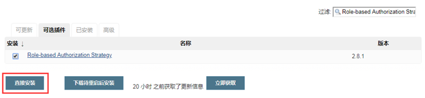

#### 3、 开启该插件功能

系统管理->全局安全设置-授权策略->选中该插件功能即可->保存

 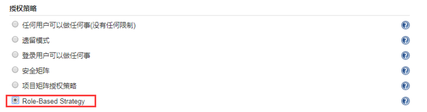

#### 4、 验证用户管理

关闭用户管理功能来进行实践测试

##### 1、策略改回原来的（全局安全配置）

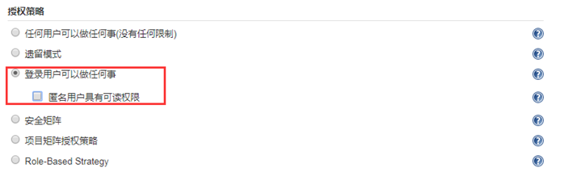

##### 2、开启允许用户注册（全局安全配置）

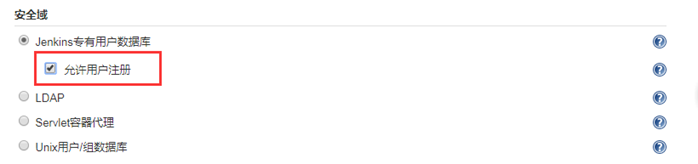

##### 3、注册一个新用户

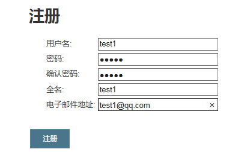

##### 4、登录之后，其默认就是管理员用户，可以进行任何操作

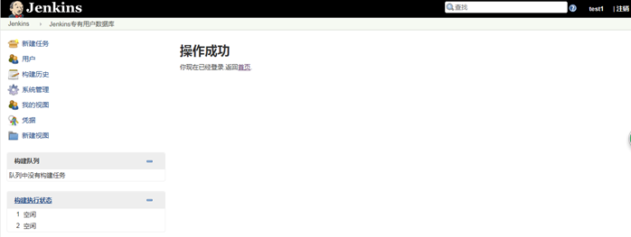

##### 5、开启 Role-Based Strategy

##### 6、重新登录新创建 test1 用户，显示已经没有任何权限了

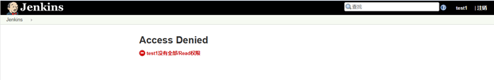

#### 5、 权限划分

安装 Role-Based Strategy 插件后，**系统管理** 中多了如图下所示的一个功能，用户权限的划分就是靠他来做的。


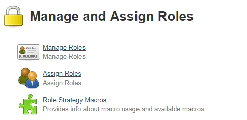

##### 1、Manage Roles（管理角色）

- Manage Roles：管理角色，相当于针对角色赋予不同权限，然后在将该角色分配给用户。角色就相当于一个组。其里面又有Global roles（全局）、Project roles（项目）、Slave roles（），来进行不同划分。


默认如图下所示：

 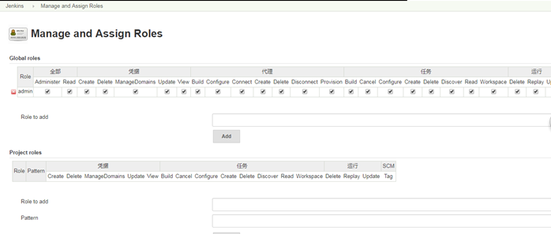

###### 1、Global roles

默认是有一个admin用户的，是所有权限都有的，所有权限都是勾选了的。

接下来我们来添加一个角色：user

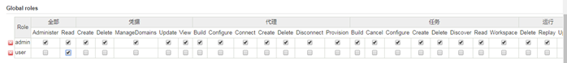

给其一个读的权限。

###### 2、Project roles

- roles to add：表示项目角色


- Pattern：是用来做正则匹配的（匹配的内容是Job(项目名)），比如说根据正则匹配到的项目项目角色就都有权限；


接下来新建一个 ItemA 项目角色，改项目角色一般给其构建、取消、读取、读取空间权限，一般配置这4个即可

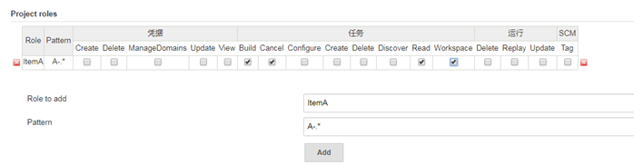

还可以在新建一个 ItemB 项目角色：

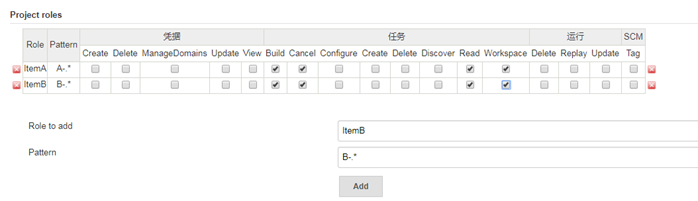

- Slave roles（奴隶角色）：节点相关的权限


- roles to add：表示项目角色


- Pattern：是用来做正则匹配的（匹配的内容是节点(slavej节点）），比如说根据正则匹配到的项目项目角色就都有权限；


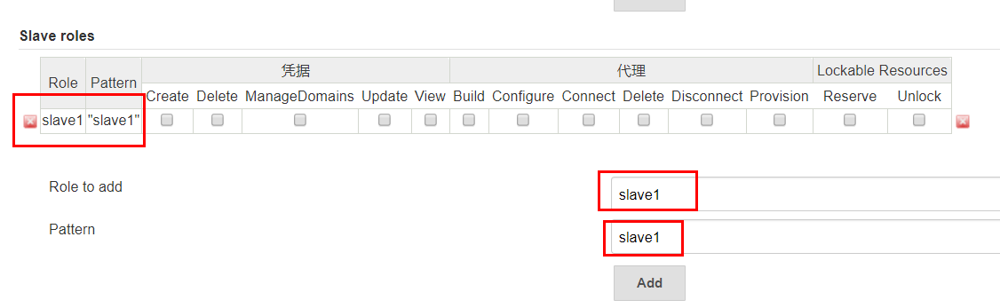

##### 2、Assigin roles（分配角色）

###### 1、给予test1用户分配 user 角色

这样其就有 manage roles 中刚才创建的user角色的权限了。

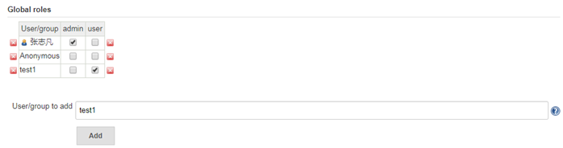

此时再去看 test1用户，已有查看的权限了

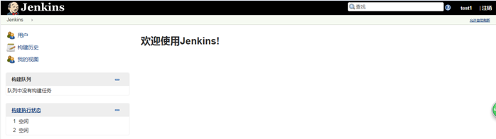

###### 2、针对指定用户分配项目角色（一般最常用的就是针对不同用户进行项目角色分配）

比如将test1用户分配有 ItemA 项目角色，这样其就可以有刚才我们创建的 ItemA 项目角色正则匹配到的项目的权限了。

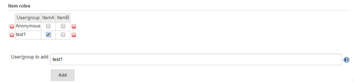

test2 也为其分配一个 ItemB 项目角色

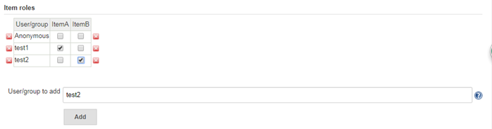

此时可以在 test1 用户这里看到 ItemA 项目角色所匹配到的项目 A-web1

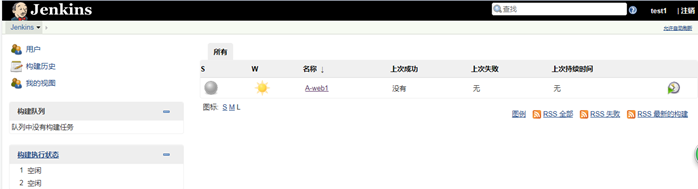

新建一个B-web1项目，同理 test2 用户这里看到I temB 项目角色所匹配到的项目B-web1

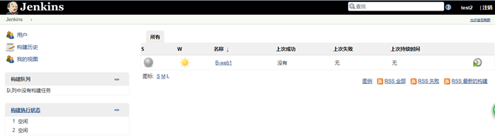

为了方便项目管理，可以对不同项目进行分类（借助视图）：

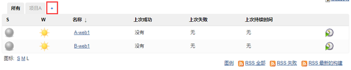

分类完如图下所示：

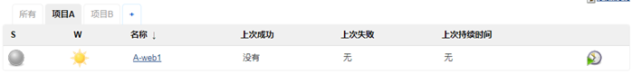


### 2、Jenkins 参数化构建

#### 1、 参数化构建背景

 如果只是简单的构建，jenkins自己默认的插件可以做，但是如果我们想要在构建过程中有更多功能，比如说：选择性构建、传参、项目指定变量等等其他功能，基础的参数化构建可以实现一些简单功能，但是要想使用更多功能这时候我们就需要借助参数化构建来实现交互的功能。此处我们来借助以下插件来进行实现：

- Extended Choice Parameter（更丰富的参数化构建插件）


- Git Parameter


#### 2、安装插件

首先还是安装该插件，去管理插件里面进行安装 Extended Choice Parameter

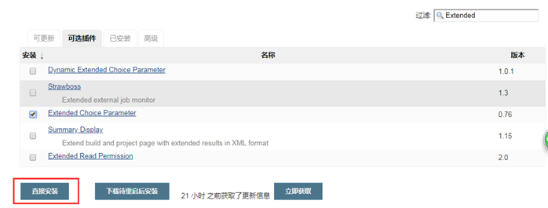


##### 1、项目配置

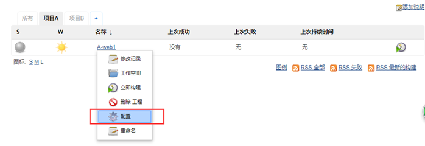

##### 2、选择安装过的插件

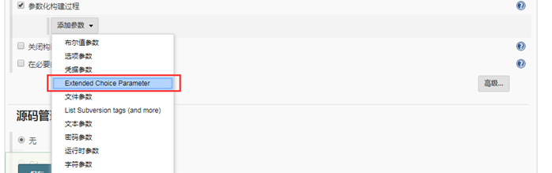

##### 3、进行配置

​                                                             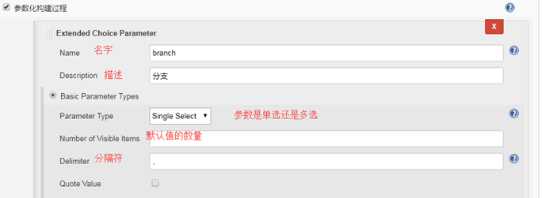

这里这个branch 我们就相当于给其当做一个变量，然后来为其进行传参。

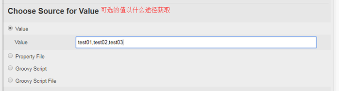

##### 4、构建选择执行shell进行测试

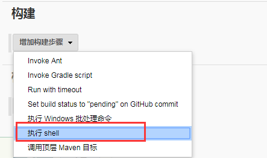

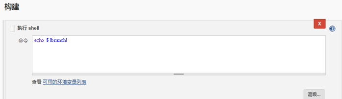

##### 5、参数化配置已经生效

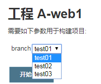

##### 6、构建 test02

可以发现控制台的输出也是成功了的

<!--  -->

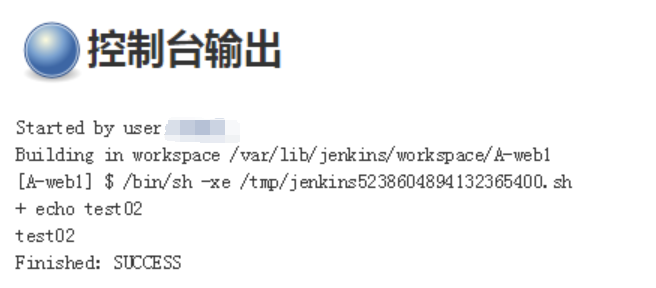

##### 7、数据来源选择文件

在jenkins所在服务器进行如下操作：

```shell
[root@qfedu.com ~]# vim /opt/jenkins.property   # 建立一个文件
abc=t1,t2,t3,t4
```

 web 端配置：

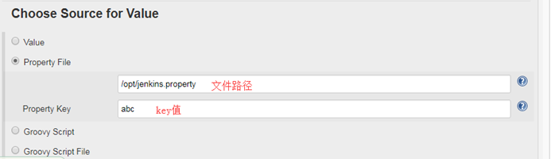

进行测试：

构建前：（可以发现也是生效的）

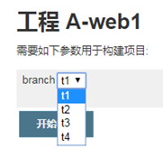

构建后查看结果：（也是成功的）

<!--  -->

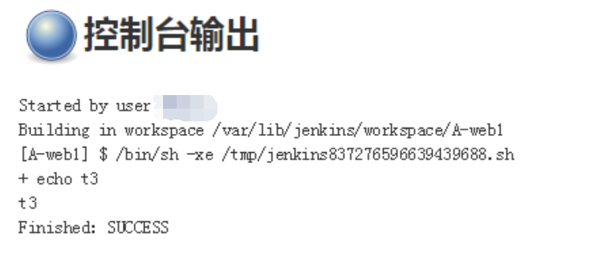

#### 3、Git 插件

再用 git 时使用该插件是非常方便的。

##### 1、安装插件 Git Parameter

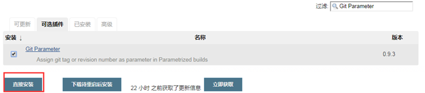

##### 2、进行配置

在配置之前我们先来说一个坑，当我们在配置git中写了远端地址后，会有如下报错：

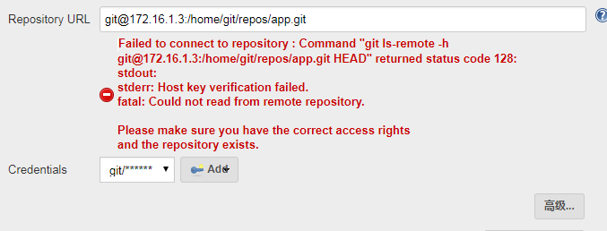

这是因为 jenkins 我们 yum 装的运行用户是 jenkins 用户，此处是 jenkins 用户去 git 仓库进行拉取，而 jenkins 用户的话默认是 /bin/false 的，不但不能登录，也没有 git 命令权限，所以肯定是失败的。

解决此问题两种办法：

- 更改jenkins用户为root用户；


- 更改jenkins用户为正常的普通用户/bin/bash，将其的公钥加入到git服务器的git用户中。


此处暂时先用第一种解决办法，更改 jenkins 的运行用户为 root 用户，通过如下方式进行更改：

- 将/etc/sysconfig/jenkins文件由改为


- 然后再重启即可。


##### 3、进行相关配置


##### 4、配置 git 仓库


凭据这里有两种方式：

第一种：选择无

- 其实就是基于免秘钥的。


第二种：用户（其实就是git用户）


当构建时给一个选择列表，这个变量是代表分支。有哪些分支传递给这个变量。


##### 5、进行构建

###### 1、列表中已经有了可选的分支


###### 2、构建成功

<!--  -->


###### 3、新建分支增添内容再来验证插件

```shell
[root@qfedu.com app]# git branch 
* master
[root@qfedu.com app]# git branch test
[root@qfedu.com app]# git checkout test
Switched to branch 'test'
[root@qfedu.com app]# git branch
  master
* test
[root@qfedu.com app]# touch a
[root@qfedu.com app]# git add .
[root@qfedu.com app]# git commit -m "a"
[test c286460] a
 1 file changed, 0 insertions(+), 0 deletions(-)
 create mode 100644 a
[root@qfedu.com app]# git push origin test
Counting objects: 3, done.
Compressing objects: 100% (2/2), done.
Writing objects: 100% (2/2), 231 bytes | 0 bytes/s, done.
Total 2 (delta 0), reused 0 (delta 0)
To git@172.16.1.3:/home/git/repos/app.git
 * [new branch]      test -> test
```

###### 4、jenkins 构建查看


可以发现已经有了我们新建的分支。

构建成功！！


### 3、Jenkins Master-Slave 架构


- jenkins的Master-slave分布式架构主要是为了解决jenkins单点构建任务多、负载较高、性能不足的场景。


- Master/Slave相当于Server和agent的概念。Master提供web接口让用户来管理job和slave，job可以运行在master本机或者被分配到slave上运行构建。一个master（jenkins服务所在机器）可以关联多个slave用来为不同的job或相同的job的不同配置来服务。


#### 1、安装

**前提：slave 所在服务器必须有 java环境**

jenkins web 端进行操作：

系统管理->管理节点->新建节点

1、进行基础配置

配置选项中的内容是可变的，根据情况来


注意这里需要配置凭据，也就是配置slave所在服务器用户和密码


之后保存，如果无误的话就会直接启动了，如图下所示是有问题的

 

通过看输出日志，发现是 jdk 的问题，一般来说，其会判断 slave 所在服务器有没有 jdk，如果有就会进行检测，如下图所示，就是没有检查到（因为jdk是我们自己装的，路径并不是默认的路径）。


没有检查到的话其就会去oracle官网下载，来为 slave 所在服务器进行安装，但是因为中国的原因，被墙了，所以也会下载失败，最终就导致彻底失败了，失败如图下：

 

有两种方法解决：推荐方法1：

方法1：

在配置时高级的选项里指定java路径：如下图所示：


方法2：

为 java 路径做一个软链接，保证 jenkins 可以检测到 java。

```shell
[root@qfedu.com ~]# ln -s /usr/local/jdk1.8/bin/java /usr/bin/java
[root@qfedu.com ~]# ll /usr/bin/java 
lrwxrwxrwx 1 root root 26 Jul 25 17:33 /usr/bin/java -> /usr/local/jdk1.8/bin/java
```

 之后在看已经成功了！


并且也可以在 slave 所在服务器看到：


jar 包就是负责接收 master 任务的。

#### 2、配置

在项目 job 中进行配置：

可通过标签或者名称进行匹配（标签可在安装时配置）


#### 3、构建


可以发现控制台的日志，其也是 slave 构建的


之后查看构建完的工作目录，也有预想中的文件。


这样基本上就实现了借助 jenkins 的 slave 去构建 job了。

目前是在 slave 构建也在 slave 上部署，之后我们可以通过脚本，比如借助 rsync、ansible 等部署在其他服务器上。

#### 4、扩展

可以为slave服务器在配置时候加上标签，这样也会方便我们选择，用法也不单单局限在一台服务器上，可以让多台 slave 去竞选。

### 4、Jenkins pipeline

#### 1、概览


#### 2、安装

在对 jenkins 进行初始化安装时，默认已经安装了 jenkins 的相关插件，如下图所示：


#### 3、实操

##### 1、新建任务


##### 2、编写 pipeline 脚本


可以借助流水线语法去做。

test 流水线脚本：

```shell
node {
   def mvnHome
   stage('git checkout') { #for display purposes
        checkout([$class: 'GitSCM', branches: [[name: '*/master']], doGenerateSubmoduleConfigurations: false, extensions: [], submoduleCfg: [], userRemoteConfigs: [[url: 'git@172.16.1.3:/home/git/repos/app.git']]])
   }
   stage('maven Build') {
        echo "maven build........."
   }
   stage('deploy') {
        echo "deploy..........."
   }
   stage('test') {
        echo "test..........."
   }
}
```

##### 3、构建测试


可以去服务器上验证一下（git checkout）刚才拉取下来的代码：


 

补充：

- 可以从代码版本管理仓库中读取 pipeline 脚本（相当于将 pipeline 脚本放在仓库中）我们可以选择git。


- 首先需要将 pipeline 脚本提交到我们新建的 git仓库中（步骤再此忽略。）


jenkins 项目中需要进行如下配置：

其中脚本路径的配置，一定要和版本仓库中的路径相一致。


之后如果要更改步骤，不需要再更改 jenkins 的步骤，直接更改文件即可。

补充：

此外之前的测试一直是在 master上构建的，我们还可以通过在 jenkinsfile 中指定节点在相应节点去构建

具体在 jenkinsfile 的 node 后进行指定：

如下图所示：


格式为：node ("节点名称")

**具体配置详解请参考** https://jenkins.io/doc/book/pipeline/

### 5、Jenkins 构建邮件状态通知

#### 1、 前提

前提：服务器开启邮箱服务


#### 2、 基础配置

需要安装一个插件：

插件： Email Extension Plugin

进行配置：

系统管理->系统设置->相关配置如下图：


可以在此处进行测试发送！检验配置是否正确


#### 3、 配置到项目中

在项目的配置中选择构建后操作


选择我们对应的插件


填写发件人信息


配置构建成功发送邮件


控制台也有邮件发送成功输出


检查实际是否接收到邮件


### 6、Jenkins 流水线自动化发布PHP项目

#### 1、前提

**环境为**：lnmp

**PHP项目**：wordpress（此处我们下载一个wordpress的源码。将其模拟为我们的代码上传到我们的git仓库）

```shell
[root@qfedu.com ~]# git config --global user.name "Administrator"
[root@qfedu.com ~]# git config --global user.email '18611142071@163.com'
[root@qfedu.com ~]# git status
[root@qfedu.com ~]# git clone git@192.168.152.138:plat-sp/wordpress.git
[root@qfedu.com ~]# tar xf wordpress-5.2.1.tar.gz
[root@qfedu.com ~]# cd wordpress
[root@qfedu.com ~]# mv /root/wordpress/* .
[root@qfedu.com ~]# git add .
[root@qfedu.com ~]# git commit -m 'new1'
[root@qfedu.com ~]# git push  -u origin master
```

**部署节点**： node 节点需要在系统管理中配置节点

#### 2、配置

##### 1、创建job


##### 2、参数化构建


##### 3、配置pipeline脚本 （直接配置或者git获取）


##### 4、保存

#### 3、编写 jenkinsfile

接下里编写jenkinsfile文件：

jenkinsfile-PHP：

源码文件：

```shell
node ("jenkins-slave2") {
   stage('git checkout') {
       checkout([$class: 'GitSCM', branches: [[name: '${branch}']], doGenerateSubmoduleConfigurations: false, extensions: [], submoduleCfg: [], userRemoteConfigs: [[url: 'git@192.168.152.138:plat-sp/wordpress.git']]])
   }
   stage('code copy') {
        sh '''rm -rf ${WORKSPACE}/.git
        mkdir -p /data/backup/web-$(date +"%F")
        mv /home/wwwroot/default/* /data/backup/web-$(date +"%F")
        cp -rf ${WORKSPACE}/* /home/wwwroot/default/'''
   }
   stage('test') {
       sh "curl http://192.168.152.153/status.html"
   }
}


node ("slave01-172.16.1.2") {
   stage('git checkout') {
       checkout([$class: 'GitSCM', branches: [[name: '${branch}']], doGenerateSubmoduleConfigurations: false, extensions: [], subm
oduleCfg: [], userRemoteConfigs: [[url: 'git@172.16.1.3:/home/git/repos/wordpress']]])
   }
   stage('code copy') {
        sh '''rm -rf ${WORKSPACE}/.git
        mv /usr/share/nginx/html/wp.com /data/backup/wp.com-$(date +"%F_%T")
        cp -rf ${WORKSPACE} /usr/share/nginx/html/wp.com'''
   }
   stage('test') {
       sh "curl http://wp.test.com/status.html"
   }
}
```

下面为带解释版，但不可以使用，部分注释会造成问题

```shell
node ("slave01-172.16.1.2") {   # 绑定到该节点去执行
   stage('git checkout') {      # 拉代码
       checkout([$class: 'GitSCM', branches: [[name: '${branch}']], doGenerateSubmoduleConfigurations: false, extensions: [], su
bmoduleCfg: [], userRemoteConfigs: [[url: 'git@172.16.1.3:/home/git/repos/wordpress']]])
   }
   # $class: 'GitSCM' git插件获取代码的工具
   # branches 分支名称
   # doGenerateSubmoduleConfigurations 是否包含子模块配置
   # extensions 扩展功能
   # submoduleCfg  子模块配置
   # userRemoteConfigs 远程用户配置（仓库地址）
   stage('code copy') {    # 复制代码
        sh '''rm -rf ${WORKSPACE}/.git   # 删除拉下来的项目的.git敏感文件
        mv /usr/share/nginx/html/wp.com /data/backup/wp.com-$(date +"%F_%T")  # 备份旧文件
        cp -rf ${WORKSPACE} /usr/share/nginx/html/wp.com'''  # 新文件复制到站点目录
   }
   stage('test') {  # 测试
       sh "curl http://wp.test.com/status.html"
   }
}
```

#### 4、构建

构建概览：


控制台输出详情：


可以看到每一步的执行详情，最后也是成功的！！！！！！

此外我们可以查看服务器及网页实际体验效果进行验证。

### 7、Jenkins流水线自动化发布Java项目

#### 1、前提

**插件**：Maven Integration plugin

**环境：**maven、tomcat，git

用的博客系统代码：

git clone https://github.com/b3log/solo.git

远端git服务器：

```shell
[root@qfedu.com ~]# mkdir -p solo
[root@qfedu.com ~]# cd solo/
[root@qfedu.com ~]# git --bare init
Initialized empty Git repository in /home/git/repos/solo/
```

本地web：

```shell
[root@qfedu.com ~]# git remote -v
origin    git@172.16.1.3:/home/git/repos/solo (fetch)
origin    git@172.16.1.3:/home/git/repos/solo (push)
[root@qfedu.com ~]# git remote rm origin
[root@qfedu.com ~]# git init
Reinitialized existing Git repository in /root/solo/.git/
[root@qfedu.com ~]# git remote add origin git@172.16.1.3:/home/git/repos/solo
[root@qfedu.com ~]# git add .
[root@qfedu.com ~]# git commit -m "java solo all"
# On branch master
nothing to commit, working directory clean
[root@qfedu.com ~]# git push origin master
Counting objects: 29058, done.
Compressing objects: 100% (9854/9854), done.
Writing objects: 100% (29058/29058), 47.77 MiB | 39.28 MiB/s, done.
Total 29058 (delta 15768), reused 29058 (delta 15768)
To git@172.16.1.3:/home/git/repos/solo
 * [new branch]      master -> master
```

因为solo需要改如下配置才可以访问：（改serverhost为指定的域名）

```shell
[root@qfedu.com ~]# vim /root/solo/src/main/resources/latke.properties
```


然后再重新提交上去

**部署节点：** node 节点需要在系统管理中配置节点

#### 2、配置

##### 1、新建job


##### 2、参数化构建


##### 3、配置git仓库（针对jenkinsfile）


#### 3、编写Jenkinsfile

源码配置文件：

```shell
node ("slave02-172.16.1.3") {
   # def mvnHome = '/usr/local/maven'
   stage('git checkout') {
        checkout([$class: 'GitSCM', branches: [[name: '${branch}']], doGenerateSubmoduleConfigurations: false, extensions: [], submoduleCfg: [], userRemoteConfigs: [[url: 'git@172.16.1.3:/home/git/repos/solo']]])
   }
   stage('maven build') {
        sh '''export JAVA_HOME=/usr/local/java
        /usr/local/maven/bin/mvn clean package -Dmaven.test.skip=true'''
   }
   stage('deploy') {
        sh '''
    JENKINS_NODE_COOKIE=dontkillme
    export JAVA_HOME=/usr/local/java
        TOMCAT_NAME=tomcat
        TOMCAT_HOME=/usr/local/$TOMCAT_NAME
        WWWROOT=$TOMCAT_HOME/webapps/ROOT

        if [ -d $WWWROOT ]; then
           mv $WWWROOT /data/backup/${TOMCAT_NAME}-$(date +"%F_%T")
        fi
        unzip ${WORKSPACE}/target/*.war -d $WWWROOT
        PID=$(ps -ef |grep $TOMCAT_NAME |egrep -v "grep|$$" |awk \'{print $2}\')
        [ -n "$PID" ] && kill -9 $PID
        /bin/bash $TOMCAT_HOME/bin/startup.sh
       '''
    }
   stage('test') {
    sh "curl http://192.168.152.138:8080/status.html"
    echo "test ok!!!!!!!"
   }
}
```

下面为带解释版，但不可以使用，部分注释会造成问题

```shell
node ("slave02-172.16.1.3") {   # 绑定到该节点构建
   # def mvnHome = '/usr/local/maven'
   stage('git checkout') {      # 拉代码
        checkout([$class: 'GitSCM', branches: [[name: '${branch}']], doGenerateSubmoduleConfigurations: false, extensions: [], submoduleCfg: [], userRemoteConfigs: [[url: 'git@172.16.1.3:/home/git/repos/solo']]])
   }
   stage('maven build') {    # maven build
        sh '''export JAVA_HOME=/usr/local/java    # 在指定java环境变量
        /usr/local/maven/bin/mvn clean package -Dmaven.test.skip=true'''   # 构建maven包 clean package表示构建之前会清理之前构建的包，-Dmaven.test.skip=true表示跳过单元测试
   }
   stage('deploy') {   # 部署
        sh '''
        JENKINS_NODE_COOKIE=dontkillme  # tomcat启动时会衍生出一些子进程，然后才能成功启动，但是jenkins会在构建结束杀掉tomcat的那些衍生子进程，造成tomcat启动失败，此处加上这个参数可以解决这个问题。
        export JAVA_HOME=/usr/local/java
        TOMCAT_NAME=tomcat
        TOMCAT_HOME=/usr/local/$TOMCAT_NAME
        WWWROOT=$TOMCAT_HOME/webapps/ROOT

        if [ -d $WWWROOT ]; then   # 如果目录存在，先备份
           mv $WWWROOT /data/backup/${TOMCAT_NAME}-$(date +"%F_%T")
        fi
        unzip ${WORKSPACE}/target/*.war -d $WWWROOT   # 项目包解压到站点目录
        PID=$(ps -ef |grep $TOMCAT_NAME |egrep -v "grep|$$" |awk \'{print $2}\')   # 重启tomcat
        [ -n "$PID" ] && kill -9 $PID
        /bin/bash $TOMCAT_HOME/bin/startup.sh'''
   }
   stage('test') {  # 测试
        # sh "curl http://wp.test.com/status.html"
        echo "test ok!!!!!!!"
   }
}
```

#### 4、构建


#### 5、访问


**报错处理**

pipeline script from SCM方式下：

```shell
Started by user ***
java.io.FileNotFoundException
    at jenkins.plugins.git.GitSCMFile$3.invoke(GitSCMFile.java:167)
    at jenkins.plugins.git.GitSCMFile$3.invoke(GitSCMFile.java:159)
    at jenkins.plugins.git.GitSCMFileSystem$3.invoke(GitSCMFileSystem.java:193)
    ...l
Finished: FAILURE
```


​                                                  **原因是git工程下，没有找到Script Path路径下的脚本文件**。

### 8、Jenkins 结合 gitlab 使用

#### 1、创建一个新的任务


输入项目的名称，选择构建只有分风格的软件


#### 2、将Jenkins与gitlab联合

##### 1、Jenkins创建公钥和私钥

```shell
[root@qfedu.com ~]# ssh-keygen 
Generating public/private rsa key pair.

Enter file in which to save the key (/root/.ssh/id_rsa): Enter passphrase (empty for no passphrase): 
Enter same passphrase again: 
Your identification has been saved in /root/.ssh/id_rsa.
Your public key has been saved in /root/.ssh/id_rsa.pub.
The key fingerprint is:
SHA256:5SGYye8oxCKFJjddb4W8JC0RAQhBWCvuG8aZL8eMJs4 root@Jenkins
The key's randomart image is:
+---[RSA 2048]----+
|==....=* ..      |
|...o oo==.       |
|+.= . =++.o      |
|++ o   o.+ .     |
|... o   S .      |
|o.oo   o         |
| B+ . . .        |
|++++ .           |
|+Eo.             |
+----[SHA256]-----+
[root@qfedu.com ~]# cat .ssh/id_rsa.pub 
[root@qfedu.com ~]# cat .ssh/id_rsa
```

##### 2、在gitlab中添加公钥id_rsa.pub


##### 3、在jenkins中添加私钥id_rsa

​         在首页中，点击项目名称的下拉监听


​         选择源码管理，先将gitlab的项目地址复制过来


​         选择SSH密钥和证书，然后选择直接输入，将私钥复制到下框中即可

​         添加完成后，点击保存


​         选择刚才创建的证书，完成后，选择构建


**选择构建**

​         拉到最底部，选择使用shell脚本


​         脚本内容


​         创建测试环境

```shell
[root@qfedu.com ~]# mkdir -p /data/www
[root@qfedu.com ~]# chown -R jenkins.jenkins /data/
```

​         选择构建后的操作，让每次构建完成后都将结果发送给管理员


#### 3、测试手动集成

回到主页，点击右侧的按钮进行测试


部署完成


查看部署日志


查看部署结果

```
[root@qfedu.com ~]# ll /data/www/
总用量 4
-rw-r--r-- 1 jenkins jenkins 4 11月 30 21:22 flag
-rw-r--r-- 1 jenkins jenkins 0 11月 30 21:22 README.md
```

#### 4、自动测试（gitlab主动通知Jenkins测试）

该功能会使用到一个插件 **gitlab plugin**

配置gitlab认证


添加一个新的凭证


   从gitlab的设置中将 token复制过来（需要手动创建token）


 将复制的token粘贴到api token中，点ok


 在系统配置中找到**Gitlab** 将信息进行填写，Credentials 选择刚刚创建对的即可


打开项目，编辑项目的构建触发器


在gitlab上配置连接jenkins ，将Jenkins的Secret token 与Build URL 复制到gitlab中

注意： 在项目设置中的集成


保存之前先进程测试，测试成功后进行保存


 在gitlab进行上传文件，可以测试。

在日志中显示是 Started by GitLab push by Administrator 即表示自动集成成功


#### 5、错误解决

- **错误提示：**

  ```
  #很多朋友使用最新版本的gitlab做自动部署时，在增加web钩子那一步，
  #点击test  push events时会报错：Url is blocked: Requests to the local network are not allowed
  ```

  

- 解决方法：

  这是因为新版的gitlab为了安全默认禁止了本地局域网地址调用web hook
  我们在设置里允许就行，具体步骤如下：

  
  


