二叉搜索树
===

二叉搜索树（BST，Binary Search Tree），也称为二叉排序树和二叉查找树。

二叉搜索树是一棵二叉树，可以为空。

如果不为空，则满足以下性质：

- 条件 1：非空左子树的所有键值小于其根节点的键值。比如树三中节点 6 的所有非空左子树的键值都小于 6；
- 条件 2：非空右子树的所有键值大于其根节点的键值；比如树三中节点 6 的所有非空右子树的键值都大于 6；
- 条件 3：左、右子树本身也都是二叉搜索树；

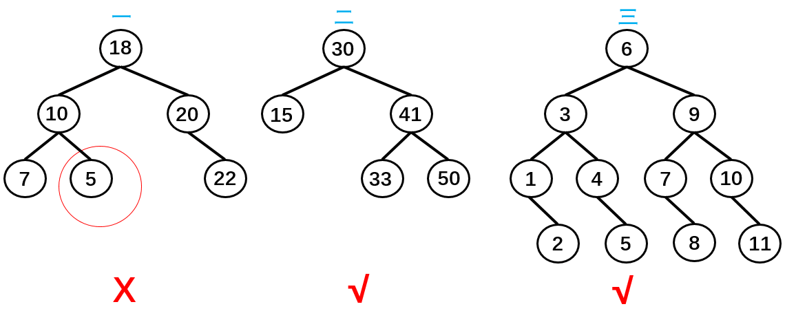

如上图所示，树二和树三符合 3 个条件属于二叉树，树一不满足条件 3 所以不是二叉树。

总结：二叉搜索树的特点主要是**较小的值总是保存在左节点上**，**相对较大的值总是保存在右节点上**。这种特点使得二叉搜索树的查询效率非常高，这也就是二叉搜索树中“搜索”的来源。

## 二叉搜索树应用举例

下面是一个二叉搜索树：

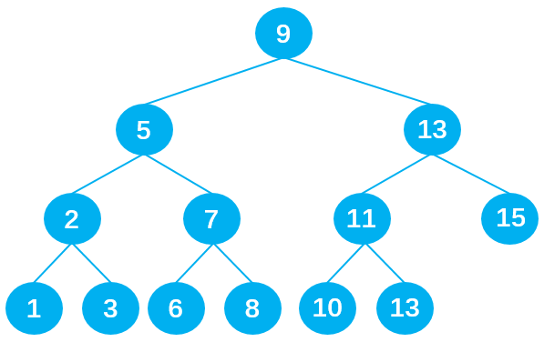

若想在其中查找数据 10，只需要查找 4 次，查找效率非常高。

- 第 1 次：将 10 与根节点 9 进行比较，由于 10 > 9，所以 10 下一步与根节点 9 的右子节点 13 比较；
- 第 2 次：由于 10 < 13，所以 10 下一步与父节点 13 的左子节点 11 比较；
- 第 3 次：由于 10 < 11，所以 10 下一步与父节点 11 的左子节点 10 比较；
- 第 4 次：由于 10 = 10，最终查找到数据 10。

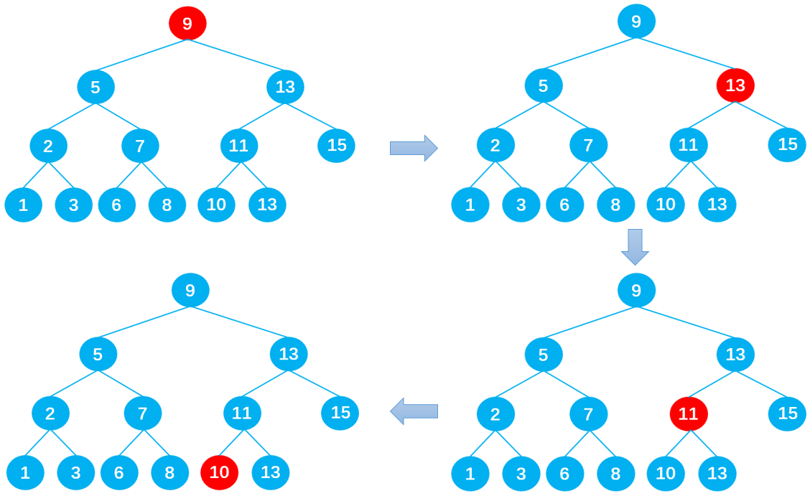

同样是 15 个数据，在排序好的数组中查询数据 10，需要查询 10 次：


其实：如果是排序好的数组，可以通过二分查找：第一次找 9，第二次找 13，第三次找 15...。我们发现如果把每次二分的数据拿出来以树的形式表示的话就是二叉搜索树。这就是数组二分法查找效率之所以高的原因。

## 二叉搜索树的封装

二叉搜索树有四个最基本的属性：指向节点的根（root），节点中的键（key）、左指针（right）、右指针（right）。

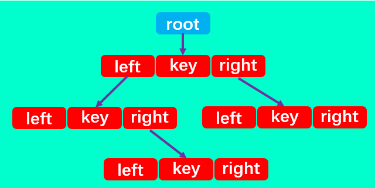

所以，二叉搜索树中除了定义 root 属性外，还应定义一个节点内部类，里面包含每个节点中的 left、right 和 key 三个属性。

```js
// 节点类
class Node {
  constructor(key) {
    this.key = key;
    this.left = null;
    this.right = null;
  }
}
```

## 二叉搜索树的常见操作

- `insert(key)` 向树中插入一个新的键。
- `search(key)` 在树中查找一个键，如果节点存在，则返回 true；如果不存在，则返回 `false`。
- `preOrderTraverse` 通过先序遍历方式遍历所有节点。
- `inOrderTraverse` 通过中序遍历方式遍历所有节点。
- `postOrderTraverse` 通过后序遍历方式遍历所有节点。
- `min` 返回树中最小的值/键。
- `max` 返回树中最大的值/键。
- `remove(key)` 从树中移除某个键。

### 插入数据

实现思路：

- 首先根据传入的 key 创建节点对象。
- 然后判断根节点是否存在，不存在时通过：this.root = newNode，直接把新节点作为二叉搜索树的根节点。
- 若存在根节点则重新定义一个内部方法 `insertNode()` 用于查找插入点。

`insert(key)` 代码实现

```js
// insert(key) 插入数据
insert(key) {
  const newNode = new Node(key);

  if (this.root === null) {
    this.root = newNode;
  } else {
    this.insertNode(this.root, newNode);
  }

}
```

`insertNode()` 的实现思路：

根据比较传入的两个节点，一直查找新节点适合插入的位置，直到成功插入新节点为止。

- 当 newNode.key < node.key 向左查找：

  - 情况 1：当 node 无左子节点时，直接插入：

  - 情况 2：当 node 有左子节点时，递归调用 insertNode()，直到遇到无左子节点成功插入 newNode 后，不再符合该情况，也就不再调用 insertNode()，递归停止。

- 当 newNode.key >= node.key 向右查找，与向左查找类似：

  - 情况 1：当 node 无右子节点时，直接插入：

  - 情况 2：当 node 有右子节点时，依然递归调用 insertNode()，直到遇到传入 insertNode 方法 的 node 无右子节点成功插入 newNode 为止。

insertNode(root, node) 代码实现

```js
insertNode(root, node) {

  if (node.key < root.key) { // 往左边查找插入

    if (root.left === null) {
      root.left = node;
    } else {
      this.insertNode(root.left, node);
    }

  } else { // 往右边查找插入

    if (root.right === null) {
      root.right = node;
    } else {
      this.insertNode(root.right, node);
    }

  }

}
```

### 遍历数据

这里所说的树的遍历不仅仅针对二叉搜索树，而是适用于所有的二叉树。由于树结构不是线性结构，所以遍历方式有多种选择，常见的三种二叉树遍历方式为：

- 先序遍历
- 中序遍历
- 后序遍历

还有层序遍历，使用较少。

#### 先序遍历

先序遍历的过程为：

首先，遍历根节点；
然后，遍历其左子树；
最后，遍历其右子树；

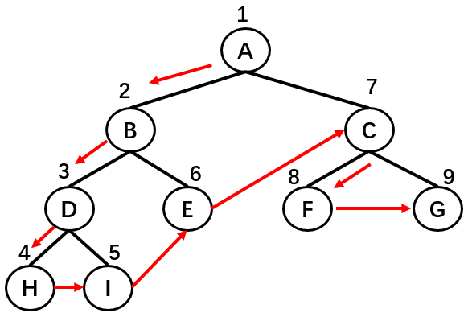

如上图所示，二叉树的节点遍历顺序为：A -> B -> D -> H -> I -> E -> C -> F -> G。

代码实现：

```js
// 先序遍历（根左右 DLR）
preorderTraversal() {
  const result = [];
  this.preorderTraversalNode(this.root, result);
  return result;
}

preorderTraversalNode(node, result) {
  if (node === null) return result;
  result.push(node.key);
  this.preorderTraversalNode(node.left, result);
  this.preorderTraversalNode(node.right, result);
}
```

#### 中序遍历

实现思路：与先序遍历原理相同，只不过是遍历的顺序不一样了。

首先，遍历其左子树；
然后，遍历根（父）节点；
最后，遍历其右子树；

过程图解：

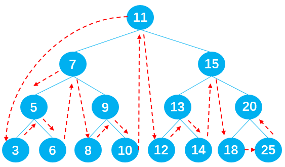

输出节点的顺序应为：3 -> 5 -> 6 -> 7 -> 8 -> 9 -> 10 -> 11 -> 12 -> 13 -> 14 -> 15 -> 18 -> 20 -> 25。

代码实现：

```js
// 中序遍历（左根右 LDR）
inorderTraversal() {
  const result = [];
  this.inorderTraversalNode(this.root, result);
  return result;
}

inorderTraversalNode(node, result) {
  if (node === null) return result;
  this.inorderTraversalNode(node.left, result);
  result.push(node.key);
  this.inorderTraversalNode(node.right, result);
}
```

#### 后序遍历

实现思路：与先序遍历原理相同，只不过是遍历的顺序不一样了。

首先，遍历其左子树；
然后，遍历其右子树；
最后，遍历根（父）节点；

过程图解：

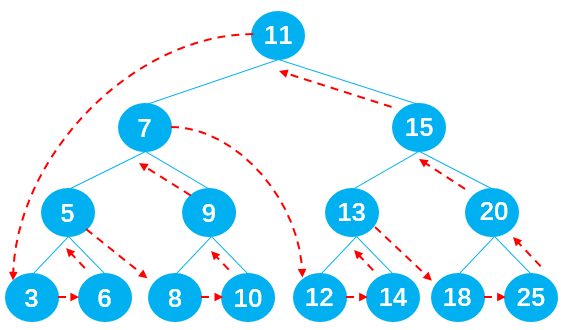

输出节点的顺序应为：3 -> 6 -> 5 -> 8 -> 10 -> 9 -> 7 -> 12 -> 14 -> 13 -> 18 -> 25 -> 20 -> 15 -> 11。

代码实现：

```js
// 后序遍历（左右根 LRD）
postorderTraversal() {
  const result = [];
  this.postorderTraversalNode(this.root, result);
  return result;
}

postorderTraversalNode(node, result) {
  if (node === null) return result;
  this.postorderTraversalNode(node.left, result);
  this.postorderTraversalNode(node.right, result);
  result.push(node.key);
}
```

#### 总结

以遍历根（父）节点的顺序来区分三种遍历方式。
- 先序遍历先遍历根节点（根左右）
- 中序遍历第二遍历根节点（左根右）
- 后续遍历最后遍历根节点。（左右根）

### 查找数据

#### 查找最大值或最小值

在二叉搜索树中查找最值非常简单，最小值在二叉搜索树的最左边，最大值在二叉搜索树的最右边。只需要一直向左/右查找就能得到最值，如下图所示：

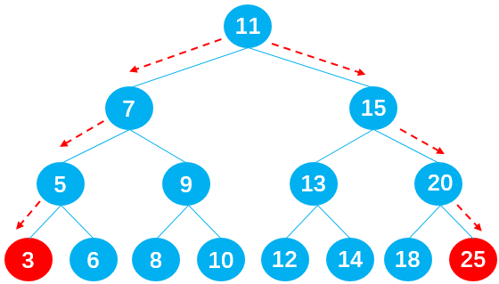

代码实现：

```js
// min() 获取二叉搜索树最小值
min() {
  if (!this.root) return null;
  let node = this.root;
  while (node.left !== null) {
    node = node.left;
  }
  return node.key;
}

// max() 获取二叉搜索树最大值
max() {
  if (!this.root) return null;
  let node = this.root;
  while (node.right !== null) {
    node = node.right;
  }
  return node.key;
}
```

#### 查找特定值

查找二叉搜索树当中的特定值效率也非常高。只需要从根节点开始将需要查找节点的 key 值与之比较，若 node.key < root 则向左查找，若 node.key > root 就向右查找，直到找到或查找到 null 为止。这里可以使用递归实现，也可以采用循环来实现。

代码实现：

```js
// search(key) 查找二叉搜索树中是否有相同的 key，存在返回 true，否则返回 false
search(key) {
  return this.searchNode(this.root, key);
}

// 通过递归实现
searchNode(node, key) {
  if (node === null) return false;
  if (key < node.key) {
    return this.searchNode(node.left, key);
  } else if (key > node.key) {
    return this.searchNode(node.right, key);
  } else {
    return true;
  }
}

// 通过 while 循环实现
search2(key) {

  let node = this.root;

  while (node !== null) {
    if (key < node.key) {
      node = node.left;
    } else if (key > node.key) {
      node = node.right;
    } else {
      return true;
    }
  }

  return false;

}
```

### 删除数据

实现思路：

第一步：先找到需要删除的节点，若没找到，则不需要删除；

首先定义变量 current 用于保存需要删除的节点、变量 parent 用于保存它的父节点、变量 isLeftChild 保存 current 是否为 parent 的左节点，这样方便之后删除节点时改变相关节点的指向。

```js
let currentNode = this.root;
let parentNode = null;
let isLeftChild = true;

// 循环查找到要删除的节点 currentNode，以及它的 parentNode、isLeftChild
while (currentNode.key !== key) {
  parentNode = currentNode;

  // 小于，往左查找
  if (key < currentNode.key) {
    isLeftChild = true;
    currentNode = currentNode.left;
  } else {
    // 否则往右查找
    isLeftChild = false;
    currentNode = currentNode.right;
  }

  // 找到最后都没找到相等的节点，返回 false
  if (currentNode === null) {
    return false;
  }
}
```

第二步：删除找到的指定节点，后分 3 种情况：

- 删除的是叶子节点；
- 删除的是只有一个子节点的节点；
- 删除的是有两个子节点的节点；

#### 删除的是叶子节点

删除的是叶子节点分两种情况：

- 叶子节点也是根节点

  当该叶子节点为根节点时，如下图所示，此时 current == this.root，直接通过：this.root = null，删除根节点。

  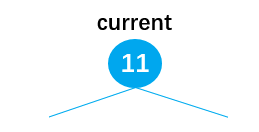

- 叶子节点不为根节点

  当该叶子节点不为根节点时也有两种情况，如下图所示

  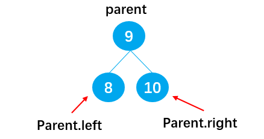

  若 current = 8，可以通过：parent.left = null，删除节点 8；

  若 current = 10，可以通过：parent.right = null，删除节点 10；

  代码实现：

  ```js
  // 1、删除的是叶子节点的情况
  if (currentNode.left === null && currentNode.right === null) {
    if (currentNode === this.root) {
      this.root = null;
    } else if (isLeftChild) {
      parentNode.left = null;
    } else {
      parentNode.right = null;
    }
  
    // 2、删除的是只有一个子节点的节点
  }
  ```

#### 删除的是只有一个子节点的节点

有六种情况：

当 current 存在左子节点时（current.right == null）：

- 情况 1：current 为根节点（current == this.root），如节点 11，此时通过：this.root = current.left，删除根节点 11；

- 情况 2：current 为父节点 parent 的左子节点（isLeftChild == true），如节点 5，此时通过：parent.left = current.left，删除节点 5；

- 情况 3：current 为父节点 parent 的右子节点（isLeftChild == false），如节点 9，此时通过：parent.right = current.left，删除节点 9；


当 current 存在右子节点时（current.left = null）：

- 情况 4：current 为根节点（current == this.root），如节点 11，此时通过：this.root = current.right，删除根节点 11。

- 情况 5：current 为父节点 parent 的左子节点（isLeftChild == true），如节点 5，此时通过：parent.left = current.right，删除节点 5；

- 情况 6：current 为父节点 parent 的右子节点（isLeftChild == false），如节点 9，此时通过：parent.right = current.right，删除节点 9；

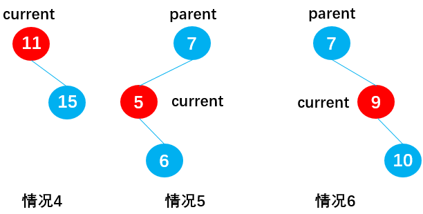

代码实现：

```js
// 2、删除的是只有一个子节点的节点
} else if (currentNode.right === null) { // currentNode 只存在左节点
  //-- 2.1、currentNode 只存在<左节点>的情况
  //---- 2.1.1、currentNode 等于 root
  //---- 2.1.2、parentNode.left 等于 currentNode
  //---- 2.1.3、parentNode.right 等于 currentNode

  if (currentNode === this.root) {
    this.root = currentNode.left;
  } else if (isLeftChild) {
    parentNode.left = currentNode.left;
  } else {
    parentNode.right = currentNode.left;
  }

} else if (currentNode.left === null) { // currentNode 只存在右节点
  //-- 2.2、currentNode 只存在<右节点>的情况
  //---- 2.1.1 currentNode 等于 root
  //---- 2.1.1 parentNode.left 等于 currentNode
  //---- 2.1.1 parentNode.right 等于 currentNode

  if (currentNode === this.root) {
    this.root = currentNode.right;
  } else if (isLeftChild) {
    parentNode.left = currentNode.right;
  } else {
    parentNode.right = currentNode.right;
  }
```

#### 删除的是有两个子节点的节点

这种情况十分复杂，首先依据以下二叉搜索树，讨论这样的问题：


**删除节点 9**

在保证删除节点 9 后原二叉树仍为二叉搜索树的前提下，有两种方式：

- 方式 1：从节点 9 的左子树中选择一合适的节点替代节点 9，可知节点 8 符合要求；
- 方式 2：从节点 9 的右子树中选择一合适的节点替代节点 9，可知节点 10 符合要求；


**删除节点 7**

在保证删除节点 7 后原二叉树仍为二叉搜索树的前提下，也有两种方式：

- 方式 1：从节点 7 的左子树中选择一合适的节点替代节点 7，可知节点 5 符合要求；
- 方式 2：从节点 7 的右子树中选择一合适的节点替代节点 7，可知节点 8 符合要求；

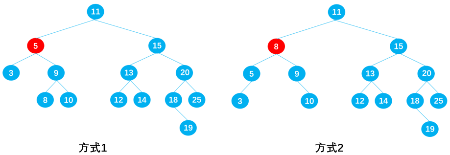

**删除节点 15**

在保证删除节点 15 后原树二叉树仍为二叉搜索树的前提下，同样有两种方式：

- 方式 1：从节点 15 的左子树中选择一合适的节点替代节点 15，可知节点 14 符合要求；
- 方式 2：从节点 15 的右子树中选择一合适的节点替代节点 15，可知节点 18 符合要求；


相信你已经发现其中的规律了！

规律总结：如果要删除的节点有两个子节点，甚至子节点还有子节点，这种情况下需要从要删除节点下面的子节点中找到一个合适的节点，来替换当前的节点。

若用 current 表示需要删除的节点，则合适的节点指的是：

- current 左子树中比 current 小一点点的节点，即 current 左子树中的最大值；
- current 右子树中比 current 大一点点的节点，即 current 右子树中的最小值；

##### 前驱&后继

在二叉搜索树中，这两个特殊的节点有特殊的名字：

- 比 current 小一点点的节点，称为 current 节点的前驱。比如下图中的节点 5 就是节点 7 的前驱；
- 比 current 大一点点的节点，称为 current 节点的后继。比如下图中的节点 8 就是节点 7 的后继；

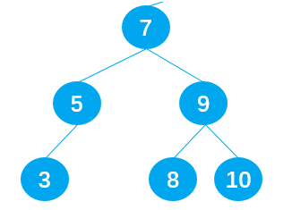

查找需要被删除的节点 current 的后继时，需要在 current 的右子树中查找最小值，即在 current 的右子树中一直向左遍历查找；

查找前驱时，则需要在 current 的左子树中查找最大值，即在 current 的左子树中一直向右遍历查找。

下面只讨论查找 current 后继的情况，查找前驱的原理相同，这里暂不讨论。

代码实现：

```js
  // 3、删除的是有两个子节点的节点
  } else {

    // 1、找到后续节点
    let successor = this.getSuccessor(currentNode);

    // 2、判断是否为根节点
    if (currentNode === this.root) {
      this.root = successor;
    } else if (isLeftChild) {
      parentNode.left = successor;
    } else {
      parentNode.right = successor;
    }

    // 3、将后续的左节点改为被删除的左节点
    successor.left = currentNode.left;
  }
}

// 获取后续节点，即从要删除的节点的右边开始查找最小的值
getSuccessor(delNode) {

  // 定义变量，保存要找到的后续
  let successor = delNode;
  let current = delNode.right;
  let successorParent = delNode;

  // 循环查找 current 的右子树节点
  while (current !== null) {
    successorParent = successor;
    successor = current;
    current = current.left;
  }

  // 判断寻找到的后续节点是否直接就是要删除节点的 right
  if (successor !== delNode.right) {
    successorParent.left = successor.right;
    successor.right = delNode.right;
  }
  return successor;
}
```

#### 完整实现

```js
// 删除节点
remove(key) {

  let currentNode = this.root;
  let parentNode = null;
  let isLeftChild = true;

  // 循环查找到要删除的节点 currentNode，以及它的 parentNode、isLeftChild
  while (currentNode.key !== key) {

    parentNode = currentNode;

    // 小于，往左查找
    if (key < currentNode.key) {
      isLeftChild = true;
      currentNode = currentNode.left;

    } else {  // 否则往右查找
      isLeftChild = false;
      currentNode = currentNode.right;
    }

    // 找到最后都没找到相等的节点，返回 false
    if (currentNode === null) {
      return false;
    }

  }


  // 1、删除的是叶子节点的情况
  if (currentNode.left === null && currentNode.right === null) {

    if (currentNode === this.root) {
      this.root = null;
    } else if (isLeftChild) {
      parentNode.left = null;
    } else {
      parentNode.right = null;
    }


    // 2、删除的是只有一个子节点的节点
  } else if (currentNode.right === null) { // currentNode 只存在左节点
    //-- 2.1、currentNode 只存在<左节点>的情况
    //---- 2.1.1、currentNode 等于 root
    //---- 2.1.2、parentNode.left 等于 currentNode
    //---- 2.1.3、parentNode.right 等于 currentNode

    if (currentNode === this.root) {
      this.root = currentNode.left;
    } else if (isLeftChild) {
      parentNode.left = currentNode.left;
    } else {
      parentNode.right = currentNode.left;
    }

  } else if (currentNode.left === null) { // currentNode 只存在右节点
    //-- 2.2、currentNode 只存在<右节点>的情况
    //---- 2.1.1 currentNode 等于 root
    //---- 2.1.1 parentNode.left 等于 currentNode
    //---- 2.1.1 parentNode.right 等于 currentNode

    if (currentNode === this.root) {
      this.root = currentNode.right;
    } else if (isLeftChild) {
      parentNode.left = currentNode.right;
    } else {
      parentNode.right = currentNode.right;
    }


    // 3、删除的是有两个子节点的节点
  } else {

    // 1、找到后续节点
    let successor = this.getSuccessor(currentNode);

    // 2、判断是否为根节点
    if (currentNode === this.root) {
      this.root = successor;
    } else if (isLeftChild) {
      parentNode.left = successor;
    } else {
      parentNode.right = successor;
    }

    // 3、将后续的左节点改为被删除的左节点
    successor.left = currentNode.left;
  }
}

// 获取后续节点，即从要删除的节点的右边开始查找最小的值
getSuccessor(delNode) {

  // 定义变量，保存要找到的后续
  let successor = delNode;
  let current = delNode.right;
  let successorParent = delNode;

  // 循环查找 current 的右子树节点
  while (current !== null) {
    successorParent = successor;
    successor = current;
    current = current.left;
  }

  // 判断寻找到的后续节点是否直接就是要删除节点的 right
  if (successor !== delNode.right) {
    successorParent.left = successor.right;
    successor.right = delNode.right;
  }
  return successor;
}
```

# 平衡树

二叉搜索树的缺陷：当插入的数据是有序的数据，就会造成二叉搜索树的深度过大。比如原二叉搜索树由 11 7 15 组成，如下图所示：


当插入一组有序数据：6 5 4 3 2 就会变成深度过大的搜索二叉树，会严重影响二叉搜索树的性能。

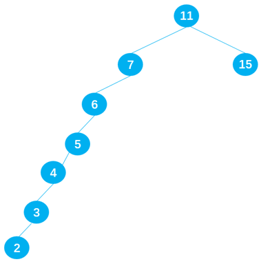

非平衡树

- 比较好的二叉搜索树，它的数据应该是左右均匀分布的。
- 但是插入连续数据后，二叉搜索树中的数据分布就变得不均匀了，我们称这种树为非平衡树。
- 对于一棵平衡二叉树来说，插入/查找等操作的效率是 O(log n)。
- 而对于一棵非平衡二叉树来说，相当于编写了一个链表，查找效率变成了 O(n)。

树的平衡性

为了能以较快的时间 O(log n) 来操作一棵树，我们需要保证树总是平衡的：

- 起码大部分是平衡的，此时的时间复杂度也是接近 O(log n) 的；
- 这就要求树中每个节点左边的子孙节点的个数，应该尽可能地等于右边的子孙节点的个数；

常见的平衡树

- AVL 树：是最早的一种平衡树，它通过在每个节点多存储一个额外的数据来保持树的平衡。由于 AVL 树是平衡树，所以它的时间复杂度也是 O(log n)。但是它的整体效率不如红黑树，开发中比较少用。
- 红黑树：同样通过一些特性来保持树的平衡，时间复杂度也是 O(log n)。进行插入/删除等操作时，性能优于 AVL 树，所以平衡树的应用基本都是红黑树。
