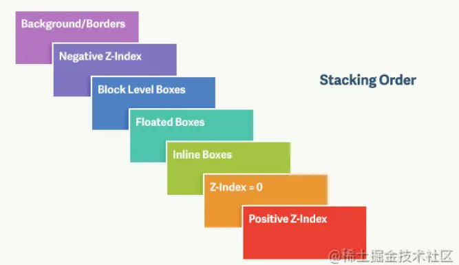
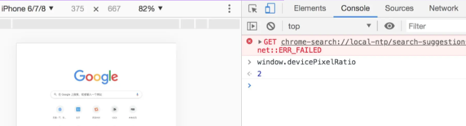

 


## 一、CSS基础

### 1、CSS选择器及其优先级

| **选择器**     | **格式**      | **优先级权重** |
| -------------- | ------------- | -------------- |
| id选择器       | #id           | 100            |
| 类选择器       | #classname    | 10             |
| 属性选择器     | a[ref=“eee”]  | 10             |
| 伪类选择器     | li:last-child | 10             |
| 标签选择器     | div           | 1              |
| 伪元素选择器   | li:after      | 1              |
| 相邻兄弟选择器 | h1+p          | 0              |
| 子选择器       | ul>li         | 0              |
| 后代选择器     | li a          | 0              |
| 通配符选择器   | *             | 0              |

对于选择器的**优先级**：

-   标签选择器、伪元素选择器：1
-   类选择器、伪类选择器、0择器：10
-   id 选择器：100
-   内联样式：1000

**注意事项：**

-   **!important声明的样式的优先级最高；**
-   如果优先级相同，则最后出现的样式生效；
-   继承得到的样式的优先级最低；
-   通用选择器（*）、子选择器（>）和相邻同胞选择器（+）并不在这四个等级中，所以它们的权值都为 0 ；
-   样式表的来源不同时，优先级顺序为：**内联样式 > 内部样式 > 外部样式 > 浏览器用户自定义样式 > 浏览器默认样式。**


### 2、隐藏元素的方法有哪些

**display: none**：渲染树不会包含该渲染对象，因此该元素不会在页面中占据位置，也不会响应绑定的监听事件。

**visibility: hidden**：元素在页面中仍占据空间/，但是不会响应绑定的监听事件。

**opacity: 0**：将元素的透明度设置为 0，以此来实现元素的隐藏。元素在页面中仍然占据空间，并且能够响应元素绑定的监听事件。

**position: absolute**：通过使用绝对定位将元素移除可视区域内，以此来实现元素的隐藏。

**z-index: 负值**：来使其他元素遮盖住该元素，以此来实现隐藏。

**clip/clip-path** ：使用元素裁剪的方法来实现元素的隐藏，这种方法下，元素仍在页面中占据位置，但是不会响应绑定的监听事件。

**transform: scale(0,0)**：将元素缩放为 0，来实现元素的隐藏。这种方法下，元素仍在页面中占据位置，但是不会响应绑定的监听事件。


### 3、display:none 与 visibility:hidden 的区别

这两个属性都是让元素隐藏，不可见。**两者区别如下：**

（1）**在渲染树中**

-   `display:none`会让元素完全从渲染树中消失，渲染时不会占据任何空间；
-   `visibility:hidden`不会让元素从渲染树中消失，渲染的元素还会占据相应的空间，只是内容不可见。

（2）**是否是继承属性**

-   `display:none`是非继承属性，子孙节点会随着父节点从渲染树消失，通过修改子孙节点的属性也无法显示；
-   `visibility:hidden`是继承属性，子孙节点消失是由于继承了`hidden`，通过设置`visibility:visible`可以让子孙节点显示；

（3）**修改常规文档流中元素的 `display` 通常会造成文档的重排，但是修改`visibility`属性只会造成本元素的重绘；**

（4）如果使用**读屏器**，设置为`display:none`的内容不会被读取，设置为`visibility:hidden`的内容会被读取。


### 4、对盒模型的理解

盒模型都是由四个部分组成的，分别是margin、border、padding和content。

标准盒模型和IE盒模型的区别在于设置width和height时，所对应的范围不同：

-   标准盒模型的width和height属性的范围只包含了content，
-   IE盒模型的width和height属性的范围包含了border、padding和content。

可以通过修改元素的box-sizing属性来改变元素的盒模型：

-   `box-sizeing: content-box`表示标准盒模型（默认值）
-   `box-sizeing: border-box`表示IE盒模型（怪异盒模型）


### 5、为什么有时候用translate来改变位置而不是定位？

translate 是 transform 属性的⼀个值。**改变transform或opacity不会触发浏览器重新布局（reflow）或重绘（repaint），只会触发复合（compositions）**。⽽改变绝对定位会触发重新布局，进⽽触发重绘和复合。transform使浏览器为元素创建⼀个 GPU 图层，但改变绝对定位会使⽤到 CPU。 因此**translate()更⾼效，可以缩短平滑动画的绘制时间。**

 ⽽translate改变位置时，元素依然会占据其原始空间，绝对定位就不会发⽣这种情况。


### 6、CSS3中有哪些新特性

新增各种CSS选择器 （: not(.input)：所有 class 不是“input”的节点）

圆角 （border-radius:8px）

多列布局 （multi-column layout）

阴影和反射 （Shadoweflect）

文字特效 （text-shadow）

文字渲染 （Text-decoration）

线性渐变 （gradient）

变化（transform）：增加了旋转,缩放,定位,倾斜,动画,多背景


### 7、CSS 优化和提高性能的方法有哪些？

**加载性能：**

（1）**css压缩**：将写好的css进行打包压缩，可以减小文件体积。

（2）**css复合样式**：当需要下边距和左边距的时候，很多时候会选择使用 margin:top 0 bottom 0；但margin-bottom:bottom;margin-left:left;执行效率会更高。

（3）**减少使用@import，建议使用link**，因为后者在页面加载时一起加载，前者是等待页面加载完成之后再进行加载。

**选择器性能：**

（1）**关键选择器（key selector）。选择器的最后面的部分为关键选择器（即用来匹配目标元素的部分）**。**CSS选择符是从右到左进行匹配的。**当使用后代选择器的时候，浏览器会遍历所有子元素来确定是否是指定的元素等等；

（2）**如果规则拥有ID选择器作为其关键选择器，则不要为规则增加标签**。过滤掉无关的规则（这样样式系统就不会浪费时间去匹配它们了）。

（3）**避免使用通配规则**，如 `*{}` 计算次数惊人，只对需要用到的元素进行选择。

（4）**尽量少的去对标签进行选择，而是用class。**

（5）**尽量少的去使用后代选择器，降低选择器的权重值。**后代选择器的**开销是最高的**，尽量将选择器的深度降到最低，最高不要超过三层，更多的使用类来关联每一个标签元素。

（6）**了解哪些属性是可以通过继承而来的，然后避免对这些属性重复指定规则。**

**渲染性能：**

（1）慎重使用**高性能属性：浮动、定位。**

（2）**尽量减少页面重排、重绘。**

（3）去除空规则：｛｝。空规则的产生原因一般来说是为了预留样式。去除这些空规则无疑能减少css文档体积。

（4）**属性值为0时，不加单位。**

（5）属性值为浮动小数0，可以省略小数点之前的0。

（6）标准化各种浏览器前缀：带浏览器前缀的在前。标准属性在后。

（7）不使用@import前缀，它会影响css的加载速度。

（8）选择器优化嵌套，尽量避免层级过深。

（9）**css雪碧图**，同一页面相近部分的小图标，方便使用，减少页面的请求次数，但**是同时图片本身会变大，使用时，优劣考虑清楚，再使用。**

（10）正确使用display的属性，由于display的作用，某些样式组合会无效，徒增样式体积的同时也影响解析性能。

（11）**不滥用web字体。对于中文网站来说WebFonts可能很陌生，国外却很流行**。web fonts通常体积庞大，而且一些浏览器在下载web fonts时会阻塞页面渲染损伤性能。

**可维护性、健壮性：**

（1）**将具有相同属性的样式抽离出来，整合并通过class在页面中进行使用，提高css的可维护性。**

（2）**样式与内容分离：将css代码定义到外部css中。**


### 8、对 CSS 工程化的理解

CSS 工程化是为了解决以下问题：

1.  **宏观设计**：CSS 代码如何组织、如何拆分、模块结构怎样设计？
    1.  文件的命名方式
    2.  类名、次类名的命名方式
    3.  是否使用原子化编写的方式去构建代码，如 postCss、unocss
    4.  考虑响应式方案，是否需要适配多端，选择合适的布局单位进行编写

2.  **编码优化**：怎样写出更好的 CSS？（上面的CSS优化）
3.  **开发效率以及可维护性**：代码写完了，如何最小化它后续的变更成本？如何确保任何一个同事都能轻松接手？
    1.  使用市面上流行的预处理器：Less、 Sass、Stylus 等，使用 mixin、function、$变量 等去使代码开发效率更快，代码整体可维护性更好
    2.  使用 stylelint 去做规范（例如 类之间是否需要换行，空格缩进等规范）

4.  **构建**：如何处理我的 CSS，才能让它的打包结果最优？
    1.  gzip、brotli 压缩
    2.  脏压缩
    3.  重要的工程化插件： PostCss；


### 9、对媒体查询的理解？

媒体查询由⼀个可选的媒体类型和零个或多个使⽤媒体功能的限制了样式表范围的表达式组成，例如宽度、⾼度和颜⾊。媒体查询，添加⾃CSS3，允许内容的呈现针对⼀个特定范围的输出设备⽽进⾏裁剪，⽽不必改变内容本身，适合web⽹⻚应对不同型号的设备⽽做出对应的响应适配。

媒体查询包含⼀个可选的媒体类型和满⾜CSS3规范的条件下，包含零个或多个表达式，这些表达式描述了媒体特征，最终会被解析为true或false。如果媒体查询中指定的媒体类型匹配展示⽂档所使⽤的设备类型，并且所有的表达式的值都是true，那么该媒体查询的结果为true。那么媒体查询内的样式将会⽣效。

```javascript
<!-- link元素中的CSS媒体查询 --> 
<link rel="stylesheet" media="(max-width: 800px)" href="example.css" /> 
<!-- 样式表中的CSS媒体查询 --> 
<style> 
@media (max-width: 600px) { 
  .facet_sidebar { 
    display: none; 
  } 
}
</style>
```

简单来说：

-   **使用 @media 查询，可以针对不同的媒体类型定义不同的样式。**
-   **@media 可以针对不同的屏幕尺寸设置不同的样式，特别是需要设置设计响应式的页面**，

-   **当重置浏览器大小的过程中，页面也会根据浏览器的宽度和高度重新渲染页面。**


### 10、z-index属性在什么情况下会失效

通常 z-index 的使用是在有两个重叠的标签，在一定的情况下控制其中一个在另一个的上方或者下方出现。z-index值越大就越是在上层。**z-index元素的position属性需要是relative，absolute或是fixed。**

z-index 属性使用条件

`z-index` 在设置了position属性（position不为static的元素）的元素条件下使用。

z-index的一些理解误区

一般我们会说：**z-index属性只有和定位元素（position不为static的元素）一起使用的时候，才起作用**，那首先这种说法是错误的，因为**在css3中flex盒子的子元素也可以设置z-index属性。**

**z-index属性在下列情况下会失效**：

-   **元素没有设置position属性为非static属性**。解决：设置该元素的position属性为relative，absolute或是fixed中的一种；

-   元素在**设置z-index的同时还设置了float浮动**。解决：float去除，改为display：inline-block；**实测好像没用**


### 11、伪元素如何选择奇数标签和偶数标签

- **第一种：nth-child**

  ```css
  /* 奇数 */
  :nth-child(2n+1)
  /* 偶数 */
  :nth-child(2n)
  ```

- **第二种：nth-of-type**

  ```css
  /* 奇数 */
  :nth-of-type(odd)
  /* 偶数 */
  nth-of-type(even)
  ```


### 12、flex: 1 0 auto; 代表什么

flex 是这个三个属性的语法糖：

```css
flex: flex-grow flex-shrink flex-basis
```

**flex-grow**：定义**放大比例**，默认为 0，规定项目相对于其他灵活的项目进行扩展的量
**flex-shrink**：定义了项目的**缩小比例**，仅在宽度之和大于容器的时候才会发生收缩，其收缩的大小是依据 flex-shrink 的值，默认为1
**flex-basis**：定义**盒子大小**，给上面两个属性分配多余空间之前, 计算项目是否有多余空间, 默认值为 auto, 即盒子本身的大小

因此，`flex: 1 0 auto;` 代表子盒自身宽度如果大于父盒，那么剩余空间会进行分配，扩展子盒宽度；如果小于，则不进行收缩，保持盒子自身宽度，即使盒子溢出

### 13、link和@import的区别

两者都是外部引用CSS的方式，它们的区别如下：

-   link是XHTML标签，除了加载CSS外，还可以定义RSS等其他事务；@import属于CSS范畴，只能加载CSS。
-   link引用CSS时，在页面载入时同时加载；@import需要页面网页完全载入以后加载。
-   link是XHTML标签，无兼容问题；**@import是在CSS2.1提出的，低版本的浏览器不支持。**
-   link支持使用Javascript控制DOM去改变样式；而@import不支持。


### 14、li 与 li 之间有看不见的空白间隔是什么原因引起的？如何解决？

浏览器会把inline内联元素间的**空白字符（空格、换行、Tab等）渲染成一个空格**。为了美观，通常是一个`<li>`放在一行，这导致`<li>`换行后产生换行字符，它变成一个空格，占用了一个字符的宽度。

**解决办法：**

（1）为`<li>`设置float:left。不足：有些容器是不能设置浮动，如左右切换的焦点图等。

（2）将所有`<li>`写在同一行。不足：代码不美观。

（3）将`<ul>`内的字符尺寸直接设为0，**即font-size:0。不**足：`<ul>`中的其他字符尺寸也被设为0，需要额外重新设定其他字符尺寸，**且在Safari浏览器依然会出现空白间隔。**

（4）消除`<ul>`的字符间隔letter-spacing:-8px，不足：这也设置了`<li>`内的字符间隔，因此需要将`<li>`内的字符间隔设为默认letter-spacing:normal。


### 15、对line-height 的理解及其赋值方式

**（1）line-height的概念：**

-   line-height 指**一行文本的高度，包含了字间距，实际上是下一行基线到上一行基线距离**；
-   **如果一个标签没有定义 height 属性，那么其最终表现的高度由 line-height 决定；**
-   一个容器没有设置高度，那么撑开容器高度的是 line-height，而不是容器内的文本内容；
-   **把 line-height 值设置为 height 一样大小的值可以实现单行文字的垂直居中；**
-   **line-height 和 height 都能撑开一个高度；**

**（2）line-height 的赋值方式：**

-   带单位：px 是固定值，而 em 会参考父元素 font-size 值计算自身的行高
-   **纯数字：会把比例传递给后代。例如，父级行高为 1.5，子元素字体为 18px，则子元素行高为 1.5 * 18 = 27px**
-   **百分比：将计算后的值传递给后代**


### 16、CSS中可继承与不可继承属性有哪些

#### **一、无继承性的属性**

1.  **display**：规定元素应该生成的框的类型
2.  **文本属性**：

-   vertical-align：垂直文本对齐
-   text-decoration：规定添加到文本的装饰
-   text-shadow：文本阴影效果
-   white-space：空白符的处理
-   unicode-bidi：设置文本的方向

1.  **盒子模型的属性**：width、height、margin、border、padding
2.  **背景属性**：background、background-color、background-image、background-repeat、background-position、background-attachment
3.  **定位属性**：float、clear、position、top、right、bottom、left、min-width、min-height、max-width、max-height、overflow、clip、z-index
4.  **生成内容属性**：content、counter-reset、counter-increment
5.  **轮廓样式属性**：outline-style、outline-width、outline-color、outline
6.  **页面样式属性**：size、page-break-before、page-break-after
7.  **声音样式属性**：pause-before、pause-after、pause、cue-before、cue-after、cue、play-during

#### **二、有继承性的属性**

1.  **字体系列属性**

-   font-family：字体系列
-   font-weight：字体的粗细
-   **font-size**：字体的大小
-   font-style：字体的风格

1.  **文本系列属性**

-   **text-indent**：文本缩进
-   **text-align**：文本水平对齐
-   **line-height**：行高
-   **word-spacing**：单词之间的间距
-   **letter-spacing**：中文或者字母之间的间距
-   **text-transform**：控制文本大小写（就是**uppercase、lowercase、capitalize**这三个）
-   **color**：文本颜色

1.  **元素可见性**

-   visibility：控制元素显示隐藏

1.  **列表布局属性**

-   list-style：列表风格，包括list-style-type、list-style-image等

1.  **光标属性**

-   cursor：光标显示为何种形态


### 17、CSS预处理器/后处理器是什么？为什么要使用它们？

**预处理器，** 如：`less`，`sass`，`stylus`，用来预编译`css`，增加了`css`代码的复用性。层级，`mixin`， 变量，循环， 函数等对编写以及开发UI组件都极为方便。

**后处理器，** 如： `postCss`，通常是在完成的样式表中根据`css`规范处理`css`，让其更加有效。目前最常做的是给`css`属性添加浏览器私有前缀，实现跨浏览器兼容性的问题。

`css`预处理器为`css`增加一些编程特性，无需考虑浏览器的兼容问题，可以在`CSS`中使用变量，简单的逻辑程序，函数等在编程语言中的一些基本的性能，可以让`css`更加的简洁，增加适应性以及可读性，可维护性等。

其它`css`预处理器语言：`Sass（Scss）`, `Less`, `Stylus`, `Turbine`, `Swithch css`, `CSS Cacheer`, `DT Css`。


### 18、::before 和 ::after 的双冒号和单冒号有什么区别？

（1）冒号(`:`)用于`CSS3`伪类，双冒号(`::`)用于`CSS3`伪元素。 （2）`::before`就是以一个子元素的存在，定义在元素主体内容之前的一个伪元素。并不存在于`dom`之中，只存在在页面之中。

**注意：** `:before `和 `:after` 这两个伪元素，是在`CSS2.1`里新出现的。起初，伪元素的前缀使用的是单冒号语法，**但随着`Web`的进化，在`CSS3`的规范里，伪元素的语法被修改成使用双冒号，成为`::before`、`::after`。**


### 19、单行、多行文本溢出隐藏

-   单行文本溢出

```css
overflow: hidden;            // 溢出隐藏
text-overflow: ellipsis;      // 溢出用省略号显示
white-space: nowrap;         // 规定段落中的文本不进行换行
```

-   多行文本溢出

```css
overflow: hidden;            // 溢出隐藏
text-overflow: ellipsis;     // 溢出用省略号显示
display:-webkit-box;         // 作为弹性伸缩盒子模型显示。
-webkit-box-orient:vertical; // 设置伸缩盒子的子元素排列方式：从上到下垂直排列
-webkit-line-clamp:3;        // 显示的行数
```

注意：由于上面的三个属性都是 CSS3 的属性，没有浏览器可以兼容，所以要在前面加一个`-webkit-` 来兼容一部分浏览器。


## 二、页面布局

### 1、px、em、rem的区别及使用场景

**三者的区别：**

-   px是固定的像素，一旦设置了就无法因为适应页面大小而改变。
-   em和rem相对于px更具有灵活性，他们是相对长度单位，其长度不是固定的，更适用于响应式布局。
-   em是相对于其父元素来设置字体大小，这样就会存在一个问题，进行任何元素设置，都有可能需要知道他父元素的大小。而rem是相对于根元素，这样就意味着，只需要在根元素确定一个参考值。

**使用场景：**

-   **对于只需要适配少部分移动设备**，且分辨率对页面影响不大的，使用px即可 。
-   **对于需要适配各种移动设备**，使用rem，例如需要适配iPhone和iPad等分辨率差别比较挺大的设备


### 2、水平垂直居中的实现

-   **利用绝对定位**，先将元素的左上角通过top:50%和left:50%定位到页面的中心，然后再通过**translate**来调整元素的中心点到页面的中心。该方法需要**考虑浏览器兼容问题。**
-   **利用绝对定位**，**设置四个方向的值都为0，并将margin设置为auto**，由于宽高固定，因此对应方向实现平分，可以实现水平和垂直方向上的居中。该方法适用于**盒子有宽高**的情况
-   **利用绝对定位**，先将元素的左上角通过top:50%和left:50%定位到页面的中心，然后再通过**margin**负值来调整元素的中心点到页面的中心。该方法适用于**盒子宽高已知**的情况
-   使用flex**布局**，通过align-items:center和justify-content:center设置容器的垂直和水平方向上为居中对齐，然后它的子元素也可以实现垂直和水平的居中。该方法要**考虑兼容的问题**，该方法在移动端用的较多：


### 3、响应式设计的概念及基本原理

响应式网站设计`（Responsive Web design`）是**一个网站能够兼容多个终端，而不是为每一个终端做一个特定的版本。**

**基本方案**：

- meta：基本原理是通过媒体查询`（@media）`查询检测不同的设备屏幕尺寸做处理。 关于兼容： 页面头部必须有mate声明的`viewport`。

  ```html
  <meta name="’viewport’" content="”width=device-width," initial-scale="1." maximum-scale="1,user-scalable=no”"/>
  ```

- @media

- vw/vh

- vmin/vmax

  -   **vmin**：与当下视口的宽度和高度的最小值有关，取值为 `vw` 和 `vh` 中较小的那个

  -   **vmax**：与当下视口的宽度和高度的最大值有关，取值为 `vw` 和 `vh` 中较大的那个 

- rem/em

### 4、常见的CSS布局单位

常用的布局单位包括像素（`px`），百分比（`%`），`em`，`rem`，`vw/vh`。


### 5、两栏布局的实现

一般两栏布局指的是**左边一栏宽度固定，右边一栏宽度自适应**，两栏布局的具体实现：

- 利用浮动，将左边元素宽度设置为200px，并且设置向左浮动。将右边元素的margin-left设置为200px，宽度设置为auto（默认为auto，撑满整个父元素）。

  ```css
  .outer {
    height: 100px;
  }
  .left {
    float: left;
    width: 200px;
    background: tomato;
  }
  .right {
    margin-left: 200px;
    width: auto;
    background: gold;
  }
  ```

- 利用浮动，左侧元素设置固定大小，并左浮动，右侧元素设置overflow: hidden; 这样右边就触发了BFC**，BFC的区域不会与浮动元素发生重叠**，所以两侧就不会发生重叠。

  ```css
  .left{
       width: 100px;
       height: 200px;
       background: red;
       float: left;
   }
   .right{
       height: 300px;
       background: blue;
       overflow: hidden;
   }
  ```

- 利用**flex**布局，将左边元素设置为固定宽度200px，将右边的元素设置为flex:1。

- 利用**绝对定位**，将父级元素设置为相对定位。左边元素设置为absolute定位，并且宽度设置为200px。将右边元素的margin-left的值设置为200px。

- 利用**绝对定位**，将父级元素设置为相对定位。左边元素宽度设置为200px，右边元素设置为绝对定位，左边定位为200px，其余方向定位为0。


### 6、三栏布局的实现

三栏布局一般指的是页面中一共有三栏，**左右两栏宽度固定，中间自适应的布局**，三栏布局的具体实现：

-   利用**绝对定位**，左右两栏设置为绝对定位，中间设置对应方向大小的margin的值。
-   利用**flex**布局，左右两栏设置固定大小，中间一栏设置为flex:1。
-   利用浮动，左右两栏设置固定大小，并设置对应方向的浮动。中间一栏设置左右两个方向的margin值
-   **圣杯布局**，利用浮动和负边距来实现。父级元素设置左右的 **padding**，三列均设置向左浮动，中间一列放在最前面，宽度设置为父级元素的宽度，因此后面两列都被挤到了下一行，通过设置 margin 负值将其移动到上一行，再利用相对定位，定位到两边。
-   **双飞翼布局**，双飞翼布局相对于圣杯布局来说，左右位置的保留是通过中间列的 **margin** 值来实现的，而不是通过父元素的 padding 来实现的。本质上来说，也是通过浮动和外边距负值来实现的。


## 三、定位与浮动

### 1、对BFC的理解，如何创建BFC

先来看两个相关的概念：

-   Box: Box 是 CSS 布局的对象和基本单位，⼀个⻚⾯是由很多个 Box 组成的，这个Box就是我们所说的盒模型。
-   Formatting context：**块级上下文格式化**，它是⻚⾯中的⼀块渲染区域，并且有⼀套**渲染规则**，它决定了其⼦元素将如何定位，以及和其他元素的关系和相互作⽤。

块格式化上下文（Block Formatting Context，BFC）是Web页面的可视化CSS渲染的一部分，是布局过程中生成块级盒子的区域，也是浮动元素与其他元素的交互限定区域。

通俗来讲：**BFC是一个独立的布局环境，可以理解为一个容器，在这个容器中按照一定规则进行物品摆放，并且不会影响其它环境中的物品。**如果一个元素符合触发BFC的条件，则BFC中的元素布局不受外部影响。

**创建BFC的条件：**

-   **根元素：body；**
-   元素**设置浮动**：float 除 none 以外的值；
-   元素**设置绝对定位**：position (absolute、fixed)；
-   display 值为：**inline-block**、**table-cell**、table-caption、**flex**等；
-   **overflow 值为：hidden、auto、scroll；**

**BFC的特点：**

-   垂直方向上，自上而下排列，和文档流的排列方式一致。
-   在BFC中上下相邻的两个容器的margin会重叠
-   计算BFC的高度时，需要计算浮动元素的高度
-   BFC区域不会与浮动的容器发生重叠
-   BFC是独立的容器，容器内部元素不会影响外部元素
-   每个元素的左margin值和容器的左border相接触

**BFC的作用：**

-   **解决margin的重叠问题**：由于BFC是一个独立的区域，内部的元素和外部的元素互不影响，将两个元素变为两个BFC，就解决了margin重叠的问题。
-   **解决高度塌陷的问题**：在对子元素设置浮动后，父元素会发生高度塌陷，也就是父元素的高度变为0。解决这个问题，只需要把父元素变成一个BFC。常用的办法是给父元素设置`overflow:hidden`。
-   **创建自适应两栏布局**：可以用来创建自适应两栏布局：左边的宽度固定，右边的宽度自适应。

```css
.left{
     width: 100px;
     height: 200px;
     background: red;
     float: left;
 }
 .right{
     height: 300px;
     background: blue;
     overflow: hidden;
 }
 
<div class="left"></div>
<div class="right"></div>
```

左侧设置`float:left`，右侧设置`overflow: hidden`。这样右边就触发了BFC，BFC的区域不会与浮动元素发生重叠，所以两侧就不会发生重叠，实现了自适应两栏布局。


### 2、什么是IFC，以及它的特点

`IFC(Inline Formatting Contexts)`直译为"行内格式化上下文"，`IFC`的`line box`（线框）高度由其包含行内元素中最高的实际高度计算而来（不受到竖直方向的 `padding/margin` 影响)

- ### IFC有的特性

1.  `IFC`中的`line box`一般左右都贴紧整个`IFC`，但是会因为`float`元素而扰乱。`float`元素会位于`IFC`与与`line box`之间，使得`line box`宽度缩短。
2.  `IFC`中时不可能有块级元素的，当插入块级元素时（如`p`中插入`div`）会产生两个匿名块与`div`分隔开，即产生两个`IFC`，每个`IFC`对外表现为块级元素，与`div`垂直排列。

- ### IFC的应用

1.  水平居中：当一个块要在环境中水平居中时，设置其为`inline-block`则会在外层产生`IFC`，通过`text-align`则可以使其水平居中。
2.  垂直居中：创建一个`IFC`，用其中一个元素撑开父元素的高度，然后设置其`vertical-align:middle`，其他行内元素则可以在此父元素下垂直居中。

### 3、GFC

`GFC(GridLayout Formatting Contexts)`直译为"网格布局格式化上下文"，当为一个元素设置`display`值为`grid`的时候，此元素将会获得一个独立的渲染区域，我们可以通过在网格容器`（grid container）`上定义网格定义行`（grid definition rows）`和网格定义列`（grid definition columns）`属性各在网格项目`（grid item）`上定义网格行`（grid row）`和网格列`（grid columns）`为每一个网格项目`（grid item）`定义位置和空间。

`GFC`将改变传统的布局模式，他将让布局从一维布局变成了二维布局。简单的说，有了`GFC`之后，布局不再局限于单个维度了。这个时候你要实现类似九宫格，拼图之类的布局效果显得格外的容易。


### 4、FFC

`FFC(Flex Formatting Contexts)`直译为"自适应格式化上下文"，`display`值为`flex`或者`inline-flex`的元素将会生成自适应容器`（flex container）`。

`Flex Box` 由伸缩容器和伸缩项目组成。通过设置元素的 `display` 属性为 `flex` 或 `inline-flex` 可以得到一个伸缩容器。设置为 `flex` 的容器被渲染为一个块级元素，而设置为 `inline-flex` 的容器则渲染为一个行内元素。

伸缩容器中的每一个子元素都是一个伸缩项目。伸缩项目可以是任意数量的。伸缩容器外和伸缩项目内的一切元素都不受影响。简单地说，`Flexbox` 定义了伸缩容器内伸缩项目该如何布局。


### 5、FFC与BFC的区别

`FFC`与`BFC`有点儿类似，但仍有以下几点区别：

-   Flexbox 不支持 `::first-line` 和 `::first-letter` 这两种伪元素
-   `vertical-align` 对 `Flexbox` 中的子元素 是没有效果的
-   `float` 和 `clear` 属性对 `Flexbox` 中的子元素是没有效果的，也不会使子元素脱离文档流(但是对`Flexbox` 是有效果的！)
-   多栏布局（`column-*`） 在 `Flexbox` 中也是失效的，就是说我们不能使用多栏布局在 `Flexbox` 排列其下的子元素
-   `Flexbox` 下的子元素不会继承父级容器的宽


### 6、什么是margin重叠问题？如何解决？

**问题描述：** 两个块级元素的上外边距和下外边距可能会合并（折叠）为一个外边距，其大小会取其中外边距值大的那个，这种行为就是外边距折叠。需要注意的是，**浮动的元素和绝对定位**这种脱离文档流的元素的外边距不会折叠。重叠只会出现在**垂直方向**。

**计算原则：** 折叠合并后外边距的计算原则如下：

-   如果两者都是正数，那么就去最大者
-   如果是一正一负，就会正值减去负值的绝对值
-   两个都是负值时，用0减去两个中绝对值大的那个

**解决办法：** 对于折叠的情况，主要有两种：**兄弟之间重叠**和**父子之间重叠** 

（1）兄弟之间重叠

-   底部元素变为行内盒子：`display: inline-block`
-   底部元素设置浮动：`float`
-   底部元素的position的值为`absolute/fixed`

（2）父子之间重叠

-   父元素加入：`overflow: hidden`
-   父元素添加透明边框：`border:1px solid transparent`
-   子元素变为行内盒子：`display: inline-block`
-   子元素加入浮动属性或定位


### 7、对 sticky 定位的理解

sticky 英文字面意思是粘贴，所以可以把它称之为粘性定位。语法：**position: sticky;** 基于用户的滚动位置来定位。

粘性定位的元素是依赖于用户的滚动，在 **position:relative** 与 **position:fixed** 定位之间切换。它的行为就像 **position:relative;** 而当页面滚动超出目标区域时，它的表现就像 **position:fixed;**，它会固定在目标位置。元素定位表现为在跨越特定阈值前为相对定位，之后为固定定位。这个特定阈值指的是 top, right, bottom 或 left 之一，换言之，指定 top, right, bottom 或 left 四个阈值其中之一，才可使粘性定位生效。否则其行为与相对定位相同。


### 8、元素的层叠顺序

层叠顺序，英文称作 stacking order，表示元素发生层叠时有着特定的垂直显示顺序。下面是盒模型的层叠规则：



于上图，由上到下分别是： （1）背景和边框：建立当前层叠上下文元素的背景和边框。 （2）负的z-index：当前层叠上下文中，z-index属性值为负的元素。 （3）块级盒：文档流内非行内级非定位后代元素。 （4）浮动盒：非定位浮动元素。 （5）行内盒：文档流内行内级非定位后代元素。 （6）z-index:0：层叠级数为0的定位元素。 （7）正z-index：z-index属性值为正的定位元素。

**注意:** 当定位元素z-index:auto，生成盒在当前层叠上下文中的层级为 0，不会建立新的层叠上下文，除非是根元素。


### 9、为什么需要清除浮动？清除浮动的方式

**浮动的定义：** 非IE浏览器下，容器不设高度且子元素浮动时，容器高度不能被内容撑开。 此时，内容会溢出到容器外面而影响布局。这种现象被称为浮动（溢出）。

**浮动的工作原理：**

-   浮动元素脱离文档流，不占据空间（引起“高度塌陷”现象）
-   浮动元素碰到包含它的边框或者其他浮动元素的边框停留

浮动元素可以左右移动，直到遇到另一个浮动元素或者遇到它外边缘的包含框。浮动框不属于文档流中的普通流，当元素浮动之后，不会影响块级元素的布局，只会影响内联元素布局。此时文档流中的普通流就会表现得该浮动框不存在一样的布局模式。当包含框的高度小于浮动框的时候，此时就会出现“高度塌陷”。

**浮动元素引起的问题？**

-   父元素的高度无法被撑开，影响与父元素同级的元素
-   与浮动元素同级的非浮动元素会跟随其后
-   若浮动的元素不是第一个元素，则该元素之前的元素也要浮动，否则会影响页面的显示结构

**清除浮动的方式如下：**

-   给父级div定义`height`属性
-   最后一个浮动元素之后添加一个空的div标签，并添加`clear:both`样式
-   包含浮动元素的父级标签添加`overflow:hidden`或者`overflow:auto`
-   使用 :after 伪元素。由于IE6-7不支持 :after，使用 zoom:1 触发 hasLayout**

```css
.clearfix:after{
    content: "\200B";
    display: table; 
    height: 0;
    clear: both;
  }
  .clearfix{
    *zoom: 1;
  }
```


## 四、场景应用

### 1、实现一个三角形

```css
div {
    width: 0;
    height: 0;
    border: 100px solid;
    border-color: orange blue red green;
    /* 各种三角形 */
    //  border-top: 50px solid red;    
    //  border-right: 50px solid transparent;    
    //	border-left: 50px solid transparent
    //  border-bottom: 50px solid transparent;
    /* 直角三角形
    	border-top: 100px solid red;
    	border-right: 100px solid transparent;
    */
}
```


### 2、实现一个扇形

```css
div{
    border: 100px solid transparent;
    width: 0;
    heigt: 0;
    border-radius: 100px;
    border-top-color: red;
}
```


### 3、画一条0.5px的线

```html
    <h1>1px粗线</h1>
    <div id="line"></div>
    <h4>方法一：transform</h4>
    <div id="line1"></div>
    <h4>方法二：渐变</h4>
    <div id="line2"></div>
```

-   **方法一：tansform**

```css
        #line1 {
            border-bottom: 1px solid black;
            transform: scaleY(0.5);
        }
```

-   **方法二：渐变**

```css
        #line2 {
            height: 1px;
            background: -webkit-linear-gradient(90deg, #000 50%, transparent 50%);
        }
```

-   **方法三：viewport 的 meta 标签**

```html
<-- initial-scale 设置为 0.5 -->
<meta name="viewport" content="width=device-width, initial-scale=0.5">
```


### 4、设置小于12px的字体

在谷歌下css设置字体大小为12px及以下时，显示都是一样大小，都是默认12px。

**解决办法：**

-   使用Webkit的内核的-webkit-text-size-adjust的私有CSS属性来解决，只要加了-webkit-text-size-adjust:none;字体大小就不受限制了。但是chrome更新到27版本之后就不可以用了。所以高版本chrome谷歌浏览器已经不再支持-webkit-text-size-adjust样式，所以要使用时候慎用。
-   使用**css3的transform缩放属性-**webkit-transform:scale(0.5); 注意-webkit-transform:scale(0.75);收缩的是整个元素的大小，这时候，如果是内联元素，必须要将内联元素转换成块元素，可以使用display：block/inline-block/...；
-   **使用图片**：如果是内容固定不变情况下，使用将小于12px文字内容切出做图片，这样不影响兼容也不影响美观。


### 5、如何解决 1px 问题？

1px 问题指的是：在一些 `Retina屏幕` 的机型上，移动端页面的 1px 会变得很粗，呈现出不止 1px 的效果。原因很简单——**CSS 中的 1px 并不能和移动设备上的 1px 划等号。它们之间的比例关系有一个专门的属性来描述：**

```js
window.devicePixelRatio = 设备的物理像素 / CSS像素。
```

打开 Chrome 浏览器，启动移动端调试模式，在控制台去输出这个 `devicePixelRatio` 的值。这里选中 iPhone6/7/8 这系列的机型，输出的结果就是2



这就意味着设置的 1px CSS 像素，在这个设备上实际会用 2 个物理像素单元来进行渲染，所以实际看到的一定会比 1px 粗一些。 **解决1px 问题的三种思路：**

- #### 思路一：直接写 0.5px

  如果之前 1px 的样式这样写：

  ```css
  border:1px solid #333
  ```

  可以先在 JS 中拿到 window.devicePixelRatio 的值，然后把这个值通过 JSX 或者模板语法给到 CSS 的 data 里，达到这样的效果（这里用 JSX 语法做示范）：

  ```vue
  <div id="container" data-device={{window.devicePixelRatio}}></div>
  ```

  然后就可以在 CSS 中用属性选择器来命中 devicePixelRatio 为某一值的情况，比如说这里尝试命中 devicePixelRatio 为2的情况：

  ```css
  #container[data-device="2"] {
    border:0.5px solid #333
  }
  ```

  直接把 1px 改成 1/devicePixelRatio 后的值，这是目前为止最简单的一种方法。**这种方法的缺陷在于兼容性不行，IOS 系统需要8及以上的版本，安卓系统则直接不兼容。**

- #### 思路二：伪元素先放大后缩小

  这个方法的可行性会更高，兼容性也更好。唯一的缺点是代码会变多。

  思路是**先放大、后缩小：在目标元素的后面追加一个 ::after 伪元素，让这个元素布局为 absolute 之后、整个伸展开铺在目标元素上，然后把它的宽和高都设置为目标元素的两倍，border值设为 1px。接着借助 CSS 动画特效中的放缩能力，把整个伪元素缩小为原来的 50%。此时，伪元素的宽高刚好可以和原有的目标元素对齐，而 border 也缩小为了 1px 的二分之一，间接地实现了 0.5px 的效果。**

  代码如下：

  ```css
  #container[data-device="2"] {
      position: relative;
  }
  #container[data-device="2"]::after{
        position:absolute;
        top: 0;
        left: 0;
        width: 200%;
        height: 200%;
        content:"";
        transform: scale(0.5);
        transform-origin: left top;
        box-sizing: border-box;
        border: 1px solid #333;
      }
  }   
  ```

- #### 思路三：viewport 缩放来解决

  这个思路就是对 meta 标签里几个关键属性下手：

  ```html
  <meta name="viewport" content="initial-scale=0.5, maximum-scale=0.5, minimum-scale=0.5, user-scalable=no">
  ```

  这里针对像素比为2的页面，把整个页面缩放为了原来的1/2大小。这样，本来占用2个物理像素的 1px 样式，现在占用的就是标准的一个物理像素。根据像素比的不同，这个缩放比例可以被计算为不同的值，用 js 代码实现如下：

  ```js
  const scale = 1 / window.devicePixelRatio;
  // 这里 metaEl 指的是 meta 标签对应的 Dom
  metaEl.setAttribute('content', `width=device-width,user-scalable=no,initial-scale=${scale},maximum-scale=${scale},minimum-scale=${scale}`);
  ```

  这样解决了，但这样做的副作用也很大，整个页面被缩放了。这时 1px 已经被处理成物理像素大小，这样的大小在手机上显示边框很合适。但是，一些原本不需要被缩小的内容，比如文字、图片等，也被无差别缩小掉了。

- #### 优秀方案：动态 Viewport + REM 方式

  ```html
  <html style="font-size:18px;">  
      <head>  
          <title>1px question</title>  
          <meta http-equiv="Content-Type" content="text/html;charset=UTF-8">  
          <meta name="viewport" id="WebViewport" content="initial-scale=1, maximum-scale=1, minimum-scale=1, user-scalable=no">       
          <style>  
              html {font-size: 1px;}             
              * {padding: 0;margin: 0;}              
              .bds_b {border-bottom: 1px solid #ccc;}  
              .a,  
              .b {margin-top: 1rem;padding: 1rem;font-size: 1.4rem;}  
              .a {width: 30rem;}  
              .b {background: #f5f5f5;width: 20rem;}  
          </style>  
          <script>  
              var viewport = document.querySelector("meta[name=viewport]");  
              //下面是根据设备像素设置viewport  
              if (window.devicePixelRatio == 1) {  
                  viewport.setAttribute('content', 'width=device-width,initial-scale=1, maximum-scale=1, minimum-scale=1, user-scalable=no');  
              }  
              if (window.devicePixelRatio == 2) {  
                  viewport.setAttribute('content', 'width=device-width,initial-scale=0.5, maximum-scale=0.5, minimum-scale=0.5, user-scalable=no');  
              }  
              if (window.devicePixelRatio == 3) {  
                  viewport.setAttribute('content', 'width=device-width,initial-scale=0.3333333333333333, maximum-scale=0.3333333333333333, minimum-scale=0.3333333333333333, user-scalable=no');  
              }  
              var docEl = document.documentElement;  
              var fontsize = 10 * (docEl.clientWidth / 320) + 'px';  
              docEl.style.fontSize = fontsize;  
          </script>  
      </head>  
      <body>  
          <div class="bds_b a">下面的底边宽度是虚拟1像素的</div>  
          <div class="b">上面的边框宽度是虚拟1像素的</div>  
      </body>  
  </html>
  ```

  

## 五、原子化框架

### 1、关于使用原子类css的优缺点

参考：https://juejin.cn/post/7167290166527131684#heading-1

**优点**

1.  唯一性，更改会更安全
2.  复用性强，项目大小增长曲线趋缓
3.  降低命名负担
4.  减少嵌套命名（冗长的类）
5.  便捷的响应式、暗黑模式、悬停/聚焦等状态
6.  treeshaking（taiwindcss V3、windicss、unocss）
7.  开发时不用html和css来回切换，提高开发效率

**缺点**

-   刚开始接触的记忆负担
-   蓝湖的代码无法直接复制使用
-   复杂样式类名太多难以阅读和维护


