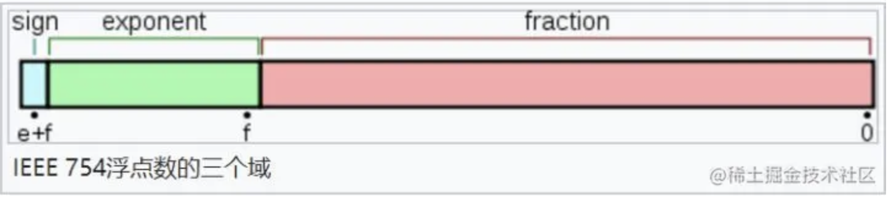
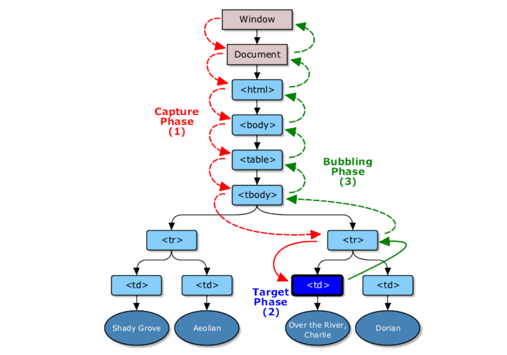
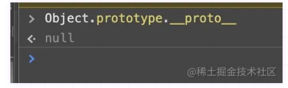
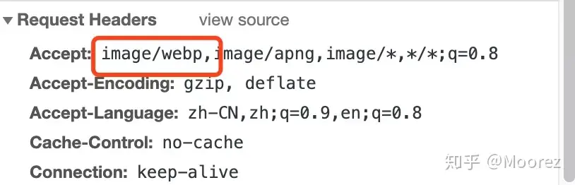
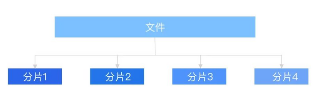

## 一、数据类型

### 1、JavaScript有哪些数据类型，它们的区别？

**区别**

-  基本/原始类型： string，number，boolean，null，undefined，symbol，bigint
-  引用类型： Function，Array，Object，Map，WeakMap，Set，WeakSet**（官方统称为 Object）**
-  **只有引用类型才有原型和原型链**

两种类型的区别在于**存储位置的不同：**

-   **原始数据类型直接存储在栈（stack）**中的简单数据段，占据空间小、大小固定，属于被频繁使用数据，所以放入栈中存储；
-   **引用数据类型存储在堆（heap）**中的对象，占据空间大、大小不固定。如果存储在栈中，将会影响程序运行的性能；引用数据类型在栈中存储了指针，该指针指向堆中该实体的起始地址。当解释器寻找引用值时，会首先检索其在栈中的地址，取得地址后从堆中获得实体。

堆和栈的概念存在于数据结构和操作系统内存中，在数据结构中：

-   在数据结构中，栈中数据的存取方式为先进后出。
-   堆是一个优先队列，是按优先级来进行排序的，优先级可以按照大小来规定。

在操作系统中，内存被分为栈区和堆区：

-   **栈区内存由编译器自动分配释放，存放函数的参数值，局部变量的值等。其操作方式类似于数据结构中的栈。**
-   **堆区内存一般由开发者分配释放，若开发者不释放，程序结束时可能由垃圾回收机制回收。**


### 2、数据类型检测的方式有哪些

- **typeof**：其中数组、对象、null都会被判断为object，其他判断都正确。

- **instanceof**：可以正确判断对象的类型，**其内部运行机制是判断在其原型链中能否找到该类型的原型**。

  ```js
  console.log(2 instanceof Number);                    // false
  console.log(true instanceof Boolean);                // false 
  console.log('str' instanceof String);                // false 
   
  console.log([] instanceof Array);                    // true
  console.log(function(){} instanceof Function);       // true
  console.log({} instanceof Object);                   // true
  ```

  可以看到，`instanceof`**只能正确判断引用数据类型**，而**不能判断基本数据类型**。`instanceof` 运算符可以用来测试一个对象在其原型链中是否存在一个构造函数的 `prototype` 属性。

- **constructor**

  `constructor`有两个作用，一是判断数据的类型，二是对象实例通过 `constrcutor` 对象访问它的构造函数。需要注意，**如果创建一个对象来改变它的原型，`constructor`就不能用来判断数据类型了**：

  ```js
  function Fn(){};
   
  Fn.prototype = new Array();	// 改变原型指向
   
  var f = new Fn();
   
  console.log(f.constructor===Fn);    // false
  console.log(f.constructor===Array); // true
  ```

- **Object.prototype.toString.call()**

  ```js
  var a = Object.prototype.toString;
  
  console.log(a.call(2));		// [object Number]
  console.log(a.call(true));		// [object Boolean]
  console.log(a.call('str'));		// [object String]
  console.log(a.call([]));		// [object Array]
  console.log(a.call(function(){}));		// [object Function]
  console.log(a.call({}));		// [object Object]
  console.log(a.call(undefined));		// [object Undefined]
  console.log(a.call(null));		// [object Null]
  ```

  **同样是检测对象obj调用toString方法，obj.toString()的结果和Object.prototype.toString.call(obj)的结果不一样，这是为什么？**

  这是因为toString是Object的原型方法，而Array、function等**类型作为Object的实例，都重写了toString方法**。不同的对象类型调用toString方法时，根据原型链的知识，调用的是对应的重写之后的toString方法（function类型返回内容为函数体的字符串，Array类型返回元素组成的字符串…），而不会去调用Object上原型toString方法（返回对象的具体类型），所以采用obj.toString()不能得到其对象类型，只能将obj转换为字符串类型；因此，在想要得到对象的具体类型时，应该调用Object原型上的toString方法。


### 3、判断数组的方式有哪些

- 通过Object.prototype.toString.call()做判断

- 通过原型链做判断

  ```js
  obj.__proto__ === Array.prototype;
  ```

- 通过ES6的Array.isArray()做判断

- 通过instanceof做判断

- 通过Array.prototype.isPrototypeOf（*isPrototypeOf用于判断 一个对象是否是另一个对象的原型*）

  ```js
  Array.prototype.isPrototypeOf(obj)
  ```


### 4、null和undefined区别

首先 Undefined 和 Null 都是基本数据类型，这两个基本数据类型分别都只有一个值，就是 undefined 和 null。

undefined 代表的含义是**未定义**，null 代表的含义是**空对象**。一般变量声明了但还没有定义的时候会返回 undefined，null主要用于赋值给一些可能会返回对象的变量，作为初始化。

**undefined 在 JavaScript 中不是一个保留字，这意味着可以使用 undefined 来作为一个变量名**，但是这样的做法是非常危险的，它会影响对 undefined 值的判断。我们可以**通过一些方法获得安全的 undefined 值**，比如说 **void 0。**

**当对这两种类型使用 typeof 进行判断时，Null 类型化会返回 “object”，这是一个历史遗留的问题。当使用双等号对两种类型的值进行比较时会返回 true，使用三个等号时会返回 false。**


### 5、Object.is() 与比较操作符 “`===”、“==”` 的区别？

- 使用双等号（==）进行相等判断时，如果两边的类型不一致，则会进行强制类型转化后再进行比较。

- 使用三等号（===）进行相等判断时，如果两边的类型不一致时，不会做强制类型准换，直接返回 false。

- 使用 Object.is 来进行相等判断时，一般情况下和三等号的判断相同，它**处理了一些特殊的情况**，**比如 -0 和 +0 不再相等，两个 NaN 是相等的。**

  ```js
  Object.is(NaN,NaN)		// true
  Object.is(+0,-0)		// false
  ```


### 6、object.assign和扩展运算法是深拷贝还是浅拷贝，两者区别

扩展运算符：

 ```js
let outObj = {
  inObj: {a: 1, b: 2}
}
let newObj = {...outObj}
newObj.inObj.a = 2
console.log(outObj) // {inObj: {a: 2, b: 2}}
 ```

Object.assign():

 ```js
let outObj = {
  inObj: {a: 1, b: 2}
}
let newObj = Object.assign({}, outObj)
newObj.inObj.a = 2
console.log(outObj) // {inObj: {a: 2, b: 2}}
 ```

可以看到**，两者都是浅拷贝。**

-   Object.assign()方法接收的第一个参数作为目标对象，后面的所有参数作为源对象。然后把所有的源对象合并到目标对象中。它会修改了一个对象，因此会触发 ES6 setter。
-   扩展操作符（…）使用它时，数组或对象中的每一个值都会被拷贝到一个新的数组或对象中。它不复制继承的属性或类的属性，但是它会复制ES6的 symbols 属性。


### 7、深拷贝和浅拷贝是什么

- **浅拷贝**： 创建一个新的对象或数组，新对象／数组中的引用类型属性值只是原对象的一个引用

- **深拷贝**： 创建一个新的对象或数组，将原对象的各项属性的“值”（数组的所有元素）拷贝过来，是“值”而不是“引用”

  - **JSON.parse(JSON.stringify(obj))**：key 为 function 或者 symbol 转化为 undefined，键值引用自身会导致报错，诸如 `Map`, `Set`, `RegExp`, `Date`, `ArrayBuffer `和其他内置类型在进行序列化时会丢失

  - **兼容多种数据类型**：递归的时候需要注意，兼容部分特殊类型如：Date、RegExp，还要考虑引用自身的情况

    ```ts
    const deepClone = (source, cache) => {
      if(!cache){
        cache = new Map() 
      }
      if(source instanceof Object) { // 不考虑跨 iframe
        if(cache.get(source)) { return cache.get(source) }
        let result 
        if(source instanceof Function) {
          if(source.prototype) { // 有 prototype 就是普通函数
            result = function(){ return source.apply(this, arguments) }
          } else {
            result = (...args) => { return source.call(undefined, ...args) }
          }
        } else if(source instanceof Array) {
          result = []
        } else if(source instanceof Date) {
          result = new Date(source - 0)
        } else if(source instanceof RegExp) {
          result = new RegExp(source.source, source.flags)
        } else {
          result = {}
        }
        cache.set(source, result)
        for(let key in source) { 
          if(source.hasOwnProperty(key)){
            result[key] = deepClone(source[key], cache) 
          }
        }
        return result
      } else {
        return source
      }
    }
    ```

### 8、typeof null 的结果是什么，为什么？

**typeof null 的结果是 'object'。**

在 JavaScript 第一个版本中，所有值都存储在 32 位的单元中，每个单元包含一个小的 **类型标签(1-3 bits)** 以及当前要存储值的真实数据。类型标签存储在每个单元的低位中，共有五种数据类型：

```js
000: object   - 当前存储的数据指向一个对象。
  1: int      - 当前存储的数据是一个 31 位的有符号整数。
010: double   - 当前存储的数据指向一个双精度的浮点数。
100: string   - 当前存储的数据指向一个字符串。
110: boolean  - 当前存储的数据是布尔值。
```

如果最低位是 1，则类型标签标志位的长度只有一位；如果最低位是 0，则类型标签标志位的长度占三位，为存储其他四种数据类型提供了额外两个 bit 的长度。

有两种特殊数据类型：

-   undefined的值是 (-2)30(一个超出整数范围的数字)；
-   null 的值是机器码 NULL 指针(null 指针的值全是 0)

那也就是说null的类型标签也是000，和Object的类型标签一样，所以会被判定为Object。

### 9、intanceof 操作符的实现原理及实现

instanceof 运算符用于判断构造函数的 prototype 属性是否出现在对象的原型链中的任何位置。

```js
function myInstanceof(left, right) {
  // 获取对象的原型
  let proto = Object.getPrototypeOf(left)
  // 获取构造函数的 prototype 对象
  let prototype = right.prototype; 
 
  // 判断构造函数的 prototype 对象是否在对象的原型链上
  while (true) {
    if (!proto) return false;
    if (proto === prototype) return true;
    // 如果没有找到，就继续从其原型上找，Object.getPrototypeOf方法用来获取指定对象的原型
    proto = Object.getPrototypeOf(proto);
  }
}
```

### 10、为什么0.1+0.2 ! == 0.3，如何让其相等

在开发过程中遇到类似这样的问题：

```js
let n1 = 0.1, n2 = 0.2
console.log(n1 + n2)  // 0.30000000000000004
```

这里得到的不是想要的结果，要想等于0.3，就要把它进行转化：

```js
(n1 + n2).toFixed(2) // 注意，toFixed为四舍五入
```

- #### 触发原因：

  `toFixed(num)` 方法可把 Number 四舍五入为指定小数位数的数字。那为什么会出现这样的结果呢？

  **计算机是通过二进制的方式存储数据的**，所以计算机计算0.1+0.2的时候，实际上是计算的两个数的二进制的和。0.1的二进制是`0.0001100110011001100...`（1100循环），0.2的二进制是：`0.00110011001100...`（1100循环），这两个数的二进制都是无限循环的数。那JavaScript是如何处理无限循环的二进制小数呢？

  一般我们认为数字包括整数和小数，但是在 JavaScript 中只有一种数字类型：Number，它的实现遵循IEEE 754标准，使用64位固定长度来表示，也就是标准的double双精度浮点数。在二进制科学表示法中，双精度浮点数的小数部分最多只能保留52位，再加上前面的1，其实就是保留53位有效数字，剩余的需要舍去，遵从“0舍1入”的原则。

  根据这个原则，0.1和0.2的二进制数相加，再转化为十进制数就是：`0.30000000000000004`。

  下面看一下**双精度数是如何保存**的： 

  
  
  -   第一部分（蓝色）：用来存储符号位（sign），用来区分正负数，0表示正数，占用1位
  -   第二部分（绿色）：用来存储指数（exponent），占用11位
  -   第三部分（红色）：用来存储小数（fraction），占用52位

  对于0.1，它的二进制为：
  
  ```js
  0.00011001100110011001100110011001100110011001100110011001 10011...
  ```

  转为科学计数法（科学计数法的结果就是浮点数）：
  
  ```js
  1.1001100110011001100110011001100110011001100110011001*2^-4
  ```

  可以看出0.1的符号位为0，指数位为-4，小数位为：
  
  ```js
  1001100110011001100110011001100110011001100110011001
  ```

  那么问题又来了，**指数位是负数，该如何保存**呢？

  IEEE标准规定了一个偏移量，对于指数部分，每次都加这个偏移量进行保存，这样即使指数是负数，那么加上这个偏移量也就是正数了。由于JavaScript的数字是双精度数，这里就以双精度数为例，它的指数部分为11位，能表示的范围就是0~2047，IEEE固定**双精度数的偏移量为1023**。
  
  -   当指数位不全是0也不全是1时(规格化的数值)，IEEE规定，阶码计算公式为 e-Bias。 此时e最小值是1，则1-1023= -1022，e最大值是2046，则2046-1023=1023，可以看到，这种情况下取值范围是`-1022~1013`。
  -   当指数位全部是0的时候(非规格化的数值)，IEEE规定，阶码的计算公式为1-Bias，即1-1023= -1022。
  -   当指数位全部是1的时候(特殊值)，IEEE规定这个浮点数可用来表示3个特殊值，分别是正无穷，负无穷，NaN。 具体的，小数位不为0的时候表示NaN；小数位为0时，当符号位s=0时表示正无穷，s=1时候表示负无穷。

  对于上面的0.1的指数位为-4，-4+1023 = 1019 转化为二进制就是：`1111111011`.

  所以，0.1表示为：
  
  ```js
  0 1111111011 1001100110011001100110011001100110011001100110011001
  ```

  说了这么多，是时候该最开始的问题了，如何实现0.1+0.2=0.3呢？

  对于这个问题，一个直接的解决方法就是设置一个误差范围，通常称为“机器精度”。对JavaScript来说，这个值通常为2-52，在ES6中，提供了`Number.EPSILON`属性，而它的值就是2-52，只要判断`0.1+0.2-0.3`是否小于`Number.EPSILON`，如果小于，就可以判断为0.1+0.2 ===0.3
  
  ```js
  function numberepsilon(arg1,arg2){                   
    return Math.abs(arg1 - arg2) < Number.EPSILON;        
  }        
  
  console.log(numberepsilon(0.1 + 0.2, 0.3)); // true
  ```

### 11、如何获取安全的 undefined 值？

因为 undefined 是一个标识符，所以可以被当作变量来使用和赋值，但是这样会影响 undefined 的正常判断。表达式 void ___ 没有返回值，因此返回结果是 undefined。**void 并不改变表达式的结果，只是让表达式不返回值。因此可以用 void 0 来获得 undefined。**

### 12、typeof NaN 的结果是什么？

**NaN 指“不是一个数字”（not a number）**，NaN 是一个“警戒值”（sentinel value，有特殊用途的常规值），用于指出数字类型中的错误情况，即“执行数学运算没有成功，这是失败后返回的结果”。

```js
typeof NaN; // "number"
```

NaN 是一个特殊值，它和自身不相等，是唯一一个非自反（自反，reflexive，即 `x === x` 不成立）的值。**而 NaN !== NaN 为 true。**

### 13、isNaN 和 Number.isNaN 函数的区别？

函数 isNaN 接收参数后，会尝试将这个参数转换为数值，**任何不能被转换为数值的的值都会返回 true，因此非数字值传入也会返回 true ，会影响 NaN 的判断。**

函数 Number.isNaN 会**首先判断传入参数是否为数字，如果是数字再继续判断是否为 NaN ，不会进行数据类型的转换，这种方法对于 NaN 的判断更为准确。**

### 14、== 操作符的强制类型转换规则？

对于 `==` 来说，如果对比双方的类型**不一样**，就会进行**类型转换**。假如对比 `x` 和 `y` 是否相同，就会进行如下判断流程：

1. 首先会判断两者类型是否**相同，**相同的话就比较两者的大小；

2. 类型不相同的话，就会进行类型转换；

3. 会先判断是否在对比 `null` 和 `undefined`，是的话就会返回 `true`

4. 判断两者类型是否为 `string` 和 `number`，是的话就会将字符串转换为 `number`

   ```js
   1 == '1'
         ↓
   1 ==  1
   ```

5. 判断其中一方是否为 `boolean`，是的话就会把 `boolean` 转为 `number` 再进行判断

   ```js
   '1' == true
           ↓
   '1' ==  1
           ↓
    1  ==  1
   ```

6. 判断其中一方是否为 `object` 且另一方为 `string`、`number` 或者 `symbol`，是的话就会把 `object` 转为原始类型再进行判断

   ```js
   '1' == { name: 'js' }        ↓'1' == '[object Object]'
   ```

### 15、其他值到字符串的转换规则？

-   Null 和 Undefined 类型 ，**null 转换为 "null"，undefined 转换为 "undefined"，**
-   Boolean 类型，**true 转换为 "true"，false 转换为 "false"。**
-   Number 类型的值直接转换，不过那些极小和极大的数字会使用指数形式。
-   **Symbol 类型的值直接转换，但是只允许显式强制类型转换，使用隐式强制类型转换会产生错误。**
-   对普通对象来说，除非自行定义 toString() 方法，否则会调用 toString()（Object.prototype.toString()）来返回内部属性 [[Class]] 的值，如"[object Object]"。如果对象有自己的 toString() 方法，字符串化时就会调用该方法并使用其返回值。

### 16、其他值到数字值的转换规则？

- **Undefined 类型的值转换为 NaN。**

- **Null 类型的值转换为 0。**

- Boolean 类型的值，**true 转换为 1，false 转换为 0。**

- String 类型的值转换如同使用 Number() 函数进行转换，**如果包含非数字值则转换为 NaN，空字符串为 0。**

- **Symbol 类型的值不能转换为数字，会报错。**

- 对象（包括数组）会首先被转换为相应的基本类型值，如果返回的是非数字的基本类型值，则再遵循以上规则将其强制转换为数字。

  ```js
  [1,2,3,4]+1 // '1,2,3,41'
  Number([1231231231])	// 1231231231
  Number([1231231231,2])	// NaN
  Number({})	// NaN
  ```

为了将值转换为相应的基本类型值，抽象操作 ToPrimitive 会首先（通过内部操作 DefaultValue）**检查该值是否有valueOf()方法。**如果有并且返回基本类型值，就使用该值进行强制类型转换。**如果没有就使用 toString() 的返回值（如果存在）来进行强制类型转换。**

如果 valueOf() 和 toString() 均不返回基本类型值，会产生 TypeError 错误。

### 17、其他值到布尔类型的值的转换规则？

以下这些是假值： • **undefined** • **null** • **false** • **+0、-0** 和 **NaN** • **""**

假值的布尔强制类型转换结果为 false。从逻辑上说，假值列表以外的都应该是真值。

### 18、|| 和 && 操作符的返回值？

|| 和 && 首先会对第一个操作数执行条件判断，如果其不是布尔值就先强制转换为布尔类型，然后再执行条件判断。

-   对于 || 来说，如果条件判断结果为 true 就返回第一个操作数的值，如果为 false 就返回第二个操作数的值。
-   && 则相反，如果条件判断结果为 true 就返回第二个操作数的值，**如果为 false 就返回第一个操作数的值。**

### 19、什么是 JavaScript 中的包装类型？

在 JavaScript 中，基本类型是没有属性和方法的，但是**为了便于操作基本类型的值，在调用基本类型的属性或方法时 JavaScript 会在后台隐式地将基本类型的值转换为对象**，如：

 ```js
const a = "abc";
a.length; // 3
a.toUpperCase(); // "ABC"
 ```

**在访问`'abc'.length`时，JavaScript 将`'abc'`在后台转换成`String('abc')`，然后再访问其`length`属性。**

JavaScript也可以使用`Object`函数显式地将基本类型转换为包装类型：

 ```js
var a = 'abc'
Object(a) // String {"abc"}
 ```

也可以使用`valueOf`方法将包装类型倒转成基本类型：

 ```js
var a = 'abc'
var b = Object(a)
var c = b.valueOf() // 'abc'
 ```

看看如下代码会打印出什么：

 ```js
var a = new Boolean( false );
if (!a) {
	console.log( "Oops" ); // never runs
}
 ```

答案是什么都不会打印，因为虽然包裹的基本类型是`false`，**但是`false`被包裹成包装类型后就成了对象，所以其非值为`false`，所以循环体中的内容不会运行。**

### 20、JavaScript 中如何进行隐式类型转换？

首先要介绍`ToPrimitive`方法，这是 JavaScript 中每个值**隐含的自带的方法**，**用来将值 （无论是基本类型值还是对象）转换为基本类型值。如果值为基本类型，则直接返回值本身；如果值为对象，其看起来大概是这样：**

 ```js
/**
* @obj 需要转换的对象
* @type 期望的结果类型
*/
ToPrimitive(obj,type)
 ```

`type`的值为`number`或者`string`。

**（1）当**`type`**为**`number`**时规则如下：**

-   调用`obj`的`valueOf`方法，**如果为基础类型值**，则返回，否则下一步；
-   调用`obj`的`toString`方法，后续同上；
-   抛出`TypeError` 异常。

**（2）当**`type`**为**`string`**时规则如下：**

-   调用`obj`的`toString`方法，如果为基础类型值，则返回，否则下一步；
-   调用`obj`的`valueOf`方法，后续同上；
-   抛出`TypeError` 异常。

**可以看出两者的主要区别在于调用`toString`和`valueOf`的先后顺序。**默认情况下：

-   如果**对象为 Date 对象，则`type`默认为`string`；**
-   **其他情况下，`type`默认为`number`。**

总结上面的规则，对于 Date 以外的对象，转换为基本类型的大概规则可以概括为一个函数：

 ```js
var objToNumber = value => Number(value.valueOf().toString())
objToNumber([]) === 0
objToNumber({}) === NaN
 ```

**而 JavaScript 中的隐式类型转换主要发生在`+、-、*、/`以及`==、>、<`这些运算符之间**。而这些运算符只能操作基本类型值，所以在进行这些运算前的第一步就是将两边的值用`ToPrimitive`转换成基本类型，再进行操作。

**以下是基本类型的值在不同操作符的情况下隐式转换的规则 （对于对象，其会被`ToPrimitive`转换成基本类型，所以最终还是要应用基本类型转换规则）：**

1.  `+`**操作符**

**`+`操作符的两边有至少一个`string`类型变量时，两边的变量都会被隐式转换为字符串；**其他情况下两边的变量都会被转换为数字。

 ```js
1 + '23' // '123'
 1 + false // 1 
 1 + Symbol() // Uncaught TypeError: Cannot convert a Symbol value to a number
 '1' + false // '1false'
 false + true // 1
 ```

1.  `-`、`*`、`\`**操作符**

`NaN`也是一个数字

 ```js
1 * '23' // 23
 1 * false // 0
 1 / 'aa' // NaN
 ```

1.  **对于**`==`**操作符**

操作符两边的值都尽量转成`number`：

 ```js
3 == true // false, 3 转为number为3，true转为number为1
'0' == false //true, '0'转为number为0，false转为number为0
'0' == 0 // '0'转为number为0
 ```

1.  **对于**`<`**和**`>`**比较符**

**如果两边都是字符串，则比较字母表顺序：**

 ```js
'ca' < 'bd' // false
'a' < 'b' // true
 ```

其他情况下，转换为数字再比较：

 ```js
'12' < 13 // true
false > -1 // true
 ```

以上说的是基本类型的隐式转换，而对象会被`ToPrimitive`转换为基本类型再进行转换：

 ```js
var a = {}
a > 2 // false
 ```

其对比过程如下：

 ```js
a.valueOf() // {}, 上面提到过，ToPrimitive默认type为number，所以先valueOf，结果还是个对象，下一步
a.toString() // "[object Object]"，现在是一个字符串了
Number(a.toString()) // NaN，根据上面 < 和 > 操作符的规则，要转换成数字
NaN > 2 //false，得出比较结果
 ```

又比如：

 ```js
var a = {name:'Jack'}
var b = {age: 18}
a + b // "[object Object][object Object]"
 ```

运算过程如下：

 ```js
a.valueOf() // {}，上面提到过，ToPrimitive默认type为number，所以先valueOf，结果还是个对象，下一步
a.toString() // "[object Object]"
b.valueOf() // 同理
b.toString() // "[object Object]"
a + b // "[object Object][object Object]"
 ```


## 二、ES6

### 1、let、const、var的区别

**（1）块级作用域：** 块作用域由 `{ }`包括，let和const具有块级作用域，var不存在块级作用域。块级作用域解决了ES5中的两个问题：

-   内层变量可能覆盖外层变量
-   用来计数的循环变量泄露为全局变量

**（2）变量提升：** var存在变量提升，let 和 const 存在变量提升（其实是提升的，只是在初始化之前使用都会报错），即在变量只能在声明之后使用，否在会报错。

```js
var name = 213
{
	console.log(name)		// error：如果没有提升是会正常输出 123
	let name = 321
	console.log(name)
}
```

**（3）给全局添加属性：** 浏览器的全局对象是window，Node的全局对象是global。var声明的变量为全局变量，并且会将该变量添加为全局对象的属性（**只有在全局作用域下才会，除非在函数内部使用了非声明式的变量**），但是 let 和 const 不会。

**（4）重复声明：** var声明变量时，可以重复声明变量，后声明的同名变量会覆盖之前声明的遍历。const和let不允许重复声明变量。

**（5）暂时性死区：** 在使用let、const命令声明变量之前，该变量都是不可用的。这在语法上，称为**暂时性死区**。使用var声明的变量不存在暂时性死区。

**（6）初始值设置：** 在变量声明时，var 和 let 可以不用设置初始值。而const声明变量必须设置初始值。

**（7）指针指向：** let和const都是ES6新增的用于创建变量的语法。 let创建的变量是可以更改指针指向（可以重新赋值）。但**const声明的变量是不允许改变指针的指向。**


### 2、如果new一个箭头函数的会怎么样

箭头函数是ES6中的提出来的，**它没有prototype，也没有自己的this指向，更不可以使用arguments参数，**所以不能new一个箭头函数。

new操作符的实现步骤如下：

1.  创建一个对象
2.  将构造函数的作用域赋给新对象（也就是将对象的`__proto__`属性指向构造函数的prototype属性）
3.  指向构造函数中的代码，构造函数中的**this指向该对象**（也就是为这个对象添加属性和方法）
4.  返回新的对象

所以，上面的第二、三步，箭头函数都是没有办法执行的。


### 3、箭头函数与普通函数的区别

-   **（1）箭头函数比普通函数更加简洁**

-   **（2）箭头函数没有自己的this**

-   **（3）箭头函数继承来的this指向永远不会改变**

-   **（4）call()、apply()、bind()等方法不能改变箭头函数中this的指向**

-   **（5）箭头函数不能作为构造函数使用**

-   **（6）箭头函数没有自己的arguments**

-   **（7）箭头函数没有prototype**

-   （8）箭头函数不能用作Generator函数，不能使用yeild关键字


### 4、箭头函数的 this 指向哪里？

箭头函数不同于传统JavaScript中的函数，箭头函数并没有属于⾃⼰的this，它所谓的this是捕获**其所在上下⽂的 this 值**，作为⾃⼰的 this 值，并且由于没有属于⾃⼰的this，所以是不会被new调⽤的，这个所谓的this也不会被改变。

 ```js
// ES6 
const obj = { 
  getArrow() { 
    return () => { 
      console.log(this === obj); 
    }; 
  } 
}
 ```

转化后：

 ```js
// ES5，由 Babel 转译
var obj = { 
   getArrow: function getArrow() { 
     var _this = this; 
     return function () { 
        console.log(_this === obj); 
     }; 
   } 
};
 ```


### 5、Proxy 可以实现什么功能？

在 Vue3.0 中通过 `Proxy` 来替换原本的 `Object.defineProperty` 来实现数据响应式。

Proxy 是 ES6 中新增的功能，它可以用来自定义对象中的操作。

 ```js
let p = new Proxy(target, handler)
 ```

`target` 代表需要添加代理的对象，`handler` 用来自定义对象中的操作，比如可以用来自定义 `set` 或者 `get` 函数。

下面来通过 `Proxy` 来实现一个数据响应式：

 ```js
let onWatch = (obj, setBind, getLogger) => {
  let handler = {
    get(target, property, receiver) {
      getLogger(target, property)
      return Reflect.get(target, property, receiver)
    },
    set(target, property, value, receiver) {
      setBind(value, property)
      return Reflect.set(target, property, value)
    }
  }
  return new Proxy(obj, handler)
}
let obj = { a: 1 }
let p = onWatch(
  obj,
  (v, property) => {
    console.log(`监听到属性${property}改变为${v}`)
  },
  (target, property) => {
    console.log(`'${property}' = ${target[property]}`)
  }
)
p.a = 2 // 监听到属性a改变
p.a // 'a' = 2
 ```

在上述代码中，通过自定义 `set` 和 `get` 函数的方式，在原本的逻辑中插入了我们的函数逻辑，实现了在对对象任何属性进行读写时发出通知。

当然**这是简单版的响应式实现，**如果需要实现一个 Vue 中的响应式，需要在 `get` 中收集依赖，在 `set` 派发更新，**之所以 Vue3.0 要使用 `Proxy` 替换原本的 API 原因在于 `Proxy` 无需一层层递归为每个属性添加代理，**一次即可完成以上操作，性能上更好，并且原本的实现有一些数据更新不能监听到，但是 `Proxy` 可以完美监听到任何方式的数据改变，唯一缺陷就是浏览器的兼容性不好。


### 6、说一下迭代器和生成器

**迭代器**：

- **特点**

  -   实现了迭代器接口的对象称为迭代器对象，这个迭代器供 for...of 消费使用
  -   迭代器对象必须实现 `[Symbol.iterator]` 这个函数属性
  -   `[Symbol.iterator]` 函数返回一个对象，这个对象包含了一个 next 函数，同时，next函数必须返回对象（一个是value值，一个是done值）

- **应用场景**：

  -   统一遍历不同类型的数据结构：**迭代器**提供了一种统一的遍历不同类型数据结构的方法，比如数组、Set、Map 等。
  -   实现分步执行：**迭代器**可以通过next() 方法控制执行的步骤，实现分步执行的效果。
  -   实现可控制的数据流：**迭代器**可以控制生成的数据的顺序，以及生成的数据的数量。

- **手动实现**：

  ```js
  const obj = {
      // 手动实现迭代器
      [Symbol.iterator] () {
          let flag = false;
          // 返回一个函数，且携带有 next 属性，next 必须返回一个对象（带有 value 和 done 属性）
          return {
              next () {
                  if (!flag) {
                      flag = true
                      return {
                          value: 1,
                          done: false
                      }
                  } else {
                      // 必须具备 done 为 true，否则会一直循环下去
                      return {
                          value: null,
                          done: true
                      }
                  }
              }
          }
      }
  }
  for (const iterator of obj) {
      console.log(iterator);      // 1
  }
  ```

**生成器**

- **特点**：

  -   通过 `function*` 语法，定义一个**生成器函数** (generator function)，它**返回**一个 [`Generator`](https://developer.mozilla.org/zh-CN/docs/Web/JavaScript/Reference/Global_Objects/Generator) 对象。
  -   操作需要暂停的地方，都用 **yield** 语句注明，分割异步操作
  -   通过返回的 Generator 对象，调用 **next** 触发 yield 分割的操作，实现代码执行的控制
  -   **调用 next 后，会返回 yield 右边的值**；同时，当**传递给 next 参数值**的时候，会**赋值给上一个 yield 左边的变量**
  -   **next 的返回值是一个对象，包含 value 和 done 属性**，与迭代器属性说明一致
  -   `yield*` 语法可以将**调用其它的生成器函数或者是迭代器对象**

- **使用场景**：

  -   **针对异步编程新的解决方案**如：文件读写，数据库加载，数据请求
  -   **数据处理**：使用迭代器遍历二维数组并转换成一维数组

- **手动实现**：

  ```js
  function* g1 () {
      yield "g1"
  }
  function* g2 () {
      yield "g2"
      yield* g1()
      yield "g2 end"
  }
  let generator = g2()
  console.log(generator.next());  // { value: 'g2', done: false }
  console.log(generator.next());  // { value: 'g1', done: false } 
  console.log(generator.next());  // { value: 'g2 end', done: false }
  console.log(generator.next());  // { value: undefined, done: true }
  ```


### 7、说一下 Map、Set、WeakMap、WeakSet

- #### **Map**：

  -   **特点**：
      -   Map 对象保存键值对，并**记住键的原始插入顺序**
      -   "键"的范围不限于字符串，可以是各种类型的值（包括对象）
      -   Map也实现了 iterator 的接口，可以使用 扩展运算符 和 for..of 进行遍历

  -   **使用场景**：https://developer.aliyun.com/article/915337
      -   在性能的表现上，新增、删除、读取的速度，在数量非常少时，Object 的表现可能会稍微好那么一点点点，甚至不太明显能感知得出来。**达到五万个属性过后，使用 Map 读写才会更快**
      -   策略模式通常情况下都是一个键值对应一个规则。但是！在某些特殊场景下，**会出现多个键值对应一个规则的情况**。这个时候，Map 就有了用武之地。**Map 支持正则表达式作为 key 值，这样，使用 Map 就可以存储多对一的匹配规则**。


- #### **Set**：

  -   **特点**：
      -   Set对象允许您存储任何类型的唯一值，无论是基础值还是对象引用。
      -   集合实现了iterator接口，可以使用 扩展运算符 和 for...of 进行遍历

  -   **使用场景**：
      -   数组去重
      -   交集、并集、差集


- #### **WeakMap**：

  -   WeakMap是键/值对的集合，**其键必须是对象（null除外）**，具有任意JavaScript类型的值，并且不会创建对其键的强引用。

  -   一个对象在WeakMap中作为键的存在并不会阻止该对象被垃圾收集。一旦收集了用作键的对象，它在任何WeakMap中的对应值也会成为垃圾收集的候选值，只要它们在其他地方没有被强引用。（**自动回收键值**）

  -   WeakMap允许将数据关联到对象，即使**值引用键，也不会阻止收集键对象**

  -   WeakMap 没有获取列表如 key值、value值 的方法


- #### **WeakSet**：

  -   WeakSet**仅是对象的集合**。它们不能像集一样包含任何类型的任意值。

  -   WeakSet是弱引用的，这意味着对WeakSet中对象的引用是**弱引用**的。如果不存在对存储在WeakSet中的对象的其他引用，则可以对这些对象进行垃圾收集。

**WeakMap、WeakSet 都是对对象的处理，且都是弱引用，避免了原先的内存泄露问题，没有被引用的对象会被垃圾回收机制自动回收**

```js
const ComList = new WeakMap()
const VueList = {
    vDom1: {
        name: 'vDom1',
        age: 18
    }
}
ComList.set(VueList.vDom1, {
    created () { console.log("vDom1 被创建了") },
    mounted () { console.log("vDom1 被挂载了") }
})
console.log(ComList);        // 有值

// vDom1 组件被销毁了，对应关联数据也被销毁
setTimeout(() => {
    delete VueList.vDom1
}, 100);
setTimeout(() => {
    console.log(VueList);       // 无值
}, 2000);
```

**两者使用场景**：借助WeakMap键名对象都是弱引用这一特点，WeakMap 可用于反射。Angular、Nest等依赖注入框架都使用了反射技术，如其中核心的依赖 [reflect-metadata](https://github.com/rbuckton/reflect-metadata/blob/master/Reflect.ts#L685) 就会用到WeakMap。

如上面的案例可能是最佳的使用场景，如果有一个存放 组件对象（如 Vue 对象 或者 React 元素） 的集合，当该组件对象被销毁时，组件对象对应关联的数据（如生命周期、关联数据）也会被释放掉


### 8、const对象的属性可以修改吗

**const 保证的并不是变量的值不能改动，而是变量指向的那个内存地址不能改动**。对于基本类型的数据（数值、字符串、布尔值），其值就保存在变量指向的那个内存地址，因此等同于常量。

但对于引用类型的数据（主要是对象和数组）来说，变量指向数据的内存地址，保存的只是一个指针，const只能保证这个指针是固定不变的，至于它指向的数据结构是不是可变的，就完全不能控制了。


### 9、扩展运算符的作用及使用场景

1. **解构对象**

   ```js
   // 扩展运算符对对象实例的拷贝属于浅拷贝
   let bar = { a: 1, b: 2 };
   let baz = { ...bar }; // { a: 1, b: 2 }
   ```

2. **解构数组**

   ```js
   
   ```

3. **设置参数**

   ```js
   
   ```

   

- **（2）数组扩展运算符**

  ```js
  console.log(...[1, 2, 3])
  // 1 2 3
  console.log(...[1, [2, 3, 4], 5])
  // 1 [2, 3, 4] 5
  ```

  1. **将数组转换为参数序列**

     ```js
     function add(x, y) {
       return x + y;
     }
     const numbers = [1, 2];
     add(...numbers) // 3
     ```

  2. **复制数组**

     ```js
     const arr1 = [1, 2];
     const arr2 = [...arr1];
     ```

  3. **合并数组**

  4. **如果将扩展运算符用于数组赋值，只能放在参数的最后一位，否则会报错。**

     ```js
     const [first, ...rest] = [1, 2, 3, 4, 5];first // 1rest  // [2, 3, 4, 5]
     ```

  5. **将字符串转为真正的数组**

     ```js
     [...'hello']    // [ "h", "e", "l", "l", "o" ]
     ```

  6. **将伪数组转化为真数组**

     ```js
     // arguments对象
     function foo() {
       const args = [...arguments];
     }
     ```

### 10、如何提取高度嵌套的对象里的指定属性？

有时会遇到一些嵌套程度非常深的对象：

```javascript
const school = {
   classes: {
      stu: {
         name: 'Bob',
         age: 24,
      }
   }
}
```

像此处的 name 这个变量，嵌套了四层，此时如果仍然尝试老方法来提取它：

```javascript
const { name } = school
```

显然是不奏效的，因为 school 这个对象本身是没有 name 这个属性的，name 位于 school 对象的“儿子的儿子”对象里面。要想把 name 提取出来，一种比较笨的方法是逐层解构：

```javascript
const { classes } = school
const { stu } = classes
const { name } = stu
name // 'Bob'
```

但是还有一种更标准的做法，可以用一行代码来解决这个问题：

```javascript
const { classes: { stu: { name } }} = school
       
console.log(name)  // 'Bob'
```

可以在解构出来的变量名右侧，通过冒号+{目标属性名}这种形式，进一步解构它，一直解构到拿到目标数据为止。

### 11、对 rest 参数的理解

扩展运算符被用在函数形参上时，**它还可以把一个分离的参数序列整合成一个数组**：

```javascript
function mutiple(...args) {
  let result = 1;
  for (var val of args) {
    result *= val;
  }
  return result;
}
mutiple(1, 2, 3, 4) // 24
```

这里，传入 mutiple 的是四个分离的参数，但是如果在 mutiple 函数里尝试输出 args 的值，会发现它是一个数组：

```javascript
function mutiple(...args) {
  console.log(args)
}
mutiple(1, 2, 3, 4) // [1, 2, 3, 4]
```

这就是 … rest运算符的又一层威力了，它可以把函数的多个入参收敛进一个数组里。这一点**经常用于获取函数的多余参数，或者像上面这样处理函数参数个数不确定的情况。**

### 12、ES6中模板语法与字符串处理

ES6 提出了“模板语法”的概念。在 ES6 以前，拼接字符串是很麻烦的事情：

```javascript
var name = 'css'   
var career = 'coder' 
var hobby = ['coding', 'writing']
var finalString = 'my name is ' + name + ', I work as a ' + career + ', I love ' + hobby[0] + ' and ' + hobby[1]
```

仅仅几个变量，写了这么多加号，还要时刻小心里面的空格和标点符号有没有跟错地方。但是有了模板字符串，拼接难度直线下降：

```javascript
var name = 'css'   
var career = 'coder' 
var hobby = ['coding', 'writing']
var finalString = `my name is ${name}, I work as a ${career} I love ${hobby[0]} and ${hobby[1]}`
```

字符串不仅更容易拼了，也更易读了，代码整体的质量都变高了。这就是模板字符串的第一个优势——允许用${}的方式嵌入变量。但这还不是问题的关键，模板字符串的关键优势有两个：

-   在模板字符串中，空格、缩进、换行都会被保留
-   模板字符串完全支持“运算”式的表达式，可以在${}里完成一些计算

基于第一点，可以在模板字符串里无障碍地直接写 html 代码：

```javascript
let list = `
	<ul>
		<li>列表项1</li>
		<li>列表项2</li>
	</ul>
`;
console.log(message); // 正确输出，不存在报错
```

基于第二点，可以把一些简单的计算和调用丢进 ${} 来做：

```javascript
function add(a, b) {
  const finalString = `${a} + ${b} = ${a+b}`
  console.log(finalString)
}
add(1, 2) // 输出 '1 + 2 = 3'
```

除了模板语法外， **ES6中还新增了一系列的字符串方法**用于提升开发效率：

（1）**存在性判定**：在过去，当判断一个字符/字符串是否在某字符串中时，只能用 indexOf > -1 来做。现在 ES6 提供了三个方法：includes、startsWith、endsWith，它们都会返回一个布尔值来告诉你是否存在。

-   **includes**：判断字符串与子串的包含关系：

```javascript
const son = 'haha' 
const father = 'xixi haha hehe'
father.includes(son) // true
```

-   **startsWith**：判断字符串是否以某个/某串字符开头：

```javascript
const father = 'xixi haha hehe'
father.startsWith('haha') // false
father.startsWith('xixi') // true
```

-   **endsWith**：判断字符串是否以某个/某串字符结尾：

```javascript
const father = 'xixi haha hehe'
  father.endsWith('hehe') // true
```

（2）**自动重复**：可以使用 repeat 方法来使同一个字符串输出多次（被连续复制多次）：

```javascript
const sourceCode = 'repeat for 3 times;'
const repeated = sourceCode.repeat(3) 
console.log(repeated) // repeat for 3 times;repeat for 3 times;repeat for 3 times;
```


## 三、JavaScript基础

### 1、new操作符的实现原理

**new操作符的执行过程：**

（1）首先创建了一个新的空对象

（2）设置原型，将对象的原型设置为函数的 prototype 对象。

（3）让函数的 this 指向这个对象，执行构造函数的代码（为这个新对象添加属性）

（4）判断函数的返回值类型，如果是基础类型，返回创建的对象。如果是引用类型，就返回这个引用类型的对象。

具体实现：

 ```js
function objectFactory() {
  let newObject = null;
  let constructor = Array.prototype.slice.call(arguments);
  let result = null;
  // 判断参数是否是一个函数
  if (typeof constructor !== "function") {
    console.error("type error");
    return;
  }
  // 新建一个空对象，对象的原型为构造函数的 prototype 对象
  newObject = Object.create(constructor.prototype);
  // 将 this 指向新建对象，并执行函数
  result = constructor.apply(newObject, arguments);
  // 判断返回对象
  let flag = result && (typeof result === "object" || typeof result === "function");
  // 判断返回结果
  return flag ? result : newObject;
}
// 使用方法
objectFactory(构造函数, 初始化参数);
 ```


### 2、伪/类数组如何转化为真数组

1. 方法一：最简单的，先准备一个新的空数组，然后遍历伪数组，将伪数组中的值通过索引逐个添加到新数组当中。

   ```js
   let newArr = [];
   for(let i = 0; i < arguments.length; i++){
     newArr[i] = arguments[i];
   }
   ```

2. 方法二：利用 扩展运算符(...) 将伪数组转化为真数组 - ES6语法

   ```js
   let divs = document.querySelectorAll('div');
   let arr = [...divs];
   ```

3. 方法三：利用 Array 的原型对象的 slice 方法，配合 call() 方法修改 slice 中 this 指向

   ```js
   let arr = [].slice.call(divs);
   ```

4. 通过 call 调用数组的 splice 方法来实现转换

   ```js
   Array.prototype.splice.call(divs, 0);
   ```

5. 方法四：利用Array.from方法 - ES6

   >   Array.from方法是从一个类似数组或可迭代对象创建一个新的，浅拷贝的数组实例。

   ```js
   let arr = Array.from(divs);
   ```


### 3、use strict是什么意思 ? 使用它区别是什么？

[use strict](https://developer.mozilla.org/zh-CN/docs/Web/JavaScript/Reference/Strict_mode) 是一种 ECMAscript5 添加的（严格模式）运行模式，这种模式使得 Javascript 在更严格的条件下运行。设立严格模式的目的如下：

-   **消除 Javascript 语法的不合理、不严谨之处，减少怪异行为;**
-   消除代码运行的不安全之处，保证代码运行的安全；
-   提高编译器效率，增加运行速度；
-   为未来新版本的 Javascript 做好铺垫。

区别：

1. 禁止使用 **with** 语句。

   **with副作用**：与eval类似，with语句的javascript代码非常难于优化，同时也会给调试代码造成困难，并且同没有使用with语句的代码相比，它**运算得更慢**而且，**如果with语句不当，还有可能造成变量泄漏，污染全局作用域的情况**

   ```js
   with({a:1}){
       console.log(a)
   }
   // with 语句 为一个或一组语句指定默认对象。 
   // 用法：with (<对象>) <语句>; 
   ```

2. **禁止 this 关键字指向全局对象，默认指向undefined**。

3. 严格模式下无法再意外创建全局变量

   ```js
   "use strict";
                          // 假如有一个全局变量叫做 mistypedVariable
   mistypedVaraible = 17; // 因为变量名拼写错误
                          // 这一行代码就会抛出 ReferenceError
   ```

4. 严格模式要求函数的参数名唯一

5. 严格模式禁止八进制数字语法

6. 在严格模式下，试图删除不可删除的属性时会抛出异常 (之前这种操作不会产生任何效果):

   ```js
   "use strict";
   delete Object.prototype; // 抛出 TypeError 错误
   ```


### 4、window.addEventListener 的第三个参数作用

当第三个参数设置为true就在捕获过程中执行，反之就在冒泡过程中执行处理函数。需要更详细

**语法方面**：

```js
addEventListener(type, listener);
addEventListener(type, listener, options);
addEventListener(type, listener, useCapture);		// useCapture 代表事件在捕获阶段触发还是冒泡阶段触发
```

第三个参数如果是 **options** 的话，可用的选项如下：

- `capture` 可选

  一个布尔值，表示 `listener` 会在该类型的事件捕获阶段传播到该 `EventTarget` 时触发。

- `once` 可选

  一个布尔值，表示 `listener` 在添加之后**最多只调用一次**。如果为 `true`，`listener` 会在其被调用之后**自动移除**。

- `passive` 可选

  一个布尔值，设置为 `true` 时，表示 `listener` 永远不会调用 `preventDefault()`。如果 listener 仍然调用了这个函数，客户端将会忽略它并抛出一个控制台警告。查看 [使用 passive 改善滚屏性能](https://developer.mozilla.org/zh-CN/docs/Web/API/EventTarget/addEventListener#使用_passive_改善滚屏性能) 以了解更多。

- `signal` 可选

  [`AbortSignal`](https://developer.mozilla.org/zh-CN/docs/Web/API/AbortSignal)，该 `AbortSignal` 的 [`abort()`](https://developer.mozilla.org/zh-CN/docs/Web/API/AbortController/abort) 方法被调用时，监听器会被移除。

**常见的默认事件**：

-   点击一个链接 —— 触发导航（navigation）到该 URL。
-   点击表单的提交按钮 —— 触发提交到服务器的行为。
-   在文本上按下鼠标按钮并移动 —— 选中文本。


### 5、说一下事件流机制

**事件的概念：**

　　HTML中与javascript交互是通过**事件驱动**来实现的，例如鼠标点击事件、页面的滚动事件onscroll等等，可以向文档或者文档中的元素添加事件侦听器来预订事件。想要知道这些事件是在什么时候进行调用的，就需要了解一下“事件流”的概念。

- #### 【1】事件阶段（Event Phases）


当一个DOM事件触发时，它不是在触发的对象上只触发一次的，而是经历三个阶段。分别为

1.  一开始从文档的根节点流向目标对象（捕获阶段）
2.  然后在目标对向上被触发（目标阶段）
3.  之后再回溯到文档的根节点（冒泡阶段）



- #### 【2】事件冒泡

  结构上嵌套关系的元素，会存在事件冒泡的功能，即同一事件，**自子元素冒泡向父元素**

  ```js
      grand.addEventListener('click', function () {
        console.log('grand');
      }, false)
      father.addEventListener('click', function () {
        console.log('father');
      }, false)
      son.addEventListener('click', function () {
        console.log('son');
      }, false)
  
      // 点击 son , 出现 son 、father 、grand
  ```

- #### 【3】事件捕获

  - 结构上嵌套关系的元素，会存在事件捕获的功能，即同一事件，自父元素捕获至子元素（事件源元素）（自顶向下）

  - IE没有捕获事件

    ```js
        // 2 捕获阶段 从上到下
        grand.addEventListener('click', function () {
          console.log('grand');
        }, true)
        father.addEventListener('click', function () {
          console.log('father');
        }, false)
        // 修改为 false 后点击son, grand 、son 、father
        son.addEventListener('click', function () {
          console.log('son');
        }, true)
    
        // 点击son , 出现 grand 、father 、son
    ```

**部分事件是不会冒泡的**：focus、blur、change、sumbit、reset、select 等事件不冒泡


### 6、如何阻止浏览器默认行为

默认事件：表单提交、a标签跳转、右键菜单等等

- `return false`        以对象属性的方式（dom.onXXX）注册的事件才生效
- `event.preventDefault()`        W3C标准，IE9 以下不兼容
- `event.returnValue = false`        兼容IE


### 7、如何取消冒泡事件触发

- W3C标准：**event.stopPropagation()**，但不支持 IE9 以下版本

- IE 独有：**event.cancelBubble = true**

- `event.stopImmediatePropagation` 同样也能实现阻止冒泡，但是与 stopPropagation 的区别好就是它还能**阻止该事件目标执行别的注册事件**

  ```js
  node.addEventListener(
    'click',
    event => {
      event.stopImmediatePropagation()
      console.log('冒泡')
    },
    false
  )
  // 点击 node 只会执行上面的函数，该函数不会执行
  node.addEventListener(
    'click',
    event => {
      console.log('捕获 ')
    },
    true
  )
  ```


### 8、说一下事件代理机制

JavaScript 中一个重要的方法就是事件委托（又叫事件代理）。

事件委托**将事件侦听器添加到一个父级元素上**，这样就只用添加一次事件侦听器，可以避免向 （父级元素内）很多特定的 DOM 节点添加多个事件侦听器，减少了内存消耗，从而优化程序性能。

而这个添加在父元素上的事件侦听器**通过事件冒泡的事件流机制以分析查找子元素的匹配项**。

-   **性能**：不需要循环所有元素一个个绑定
-   **灵活**：当有新的子元素时不需要重新绑定

```html
<body>
  <div>
    <div>aa</div>
    <div style="width:100px;height:100px;background-color:#666;">bb</div>
  </div>
  <script>
    let div = document.getElementsByTagName('div')[0];
    div.onclick = function (e) {
      // 1 获取事件对象，兼容性写法
      let event = e || window.event;
      // 2 获取事件源对象，兼容性写法
      let target = event.target || event.srcElement;
      // 3 事件委托
      console.log(target.innerText);
        // 点击 aa，输出aa；bb同理
      // event.currentTarget 指向真正挂载监听函数的对象
    }
  </script>
</body>
```


### 9、JS 中的变量提升

变量提升的表现是，无论在函数中何处位置声明的变量，好像都被提升到了函数的首部，可以在变量声明前访问到而不会报错。

造成变量声明提升的**本质原因**是 js 引擎在**代码执行前有一个解析的过程，创建了执行上下文，初始化了一些代码执行时需要用到的对象**。当访问一个变量时，会到当前执行上下文中的作用域链中去查找，而作用域链的首端指向的是当前执行上下文的变量对象，这个变量对象是执行上下文的一个属性，它包含了函数的形参、所有的函数和变量声明，这个对象的是在代码解析的时候创建的。

首先要知道，JS在拿到一个变量或者一个函数的时候，会有两步操作，即**解析和执行**。

**解析阶段**：

>   **字面量声明的函数的变量提升优先级更高**

-   JS 会检查语法，并对函数进行预编译。解析的时候会先创建一个全局执行上下文环境，先把代码中即将执行的变量、函数声明都拿出来，变量先赋值为undefined，函数先声明好可使用。在一个函数执行之前，也会创建一个函数执行上下文环境，跟全局执行上下文类似，不过函数执行上下文会多出this、arguments和函数的参数。


-   全局上下文：变量定义，函数声明
-   函数上下文：变量定义，函数声明，this，arguments

**执行阶段**：就是按照代码的顺序依次执行。（**函数声明和初始化都会被提升**，**函数表达式不会被提升**）

- #### 变量提升的好处？

**（1）提高性能** 在JS代码执行之前，会进行语法检查和预编译，并且这一操作只进行一次。这么做就是为了提高性能，如果没有这一步，那么每次执行代码前都必须重新解析一遍该变量（函数），而这是没有必要的，因为变量（函数）的代码并不会改变，解析一遍就够了。

在解析的过程中，还会为函数生成预编译代码。在预编译时，会统计声明了哪些变量、创建了哪些函数，并对函数的代码进行压缩，去除注释、不必要的空白等。这样做的好处就是每次执行函数时都可以直接为该函数分配栈空间（不需要再解析一遍去获取代码中声明了哪些变量，创建了哪些函数），并且因为代码压缩的原因，代码执行也更快了。

**（2）容错性更好**

变量提升可以在一定程度上提高JS的容错性，看下面的代码：

 ```js
a = 1;var a;console.log(a);
 ```

如果没有变量提升，这两行代码就会报错，但是因为有了变量提升，这段代码就可以正常执行。

虽然，在可以开发过程中，可以完全避免这样写，但是有时代码很复杂的时候。可能因为疏忽而先使用后定义了，这样也不会影响正常使用。由于变量提升的存在，而会正常运行。

- #### 造成的影响？


声明提升虽然提高JS代码的容错性，但会**使一些不规范的代码也可以正常执行**，使 js 代码执行比较怪异不符合认知

变量提升虽然有一些优点，但是他也会造成一定的问题，在ES6中提出了let、const来定义变量，它们就没有变量提升的机制。下面看一下变量提升可能会导致的问题：

 ```js
var tmp = new Date();

function fn(){
	console.log(tmp);
	if(false){
		var tmp = 'hello world';
	}
}

fn();  // undefined
 ```

在这个函数中，原本是要打印出外层的tmp变量，但是因为变量提升的问题，内层定义的tmp被提到函数内部的最顶部，相当于覆盖了外层的tmp，所以打印结果为 undefined。

 ```js
var tmp = 'hello world';

for (var i = 0; i < tmp.length; i++) {
	console.log(tmp[i]);
}

console.log(i); // 11
 ```

由于遍历时定义的 i 会变量提升成为一个全局变量，在函数结束之后不会被销毁，所以打印出来11。

### 10、如何去判断一个整数

-   使用正则，判断 `.` 的存在
-   使用 Math.ceil / floor / round 方法转化后与原值进行对比，一致则是整数

### 11、JavaScript有哪些内置对象

全局的对象（ global objects ）或称标准内置对象，不要和 "全局对象（global object）" 混淆。这里说的全局的对象是说在 全局作用域里的对象。全局作用域中的其他对象可以由用户的脚本创建或由宿主程序提供。

**标准内置对象的分类：**

（1）值属性，这些全局属性返回一个简单值，这些值没有自己的属性和方法。例如 Infinity、NaN、undefined、null 字面量

（2）函数属性，全局函数可以直接调用，不需要在调用时指定所属对象，执行结束后会将结果直接返回给调用者。例如 eval()、parseFloat()、parseInt() 等

（3）基本对象，基本对象是定义或使用其他对象的基础。基本对象包括一般对象、函数对象和错误对象。例如 Object、Function、Boolean、Symbol、Error 等

（4）数字和日期对象，用来表示数字、日期和执行数学计算的对象。例如 Number、Math、Date

（5）字符串，用来表示和操作字符串的对象。例如 String、RegExp

（6）可索引的集合对象，这些对象表示按照索引值来排序的数据集合，包括数组和类型数组，以及类数组结构的对象。例如 Array

（7）使用键的集合对象，这些集合对象在存储数据时会使用到键，支持按照插入顺序来迭代元素。 例如 Map、Set、WeakMap、WeakSet

（8）矢量集合，SIMD 矢量集合中的数据会被组织为一个数据序列。 例如 SIMD 等

（9）结构化数据，这些对象用来表示和操作结构化的缓冲区数据，或使用 JSON 编码的数据。例如 JSON 等

（10）控制抽象对象 例如 Promise、Generator 等

（11）反射。例如 Reflect、Proxy

（12）国际化，为了支持多语言处理而加入 ECMAScript 的对象。例如 Intl、Intl.Collator 等

（13）**WebAssembly**

（14）其他。例如 arguments

**总结：** js 中的内置对象主要指的是在程序执行前存在全局作用域里的由 js 定义的一些全局值属性、函数和用来实例化其他对象的构造函数对象。一般经常用到的如全局变量值 NaN、undefined，全局函数如 parseInt()、parseFloat() 用来实例化对象的构造函数如 Date、Object 等，还有提供数学计算的单体内置对象如 Math 对象。

### 12、对JSON的理解

JSON 是一种基于文本的轻量级的数据交换格式。它可以被任何的编程语言读取和作为数据格式来传递。

在项目开发中，使用 JSON 作为前后端数据交换的方式。在前端通过将一个符合 JSON 格式的数据结构序列化为 JSON 字符串，然后将它传递到后端，后端通过 JSON 格式的字符串解析后生成对应的数据结构，以此来实现前后端数据的一个传递。

因为 JSON 的语法是基于 js 的，因此很容易将 JSON 和 js 中的对象弄混，但是应该注意的是 JSON 和 js 中的对象不是一回事，**JSON 中对象格式更加严格，比如说在 JSON 中属性值不能为函数，不能出现 NaN 这样的属性值等，因此大多数的 js 对象是不符合 JSON 对象的格式的。**

在 js 中提供了两个函数来实现 js 数据结构和 JSON 格式的转换处理，

-   JSON.stringify 函数，通过传入一个符合 JSON 格式的数据结构，将其转换为一个 JSON 字符串。**如果传入的数据结构不符合 JSON 格式，那么在序列化的时候会对这些值进行对应的特殊处理，使其符合规范。在前端向后端发送数据时，可以调用这个函数将数据对象转化为 JSON 格式的字符串。**
-   JSON.parse() 函数，这个函数用来**将 JSON 格式的字符串转换为一个 js 数据结构**，**如果传入的字符串不是标准的 JSON 格式的字符串的话，将会抛出错误。**当从后端接收到 JSON 格式的字符串时，可以通过这个方法来将其解析为一个 js 数据结构，以此来进行数据的访问

### 13、数组有哪些原生方法？

数组和字符串的转换方法：toString()、toLocalString()、join() 其中 join() 方法可以指定转换为字符串时的分隔符。

数组尾部操作的方法 pop() 和 push()，push 方法可以传入多个参数。

数组首部操作的方法 shift() 和 unshift() 重排序的方法 reverse() 和 sort()，sort() 方法可以传入一个函数来进行比较，传入前后两个值，如果返回值为正数，则交换两个参数的位置。

数组连接的方法 concat() ，返回的是拼接好的数组，不影响原数组。

数组截取办法 slice()，用于截取数组中的一部分返回，不影响原数组。

数组插入方法 splice()，影响原数组查找特定项的索引的方法，indexOf() 和 lastIndexOf() 迭代方法 every()、some()、filter()、map() 和 forEach() 方法

数组归并方法 reduce() 和 **reduceRight**() 方法

### 14、常见的位运算符有哪些？其计算规则是什么？

现代计算机中数据都是以二进制的形式存储的，即0、1两种状态，计算机对二进制数据进行的运算加减乘除等都是叫位运算，即将符号位共同参与运算的运算。

常见的位运算有以下几种：

| 运算符     | 描述 | 运算规则                                                 |
| ---------- | ---- | -------------------------------------------------------- |
| `&`        | 与   | 两个位都为1时，结果才为1                                 |
| `      | ` | 或   |                                                          |
| `^`        | 异或 | 两个位相同为0，相异为1                                   |
| `~`        | 取反 | 0变1，1变0                                               |
| `<<`       | 左移 | 各二进制位全部左移若干位，高位丢弃，低位补0              |
| `>>`       | 右移 | 各二进制位全部右移若干位，正数左补0，负数左补1，右边丢弃 |

### 15、escape、encodeURI、encodeURIComponent 的区别

encodeURI 是**对整个 URI 进行转义**，将 URI 中的非法字符转换为合法字符，所以对于一些在 URI 中有特殊意义的字符不会进行转义。

encodeURIComponent 是**对 URI 的组成部分进行转义**，所以一些特殊字符也会得到转义。

**escape 和 encodeURI 的作用相同，不过它们对于 unicode 编码为 0xff 之外字符的时候会有区别**，escape 是直接在字符的 unicode 编码前加上 %u，而 encodeURI 首先会将字符转换为 UTF-8 的格式，再在每个字节前加上 %。

### 16、什么是尾调用，使用尾调用有什么好处？

**尾调用指的是函数的最后一步调用另一个函数。**代码执行是基于执行栈的，所以当在一个函数里调用另一个函数时，会保留当前的执行上下文，然后再新建另外一个执行上下文加入栈中。**使用尾调用的话，因为已经是函数的最后一步，所以这时可以不必再保留当前的执行上下文，从而节省了内存，这就是尾调用优化。**但是 **ES6 的尾调用优化只在严格模式下开启，正常模式是无效的。**

### 17、常见的DOM操作有哪些

- #### 1）DOM 节点的获取


DOM 节点的获取的API及使用：

```javascript
getElementById // 按照 id 查询
getElementsByTagName // 按照标签名查询
getElementsByClassName // 按照类名查询
querySelectorAll // 按照 css 选择器查询

// 按照 id 查询
var imooc = document.getElementById('imooc') // 查询到 id 为 imooc 的元素
// 按照标签名查询
var pList = document.getElementsByTagName('p')  // 查询到标签为 p 的集合
console.log(divList.length)
console.log(divList[0])
// 按照类名查询
var moocList = document.getElementsByClassName('mooc') // 查询到类名为 mooc 的集合
// 按照 css 选择器查询
var pList = document.querySelectorAll('.mooc') // 查询到类名为 mooc 的集合
```

- #### 2）DOM 节点的创建


**创建一个新节点，并把它添加到指定节点的后面。** 已知的 HTML 结构如下：

```html
<html>
  <head>
    <title>DEMO</title>
  </head>
  <body>
    <div id="container"> 
      <h1 id="title">我是标题</h1>
    </div>   
  </body>
</html>
```

要求添加一个有内容的 span 节点到 id 为 title 的节点后面，做法就是：

```javascript
// 首先获取父节点
var container = document.getElementById('container')
// 创建新节点
var targetSpan = document.createElement('span')
// 设置 span 节点的内容
targetSpan.innerHTML = 'hello world'
// 把新创建的元素塞进父节点里去
container.appendChild(targetSpan)
```

- #### 3）DOM 节点的删除


**删除指定的 DOM 节点，** 已知的 HTML 结构如下：

```javascript
<html>
  <head>
    <title>DEMO</title>
  </head>
  <body>
    <div id="container"> 
      <h1 id="title">我是标题</h1>
    </div>   
  </body>
</html>
```

需要删除 id 为 title 的元素，做法是：

```javascript
// 获取目标元素的父元素
var container = document.getElementById('container')
// 获取目标元素
var targetNode = document.getElementById('title')
// 删除目标元素
container.removeChild(targetNode)
```

或者通过子节点数组来完成删除：

```javascript
// 获取目标元素的父元素var container = document.getElementById('container')// 获取目标元素var targetNode = container.childNodes[1]// 删除目标元素container.removeChild(targetNode)
```

- #### 4）修改 DOM 元素


修改 DOM 元素这个动作可以分很多维度，比如说移动 DOM 元素的位置，修改 DOM 元素的属性等。

**将指定的两个 DOM 元素交换位置，** 已知的 HTML 结构如下：

```javascript
<html>
  <head>
    <title>DEMO</title>
  </head>
  <body>
    <div id="container"> 
      <h1 id="title">我是标题</h1>
      <p id="content">我是内容</p>
    </div>   
  </body>
</html>
```

现在需要调换 title 和 content 的位置，可以考虑 insertBefore 或者 appendChild：

```javascript
// 获取父元素
var container = document.getElementById('container')   
 
// 获取两个需要被交换的元素
var title = document.getElementById('title')
var content = document.getElementById('content')
// 交换两个元素，把 content 置于 title 前面
container.insertBefore(content, title)
```

### 18、for...in和for...of的区别

for…of 是ES6新增的遍历方式，允许遍历一个含有iterator接口的数据结构（数组、对象等）并且返回各项的值，和ES3中的for…in的区别如下

-   for…of 遍历获取的是对象的键值，for…in 获取的是对象的键名；
-   for… in 会遍历对象的整个原型链，性能非常差不推荐使用，而 for … of 只遍历当前对象不会遍历原型链；
-   对于数组的遍历，for…in 会返回数组中所有可枚举的属性(包括原型链上可枚举的属性)，for…of 只返回数组的下标对应的属性值；

**总结：** **for...in 循环主要是为了遍历对象而生，不适用于遍历数组**；**for...of 循环可以用来遍历数组、类数组对象，字符串、Set、Map 以及 Generator 对象。**


## 四、原型与原型链

### 1、对原型、原型链的理解

在JavaScript中是使用构造函数来新建一个对象的，每一个构造函数的内部都有一个 prototype 属性，它的属性值是一个对象，这个对象包含了可以由该构造函数的所有实例共享的属性和方法。当使用构造函数新建一个对象后，在这个对象的内部将包含一个指针，这个指针指向构造函数的 prototype 属性对应的值，在 ES5 中这个指针被称为对象的原型。一般来说不应该能够获取到这个值的，但是现在浏览器中都实现了 **proto** 属性来访问这个属性，但是最好不要使用这个属性，因为它不是规范中规定的。ES5 中新增了一个 Object.getPrototypeOf() 方法，可以通过这个方法来获取对象的原型。

当**访问一个对象的属性时，如果这个对象内部不存在这个属性，那么它就会去它的原型对象里找这个属性，这个原型对象又会有自己的原型，于是就这样一直找下去，也就是原型链的概念**。原型链的尽头一般来说都是 Object.prototype 所以这就是新建的对象为什么能够使用 toString() 等方法的原因。

**特点：** JavaScript 对象是通过引用来传递的，创建的每个新对象实体中并没有一份属于自己的原型副本。当修改原型时，与之相关的对象也会继承这一改变。


### 2、原型链的终点是什么？如何打印出原型链的终点？

由于`Object`是构造函数，原型链终点是`Object.prototype.__proto__`，而`Object.prototype.__proto__=== null // true`，所以，原型链的终点是`null`。原型链上的所有原型都是对象，所有的对象最终都是由`Object`构造的，而`Object.prototype`的下一级是`Object.prototype.__proto__`。




### 3、如何获得对象非原型链上的属性？

使用后`hasOwnProperty()`方法来判断属性是否属于原型链的属性：

 ```js
function iterate(obj){
   var res=[];
   for(var key in obj){
        if(obj.hasOwnProperty(key))
           res.push(key+': '+obj[key]);
   }
   return res;
} 
 ```

### 4、原型修改、重写

```javascript
function Person(name) {
    this.name = name
}
// 修改原型
Person.prototype.getName = function() {}
var p = new Person('hello')
console.log(p.__proto__ === Person.prototype) // true
console.log(p.__proto__ === p.constructor.prototype) // true
// 重写原型
Person.prototype = {
    getName: function() {}
}
var p = new Person('hello')
console.log(p.__proto__ === Person.prototype)        // true
console.log(p.__proto__ === p.constructor.prototype) // false
```

可以看到修改原型的时候p的构造函数不是指向Person了，因为直接给Person的原型对象直接用对象赋值时，它的构造函数指向的了根构造函数Object，所以这时候`p.constructor === Object` ，而不是`p.constructor === Person`。要想成立，就要用constructor指回来：

```javascript
Person.prototype = {
    getName: function() {}
}
var p = new Person('hello')
p.constructor = Person
console.log(p.__proto__ === Person.prototype)        // true
console.log(p.__proto__ === p.constructor.prototype) // true
```


## 五、作用域链/闭包

### 1、对闭包的理解

-   **产生**：当一个函数被保存到外部时就会产生闭包，**闭包是指有权访问另一个函数作用域中变量的函数**
-   闭包有两个常用的用途；
    -   闭包的第一个用途是使我们在函数外部能够访问到函数内部的变量。通过使用闭包，可以通过在外部调用闭包函数，从而在外部访问到函数内部的变量，可以使用这种方法来**创建私有变量。**
    -   闭包的另一个用途是**保存当前函数的作用域**，使已经运行结束的函数上下文中的变量对象继续留在内存中，因为闭包函数保留了这个变量对象的引用，所以这个变量对象不会被回收。
-   **使用场景**：防抖、节流
-   **缺点**：不正确使用容易导致内存泄露


### 2、对作用域、作用域链的理解

1）**全局作用域**

-   最外层函数和最外层函数外面定义的变量拥有全局作用域
-   **所有未定义直接赋值的变量自动声明为全局作用域**
-   所有window对象的属性拥有全局作用域
-   全局作用域有很大的弊端，过多的全局作用域变量会污染全局命名空间，容易引起命名冲突。

2）**函数作用域**

-   函数作用域声明在函数内部的变零，一般只有固定的代码片段可以访问到
-   作用域是分层的，内层作用域可以访问外层作用域，反之不行

3）**块级作用域**

-   使用ES6中新增的let和const指令可以声明块级作用域，块级作用域可以在函数中创建也可以在一个代码块中的创建（由`{ }`包裹的代码片段）
-   let和const声明的变量不会有变量提升，也不可以重复声明
-   在循环中比较适合绑定块级作用域，这样就可以把声明的计数器变量限制在循环内部。

**作用域链：** 在当前作用域中查找所需变量，但是该作用域没有这个变量，那这个变量就是自由变量。如果在自己作用域找不到该变量就去父级作用域查找，依次向上级作用域查找，直到访问到window对象就被终止，这一层层的关系就是作用域链。

作用域链的作用是**保证对执行环境有权访问的所有变量和函数的有序访问，通过作用域链，可以访问到外层环境的变量和函数。**

作用域链的本质上是一个指向变量对象的指针列表。变量对象是一个包含了执行环境中所有变量和函数的对象。作用域链的前端始终都是当前执行上下文的变量对象。全局执行上下文的变量对象（也就是全局对象）始终是作用域链的最后一个对象。

**当查找一个变量时，如果当前执行环境中没有找到，可以沿着作用域链向后查找。**

## 六、this 指向

### 1、call、apply、bind的区别

**call的参数是直接放进去的，直接用逗号分离；** **apply的所有参数都必须放在一个数组里面传进去；** **bind除了返回是函数以外，它的参数和call的放入方式一样**。 它们三者的参数不限定是string类型，允许是各种类型，包括函数、对象等等

### 2、this 指向问题

this 是执行上下文中的一个属性，它指向最后一次调用这个方法的对象。在实际开发中，this 的指向可以通过四种调用模式来判断。

-   第一种是**函数调用模式**，当一个函数不是一个对象的属性时，直接作为函数来调用时，this 指向全局对象。
-   第二种是**方法调用模式**，如果一个函数作为一个对象的方法来调用时，this 指向这个对象。
-   第三种是**构造器调用模式**，如果一个函数用 new 调用时，函数执行前会新创建一个对象，this 指向这个新创建的对象。
-   第四种是 **apply 、 call 和 bind 调用模式**，这三个方法都可以显示的指定调用函数的 this 指向。其中 apply 方法接收两个参数：一个是 this 绑定的对象，一个是参数数组。call 方法接收的参数，第一个是 this 绑定的对象，后面的其余参数是传入函数执行的参数。也就是说，在使用 call() 方法时，传递给函数的参数必须逐个列举出来。bind 方法通过传入一个对象，返回一个 this 绑定了传入对象的新函数。这个函数的 this 指向除了使用 new 时会被改变，其他情况下都不会改变。

这四种方式，使用构造器调用模式的优先级最高，然后是 apply、call 和 bind 调用模式，然后是方法调用模式，然后是函数调用模式。


## 七、异步编程

### 1、Promise解决了什么问题

解决回调地狱问题


### 2、Promise.all、race、any、allSettled的区别和使用场景

两者**可以并发执行**，并直到请求结束

- Promise.all：当遇到发送**多个请求并根据请求顺序获取和使用数据的场景**，失败时返回最先失败的，成功则返回按顺序的返回值组合而成的数组

- Prmoise.race：当遇到为了**防止请求不到有备用请求或者多个链接防止堵塞的时候**，失败时返回最先失败的，成功返回最先成功的

- Promise.any：返回请求最快的 promise 对象，**当所有请求都失败时才会失败，返回失败结果数组**

- Promise.allSettled：执行所有的 promise ，**使用一个对象数组来描述每个promise的结果（无论成功与否）**

  ```js
  const promise1 = Promise.resolve(3);
  const promise2 = new Promise((resolve, reject) => setTimeout(reject, 2000, 'foo'));
  const promises = [promise1, promise2];
  
  Promise.allSettled(promises).
      then((results) => results.forEach((result) => console.log(result)));
  
  /* 
      { status: 'fulfilled', value: 3 }
      { status: 'rejected', reason: 'foo' }
  */
  ```

  

### 3、async/await的优势

解决多层嵌套的 promise.then，像同步代码一样优美


### 4、async/await 如何捕获异常

-   try-catch
-   Promise 中的 catch 语法糖
-   通过监听unhandledrejection事件，可以监听未处理的*Promise*错误（但是控制台还是会显示报错，无法捕获），参考[文档](https://blog.fundebug.com/2017/10/09/unhandled-pomise-rejection/)


### 5、Promise除了封装请求，还有哪些场景

除了利用`Promise`对一些`http`请求库进行一些简单的封装，还可以：

-   **实现个人微任务事件队列**，通过事件机制（Event Loop）控制代码的执行时机
-   **控制代码执行时机**：通过设置一个 promise 对象和该对象成功的回调，将这个 promise对象 的 resolve 函数保存出去供用户使用，当用户调用时就会触发成功的函数，例如 axios 中实现取消请求的功能，就是通过 cacelToken函数上的第一个参数返回出去执行实现的
-   **睡眠函数**：当我们想在某个固定时间后，去执行某段逻辑，如果我们用比较传统的方式来实现的话，会是下面这样：

```js
// 常规方式
const log1 = () => {
  console.log('log1');
};

const runCallbackAfterTimeout = (timeout, callback) => {
  setTimeout(() => {
    callback();
  }, timeout);
};

runCallbackAfterTimeout(1000, log1); // 1s 后打印 1
```

但是如果我们用**睡眠函数**的话，就可以规避掉回调的形式，同时结合 `async` 与 `await` ， 可以实现同步书写的方式来书写异步任务：

```js
const sleep = (timeout) => {
  return new Promise((resolve) => {
    setTimeout(() => {
      resolve();
    }, timeout);
  });
};

const log1 = () => {
  console.log('log1');
};

const main = async () => {
  await sleep(1000);
  log1();
}

main(); // 1s 后打印 1
```


### 6、async await 的底层原理实现

**一句话，async 函数就是 Generator 函数的语法糖，一个自执行的生成器函数**

前文有一个 Generator 函数，依次读取两个文件。写成 async 函数，就是下面这样：

```js
var asyncReadFile = async function (){
  var f1 = await readFile('/etc/fstab');
  var f2 = await readFile('/etc/shells');
  console.log(f1.toString());
  console.log(f2.toString());
};
```

一比较就会发现，**async 函数就是将 Generator 函数的星号（*）替换成 async，将 yield 替换成 await，仅此而已**。

**手动实现**：

1.  创建启动函数，**传入生成器函数**（判断传入值是否生成器函数）
2.  创建执行函数（**接收一个参数**，每次 next 后的返回值 => { value , done }）
    -   通过判断 v.done 决定递归是否结束
    -   递归执行自身，并判断返回值，如果是 **promise对象** 就调用 .then 等待异步执行后，执行 next 并将 promise 结果传入；如果是**基本类型**就直接执行 next 函数，传入 value 值即可
3.  **执行启动函数**，传入（generator.next()）

```js
// promise 函数
function getData (data, time = 1000) {
    // 返回 promise 对象
    if (typeof data === 'object') {
        return new Promise(function (resolve, reject) {
            setTimeout(function () {
                resolve(data)
            }, time)
        })
    }
    // 返回普通类型
    else {
        return data
    }
}

// function* => async function
function* test () {
    let res1 = yield getData("字符串");     // yield => await
    console.log("res1", res1);
    let res2 = yield getData({ data: [1, 2, 3] });
    console.log("res2", res2);
    let res3 = yield getData({ data: { a: 1 } }, 3000);
    console.log("res3", res3);
    let res4 = yield getData(true);
    console.log("res4", res4);
}

// async await 底层原理：启动一个自执行的生成器函数
function start (fn) {
    // 1 判断是否传入生成器函数
    if (fn.constructor.name != 'GeneratorFunction') {
        throw new Error('it is not a generator function.')
    }
    // 2 执行获取生成器对象
    let generator = fn()
    // 3 创建一个执行函数（val => 执行 next 函数后的值）
    let execute = (val) => {
        // 1 递归结束
        if (val.done) return;
        // 2 判断类型
        if (val.value instanceof Promise) {
            // 3 递归执行
            val.value.then(res => {
                execute(generator.next(res))
            }, err => {
                generator.throw(err)
            })
        } else {
            // 3 递归执行
            Promise.resolve(val.value).then(res => {
                execute(generator.next(res))
            })
        }
    }
    // 4 启动执行函数
    execute(generator.next())
}

console.log(1);
start(test)
console.log(2);
```


### 7、异步执行打印题

```js
async function async1() {
    console.log("async1 start");
    await async2();
    console.log("async1 end");
}
async function async2() {
    console.log("async2");
}
console.log("js start");
setTimeout(function () {
    console.log("timeout");
}, 0);
async1();
new Promise(function (resolve) {
    console.log("promise");
    resolve();
}).then(function () {
    console.log("then");
});
console.log("js end");
// js start、async1 start、async2、promise、js end、async1 end、then、timeout
```

### 8、并发与并行的区别？

-   **并发是宏观概念**，我分别有任务 A 和任务 B，在一段时间内**通过任务间的切换完成了这两个任务**，这种情况就可以称之为并发。**并发是指两个或多个事件在同一时间间隔发生。**
-   **并行是微观概念**，假设 CPU 中存在两个核心，那么我就可以同时完成任务 A、B。同时完成多个任务的情况就可以称之为并行。**并行是指两个或者多个事件在同一时刻发生。**

### 9、异步编程的实现方式？

JavaScript中的异步机制可以分为以下几种：

-   **回调函数** 的方式，使用回调函数的方式有一个缺点是，多个回调函数嵌套的时候会造成回调函数地狱，上下两层的回调函数间的代码耦合度太高，不利于代码的可维护。
-   **Promise** 的方式，使用 Promise 的方式可以将嵌套的回调函数作为链式调用。但是使用这种方法，有时会造成多个 then 的链式调用，可能会造成代码的语义不够明确。
-   **generator** 的方式，它可以在函数的执行过程中，将函数的执行权转移出去，在函数外部还可以将执行权转移回来。当遇到异步函数执行的时候，将函数执行权转移出去，当异步函数执行完毕时再将执行权给转移回来。因此在 generator 内部对于异步操作的方式，可以以同步的顺序来书写。使用这种方式需要考虑的问题是何时将函数的控制权转移回来，因此需要有一个自动执行 generator 的机制，比如说 co 模块等方式来实现 generator 的自动执行。
-   **async 函数** 的方式，async 函数是 generator 和 promise 实现的一个自动执行的语法糖，它内部自带执行器，当函数内部执行到一个 await 语句的时候，如果语句返回一个 promise 对象，那么函数将会等待 promise 对象的状态变为 resolve 后再继续向下执行。因此可以将异步逻辑，转化为同步的顺序来书写，并且这个函数可以自动执行。

### 10、setTimeout、Promise、Async/Await 的区别

-   相同点：代码都会异步执行
-   不同点：setTimeout是宏任务，其余两个是微任务


## 八、网络和线程

### 1、对AJAX的理解，实现一个AJAX请求

AJAX是 Asynchronous JavaScript and XML 的缩写，指的是通过 JavaScript 的 异步通信，从服务器获取 XML 文档从中提取数据，再更新当前网页的对应部分，而不用刷新整个网页。

创建AJAX请求的步骤：

1.  **创建一个 XMLHttpRequest 对象。**
2.  在这个对象上**使用 open 方法创建一个 HTTP 请求**，open 方法所需要的参数是请求的方法、请求的地址、是否异步和用户的认证信息。
3.  在发起请求前，可以为这个对象**添加一些信息和监听函数**。比如说可以通过 setRequestHeader 方法来为请求添加头信息。还可以为这个对象添加一个状态监听函数。一个 XMLHttpRequest 对象一共有 5 个状态，当它的状态变化时会触发onreadystatechange 事件，可以通过设置监听函数，来处理请求成功后的结果**。当对象的 readyState 变为 4 的时候，代表服务器返回的数据接收完成，这个时候可以通过判断请求的状态，如果状态是 2xx 或者 304 的话则代表返回正常。这**个时候就可以通过 response 中的数据来对页面进行更新了。
4.  当对象的属性和监听函数设置完成后，**最后调用 sent 方法来向服务器发起请求**，可以传入参数作为发送的数据体。

 ```js
const SERVER_URL = "/server";
let xhr = new XMLHttpRequest();
// 创建 Http 请求
xhr.open("GET", url, true);
// 设置状态监听函数
xhr.onreadystatechange = function() {
  if (this.readyState !== 4) return;
  // 当请求成功时
  if (this.status === 200) {
    handle(this.response);
  } else {
    console.error(this.statusText);
  }
};
// 设置请求失败时的监听函数
xhr.onerror = function() {
  console.error(this.statusText);
};
// 设置请求头信息
xhr.responseType = "json";
xhr.setRequestHeader("Accept", "application/json");
// 发送 Http 请求
xhr.send(null);		// 可以传递 body
 ```


### 2、终止 xhr 请求

```js
xhr.abort();
```


### 3、说一下 **web worker**

web worker 是**运行在后台的 工作线程，独立于js线程，不会影响用户的页面** 

并且**通过 postMessage 将结果回传到主线程。这样在进行复杂操作的时候，就不会阻塞主线程了。**

如何创建 web worker：

1.  检测浏览器对于 web worker 的支持性
2.  创建 web worker 文件（js，回传函数等）
3.  创建 web worker 对象

**主副线程沟通案例**

```js
// main.js
let worker = new Worker('./side.js');
worker.postMessage('主线程传递的消息');
worker.addEventListener('message', res => {
    console.log(res.data);  // 这是 副线程 传递给 父线程 的消息
})
```

```js
// side.js
self.addEventListener("message", (event) => {
  console.log(event.data); // 主线程传递的消息
});

self.postMessage("这是 副线程 传递给 父线程 的消息");
```

### 4、xhr 和 fetch 的理解

- #### **xhr** 

  - **缺点**

    -   不符合关注分离（Separation of Concerns）的原则
    -   配置和调用方式非常混乱
    -   基于事件的异步模型写起来也没有现代的 Promise，generator/yield，async/await 友好。

  - **调用**

    ```js
    var xhr = new XHMHttpRequest();
    xhr.open('GET', url);
    xhr.responseType = 'json';
    xhr.onload = function(){
        console.log(xhr.response);
    };
    xhr.onerror = function(){
        console.log('something wrong~ ╮(￣▽￣)╭');
    };
    xhr.send();
    ```

- #### **fetch**

  - 教程：https://www.ruanyifeng.com/blog/2020/12/fetch-tutorial.html

  - 优点

    -   fetch的语法简洁，更语义化
    -   基于promise，支持async/await
    -   同构方便，使用isomorphic-fetch\
    -   **Fetch API未来基于 Fetch 和 Service Worker 的缓存和请求拦截技术。**

  - 缺点：

    -   **fetch只对网络请求报错**，对400，500都当做成功的请求，服务器返回 400，500 错误码时并不会 reject，只有网络错误这些导致请求不能完成时，fetch 才会被 reject。
    -   **fetch默认不会带cookie**，需要添加配置项： fetch(url, {credentials: 'include'})
    -   **fetch不支持abort**，**不支持超时控制**，使用setTimeout及Promise.reject的实现的超时控制并不能阻止请求过程继续在后台运行，**造成了流量的浪费**（使用AbortController对象可以，但是兼容性差）
    -   **fetch没有原生检测请求进度的方式**，XHR可以

  - **调用**

    ```js
    fetch(url, [options]).then(function(response){
        return response.json();
    }).then(function(jsonData){
        console.log(jsonData);
    }).catch(function(){
        console.log('something wrong~ ╮(￣▽￣)╭');
    })
    ```


## 九、场景题

### 1、防抖和节流

-   **防抖**：只执行最后一次。事件持续触发，但只有等事件停止触发后 n 秒后才执行函数。**场景**：input 动态搜索
-   **节流**：控制执行频率，每 n 秒才能执行一次函数。**场景**：scroll 滚动、鼠标移动事件


### 2、为什么 setTimeout 有最小延时

-   参考：https://juejin.cn/post/6846687590616137742

从上面的规范可以看出来：

1.  如果设置的 `timeout` 小于 0，则设置为 0
2.  **如果嵌套的层级超过了 5 层，并且 timeout 小于 4ms，则设置 timeout 为 4ms。**

到这里，我们似乎已经找到了 4ms 的出处，并且对于 setTimeout 的最小延迟有了更加精确的定义 - **“需要同时满足嵌套层级超过 5 层，timeout 小于 4ms，才会设置 4ms”**

其原因在于如果浏览器允许 `0ms`，**会导致 JavaScript 引擎过度循环，也就是说如果浏览器架构是单进程的，那么可能网站很容易无响应**。因为浏览器本身也是建立在 event loop 之上的，如果速度很慢的 JavaScript engine 通过 0ms timer 不断安排唤醒系统，那么 event loop 就会被阻塞。那么此时用户会面对什么情况呢？同时遇到 CPU spinning 和基本挂起的浏览器，想想就让人崩溃。如果一个浏览器经常让用户体验到这种情况，绝对没人愿意用的，毕竟很少有人愿意受虐。这也是为什么 chrome 1.0 beta 设置的是 `1ms`。

```js
setTimeout(() => {
  setTimeout(() => {
    setTimeout(() => {
      setTimeout(() => {
        setTimeout(() => {
          
        }, 0)        
      }, 0)      
    }, 0)
  }, 0)
},0)
```


### 3、如何实现接近0ms的定时器

-   参考：https://zhuanlan.zhihu.com/p/379637806

```js
(function () {
  var timeouts = [];
  var messageName = 'zero-timeout-message';

  // 保持 setTimeout 的形态，只接受单个函数的参数，延迟始终为 0。
  function setZeroTimeout(fn) {
    timeouts.push(fn);
    window.postMessage(messageName, '*');
  }

  function handleMessage(event) {
    if (event.source == window && event.data == messageName) {
      event.stopPropagation();
      if (timeouts.length > 0) {
        var fn = timeouts.shift();
        fn();
      }
    }
  }

  window.addEventListener('message', handleMessage, true);

  // 把 API 添加到 window 对象上
  window.setZeroTimeout = setZeroTimeout;
})();
```

由于`postMessage`的回调函数的执行时机和`setTimeout`类似，都属于宏任务，所以可以简单利用`postMessage`和`addEventListener('message')`的消息通知组合，来实现模拟定时器的功能。

这样，执行时机类似，但是延迟更小的定时器就完成了。

**全部在 0.1 ~ 0.3 毫秒级别，而且不会随着嵌套层数的增多而增加延迟**。


### 4、如果后端API一次返回10万条数据，前端应该如何处理

1.  **分页处理**
2.  **分批渲染**：通过 setTimeout 进行分批渲染
3.  **延迟加载**：滚动到底部在进行加载
4.  **监听滚动**，只渲染特定条数


### 5、setTimeout 有延迟，如何精确的处理时间

1.  需要保存首个执行时间：new Date().getTime()
2.  使用定时器后，执行代码获取执行时间，与初始保存时间进行加减获取真正执行时间
3.  判断真正执行时间与设想执行时间的差值，在设置一个定时器进行触发，这样就可以最大限度地减少漂移

```ts
export default function setExactTime(time: number, cb: () => void) {
  let now = new Date().getTime()
  setTimeout(() => {
    let start = new Date().getTime()
    // 超出 3 ms
    let diffTime = -(start - now) + time
    if (diffTime >= 0) { cb() }
    else { arguments.callee(-diffTime, cb) }
  }, time - 10);
};
```


### 6、如何判断浏览器是否兼容 webp 图片格式

1. 在服务端通过**请求头** `Accept` 进行判断，如果有 `image/webp` 说明可以

   

2. 使用 **canvas** 的 **toDataURL** 进行判断

   >   使用 toDataURL 方法转成 image/webp base64 格式，前缀格式不是 `data:image/webp` 说明不支持

   ```js
   var isSupportWebp = function () {
     try {
       return document.createElement('canvas').toDataURL('image/webp', 0.5).indexOf('data:image/webp') === 0;
     } catch(err) {
       return false;
     }
   }
   ```

3. **创建 image 对象**，设置 src 为 webp 的链接，在 onload 中获取宽高，如果不能获取或者触发 onerror 事件，说明不支持


### 7、大文件上传如何做断点续传？

上传大文件时，以下几个变量会影响我们的用户体验

-   服务器处理数据的能力
-   请求超时
-   网络波动

上传时间会变长，高频次文件上传失败，失败后又需要重新上传等等。为了解决上述问题，我们需要对大文件上传单独处理，这里涉及到分片上传及断点续传两个概念：

- **分片上传**：分片上传，就是将所要上传的文件，按照一定的大小，将整个文件分隔成多个数据块（Part）来进行分片上传

  如下图

  

  上传完之后再由服务端对所有上传的文件进行汇总整合成原始的文件。大致流程如下：

  1.  将需要上传的文件按照一定的分割规则，分割成相同大小的数据块；
  2.  初始化一个分片上传任务，返回本次分片上传唯一标识；
  3.  按照一定的策略（串行或并行）发送各个分片数据块；
  4.  发送完成后，服务端根据判断数据上传是否完整，如果完整，则进行数据块合成得到原始文件

- **断点续传**：断点续传指的是在下载或上传时，将下载或上传任务人为的划分为几个部分。每一个部分采用一个线程进行上传或下载，如果碰到网络故障，可以从已经上传或下载的部分开始继续上传下载未完成的部分，而没有必要从头开始上传下载。用户可以节省时间，提高速度

  一般实现方式有两种：

  -   服务器端返回，告知从哪开始
  -   浏览器端自行处理

  上传过程中将文件在服务器写为临时文件，等全部写完了（文件上传完），将此临时文件重命名为正式文件即可

  如果中途上传中断过，下次上传的时候根据当前临时文件大小，作为在客户端读取文件的偏移量，从此位置继续读取文件数据块，上传到服务器从此偏移量继续写入文件即可


### 8、开发一个模块要考虑哪些问题？

1. **可扩展性**：考虑模块在未来是否需要进行功能扩展或灵活配置。合理的模块设计应该具备可扩展性，以便应对未来的需求变更。
2. **可维护性**：编写清晰、可读性强的代码，并注重代码的可维护性。模块应该易于理解、修改和维护，方便其他开发人员参与和贡献。
3. **兼容性**：考虑模块与其他模块或系统的兼容性。确保模块能够与已有系统或框架无缝集成，不引入冲突或依赖问题。
4. **单元测试**：编写相应的单元测试用例，验证模块的功能和逻辑。确保模块在各种情况下都能正确运行，并及时发现和修复潜在问题。
5. **文档和注释**：编写清晰的文档和注释，对模块的接口、使用方法、参数和返回值进行详细说明。让其他开发人员能够快速理解和使用该模块。
6. **安全性考虑**：针对模块可能涉及到的安全问题，如用户输入验证、权限控制等，进行相应的安全性考虑和防护措施。


### 9、前端如何实现压缩图片功能？

1. 通过原生的input标签拿到要上传的图片文件
2. 将图片文件转化成img元素标签
3. 在canvas上压缩绘制该HTMLImageElement
4. 将canvas绘制的图像转成blob文件
5. 最后将该blob文件传到服务端

详情查看该文章：https://juejin.cn/post/6844904082046451719，面试说出步骤即可。

## 十、手写题

### 1、深拷贝、浅拷贝

```js
export function deepClone(obj, hash = new WeakMap()) {
  // 处理null或者undefined
  if (obj === null) return obj;
  // 处理日期类型
  if (obj instanceof Date) return new Date(obj);
  // 处理正则类型
  if (obj instanceof RegExp) return new RegExp(obj);
  // 普通值或函数不需要深拷贝
  if (typeof obj !== "object") return obj;
  // 对象进行深拷贝
  if (hash.get(obj)) return hash.get(obj);
  let cloneObj = new obj.constructor();
  // 找到的是所属类原型上的constructor,而原型上的 constructor指向的是当前类本身
  hash.set(obj, cloneObj);
  for (let key in obj) {
    if (obj.hasOwnProperty(key)) {
      // 实现一个递归拷贝
      cloneObj[key] = deepClone(obj[key], hash);
    }
  }
  return cloneObj;
}
```

1. 
