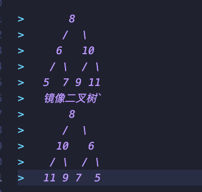

二叉树的镜像
===

>操作给定的二叉树，将其变换为源二叉树的镜像。
>输入描述:
>二叉树的镜像定义：源二叉树 



```js
function Mirror(root)
{
    // write code here
   if(root==null) return root
   let temp = root.left
   root.left = root.right
   root.right=temp
   Mirror(root.left)
   Mirror(root.right)
   return root
}
module.exports = {
    Mirror : Mirror
};
```

