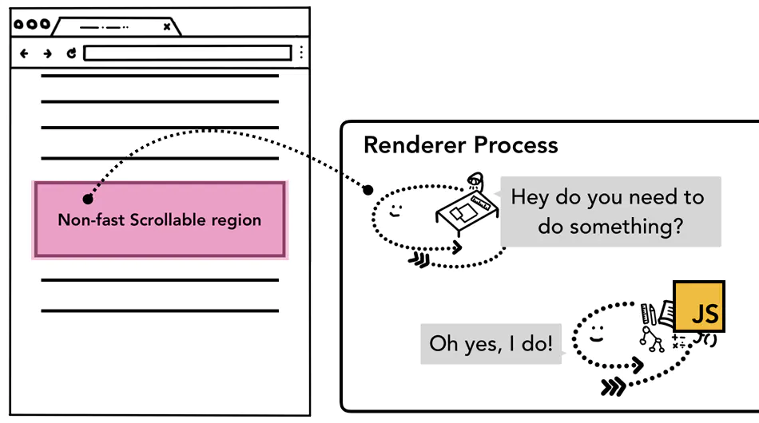
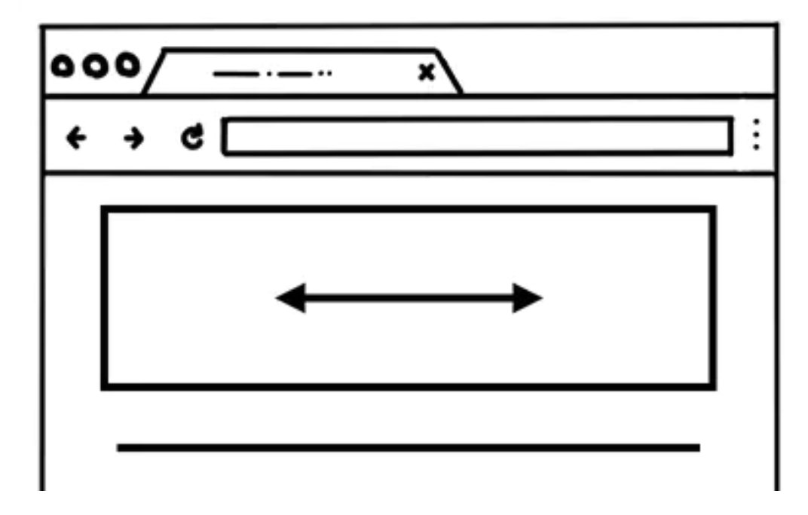
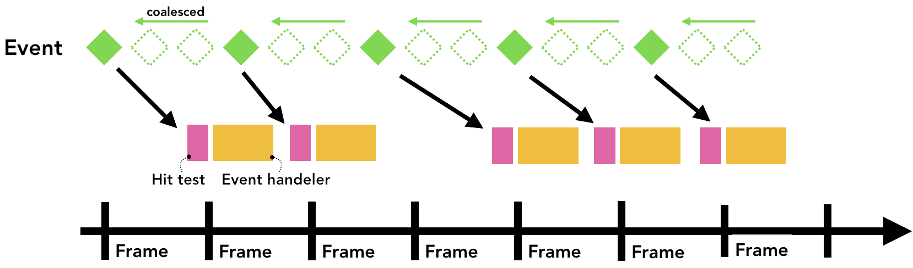
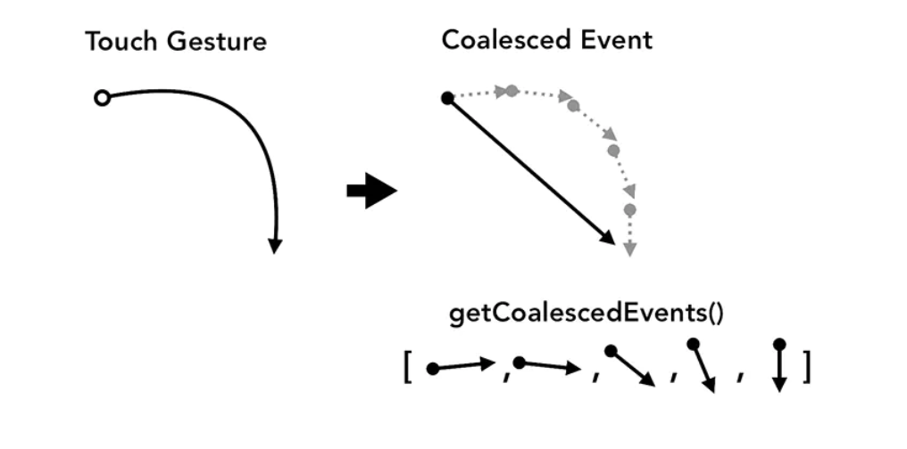

---
nav:
    title: JavaScript
    path: /js
    order: 2
group:
  title: 浏览器工作原理
  order: 63
title: 浏览器事件处理
order: 15
---

# 浏览器事件处理

## 输入事件

听到 **输入事件** 这个字眼，你脑海里闪现的恐怕只是输入文本或点击鼠标。但在浏览器眼中，输入意味着一切用户行为。不单滚动鼠标滑轮是输入事件，触摸屏幕、滑动鼠标同样也是用户输入事件。

诸如触摸屏幕之类用户手势产生时，浏览器进程会率先将其捕获。然而浏览器进程所掌握的信息仅限于行为发生的区域，因为标签页里的内容都由渲染进程负责处理，所以浏览器进程会将事件类型（如 touchstart）及其坐标发送给渲染进程。渲染进程会寻至事件目标，运行其事件监听器，妥善地处理事件。


## 合成器接收输入事件


在上篇文章里，我们探讨了合成器如何通过合成栅格化图层，实现流畅的页面滚动。如果页面上没有添加任何事件监听，合成器线程会创建独立于主线程的新合成帧。但要是页面上添加了事件监听呢？合成器线程又是如何得知事件是否需要处理的？

## 理解非立即可滚动区

因为运行 JavaScript 脚本是主线程的工作，所以页面合成后，合成进程会将页面里添加了事件监听的区域标记为 **非立即可滚动区**。有了这个信息，如果输入事件发生在这一区域，合成进程可以确定应将其发往主线程处理。如输入事件发生在这一区域之外，合成进程则确定无需等待主线程，可继续合成新帧。



### 设置事件处理器时须注意

Web 开发中常用的事件处理模式是 **事件代理**。因为事件会冒泡，所以你可以在最顶层的元素中添加一个事件处理器，用来代理事件目标产生的任务。下面这样的代码，你可能见过，或许也写过。

```js
document.body.addEventListener('touchstart', (event) => {
  if (event.target === area) {
    event.preventDefault();
  }
});
```

这样只需添加一个事件监听器，即可监听所有元素，的确十分省事。然而，如果站在浏览器的角度去考量，这等于把整个页面都标记成了 **非立即可滚动区**，意味着即便你设计的应用本不必理会页面上一些区域的输入行为，合成线程也必须在每次输入事件产生后与主线程通信并等待返回。如此则得不偿失，使原本能保障页面滚动流畅的合成器没了用武之地。

你可以给事件监听添加一个 `passive: true` 选项 ，将这种负面效果最小化。这会提示浏览器你想继续在主线程中监听事件，但合成器不必停滞等候，可接着创建新的合成帧。

```js
document.body.addEventListener(
  'touchstart',
  (event) => {
    if (event.target === area) {
      event.preventDefault();
    }
  },
  {
    passive: true,
  }
);
```

## 检查事件是否可撤销



设想一下这种情形：页面上有一个盒子，你要将其滚动方向限制为水平滚动。

为目标事件设置 `passive: true` 选项可让页面滚动平滑，但在你使用 `preventDefault` 以限制滚动方向时，垂直方向滚动可能已经触发。使用 `event.cancelable` 可以检查并阻止这种情况发生。

```js
document.body.addEventListener('pointermove', event => {
  if (event.cancelable) {
    event.preventDefault(); // 阻止默认的滚动行为
    /*
    *  这里设置程序执行任务
    */
  }
}, {passive:: true});
```

或者，你也可以应用 `touch-action` 这类 CSS 规则，完全地将事件处理器屏蔽掉。

```css
#area {
  touch-action: pan-x;
}
```

## 定位事件目标


合成器将输入事件发送至主线程后，首先运行的是命中检测。命中检测会使用渲染进程中产生的绘制记录数据，找出事件发生坐标下的内容。

## 降低往主线程发送事件的频率

之前的文章里，我们探讨了常见显示屏如何以每秒 60 帧的频率刷新，以及我们要怎样与其刷新频率保持步调一致，以营造出流畅的动画效果。而对于用户的输入行为，常见触摸屏设备的事件传输频率为每秒 60~120 次，常见鼠标设备的事件传输频率为每秒 100 次。可见，输入事件有着比显示屏幕更高的保真度。

如果一连串 `touchmove` 这样的事件以每秒 120 次的频率发送往主线程，那么可能会触发过量的命中检测及 JavaScript 脚本执行。相形而言，我们的屏幕刷新率则低下得多。


为了降低往主线程中传递过量调用，Chrome 会合并这些连续事件（如：`wheel`、`mousewheel`、`mousemove`、`pointermove`、`touchmove` 等），并将其延迟至下一次 `requestAnimationFrame` 前发送。



所有独立的事件，如: `keydown`、`keyup`、`mouseup`、`mousedown`、`touchstart` 及 `touchend` 则会立即发往主线程。

## 帧内事件

事件合并可帮助大多数 Web 应用构建良好的用户体验。然而，如果你开发的是一个绘图类应用，需要基于 `touchmove` 事件的坐标绘制线路，那么在你试图画下一根光滑的线条时，区间内的一些坐标点也可能会因事件合并而丢失。这时，你可以使用目标事件的 `getCoalescedEvents` 方法获取事件合并后的信息。



<br />

```js
window.addEventListener('pointermove', (event) => {
  const events = event.getCoalescedEvents();
  for (let event of events) {
    const x = event.pageX;
    const y = event.pageY;
    // 使用 x、y 坐标画线
  }
});
```

## 参考资料

- [📝 英语原文：Inside look at modern web browser（Part 4）](https://developers.google.com/web/updates/2018/09/inside-browser-part4)
- [📝 现代浏览器内部揭秘（Part 4）](https://juejin.im/post/6844903695600058375)
