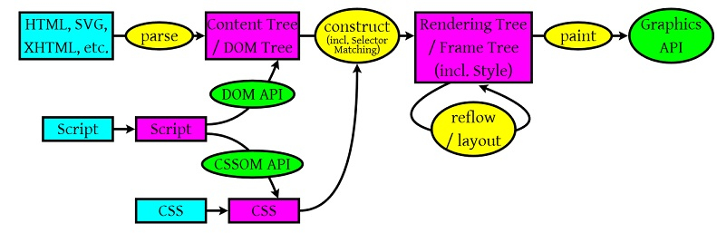
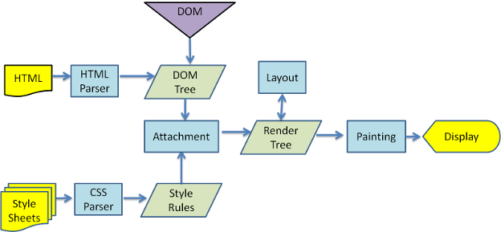
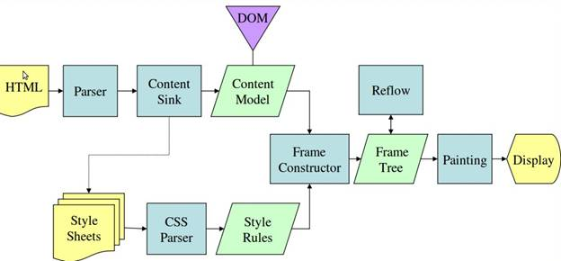

---
nav:
    title: JavaScript
    path: /js
    order: 2
group:
  title: 浏览器工作原理
  order: 63
title: 渲染进程的内部机制
order: 2
---

# 渲染进程的内部机制

## 导航流

简述从浏览器中键入 URL 后，浏览器从互联网获取数据并显示页面的过程：

1. **处理输出**：用户在地址栏中键入时，UI 线程会自动检测输入数据是否为一个 URL 地址
2. **开始导航**：当用户按下 Enter 键时，UI 线程会启动网络调取去获取站点内容，网络线程会通过适当的协议，像 DNS 查找和为请求建立 TLS 连接。在这时，网络线程可能会收到像 HTTP 301 那样的服务器重定向头。这种情况下，网络线程会告诉 UI 线程，服务器正在请求重定向，另一个 URL 请求会被启动
3. **读取响应**：一旦收到响应主题（Payload），网络线程会在必要时查看数据流的前几个字节。如果响应的是 HTML 文件，那么下个步骤就是会把数据传给渲染进程，但是如果是一个压缩文件或是其他文件，那么意味着它是一个下载请求，因此需要将数据传递给下载管理器。此时也会进行 [SafeBrowsing](https://safebrowsing.google.com/) 检查。如果域名和响应数据似乎匹配到一个已知的恶意网站，那么网络线程会显示一个警告页面。除此之外，还会发生 [Cross Origin Read Blocking（CORB）](https://www.chromium.org/Home/chromium-security/corb-for-developers) 检查，以确保敏感的跨域数据不被传给渲染进程
4. **查找渲染进程**：一旦所有的检查执行完毕并且网络线程确信浏览器会导航到请求的站点，网络线程会告诉 UI 线程所有的数据准备完毕。UI 线程会寻找渲染进程去开始渲染 Web 页面
5. **提交导航**：数据和渲染进程就绪后，浏览器进程会发送一个 IPC（进程间通信）到渲染进程去提交导航。它也会传递数据流，所以渲染进程可以保持接收 HTML 数据。一旦浏览器进程收到渲染进程已经提交的确认消息，导航完毕并且文档加载解析开始
6. **初始化加载完毕**：一旦导航被提交，渲染进程开始加载资源和渲染页面

## 工作线程

导航过程完成之后，浏览器进程把数据交给了渲染进程，渲染进程负责 Tab 选项卡内的所有事情，核心目的就是将 HTML/CSS/JavaScript 代码，转化为用户可进行交互的 Web 页面。

> 那么渲染进程是如何工作的呢？

渲染进程中，包含线程分别是：

- 一个主线程（main thread）
- 多个工作线程（work thread）
- 一个合成器线程（compositor thread）
- 多个光栅化线程（raster thread）

 

不同的线程，有着不同的工作职责。

## 渲染引擎

渲染引擎的职责就是渲染，即在浏览器窗口中显示所请求的内容。默认情况下，渲染引擎可以显示 HTML、XML 文档及图片，它也可以借助插件（一种浏览器扩展）显示其他类型数据，例如使用 PDF 阅读器插件，可以显示 PDF 格式。渲染引擎最主要的用途是显示应用了 CSS 之后的 HTML 及图片。

不同的浏览器厂商实现网页渲染的过程是有区别的。

### 引擎种类

不同的浏览器有不同的渲染引擎，对于渲染引擎的种类总结如下：

- Webkit 内核：Safari / Chrome 等
- Gecko 内核：Netscape6 及以上版本 / Firefox / MozillaSuite / SeaMonkey 等
- Trident（MSHTML）内核：IE9- / MaxThon / TT / The World / 360 / 搜狗浏览器 / 腾讯浏览器等
- Presto 内核：Opera7 及以上
- Edge 内核：Win10 以上 IE 浏览器
- Blink 内核：Chromium

JavaScript 解析器：

- V8 引擎：Google Chrome
- spiderMonkey 引擎：Mozilla Firefox
- JScript 引擎：IE 系列浏览器
- linear b/futhark 引擎：Opera

## 工作流程

下面是渲染引擎在获取文档内容之后的大致工作流程：

1. Parsing：解析文档
   - [构建文档对象模型](./construction-of-the-object-model)
   - [构建样式对象模型](./construction-of-the-object-model#css-对象模型)
   - [脚本异步加载](./script-loading-asynchronously)
2. RenderTree：构建渲染
   - [遍历文档树](./construction-of-render-tree)
   - [Style Calculation：样式计算](./construction-of-render-tree#样式计算)
3. [Layout：布局](./layout)
4. [Paint：绘制](./paint)
5. [Rasterization：光栅化](./rasterization)
6. [Composite：合并](./composite)

 

 

1. **浏览器解析过程**
   - HTML / SVG / XHTML：渲染引擎通过三个 C++ 的类对应这三类文档，解析这三类文件并构建 **DOM 树**（DOM Tree）
   - CSS：渲染引擎解析外部 CSS 文件及内联 `style` 标签内的样式数据，并构建 **CSS 规则树**（ CSS Rule Tree）
   - JavaScript：JavaScript 通过 DOM API 和 CSSOM API 来操作 DOM Tree 和 CSS Rule Tree
2. **构建渲染树（Rendering Tree）**
   - 解析完成后，浏览器引擎会通过 DOM 树和 CSS 规则树来构造 **渲染树**
   - 渲染树并不等同于 DOM 树，因为一些像 `<header>` 或 `display: none` 的东西就没必要放到渲染树中
   - CSS 的 Rule Tree 主要是为了完成匹配并把 CSS Rule 附加至渲染树上的每个 Element 上。然后，计算每个渲染对象的位置，这通常是 布局（Layout） 和 重排（Reflow） 过程中发生
   - 一旦渲染树构建完成，浏览器会把树里面的内容绘制在屏幕上。
3. **布局（Layout）**：渲染树构建好之后，将会执行布局过程，它将确定每个节点在屏幕上的确切坐标
4. **绘制（Paint）**：再下一步就是绘制，即遍历渲染树，并使用渲染引擎绘制每个节点
5. **渲染层合并（Composite）**：页面中 DOM 元素的绘制是在多个层上进行的，在每个层上完成绘制过程之后，浏览器会将所有层按照合理的顺序合并成一个图层，然后在屏幕上呈现
6. 最后通过调用操作系统 NativeGUI API 进行绘制

值得注意的是，这个过程是逐步完成的，为了更好的用户体验，渲染引擎将会尽可能早地将内容呈现到屏幕上，并不会等到所有 HTML 都解析完成之后再去构建和布局渲染树，它是解析完一部分内容就显示一部分内容，同时，可能还在通过网络下载其余内容。

### Webkit 实现

### Gecko 实现

 

- Gecko 将视觉格式化元素组成的树称为 **框架树**（Frame）。每个元素都是一个框架。Webkit 使用的术语是 **渲染树**（Render），它由 **渲染对象** 组成。
- 对于元素的放置，Webkit 使用的术语是 **布局**（Layout），而 Gecko 称之为 **重排**（Reflow）
- Webkit 称利用 DOM 节点及样式信息去构建渲染树的过程为 Attachment，Gecko 在 HTML 和 DOM 树之间附加了一层，这层称为内容接收器，相当制造 DOM 元素的工厂。

## 参考资料

- [📝 原文 Inside look at modern web browser（Part 2）](https://developers.google.com/web/updates/2018/09/inside-browser-part2)
- [📝 原文：Inside look at modern web browser（Part 3）](https://developers.google.com/web/updates/2018/09/inside-browser-part3)
- [📝 现代浏览器内部揭秘 Part 2](https://github.com/xitu/gold-miner/blob/master/TODO1/inside-browser-part2.md)
- [📝 现代浏览器内部揭秘 Part 3](https://juejin.im/post/6844903692894732295)
- [📝 前端必读：浏览器内部工作原理](https://www.cnblogs.com/wjlog/p/5744753.html#chapter8)
- [📝 浏览器的渲染：过程与原理](https://zhuanlan.zhihu.com/p/29418126)
- [📝 浏览器工作员：Webkit 内核研究](https://juejin.im/entry/5a9a379af265da239d48c027)
- [📝 浏览器渲染引擎到底做了什么](https://www.jianshu.com/p/281b574ee3f8)
- [📝 浅析渲染引擎与前端优化](https://blog.csdn.net/john1337/article/details/53579506)
- [📝 Chromium Code Search](https://source.chromium.org/chromium/chromium/src)
