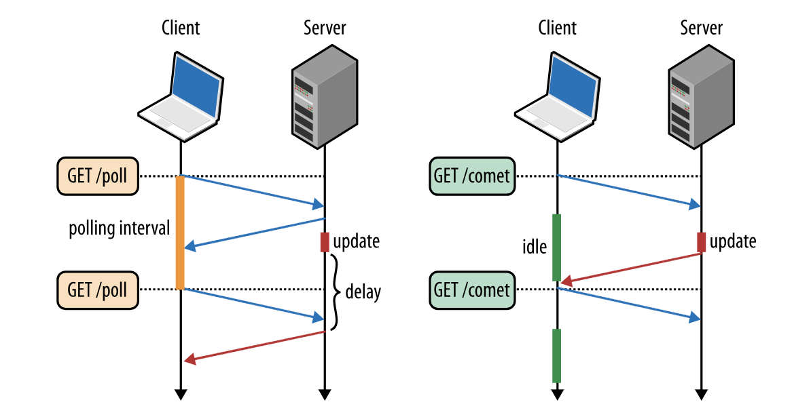

---
nav:
    title: JavaScript
    path: /js
    order: 2
group:
  title: 数据通信 API
  order: 57
title: XHMLHttpRequest API
order: 2
---

# XMLHttpRequest API

使用 XMLHttpRequest（XHR） 对象可以与服务器交互。您可以从 URL 获取数据，而无需让整个的页面刷新。

**Ajax**（Asynchronous JavaScript and XML）是一系列 Web 开发技术的集合，使用很多的 Web 技术在客户端开发异步 Web 应用。利用 Ajax，Web 应用可以异步的发送数据获取数据，而不干扰现有页面的显示和行为。通过解耦数据接口层和展现层，Ajax 允许 Web 页面或者其他扩展的 Web 应用动态的改变数据而不用重新加载整个页面。实现通常选择 JSON 代替 XML，因为更接近 JavaScript。

```
EventTarget <- XMLHttpRequestEventTarget <- XMLHttpRequest
```

## 基本用法

```js
const xhr = new XMLHttpRequest();
```

## 原型属性

此接口继承了 `XMLHttpRequestEventTarget` 和 `EventTarget` 的属性。

| 属性                 | 说明                                                                             | 类型                                                                               |
| :------------------- | :------------------------------------------------------------------------------- | :--------------------------------------------------------------------------------- |
| `onreadystatechange` | 当 `readyState` 属性发生改变时，设定的回调函数会被调用                           | Function                                                                           |
| `readyState`         | （只读） 用于表示请求的五种状态                                                  | unsigned short                                                                     |
| `response`           | （只读） 用于获取整个响应实体，响应体的类型由 `responseType` 来指定              | Blob<br/>ArrayBuffer<br/>Document<br/>JSON<br/>String<br/>null（请求未完成或失败） |
| `responseText`       | （只读） 用于获取请求的响应文本                                                  | DOMString<br/>null（请求未完成或失败）                                             |
| `responseType`       | 用于设置该值能够改变响应类型                                                     | XMLHttpRequestResponseType                                                         |
| `status`             | （只读）用于获取请求的 **响应状态码**                                            | unsigned short                                                                     |
| `statusText`         | （只读）用于获取请求的 **响应状态信息**，包含一个状态码和消息文本                | DOMString                                                                          |
| `timeout`            | 用于表示请求 **最大请求时间**（毫秒），若超出该时间，请求会自动终止              | unsigned long                                                                      |
| `upload`             | （只读） 用于在 `upload` 上添加一个 **事件监听** 来跟踪上传过程                  | XMLHttpRequestUpload                                                               |
| `withCredentials`    | 用于指定跨域 `Access-Control` 请求是否应当带有授权信息，如 Cookie 或授权首部字段 | Boolean                                                                            |

### onreadystatechange

使用示例：

```js
const xhr = new XMLHttpRequest();
xhr.open('GET', 'https://developer.mozilla.org/', true);
xhr.onreadystatechange = function() {
  if (xhr.readyState === XMLHttpRequest.DONE && xhr.status === 200) {
    console.log(xhr.responseText);
  }
};
xhr.send();
```

### readyState

| 值  | 状态               | 描述                                          |
| :-- | :----------------- | :-------------------------------------------- |
| 0   | `UNSENT`           | 请求代表被创建，但尚未调用 `open` 方法        |
| 1   | `OPENED`           | `open` 方法已经被调用                         |
| 2   | `HEADERS_RECEIVED` | `send` 方法已被调用，并且头部和状态已经可访问 |
| 3   | `LOADING`          | 下载中（`responseText` 属性已经包含部分数据） |
| 4   | `DONE`             | 下载操作已完成                                |

## 原型方法

下列原型方法按照请求的生命周期设定：

- 请求发送前
  - [open](#open)
  - [setRequestHeader](#set-request-header)
  - [overrideMimeType](#override-mime-type)
- 发送请求
  - [send](#send)
- 请求发送后
  - [abort](#abort)
- ## 接收响应后

### open

`XMLHttpRequest.open` 方法用于初始化一个请求，。

语法：

```js
xhr.open(method, url);
xhr.open(method, url, async);
xhr.open(method, url, async, user);
xhr.open(method, url, async, user, password);
```

参数：

- `method`：请求方法，如 GET、POST、PUT、DELETE
- `url`：请求的 URL 地址
- `async`：一个可选的布尔值参数，默认值为 `true`，表示执行异步操作。如果值为 `false`，则 `send` 方法不会返回任何东西，直到接收到了服务器的返回数据
- `user`：用户名（可选参数），用于授权。默认参数为空字符串
- `password`：密码（可选参数），用于授权。默认参数为空字符串

使用方法：

```js
const xhr = new XMLHttpRequest();

xhr.open('GET', 'https://example.com/user');
```

注意事项：

- 如果 `method` 不是有效的 HTTP 方法或 URL 地址不能被成功解析，将会抛出 `SyntaxError` 异常
- 如果请求方法（不区分大小写）为 `CONNECT`、`TRACE` 或 `TRACK` 将会抛出 `SecurityError` 异常

### setRequestHeader

`XMLHttpRequest.sentRequestHeader` 方法用于设置 HTTP 请求头信息。

> ⚠️ 注意：在这之前，你必须确认已经调用了 `open` 方法打开了一个 URL

语法：

```js
xhr.setRequestHeader(header, value);
```

参数：

- `header`：请求头名称
- `value`：请求头值

### overrideMimeType

`XMLHttpRequest.overrideMimeType` 方法用于重写由服务器返回的 MIME 类型，使服务端响应信息中传输的数据按照指定 MIME 类型处理。

例如，可以用于强制把响应流当做  `text/xml`  来解析，即使服务器没有指明数据是这个类型。

> ⚠️ 注意：这个方法必须在 `send` 之前被调用

### send

`XMLHttpRequest.send` 方法用于发起网络请求。

- 如果该请求是异步模式（默认），该方法会立即返回。
- 相反，如果请求是同步模式，则直到请求的响应完全接受以后，该方法才会返回。

> ⚠️ 注意：所有相关的事件绑定必须在调用 `send` 方法之前进行

语法：

```js
xhr.send(body);
```

参数：

- `body`：在 XHR 请求中要发送的数据体，可以是以下其中某种类型
  - ArrayBuffer
  - Blob
  - Document
  - DOMString
  - FormData
  - URLSearchParams
  - USVString
  - null

使用方法：

```js
const xhr = new XMLHttpRequest();
xhr.open('GET', '/server', true);

xhr.onload = function() {
  // 请求结束后处理
};

xhr.send(null);
// xhr.send('Hello world!')
// xhr.send(new Blob())
// xhr.send(new Int8Array())
// xhr.send({ form: 'data' })
// xhr.send(document)
```

### abort

`XMLHttpRequest.abort` 用于当请求已发送后立刻中止请求。当该方法执行后，`readyState` 将会被置为 `XMLHttpRequest.UNSENT`，并且请求的 `status` 属性置为 0。

### getRequestHeader

`XMLHttpRequest.getRequestHeader` 方法用于获取指定响应头的值，如果响应头还没有被接收，或该响应头不存在，则返回 `null`。

注意：使用该方法获取某些响应头时，浏览器会抛出异常，具体原因如下

- W3C 的 XHR 标准中做了限制，规定客户端无法获取 `response` 中的 `Set-Cookie`、`Set-Cookie2` 这 2 个字段，无论是同域还是跨域请求
- W3C 的 CORS 标准对于跨域请求也做了限制，规定对于跨域请求，客户端允许获取的响应头首部字段只限于简单的响应首部字段（常见的响应首部字段如下）
  - Expires
  - Cache-Control
  - Last-Modified
  - Pragma
  - Access-Control-Expose-Headers
  - Content-Language
  - Content-Type

### getAllRequestHeaders

`XMLHttpRequest.getAllResquestHeaders` 方法用于获取所有响应头信息（响应头名和值），如果响应头还没有接收，则返回 `null`。

> ⚠️ 注意：使用该方法获取的响应头首部字段与在开发者工具 Network 面板中看到的响应头不一致。

## 原型事件

| 事件名      | 说明                                                                                    |
| :---------- | :-------------------------------------------------------------------------------------- |
| `loadstart` | 用于当网络请求发送后触发，即调用 `XMLHttpRequest.send` 方法后触发，若未被调用则不会触发 |
| `load`      | 用于当请求完成时触发，此时 `readyState` 值为 `DONE`（4）                                |
| `loaded`    | 用于当某个资源的加载进度停止后触发，例如已经触发 `abort`、`error`、`load` 事件之后      |
| `progress`  | 用于当请求接收到数据的时候被周期性触发。                                                |
| `abort`     | 用于当请求被暂停时触发。                                                                |
| `timeout`   | 用于当请求超出最大时间时触发。                                                          |
| `error`     | 用于当请求遭遇异常时触发                                                                |

事件执行顺序：

- 状态变更时触发
  - `readystatechange`：`readyState` 状态变更时触发
- 请求发送前
  - `xhr.loadstart`
- 请求发送阶段
  - `xhr.upload.onloadstart`
  - `xhr.upload.onprogress`
  - `xhr.upload.onload`
  - `xhr.upload.onloadend`
- 请求发送结束，开始加载资源后
  - `xhr.onprogress`
  - `xhr.onload`
  - `xhr.onloadend`
- 异常处理
  - `xhr.onabort`
  - `xhr.timeout`
  - `xhr.error`

## 应用示例

### 上传数据

### 下载数据

### 传输进度

XMLHttpRequest 对象传送数据的时，通过 `progress` 事件可以获取传输进度信息。

它分成上传和下载两种情况：

- 下载的 `progress` 事件属于 XMLHttpRequest 对象
- 上传的 `progress` 事件属于 XMLHttpRequest.upload 对象

我们先定义 `progress` 事件的回调函数：

```js
function updateProgress(event) {
  if (event.lengthComputable) {
    var percentComplete = event.loaded / event.total;
  }
}

xhr.onprogress = updateProgress;
xhr.upload.onprogress = updateProgress;
```

上面的代码中，`event.total` 是需要传输的总字节，`event.loaded` 是已经传输的字节。如果 event.lengthComputable 不为真，则 `event.total` 等于 0。

### 定时轮询



定时轮询的基本思路就是浏览器每隔一段时间向浏览器发送 HTTP 请求，服务器端在收到请求后，不论是否有数据更新，都直接进行响应。这种方式实现的即时通信，本质上还是浏览器发送请求，服务器接受请求的一个过程，通过让客户端不断的进行请求，使得客户端能够模拟实时地收到服务器端的数据的变化。

这种方式的优点是比较简单，易于理解，实现起来也没有什么技术难点。缺点是显而易见的，这种方式由于需要不断的建立 HTTP 连接，严重浪费了服务器端和客户端的资源。尤其是在客户端，距离来说，如果有数量级想对比较大的人同时位于基于短轮询的应用中，那么每一个用户的客户端都会疯狂的向服务器端发送 HTTP 请求，而且不会间断。人数越多，服务器端压力越大，这是很不合理的。

因此短轮询不适用于那些同时在线用户数量比较大，并且很注重性能的 Web 应用。

```js
const xhr = new XMLHttpRequest();

// 每 1000 毫秒向服务器发送一次轮询请求
setInterval(function() {
  xhr.open('GET', '/server');
  xhr.onreadystatechange = function() {};
  xhr.send();
}, 1000);
```

### 长轮询

当服务器收到客户端发来的请求后,服务器端不会直接进行响应，而是先将这个请求挂起，然后判断服务器端数据是否有更新。如果有更新，则进行响应，如果一直没有数据，则到达一定的时间限制(服务器端设置)才返回。 。 客户端 JavaScript 响应处理函数会在处理完服务器返回的信息后，再次发出请求，重新建立连接。

长轮询和短轮询比起来，明显减少了很多不必要的 http 请求次数，相比之下节约了资源。长轮询的缺点在于，连接挂起也会导致资源的浪费。

```js
function checkUpdate() {
  var xhr = new XMLHttpRequest();
  xhr.open('GET', '/user');
  xhr.onreadystatechange = function() {
    checkUpdate();
  };
  xhr.send();
}
```

实现思路：

1. 处理接收到的数据并启动下一轮检测更新
2. 启动下一轮检测更新
3. 发起首次更新请求

轮询与长轮询都是基于 HTTP 的，两者本身存在着缺陷：

- 轮询需要更快的处理速度；
- 长轮询则更要求处理并发的能力；

两者都是 **被动型服务器** 的体现：服务器不会主动推送信息，而是在客户端发送 AJAX 请求后进行返回的响应。而理想的模型是在服务器端数据有了变化后，可以主动推送给客户端，这种 **主动型** 服务器是解决这类问题的很好的方案。Web Sockets 就是这样的方案。

> 那么长轮询总是比定期轮询更好的选择？

除非消息到达率已知且不变，否则长轮询将始终提供更短的消息延迟。

另一方面，开销讨论需要更细微的观点。首先，请注意，每个传递的消息仍然引起相同的 HTTP 开销；每个新消息都是独立的 HTTP 请求。但是，如果消息到达率高，那么长时间轮询会比定期轮询发出更多的 XHR 请求！

长轮询通过最小化消息延迟来动态地适应消息到达速率，这是您可能想要的或可能不需要的行为。如果对消息延迟要求不高的话，则定时轮询可能是更有效的传输方式。例如，如果消息更新速率较高，则定时轮询提供简单的”消息聚合“机制（即合并一定时间内的消息），这可以减少请求数量并提高移动设备的电池寿命。

四种前端即时通讯技术比较：

- 从兼容性考虑：`短轮询 > 长轮询 > 长连接 SSE > WebSocket`
- 从性能方面考虑：`WebSocket > 长连接 SSE > 长轮询 > 短轮询`

### 长连接

---

**参考资料：**

- [你不知道的 XMLHttpRequest](https://juejin.im/post/58e4a174ac502e006c1e18f4)
- [前端必备 HTTP 技能之 Ajax 技术](https://juejin.im/entry/5839848b67f356006ba4d453)
