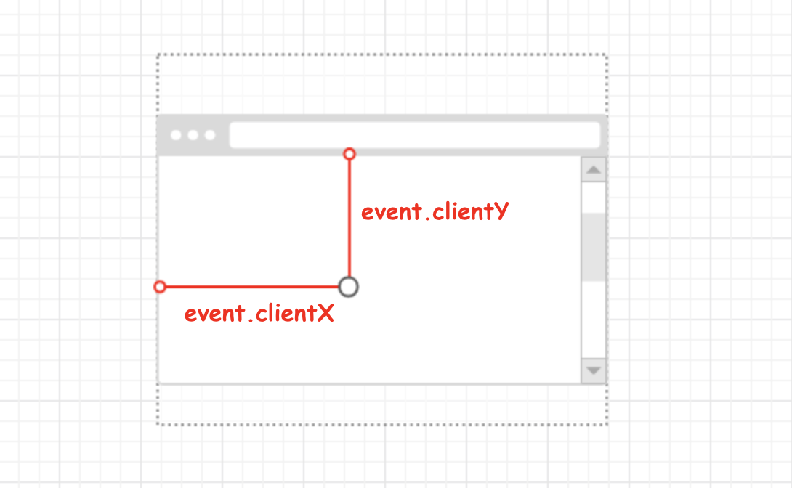
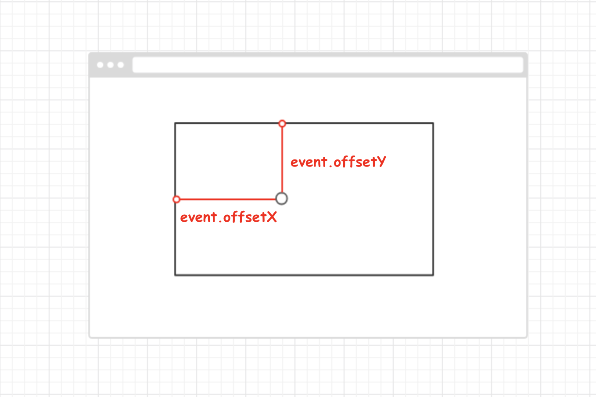
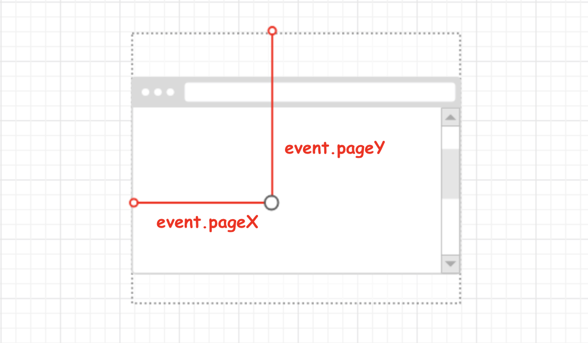
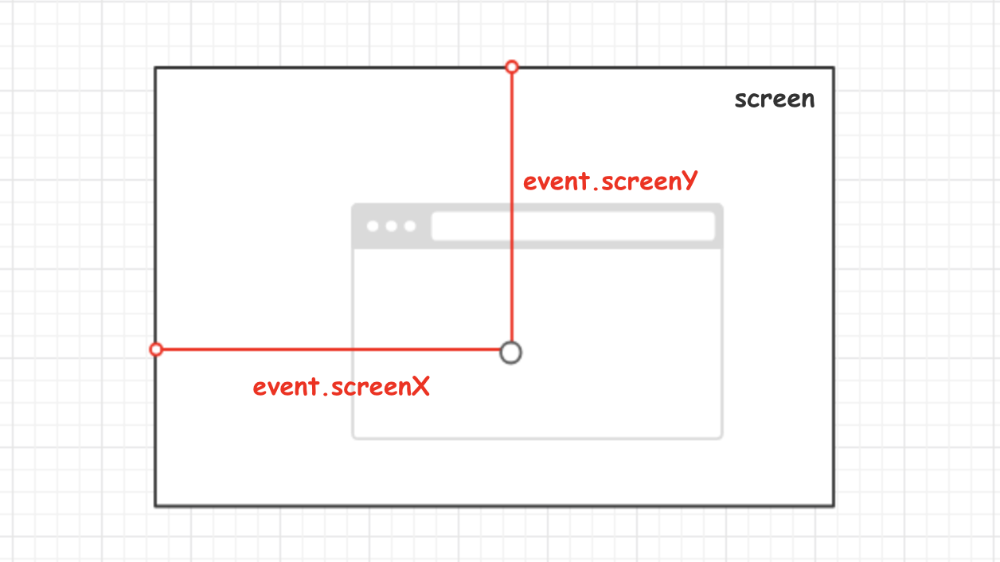
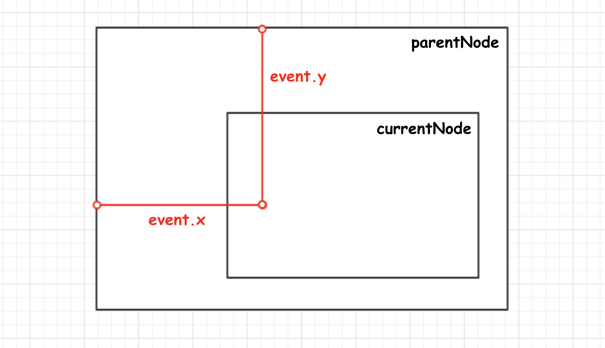

---
nav:
    title: JavaScript
    path: /js
    order: 2
group:
  title: 视窗尺寸位置
  order: 55
title: 鼠标位置
order: 5
---

# 鼠标位置

MouseEvent 接口指用户与指针设备（如鼠标）交互时发生的事件。使用此接口的常见

## clientX/clientY

MousEvent.clientX 和 MousEvent.clientY 设置或获取鼠标指针位置相对于**窗口客户区域**的横纵坐标，其中客户区域不包括窗口自身的控件和滚动条。

## offsetX/offsetY

MousEvent.offsetX 和 MousEvent.offsetY 设置或获取鼠标指针位置相对于**触发事件的对象**的横纵坐标。

## pageX/pageY

MousEvent.pageX 和 MousEvent.pageY 相对于整个**网页**左上角坐标。

## screenX/screenY

MousEvent.screenX 和 MousEvent.screenY 设置或获取获取鼠标指针位置相对于**用户屏幕**的横纵坐标。

## X/Y

MouseEvent.X 和 MouseEvent.Y 设置或获取鼠标指针位置相对于**父文档**的横纵坐标。

## 总结

| 属性    | 说明                                                                           |
| ------- | ------------------------------------------------------------------------------ |
| clientX | 设置或获取当事件被触发时鼠标指针相对于 **浏览器页面（或客户区）** 的水平坐标。 |
| clientY | 设置或获取当事件被触发时鼠标指针向对于 **浏览器页面（或客户区）** 的垂直坐标。 |
| screenX | 设置或获取当事件被触发时鼠标指针相对于**屏幕的水平坐标**。                     |
| screenY | 设置或获取当事件被触发时鼠标指针相对于**屏幕的垂直坐标**。                     |
| offsetX | 设置或获取鼠标指针位置相对于**触发事件的对象的横坐标**。                       |
| offsetY | 设置或获取鼠标指针位置相对于**触发事件的对象的纵坐标**。                       |
| X       | 事件发生的位置的**横坐标**, 它相对于用 CSS 动态定位的最内层包容元素。          |
| Y       | 事件发生的位置的**纵坐标**, 它相对于用 CSS 动态定位的最内层包容元素。          |
| pageX   | 鼠标指针的位置，相对于文档的左边缘。                                           |
| pageY   | 鼠标指针的位置，相对于文档的上边缘。                                           |
| layerX  | 鼠标相比较于当前坐标系的位置。                                                 |
| layerY  | 鼠标相比较于当前坐标系的位置。                                                 |
