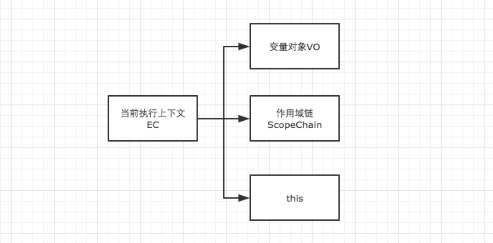

---
nav:
    title: JavaScript
    path: /js
    order: 2
group:
  title: 执行阶段
  order: 22
title: 执行上下文
order: 1
---

# 执行上下文栈


当我们调用一个函数时（激活），一个新的执行上下文就会被创建。

一个执行上下文的生命周期可分为 **创建阶段** 和 **代码执行阶段** 两个阶段。

**创建阶段**：在这个阶段中，执行上下文会分别进行以下操作

- 创建 [变量对象](./variable-object)
- 建立 [作用域链](./scope-chain)
- 确定 [this](./this) 的指向

**代码执行阶段**：创建完成之后，就会开始执行代码，并依次完成以下步骤

- 变量赋值
- 函数引用
- 执行其他代码



## 可执行代码

每次当控制器转到可执行代码的时候，就会进入一个执行上下文。

执行上下文可以理解为当前代码的执行环境，它会形成一个作用域。

JavaScript 中的运行环境大概包括三种情况：

- **全局环境**：JavaScript 代码运行起来会首先进入该环境
- **函数环境**：当函数被调用执行时，会进入当前函数中执行代码
- **eval**（不建议使用，可忽略）

因此在一个 JavaScript 程序中，必定会产生多个执行上下文，而 JavaScript 引擎会以栈的方式来处理它们，这个栈，我们称其为 **函数调用栈（Call Stack）**。栈底永远都是全局上下文，而栈顶就是当前执行的上下文。

当代码在执行过程中，遇到以上三种情况，都会生成一个执行上下文，放入栈中，而处于栈顶的上下文执行完毕之后，就会自动出栈。

## 栈堆实现分析

JavaScript 引擎通过创建 **执行上下文栈（Execution Context Stack，ECS）** 用于管理执行上下文。

🎯 为了模拟执行上下文栈的行为，让我们类比执行上下文栈是一个数组。

```js
ECStack = [];
```

试想当 JavaScript 开始要解释执行代码的时候，最先遇到的就是全局代码，所以初始化的时候首先就会向执行上下文栈压入一个全局执行上下文，我们用 `globalContext` 表示它，并且只有当整个应用程序结束的时候，ECStack 才会被清空，所以**程序结束之前**， ECStack 最底部永远有个 `globalContext`。

```js
ECStack = [globalContext];
```

现在 JavaScript 遇到下面的这段代码了：

```js
function fun3() {
  console.log('fun3');
}

function fun2() {
  fun3();
}

function fun1() {
  fun2();
}

fun1();
```

当执行一个函数的时候，就会创建一个执行上下文，并且压入执行上下文栈，当函数执行完毕的时候，就会将函数的执行上下文从栈中弹出。

知道了这样的工作原理，让我们来看看如何处理上面这段代码：

```js
// fun1()
ECStack.push(<fun1> functionContext);

// fun1 中竟然调用了 fun2，还要创建 fun2 的执行上下文
ECStack.push(<fun2> functionContext);

// 擦，fun2 还调用了 fun3！
ECStack.push(<fun3> functionContext);

// fun3 执行完毕
ECStack.pop();

// fun2 执行完毕
ECStack.pop();

// fun1 执行完毕
ECStack.pop();

// JavaScript 接着执行下面的代码，但是 ECStack 底层永远有个 globalContext
```

详细了解了这个过程之后，我们就可以对 **执行上下文栈** 总结一些结论了。

- JavaScript 引擎是单线程的
- 同步执行，只有栈顶的上下文处于执行中，其他上下文需要等待
- 全局上下文只有唯一的一个，它在浏览器关闭时出栈
- 函数的执行上下文的个数没有限制
- 每次某个函数被调用，就会有个新的执行上下文为其创建，即使是调用的自身函数，也是如此

## 参考资料

- [📝 JavaScript 深入之执行上下文](https://github.com/mqyqingfeng/Blog/issues/8)
- [📝 JavaScript 深入之执行上下文栈](https://github.com/mqyqingfeng/Blog/issues/4)
