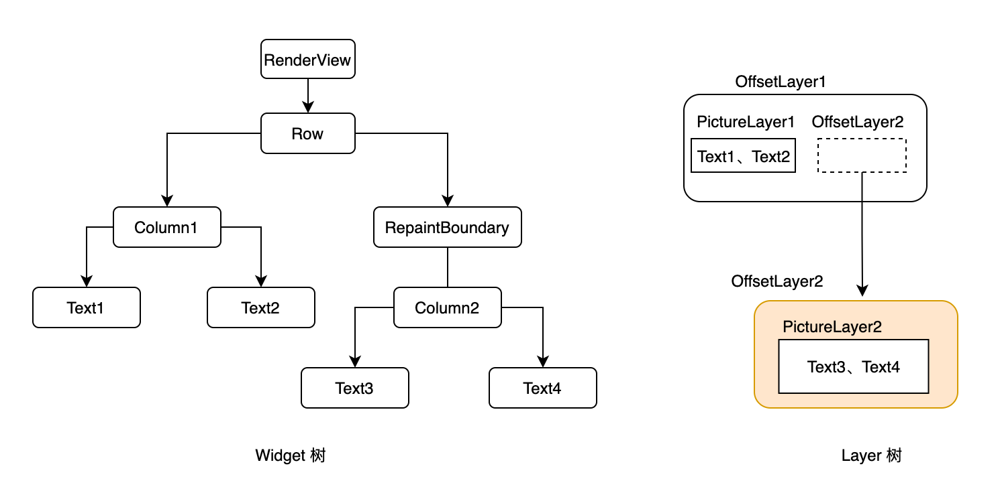
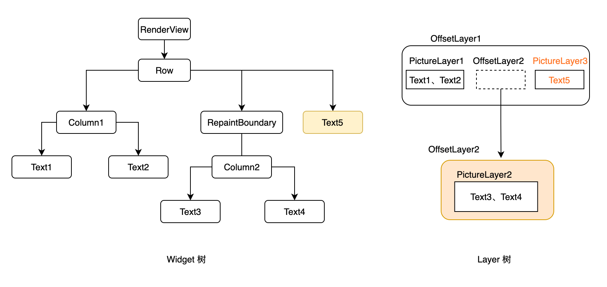
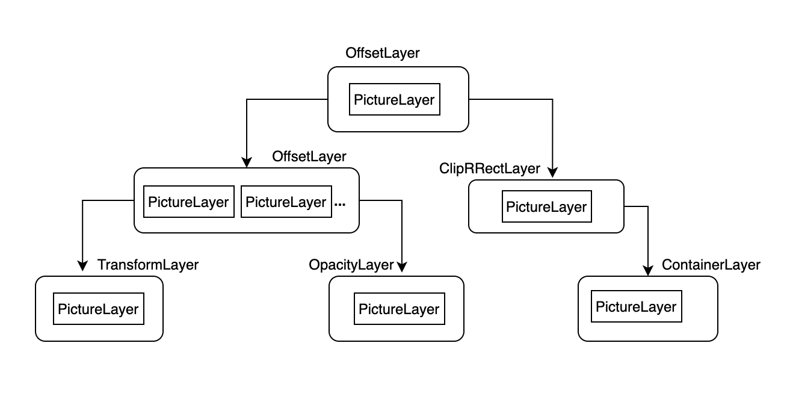

---
nav:
  title: 移动端
  path: /move
  order: 9
group:
  path: /chapter1
  title: Flutter实战·第二版
  order: 6

title: 绘制（二）组件树绘制流程
order: 146
---

# 14.6 绘制（二）组件树绘制流程

绘制相关实现在渲染对象 RenderObject 中，RenderObject 中和绘制相关的主要属性有：

- layer
- isRepaintBoundary（类型bool）
- needsCompositing (类型bool，后面章节介绍)

为了便于描述，我们先定义一下“绘制边界节点”的概念：

> 我们将 isRepaintBoundary 属性值为 true 的 RenderObject 节点称为**绘制边界节点**（本节中可以省略“绘制”二字，没有歧义，即本节中的“边界节点”指的就是绘制边界节点）。

## 14.6.1 RepaintBoundary

Flutter 自带了一个 RepaintBoundary 组件，它的功能其实就是向组件树中插入一个绘制边界节点。

## 14.6.2 组件树绘制流程

我们先讲一下Flutter绘制组件树的一般流程，注意，并非完整流程，因为我们暂时会忽略子树中需要“层合成”（Compositing）的情况，这部分我们会在后面讲到。下面是大致流程：

Flutter第一次绘制时，会从上到下开始递归的绘制子节点，每当遇到一个边界节点，则判断如果该边界节点的 layer 属性为空（类型为ContainerLayer），就会创建一个新的 OffsetLayer 并赋值给它；如果不为空，则直接使用它。然后会将边界节点的 layer 传递给子节点，接下来有两种情况：

1. 如果子节点是非边界节点，且需要绘制，则会在第一次绘制时：
   1. 创建一个Canvas 对象和一个 PictureLayer，然后将它们绑定，后续调用Canvas 绘制都会落到和其绑定的PictureLayer 上。
   2. 接着将这个 PictureLayer 加入到边界节点的 layer 中。
2. 如果不是第一次绘制，则复用已有的  PictureLayer 和 Canvas 对象 。
3. 如果子节点是边界节点，则对子节点递归上述过程。当子树的递归完成后，就要将子节点的layer 添加到父级 Layer中。

整个流程执行完后就生成了一棵Layer树。下面我们通过一个例子来理解整个过程：图14-10 左边是 widget 树，右边是最终生成的Layer树，我们看一下生成过程：



1. RenderView 是 Flutter 应用的根节点，绘制会从它开始，因为他是一个绘制边界节点，在第一次绘制时，会为他创建一个 OffsetLayer，我们记为 OffsetLayer1，接下来 OffsetLayer1会传递给Row.
2. 由于 Row 是一个容器类组件且不需要绘制自身，那么接下来他会绘制自己的孩子，它有两个孩子，先绘制第一个孩子Column1，将 OffsetLayer1 传给 Column1，而 Column1 也不需要绘制自身，那么它又会将 OffsetLayer1 传递给第一个子节点Text1。
3.  Text1 需要绘制文本，他会使用 OffsetLayer1进行绘制，由于 OffsetLayer1 是第一次绘制，所以会新建一个PictureLayer1和一个 Canvas1 ，然后将 Canvas1 和PictureLayer1 绑定，接下来文本内容通过 Canvas1 对象绘制，Text1 绘制完成后，Column1 又会将 OffsetLayer1 传给 Text2 。
4. Text2 也需要使用 OffsetLayer1 绘制文本，但是此时 OffsetLayer1 已经不是第一次绘制，所以会复用之前的  Canvas1 和 PictureLayer1，调用  Canvas1来绘制文本。
5. Column1 的子节点绘制完成后，PictureLayer1 上承载的是Text1 和 Text2 的绘制产物。
6. 接下来 Row 完成了 Column1 的绘制后，开始绘制第二个子节点 RepaintBoundary，Row 会将 OffsetLayer1 传递给 RepaintBoundary，由于它是一个绘制边界节点，且是第一次绘制，则会为它创建一个 OffsetLayer2，接下来 RepaintBoundary 会将 OffsetLayer2 传递给Column2，和 Column1 不同的是，Column2 会使用 OffsetLayer2 去绘制 Text3 和 Text4，绘制过程同Column1，在此不再赘述。
7. 当 RepaintBoundary 的子节点绘制完时，要将 RepaintBoundary 的 layer（ OffsetLayer2 ）添加到父级Layer（OffsetLayer1）中。

至此，整棵组件树绘制完成，生成了一棵右图所示的 Layer 树。需要说名的是 PictureLayer1 和 OffsetLayer2 是兄弟关系，它们都是 OffsetLayer1 的孩子。通过上面的例子我们至少可以发现一点：同一个 Layer 是可以多个组件共享的，比如 Text1 和 Text2 共享 PictureLayer1。

等等，如果共享的话，会不会导致一个问题，比如 Text1 文本发生变化需要重绘时，是不是也会连带着 Text2 也必须重绘？

答案是：是！这貌似有点不合理，既然如此那为什么要共享呢？不能每一个组件都绘制在一个单独的 Layer 上吗？这样还能避免相互干扰。原因其实还是为了节省资源，Layer 太多时 Skia 会比较耗资源，所以这其实是一个trade-off。

再次强调一下，上面只是绘制的一般流程。一般情况下 Layer 树中的 ContainerLayer 和 PictureLayer 的数量和结构是和 Widget 树中的边界节点一一对应的，注意并不是和 Widget一一对应。 当然，如果 Widget 树中有子组件在绘制过程中添加了新的 Layer，那么Layer 会比边界节点数量多一些，这时就不是一一对应了。关于如何在子组件中使用Layer，我们将在下一节中介绍。另外，这里提前剧透一下，Flutter 中很多拥有变换、剪裁、透明等效果的组件的实现中都会往 Layer 树中添加新的 Layer，这个我们会在后面介绍 flushCompositingBits 的相关章节中介绍。

## 14.6.3 发起重绘

RenderObject 是通过调用 markNeedsRepaint 来发起重绘请求的，在介绍 markNeedsRepaint 具体做了什么之前，我们根据上面介绍的 Flutter绘制流程先猜一下它应该做些什么？

我们知道绘制过程存在Layer共享，所以重绘时，需要重绘所有共享同一个Layer的组件。比如上面的例子中，Text1发生了变化，那么我们除了 Text1 也要重绘 Text2；如果 Text3 发生了变化，那么也要重绘Text4；那如何实现呢？

因为Text1 和 Text2 共享的是 OffsetLayer1，而 OffsetLayer1 的拥有者是谁呢？找到它让它重绘不就行了！OK，可以很容发现 OffsetLayer1 的拥有者是根节点 RenderView，它同时也是 Text1 和 Text2的第一个父级绘制边界节点。同样的，OffsetLayer2 也正是 Text3 和 Text4 的第一个父级绘制边界节点，所以我们可以得出一个结论**：当一个节点需要重绘时，我们得找到离它最近的第一个父级绘制边界节点，然后让它重绘即可**，而markNeedsRepaint 正是完成了这个过程，当一个节点调用了它时，具体的步骤如下：

1. 会从当前节点一直往父级查找，直到找到一个绘制边界节点时终止查找，然后会将该**绘制边界节点**添加到其PiplineOwner的 `_nodesNeedingPaint`列表中（保存需要重绘的绘制边界节点）。
2. 在查找的过程中，会将自己到绘制边界节点路径上所有节点的`_needsPaint `属性置为true，表示需要重新绘制。
3. 请求新的 frame ，执行重绘重绘流程。

markNeedsRepaint 删减后的核心源码如下：

```dart
void markNeedsPaint() {
  if (_needsPaint) return;
  _needsPaint = true;
  if (isRepaintBoundary) { // 如果是当前节点是边界节点
      owner!._nodesNeedingPaint.add(this); //将当前节点添加到需要重新绘制的列表中。
      owner!.requestVisualUpdate(); // 请求新的frame，该方法最终会调用scheduleFrame()
  } else if (parent is RenderObject) { // 若不是边界节点且存在父节点
    final RenderObject parent = this.parent! as RenderObject;
    parent.markNeedsPaint(); // 递归调用父节点的markNeedsPaint
  } else {
    // 如果是根节点，直接请求新的 frame 即可
    if (owner != null)
      owner!.requestVisualUpdate();
  }
}
```

值得一提的是，在当前版本的Flutter中是永远不会走到最后一个else分支的，因为当前版本中根节点是一个RenderView，而该组件的` isRepaintBoundary` 属性为 `true`，所以如果调用 `renderView.markNeedsPaint()`是会走到`isRepaintBoundary`为 `true `的分支的。

请求新的 frame后，下一个 frame 到来时就会走drawFrame流程，drawFrame中和绘制相关的涉及flushCompositingBits、flushPaint 和 compositeFrame 三个函数，而重新绘制的流程在 flushPaint 中，所以我们先重点看一下flushPaint的流程，关于 flushCompositingBits ，它涉及组件树中Layer的合成，我们会在后面的小节介绍 ，而 compositeFrame 我们会在本节后面介绍。

## 14.6.4 flushPaint流程

下面我们通过源码，看看具体是如何实现的。注意，flushPaint执行流程的源码还是比较多的，为了便于读者理解核心流程，笔者会将源码删减后列出关键步骤：

1. 遍历需要绘制的节点列表，然后逐个开始绘制。

```dart
final List<RenderObject> dirtyNodes = nodesNeedingPaint;
for (final RenderObject node in dirtyNodes){
  PaintingContext.repaintCompositedChild(node);
}
```

这里需要提醒一点，我们在介绍stateState流程一节说过，组件树中某个节点要更新自己时会调用markNeedsRepaint方法，而该方法会从当前节点一直往上查找，直到找到一个isRepaintBoundary为 true 的节点，然后会将该节点添加到 `nodesNeedingPaint`列表中。因此，nodesNeedingPaint中的节点的isRepaintBoundary 必然为 true，换句话说，能被添加到 `nodesNeedingPaint`列表中节点都是绘制边界，那么这个边界究竟是如何起作用的，我们继续看`PaintingContext.repaintCompositedChild` 函数的实现。

```dart
static void repaintCompositedChild( RenderObject child, PaintingContext? childContext) {
  assert(child.isRepaintBoundary); // 断言：能走的这里，其isRepaintBoundary必定为true.
  OffsetLayer? childLayer = child.layer;
  if (childLayer == null) { //如果边界节点没有layer，则为其创建一个OffsetLayer
    final OffsetLayer layer = OffsetLayer();
    child.layer = childLayer = layer;
  } else { //如果边界节点已经有layer了（之前绘制时已经为其创建过layer了），则清空其子节点。
    childLayer.removeAllChildren();
  }
  //通过其layer构建一个paintingContext，之后layer便和childContext绑定，这意味着通过同一个
  //paintingContext的canvas绘制的产物属于同一个layer。
  paintingContext ??= PaintingContext(childLayer, child.paintBounds);
  
  //调用节点的paint方法,绘制子节点（树）
  child.paint(paintingContext, Offset.zero);
  childContext.stopRecordingIfNeeded();//这行后面解释
}

```

可以看到，在绘制边界节点时会首先检查其是否有layer，如果没有就会创建一个新的 OffsetLayer 给它，随后会根据该 offsetLayer 构建一个 PaintingContext 对象(记为context)，之后子组件在获取context的canvas对象时会创建一个 PictureLayer，然后再创建一个 Canvas 对象和新创建的 PictureLayer 关联起来，这意味着后续通过同一个paintingContext 的 canvas 绘制的产物属于同一个PictureLayer。下面我们看看相关源码：

```dart
Canvas get canvas {
 //如果canvas为空，则是第一次获取；
 if (_canvas == null) _startRecording(); 
 return _canvas!;
}
//创建PictureLayer和canvas
void _startRecording() {
  _currentLayer = PictureLayer(estimatedBounds);
  _recorder = ui.PictureRecorder();
  _canvas = Canvas(_recorder!);
  //将pictureLayer添加到_containerLayer（是绘制边界节点的Layer）中
  _containerLayer.append(_currentLayer!);
}
```

下面我们再来看看 child.paint 方法的实现，该方法需要节点自己实现，用于绘制自身，节点类型不同，绘制算法一般也不同，不过功能是差不多的，即：如果是容器组件，要绘制孩子和自身（当然，容器自身也可能没有绘制逻辑，这种情况只绘制孩子即可，比如Center组件），如果不是容器类组件，则绘制自身（比如Image）。

```dart
void paint(PaintingContext context, Offset offset) {
  // ...自身的绘制
  if(hasChild){ //如果该组件是容器组件，绘制子节点。
    context.paintChild(child, offset)
  }
  //...自身的绘制
}
```

接下来我们看一下context.paintChild方法：它的主要逻辑是：如果当前节点是边界节点且需要重新绘制，则先调用上面解析过的repaintCompositedChild方法，该方法执行完毕后，会将当前节点的layer添加到父边界节点的Layer中；如果当前节点不是边界节点，则调用paint方法（上面刚说过）：

```dart
//绘制孩子
void paintChild(RenderObject child, Offset offset) {
  //如果子节点是边界节点，则递归调用repaintCompositedChild
  if (child.isRepaintBoundary) {
    if (child._needsPaint) { //需要重绘时再重绘
      repaintCompositedChild(child);
    }
    //将孩子节点的layer添加到Layer树中,
    final OffsetLayer childOffsetLayer = child.layer! as OffsetLayer;
    childOffsetLayer.offset = offset;
    //将当前边界节点的layer添加到父边界节点的layer中.
    appendLayer(childOffsetLayer);
  } else {
    // 如果不是边界节点直接绘制自己
    child.paint(this, offset);
  }
}
```

这里需要注意三点：

1. 绘制孩子节点时，如果遇到边界节点且当其不需要重绘（`_needsPaint` 为 false) 时，会直接复用该边界节点的 layer，而无需重绘！这就是边界节点能跨 frame 复用的原理。
2. 因为边界节点的layer类型是ContainerLayer，所以是可以给它添加子节点。
3. 注意是将当前边界节点的layer添加到 **父边界节点**，而不是父节点。

按照上面的流程执行完毕后，最终所有边界节点的layer就会相连起来组成一棵Layer树。

## 14.6.5 创建新的 PictureLayer

现在，我们在本节最开篇示例基础上，给 Row 添加第三个子节点 Text5，如图14-11，那么它的Layer 树会变成什么样的？


因为 Text5 是在 RepaintBoundary 绘制完成后才会绘制，上例中当 RepaintBoundary 的子节点绘制完时，将 RepaintBoundary 的 layer（ OffsetLayer2 ）添加到父级Layer（OffsetLayer1）中后发生了什么？答案在我们上面介绍的` repaintCompositedChild` 的最后一行：

```dart
...
childContext.stopRecordingIfNeeded(); 
```

我们看看其删减后的核心代码：

```dart
void stopRecordingIfNeeded() {
  _currentLayer!.picture = _recorder!.endRecording();// 将canvas绘制产物保存在 PictureLayer中
  _currentLayer = null; 
  _recorder = null;
  _canvas = null;
}
```

当绘制完 RepaintBoundary 走到 ` childContext.stopRecordingIfNeeded()` 时， `childContext` 对应的 Layer 是 OffsetLayer1，而 `_currentLayer` 是 PictureLayer1， `_canvas` 对应的是 Canvas1。我们看到实现很简单，先将 Canvas1 的绘制产物保存在 PictureLayer1 中，然后将一些变量都置空。

接下来再绘制 Text5 时，要先通过` context.canvas` 来绘制，根据 canvas getter的实现源码，此时就会走到 `_startRecording()` 方法，该方法我们上面介绍过，它会重新生成一个 PictureLayer 和一个新的 Canvas :

```dart
Canvas get canvas {
 //如果canvas为空，则是第一次获取；
 if (_canvas == null) _startRecording(); 
 return _canvas!;
}
```

之后，我们将新生成的 PictureLayer 和 Canvas 记为 PictureLayer3 和 Canvas3，Text5 的绘制会落在 PictureLayer3 上，所以最终的 Layer 树如图14-12：



我们总结一下：**父节点在绘制子节点时，如果子节点是绘制边界节点，则在绘制完子节点后会生成一个新的 PictureLayer，后续其他子节点会在新的 PictureLayer 上绘制**。原理我们搞清楚了，但是为什么要这么做呢？直接复用之前的 PictureLayer1 有问题吗？这个问题，笔者当时也比较疑惑，后来在用到 Stack 组件时才猛然醒悟。先说结论，答案是：在当前的示例中是不会有问题，但是在层叠布局的场景中就会有问题，下面我们看一个例子，结构图见图14-13：


左边是一个 Stack 布局，右边是对应的Layer树结构；我们知道Stack布局中会根据其子组件的加入顺序进行层叠绘制，最先加入的孩子在最底层，最后加入的孩子在最上层。可以设想一下如果绘制 Child3 时复用了 PictureLayer1，则会导致 Child3 被 Child2 遮住，这显然不符合预期，但如果新建一个 PictureLayer 在添加到 OffsetLayer 最后面，则可以获得正确的结果。

现在我们再来深入思考一下：如果 Child2 的父节点不是 RepaintBoundary，那么是否就意味着 Child3 和 Child1就可以共享同一个 PictureLayer 了？

答案是否定的！如果 Child2 的父组件改为一个自定义的组件，在这个自定义的组件中我们希望对子节点在渲染时进行一些矩阵变化，为了实现这个功能，我们创建一个新的 TransformLayer 并指定变换规则，然后我们把它传递给 Child2，Child2会绘制完成后，我们需要将 TransformLayer 添加到 Layer 树中（不添加到Layer树中是不会显示的），则组件树和最终的 Layer 树结构如图14-14所示：


可以发现这种情况本质上和上面使用 RepaintBoudary 的情况是一样的，Child3 仍然不应该复用 PictureLayer1，那么现在我们可以总结一个一般规律了：**只要一个组件需要往 Layer 树中添加新的 Layer，那么就必须也要结束掉当前 PictureLayer 的绘制**。这也是为什么 PaintingContext 中需要往 Layer 树中添加新 Layer 的方法（比如pushLayer、addLayer）中都有如下两行代码：

```dart
stopRecordingIfNeeded(); //先结束当前 PictureLayer 的绘制
appendLayer(layer);// 再添加到 layer树
```

这是向 Layer 树中添加Layer的标准操作。这个结论要牢记，我们在后面介绍 `flushCompositingBits()` 的原理时会用到。综上，Layer树的最终结构大致如图14-15所示（随便一个例子，并不和本例对应）：




## 14.6.6 compositeFrame

创建好layer后，接下来就需要上屏展示了，而这部分工作是由`renderView.compositeFrame`方法来完成的。实际上他的实现逻辑很简单：先通过layer构建Scene，最后再通过`window.render` API 来渲染：

```dart
final ui.SceneBuilder builder = ui.SceneBuilder();
final ui.Scene scene = layer!.buildScene(builder);
window.render(scene);
```

这里值得一提的是构建Scene的过程，我们看一下核心源码:

```dart
ui.Scene buildScene(ui.SceneBuilder builder) {
  updateSubtreeNeedsAddToScene();
  addToScene(builder); //关键
  final ui.Scene scene = builder.build();
  return scene;
}
```

其中最关键的一行就是调用`addToScene`，该方法主要的功能就是将Layer树中每一个layer传给Skia（最终会调用native API，如果想了解详情，建议查看 OffsetLayer 和 PictureLayer 的 `addToScene` 方法），这是上屏前的最后一个准备动作，最后就是调用 window.render 将绘制数据发给GPU，渲染出来了！

## 14.6.7 总结

本节主要介绍了Flutter的渲染流程和Layer树，以及相关的类Picture、Layer、PaintingContext，下一节我们将会通过一个实例来帮助读者在实践中加深理解。

