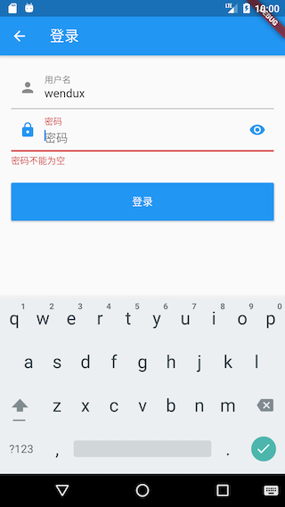

---
nav:
  title: 移动端
  path: /move
  order: 9
group:
  path: /chapter1
  title: Flutter实战·第二版
  order: 6

title: 登录页
order: 157
---

# 15.7 登录页

我们说过Github有多种登录方式，为了简单起见，我们只实现通过用户名和密码登录。在实现登录页时有四点需要注意：

1. 可以自动填充上次登录的用户名（如果有）。
2. 为了防止密码输入错误，密码框应该有开关可以看明文。
3. 用户名或密码字段在调用登录接口前有本地合法性校验（比如不能为空）。
4. 登录成功后需更新用户信息。

> 注意：Github 官方为了保证安全，现在已经不允许直接使用密码登录，取而代之的是用户需要去Github上生成一个登录token，然后通过账号+token登录，如何创建token请参考[Github官方指南](https://docs.github.com/cn/authentication/keeping-your-account-and-data-secure/creating-a-personal-access-token)。为了便于描述，本实例中的文案“密码”一次特指用户token。

实现代码如下：

```dart
import '../index.dart';

class LoginRoute extends StatefulWidget {
  @override
  _LoginRouteState createState() => _LoginRouteState();
}

class _LoginRouteState extends State<LoginRoute> {
  TextEditingController _unameController = TextEditingController();
  TextEditingController _pwdController = TextEditingController();
  bool pwdShow = false;
  GlobalKey _formKey = GlobalKey<FormState>();
  bool _nameAutoFocus = true;

  @override
  void initState() {
    // 自动填充上次登录的用户名，填充后将焦点定位到密码输入框
    _unameController.text = Global.profile.lastLogin ?? "";
    if (_unameController.text.isNotEmpty) {
      _nameAutoFocus = false;
    }
    super.initState();
  }

  @override
  Widget build(BuildContext context) {
    var gm = GmLocalizations.of(context);
    return Scaffold(
      appBar: AppBar(title: Text(gm.login)),
      body: Padding(
        padding: const EdgeInsets.all(16.0),
        child: Form(
          key: _formKey,
          autovalidateMode: AutovalidateMode.onUserInteraction,
          child: Column(
            children: <Widget>[
              TextFormField(
                  autofocus: _nameAutoFocus,
                  controller: _unameController,
                  decoration: InputDecoration(
                    labelText: gm.userName,
                    hintText: gm.userName,
                    prefixIcon: Icon(Icons.person),
                  ),
                  // 校验用户名（不能为空）
                  validator: (v) {
                    return v==null||v.trim().isNotEmpty ? null : gm.userNameRequired;
                  }),
              TextFormField(
                controller: _pwdController,
                autofocus: !_nameAutoFocus,
                decoration: InputDecoration(
                    labelText: gm.password,
                    hintText: gm.password,
                    prefixIcon: Icon(Icons.lock),
                    suffixIcon: IconButton(
                      icon: Icon(
                          pwdShow ? Icons.visibility_off : Icons.visibility),
                      onPressed: () {
                        setState(() {
                          pwdShow = !pwdShow;
                        });
                      },
                    )),
                obscureText: !pwdShow,
                //校验密码（不能为空）
                validator: (v) {
                  return v==null||v.trim().isNotEmpty ? null : gm.passwordRequired;
                },
              ),
              Padding(
                padding: const EdgeInsets.only(top: 25),
                child: ConstrainedBox(
                  constraints: BoxConstraints.expand(height: 55.0),
                  child: ElevatedButton(
                   // color: Theme.of(context).primaryColor,
                    onPressed: _onLogin,
                   // textColor: Colors.white,
                    child: Text(gm.login),
                  ),
                ),
              ),
            ],
          ),
        ),
      ),
    );
  }

  void _onLogin() async {
    // 先验证各个表单字段是否合法
    if ((_formKey.currentState as FormState).validate()) {
      showLoading(context);
      User? user;
      try {
        user = await Git(context)
            .login(_unameController.text, _pwdController.text);
        // 因为登录页返回后，首页会build，所以我们传入false，这样更新user后便不触发更新。
        Provider.of<UserModel>(context, listen: false).user = user;
      } on DioError catch( e) {
        //登录失败则提示
        if (e.response?.statusCode == 401) {
          showToast(GmLocalizations.of(context).userNameOrPasswordWrong);
        } else {
          showToast(e.toString());
        }
      } finally {
        // 隐藏loading框
        Navigator.of(context).pop();
      }
      //登录成功则返回
      if (user != null) {
        Navigator.of(context).pop();
      }
    }
  }
}
```

代码很简单，关键地方都有注释，不再赘述，下面我们看一下运行效果，如图15-5所示。


