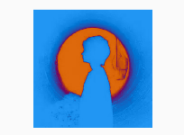
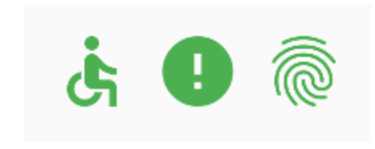
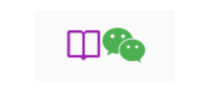

---
nav:
  title: 移动端
  path: /move
  order: 9
group:
  path: /chapter1
  title: Flutter实战·第二版
  order: 6
title: 图片及ICON
order: 32
---

# 3.3 图片及ICON

## 3.3.1 图片

Flutter 中，我们可以通过`Image`组件来加载并显示图片，`Image`的数据源可以是asset、文件、内存以及网络。

### 1. ImageProvider

`ImageProvider` 是一个抽象类，主要定义了图片数据获取的接口`load()`，从不同的数据源获取图片需要实现不同的`ImageProvider` ，如`AssetImage`是实现了从Asset中加载图片的 ImageProvider，而`NetworkImage` 实现了从网络加载图片的 ImageProvider。

### 2. Image

`Image` widget 有一个必选的`image`参数，它对应一个 ImageProvider。下面我们分别演示一下如何从 asset 和网络加载图片。

#### 1）从asset中加载图片

1. 在工程根目录下创建一个`images目录`，并将图片 avatar.png 拷贝到该目录。

2. 在`pubspec.yaml`中的`flutter`部分添加如下内容：

   ```yaml
     assets:
       - images/avatar.png
   ```
  > 注意: 由于 yaml 文件对缩进严格，所以必须严格按照每一层两个空格的方式进行缩进，此处 assets 前面应有两个空格。

3. 加载该图片

   ```dart
   Image(
     image: AssetImage("images/avatar.png"),
     width: 100.0
   );
   ```
   Image也提供了一个快捷的构造函数`Image.asset`用于从asset中加载、显示图片：

   ```dart
   Image.asset("images/avatar.png",
     width: 100.0,
   )
   ```


#### 2）从网络加载图片

`NetworkImage` 可以加载网络图片，例如：

```dart
Image(
  image: NetworkImage(
      "https://avatars2.githubusercontent.com/u/20411648?s=460&v=4"),
  width: 100.0,
)
```

Image也提供了一个快捷的构造函数`Image.network`用于从网络加载、显示图片：

```dart
Image.network(
  "https://avatars2.githubusercontent.com/u/20411648?s=460&v=4",
  width: 100.0,
)
```

运行上面两个示例，图片加载成功后如图3-11所示：


#### 3）参数

`Image`在显示图片时定义了一系列参数，通过这些参数我们可以控制图片的显示外观、大小、混合效果等。我们看一下 Image 的主要参数：

```dart
const Image({
  ...
  this.width, //图片的宽
  this.height, //图片高度
  this.color, //图片的混合色值
  this.colorBlendMode, //混合模式
  this.fit,//缩放模式
  this.alignment = Alignment.center, //对齐方式
  this.repeat = ImageRepeat.noRepeat, //重复方式
  ...
})
```

- `width`、`height`：用于设置图片的宽、高，当不指定宽高时，图片会根据当前父容器的限制，尽可能的显示其原始大小，如果只设置`width`、`height`的其中一个，那么另一个属性默认会按比例缩放，但可以通过下面介绍的`fit`属性来指定适应规则。

- `fit`：该属性用于在图片的显示空间和图片本身大小不同时指定图片的适应模式。适应模式是在`BoxFit`中定义，它是一个枚举类型，有如下值：

  - `fill`：会拉伸填充满显示空间，图片本身长宽比会发生变化，图片会变形。
  - `cover`：会按图片的长宽比放大后居中填满显示空间，图片不会变形，超出显示空间部分会被剪裁。
  - `contain`：这是图片的默认适应规则，图片会在保证图片本身长宽比不变的情况下缩放以适应当前显示空间，图片不会变形。
  - `fitWidth`：图片的宽度会缩放到显示空间的宽度，高度会按比例缩放，然后居中显示，图片不会变形，超出显示空间部分会被剪裁。
  - `fitHeight`：图片的高度会缩放到显示空间的高度，宽度会按比例缩放，然后居中显示，图片不会变形，超出显示空间部分会被剪裁。
  - `none`：图片没有适应策略，会在显示空间内显示图片，如果图片比显示空间大，则显示空间只会显示图片中间部分。

  一图胜万言！ 我们对一个宽高相同的头像图片应用不同的`fit`值，效果如图3-12所示：

  
  


- `color`和 `colorBlendMode`：在图片绘制时可以对每一个像素进行颜色混合处理，`color`指定混合色，而`colorBlendMode`指定混合模式，下面是一个简单的示例：

  ```dart
  Image(
    image: AssetImage("images/avatar.png"),
    width: 100.0,
    color: Colors.blue,
    colorBlendMode: BlendMode.difference,
  );
  ```

运行效果如图3-13所示（彩色）:



- `repeat`：当图片本身大小小于显示空间时，指定图片的重复规则。简单示例如下：

  ```dart
  Image(
    image: AssetImage("images/avatar.png"),
    width: 100.0,
    height: 200.0,
    repeat: ImageRepeat.repeatY ,
  )
  ```
  运行后效果如图3-14所示：

  

完整的示例代码如下：

```dart
import 'package:flutter/material.dart';

class ImageAndIconRoute extends StatelessWidget {
  @override
  Widget build(BuildContext context) {
    var img=AssetImage("imgs/avatar.png");
    return SingleChildScrollView(
      child: Column(
        children: <Image>[
          Image(
            image: img,
            height: 50.0,
            width: 100.0,
            fit: BoxFit.fill,
          ),
          Image(
            image: img,
            height: 50,
            width: 50.0,
            fit: BoxFit.contain,
          ),
          Image(
            image: img,
            width: 100.0,
            height: 50.0,
            fit: BoxFit.cover,
          ),
          Image(
            image: img,
            width: 100.0,
            height: 50.0,
            fit: BoxFit.fitWidth,
          ),
          Image(
            image: img,
            width: 100.0,
            height: 50.0,
            fit: BoxFit.fitHeight,
          ),
          Image(
            image: img,
            width: 100.0,
            height: 50.0,
            fit: BoxFit.scaleDown,
          ),
          Image(
            image: img,
            height: 50.0,
            width: 100.0,
            fit: BoxFit.none,
          ),
          Image(
            image: img,
            width: 100.0,
            color: Colors.blue,
            colorBlendMode: BlendMode.difference,
            fit: BoxFit.fill,
          ),
          Image(
            image: img,
            width: 100.0,
            height: 200.0,
            repeat: ImageRepeat.repeatY ,
          )
        ].map((e){
          return Row(
            children: <Widget>[
              Padding(
                padding: EdgeInsets.all(16.0),
                child: SizedBox(
                  width: 100,
                  child: e,
                ),
              ),
              Text(e.fit.toString())
            ],
          );
        }).toList()
      ),
    );
  }
}
```

### 3. Image缓存

Flutter框架对加载过的图片是有缓存的（内存），关于Image的详细内容及原理我们将会在后面进阶部分深入介绍。

## 3.3.2 ICON

Flutter 中，可以像Web开发一样使用 iconfont，iconfont 即“字体图标”，它是将图标做成字体文件，然后通过指定不同的字符而显示不同的图片。

> 在字体文件中，每一个字符都对应一个位码，而每一个位码对应一个显示字形，不同的字体就是指字形不同，即字符对应的字形是不同的。而在iconfont中，只是将位码对应的字形做成了图标，所以不同的字符最终就会渲染成不同的图标。

在Flutter开发中，iconfont和图片相比有如下优势：

1. 体积小：可以减小安装包大小。
2. 矢量的：iconfont都是矢量图标，放大不会影响其清晰度。
3. 可以应用文本样式：可以像文本一样改变字体图标的颜色、大小对齐等。
4. 可以通过TextSpan和文本混用。

### 1. 使用Material Design字体图标

Flutter默认包含了一套Material Design的字体图标，在`pubspec.yaml`文件中的配置如下

```yaml
flutter:
  uses-material-design: true
```

Material Design所有图标可以在其官网查看：https://material.io/tools/icons/

我们看一个简单的例子：

```dart
String icons = "";
// accessible: 0xe03e
icons += "\uE03e";
// error:  0xe237
icons += " \uE237";
// fingerprint: 0xe287
icons += " \uE287";

Text(
  icons,
  style: TextStyle(
    fontFamily: "MaterialIcons",
    fontSize: 24.0,
    color: Colors.green,
  ),
);
```

运行效果如图3-15所示：



通过这个示例可以看到，使用图标就像使用文本一样，但是这种方式需要我们提供每个图标的码点，这对开发者并不友好，所以，Flutter封装了`IconData`和`Icon`来专门显示字体图标，上面的例子也可以用如下方式实现：

```dart
Row(
  mainAxisAlignment: MainAxisAlignment.center,
  children: <Widget>[
    Icon(Icons.accessible,color: Colors.green),
    Icon(Icons.error,color: Colors.green),
    Icon(Icons.fingerprint,color: Colors.green),
  ],
)
```

`Icons`类中包含了所有Material Design图标的`IconData`静态变量定义。

### 2. 使用自定义字体图标

我们也可以使用自定义字体图标。iconfont.cn上有很多字体图标素材，我们可以选择自己需要的图标打包下载后，会生成一些不同格式的字体文件，在Flutter中，我们使用ttf格式即可。

假设我们项目中需要使用一个书籍图标和微信图标，我们打包下载后导入：

1. 导入字体图标文件；这一步和导入字体文件相同，假设我们的字体图标文件保存在项目根目录下，路径为"fonts/iconfont.ttf"：

   ```yaml
   fonts:
     - family: myIcon  #指定一个字体名
       fonts:
         - asset: fonts/iconfont.ttf
   ```

2. 为了使用方便，我们定义一个`MyIcons`类，功能和`Icons`类一样：将字体文件中的所有图标都定义成静态变量：

   ```dart
   class MyIcons{
     // book 图标
     static const IconData book = const IconData(
         0xe614, 
         fontFamily: 'myIcon', 
         matchTextDirection: true
     );
     // 微信图标
     static const IconData wechat = const IconData(
         0xec7d,  
         fontFamily: 'myIcon', 
         matchTextDirection: true
     );
   }
   ```

3. 使用

   ```dart
   Row(
     mainAxisAlignment: MainAxisAlignment.center,
     children: <Widget>[
       Icon(MyIcons.book,color: Colors.purple),
       Icon(MyIcons.wechat,color: Colors.green),
     ],
   )
   ```

   运行后效果如图3-16所示：

   

