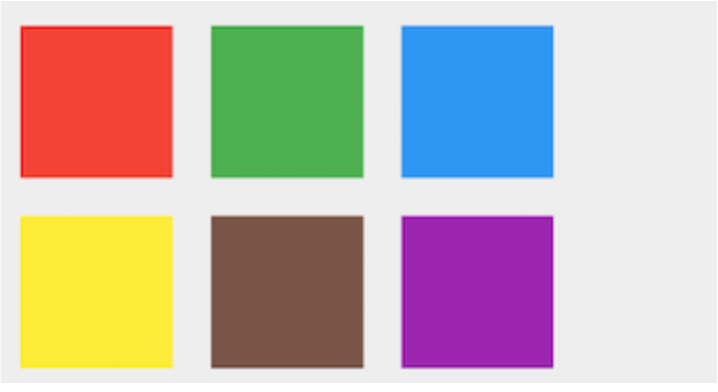

---
nav:
  title: 移动端
  path: /move
  order: 9
group:
  path: /chapter1
  title: Flutter实战·第二版
  order: 6
title: 流式布局（Wrap、Flow）
order: 45
---

# 4.5 流式布局（Wrap、Flow）

在介绍 Row 和 Column 时，如果子 widget 超出屏幕范围，则会报溢出错误，如：

```dart
Row(
  children: <Widget>[
    Text("xxx"*100)
  ],
);
```

运行效果如图4-14所示：


可以看到，右边溢出部分报错。这是因为Row默认只有一行，如果超出屏幕不会折行。我们把超出屏幕显示范围会自动折行的布局称为流式布局。Flutter中通过`Wrap`和`Flow`来支持流式布局，将上例中的 Row 换成Wrap后溢出部分则会自动折行，下面我们分别介绍`Wrap`和`Flow`.

## 4.5.1 Wrap

下面是Wrap的定义:

```dart
Wrap({
  ...
  this.direction = Axis.horizontal,
  this.alignment = WrapAlignment.start,
  this.spacing = 0.0,
  this.runAlignment = WrapAlignment.start,
  this.runSpacing = 0.0,
  this.crossAxisAlignment = WrapCrossAlignment.start,
  this.textDirection,
  this.verticalDirection = VerticalDirection.down,
  List<Widget> children = const <Widget>[],
})
```

我们可以看到Wrap的很多属性在`Row`（包括`Flex`和`Column`）中也有，如`direction`、`crossAxisAlignment`、`textDirection`、`verticalDirection`等，这些参数意义是相同的，我们不再重复介绍，读者可以查阅前面介绍`Row`的部分。读者可以认为`Wrap`和`Flex`（包括`Row`和`Column`）除了超出显示范围后`Wrap`会折行外，其他行为基本相同。下面我们看一下`Wrap`特有的几个属性：

- `spacing`：主轴方向子widget的间距
- `runSpacing`：纵轴方向的间距
- `runAlignment`：纵轴方向的对齐方式

下面看一个示例子：

```dart
 Wrap(
   spacing: 8.0, // 主轴(水平)方向间距
   runSpacing: 4.0, // 纵轴（垂直）方向间距
   alignment: WrapAlignment.center, //沿主轴方向居中
   children: <Widget>[
     Chip(
       avatar: CircleAvatar(backgroundColor: Colors.blue, child: Text('A')),
       label: Text('Hamilton'),
     ),
     Chip(
       avatar: CircleAvatar(backgroundColor: Colors.blue, child: Text('M')),
       label: Text('Lafayette'),
     ),
     Chip(
       avatar: CircleAvatar(backgroundColor: Colors.blue, child: Text('H')),
       label: Text('Mulligan'),
     ),
     Chip(
       avatar: CircleAvatar(backgroundColor: Colors.blue, child: Text('J')),
       label: Text('Laurens'),
     ),
   ],
)
```

运行效果如图4-15所示：


## 4.5.2 Flow

我们一般很少会使用`Flow`，因为其过于复杂，需要自己实现子 widget 的位置转换，在很多场景下首先要考虑的是`Wrap`是否满足需求。`Flow`主要用于一些需要自定义布局策略或性能要求较高(如动画中)的场景。`Flow`有如下优点：

- 性能好；`Flow`是一个对子组件尺寸以及位置调整非常高效的控件，`Flow`用转换矩阵在对子组件进行位置调整的时候进行了优化：在`Flow`定位过后，如果子组件的尺寸或者位置发生了变化，在`FlowDelegate`中的`paintChildren()`方法中调用`context.paintChild` 进行重绘，而`context.paintChild`在重绘时使用了转换矩阵，并没有实际调整组件位置。
- 灵活；由于我们需要自己实现`FlowDelegate`的`paintChildren()`方法，所以我们需要自己计算每一个组件的位置，因此，可以自定义布局策略。

缺点：

- 使用复杂。
- Flow 不能自适应子组件大小，必须通过指定父容器大小或实现`TestFlowDelegate`的`getSize`返回固定大小。

示例：

我们对六个色块进行自定义流式布局：

```dart
Flow(
  delegate: TestFlowDelegate(margin: EdgeInsets.all(10.0)),
  children: <Widget>[
    Container(width: 80.0, height:80.0, color: Colors.red,),
    Container(width: 80.0, height:80.0, color: Colors.green,),
    Container(width: 80.0, height:80.0, color: Colors.blue,),
    Container(width: 80.0, height:80.0,  color: Colors.yellow,),
    Container(width: 80.0, height:80.0, color: Colors.brown,),
    Container(width: 80.0, height:80.0,  color: Colors.purple,),
  ],
)
```

实现TestFlowDelegate:

```dart
class TestFlowDelegate extends FlowDelegate {
  EdgeInsets margin;

  TestFlowDelegate({this.margin = EdgeInsets.zero});

  double width = 0;
  double height = 0;

  @override
  void paintChildren(FlowPaintingContext context) {
    var x = margin.left;
    var y = margin.top;
    //计算每一个子widget的位置
    for (int i = 0; i < context.childCount; i++) {
      var w = context.getChildSize(i)!.width + x + margin.right;
      if (w < context.size.width) {
        context.paintChild(i, transform: Matrix4.translationValues(x, y, 0.0));
        x = w + margin.left;
      } else {
        x = margin.left;
        y += context.getChildSize(i)!.height + margin.top + margin.bottom;
        //绘制子widget(有优化)
        context.paintChild(i, transform: Matrix4.translationValues(x, y, 0.0));
        x += context.getChildSize(i)!.width + margin.left + margin.right;
      }
    }
  }

  @override
  Size getSize(BoxConstraints constraints) {
    // 指定Flow的大小，简单起见我们让宽度尽可能大，但高度指定为200，
    // 实际开发中我们需要根据子元素所占用的具体宽高来设置Flow大小
    return Size(double.infinity, 200.0);
  }

  @override
  bool shouldRepaint(FlowDelegate oldDelegate) {
    return oldDelegate != this;
  }
}
```

运行效果见图4-16：



可以看到我们主要的任务就是实现`paintChildren`，它的主要任务是确定每个子widget位置。由于Flow不能自适应子widget的大小，我们通过在`getSize`返回一个固定大小来指定Flow的大小。

注意，如果我们需要自定义布局策略，一般首选的方式是通过直接继承RenderObject，然后通过重写 performLayout 的方式实现，具体方式我们会在本书后面14.4 布局（Layout）一节中举例说明。
