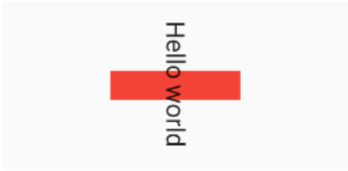
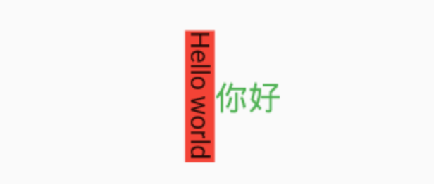

---
nav:
  title: 移动端
  path: /move
  order: 9
group:
  path: /chapter1
  title: Flutter实战·第二版
  order: 6
title: 变换（Transform）
order: 53
---


# 5.3 变换（Transform）

`Transform`可以在其子组件绘制时对其应用一些矩阵变换来实现一些特效。`Matrix4`是一个4D矩阵，通过它我们可以实现各种矩阵操作，下面是一个例子：

```dart
Container(
  color: Colors.black,
  child: Transform(
    alignment: Alignment.topRight, //相对于坐标系原点的对齐方式
    transform: Matrix4.skewY(0.3), //沿Y轴倾斜0.3弧度
    child: Container(
      padding: const EdgeInsets.all(8.0),
      color: Colors.deepOrange,
      child: const Text('Apartment for rent!'),
    ),
  ),
)
```

运行效果如图5-3所示：


> 关于矩阵变换的相关内容属于线性代数范畴，本书不做讨论，读者有兴趣可以自行了解。本书中，我们把焦点放在Flutter中一些常见的变换效果上。另外，由于矩阵变化时发生在绘制时，而无需重新布局和构建等过程，所以性能很好。
>

## 5.3.1 平移

`Transform.translate`接收一个`offset`参数，可以在绘制时沿`x`、`y`轴对子组件平移指定的距离。

```dart
DecoratedBox(
  decoration:BoxDecoration(color: Colors.red),
  //默认原点为左上角，左移20像素，向上平移5像素  
  child: Transform.translate(
    offset: Offset(-20.0, -5.0),
    child: Text("Hello world"),
  ),
)
```

效果如图5-4所示：


## 5.3.2 旋转

`Transform.rotate`可以对子组件进行旋转变换，如：

```dart
DecoratedBox(
  decoration:BoxDecoration(color: Colors.red),
  child: Transform.rotate(
    //旋转90度
    angle:math.pi/2 ,
    child: Text("Hello world"),
  ),
)
```
注意：要使用`math.pi`需先进行如下导包。  
```dart  
import 'dart:math' as math;  
```

效果如图5-5所示：



## 5.3.3 缩放

`Transform.scale`可以对子组件进行缩小或放大，如：

```dart
DecoratedBox(
  decoration:BoxDecoration(color: Colors.red),
  child: Transform.scale(
    scale: 1.5, //放大到1.5倍
    child: Text("Hello world")
  )
);
```

效果如图5-6所示：


## 5.3.4 Transform 注意事项

- `Transform`的变换是应用在绘制阶段，而并不是应用在布局(layout)阶段，所以无论对子组件应用何种变化，其占用空间的大小和在屏幕上的位置都是固定不变的，因为这些是在布局阶段就确定的。下面我们具体说明：

  ```dart
   Row(
    mainAxisAlignment: MainAxisAlignment.center,
    children: <Widget>[
      DecoratedBox(
        decoration:BoxDecoration(color: Colors.red),
        child: Transform.scale(scale: 1.5,
            child: Text("Hello world")
        )
      ),
      Text("你好", style: TextStyle(color: Colors.green, fontSize: 18.0),)
    ],
  )
  ```

  运行效果如图5-14所示：

  

  由于第一个`Text`应用变换(放大)后，其在绘制时会放大，但其占用的空间依然为红色部分，所以第二个`Text`会紧挨着红色部分，最终就会出现文字重合。

- 由于矩阵变化只会作用在绘制阶段，所以在某些场景下，在UI需要变化时，可以直接通过矩阵变化来达到视觉上的UI改变，而不需要去重新触发build流程，这样会节省layout的开销，所以性能会比较好。如之前介绍的`Flow`组件，它内部就是用矩阵变换来更新UI，除此之外，Flutter的动画组件中也大量使用了`Transform`以提高性能。

> 思考题：使用`Transform`对其子组件先进行平移然后再旋转和先旋转再平移，两者最终的效果一样吗？为什么？

## 5.3.5 RotatedBox

`RotatedBox`和`Transform.rotate`功能相似，它们都可以对子组件进行旋转变换，但是有一点不同：`RotatedBox`的变换是在layout阶段，会影响在子组件的位置和大小。我们将上面介绍`Transform.rotate`时的示例改一下：

```dart
Row(
  mainAxisAlignment: MainAxisAlignment.center,
  children: <Widget>[
    DecoratedBox(
      decoration: BoxDecoration(color: Colors.red),
      //将Transform.rotate换成RotatedBox  
      child: RotatedBox(
        quarterTurns: 1, //旋转90度(1/4圈)
        child: Text("Hello world"),
      ),
    ),
    Text("你好", style: TextStyle(color: Colors.green, fontSize: 18.0),)
  ],
),
```

效果如图5-8所示：




由于`RotatedBox`是作用于layout阶段，所以子组件会旋转90度（而不只是绘制的内容），`decoration`会作用到子组件所占用的实际空间上，所以最终就是上图的效果，读者可以和前面`Transform.rotate`示例对比理解。

