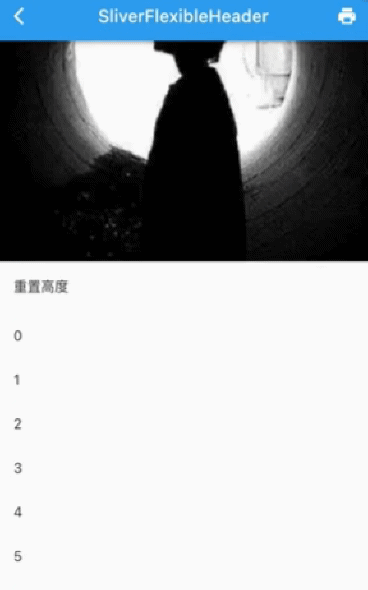
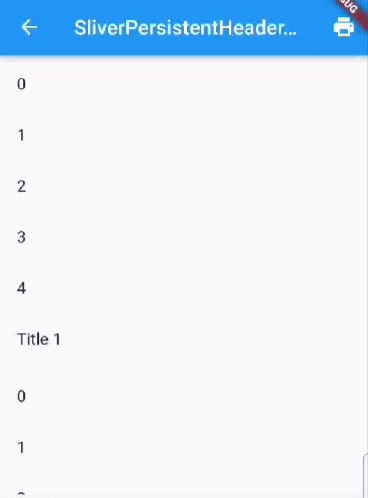

---
nav:
  title: 移动端
  path: /move
  order: 9
group:
  path: /chapter1
  title: Flutter实战·第二版
  order: 6
title: 自定义 Sliver
order: 71
---


# 6.11 自定义 Sliver

本节将通过自定义两个Sliver，来说明Sliver 布局协议和自定义 Sliver 的具体过程。

## 6.11.1 Sliver 布局协议

Sliver 的布局协议如下：

1. Viewport 将当前布局和配置信息通过 SliverConstraints 传递给 Sliver。
2. Sliver 确定自身的位置、绘制等信息，保存在 geometry 中（一个 SliverGeometry 类型的对象）。
3. Viewport 读取 geometry 中的信息来对 Sliver 进行布局和绘制。

可以看到，这个过程有两个重要的对象 SliverConstraints 和 SliverGeometry ，我们先看看 SliverConstraints 的定义：

```dart
class SliverConstraints extends Constraints {
    //主轴方向
    AxisDirection? axisDirection;
    //Sliver 沿着主轴从列表的哪个方向插入？枚举类型，正向或反向
    GrowthDirection? growthDirection;
    //用户滑动方向
    ScrollDirection? userScrollDirection;
    //当前Sliver理论上（可能会固定在顶部）已经滑出可视区域的总偏移
    double? scrollOffset;
    //当前Sliver之前的Sliver占据的总高度，因为列表是懒加载，如果不能预估时，该值为double.infinity
    double? precedingScrollExtent;
    //上一个 sliver 覆盖当前 sliver 的长度（重叠部分的长度），通常在 sliver 是 pinned/floating
    //或者处于列表头尾时有效，我们在后面的小节中会有相关的例子。
    double? overlap;
    //当前Sliver在Viewport中的最大可以绘制的区域。
    //绘制如果超过该区域会比较低效（因为不会显示）
    double? remainingPaintExtent;
    //纵轴的长度；如果列表滚动方向是垂直方向，则表示列表宽度。
    double? crossAxisExtent;
    //纵轴方向
    AxisDirection? crossAxisDirection;
    //Viewport在主轴方向的长度；如果列表滚动方向是垂直方向，则表示列表高度。
    double? viewportMainAxisExtent;
    //Viewport 预渲染区域的起点[-Viewport.cacheExtent, 0]
    double? cacheOrigin;
    //Viewport加载区域的长度，范围:
    //[viewportMainAxisExtent,viewportMainAxisExtent + Viewport.cacheExtent*2]
    double? remainingCacheExtent;
}
```

可以看见 SliverConstraints 中包含的信息非常多。当列表滑动时，如果某个 Sliver 已经进入了需要构建的区域，则列表会将 SliverConstraints 信息传递给该 Sliver，Sliver 就可以根据这些信息来确定自身的布局和绘制信息了。

Sliver 需要确定的是 SliverGeometry：

```dart
const SliverGeometry({
  //Sliver在主轴方向预估长度，大多数情况是固定值，用于计算sliverConstraints.scrollOffset
  this.scrollExtent = 0.0, 
  this.paintExtent = 0.0, // 可视区域中的绘制长度
  this.paintOrigin = 0.0, // 绘制的坐标原点，相对于自身布局位置
  //在 Viewport中占用的长度；如果列表滚动方向是垂直方向，则表示列表高度。
  //范围[0,paintExtent]
  double? layoutExtent, 
  this.maxPaintExtent = 0.0,//最大绘制长度
  this.maxScrollObstructionExtent = 0.0,
  double? hitTestExtent, // 点击测试的范围
  bool? visible,// 是否显示
  //是否会溢出Viewport，如果为true，Viewport便会裁剪
  this.hasVisualOverflow = false,
  //scrollExtent的修正值：layoutExtent变化后，为了防止sliver突然跳动（应用新的layoutExtent）
  //可以先进行修正，具体的作用在后面 SliverFlexibleHeader 示例中会介绍。
  this.scrollOffsetCorrection,
  double? cacheExtent, // 在预渲染区域中占据的长度
}) 
```

### Sliver布局模型和盒布局模型

两者布局流程基本相同：父组件告诉子组件约束信息 > 子组件根据父组件的约束确定自生大小 > 父组件获得子组件大小调整其位置。不同是：

1. 父组件传递给子组件的约束信息不同。盒模型传递的是 BoxConstraints，而 Sliver 传递的是 SliverConstraints。
2. 描述子组件布局信息的对象不同。盒模型的布局信息通过 Size 和 offset描述 ，而 Sliver的是通过 SliverGeometry 描述。
3. 布局的起点不同。Sliver布局的起点一般是Viewport ，而盒模型布局的起点可以是任意的组件。

 SliverConstraints 和 SliverGeometry 属性比较多，只看的话它们的含义并不好理解，下面我们将通过两个例子，通过实践来理解。

## 6.11.2 自定义 Sliver（一）SliverFlexibleHeader

### 1. SliverFlexibleHeader

我们实现一个类似旧版本微信朋友圈顶部头图的功能：即默认情况下顶部图片只显示一部分，当用户向下拽时图片的剩余部分会逐渐显示，如图6-28所示。


我们的思路是实现一个 Sliver，将它作为 CustomScrollView 的第一孩子，然后根据用户的滑动来动态调整 Sliver 的布局和显示。下面我们来实现一个 SliverFlexibleHeader，它会结合 CustomScrollView 实现上述效果。我们先看一下页面的整体实现代码：

```dart
@override
Widget build(BuildContext context) {
  return CustomScrollView(
    //为了能使CustomScrollView拉到顶部时还能继续往下拉，必须让 physics 支持弹性效果
    physics: const BouncingScrollPhysics(parent: AlwaysScrollableScrollPhysics()),
    slivers: [
      //我们需要实现的 SliverFlexibleHeader 组件
      SliverFlexibleHeader(
        visibleExtent: 200,, // 初始状态在列表中占用的布局高度
        // 为了能根据下拉状态变化来定制显示的布局，我们通过一个 builder 来动态构建布局。
        builder: (context, availableHeight, direction) {
          return GestureDetector(
            onTap: () => print('tap'), //测试是否可以响应事件
            child: Image(
              image: AssetImage("imgs/avatar.png"),
              width: 50.0,
              height: availableHeight,
              alignment: Alignment.bottomCenter,
              fit: BoxFit.cover,
            ),
          );
        },
      ),
      // 构建一个list
      buildSliverList(30),
    ],
  );
}
```

接下来，我们的重点是实现 SliverFlexibleHeader，由于涉及到 Sliver 布局，通过现有组件很难组合实现我们想要的功能，所以我们通过定制 RenderObject 的方式来实现它。为了能根据下拉位置的变化来动态调整，SliverFlexibleHeader 中我们通过一个 builder 来动态构建布局，当下拉位置发生变化时，builder 就会被回调。

为了清晰起见，我们先实现一个接收固定 widget 的 _SliverFlexibleHeader 组件，组件定义代码如下：

```dart
class _SliverFlexibleHeader extends SingleChildRenderObjectWidget {
  const _SliverFlexibleHeader({
    Key? key,
    required Widget child,
    this.visibleExtent = 0,
  }) : super(key: key, child: child);
  final double visibleExtent;

  @override
  RenderObject createRenderObject(BuildContext context) {
   return _FlexibleHeaderRenderSliver(visibleExtent);
  }

  @override
  void updateRenderObject(
      BuildContext context, _FlexibleHeaderRenderSliver renderObject) {
    renderObject..visibleExtent = visibleExtent;
  }
}
```

这里我们继承的既不是 StatelessWidget，也不是 StatefulWidget，这是因为这两个组件主要的作用是组合 Widget，而我们要自定义 RenderObject，则需要继承 RenderObjectWidget，考虑到_SliverFlexibleHeader 有一个子节点，我们可以直接继承 SingleChildRenderObjectWidget 类，这样我们可以省去一些和布局无关的代码，比如绘制和事件的点击测试，这些功能 SingleChildRenderObjectWidget  中已经帮我们处理了。

下面我们实现 _FlexibleHeaderRenderSliver，核心代码就在 performLayout 中，读者可参考注释：

```dart
class _FlexibleHeaderRenderSliver extends RenderSliverSingleBoxAdapter {
    _FlexibleHeaderRenderSliver(double visibleExtent)
      : _visibleExtent = visibleExtent;
  
  double _lastOverScroll = 0;
  double _lastScrollOffset = 0;
  late double _visibleExtent = 0;


  set visibleExtent(double value) {
    // 可视长度发生变化，更新状态并重新布局
    if (_visibleExtent != value) {
      _lastOverScroll = 0;
      _visibleExtent = value;
      markNeedsLayout();
    }
  }

  @override
  void performLayout() {
    // 滑动距离大于_visibleExtent时则表示子节点已经在屏幕之外了
    if (child == null || (constraints.scrollOffset > _visibleExtent)) {
      geometry = SliverGeometry(scrollExtent: _visibleExtent);
      return;
    }

    // 测试overlap,下拉过程中overlap会一直变化.
    double overScroll = constraints.overlap < 0 ? constraints.overlap.abs() : 0;
    var scrollOffset = constraints.scrollOffset;

    // 在Viewport中顶部的可视空间为该 Sliver 可绘制的最大区域。
    // 1. 如果Sliver已经滑出可视区域则 constraints.scrollOffset 会大于 _visibleExtent，
    //    这种情况我们在一开始就判断过了。
    // 2. 如果我们下拉超出了边界，此时 overScroll>0，scrollOffset 值为0，所以最终的绘制区域为
    //    _visibleExtent + overScroll.
    double paintExtent = _visibleExtent + overScroll - constraints.scrollOffset;
    // 绘制高度不超过最大可绘制空间
    paintExtent = min(paintExtent, constraints.remainingPaintExtent);

    //对子组件进行布局，关于 layout 详细过程我们将在本书后面布局原理相关章节详细介绍，现在只需知道
    //子组件通过 LayoutBuilder可以拿到这里我们传递的约束对象（ExtraInfoBoxConstraints）
    child!.layout(
      constraints.asBoxConstraints(maxExtent: paintExtent),
      parentUsesSize: false,
    );

    //最大为_visibleExtent，最小为 0
    double layoutExtent = min(_visibleExtent, paintExtent);

    //设置geometry，Viewport 在布局时会用到
    geometry = SliverGeometry(
      scrollExtent: layoutExtent,
      paintOrigin: -overScroll,
      paintExtent: paintExtent,
      maxPaintExtent: paintExtent,
      layoutExtent: layoutExtent,
    );
  }
}
```

在 performLayout 中我们通过 Viewport 传来的 SliverConstraints 结合子组件的高度，最终确定了 `_SliverFlexibleHeader` 的布局、绘制等相关信息，它们被保存在了 `geometry` 中，之后，Viewport 就可以读取 geometry 来确定 `_SliverFlexibleHeader` 在 Viewport 中的位置，然后进行绘制。读者可以手动修改一下 SliverGeometry 的各个属性，看看效果，这样可以加深理解。

现在还剩最后一个问题，`_SliverFlexibleHeader` 接收的是一个固定的 widget，我们如何在下拉位置发生变化时来重新构建 widget 呢？上面代码中，我们在 `_SliverFlexibleHeader` 的 performLayout 方法中，每当下拉位置发生变化，我们都会对其子组件重新进行 layout。那既然如此，我们可以创建一个 LayoutBuilder 用于在子组件重新布局时来动态构建 child。思路有了，那么实现很简单，我们看看最终的 SliverFlexibleHeader 实现：

```dart
typedef SliverFlexibleHeaderBuilder = Widget Function(
  BuildContext context,
  double maxExtent,
  //ScrollDirection direction,
);

class SliverFlexibleHeader extends StatelessWidget {
  const SliverFlexibleHeader({
    Key? key,
    this.visibleExtent = 0,
    required this.builder,
  }) : super(key: key);

  final SliverFlexibleHeaderBuilder builder;
  final double visibleExtent;

  @override
  Widget build(BuildContext context) {
    return _SliverFlexibleHeader(
      visibleExtent: visibleExtent,
      child: LayoutBuilder(
        builder: (BuildContext context, BoxConstraints constraints) {
          return builder(
            context,
            constraints.maxHeight
          );
        },
      ),
    );
  }
}
```

当` _SliverFlexibleHeader` 中每次对子组件进行布局时，都会触发 LayoutBuilder 来重新构建子 widget ，LayoutBuilder 中收到的 constraints 就是 ` _SliverFlexibleHeader` 中对子组件进行布局时 传入的 constraints，即：

```dart
...
child!.layout(
  //对子组件进行布局
  constraints.asBoxConstraints(maxExtent: paintExtent),
  parentUsesSize: true,
);
...
```

### 2. 传递额外的布局信息

在实际使用 SliverFlexibleHeader 时，我们有时在构建子 widget 时可能会依赖当前列表的滑动方向，当然我们可以在 SliverFlexibleHeader 的 builder 中记录前后的 availableHeight 的差来确定滑动方向，但是这样比较麻烦，需要使用者来手动处理。我们知道在滑动时，Sliver 的 SliverConstraints 中已经包含了 `userScrollDirection`，如果我们能将它经过统一的处理然后透传给 LayoutBuilder 的话就非常好好了，这样就不需要开发者在使用时自己维护滑动方向了！按照这个思路我们来实现一下。

首先我们遇到了第一个问题： LayoutBuilder 接收的参数我们没法指定。为此笔者想到了两种方案：

1. 我们知道在上面的场景中，在对子组件进行布局时我们传给子组件的约束只使用了最大长度，最小长度是没有用到的，那么我们可以将滑动方向通过最小长度传递给 LayoutBuilder，然后再 LayoutBuilder 中取出即可。
2. 定义一个新类，让它继承自 `BoxConstraints`，然后再添加一个可以保存 scrollDirection 的属性。

笔者试了一下，两种方案都能成功，那应该使用哪种方案呢？笔者建议使用方案 2 ，因为方案 1 有一个副作用就是会影响子组件布局。我们知道 LayoutBuilder 是在子组件 build 阶段执行的，当我们设置了最小长度后，我们虽然在 build 阶段没有用到它，但是在子组件在布局阶段仍然会应用此约束，所以最终还会影响子组件的布局。

下面我们按照方案 2 来实现：定义一个 ExtraInfoBoxConstraints 类，它可以携带约束之外的信息，为了尽可能通用，我们使用泛型：

```dart
class ExtraInfoBoxConstraints<T> extends BoxConstraints {
  ExtraInfoBoxConstraints(
    this.extra,
    BoxConstraints constraints,
  ) : super(
          minWidth: constraints.minWidth,
          minHeight: constraints.minHeight,
          maxWidth: constraints.maxWidth,
          maxHeight: constraints.maxHeight,
        );

  // 额外的信息
  final T extra;
  
  @override
  bool operator ==(Object other) {
    if (identical(this, other)) return true;
    return other is ExtraInfoBoxConstraints &&
        super == other &&
        other.extra == extra;
  }

  @override
  int get hashCode {
    return hashValues(super.hashCode, extra);
  }
}
```

上面代码比较简单，要说明的是我们重载了“==”运算符，这是因为 Flutter 在布局期间在特定的情况下会检测前后两次 constraints 是否相等然后来决定是否需要重新布局，所以我们需要重载“==”运算符，否则可能会在最大/最小宽高不变但 extra 发生变化时不会触发 child 重新布局，这时也就不会触发 LayoutBuilder，这明显不符合预期，因为我们希望 extra 发生变化时，会触发 LayoutBuilder 重新构建 child。

首先我们修改 `__FlexibleHeaderRenderSliver` 的 performLayout 方法：

```dart
...
  //对子组件进行布局，子组件通过 LayoutBuilder可以拿到这里我们传递的约束对象（ExtraInfoBoxConstraints）
  child!.layout(
  ExtraInfoBoxConstraints(
    direction, //传递滑动方向
    constraints.asBoxConstraints(maxExtent: paintExtent),
  ),
  parentUsesSize: false,
);
...
```

然后修改 SliverFlexibleHeader 实现，在 LayoutBuilder 中就可以获取到滑动方向：

```dart
typedef SliverFlexibleHeaderBuilder = Widget Function(
  BuildContext context,
  double maxExtent,
  ScrollDirection direction,
);

class SliverFlexibleHeader extends StatelessWidget {
  const SliverFlexibleHeader({
    Key? key,
    this.visibleExtent = 0,
    required this.builder,
  }) : super(key: key);

  final SliverFlexibleHeaderBuilder builder;
  final double visibleExtent;

  @override
  Widget build(BuildContext context) {
    return _SliverFlexibleHeader(
      visibleExtent: visibleExtent,
      child: LayoutBuilder(
        builder: (BuildContext context, BoxConstraints constraints) {
          return builder(
            context,
            constraints.maxHeight,
            // 获取滑动方向
            (constraints as ExtraInfoBoxConstraints<ScrollDirection>).extra,
          );
        },
      ),
    );
  }
}
```

最后我们看一下 SliverFlexibleHeader 中确定滑动方向的逻辑：

```dart
// 下拉过程中overlap会一直变化.
double overScroll = constraints.overlap < 0 ? constraints.overlap.abs() : 0;
var scrollOffset = constraints.scrollOffset;
_direction = ScrollDirection.idle;

// 根据前后的overScroll值之差确定列表滑动方向。注意，不能直接使用 constraints.userScrollDirection，
// 这是因为该参数只表示用户滑动操作的方向。比如当我们下拉超出边界时，然后松手，此时列表会弹回，即列表滚动
// 方向是向上，而此时用户操作已经结束，ScrollDirection 的方向是上一次的用户滑动方向(向下)，这是便有问题。
var distance = overScroll > 0
  ? overScroll - _lastOverScroll
  : _lastScrollOffset - scrollOffset;
_lastOverScroll = overScroll;
_lastScrollOffset = scrollOffset;

if (constraints.userScrollDirection == ScrollDirection.idle) {
  _direction = ScrollDirection.idle;
  _lastOverScroll = 0;
} else if (distance > 0) {
  _direction = ScrollDirection.forward;
} else if (distance < 0) {
  _direction = ScrollDirection.reverse;
}
```

### 3. 高度修正 scrollOffsetCorrection

如果 visibleExtent 变化时，我们看看效果，如图6-29所示：



可以看到有一个突兀地跳动，这是因为 visibleExtent 变化时会导致 layoutExtent 发生变化，也就是说 SliverFlexibleHeader 在屏幕中所占的布局高度会发生变化，所以列表就出现跳动。但这个跳动效果太突兀了，我们知道每一个 Sliver 的高度是通过 scrollExtent 属性预估出来的，因此我们需要修正一下 scrollExtent，但是我们不能直接修改 scrollExtent 的值，直接修改不会有任何动画效果，仍然会跳动，为此，SliverGeometry 提供了一个 scrollOffsetCorrection 属性，它专门用于修正 scrollExtent ，我们只需要将要修正差值传给scrollOffsetCorrection，然后 Sliver 会自动执行一个动画效果过渡到我们期望的高度。

```dart
  // 是否需要修正scrollOffset。当_visibleExtent值更新后，为了防止
  // 视觉上突然地跳动，要先修正 scrollOffset。
  double? _scrollOffsetCorrection;

  set visibleExtent(double value) {
    // 可视长度发生变化，更新状态并重新布局
    if (_visibleExtent != value) {
      _lastOverScroll = 0;
      _reported = false;
      // 计算修正值
      _scrollOffsetCorrection = value - _visibleExtent;
      _visibleExtent = value;
      markNeedsLayout();
    }
  }

  @override
  void performLayout() {
    // _visibleExtent 值更新后，为了防止突然的跳动，先修正 scrollOffset
    if (_scrollOffsetCorrection != null) {
      geometry = SliverGeometry(
        //修正
        scrollOffsetCorrection: _scrollOffsetCorrection,
      );
      _scrollOffsetCorrection = null;
      return;
    }
    ...
  } 
```

运行后效果如图6-30（动图可能太快，可以直接运行示例查看效果）：


### 4. 边界

在 SliverFlexibleHeader 构建子组件时开发者可能会依赖“当前的可用高度是否为0”来做一些特殊处理，比如记录是否子组件已经离开了屏幕。但是根据上面的实现，当用户滑动非常快时，子组件离开屏幕时的最后一次布局时传递的约束的 maxExtent 可能不为 0，而当 constraints.scrollOffset 大于 _visibleExtent 时我们在 performLayout 的一开始就返回了，因此 LayoutBuilder 的 builder 中就有可能收不到 maxExtent 为 0 时的回调。为了解决这个问题，我们只需要在每次 Sliver 离开屏幕时调用一次 child.layout 同时 将maxExtent 指定为 0 即可，为此我们修改一下：

```dart
void performLayout() {
    if (child == null) {
      geometry = SliverGeometry(scrollExtent: _visibleExtent);
      return;
    }
    //当已经完全滑出屏幕时
    if (constraints.scrollOffset > _visibleExtent) {
      geometry = SliverGeometry(scrollExtent: _visibleExtent);
      // 通知 child 重新布局，注意，通知一次即可，如果不通知，滑出屏幕后，child 在最后
      // 一次构建时拿到的可用高度可能不为 0。因为使用者在构建子节点的时候，可能会依赖
      // "当前的可用高度是否为0" 来做一些特殊处理，比如记录是否子节点已经离开了屏幕，
      // 因此，我们需要在离开屏幕时确保LayoutBuilder的builder会被调用一次（构建子组件）。
      if (!_reported) {
        _reported = true;
        child!.layout(
          ExtraInfoBoxConstraints(
            _direction, //传递滑动方向
            constraints.asBoxConstraints(maxExtent: 0),
          ),
          //我们不会使用自节点的 Size, 关于此参数更详细的内容见本书后面关于layout原理的介绍
          parentUsesSize: false,
        );
      }
      return;
    }

    //子组件回到了屏幕中，重置通知状态
    _reported = false;
  
  ...
}
```

至此大功告成！

## 6.11.3 自定义 Sliver（二）SliverPersistentHeaderToBox

我们在上一节介绍了 SliverPersistentHeader，在使用时需要遵守两个规则 ：

1. 必须显式指定高度。

2. 如果我们在使用 SliverPersistentHeader 构建子组件时需要依赖 overlapsContent 参数，则必须保证之前至少还有一个 SliverPersistentHeader 或 SliverAppBar。

遵守上面这两条规则对于开发者来说心智负担还是较重的，比如对于规则 1，大多数时候我们是不知道 Header 具体的高度的，我们期望直接传一个 widget ，这个 widget 的实际高度 SliverPersistentHeader 能自动算出来。对于规则 2 就更不用说，不知道这个准是要踩坑的。综上，本节我们自定义一个 SliverPersistentHeaderToBox，它可以将任意 RenderBox 适配为可以固定到顶部的 Sliver 而不用显式指定高度，同时避免上面的问题 2。

第一步：我们先看一下定义 SliverPersistentHeaderToBox。

```dart
typedef SliverPersistentHeaderToBoxBuilder = Widget Function(
  BuildContext context,
  double maxExtent, //当前可用最大高度
  bool fixed, // 是否已经固定
);

class SliverPersistentHeaderToBox extends StatelessWidget {
  // 默认构造函数，直接接受一个 widget，不用显式指定高度
  SliverPersistentHeaderToBox({
    Key? key,
    required Widget child,
  })  : builder = ((a, b, c) => child),
        super(key: key);
 // builder 构造函数，需要传一个 builder，同样不需要显式指定高度
  SliverPersistentHeaderToBox.builder({
    Key? key,
    required this.builder,
  }) : super(key: key);

  final SliverPersistentHeaderToBoxBuilder builder;

  @override
  Widget build(BuildContext context) {
    return _SliverPersistentHeaderToBox(
      // 通过 LayoutBuilder接收 Sliver 传递给子组件的布局约束信息
      child: LayoutBuilder(
        builder: (BuildContext context, BoxConstraints constraints) {
          return builder(
            context,
            constraints.maxHeight,
            //约束中需要传递的额外信息是一个bool类型，表示 Sliver 是否已经固定到顶部
            (constraints as ExtraInfoBoxConstraints<bool>).extra,
          );
        },
      ),
    );
  }
}
```

和上面的 SliverFlexibleHeader 很像，不同的是SliverPersistentHeaderToBox传递给 child 的约束中的额外信息是一个 bool 类型，表示是否已经固定到顶部。

第二步：实现 _SliverPersistentHeaderToBox。

```dart
class _RenderSliverPersistentHeaderToBox extends RenderSliverSingleBoxAdapter {
  @override
  void performLayout() {
    if (child == null) {
      geometry = SliverGeometry.zero;
      return;
    }
    child!.layout(
      ExtraInfoBoxConstraints(
        //只要 constraints.scrollOffset不为0，则表示已经有内容在当前Sliver下面了，即已经固定到顶部了
        constraints.scrollOffset != 0,
        constraints.asBoxConstraints(
          // 我们将剩余的可绘制空间作为 header 的最大高度约束传递给 LayoutBuilder
          maxExtent: constraints.remainingPaintExtent,
        ),
      ),
      //我们要根据child大小来确定Sliver大小，所以后面需要用到child的大小（size）信息
      parentUsesSize: true,
    );

    // 子节点 layout 后就能获取它的大小了
    double childExtent;
    switch (constraints.axis) {
      case Axis.horizontal:
        childExtent = child!.size.width;
        break;
      case Axis.vertical:
        childExtent = child!.size.height;
        break;
    }

    geometry = SliverGeometry(
      scrollExtent: childExtent,
      paintOrigin: 0, // 固定，如果不想固定应该传` - constraints.scrollOffset`
      paintExtent: childExtent,
      maxPaintExtent: childExtent,
    );
  }

  // 重要，必须重写，下面介绍。
  @override
  double childMainAxisPosition(RenderBox child) => 0.0;
}
```

上面代码有四点需要注意：

1. constraints.scrollOffset 不为 0 时，则表示已经固定到顶部了。
2. 我们在布局阶段拿到子组件的 size 信息，然后通过通过子组件的大小来确定 Sliver 大小（设置geometry）。 这样就不再需要我们显式传高度值了。
3. 我们通过给 paintOrigin 设为 0 来实现顶部固定效果；不固定到顶部时应该传 ` - constraints.scrollOffset`，这个需要读者好好体会一下，也可以运行示例修改一下参数值来看看效果。
4. 必须要重写 `childMainAxisPosition` ，否则事件便会失效，该方法的返回值在“点击测试”中会用到。关于点击测试我们会在8.1节中介绍， 读者现在只需要知道该函数应该返回 paintOrigin 的位置即可。

大功告成！下面我们来测试一下！我们创建两个 header：

1. 第一个 header：当没有滑动到顶部时，外观和正常列表项一样；当固定到顶部后，显示一个阴影。为了实现这个效果我们需要通过 SliverPersistentHeaderToBox.builder 来动态创建。
2. 第二个 header: 一个普通的列表项，它接受一个 widget。

```dart
class SliverPersistentHeaderToBoxRoute extends StatelessWidget {
  const SliverPersistentHeaderToBoxRoute({Key? key}) : super(key: key);

  @override
  Widget build(BuildContext context) {
    return CustomScrollView(
      slivers: [
        buildSliverList(5),
        SliverPersistentHeaderToBox.builder(builder: headerBuilder),
        buildSliverList(5),
        SliverPersistentHeaderToBox(child: wTitle('Title 2')),
        buildSliverList(50),
      ],
    );
  }

  // 当 header 固定后显示阴影
  Widget headerBuilder(context, maxExtent, fixed) {
    // 获取当前应用主题，关于主题相关内容将在后面章节介绍，现在
    // 我们要从主题中获取一些颜色。
    var theme = Theme.of(context);
    return Material(
      child: Container(
        color: fixed ? Colors.white : theme.canvasColor,
        child: wTitle('Title 1'),
      ),
      elevation: fixed ? 4 : 0,
      shadowColor: theme.appBarTheme.shadowColor,
    );
  }

  // 我们约定小写字母 w 开头的函数代表是需要构建一个 Widget，这比 buildXX 会更简洁
  Widget wTitle(String text) =>
      ListTile(title: Text(text), onTap: () => print(text));
}
```

运行效果如图6-31：



我们实现的  SliverPersistentHeaderToBox 不仅不需要显式指定高度，而且它的 builder 函数的第三个参数值也正常了（和SliverPersistentHeaderToBox 数量无关）。

### 注意

如果我们要使用 SliverAppBar，则建议使用 SliverPersistentHeader ，因为 SliverPersistentHeader 设计的初衷就是为了实现 SliverAppBar，所以它们一起使用时会有更好的协同。如果将 SliverPersistentHeaderToBox 和 SliverAppBar 一起使用，则可能又会导致其他问题，所以建议就是：**在没有使用 SliverAppBar 时，用 SliverPersistentHeaderToBox，如果使用了 SliverAppBar ，用SliverPersistentHeader**。

## 6.11.4 总结

本节先介绍了 Sliver 布局模型，然后对比了和 盒布局模型的区别，至此 Flutter 中的两种布局模型就都介绍了。然后通过自定义 SliverFlexibleHeader 和 SliverPersistentHeaderToBox 两个 Sliver 来演示了自定义 Sliver 的步骤，同时加深了对 Sliver 布局的理解。

这里需要提醒读者，大多数应用的大多数页面都会涉及到滚动列表，因此理解并掌握可滚动组件和 Sliver 布局协议原理很有必要。

另外，笔者将SliverFlexibleHeader、ExtraInfoBoxConstraints 以及 SliverPersistentHeaderToBox 都收集到了[flukit组件库 ](https://github.com/flutterchina/flukit/blob/main/package_src/lib/src/sliver_flexible_header.dart)中，完整代码读者可以在flukit项目源码中找到。

