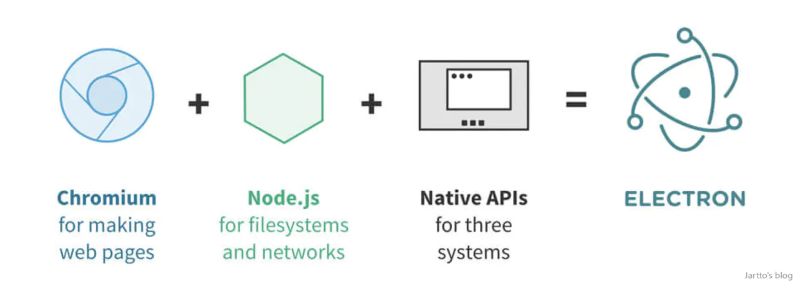
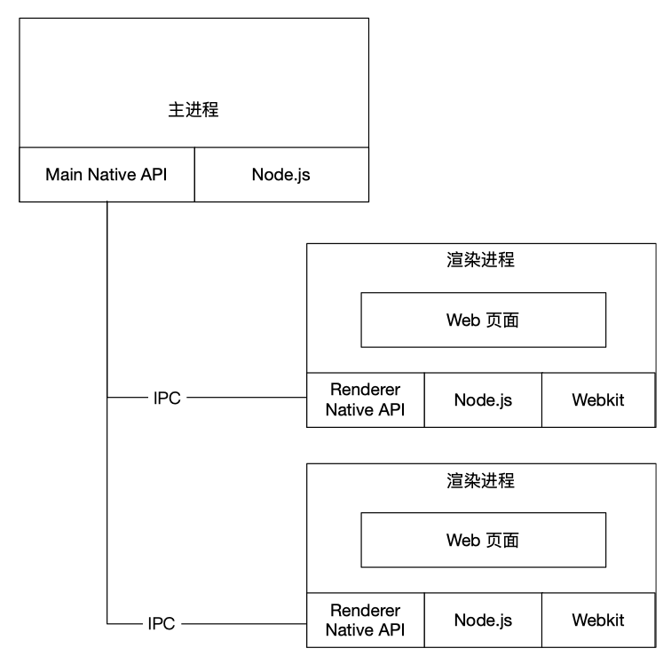

---
nav:
  title: 移动端
  path: /move
  order: 9
group:
  path: /Electron
  title: Electron
  order: 10
title: Electron 简介
order: 0
---


# Electron 简介

[Electron](https://github.com/electron/electron) 是由 Github 开发，用 HTML，CSS 和 JavaScript 来构建跨平台桌面应用程序的一个开源库。

Electron 通过将 Chromium 和 Node.js 合并到同一个运行时环境中，并将其打包为 Mac、Windows 和 Linux 系统下的应用来实现这一目的。



[Chromium](https://github.com/chromium/chromium) 是 Google 为发展 Chrome 浏览器而启动的开源项目，Chromium 相当于 Chrome 的工程版或称实验版（尽管 Chrome 自身也有 `β` 版阶段），新功能会率先在 Chromium 上实现，待验证后才会应用在 Chrome 上，故 Chrome 的功能会相对落后但较稳定。

能力点：

- Chromium：无需考虑浏览器兼容性、ES6/7、最新特性
- Node.js：文件读写、本地命令调用、扩展第三方 C++ 库
- Native API：系统通知、快捷键、CPU、硬件信息获取、离线在线检测

## 技术架构

下图是 Chromium 的架构图。主进程负责管理窗口、标签页、右键菜单等等，这一部分跟操作系统强相关。渲染进程负责网页的渲染，这一部分跟操作系统无关。


下图是 Electron 的架构图，可以看到他的核心工作就是把 Node.js 整合起来。



> 如何将 `Chromium` 和 `Node.js` 整合

技术难点：Node.js 事件循环基于 [libuv](https://github.com/libuv/libuv)，但 Chromium 基于 [message_pump](https://chromium.googlesource.com/chromium/chromium/+/refs/heads/main/base/message_pump.h)，而一个线程在同一时间只能运行一个事件循环。。

解决这个问题的主要思路有两种：

1. 将 Chromium 集成到 Node.js：用 `libuv` 实现 `message_pump`
2. 将 Node.js 集成到 Chromium

第一种方案，NW.js 就是这么做的。Electron 前期也是用 `libuv` 来实现 `message bump`，结果发现在渲染进程中 `libuv` 实现 `message bump` 比较容易，但是在主进程里却很麻烦，因为各个系统的 GUI 实现都不同，Mac 是 `NSRunLoop`，Linux 是 `glib`，不仅工程量十分浩大，而且一些边界情况处理起来也十分棘手。

后来作者另辟蹊径，再次进行尝试，用一个小间隔的定时器轮询 GUI 事件，发现 GUI 响应的非常慢，CPU 也爆表。

直到后来 `libuv` 引入了 `backend_fd` 的概念，相当于 `libuv` 轮询事件的文件描述符，这样就可以通过轮询 `backend_fd` 来得到 `libuv` 的一个新事件了。也就是第二种思路，将 Node.js 集成到 Chromium。


将 Node.js 集成到 Chromium 中的原理：

Electron 起了一个新的安全线程去轮询 `backend_fd`，当 `Node.js` 有一个新的事件后，通过 `PostTask` 转发到 Chromium 的事件循环中，这样就实现了 Electron 的事件融合。

## 进程

Electron 的进程分为 `主进程` 和 `渲染进程`。

我们先来看看 Electron 项目基本目录结构。

```bash
app
└─public
    └─index.html------入口文件
├─main.js-------------程序启动入口，主进程
├─ipc-----------------进程间模块
├─appNetwork----------应用通信模块
└─src-----------------窗口管理，渲染进程
    ├─components------通用组件模块
    ├─store-----------数据共享模块
    ├─statics---------静态资源模块
    └─pages-----------窗口业务模块
      ├─窗口A---------窗口
      └─窗口B---------窗口
```

`package.json` 中的 `main` 字段对应的文件的进程是 `主进程`。Electron 集成了 Chromium 来展示窗口界面，窗口中所看到的内容使用的都是 HTML 渲染出来的。 Chromium 本身是多进程渲染页面的架构（在默认情况下，Chromium 的默认策略是对每一个 Tab 选项卡新开一个进程，以确保每个页面是独立且互不影响的。避免一个页面的崩溃导致全部页面无法使用），所以 Electron 在展示窗口时，也会使用到 Chromium 的多进程架构。而这种多进程渲染架构在 Electron 中，就被称之为 **渲染进程（render process）**。

### 进程间通信

在 Electron 中，GUI 相关的模块（如 `dialog`、`menu` 等）仅在主进程可用，在渲染进程中不可用。为了在渲染进程中使用它们，需要使用 IPC 模块向主进程发送消息，下面是几种进程间通讯的方法。

#### ipcMain 和 ipcRenderer

从主进程到渲染进程的异步通信，也可以将消息从主进程发送到渲染进程。

在主进程中：

```js
const { ipcMain } = require('electron');

ipcMain.on('asynchronous-message', (event, arg) => {
  console.log(arg);
  // 'Ping'
  event.reply('asynchronous-reply', 'Pong');
});

ipcMain.on('synchronous-message', (event, arg) => {
  console.log(arg);
  // 'Ping'
  event.returnValue = 'Pong';
});
```

在渲染进程（网页）中：

```js
const { ipcRenderer } = require('electron');

console.log(ipcRenderer.sendSync('synchronous-message', 'ping'));
// 'Pong'

ipcRenderer.on('asynchronous-reply', (event, arg) => {
  console.log(arg);
  // 'Pong'
});

ipcRenderer.send('asynchronous-message', 'Ping');
```

#### remote 模块

`remote` 为渲染进程和主进程通信提供了一种简单的方法。你可以调用 `main` 进程对象的方法，而不必显式发送进程间消息。

例如：从渲染进程创建浏览器窗口

```js
const { BrowserWindow } = require('electron').remote;

let win = new BrowserWindow({ width: 800, height: 600 });

win.loadUrl('https://www.mrsingsing.com/');
```

⚠️ 注意： 反过来（如果需要从主进程访问渲染进程），可以使用 [webContents.executeJavascript](https://electronjs.org/docs/api/web-contents#contentsexecutejavascriptcode-usergesture-callback)

#### webContents

通过 `channel` 向渲染进程发送异步消息，可以发送任意参数。在内部，参数会被序列化为 JSON，因此参数对象上的函数和原型链不会被发送。

除了以上这些方法，也可以使用 `localStorage`、`sessionStorage` 等。

## 参考资料

- [Electron Internals: Message Loop Integration](https://www.electronjs.org/blog/electron-internals-node-integration)
- [（译）Electron 内部：整合 Message Loop](https://zhuanlan.zhihu.com/p/34544004)
- [The Chromium Projects: Multi-process Architecture](http://dev.chromium.org/developers/design-documents/multi-process-architecture)
- [蘑菇街前端团队：Electron 从零到一](https://juejin.im/post/6844903974894567432)
- [探索 NW.js 和 Electron 的内部（一）](https://zhuanlan.zhihu.com/p/34276309)
- [探索 NW.js 和 Electron 的内部（二）](https://zhuanlan.zhihu.com/p/34336363)
- [探索 NW.js 和 Electron 的内部（三）](
