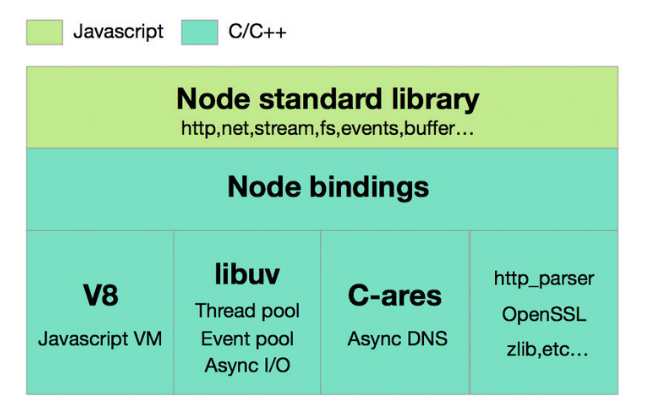

# 概述

Node.js 是一个开源、跨平台、JavaScript 运行时环境。

这个是 Node.js 的组成架构图：

Node.js 的结构大体分为三个部分：

1. **Node.js 标准库**：这部分由 JavaScript 编写。也就是平时我们经常 `require` 的各个模块，如：`http`、`fs`、`express`、`request` 等，这部分在源码的 [lib](https://github.com/nodejs/node/tree/master/lib) 目录下可以看到
2. **Node bingdings**：Node.js 程序的 `main` 函数入口，还有提供给 `lib` 模块的 C++ 类接口，这一层是 JavaScript 与底层 C/C++ 沟通的桥梁，由 C++编写，这部分在源码的 [src](https://github.com/nodejs/node/tree/master/src) 目录下可以看到
3. 最底层，支持 Node.js 运行的关键：
   - **V8 引擎**：用来解析、执行 JavaScript 代码的运行环境
   - **libuv**：提供最底层的 I/O 操作接口，包括文件异步 I/O 的线程池管理和网络的 I/O 操作，是整个异步 I/O 实现的核心。这部分由 C/C++编写，在源码的 [deps](https://github.com/nodejs/node/tree/master/deps) 目录下可以看到。

⚠️ **注意**：我们其实对 Node.js 的单线程一直由很深的误会。事实上，单线程指的是开发者编写的代码只能运行在一个线程单中（习惯称之为主线程），Node.js 并没有给 JavaScript 执行时创建新线程的能力，所以称为单线程，也就是所谓的主线程。其实，Node.js 中许多异步方法在具体的实现时（Node.js 底层封装了 libuv，它提供了线程池、事件池、异步 I/O 等模块功能，其完成了异步方法的具体实现），内部均采用了多线程机制。

## 特点

相较其他语言的特点。

- 异步 I/O
- 事件与回调函数
- 单线程
- 跨平台

## 应用场景

- I/O 密集型
- 是否不擅长 CPU 密集型业务
- 与一流系统和平共处
- 分布式应用

---

**参考资料：**

-[📖 Node 源码仓库](https://github.com/nodejs/node)
