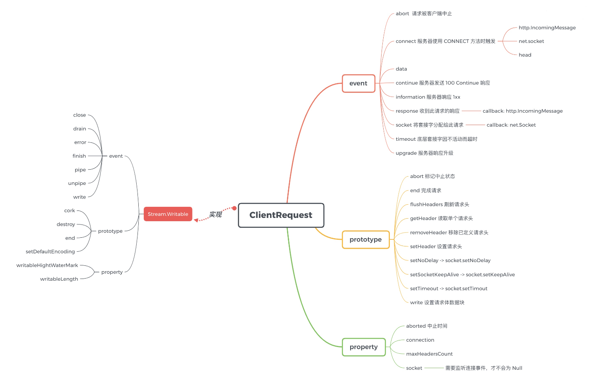

---
nav:
    title: Node系列
    path: /node
    order: 5
group:
    path: /http
    title: HTTP
    order: 15
title: HTTP ClientRequest
order: 3
---

# HTTP ClientRequest

`http.ClientRequest` 类继承自 `Stream.Writable` 表示已经产生并且正在进行的 HTTP 请求。该类实例由调用 `http.request()` 或 `http.get()` 时内部创建返回。

当设置好请求头和请求体后，调用 `client.end()` 方法完成发送请求。



## 监听事件

| 事件        | 描述                                                |
| ----------- | --------------------------------------------------- |
| abort       | 请求被客户端中止时触发（仅首次调用时触发）          |
| connect     | 每次服务器使用 `CONNECT` 方法响应请求时都会触发     |
| continue    | 服务器发送 `100 Continue` HTTP 响应时触发           |
| information | 服务器发送 `1xx` 响应时触发（不包括 `101 Upgrade`） |
| response    | 收到此请求的响应时触发（仅首次调用时触发）          |
| socket      | 将套接字分配给此请求后触发                          |
| timeout     | 底层套接字因不活动而超时时触发                      |
| upgrade     | 每次服务器响应升级请求时触发                        |

### response

当收到来自服务端的响应时触发，其实跟 `http.get(url, callback)` 中的回调是一样的。

```js
var http = require('http');

var url = 'http://id.qq.com/';

var client = http.get(url, function(res){
    console.log('1. response event');
});

client.on('response', function(res){
    console.log('2. response event');
});

client.end();
```

### socket

当给 Client 分配 Socket 的时候触发，如果熟悉 `net` 模块对这个事件应该不陌生。

### abort

当请求中断时触发，差异在于中断的发起方。

### continue

当收到服务端的响应 `100 Continue` 时触发。熟悉 HTTP 协议的同学应该对 `100 Continue` 有所了解。当客户端向服务端发送首部 `Expect: 100-continue` ，服务端经过一定的校验后，决定对客户端的后续请求放行，于是返回返回 `100 Continue`，知会客户端，可以继续发送数据。

### upgrade

同样是跟 HTTP 协议密切相关。当客户端向客户端发起请求时，可以在请求首部里声明 `'Connection': 'Upgrade'` ，以此要求服务端，将当前连接升级到新的协议。如果服务器同意，那么就升级协议继续通信。这里不打算展开太多细节，直接上官方文档的代码。

## 相关方法

### 完成请求

#### request.end

```js
request.end([data[, encoding]][, callback])
```

完成发送请求。如果部分请求主体还未发送，则将它们刷新到流中。如果请求被分块，则发送终止符 `'0\r\n\r\n'`。

如果指定了 `data`，则相当于调用 `request.write(data, encoding)` 之后再调用 `request.end(callback)`。

如果指定了 `callback`，则当请求流完成时将调用它。

#### request.finished

标记请求是否已经完成。

如果调用了 `request.end()`，则 `request.finished` 属性将为 `true`。 如果请求是通过 `http.get()` 发起的，则会自动调用 `request.end()`。

## 基本用法

### GET 请求

标准示例：模拟 GET 请求

```js
var http = require('http');
var options = {
  protocol: 'http:',
  hostname: 'www.google.com',
  port: '80',
  path: '/',
  method: 'GET',
};

var client = http.request(options, function(res) {
  var data = '';
  res.setEncoding('utf8');
  res.on('data', function(chunk) {
    data += chunk;
  });
  res.on('end', function() {
    console.log(data);
  });
});

client.end();
```

当然，也可以使用便捷方法 `http.get(options)` 实现。

```js
var http = require('http');

http.get('http://www.google.com/', function(res) {
  var data = '';
  res.setEncoding('utf8');
  res.on('data', function(chunk) {
    data += chunk;
  });
  res.on('end', function() {
    console.log(data);
  });
});
```

### POST 请求

在下面例子中，首先创建了个 HTTP 服务器，负责将客户端发送过来的数据回传。

接着，创建客户端 POST 请求，向服务端发送数据。需要注意的点有：

* `method` 指定为 POST。
* `headers` 里声明了 `content-type` 为 `application/x-www-form-urlencoded`。

数据发送前，用 `querystring.stringify(obj)` 对传输的对象进行了格式化。

