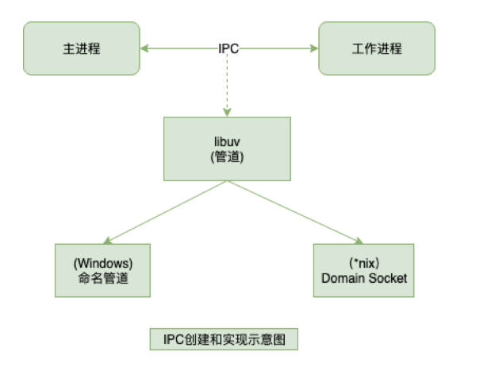
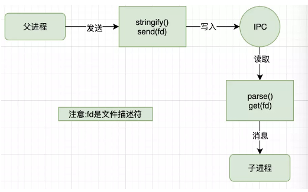
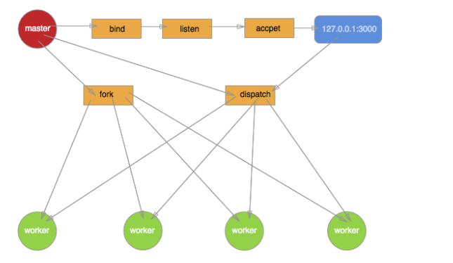

---
nav:
    title: Node系列
    path: /node
    order: 5
group:
  title: 进程
  path: /process
  order: 9
title: Node.js 中的进程与线程
order: 1
---

## Node.js 中的进程与线程

Node.js 是 JavaScript 在服务端的运行环境，构建在 Chrome 的 V8 引擎之上，基于事件驱动、非阻塞 I/O 模型，充分利用操作系统提供的异步 I/O 进行多任务的执行，适合于 I/O 密集型的应用场景，因为异步，程序无需阻塞等待结果返回，而是基于回调通知的机制，原本同步模式等待的时间，则可以用来处理其它任务，

> 科普：在 Web 服务器方面，著名的 Nginx 也是采用此模式（事件驱动），避免了多线程的线程创建、线程上下文切换的开销，Nginx 采用 C 语言进行编写，主要用来做高性能的 Web 服务器，不适合做业务。

Web 业务开发中，如果你有高并发应用场景那么 Node.js 会是你不错的选择。

- 在单核 CPU 系统之上我们采用 `单进程 + 单线程` 的模式来开发。
- 在多核 CPU 系统之上，可以通过 `child_process.fork` 开启多个进程（Node.js 在 v0.8 版本之后新增了 **Cluster** 模块来实现多进程架构） ，即 `多进程 + 单线程` 模式。

⚠️ **注意**：开启多进程不是为了解决高并发，主要是解决了单进程模式下 Node.js CPU 利用率不足的情况，充分利用多核 CPU 的性能。

### process 模块

Node.js 中的进程 `process` 是一个全局对象，无需 `require` 则可直接使用，给我们提供了当前进程中的相关信息。官方文档提供了详细的说明，感兴趣的可以亲自实践下 [process 模块](http://nodejs.cn/api/process.html) 文档。

在 Node.js 程序中直接打印 `process` 可以直接获取非常多有用的属性以及方法：

- 进程基础信息
- 进程 Usage
- 进程级事件
- 依赖模块/版本信息
- OS 基础信息
- 账户信息
- 信号收发
- 三个标准流

### child_process 模块

进程创建有多种方式，主要使用 Node.js 的另外两个模块：[child_process](./child-process.md) 模块和 [cluster](./cluster.md) 模块。

`child_process` 是 Node.js 的内置模块，用于创建子进程。

几个常用函数： 四种方式：

- `child_process.spawn`：适用于返回 **大量数据**，例如图像处理，二进制数据处理。
- `child_process.exec`：适用于 **小量数据**，`maxBuffer` 默认值为 200 \* 1024 超出这个默认值将会导致程序崩溃，数据量过大可采用 `spawn`。
- `child_process.execFile`：类似 `child_process.exec`，区别是不能通过 Shell 来执行，不支持像 I/O 重定向和文件查找这样的行为
- `child_process.fork`： 衍生新的进程，进程之间是相互独立的，每个进程都有自己的 V8 实例、内存，系统资源是有限的，不建议衍生太多的子进程出来，通常根据系统 **CPU 核心数**设置。

CPU 核心数这里特别说明下，`fork` 确实可以开启多个进程，但是并不建议衍生出来太多的进程，CPU 核心数的获取方式：

```js
const cpus = require('os').cpus();
```

这里 `cpus` 返回一个对象数组，包含所安装的每个 CPU 内核的信息，二者总和的数组。

假设主机装有两个 CPU，每个 CPU 有 4 个核，那么总核数就是 8。

### cluster 模块

Cluster 模块调用 `fork` 方法来创建子进程，该方法与 `child_process` 中的 `fork` 是同一个方法。

Cluster 模块采用的是经典的 **主从模型**，Cluster 会创建一个 `master`，然后根据你指定的数量复制出多个子进程，可以使用 `cluster.isMaster` 属性判断当前进程是 `master` 还是 `worker`（工作进程）。由 `master` 进程来管理所有的子进程，主进程不负责具体的任务处理，主要工作是 **负责调度和管理**。

```js
const cluster = require('cluster');
const http = require('http');
const numCPUs = require('os').cpus().length;

if (cluster.isMaster) {
  console.log(`Master ${process.pid} is running`);

  // Fork workers
  for (let i = 0; i < numCPUs; i++) {
    cluster.fork();
  }

  cluster.on('exit', (worker, code, signal) => {
    console.log(`worker ${worker.process.pid} died`);
  });
} else {
  // Wokers can share any TCP connection
  // In this case it is an HTTP server
  http
    .createServer((req, res) => {
      res.writeHead(200);
      res.end('Hello world\n');
    })
    .listen(8000);

  console.log(`Worker ${process.pid} started`);
}
```

Cluster 模块使用 **内置的负载均衡** 来更好地处理线程之间的压力，该负载均衡使用了 RoundRobin 算法（也被称之为循环算法）。当使用 RoundRobin 调度策略时，`master` 的 `accepts` 所有传入的连接请求，然后将相应的 TCP 请求处理发送给选中的工作进程（该方式仍然通过 IPC 来进行通信）。

> 如果多个 Node 进程监听同一个端口时会出现 `Error:listen EADDRIUNS` 的错误，而 `cluster` 模块为什么可以让多个子进程监听同一个端口呢？

原因是 `master` 进程内部启动了一个 TCP 服务器，而真正监听端口的只有这个服务器，当来自前端的请求触发服务器的 `connection` 事件后，`master` 会将对应的 `socket` 句柄发送给子进程。

### IPC 进程通信原理

前面讲解的无论是 `child_process` 模块，还是 `cluster` 模块，都需要主进程和工作进程之间的通信。通过 `fork` 或者其他 API，创建子进程之后，为了实现父子进程之间的通信，父子进程之间才能通过 `message` 方法和 `send` 方法传递信息。

IPC 这个词我想大家并不陌生，不管哪一种开发语言都会提到进程通信，都会提到它。IPC 的全称是 Inter-Process Communication，即 **进程间通信**。

它的目的是为了让 **不同的进程** 能够互相访问资源并进行协调工作。实现进程间通信的技术有很多，如 **命名管道**、**匿名管道**、**Socket**、**信号量**、**共享内存**、**消息队列** 等。

Node 中实现 IPC 通道是依赖于 `libuv`：

- Window 下由命名管道（name pipe）实现
- \*nix 系统则采用 Unix Domain Socket 实现

表现在应用层上的进程间通信只有简单的 `message` 事件和 `send` 方法，接口十分简洁和消息化。

<br />



<br />

IPC 通信管道是如何创建的：

<br />


<br />

父进程在实际创建子进程之前，会创建 IPC 通道并监听它，然后才真正的创建出子进程，这个进程中也会通过环境变量（`NODE_CHANNEL_FD`）告诉子进程这个 IPC 通道的文件描述符。子进程在启动的过程中，根据文件描述符去连接这个已存在的 IPC 通道，从而完成父子进程之间的连接。

#### 句柄传递

> 讲句柄之前，先想一个问题，`send` 句柄发送的时候，真的是将服务器对象发送给子进程？

**子进程对象 `send` 方法可以发送的句柄类型**

- `net.Socket`：TCP 套接字
- `net.Server`：TCP 服务器，任意建立在 TCP 服务上的应用层服务都可以享受它带来的好处
- `net.Native`：C++ 层面的 TCP 套接字或 IPC 管道
- `dgram.Socket`：UDP 套接字
- `dgram.Native`：C++ 层面的 UDP 套接字

**send 句柄发送原理分析**

结合句柄的发送与还原示意图更容易理解。



`send` 方法在将消息发送到 IPC 管道前，实际将消息组装成了两个对象，一个参数是 `hadler`，另一个是 `message`。

`message` 参数如下所示：

```js
{
  cmd: 'NODE_HANDLE',
  type: 'net.Server',
  msg: message
}
```

发送到 IPC 管道中的实际上是我们要发送的是 **句柄文件描述符**。这个 `message` 对象在写入到 IPC 管道时，也会通过 `JSON.stringfy()` 进行序列化。所以最终发送到 IPC 通道中的信息都是字符串，`send` 方法能发送消息和句柄并不意味着它能发送任何对象。

连接了 IPC 通道的子线程可以读取父进程发来的消息，将字符串通过 `JSON.parse()` 解析还原为对象后，才触发 message 事件将消息传递给应用层使用。在这个过程中，消息对象还要被进行过滤处理，`message.cmd` 的值如果以 `NODE_` 为前缀，它将响应一个内部事件 `internalMessage`，如果 `message.cmd` 值为 NODE_HANDLE，它将取出 `message.type` 值和得到的文件描述符一起还原出一个对应的对象。

以发送的 TCP 服务器句柄为例，子进程收到消息后的还原过程代码如下：

```js
function(message,handle,emit){
    var self = this;

    var server = new net.Server();
    server.listen(handler,function(){
      emit(server);
    });
}
```

这段还原代码，子进程根据 `message.type` 创建对应的 TCP 服务器对象，然后监听到文件描述符上。由于底层细节不被应用层感知，所以子进程中，开发者会有一种服务器对象就是从父进程中直接传递过来的错觉。

> Node 进程之间只有消息传递，不会真正的传递对象，这种错觉是抽象封装的结果。目前 Node 只支持我前面提到的几种句柄，并非任意类型的句柄都能在进程之间传递，除非它有完整的发送和还原的过程。

#### 多进程架构模型

以下通过代码实现多进程架构模型示例：



**主进程：**

`master.js` 主要处理以下逻辑：

- 创建一个 Server 并监听 3000 端口
- 根据系统 CPUS 开启多个子进程
- 通过子进程对象的 send 方法发送消息到子进程进行通信
- 在主进程中监听了子进程的变化，如果是自杀信号重新启动一个工作进程
- 主进程在监听到退出消息的时候，先退出子进程再退出主进程

```js
// master.js
const fork = require('child_process').fork;
const cpus = require('os').cpus();

const server = require('net').createServer();
server.listen(3000);
process.title = 'node-master';

const workers = {};
const createWorker = () => {
  const worker = fork('worker.js');
  worker.on('message', function (message) {
    if (massage.act === 'suicide') {
      createWorker();
    }
  });
  worker.on('exit', function (code, signal) {
    console.log('worker process exited, code: %s signal: %s', code, signal);
    delete workers[worker.pid];
  });
  worker.send('server', server);
  workers[worker.pid] = worker;
  console.log('worker process created, pid: %s ppid: %s', worker.pid, process.pid);
};

for (let i = 0; i < cpus.length; i++) {
  createWorker();
}

process.once('SIGINT', close.bind(this, 'SIGINT')); // kill(2) Ctrl-C
process.once('SIGQUIT', close.bind(this, 'SIGQUIT')); // kill(3) Ctrl-\
process.once('SIGTERM', close.bind(this, 'SIGTERM')); // kill(15) default
process.once('exit', close.bind(this));

function close(code) {
  console.log('进程退出', code);

  if (code !== 0) {
    for (let pid in workers) {
      console.log('master process exited, kill worker pid:', pid);
      workers[pid].kill['SIGINT'];
    }
  }

  process.exit(0);
}
```

**子进程：**

`worker.js` 子进程处理逻辑如下：

- 创建一个 Server 对象，注意这里最开始并没有监听 3000 端口
- 通过 message 事件接收主进程 send 方法发送的消息
- 监听 uncaughtException 事件，捕获未处理的异常，发送自杀信息由主进程重建进程，子进程在链接关闭之后退出

```js
// worker.js
const http = require('http');
const server = http.createServer((req, res) => {
  res.writeHead(200, {
    'Content-Type': 'text/plain',
  });
  res.end('I am worker, pid:' + process.pid + ', ppid:' + process.ppid);
  // 测试异常进程退出、重启
  throw new Error('worker process exception!');
});

let worker;
process.title = 'node-worker';
process.on('messsage', function (message, sendHandle) {
  if (message === 'server') {
    worker = sendHandle;
    worker.on('connection', function (socket) {
      server.emit('connection', socket);
    });
  }
});

process.on('uncaguhtException', function (err) {
  console.log(err);
  process.send({ act: 'suicide' });
  worker.close(function () {
    process.exit(1);
  });
});
```

#### 进程守护

> **什么是进程守护？**

每次启动 Node.js 程序都需要在命令窗口输入命令 `node app.js` 才能启动，但如果把命令窗口关闭则 Node.js 程序服务就会立刻断掉。除此之外，当我们这个 Node.js 服务意外奔溃了就不能自动重启进程了。这些现象都不是我们想要看到的，所以需要通过某些方式来守护这个开启的进程，执行 `node app.js` 开启一个服务进程之后，我们还可以在这个终端上做些别的事情，且不会相互影响，当出现问题可以自动重启。

> **如何实现进程守护**

这里只说一些第三方的进程守护框架，[pm2](https://pm2.keymetrics.io/) 和 [forever](https://github.com/foreversd/forever#readme)，它们都可以实现进程守护，底层也都是通过上面讲的 child_process 模块和 cluster 模块实现的，这里就不再提它们的原理。

#### Linux 关闭进程

通过 Linux 命令查找进程

```bash
ps aux | grep server
```

杀死进程

```bash
# 优雅的方式
# -l 选项告诉 kill 命令用好像启动进程的用户已注销的方式结束进程
# 当使用该选项时，kill 命令也试图杀死所留下的子进程
# 但这个命令也不是总能成功，或许仍然需要先手工杀死子进程，然后再杀死父进程
kill -l [PID]

# kill 命令用于终止进程
# -9 表示强迫进程立即停止
kill -9 [PID]

# 杀死同一进程内的所有进程
# 其允许指定要终止的进程名称，而非 PID
killall httpd
```

### 关于单线程的误区

```js
const http = require('http');

const server = http.createServer();

server.listen(3000, () => {
  process.title = '测试进程';
  console.log('进程ID：', process.pid);
});
```

上述代码中创建了 HTTP 服务，开启了一个进程，都说 Node.js 是单线程，所以 Node.js 启动后线程数应该为 1，但是为什么会开启了 7 个线程呢？

Node.js 中最核心的是 V8 引擎，会创建 V8 的实例，这个实例是多线程的。

- 主线程：编译、执行代码
- 编译/优化线程：在主线程执行的时候，可以优化代码
- 分析器线程：记录分析代码运行时间，为 Crankshaft 优化代码执行提供依据
- 垃圾回收的几个线程

所以大家常说的 Node.js 是单线程的指的是 JavaScript 的执行是单线程的（开发者编写的代码运行在单线程环境中），但 JavaScript 的宿主环境，无论是 Node.js 还是浏览器都是多线程的因为 libuv 中有线程池的概念存在的，libuv 会通过类似线程池的实现来模拟不同操作系统的异步调用，这对开发者来说是不可见的。

### 存在异步 I/O 占用额外线程

还是上面的例子，我们在定时器执行的同时，去读一个文件：

```js
const fs = require('fs');

setInterval(() => {
  console.log(new Date().getTime());
}, 3000);

fs.readFile('./index.html', () => {});
```

线程数量变成了 11 个，这是因为在 Node 中有一些 I/O 操作（DNS，FS）和一些 CPU 密集计算（Zlib，Crypto）会启用 Node 的线程池，而线程池默认大小为 **4**，因此线程数变成了 11。

我们可以手动更改线程池默认大小：

```js
process.env.UV_THREADPOOL_SIZE = 64;
```

码一行代码轻松把线程变成 71。

**Libuv**

Libuv 是一个跨平台的异步 I/O 库，它结合了 UNIX 下的 libev 和 Windows 下的 IOCP 的特性，最早由 Node 的作者开发，专门为 Node 提供多平台下的异步 I/O 支持。Libuv 本身是由 C++ 语言实现的，Node 中的非阻塞 I/O 以及事件循环的底层机制都是由 libuv 实现的。

在 Window 环境下，libuv 直接使用 Windows 的 IOCP 来实现异步 IO。在非 Windows 环境下，libuv 使用多线程来模拟异步 I/O。

⚠️ 注意下面我要说的话，Node 的异步调用是由 libuv 来支持的，以上面的读取文件的例子，读文件实质的系统调用是由 libuv 来完成的，Node 只是负责调用 libuv 的接口，等数据返回后再执行对应的回调方法。

### 线程创建方式

直到 Node 10.5.0 的发布，官方才给出了一个实验性质的模块 `worker_threads` 给 Node 提供真正的多线程能力。

```js
const {
  isMainThread,
  parentPort,
  workerData,
  threadId,
  MessageChannel,
  MessagePort,
  Worker,
} = require('worker_threads');

function mainThread() {
  for (let i = 0; i < 5; i++) {
    const worker = new Worker(__filename, { workerData: i });
    worker.on('exit', (code) => {
      console.log(`main: worker stopped with exit code ${code}`);
    });
    worker.on('message', (msg) => {
      console.log(`main: receive ${msg}`);
      worker.postMessage(msg + 1);
    });
  }
}

function workerThread() {
  console.log(`worker: workerDate ${workerData}`);
  parentPort.on('message', (msg) => {
    console.log(`worker: receive ${msg}`);
  }),
    parentPort.postMessage(workerData);
}

if (isMainThread) {
  mainThread();
} else {
  workerThread();
}
```

上述代码在主线程中开启五个子线程，并且主线程向子线程发送简单的消息。

由于 worker_thread 目前仍然处于实验阶段，所以启动时需要增加 `--experimental-worker flag`，运行后观察活动监视器，开启了 5 个子线程。

**worker_thread 模块**

[worker_thread 核心代码](https://github.com/nodejs/node/blob/master/lib/worker_threads.js)

worker_thread 模块中有 4 个对象和 2 个类，可以自己去看上面的源码。

- isMainThread: 是否是主线程，源码中是通过 threadId === 0 进行判断的。
- MessagePort: 用于线程之间的通信，继承自 EventEmitter。
- MessageChannel: 用于创建异步、双向通信的通道实例。
- threadId: 线程 ID。
- Worker: 用于在主线程中创建子线程。第一个参数为 filename，表示子线程执行的入口。
- parentPort: 在 worker 线程里是表示父进程的 MessagePort 类型的对象，在主线程里为 null
- workerData: 用于在主进程中向子进程传递数据（data 副本）

## 其他

操作进程对于服务端而言，好比 HTML 之于前端一样基础，想做服务端编程是不可能绕过 Unix/Linux 的。

在 Linux/Unix/Mac 系统中运行 `ps -ef` 命令可以看到当前系统中运行的进程，各个参数如下：

- UID：执行该进程的用户 ID
- PID：进程编号
- PPID：该进程的父进程编号
- C：该进程所在的 CPU 利用率
- STIME：进程执行时间
- TTY：进程相关的终端类型
- TIME：进程所占用的 CPU 时间
- CMD：创建该进程的指令

关于进程以及操作系统一些更深入细节推荐阅读 [《Unix 高级编程》](https://book.douban.com/subject/25900403/) 等书籍来了解。
