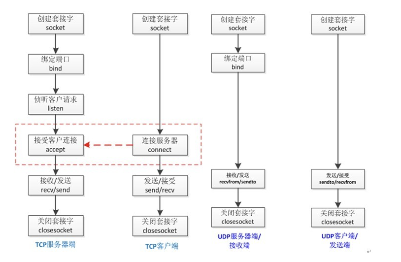
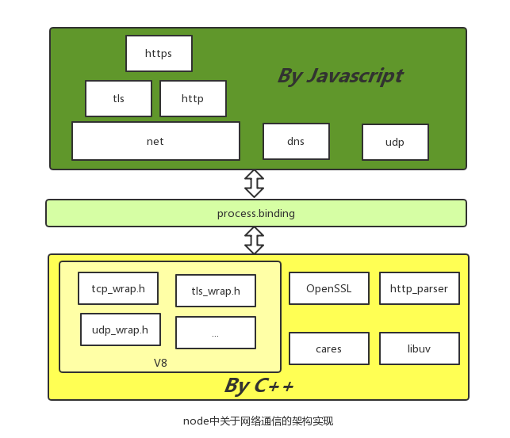

---
nav:
    title: Node系列
    path: /node
    order: 6
group:
    title: Socket
    path: /socket
    order: 11
title: Socket 套接字
order: 1
---

# Socket

Socket（套接字）源于 Unix，而 Unix 的基本哲学是**一切皆文件**，都可以用 `打开(open) -> 读/写(read/write) -> 关闭(close)` 模式来操作，Socket 也可以采用这种方法进行理解。

关于 Socket，可以总结如下几点:

- 可以实现底层通信，几乎所有的应用层都是通过 Socket 进行通信的，因此一切皆 Socket
- 对 TCP / IP 协议进行封装，便于应用层协议调用，属于二者之间的中间抽象层
- 各个语言都与相关实现，例如 C、C++、node
- TCP / IP 协议族中，传输层存在两种通用协议: TCP、UDP，两种协议不同，因为不同参数的 Socket 实现过程也不一样

## 通信架构

Node 中的模块，从两种语言实现角度来说，存在 JavaScript 和 C++ 两部分，通过 `process.binding` 来建立关系。

具体分析如下：

- 标准的 Node 核心模块有 net、dns、http、tls、https 等
- V8 是 Chrome 的内核，提供了 JavaScript 解释运行功能，里面包含 `tcp_wrap.h`、`udp_wrap.h`、`tls_wrap.h` 等
- OpenSSL 是基本的密码库，包括了 MD5、SHA1、RSA 等加密算法，构成了 Node 标准模块中的 crypto
- cares 模块用于 DNS 解析
- libuv 实现了跨平台的异步编程
- `http_parser` 用于 http 的解析

---

**参考资料：**

- [初步研究 Node 中的网络通信模块](https://zhenhua-lee.github.io/node/socket.html)
