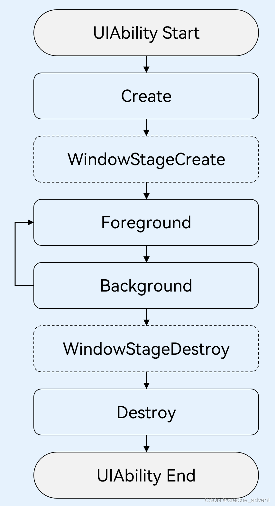

## 1、UIAbility概述

**UIAbility**

+   一种包含用户界面的应用组件
+   用于与用户进行交互
+   系统调度的单元
+   为应用提供窗口在其中绘制界同

**注：每一个UIAbility实例，都对应一个最近任务列表中的任务。**

一个应用可以有一个UIAbility也可以有多个UIAbility。

如一般的浏览器应用，通过一个UIAbility结合多页面的形式为用户提供服务

如一个聊天程序中添加一个与聊天不相关的“直播功能”场景，那可以把直播功能的内容独立为一个UIAbility,此时打开聊天应用的直播功能，这时要切换回聊天界面可通过最近任务列表切换实现（因为一个UIAbility实例，都对应一个最近任务列表中的任务）。

一个UIAbility可以对应多个页面，建议把一个独立的页面功能模块放到一个UIAbility中，以多页面的方式呈现。

## 2、UIAbility内页面的跳转和数据传递

页面间的导航可以通过页面路由router模块来实现 ，页面路由模块根据页面URL找到目标页面，从而实现页面的跳转。

### 2.1、页面跳转与参数接收

使用页面路由之前需要先导入router模块

```ts
import router from '@ohos.router';
```

#### 2.1.1、页面跳转

页面跳转的两种方式：

**方式一：router.pushUrl()**

这个方法有两个参数：

url：表示要跳转到的页面

mode：可以取值为router.RouterMode.Single(单例模式)、router.RouterMode.Standard(多例模式，默认)

在单例模式下，如果目标页面URL在页面栈中已经存在同URL页面，离栈顶最近的同URL页面会被移动到栈顶，移动后的页面为新建页，原来的页面仍然存在栈中，页面栈中的元数数量不变；如果目标页面URL在页面栈中不存在同URL页面，按多例模式跳转，页面栈的元素数量会加1。

注：当页面栈的的元素数量较大或者超过32时，可以通过调用router.clear()方法清除页面栈中的所有历史页面，仅保留当前页面作为栈顶页面。

```ts
router.pushUrl({
    url: 'pages/Second',
    params: 'Index页面传过来的参数',
},router.RouterMode.Single)
```

**方式二：router.replaceUrl()**

这个方法有两个参数：

url：表示要跳转到的页面

mode：可以取值为router.RouterMode.Single(单例模式)、router.RouterMode.Standard(多例模式，默认)

在单列模式下，如果目标页面的URL在页面栈中已经存在同URL页面，离栈顶最近同URL页面会被移动到栈顶，替换当前页面，并销毁被替换的当前页面，移动后的页面为新建页面，页面栈的元素数量会减1；如果目标页面的URL在页面栈中不存在同URL页面，按多例模式跳转，页面栈元素数量不变。

注意：由于当前页面被替换并销毁，把以跳转回去后就无法再回退回来了

```ts
router.replaceUrl({
    url: 'pages/Second',
    params: {
        src: 'Index页面传过来的参数',
    }
},router.RouterMode.Single)
```

#### 1.1.2、参数接收

跳转到的页面可以通过调用router.getParams()方法来接收传递过来的自定义参数

```ts
import router from '@ohos.router';

@Entry
@Component
struct Second {
    @State src: string = router.getParams()?.['src'];
    
    // 页面内容
}
```

### 2.2、页面返回和参数接收

#### 2.2.1、页面返回

当我们跳转到某个页面，在这个页面中完成了一些功能后，如果希望返回到上一个页面，可以调用router.back()来实现，或者是在调用router.back()方法时增加options参数时增加url参来指定返回的具体页面。

注意：调用router.back()返回的目标页面需要在页面栈中存在才能正常返回，如果是replaceUrl()方法跳转的由于当前页面被销毁所以无法返回，如果在返回前调用了router.clear()清空了页面栈则也无法返回。

```ts
// 返回上一页面
router.back();

// 返回到指定页面
router.back({url: 'pages/Index'});
```

在调用router.back()方法之前，可以先调用router.enableAlertBeforeBackPage()方法开启页面返回询问提示对话框，如果点击取消则不做返回。

注意：这个方法当前已不推荐使用，可能是因为这个操作可能打断用户的交互行为

```ts
// 这个方法已经不推荐使用了，可能是因为会影响到交互的流畅性
router.enableAlertBeforeBackPage({
    message:'确定返回吗？'
});
```

在页面返回时可以同时添加自定义参数

```ts
router.back({
    url: 'pages/Index',
    params: {
        src: 'Second页面传过来的参数',
    }
})
```

#### 2.2.2、接收返回参数

router.back()方法，不会新建页面，返回的是原来的页面，在原来页面中@State声明变量不会重复声明，也不会触发硕的aboutToAppear()生命周期回调，因此无法直接在变量声明以及页面aboutToAppear()生命周期回调中接收和解析返回的参数。

如果要接收参数可以在业务需要的位置进行参数解析。如：onPageShow()生命周期回调函数中进行解析。

```ts
import router from '@ohos.router';

@Entry
@Component
struct Index {
    @State src: string = '';

    onPageShow() {
        this.src = router.getParams()?.['src'];
    }

    // 页面内容
}
```

## 3、UIAbility生命周期

UIAbility生命周期有四个：**Create、Foreground、Background、Destroy**

窗口管理器在UIAbility中管理UI界面功能的两个生命周期回调：**WindowStageCreate、WindowStageDestroy**




**Create状态**

在UIAbility实例创建时触发，系统会调用onCreate回调。可以在其中做相关的初始化操作。

```ts
import UIAbility from '@ohos.app.ability.UIAbility';
import window from '@ohos.window';

export default class EntryAbility extends UIAbility {

    onCreate(want, launchParam) {
        // 应用初始化操作
        ...
    }
}
```

**WindowStageCreate**

UIAbility实例创建完成后，在进入Foreground之前，系统会创建一个WindowStage。

每一个UIAbility实例都对应持有一个WindowStage实例。

WindowStage为本地窗口管理器，用于管理窗口相关的内容，如界面相关的获焦/失焦、可见/不可见

可以在onWindowStageCreate回调中，设置UI页面加载、设置WindowStage的事件订阅

在onWindowStageCreate(windowStage)中通过loadContent接口设置应用要加载的页面。

```ts
import UIAbility from '@ohos.app.ability.UIAbility';
import window from '@ohos.window';

export default class EntryAbility extends UIAbility {

    ...
    
    onWindowStageCreate(windowStage: window.WindowStage) {
        // 设置UI页面加载
        // 设置WindowStage事件订阅
        ...
        
        windowStage.loadContent('pages/Index',(err, data) => {
            ...
        });
    }
    
    ...
}
```

**Foreground和Background状态**

上面的状态分别是UIAbility切换至前台或者切换至后台时触发。它们分别对应的是onForeground回调和onBackground回调。

**onForeground回调**：在UIAbility的UI页面可见之前，即UIAbility切换至前台时触。可以在其中申请系统需要的资源，或者重新申请在onBackground中释放的资源。

**onBackground回调**：在UIAbility的UI页面完全不可见之后，即UIAbility切换至后台时候触发。可以在onBackground回调中释放UI页面不可见时无用的资源，或者在此回调中执行较为耗时的操作，例如状态保存等。

```ts
import UIAbility from '@ohos.app.ability.UIAbility';
import window from '@ohos.window';

export default class EntryAbility extends UIAbility {

    ...
    
    onForeground() {
        // 申请需要的资源
        ...
    }

    onBackground() {
        // 释放资源，或者执行较为耗时的任务
        ...
    }
}
```

**WindowStageDestroy**

在UIAbility实例销毁之前，则会先进入onWindowStageDestroy回调，我们可以在该回调中释放UI页面资源。

```ts
import UIAbility from '@ohos.app.ability.UIAbility';
import window from '@ohos.window';

export default class EntryAbility extends UIAbility {

    ...
    
    onWindowStageDestroy() {
        // 释放UI页面资源
        ...
    }
}
```

**Destroy状态**

在UIAbility销毁时触发。可以在onDestroy回调中进行系统资源的释放、数据的保存等操作。

```ts
import UIAbility from '@ohos.app.ability.UIAbility';
import window from '@ohos.window';

export default class EntryAbility extends UIAbility {
    ...

    onDestroy() {
        // 系统资源的释放、数据的保存等
        ...
    }
}
```

## 4、UIAbility启动模式

UIAbility当前支持**single(单实例模式)、multiton(多实例模式)和specified(指定实例模式)**三种启动模式。

**singleton(单实例模式)**

访问应用后，回到桌面，再次打开应用，显不的仍是用户当前访问界面。

每次调用startAbility()方法时，如果应用进程中该类型的UIAbility实例已经存在，则复用系统中的UIAbility实例，系统中只存在唯一一个该UIAbility实例。

**singleton启动模式在module.json5文件中中“launchType”字段配置为“singleton”即可。**

**multiton(多实例模式)**

每次调用startAbility()方法时，都会在应用进程中创建一个该类型的UIAbility实例。即在最近任务列表中可以看到有多个该类型的UIAbility实例。

**multiton启动模式，在module.json5文件中的“launchType”字段配置为“multiton”即可。**

**specified(指定实例模式)**

在UIAbility实例创建之前，会先进入AbilityStage的onAcceptWant回调，在onAcceptWant回调中为每一个UIAbility实例创建一个Key，后续每次调用startAbility()方法创建该类型的UIAbility实例都会询问使用哪个Key对应的UIAbility实例来响应startAbility()请求。

specified启动模式使用步骤：

在module.json5文件中“launchType”字段配置为“specified”。

在调用startAbility()方法的want参数中，增加一个自定义参数来区别UIAbility实例。

```ts
// 在启动指定实例模式的UIAbility时，给每个UIAbility实例配置一个独立的key标识
function getInstance() {
    ...
}

let content:common.UIAbilityContext = '...'    // context为调用方UIAbility的UIAbilityContext
let want: Want = {
    deviceId: '', // deviceId为空表示本设备
    bundleName: 'com.example.myapplication',
    abilityName: 'SpecifiedAbility',
    moduleName: 'specified', // moduleName非必选
    parameters: { // 自定义信息
        instanceKey: getInstance(),
    },
}
context.startAbility(want).then(() => {
    ...
}).catch((err: BusinessError) => {
    ...
})
```

在被拉起方UIAbility对应的AbilityStage的onAcceptWant生命周期回调中，解析传入的want参数，获取“instanceKey”自定义参数。根据业务需要返回一个该UIAbility实例的字符串Key标识。如果之前启动过此Key标识的UIAbility，则会将之前的UIAbility拉回前台并获焦，而不创建新的实例，否则创建新的实例并启动

```ts
onAcceptWant(want: Want): string {
    // 在被启动方的AbilityStage中，针对启动模式为specified的UIAbility返回一个UIAbility实例对应的一个Key值
    // 当前示例指的是device Module的EntryAbility
   if (want.abilityName === 'MainAbility') {
        return `DeviceModule_MainAbilityInstance_${want.parameters.instanceKey}`;
    }
    return '';
}
```

## 5、案列实践（应用内页面跳转）

1、新增EmptyAbility，Stage模式项目：MyApplication1

2、在生成项目的Index页面（pages/Index.ets）修改为如下

```ts
import router from '@ohos.router';  // 实现页面的路由

@Entry
@Component
struct Index {
  @State src: string = ''
  // 页面显示时的回调函数
  onPageShow() {
    this.src = router.getParams()?.['src'];
  }

  build() {
    Row() {
      Column() {
        Text('index Page')
          .fontSize(50)
          .fontWeight(FontWeight.Bold)
        if(this.src) {
          Text(this.src)
        }
        Button('Next')
          .type(ButtonType.Capsule)
          .backgroundColor(Color.Blue)
          .fontColor(Color.White)
          .onClick(() => {

            // 跳转还可以使用replaceUrl,pushUrl是在页面栈中移动，replaceUrl是在页面栈移动后替换当前页面并销毁当前页面,这里back就回不来了
            router.pushUrl({
              url: 'pages/Second',
              params: {
                src: 'Index页面传递过来的数据',
              }
            },router.RouterMode.Single)
          })
      }
      .width('100%')
    }
    .height('100%')
  }
}
```

3、新增一个页面Second(pages/Second.ets)

```ts
import router from '@ohos.router';

@Entry
@Component
struct Second {
  // 获取页面传递过来的参数
  @State src: string = router.getParams()?.['src'];

  build() {
    Row() {
      Column() {
        Text('second Page')
          .fontSize(50)
          .fontWeight(FontWeight.Bold)
        Text(this.src)
        Button('back')
          .type(ButtonType.Capsule)
          .backgroundColor(Color.Blue)
          .fontColor(Color.White)
          .onClick(() => {
            // 这个方法已经不推荐使用了，可能是因为会影响到交互的流畅性
            router.enableAlertBeforeBackPage({
              message:'确定返回吗？'
            });

            // 这里的back方法也可以增加options参数指定跳转回的页面，返回时也可以带上参数返回
            // router.back();
            // router.back({url:'pages/Index'});
            router.back({
              url: 'pages/Index',
              params:{
                src: 'Second页面带过来的参数',
              }
            })
          })
      }
      .width('100%')
    }
    .height('100%')
  }
}
```

注意：新增第二个页面Second时我们在pages上右键选择New-->Page

如果我们不是新增的Page，而是直接新增一个ets的文件，则还需要对main\_pages.json文件的src下新增，"pages/Second"，这个文件所在目录是：src/main/resources/base/profile/main\_pages.json

## 6、UIAbility组件基本用法

基本用法包含：指定UIAbility的启动页面及获取UIAbility的上下文UIAbilityContext

### 6.1、指定UIAbility的启动页面

应用中的UIAbility在启动过程中，需要指定启动页面，否则应用启动后会因为没有默认加载页面而导致白屏。可以在UIAbility的`onWindowStageCreate()`生命周期回调中，通过[WindowStage](https://docs.openharmony.cn/pages/v4.0/zh-cn/application-dev/reference/apis/js-apis-window.md/#windowstage9 "WindowStage")对象的`loadContent()`方法设置启动页面。

```ts
import UIAbility from '@ohos.app.ability.UIAbility';
import window from '@ohos.window';

export default class EntryAbility extends UIAbility {
    onWindowStageCreate(windowStage: window.WindowStage){
        windowStage.loadContent('pages/Index',(err,data) => {
            // ...
        });
    }

    // ...
}
```

注意：在DevEco Studio中创建UIAbility中，这个UIAbility实例默认会加载Index页面，根据需要把Index页面路径替换为需要的页面路径就可以了。

### 6.2、获取UIAbility的上下文信息

UIAbility类拥有自身上下文信息，这个信息为UIAbilityContext类的实例。

UIAbilityContext类拥有abilityInfo、currentHapModuleInfo等属性

通过UIAbilityContext可以获取UIAbility的相关配置信息，如包代码路径、Bundle名称、Ability名称和应用程序需要的环境状态等属性信息，也可以操作UIAbility的实例方法（startAbility()、connectServiceExtensionAbility()、terminateSelf()...）

在UIAbility中可以通过this.context获取UIAbility实例的上下文信息

```ts
import UIAbility from '@ohos.app.ability.UIAbility';
import AbilityConstant from '@ohos.app.ability.AbilityConstant';
import Want from '@ohos.app.ability.Want';


export default class EntryAbility extends UIAbility {
    onCreate(want: Want, launchParam: AbilityConstant.LaunchParam) {
        // 获取UIAbility实例的上下文
        let context = this.context;
        ...
    }
}
```

在页面中获取UIAbility实例的上下文信息

```ts
import common from '@ohos.app.ability.common';
import Want from '@ohos.app.ability.Want';

@Entry
@Component
struct Index {
    private context = getContext(this) as common.UIAbilityContext;
    
    startAbilityTest() {
        let want: Want = {
            // Want参数信息
        };
        this.context.startAbility(want);
    }

    // 页面展示
    build() {
        ...
    }
}
```

```ts
import common from '@ohos.app.ability.common';
import Want from '@ohos.app.ability.Want';


@Entry
@Component
struct Index {
    startAbilityTest() {
        let context = getContext(this) as common.UIAbilityContext;
        let want: Want = {
            // want参数信息
        }
    }

    // 页面展示
    build() {
        ...
    }
}
```

## 7、UIAbility组件与UI的数据同步

基于当前应用模型，可以通过如下几种方式实现UIAbility组件与UI之间的数据同步。

+   使用EventHub进行数据通信
+   使用AppStorage/localStorage进行数据同步

### 7.1、EventHub进行数据通信

EventHub为UIAbility组件提供了事件机制，使它们能进行订阅、取消订阅和触发事件等数据通信能力。

在基类Context中，提供了EventHub对象，可用于在UIAbility组件实例内通信。

使用EventHub实现UIAbility与UI之间的数据通信需要先获取EventHub对象

在UIAbility中调用eventHub.on()方法注册一个自定义事件

```ts
import UIAbility from '@ohos.app.ability.UIAbility';
import hilog from '@ohos.hilog';
import window from '@ohos.window';

const TAG: string = '[MyApplication1].[Entry].[EntryAbility]';

export default class EntryAbility extends UIAbility {

  func1(data: string) {
    // 触发事件，完成相应的业务操作
    console.info(TAG, '1.' + JSON.stringify(data));
  }

  onCreate(want, launchParam) {
    hilog.info(0x0000, 'testTag', '%{public}s', 'Ability onCreate');
    // 获取eventHub
    let eventhub = this.context.eventHub;
    // 执行订阅操作
    eventhub.on('myEvent', this.func1);
    eventhub.on('myEvent', (data: string) => {
      // 触发事件，完成相应的业务操作
      console.info(TAG, ' 2. ' + JSON.stringify(data));
    });
  }

    // ...
}
```

在UI中通过eventHub.emit()方法触发这个事件，在触发这个事件的同时，根据需要传入参数信息。

```ts
import common from '@ohos.app.ability.common';
@Entry
@Component
struct EventPage {
  private context = getContext(this) as common.UIAbilityContext;

  eventHubFunc() {
    // 不带参数触发自定义“myEvent”事件
    this.context.eventHub.emit('myEvent');
    // 带1个参数触发自定义“myEvent”事件
    this.context.eventHub.emit('myEvent', 1);
    // 带2个参数触发自定义“myEvent”事件
    this.context.eventHub.emit('myEvent', 2, 'test');

  }

  // 页面展示
  build() {
    Row(){
      Column(){
        Button('按钮')
          .onClick(() => {
            this.eventHubFunc();
          })
        Button('关闭')
          .onClick(() => {
            this.context.eventHub.off('myEvent');
          })
      }.width('100%')
    }.height('100%')
  }
}
```

点击“按钮”可以看到打印的日志信息，如果点击“关闭”后，再点击“打印”则看不到打印的日志了，因为调用eventHub.off()方法就会取消指定事件的订阅。

### 7.2、使用AppStorage/LocalStorage进行数据同步

ArkUI提供了AppStorage和LocalStorage两种应用级别的状态管理方案，可用于实现应用级别和UIAbility级别的数据同步。使用这些方案可以方便地管理应用状态，提高应用性能和用户体验。其中，AppStorage是一个全局的状态管理器，适用于多个UIAbility共享同一状态数据的情况；而LocalStorage则是一个局部的状态管理器，适用于单个UIAbility内部使用的状态数据。

## 8、UIAbility组件间交互（设备内）

IAbility是系统调度的最小单元。在设备内的功能模块之间跳转时，会涉及到启动特定的UIAbility，该UIAbility可以是应用内的其他UIAbility，也可以是其他应用的UIAbility。

### 8.1、启动应用内的UIAbility

如：应用内有两个UIAbility:EntryAbility和FuncAbility（它们可以是同一个Module或者不同的Module）需要从EntryAbility的页面中启动FuncAbility。

1、在EntryAbility中，调用startAbility()方法启动UIAbility，want为UIAbility实例启动入口参数。

新建工程后会自动生成一个EntryAbility,此时可以在ets点击右键-->New-->Ability(Ability的名称为：FuncAbility)，此时会在ets目录下新增一个funcability目录，其中有一个ts文件FuncAbility.ts

在pages目录上点击右键-->New-->Page（Page的名称是：Func），此时会在pages目录中新增一个Func.ets

修改FuncAbility.ts中的onWindowStageCreate()方法，让其中loadContent()的页面参数是'pages/Func'

```ts
// Index.ets
import common from '@ohos.app.ability.common'
import Want from '@ohos.app.ability.Want'

@Entry
@Component
struct Index {
  @State message: string = 'Hello World'

  build() {
    Row() {
      Column() {
        Text(this.message)
          .fontSize(50)
          .fontWeight(FontWeight.Bold)
          .margin({bottom:15})
        Button('启动Func')
          .type(ButtonType.Capsule)
          .onClick(()=>{
            let context: common.UIAbilityContext = getContext(this) as common.UIAbilityContext;
            let want: Want = {
              deviceId: '', // 这里为空表示是本设备
              bundleName: 'com.xiaoixe', // 在app.json5中查找
              // moduleName: 'entry', // 在module.json5中查找，如果待启动的ability在同一个module则可以不写
              abilityName: 'FuncAbility', // 待启动ability的名称，在module.json5中查找
              parameters: {
                info: '来自己EntryAbility Index页面',
              },
            }
            context.startAbility(want).then(() => {
              console.info('启动FuncAbility成功。')
            }).catch((error:Error) => {
              console.error(`启动FuncAbility失败。${error.name} - ${error.message}`)
            })
          })
      }
      .width('100%')
    }
    .height('100%')
  }
}
```

```ts
// Func.ets
@Entry
@Component
struct Func {
  @State message: string = 'Func'

  build() {
    Row() {
      Column() {
        Text(this.message)
          .fontSize(50)
          .fontWeight(FontWeight.Bold)
      }
      .width('100%')
    }
    .height('100%')
  }
}
```

2、在FuncAbility的onCreate()或者是onNewWant()生命周期回调函数中接收EntryAbility传递过来的参数

```ts
// FuncAbility.ts
import UIAbility from '@ohos.app.ability.UIAbility';
import hilog from '@ohos.hilog';
import window from '@ohos.window';

export default class FuncAbility extends UIAbility {
  onCreate(want, launchParam) {
    hilog.info(0x0000, 'testTag', '%{public}s', 'Ability onCreate');
    // 接收调用方传递过来的参数
    let  funcAbilityWant = want;
    let info = funcAbilityWant?.parameters?.info;
    console.log(info);
  }

    // ...
}
```

3、在FuncAbility业务完成后，如果需要停止当前UIAbility实例，在FuncAbility中通过调用terminateSelf()方法来实现

```ts
// Func.ets
import common from '@ohos.app.ability.common'
@Entry
@Component
struct Func {
  @State message: string = 'Func'

  build() {
    Row() {
      Column() {
        Text(this.message)
          .fontSize(50)
          .fontWeight(FontWeight.Bold)
          .margin({bottom:15})
        Button('停止当前Ability')
          .type(ButtonType.Capsule)
          .onClick(()=>{
            let context: common.UIAbilityContext = getContext(this) as common.UIAbilityContext;
            context.terminateSelf((err) => {
              if(err.code) {
                console.error(`停止失败 ${err.code} - ${err.message}`)
              }
            })
          })
      }
      .width('100%')
    }
    .height('100%')
  }
}
```

### 8.2、启动应用内UIAbility并获取返回结果

当EntryAbility启动FuncAbility时，在FuncAbility完成相关业务后，可以把结果返回给调用方。

1、在EntryAbility中的Index的页面中修改启以FuncAbility的方法，使用startAbilityForResult()方法，它会等待被启动的FuncAbility结束返回数据

```ts
// Index.ets
import common from '@ohos.app.ability.common'
import Want from '@ohos.app.ability.Want'


@Entry
@Component
struct Index {
  @State message: string = 'Hello World'

  build() {
    Row() {
      Column() {
        Text(this.message)
          .fontSize(50)
          .fontWeight(FontWeight.Bold)
          .margin({bottom:15})
        Button('启动Func')
          .type(ButtonType.Capsule)
          .onClick(()=>{
            let context: common.UIAbilityContext = getContext(this) as common.UIAbilityContext;
            let want: Want = {
              deviceId: '', // 这里为空表示是本设备
              bundleName: 'com.xiaoixe', // 在app.json5中查找
              // moduleName: 'entry', // 在module.json5中查找，如果待启动的ability在同一个module则可以不写
              abilityName: 'FuncAbility', // 待启动ability的名称，在module.json5中查找
              parameters: {
                info: '来自己EntryAbility Index页面',
              },
            }
            // 启动ability
            // context.startAbility(want).then(() => {
            //   console.info('启动FuncAbility成功。')
            // }).catch((err:Error) => {
            //   console.error(`启动FuncAbility失败。${err.name} - ${err.message}`)
            // })
            // 启动ability并获取返回结果
            context.startAbilityForResult(want).then((data) => {
              console.info('启动FuncAbility成功, ' + JSON.stringify(data));
            }).catch((err:Error)=>{
              console.error(`启动FuncAbility失败。${err.name} - ${err.message}`);
            })
          })
      }
      .width('100%')
    }
    .height('100%')
  }
}
```

2、在FuncAbility中完成相关的操作，在停止Ability时构造相应的返回数据(common.AbilityResult类型数据结构)，并调用terminateSelfWithResult返回数据

```ts
// Func.ets
import common from '@ohos.app.ability.common'
@Entry
@Component
struct Func {
  @State message: string = 'Func'

  build() {
    Row() {
      Column() {
        Text(this.message)
          .fontSize(50)
          .fontWeight(FontWeight.Bold)
          .margin({bottom:15})
        Button('停止当前Ability')
          .type(ButtonType.Capsule)
          .onClick(()=>{
            let context: common.UIAbilityContext = getContext(this) as common.UIAbilityContext;
            // 停止Ability
            // context.terminateSelf((err) => {
            //   if(err.code) {
            //     console.error(`停止失败 ${err.code} - ${err.message}`)
            //   }
            // })
            // 停止并返回结果给到启动它的Ability
            let abilityResult: common.AbilityResult = {
              resultCode: 200,
              want: {
                bundleName: 'com.xiaoixe',
                moduleName: 'entry',
                abilityName: 'FuncAbility',
                parameters: {
                  info:'来自FuncAbility Func页面'
                },
              },
            }
            context.terminateSelfWithResult(abilityResult,(err) => {
              console.error(`停止失败 ${err.code} - ${err.message}`)
            })
          })
      }
      .width('100%')
    }
    .height('100%')
  }
}
```

### 8.3、启动其他应用的UIAbility

启动UIAbility有显式Want启动和隐式want启动两种方式

**显示Want启动**：启动一个确定应用的UIAbility，在want参数中需要设置这个应用bundleName和abilityName，当需要拉起某个明确的UIAbility时，通常使用显式want启动方式

**隐式Want启动**：根据条件由用户选择启动哪一个UIAbility,也就是不明确指出要启动哪个UIAbility(abilityName参数未设置)，在调用startAbility()方法时，其入参want中指定了一系列的entities字段（表示目标UIAbility额外的类别信息，如浏览器、视频播放器）和actions字段（表示要执行的通用操作，如查看、分享、应用详情等）等参数信息，然后由系统去分析want，并帮助找到合适的UIAbility来启动。当需要拉起其他应用的UIAbility时，开发者通常不知道用户设备中应用的安装情况，也无法确定目标应用的bundleName和abilityName，通常使用隐式Want启动方式。
