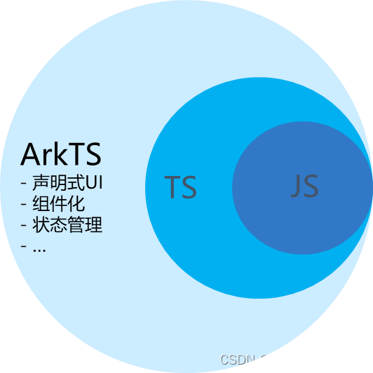

## 1、编程语言介绍

`ArkTS` 是HarmonyOS主推的应用开发语言，它是在TypeScript语言的基础之上，匹配ArkUI框架，扩展了声明式UI、状态管理等相应的能力，让开发者以更简洁、更自然的方式开发跨端应用。

ArkTS、TypeScript和JavaScript之间的关系：

官方提供的关系图示如下：



+   JavaScript：网络高级脚本语言，广泛用于Web应用，为网页提供各式各样的交互功能。
+   TypeScript：JavaScript的一个超集，在JavaScript的基础上添加了静态类型定义，是一个开源的编程语言。
+   ArkTS：兼容TypeScript语言，拓展了声明式UI、状态管理、并发任务等能力。

如上所示，在学习ArkTS之前有必须先了解TypeScript的相关知识

## 2、TypeScript的基础入门

### 2.1、基础类型

TypeScript支持基础数据类型：布尔、数组、字符串等。

#### 2.1.1、布尔值

使用boolean表示，它可以赋值为true和false

```ts
let isShow: boolean = false;
```

#### 2.1.2、数字

在TypeScript中所有数字都是浮点数，类型为number，支持十进制、二进制，八进制、十六进制表示。

```ts
// 十进制表示
let decNum: number = 2023;
// 二进制表示
let binaryNum: number = 0b11111100111;
// 八进制表示
let octalNum: number = 0o3747;
// 十六进制表示
let hexNum: number = 0x7e7;
```

#### 2.1.3、字符串

使用string表示文字数据类型，可以使用"(双引号)或者'(单引号)来表示

```ts
let username: string = "张三";
name = "李四";
name = '王五'
```

#### 2.1.3、数组

在TypeScript中，有两种方式来定义数组。方式一：在元素类型后加上\[\]，表示此类型的数组；方式二：使用数组泛型，Array<元素类型>

```ts
// 在元素类型后加上[]表示数组
let arr1: number[] = [1,2,3];
// 使用数组泛型
let arr2: Array<number> = [4,5,6];
```

#### 2.1.4、元组

元组用来表示一个已知元素数量和对应元素类型的数组。与数组不同的是，它的每一个元素类型可以不一样；元素的数量是固定的。

```ts
// 定义一个元组，它有两个元素组成，第一个元素类型是string,第二个元素类型是number
let t: [string, number];
// 对元组进行赋值
t = ['张三', 100];    // 这个是正确的，元素个数与各元素的类型都匹配
// t = [100, '李四'];    // 这个是错误的，元素个数匹配，但是各元素的类型不匹配
```

#### 2.1.5、枚举

enum类型是对JavaScript标准类型的一个补充。使用枚举类型可以为一组数值赋予友好的名字。

```ts
enum Color {Red, Green, Blue};
let c1: Color = Color.Blue;
```

#### 2.1.6、Unknown

有时在编程阶段还不清楚变量类型，在这种情况下可以为变量指定类型为unknown

```ts
let x: unknown = 100;
x = '张三';
x = true;
```

#### 2.1.7、Void

当一个函数没有返回值时，可以把返回值类型置为void

```ts
function test(): void {
    console.log('This is a log');
}
```

#### 2.1.8、Null和Undefined

在TypeScript中，undefined和null分别有对应的类型为undefined和null

```ts
let u: undefined = undefined;
let n: null = null;
```

#### 2.1.8、联合类型

联合类型表示变量可以取多种指定类型中的任一种

```ts
let myvar: string | number;
myvar = '张三';
myvar = 100;
```

### 2.2、条件语句

通过条件语句可以实现基于不同的条件来执行不同的动作。

#### 2.2.1、if语句

if语句由一个布尔表达式后跟一个或多个语句组成

```ts
var num: number = 5;
if (num > 0) {
    console.log('数字大于0');
}
```

#### 2.2.2、if...else语句

一个if语句后跟一个可选的else语句，else语句在表达式为false时执行

```ts
var num: number = 10;
if(num % 2 == 0) {
    console.log('偶数');
} else {
    console.log('奇数');
}
```

#### 2.2.3、if...else if...else语句

多路条件判断时常常使用这种结构进行判断

```ts
var num:number = 0;
if(num > 0) {
    console.log(num + ' 是正数');
} else if(num < 0) {
    console.log(num + ' 是负数');
} else {
    console.log(num + ' 是0');
}
```

#### 2.2.4、switch...case语句

一个switch语句允许测试一个变量等于多值的情况，每个值称为一个case，被测试的值会对每个case进行检查。

注意：1、每个case 后都有一个break，它不是必须的，但是可以防止测试的穿透；2、最后加了一个default，不是必须的，但是可以防止未考虑到的case

```ts
let grade: string = 'A';

// 对grade进行测试
switch(grade) {
    case 'A': {
        console.log('优秀');
        break;
    }
    case 'B': {
        console.log('良好');
        break;
    }
    case 'C': {
        console.log('及格');
        break;
    }
    case 'D': {
        console.log('不及格');
        break;
    }
    default: {
        console.log('输入不正确');
        break;
    }
}
```

### 2.3、函数

函数用为封装一组一起执行一个任务的语句，在需要执行这一组语句的地方直接调用封装数的函数即可，函数的声明告诉编译器函数的名称、返回类型和参数。在TypeScript中可以创建有名函数和匿名函数。

```ts
// 有名函数
function add(x, y) {
    return x + y;
}

// 匿名函数,把函数赋给一个变量，调用时直接调用这个变量
let myAdd = function(x, y) {
    return x + y;
};
```

#### 2.3.1、为函数定义类型

为了保证输入的准确可以为函数添加类型信息

```ts
// 有名函数
function add(x: number, y: number): number {
    return x + y;
}

// 匿名函数,把函数赋给一个变量，调用时直接调用这个变量
let myAdd = function(x: number, y: number): number {
    return x + y;
};
```

#### 2.3.2、可选参数

在TypeScript中可以在参数后添加?实现可选参数功能，在调用函数时对于可选参数是不要求一定传入值的

```ts
// lastName这个参数是一个可选参数
function getFullName(firstName: string, lastName?: string) {
    if(lastName)
        return firstName + ' ' + lastName;
    else
        return firstName;
}

let result1 = getFullName("张");
let result2 = getFullName('李','四');
```

#### 2.3.3、剩余参数

剩余参数会被当作个数不限的可选参数，它可以一个都没有也可以有多个，使用...进行定义

```ts
function getHobbies(name: string, ...hobbies: stirng[]) {
    return name + '=>' + hobbies.join(' '); 
}

let hobbies = getHobbies("张三", '篮球', '足球', '音乐');
```

#### 2.3.4、箭头函数

ES6版本的TypeScript提供了箭头函数，它是定义匿名函数的简写语法，用于函数表达式，省略了function关键字

格式如下：

```ts
([param1,param2,...,paramn]) => {
    // 代码块
}
```

其中括号内是函数的入参，可以是0个或多个参数，箭头（=>）后是函数的函数体，可以把箭头函数赋值给一个变量，在调用箭头函数时直接调用这个变量就可以了。

```ts
let arrowFun = ([param1,param2,...,paramn]) => {
    // 代码块
}

// 用箭头函数
arrowFun([param1,param2,...,paramn])
```

### 2.4、类

TypeScript支持基于类的面向对象编程方式，定义类的关键字是class，后面跟上类名。

类描述了所创建对象的共同属性和方法。

#### 2.4.1、类的定义

```ts
// 定义类 Person
class Person {
    // 属性name,age
    private name: string
    private age: number

    // 构造方法
    constructor(name: string, age: number) {
        this.name = name;
        this.age = age;
    }

    // 成员方法
    public getPersonInfo(): string {
        return `My name is ${this.name} and age is ${this.age}`;
    }

}
```

上面就定义好了一个类，接下来可以通过上面定义好的Person类来实例化具体的对象

```ts
// 实例化对象
let person1 = new Person('张三', 18);

// 通过实例化的对象调用类中的成员方法
person1.getPersonInfo();
```

#### 2.4.2、继承

继承就是子类继承父类的特征和行为，使得子类具有父类相同的行为。TypeScript中允许使用继承来扩展现有的类，对应的关键字为extends。

一般来说相对具象化的类可以继承自一个更加抽象的类，这个抽象的共性就直接从父类中获取，不需要再重写一遍。

```ts
// 定义一个类Employee继承自Person
class Employee extends Person {
    
    private department: string

    constructor(name: string, age: number, department: string) {
        super(name, age);
        this.department = department;
    }

    public getElployeeInfo(): string {
        return this.getPersonInfo() + ` and work in ${this.department}`;
    }
}
```

### 2.5、模块

随着应用越来越大，通常需要把代码拆分为多个文件，也就是模块（module）。

模块可以相互加载，并且可以使用export和import来交换功能，从一个模块调用另一个模块的函数。

两个模块之间的关系通过在文件级别上使用import和export建立的。模块里面的变量、函数和类等在模块外部是不可见的，除非明确地使用 export 导出它们。类似地，我们必须通过 import 导入其他模块导出的变量、函数、类等。

#### 2.5.1、导出

```ts
export class NewsData {
    title: stirng;
    content: string;
    imagesUrl: Array<NewsFile>;
    source: string;

    constructor(title: string, content: string, imagesUrl: Array<NewsFile>, source: string) {
        this.title = title;
        this.content = content;
        this.imagesUrl = imagesUrl;
        this.source = source;
    }
}
```

#### 2.5.2、导入

使用import导入其它模块中导出的内容

```ts
import {NewsData} from '../model/NewsData';
```

### 2.6、迭代器

当一个对象实现了Symbol.iterator属性时，我们认为它是可迭代的。一些内置的类型如Array，Map，Set，String，Int32Array，Uint32Array等都具有可迭代性。

#### 2.6.1、for...of语句

for..of会遍历可迭代的对象，调用对象上的Symbol.iterator方法。

```ts
let arr = [1,"string",false];

for(let entry of arr) {
    console.log(entry);
}
```

#### 2.6.2、for...in语句

for...in语句迭代的是对象的键，而for...of迭代的是对象的值

```ts
let list = [1,2,3];

// for...in 迭代的是对象的键
for(let i in list) {
    console.log(i);    // 0,1,2
}
```
