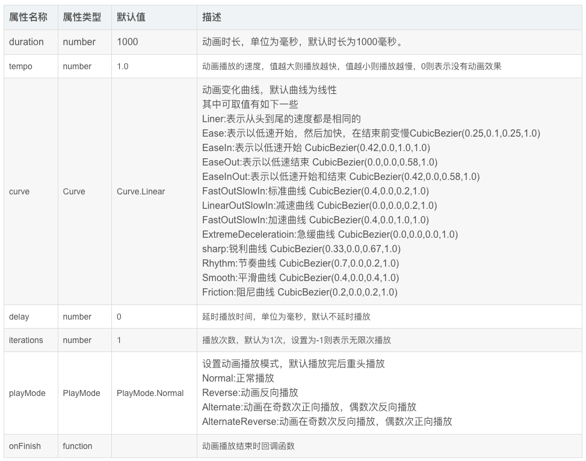

## 1、动画概述

在ArkUI中，产生动画的方式是改变组件属性值并且指定相关的动画参数。当属性值发生变化后，按照动画参数，从原来的状态过渡到新的状态，就形成一个动画。

动画的相关参数如下：



## 2、动画分类

+   从页面分类分为：页面内的动画（在一个页面中即可发生的动画）、页面间的动画（两个页面跳转时会产生的动画）
+   按基础能力可分为：属性动画、显示动画、转场动画

## 3、页面内动画

### 3.1、布局更新动画

显示动画（animateTo）和属性动画（animation）是ArkUI提供的最基础和常用的动画功能。

在布局属性（如：尺寸、位置等属性）发生变化时，可以通过属性动画或显示动画，按动画参数过渡到新的布局参数状态。

<table><tbody><tr><td><strong>动画类型</strong></td><td><strong>特点</strong></td></tr><tr><td>显示动画（函数）</td><td>闭包内的变化均会触发动画，包含币数据变化引起的组件增删</td></tr><tr><td>属性动画（属性方法）</td><td>属性变化自动触发动画。（注意：属性值的变化需要加在animation属性之前）</td></tr></tbody></table>

#### 3.1.1、使用显示动画产生布局更新动画

显示动画的接口：

```ts
animateTo(value:AnimateParam, event: () => void): void
```

第一个参数：指定动画参数

第二个参数：动画的闭包函数

#### 3.1.2、相关实例

```ts
@Entry
@Component
struct LayoutChangeTest {
  @State itemAlign: HorizontalAlign = HorizontalAlign.Start;
  aligns: HorizontalAlign[] = [HorizontalAlign.Start, HorizontalAlign.Center, HorizontalAlign.End];
  alignIndex: number = 0;

  build() {
    Column({space: 30}) {
      Text('修改布局位置')
        .fontSize(30)
        .margin({top: 100})

      Column({space: 25}) {
        Text("JavaScript").fontSize(20).fontWeight(FontWeight.Bolder).fontColor('#4e72b8')
        Text("TypeScript").fontSize(20).fontWeight(FontWeight.Bolder).fontColor('#6d8346')
        Text("ArkTS").fontSize(20).fontWeight(FontWeight.Bolder).fontColor('#69541b')
      }
      .margin(20)
      .alignItems(this.itemAlign)
      .justifyContent(FlexAlign.Center)
      .borderWidth(2)
      .width('90%')
      .height(200)

      Button('Click', {type: ButtonType.Capsule, stateEffect: true})
        .fontSize(18)
        .fontWeight(FontWeight.Bold)
        .width('50%')
        .onClick(() => {
          // 显示动画
          animateTo({duration: 1000, curve: Curve.EaseInOut},() => {
            // 在闭包函数中修改上方元素的对齐方式
            this.alignIndex = (this.alignIndex + 1) % this.aligns.length;
            this.itemAlign = this.aligns[this.alignIndex];
          })
        })
    }
    .width('100%')
    .height('100%')
  }
}
```

```ts
@Entry
@Component
struct LayoutChangeTest1 {
  @State mySize: number = 30;
  // 标志位，用来控制组件的大小
  @State flag: boolean = false;

  build() {
    Column( {space: 20} ) {
      Text('HarmonyOS')
        .fontColor('#ed1941')
        .fontWeight(FontWeight.Bolder)
        .fontSize(this.mySize)
        .margin(10)

      Button(this.flag ? '缩小': '放大', {type:ButtonType.Capsule,stateEffect:true})
        .width('50%')
        .fontSize(16)
        .onClick(() => {
          animateTo({duration: 1000, curve: Curve.Ease}, () => {
            if(this.flag) {
              this.mySize = 30;
            } else {
              this.mySize = 50;
            }
            this.flag = !this.flag;
          });
        })
    }
    .justifyContent(FlexAlign.Center)
    .width('100%')
    .height('100%')
  }
}
```

```ts
@Entry
@Component
struct LayoutPage2 {
  @State message: string = '改变角度';
  @State rotateAngle: number = 0;
  @State flag: boolean = false;
  
  build() {
    Row() {
      Column({space:15}) {
        Text(this.message)
          .fontSize(50)
          .fontWeight(FontWeight.Bold)
        Image($r('app.media.image2'))
          .width(200)
          .height(200)
          .borderRadius(100)
          .rotate({
            x: 1,
            y: 1,
            z: 1,
            angle: this.rotateAngle
          })
          .onClick(() => {
            animateTo({},() => {
              if(this.flag) {
                this.rotateAngle = 0;
              } else {
                this.rotateAngle = 640;
              }
              this.flag = !this.flag;
            })
          })
      }
      .width('100%')
    }
    .height('100%')
  }
}
```

#### 3.1.3、使用属性动画产生布局更新动画

显示动画是把要执行动画的属性修改放在闭包函烽中触发动画，而属性动画则不需要使用闭包，只需要把animation属性加在要做属性动画的组件的属性后就可以了。

属性动画接口

```ts
animation(value: AnimateParam)
```

参数value表示动画参数。

注意：如果希望某个属性值的变化而产生动画，则需要此属性需要加到animation属性之前。

#### 3.1.4、相关案例

```ts
@Entry
@Component
struct AttrAnimationTest1 {
  @State widthSize: number = 250;
  @State heightSize: number = 100;
  @State rotateAngle: number = 0;
  @State flag: boolean = true;

  build() {
    Row() {
      Column() {
        Button('change size')
          .onClick(() => {
            if(this.flag) {
              this.widthSize = 150;
              this.heightSize = 50;
            } else {
              this.widthSize = 250;
              this.heightSize = 100;
            }
            this.flag = !this.flag;
          })
          .margin(30)
          .width(this.widthSize)
          .animation({
            duration:2000,
            iterations:3,
            curve: Curve.Linear,
            playMode: PlayMode.Alternate
          })
          .height(this.heightSize)
          .animation({
            duration:1000,
            curve: Curve.Linear,
            playMode:PlayMode.Alternate
          })

        Button('change rotate angle')
          .onClick(() => {
            this.rotateAngle = 90;
          })
          .margin(50)
          .rotate({angle: this.rotateAngle})
          .animation({
            duration:1000,
            iterations:-1,
            curve:Curve.Linear,
            playMode:PlayMode.Alternate
          })

      }
      .width('100%')
    }
    .height('100%')
  }
}
```

## 4、组件内转场动画

组件内转场动画使用transition,它常见的用法如下：

1、if/else产生组件内转场动画

2、ForEach产生组件内转场动画

组件的插入、删除过程即为组件本身的转场过程，通过设置转场动画，可以定义组件出现、消失的效果。

组件内转场动画的接口：

```ts
transition(value: TransitionOptions)
```

transition函数的入参为组件内转场的效果，可以定义平移、透明度、旋转、缩放这几种转场样式的单个或者组件的转场效果，必须和animateTo一起使用才能产生组件转场效果。

**transition常见用法**

1、组件的插入、删除使用同一个动画效果

```ts
Button()
 .transition({type: TransitionType.All, scale: {x: 0, y: 0 }})
```

当type属性为TransitionType.All时，表示指定转场动效生效在组件的所有变化（插入和删除）场景，这个时候删除动画和插入动画是相反的过程。

 2、组件的插入、删除使用不同的动画效果

```ts
Button()
 .transition({type: TransitionType.Insert, translate: {x: 200, y: -200}, opacity: 0})
 .transition({type: TransitionType.Delete, rotate: {x: 0, y:0, z：1, angle:360}})
```

3、只定义组件的插入或删除其中一种动画效果

```ts
Button()
 .transition({type: TransitionType.Delete, translate:{x: 200,y: -200}})
```

### 4.1、if/else产生组件内转场动画

```ts
@Entry
@Component
struct TransitionTest {
  @State flag: boolean = true;

  build() {
    Row() {
      Column() {
        Button(this.flag ? '隐藏' : '显示')
          .fontSize(20)
          .margin(30)
          .width(150)
          .height(50)
          .onClick(() => {
            // 在animateTo闭包中改变flag的值
            animateTo({duration:1500},() => {
              // 点击按钮来控制标记变量
              this.flag = !this.flag;
            })
          })
        if(this.flag) {
          Text('HarmonyOS')
            .fontSize(20)
            .fontWeight(FontWeight.Bolder)
            .fontColor('#008792')
            // 添加转场效果
            .transition({type: TransitionType.Insert, translate: {x: 200, y: -200}})
            .transition({type: TransitionType.Delete, opacity: 0, scale: {x: 0, y: 0}})
        }

      }
      .width('100%')
    }
    .height('100%')
  }
}
```

### 4.2、ForEach产生组件内转场动画

ForEach可通过控制数组中的元素个数，来控制组件的插入和删除。通过ForEach来产生组件内转场动画，需要两个条件

1、ForEach里的组件配置了transition效果

2、在animateTo的闭包中控制组件的插入或删除，即控制数组的元素添加和删除

```ts
@Entry
@Component
struct ForEachTest {

  @State books :string[] = [
    '《JavaScript学习指南》',
    '《TypeScript从入门到精通》',
    '《ArkTS学习手册》',
    '《JAVA核心卷》'
  ];

  num: number = 0;

  build() {
    Column({space: 10}) {
      Column(){
        // 注意 这里遍历的key是使用item,所以我们在添加时加上一个num来区分内容
        ForEach(this.books, (item) => {
          Text(item).textStyle()
            .transition({type: TransitionType.All, translate: {x: 200},scale:{x:0,y:0}})
        },item => JSON.stringify(item))
      }.columnStyle()

      Button('头部添加元素').ButtonStyle('#375830', () => {
        animateTo({}, () => {
          this.num++;
          this.books.unshift(`《C语言编程思想》_${this.num}`)
        })
      })

      Button('头部删除元素').ButtonStyle('#b64533', () => {
        animateTo({}, () => {
          this.books.shift()
        })
      })

      Button('尾部删除元素').ButtonStyle('#dea32c', () => {
        animateTo({}, () => {
          this.books.pop()
        })
      })

    }
    .width('100%')
    .height('100%')
  }
}

// 相关样式信息
@Extend(Text) function textStyle() {
  .width(300)
  .height(60)
  .fontSize(18)
  .margin({top: 3})
  .backgroundColor('#d3c6a6')
  .textAlign(TextAlign.Start)
  .fontColor(Color.White)
}

@Extend(Column) function columnStyle() {
  .margin(10)
  .justifyContent(FlexAlign.Start)
  .alignItems(HorizontalAlign.Center)
  .width('90%')
  .height('50%')
}

@Extend(Button) function ButtonStyle(color: string|Color, click: Function) {
  .width(200)
  .height(50)
  .fontSize(18)
  .backgroundColor(color)
  .onClick(() => {
    // click代表的就是调用时具体传入进来的函数
    click()
  })
}
```

## 5、页面间的动画

### 5.1、共享元素转场动画

在不同的页面间，有使用相同元素的场景，可以使用共享元素转场动画衔接。

共享元素转场的接口：

```ts
sharedTransition(id: string, options?: sharedTransitionOptions)
```

其中id为指定共享元素的组件id

根据sharedTransitionOptions中的type参数，可以把共享元素转场分为Exchange类型和Static类型。

#### 5.1.1、Exchange类型

交换型共享元素转场。

这种类共享元素转场适用于两个页面间相同元素的衔接，从起始页共享元素的位置、大小过渡到目标页面的共享元素的位置、大小。

当不指定type时，默认就是Exchange类型的共享转场

使用Exchange类型的共享转场时，共享元素转场的动画参数由目标页面options中的动画参数决定。

#### 5.1.2、Static类型的共享元素转场

静态类型的共享元素转场常用于页面跳转时，标题的渐入淡出，只需要在一个页面中有Static的共享元素，不能在两个页面中出现相同id的Static类型的共享元素。

```ts
// Src.ets
import router from '@ohos.router';

@Entry
@Component
struct Src {

  build() {
    Column({ space: 30 }) {
      // Exchange类型共享转场
      Image($r('app.media.image2'))
        .width(50)
        .height(50)
        .opacity(.3)
        .borderRadius(75)
        .sharedTransition('img1',{
          duration: 1000,
          curve: Curve.Linear
        })
    }
    .onClick(() => {
      // 路由跳转
      router.pushUrl({url: "pages/SharedTransition/Dest"});
    })
    .padding(10)
    .width('100%')
    .height('100%')
    .alignItems(HorizontalAlign.Start)
  }
}
```

```ts
// Dest.ets
import router from '@ohos.router';

@Entry
@Component
struct Dest {

  build() {
    Column({ space: 30 }) {
      // 配置Static类型的共享元素转场
      Text('鸿蒙系统')
        .fontSize(20)
        .fontColor('#6d8346')
        .opacity(.8)
        .fontWeight(FontWeight.Bold)
        .margin({ top: 10 })
        .sharedTransition('text',{
          duration: 500,
          curve: Curve.Linear,
          type: SharedTransitionEffectType.Static
        })
      // 配置Exchange类型的共享元素转场，id是'img1'
      Image($r('app.media.image2'))
        .width(150)
        .height(150).opacity(1)
        .borderRadius(75)
        .sharedTransition('img1',{
          duration: 500,
          curve: Curve.Linear
        })
    }
    .width('100%')
    .height('100%')
    .alignItems(HorizontalAlign.Center)
    .onClick(() => {
      // 返回
      router.back();
    })
  }
}
```

### 5.2、页面转场动画

两个页面之间发生跳转，一个页面消失，另一个页面出现，此时可以配置各自页面的页面转场参数实现自定义的页面转场效果。

页面转场效果写在pageTransition函数中，通过PageTransitionEnter和PageTransitionExit来指定页面进入和退出时的动画效果。

pageTransitionEnter接口

```ts
PageTransitionEnter({type?: RouteType, duration?: number, curve?: Curve | string, delay: number})
```

pageTransitionEnter提供了onEnter接口进行自定义页面入场动画的回调

pageTransitionExit接口

```ts
PageTransitionExit({type?: RouteType, duration?: number, curve?: Curve | string, delay: number})
```

pageTransitionExit提供了onExit接口进行自定义页面退场动画的回调

关于RouteType表示路由生效类型，从一个页面到另一个页面有两人种方式，一种是push，一种是back(pop出栈)，那么type参数就可以由开发者指定哪种类型的路由来定义转场效果。对于push和back会有一些区别，比如A页面到B页面push时，A页面是退场，B页面是入场，如果B页面back回A页面则是B页面退场，A页面入场。

type参数的默认值是RouteType.None表示对页面的push和pop都生效

如果我们把页面转场时长设置为0(duration参数值为0)则无页面转场动画。

```ts
// Src2.est
import router from '@ohos.router';

@Entry
@Component
struct Src2 {
  @State scale1: number = 1;
  @State opacity1: number = 1;

  build() {
    Column({ space: 30}) {
      Text('Src2...')
        .fontSize(30)
        .opacity(this.opacity1)
        .margin({bottom: 15})
      Image($r('app.media.image2'))
        .width(300)
        .height(400)
        .scale({x: this.scale1})
        .opacity(this.opacity1)
    }
    .width('100%')
    .height('100%')
    .onClick(() => {
      router.pushUrl({
        url: "pages/pageTransition/Dest2"
      })
    })
  }

  pageTransition() {
    PageTransitionEnter({}).onEnter((type: RouteType, progress: number) => {
      this.scale1 = 1;
      this.opacity1 = progress;
    })

    PageTransitionExit({}).onExit((type: RouteType, progress: number) => {
      this.scale1 = 1 - progress;;
      this.opacity1 = 1 - progress;
    })
  }

}
```

```ts
// Dest2.est
import router from '@ohos.router';

@Entry
@Component
struct Dest2 {
  @State scale1: number = 1;
  @State opacity1: number = 1;

  build() {
    Column(){
      Text('Dest2...')
        .fontSize(30)
        .opacity(this.opacity1)
        .margin({bottom: 15})
      Image($r('app.media.image2'))
        .width(300)
        .height(400)
        .scale({y: this.scale1})
        .opacity(this.opacity1)
    }
    .width('100%')
    .height('100%')
   .onClick(() => {
     router.back()
   })
  }

  pageTransition() {
    PageTransitionEnter({}).onEnter((type: RouteType, progress: number) => {
      this.scale1 = progress;
      this.opacity1 = progress;
    })

    PageTransitionExit({}).onExit((type: RouteType, progress: number) => {
      this.scale1 = 1 - progress;
      this.opacity1 = 1 - progress;
    })

  }

}
```

## 6、网络

### 6.1、基于web组件构建网络应用

当需要访问网络资源的时候需要在module.json5中申请网络访问权限：ohos.permission.INTERNET

Web组件的使用只需要ArkTS文件中创建一个Web组件，传入两个参数就可以了。

src：指定了网页的路径

controller：组件控制器，绑定web组件，实现对web组件的控制

```ts
import webview from '@ohos.web.webview';

@Entry
@Component
struct WebComp {

  controller: WebviewController = new webview.WebviewController();

  build() {
    Row() {
      Column() {
        Web({
          src: 'https://www.baidu.com',
          controller: this.controller
        })
      }
      .width('100%')
    }
    .height('100%')
  }
}
```

#### 6.1.1、本地网页加载

首先本的网页文件可以放在rawfile目录中

```html
<!-- index.html -->
<!doctype html>
<html lang="en">
<head>
    <meta charset="UTF-8">
    <meta name="viewport"
          content="width=device-width, user-scalable=no, initial-scale=1.0, maximum-scale=1.0, minimum-scale=1.0">
    <meta http-equiv="X-UA-Compatible" content="ie=edge">
    <title>Document</title>
</head>
<body>
    <div>
        <h2>加载本地网页</h2>
    </div>
    <div>
        
    </div>

</body>
</html>
```

在ets文件中对这个页面进行加载展示

```ts
import webview from '@ohos.web.webview'

@Entry
@Component
struct WebComp2 {
  controller: WebviewController = new webview.WebviewController();

  build() {
    Row() {
      Column() {
        Web({
          src: $rawfile('index.html'),
          controller: this.controller
        })
      }
      .width('100%')
    }
    .height('100%')
  }
}
```

#### 6.1.2、网页缩放能力

有时网页可能不能与手机屏幕很好地适配，需要对其缩放才能有更好的效果，这个时候可以给Web组件zoomAccess属性，它用来设置是否支持手势 进行缩放，默认是行缩放的。

```ts
Web({ src:'www.example.com', controller:this.controller })
    .zoomAccess(true)
```

还可以使用zoom(factor: number)方法用于设置网站的缩放比例，参数factor表示缩放的倍数

```ts
import webview from '@ohos.web.webview';

@Entry
@Component
struct WebComp {

  controller: WebviewController = new webview.WebviewController();

  build() {
    Row() {
      Column() {
        Button('zoom+')
          .width('50%')
          .onClick(() => {
            this.controller.zoom(1.5)
          })
        Web({
          src: 'https://www.baidu.com',
          controller: this.controller
        })

      }
      .width('100%')
    }
    .height('100%')
  }
}
```

上面示例每次点击zoom+时会把页面放大为原来的1.5倍。

#### 6.1.3、文本缩放

如果需要对文本进行缩放，可以使用textZoomAtio(textZoomAtio: number)方法

textZoomRatio为缩放的百分比，默认值是100，表示100%

```ts
import webview from '@ohos.web.webview';

@Entry
@Component
struct WebComp {
  @State textZoom: number = 100;
  controller: WebviewController = new webview.WebviewController();

  build() {
    Row() {
      Column() {
        Button('文大文本+')
          .width('50%')
          .onClick(() => {
            this.textZoom += 20;
          })
        Web({
          src: 'https://www.baidu.com',
          controller: this.controller
        }).textZoomRatio(this.textZoom)

      }
      .width('100%')
    }
    .height('100%')
  }
}
```

#### 6.1.4、web组件事件

web组件还提供了处理JavaScript的对话框、网页加载进度及各种通知与请求事件的方法。

onProgressChange        监听网页的加载进度

onPageEnd                在网页加载完时触发此回调

onConfirm                在网页触发confirm告警弹窗时触发回调

```html
<!-- index.html -->
<!doctype html>
<html lang="en">
<head>
    <meta charset="UTF-8">
    <meta name="viewport"
          content="width=device-width, user-scalable=no, initial-scale=1.0, maximum-scale=1.0, minimum-scale=1.0">
    <meta http-equiv="X-UA-Compatible" content="ie=edge">
    <title>Document</title>
</head>
<body>
    <div>
        <h2>加载本地网页</h2>
    </div>
    <div>
        
    </div>

    <script type="text/javascript">
        confirm('confirm message from html')
    </script>
</body>
</html>
```

```ts
import webview from '@ohos.web.webview'

@Entry
@Component
struct WebComp2 {
  controller: WebviewController = new webview.WebviewController();

  build() {
    Row() {
      Column() {
        Web({
          src: $rawfile('index.html'),
          controller: this.controller
        })
          .zoomAccess(true)
          .onConfirm((event) =>{
            AlertDialog.show({
              title: 'title',
              message: event.message,
              confirm: {
                value: 'onAlert',
                action: () => {
                  event.result.handleConfirm();
                }
              },
              cancel: () => {
                event.result.handleCancel();
              }
            })
            return true;
          })
      }
      .width('100%')
    }
    .height('100%')
  }
}
```

#### 6.1.5、web与javascript的交互

 web组件可以调用JavaScript方法，JavaScript也可以调用Web组件里的方法

**web组件启用javascript**

如果在web组件中运行javascript，则必须要在web组件中启用javascript功能，默认情况下是不可以执行javascript的。

```ts
Web({src: 'https://www.example.com', controller: this.controller})
 .javaScriptAccess(true)
```

 **web组件调用JS方法**

比如在web组件onPageEnd事件中添加runJavaScript方法，这个事件是在网页加载完成时的回调，runJavaScript方法可以执行HTML中的JavaScript脚本

```html
<!-- index.html -->
<!doctype html>
<html lang="en">
<head>
    <meta charset="UTF-8">
    <meta name="viewport"
          content="width=device-width, user-scalable=no, initial-scale=1.0, maximum-scale=1.0, minimum-scale=1.0">
    <meta http-equiv="X-UA-Compatible" content="ie=edge">
    <title>Document</title>
</head>
<body>
    <div>
        <h2>加载本地网页</h2>
    </div>
    <div>
        
    </div>

    <script type="text/javascript">
        function test() {
            return "this value is from index.html"
        }
    </script>
</body>
</html>
```

```ts
import webview from '@ohos.web.webview'

@Entry
@Component
struct WebComp2 {
  controller: WebviewController = new webview.WebviewController();
  @State webResult: string = ''

  build() {
    Row() {
      Column() {
        Text(this.webResult)
          .fontSize(16)
        Web({
          src: $rawfile('index.html'),
          controller: this.controller
        })
          .zoomAccess(true)
          .javaScriptAccess(true)
          .onPageEnd(e => {
            this.controller.runJavaScript('test()',(err,data)=>{
              if(!err) {
                this.webResult = data;
              }
            })
            // promise化的写法
            // let promise = this.controller.runJavaScript('test()');
            // promise.then((data) => {
            //   this.webResult = data;
            // })
          })
      }
      .width('100%')
    }
    .height('100%')
  }
}
```

 **js调用web组件方法**

开发者者使用Web组件把应用侧代码注册到前端页面中，注册完成之后，前端页面中使用注册的对象名称就可以调用应用侧的函数，从而实现前端页面中调用应用侧的方法。

注册应用侧代码有两种方式：

一种是Web组件初始化使用调用，使用javaScriptProxy()接口。

一种是在Web组件初始化完成后调用，使用registerJavaScriptProxy()接口

javaScriptProxy()接口使用示例：

```ts
// xxx.ets
import web_webview from '@ohos.web.webview';

@Entry
@Component
struct WebComponent {
  webviewController: web_webview.WebviewController = new web_webview.WebviewController();
  // 声明需要注册的对象
  testObj = {
    test: () => {
      return 'ArkTS Hello World!';
    }
  }

  build() {
    Column() {
      // web组件加载本地index.html页面
      Web({ src: $rawfile('index.html'), controller: this.webviewController})
        // 将对象注入到web端
        .javaScriptProxy({
          object: this.testObj,
          name: "testObjName",
          methodList: ["test"],
          controller: this.webviewController
        })
    }
  }
}
```

应用侧使用registerJavaScriptProxy()接口注册

```ts
// xxx.ets
import web_webview from '@ohos.web.webview';

@Entry
@Component
struct Index {
  webviewController: web_webview.WebviewController = new web_webview.WebviewController();
  testObj = {
    test: (data) => {
      return "ArkUI Web Component";
    },
    toString: () => {
      console.info('Web Component toString');
    }
  }

  build() {
    Column() {
      Button('refresh')
        .onClick(() => {
          try {
            this.webviewController.refresh();
          } catch (error) {
            console.error(`Errorcode: ${error.code}, Message: ${error.message}`);
          }
        })
      Button('Register JavaScript To Window')
        .onClick(() => {
          try {
            this.webviewController.registerJavaScriptProxy(this.testObj, "testObjName", ["test", "toString"]);
          } catch (error) {
            console.error(`Errorcode: ${error.code}, Message: ${error.message}`);
          }
        })
      Web({ src: $rawfile('index.html'), controller: this.webviewController })
    }
  }
}
```

注意： 使用registerJavaScriptProxy()接口注册方法时，注册后需调用refresh()接口生效

```html
<!-- index.html -->
<!DOCTYPE html>
<html>
<body>
<button type="button" onclick="callArkTS()">Click Me!</button>
<p id="demo"></p>
<script>
    function callArkTS() {
        let str = objName.test();
        document.getElementById("demo").innerHTML = str;
        console.info('ArkTS Hello World! :' + str);
    }
</script>
</body>
</html>
```

####  6.1.6、页面导航处理

当使用浏览器浏览网页时，可以执行返回、前进、刷新等操作，Web组件也支持这些操作。可以使用backward()回到上一个页面，forward()前进一个页面，refresh()刷新页面，clearHistory()清除历史记录。

```ts
import webview from '@ohos.web.webview'
@Entry
@Component
struct NavigatorTest {
  controller: WebviewController = new webview.WebviewController();

  build() {
    Row() {
      Column() {
        Row() {
          Button('前进').onClick(() => {
            this.controller.forward();
          })
          Button('后退').onClick(() => {
            this.controller.backward();
          })
          Button('刷新').onClick(() => {
            this.controller.refresh();
          })
          Button('停止').onClick(() => {
            this.controller.stop();
          })
          Button('清理历史').onClick(() => {
            this.controller.stop();
          })
        }
        .padding(5)
        .backgroundColor(Color.Gray)
        .width('100%')
        .justifyContent(FlexAlign.SpaceAround)

        Web({src: 'https://www.baidu.com', controller: this.controller})
      }
      .width('100%')
    }
    .height('100%')
  }
}
```

###   
6.2、HTTP数据请求

#### 6.2.1、简单说明

开发的应用需要通过HTTP发送一个数据请求，支持的情求方式有：GET、POST、OPTIONS、HEAD、PUT、DELETE、TRACE、CONNECT

HTTP数据请求功能主要由http模块提供，这个功能也需要申请ohos.permission.INTERNET权限

相关的方法说明：

<table><tbody><tr><td><strong>方法名称</strong></td><td><strong>功能描述</strong></td></tr><tr><td>createHttp()</td><td>创建一个http请求</td></tr><tr><td>request()</td><td>根据URL地址，发起HTTP网络请求</td></tr><tr><td>destroy()</td><td>中断请求任务</td></tr><tr><td>on(type: 'headerReceive')</td><td>订阅HTTP Response&nbsp;Header&nbsp;事件</td></tr><tr><td>off(type: 'headerReceive')</td><td>取消订阅HTTP Response Header事件</td></tr></tbody></table>

#### 6.2.2、开发步骤

1、导入http模块

```ts
import http from '@ohos.net.http';
```

2、创建HTTP请求实例，生成HttpRequest对象

```ts
let httpRequest = http.createHttp();
```

注意：每一个httpRequest对应一个http请求任务，不可以复用

3、订阅HTTP响应头（可选）

4、根据URL地址，发起HTTP网络请求

5、处理HTTP响应头和HTTP网络请求的返回结果（可选）

```ts
// 导入模块
import http from '@ohos.net.http';

@Entry
@Component
struct HttpTest {
  url: string = 'https://mock.apifox.com/m1/3690335-0-default/getHot'
  @State titles: string[] = [];

  build() {
    Row() {
      Column() {
        Button('获取数据')
          .width('50%')
          .margin({bottom: 15})
          .onClick(() => {
            // 创建请求对象
            let httpReq = http.createHttp();
            // 发起请求
            httpReq.request(this.url,{
              method: http.RequestMethod.GET,
            }, (err,data) => {
              // 处理结果
              if(!err) {
                // this.titles = JSON.parse(`${data}`).values['title']
                let arr = JSON.parse(`${data.result}`).values
                for(let item of arr) {
                  this.titles.push(item['title']);
                }
              }
            })
          })
        ForEach(this.titles, (item) =>{
          Text(item)
            .fontSize(14)
            .margin({bottom:5})
        },item => item)
      }
      .width('100%')
    }
    .height('100%')
  }
}
```

#### 6.2.3、http请求-Promise方式

使用这种方式是为了避免地狱回调的问题。

```ts
// 导入模块
import http from '@ohos.net.http';

@Entry
@Component
struct HttpPromiseTest {

  url: string = 'https://mock.apifox.com/m1/3690335-0-default/getHot'
  @State titles: string[] = [];

  build() {
    Row() {
      Column() {
        Button('获取数据')
          .width('50%')
          .margin({bottom: 15})
          .onClick(() => {
            // 创建http请求
            let httpReq = http.createHttp();
            // 发起请求
            let promise = httpReq.request(this.url)
            promise.then((data) => {
              let arr = JSON.parse(`${data.result}`).values
              for(let item of arr) {
                this.titles.push(item['title']);
              }
            })
          })

        ForEach(this.titles, (item) =>{
          Text(item)
            .fontSize(14)
            .margin({bottom:5})
        },item => item)
      }
      .width('100%')
    }
    .height('100%')
  }
}
```
