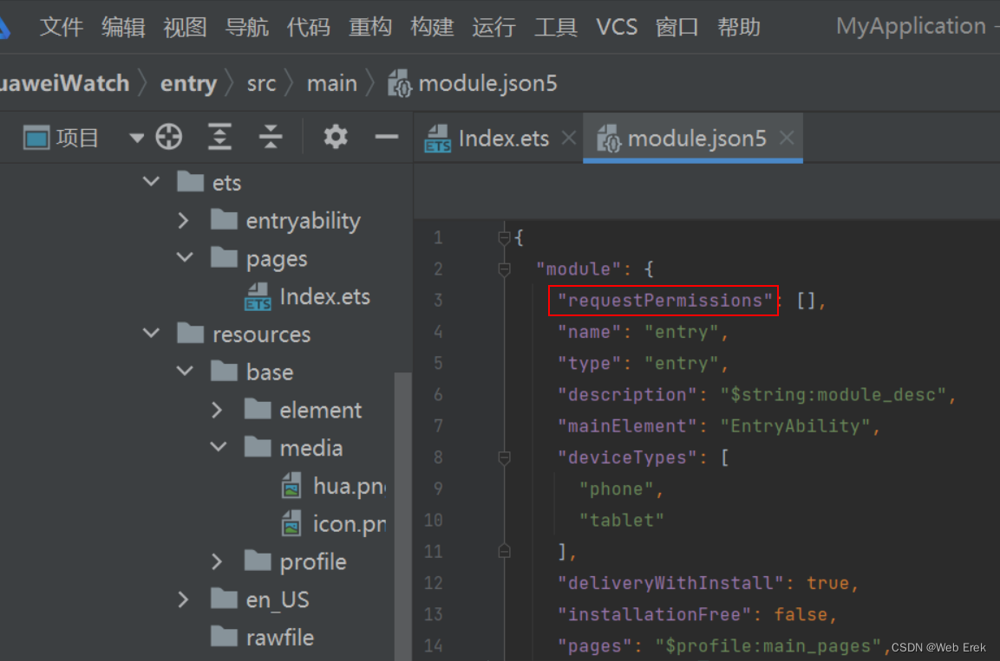

> [module.json5](https://so.csdn.net/so/search?q=module.json5&spm=1001.2101.3001.7020)文件中 requestPermissions 进行配置（值为数组，可配置多个）



> ### ohos.permission.INTERNET

```ts
{
    "name": "ohos.permission.INTERNET"
}
```

