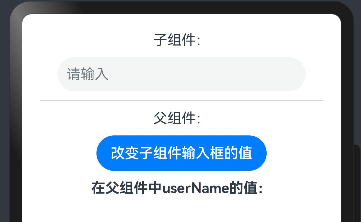
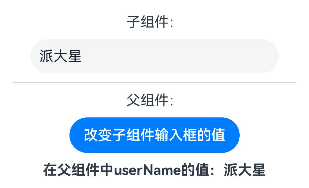

鸿蒙HarmonyOS ArkUI（eTS）组件间通信涉及组件属性与显示、父子组件间通信、祖孙组件间通信、不相干组件间通信等，而组件两两间通信也有单向与双向之分。通过学习HDC2021和官方文档，本系列以@State、@Link、@Prop、@Provide与@Consume、@StorageLink等组件状态装饰器介绍组件间通信方式。

https://libin9ioak.blog.csdn.net/article/details/135908575


## ArkTS - @Prop、@Link


### **一、作用**

@Prop 装饰器 和@Link装饰器都是父组件向子组件传递参数，子组件接收父组件参数的时候用的，变量前边需要加上@Prop或者@Link装饰器即可。（跟前端vue中父组件向子组件传递参数类似）

```javascript
// 子组件
@Component
struct SonCom {
  @Prop name: string
  build() {
    // ···
  }
}
// 子组件
@Component
struct SonCom {
  @Link name: string
  build() {
    // ···
  }
}
```

### **二、区别**

**@Prop** ：单向数据同步，也就是只能父组件向子组件传递，子组件值改变了不会影响到父组件中的值（类似前端vue中的props）。

**@Link**：双向数据同步，既可以父组件向子组件传递值，子组件也可以向父组件传递值。（类似前端vue中的v-model，估计设计的时候参考了）

**（1）演示@Prop：**  
子组件中的输入框值是由父组件传进去的，当点击父组件按钮，子组件输入框值发生改变；但是如果在子组件输入框中直接输入，子组件中的值虽然改变了，但是父组件userName不会发生变化。

```javascript
// 子组件
@Component
struct SonCom {
  @Prop name: string
  build() {
    Row() {
      TextInput({text: this.name, placeholder: "请输入"})
        .width(280).padding(10)
        .onChange(val => {
          this.name = val
          console.log(`当前输入框的值: ${val}`)
        })
    }
  }
}
// 父组件
@Entry
@Component
struct FatherCom {
  @State userName: string = ""
  build() {
    Column({space: 10}) {
      Text("子组件：")
      Row() {
        SonCom({name: this.userName})
      }
      Divider()
      Text("父组件：")
      Row() {
        Button("改变子组件输入框的值").onClick(e => {
          this.userName = "派大星"
        })
      }
      Row() {
        Text(`在父组件中userName的值：${this.userName}`)
          .fontSize(16).fontWeight(FontWeight.Bold)
      }
    }.margin(20)
  }
}
```

页面如下:




点击父组件按钮，此时子组件输入框值发生改变:




但是直接在子组件输入框中直接输入，父组件userName没发生变化：


**（2）演示@Link：**  
只把子组件@Prop换成@Link了：

```javascript
// 子组件
@Component
struct SonCom {
  @Link name: string
  build() {
    Row() {
      TextInput({text: this.name, placeholder: "请输入"})
        .width(280).padding(10)
        .onChange(val => {
          this.name = val
          console.log(`当前输入框的值: ${val}`)
        })
    }
  }
}
```

在子组件输入框中输入值，父组件的userName也会跟着改变：  


**注：****@Link装饰的变量，类型也可以时数组、对象复杂的数据类型，对数组的新增、替换、删除元素都可以监听到，当然对象的赋值啥的也能监听到，具体可查看文档。**

[@Link装饰器](https://developer.harmonyos.com/cn/docs/documentation/doc-guides-V3/arkts-link-0000001524297305-V3#section614118685518 "@Link装饰器")
