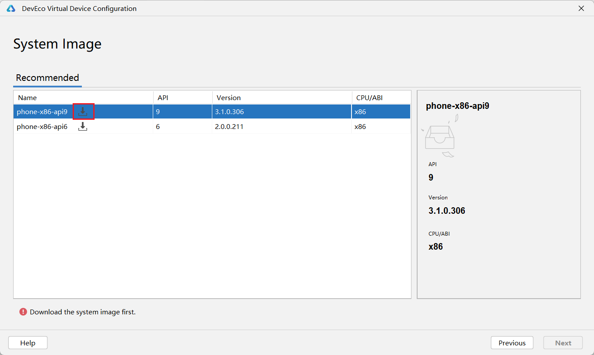
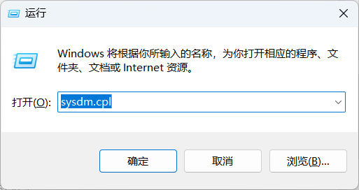
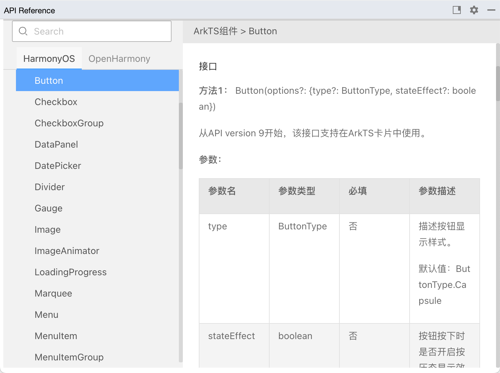
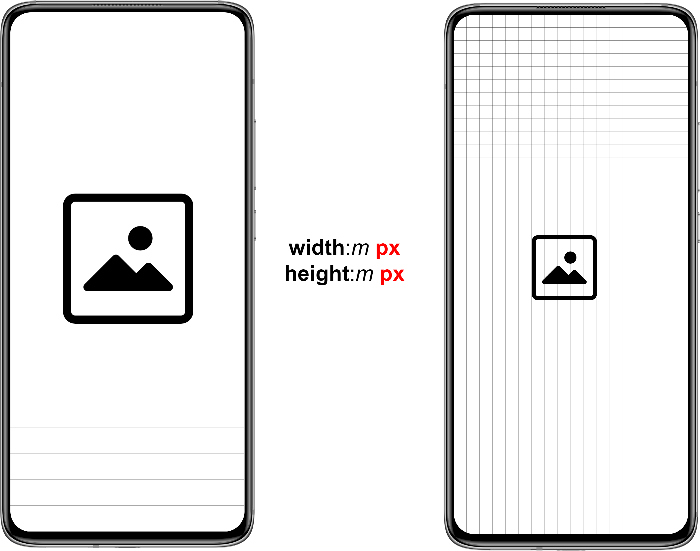
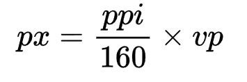
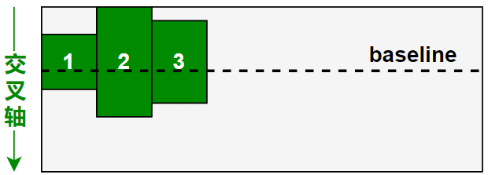
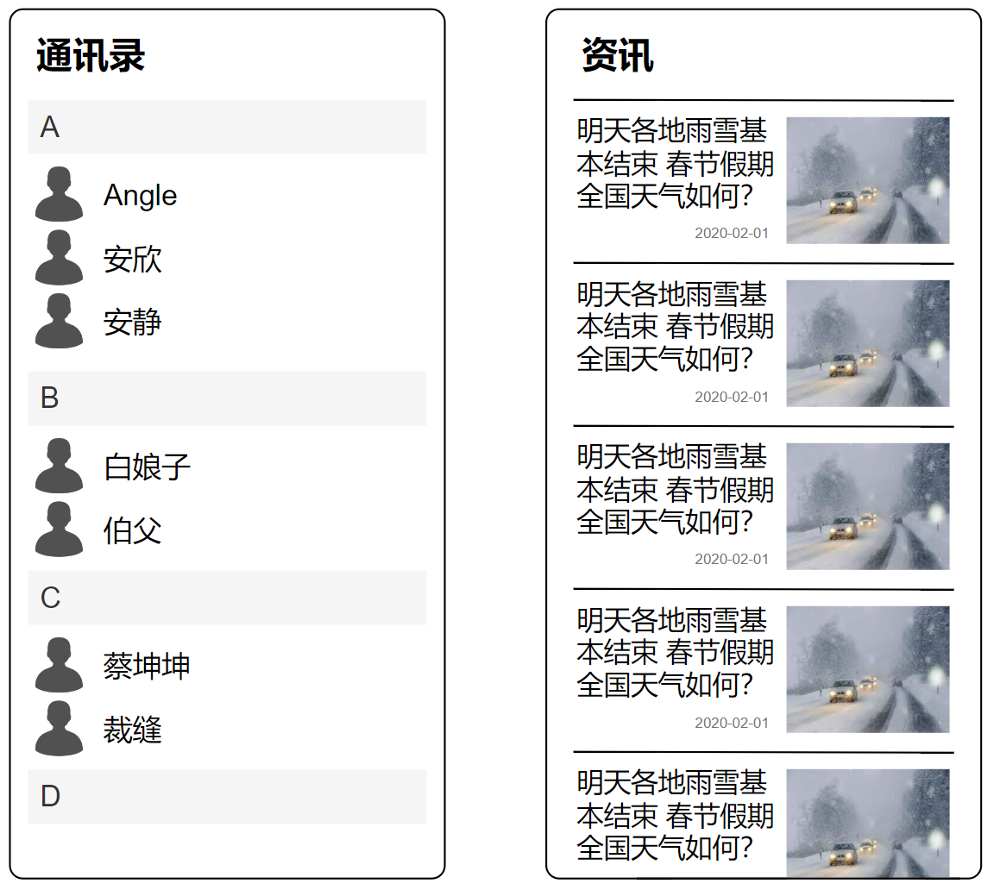
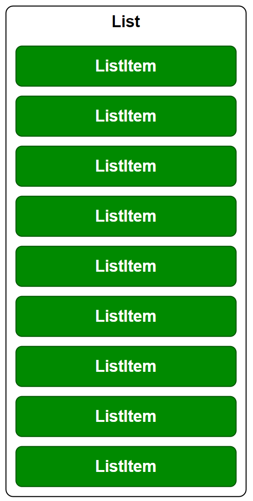
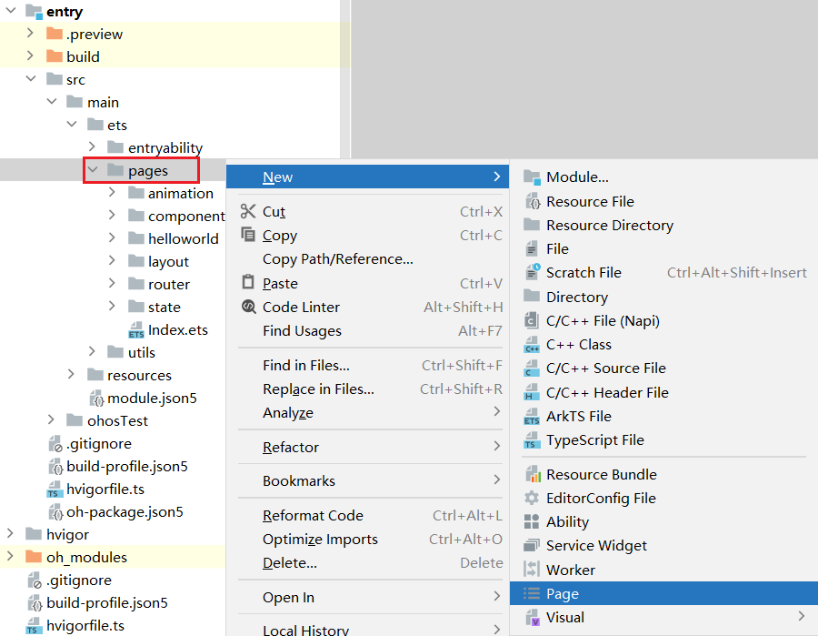

# 1. 鸿蒙应用开发快速体验

## 1.1. 准备开发环境

### 1.1.1. 安装IDE

鸿蒙应用开发需要使用配套的IDE——**HUAWEI DevEco Studio**。 **DevEco Studio**基于IntelliJ IDEA Community（IDEA社区版）构建，为鸿蒙应用提供了一站式开发环境，集成了开发、运行、调试以及发布应用的各项功能。


以下是具体的安装步骤：

1. 获取**DevEco Studio**安装包，官方下载地址为：https://developer.huawei.com/consumer/cn/deveco-studio/
2. 解压之后双击`deveco-studio-3.1.0.501.exe`，进入安装向导，点击`next`即可


1. 选择安装路径，完成后点击`next`

 

1. 配置安装选项，勾选第一项创建桌面快捷方式即可，完成后点击`next`


1. 点击`Install`开始安装


1. 等待几十秒后，点击`Finish`完成安装


### 1.1.2. 配置IDE

安装完成后，可按以下步骤完成初始化配置

1. 双击桌面快捷方式，启动**DevEco Studio**


1. 阅读各项条款，点击`Agree`表示同意


1. 初次启动会出现如下设置向导，首先需要为`nodejs`和`ohpm`选择合适的安装路径，完成后点击`Next`即可

**注**：

- - `nodejs`用于为鸿蒙应用的自动化构建工具提供运行环境。
  - `ohpm`（OpenHarmony Package Manager）是鸿蒙生态第三方库的包管理工具，支持共享包的发布、安装和依赖管理。


1. 为`HarmonyOS SDK`选择安装目录，完成后点击`Next`


1. 阅读相关协议，勾选`Accept`表示同意，完成后点击`Next`


1. 浏览配置汇总页，确认无误后点击`Next`


1. 等待下载


1. 下载完成后，点击`Finish`完成配置


1. 完成配置后，可根据喜好调整**DevEco Studio**主题风格，点击`Configure`下的`Settings`。


1. 在**Appearance & Behavior/Appearance**的`Theme`中可选择主题


## 1.2. 创建项目

下面我们创建第一个鸿蒙应用项目

1. 点击`Create Project`


1. 选择项目模版，此处选择第一个`Empty Ability`即可。


1. 配置项目

可能需要调整的配置项如下，其余保持默认即可，配置完成后，点击`Finish`即可

- - **Project name**：项目名称
  - **Bundle name**：包名，通常为公司域名倒置
  - **Save location**：项目目录


1. IDE界面说明


1. 项目结构概述

项目结构相对复杂，先简单了解即可，随之后序学习的深入再逐步为大家介绍


## 1.3. 运行项目

**DevEco Studio**提供了多种方式用于运行项目，包括预览、模拟器和真机运行。下面逐一演示

### 1.3.1. Preview 预览

`Previewer`预览用于查看应用的UI界面效果，方便随时调整界面UI布局。只需打开需要预览的页面文件，例如下图中的`Index.ets`，然后点击IDE右侧的`Perviewer`即可看到预览效果。


### 1.3.2. 模拟器运行

`Previewer`预览器主要用于查看界面UI效果，如需对项目进行更加深入的测试，可以使用模拟器运行项目。初次使用需要先安装模拟器，安装步骤如下

1. 点击`Tools`菜单下的`Device Manager`，打开设备管理器


1. 点击`Install`，安装模拟器


1. 点击`Install`后，会首先下载模拟器相关的SDK，下载完成后点击`Finish`即可。


1. 选择模拟的安装目录，完成后点击`New Emulator`。


1. 选择设备类型——`Phone`，完成后点击`Next`


1. 下载系统镜像，注意选择`api9`版本



1. 等待下载完成后，点击`Finish`


1. 系统镜像下载完毕后，点击`Next`


1. 配置模拟器（可选），完成后点击`Finish`，至此模拟器安装完毕


1. 若想将项目运行到模拟器，首先需要启动模拟器，点击下图中的启动按钮，稍等片刻，等待模拟器开机


1. 开机后的模拟器如下图所示


1. 回到IDE，在右上角的设备列表中选择刚刚创建的模拟器（默认已经选中）


1. 点击运行按钮


1. 查看模拟器


### 1.3.3. 真机运行

使用模拟器运行应用时，会占用电脑较多的资源，并且有些功能无法进行测试。当模拟器不满足要求时，可选择真机运行。真机运行的步骤如下

1. 准备一台装有`Harmony OS`系统的手机，系统版本最好为`4.0.0`及以上，系统版本可在**设置/关于手机**中查看


1. 打开手机的开发者模式。在**设置/关于手机**中，连续多次点击系统版本号，直至出现**您正处在开发者模式!**的提示信息 


1. 开启USB调试。在**系统与更新/开发人员选项**中，打开**USB调试**开关

 

1. 使用USB数据线将手机和电脑相连，手机会弹框提示选择**USB 连接方式**，需要选择**传输文件**。


1. 之后会弹窗询问**是否允许USB调试？**，可勾选`始终允许使用这台计算机进行调试`，然后点击`确定`


1. 回到IDE，在右上角的设备列表中选择连接的手机（默认已选中）


1. 最后点击运行按钮，即可将项目运行到真机中。首次运行会提示缺少签名信息，点击`Open signing configs`进行配置即可。


1. 生成签名信息需要先登陆华为开发者账号，点击`Sign In`


1. 浏览器会自动跳转到登录页面，按照要求完成注册、登录即可


1. 登录成功后，回到IDE，再次点击运行按钮，即可将应用运行到真机。


# 2. 鸿蒙应用开发语言

## 2.1. 概述

HarmonyOS 应用的主要开发语言是 ArkTS，它由 TypeScript（简称TS）扩展而来，在继承TypeScript语法的基础上进行了一系列优化，使开发者能够以更简洁、更自然的方式开发应用。值得注意的是，TypeScript 本身也是由另一门语言 JavaScript 扩展而来。因此三者的关系如下图所示


## 2.2. TypeScript 快速入门

### 2.2.1. 运行环境说明

#### 2.2.1.1. 线上Playground

TypeScript提供了一个线上的 Playground 供练习使用，地址为https://www.typescriptlang.org/zh/play。


#### 2.2.1.2. 本地运行环境

除去线上的运行环境，我们也可以在本地搭建一个 TS 的运行环境。

1. **安装 VSCode 编辑器**

**VSCode**是一款轻量级、开源且功能丰富的集成开发环境（IDE），支持多种编程语言，具有强大的插件系统。下载地址为：https://code.visualstudio.com/


1. **安装Code Runner 插件**

**Code Runner**是一款在**VSCode**中使用的插件，它提供了简便的代码执行功能，支持多种编程语言，使开发者能够快速运行和调试代码片段。


1. **安装ts-node**

**ts-node**是一个 TypeScript 的运行环境，它允许我们直接运行 TypeScript 代码。**ts-node**的安装和运行依赖于**Node.js**环境，因此在安装**ts-node**之前，我们需要准备好**Node.js**环境。

准备**Node.js**环境需要完成以下两步操作

**安装Node.js**由于前边在部署**DevEco Studio**时，已经下载并安装了**Node.js**，因此这一步可以略过。**配置环境变量**为了方便在终端执行**Node.js**相关的命令，我们需要将**Node.js**的安装目录加入到`Path`环境变量下，具体操作如下首先在DevEco Studio的设置界面查看**Node.js**的安装目录然后打开环境变量配置面板，按下`Win`+`R`，唤起运行窗口，之后运行命令`sysdm.cpl`之后点击**高级**选项卡，并点击**环境变量**然后在**系统变量**中选中`Path`，并点击**编辑**之后点击新建，并填入**Node.js**的安装目录，完成后点击确定。

在配置完**Node.js**环境后，便可在终端执行以下命令来安装**ts-node**了。

```
npm install -g ts-node
```

注：完成后需要重新启动**VSCode**，另其重新加载环境变量和相关依赖。

1. **编写程序并运行**

在完成上述环境的准备后，就可以编写Typescript程序并运行了，具体操作如下

首先在合适的位置创建一个工程目录，例如`D:\workspace\hello-ts`，然后使用**VSCode**打开目录


之后创建Typescript文件，点击**New File**


注意，文件的后缀为`.ts`


之后就可以编写Typescript代码并运行了


### 2.2.2. 声明

#### 2.2.2.1. 变量声明


#### 2.2.2.2. 常量声明

`let`用于声明变量，而`const`用于声明常量，两者的区别是变量在赋值后可以修改，而常量在赋值后便不能再修改。

```typescript
const b:number = 200;
```

#### 2.2.2.3. 类型推断

如果一个变量或常量的声明包含了初始值，TS 便可以根据初始值进行类型推断，此时我们就可以不显式指定其类型，例如

```typescript
let c = 60;
console.log(typeof c); //number
```

### 2.2.3. 常用数据类型

#### 2.2.3.1. number

```
number`表示数字，包括整数和浮点数，例如： `100`、`-33` 、`2.5`、`-3.9
let a :number = 100
let b :number = -33
let c :number = 2.5
let d :number = -3.9
```

#### 2.2.3.2. string

```
string`表示字符串，例如： `你好`、`hello
let a:string = '你好'
let b:string = 'hello'
```

#### 2.2.3.3. boolean

```
boolean`表示布尔值，可选值为：`true`、`false
let isOpen:boolean = true
let isDone:boolean = false
```

#### 2.2.3.4. 数组

数组类型定义由两部分组成，`元素类型[]`，例如`number[]`表示数字数组，`string[]`表示字符串数组，数组类型的变量可由数组字面量——`[item1,item2,item3]`进行初始化。

```typescript
let a: number[] = []

let b: string[] = ['你好', 'hello']
```

#### 2.2.3.5. 对象

在TS中，对象（object）是一种一系列由**属性名称**和**属性值**组成的数据结构，例如`姓名:'张三', 年龄:10, 性别:'男'`。对象类型的声明需要包含所有属性的**名称**及**类型**，例如`{name: string, age: number, gender: string}`，对象类型的变量可以通过对象字面量——`{name:'张三', age:10, gender:'男'}`进行初始化。

```typescript
let person: {name:string, age:number, gender:string} = {name:'张三', age:10, gender:'男'};
```

### 2.2.4. 函数

#### 2.2.4.1. 函数声明语法

声明函数的基础语法如下


#### 2.2.4.2. 参数详解

##### 2.2.4.2.1. 特殊语法

- **可选参数**

可选参数通过参数名后的`?`进行标识，如以下案例中的`gender?`参数。

```ts
function getPersonInfo(name: string, age: number, gender?: string): string {    if (gender === undefined) {        gender = '未知'    }    return `name:${name},age:${age},gender:${gender}`; } let p1 = getPersonInfo('zhagnsan', 10, '男') let p2 = getPersonInfo('lisi', 15); console.log(p1); console.log(p2);
```

注：调用函数时，未传递可选参数，则该参数的值为`undefined`。

- **默认参数**

可在函数的参数列表为参数指定默认值，如以下案例中的`gender: string='未知'`参数。

```ts
function getPersonInfo(name: string, age: number, gender: string='未知'): string {    return `name:${name},age:${age},gender:${gender}`; } let p1 = getPersonInfo('zhagnsan', 10, '男') let p2 = getPersonInfo('lisi', 15); console.log(p1); console.log(p2);
```

##### 2.2.4.2.2. 特殊类型

- **联合类型**

一个函数可能用于处理不同类型的值，这种情况可以使用联合类型，例如以下案例中的`message: number | string`

```js
function printNumberOrString(message: number | string) {  console.log(message) } printNumberOrString('a') printNumberOrString(1)
```

- **任意类型**

若函数需要处理任意类型的值，则可以使用`any`类型，例如以下案例中的`message: any`

```js
function print(message:any) {  console.log(message) } print('a') print(1) print(true)
```

#### 2.2.4.3. 返回值详解

##### 2.2.4.3.1. 特殊类型

若函数没有返回值，则可以使用`void`作为返回值类型，其含义为空。

```typescript
function test(): void {
    console.log('hello');
}
```

##### 2.2.4.3.2. 类型推断

函数的返回值类型可根据函数内容推断出来，因此可以省略不写。

```typescript
function test() {
    console.log('hello');
}

function sum(a: number, b: number) {
    return a + b;
}
```

#### 2.2.4.4. 函数声明特殊语法

- **匿名函数**

匿名函数的语法结构简洁，特别适用于简单且仅需一次性使用的场景。

```ts
let numbers: number[] = [1, 2, 3, 4, 5] numbers.forEach(function (number) {    console.log(number); })
```

**注意**：匿名函数能够根据上下文推断出参数类型，因此参数类型可以省略。

- **箭头函数**

匿名函数的语法还可以进一步的简化，只保留参数列表和函数体两个核心部分，两者用`=>`符号连接。

```ts
let numbers: number[] = [1, 2, 3, 4, 5] numbers.forEach((num) => { console.log(num) })
```

### 2.2.5. 类（class）

#### 2.2.5.1. 概述

类（class）是面向对象编程语言中的一个重要概念。

面向对象编程（Object-Oriented Programming，简称OOP）是一种编程范式，其核心理念在于将程序中的数据与操作数据的方法有机地组织成对象，从而使程序结构更加模块化和易于理解。通过对象之间的协同合作，实现更为复杂的程序功能。

类（class）是对象的蓝图或模板，它定义了对象的属性（数据）和行为（方法）。通过类可以创建多个具有相似结构和行为的对象。例如定义一个 `Person`类，其对象可以有`张三`、`李四`等等。

#### 2.2.5.2. 语法说明

##### 2.2.5.2.1. 类的定义

定义类的语法如下图所示


代码如下：

```ts
class Person {    id: number;    name: string;    age: number = 18;     constructor(id: number, name: string) {        this.id = id;        this.name = name;    }     introduce(): string {        return `hello,I am ${this.name},and I am ${this.age} years old`    } }
```

##### 2.2.5.2.2. 对象创建

- **语法**

创建对象的关键字为`new`，具体语法如下

```ts
let person = new Person(1,'zhangsan');
```

- **对象属性的访问**

```ts
console.log(person.name); //读 person.name = 'lisi'; //写 console.log(person.name);
```

- **对象方法的调用**

对象创建后，便可通过对象调用类中声明的方法，如下

```ts
let intro = person.introduce(); console.log(intro);
```

##### 2.2.5.2.3. 静态成员

Typescript 中的类中可以包含静态成员（静态属性和静态方法），静态成员隶属于类本身，而不属于某个对象实例。静态成员通用用于定义一些常量，或者工具方法。

- **声明静态成员**

定义静态成员需要使用`static`关键字。

```ts
class Constants{    static count:number=1; } class Utils{    static toLowerCase(str:string){        return str.toLowerCase();    } } console.log(Constants.count); console.log(Utils.toLowerCase('Hello World'));
```

- **使用静态成员**

静态成员无需通过对象实例访问，直接通过类本身访问即可。

```ts
console.log(Constants.count); console.log(Utils.toLowerCase('Hello World'));
```

#### 2.2.5.3. 继承

继承是面向对象编程中的重要机制，允许一个类（子类或派生类）继承另一个类（父类或基类）的属性和方法。子类可以直接使用父类的特性，并根据需要添加新的特性或覆盖现有的特性。这种机制赋予面向对象程序良好的扩展性。

下面通过一个例子演示继承的特性

```typescript
class Student extends Person {
    classNumber: string;
    constructor(id: number, name: string, classNumber: string) {
        super(id, name);
        this.classNumber = classNumber;
    }

    introduce(): string {
        return super.introduce()+`, and I am a student`;
    }
}

let student = new Student(1,'xiaoming','三年二班');
console.log(student.introduce());
```

**注意：**

- 类的继承需要使用关键字`extends`
- 子类构造器中需使用`super()`调用父类构造器对继承自父类的属性进行初始化。
- 在子类中可以使用`this`关键字访问继承自父类的属性和方法。
- 在子类中可以使用`super`关键字访问父类定义的方法。

#### 2.2.5.4. 访问修饰符

访问修饰符（Access Modifiers）用于控制类成员（属性、方法等）的可访问性。TypeScript提供了三种访问修饰符，分别是**private**、**protected**和**public**。

```typescript
class Person {
    private id: number;
    protected name: string;
    public age: number;

    constructor(id: number, name: string, age: number) {
        this.id = id;
        this.name = name;
        this.age = age;
    }
}

class Student extends Person {
    
}
```

**说明：**

- **private** 修饰的属性或方法是私有的，只能在声明它的类中的被访问。
- **protected** 修饰的属性或方法是受保护的，只能在声明它的类和其子类中被访问。
- **public** 修饰的属性或方法是公有的，可以在任何地方被访问到，默认所有的属性和方法都是 public 的。

### 2.2.6. 接口（interface）

#### 2.2.6.1. 概述

接口（interface）是面向对象编程中的另一个重要概念。接口通常会作为一种契约或规范让类（class）去遵守，确保类实现某些特定的行为或功能。

#### 2.2.6.2. 语法说明

- **接口定义**

接口使用`interface`关键字定义，通常情况下，接口中只会包含属性和方法的声明，而不包含具体的实现细节，具体的细节由其实现类完成。

```ts
interface Person {    id: number;    name: string;    age: number;      introduce(): void; }
```

- **接口实现**

接口的实现需要用到`implements`关键字，实现类中，需要包含接口属性的赋值逻辑，以及接口方法的实现逻辑。

```ts
class Student implements Person {    id: number;    name: string;    age: number;     constructor(id: number, name: string, age: number) {        this.id = id;        this.name = name;        this.age = age;    }     introduce(): void {        console.log('Hello,I am a student');    } }
```

#### 2.2.6.3. 多态

**多态**是面相对象编程中的一个重要概念，它可以使同一类型的对象具有不同的行为。下面我们通过一个具体的案例来体会**多态**这一概念

首先，再创建一个`Person`接口的实现类`Teacher`，如下

```typescript
class Teacher implements Person {
    id: number;
    name: string;
    age: number;

    constructor(id: number, name: string, age: number) {
        this.id = id;
        this.name = name;
        this.age = age;
    }

    introduce(): void {
        console.log('Hello,I am a teacher');
    }
}
```

然后分别创建一个`Student`对象和一个`Teacher`对象，注意两个对象的类型均可以设置`Person`，如下

```typescript
let p1: Person = new Student(1, 'zhangsan', 17);
let p2: Person = new Teacher(2, 'lisi', 35);
```

最后分别调用`p1`和`p2`的`introduce()`方法，你会发现，同样是`Person`类型的两个对象，调用同一个`introduce()`方法时，表现出了不同的行为，这就是**多态**。

```typescript
p1.introduce();//Hello,I am a student
p2.introduce();//Hello,I am a teacher
```

#### 2.2.6.4. 接口的作用

在传统的面向对象编程的场景中，接口主要用于设计和组织代码，使代码更加容易扩展和维护。下面举例说明。

假如现在需要实现一个订单支付系统，按照面向对象编程的习惯，首先需要定义一个订单类（Order），如下

```typescript
class Order {
    totalAmount: number;

    constructor(totalAmount: number) {
        this.totalAmount = totalAmount;
    }

    pay() {
        console.log(`AliPay:${this.totalAmount}`);
    }
}
```

很容易预想到，这个系统将来可能需要支持其他的支付方式，为了方便代码支持新的支付方式，我们可以对代码进行如下改造。

首先定义一个支付策略的接口，接口中声明一个`pay`方法，用来规范实现类必须实现支付逻辑。

```typescript
interface PaymentStrategy {
    pay(amount: number): void;
}
```

然后在订单类中增加一个`PaymentStrategy`的属性，并且在订单类中的`pay`方法中调用`PaymentStrategy`的`pay`方法，如下

```typescript
class Order {
    totalAmount: number;
    paymentStrategy: PaymentStrategy;

    constructor(totalAmount: number, paymentStrategy: PaymentStrategy) {
        this.totalAmount = totalAmount;
        this.paymentStrategy = paymentStrategy;
    }

    pay() {
        this.paymentStrategy.pay(this.totalAmount);
    }
}
```

这样改造完之后，就可以很容易的在不改变现有代码的情况下，支持新的支付方式了。

比如现在需要支持`AliPay`，那我们就可以创建`AliPay`这个类（class）并实现（implement）`PaymentStrategy`这个接口，如下

```typescript
class AliPay implements PaymentStrategy {
    pay(amount: number): void {
        console.log(`AliPay:${amount}`);
    }
}
```

这样一来，之后创建的订单就可以使用`AliPay`这个支付方式了。

```typescript
let order = new Order(1000,new AliPay());
order.pay();
```

#### 2.2.6.5. TS 中的接口的特殊性

TypeScript 中的接口是一个非常灵活的概念，除了用作类的规范之外，也常用于直接描述对象的类型，例如，现有一个变量的定义如下

```typescript
let person: {name:string, age:number, gender:string} = {name:'张三', age:10, gender:'男'};
```

可以看到变量的值为一个一般对象，变量的类型为`{name:string, age:number, gender:string}`，此时就可以声明一个接口来描述该对象的类型，如下

```typescript
interface Person {
    name: string;
    age: number;
    gender: string;
}

let person: Person = {name:'张三', age:10, gender:'男'};
```

### 2.2.7. 枚举

#### 2.2.7.1. 概述

枚举（Enumeration）是编程语言中常见的一种数据类型，其主要功能是定义一组有限的选项，例如，方向（上、下、左、右）或季节（春、夏、秋、冬）等概念都可以使用枚举类型定义。

#### 2.2.7.2. 语法说明

- **枚举定义**

枚举的定义需使用`enum`关键字，如下

```ts
enum Season {    SPRING,    SUMMER,    AUTUMN,    WINTER }
```

- **枚举使用**

枚举的使用记住两个原则即可

- - **枚举值的访问**

像访问对象属性一样访问枚举值，例如`Season.SPRING`

- - **枚举值的类型**

枚举值的类型为`enum`的名称，例如`Season.SPRING`和`Season.SUMMER`等值的类型都是`Season`

```ts
let spring:Season = Season.SPRING;
```

- **使用场景**

现需要编写一个函数`move`，其功能是根据输入的方向（上、下、左、右）进行移动，此时就可以先使用枚举定义好所有可能的输入选项，如下

```ts
enum Direction {    UP,    BOTTOM,    LEFT,    RIGHT }
```

`move`函数的实现如下

```ts
function move(direction: Direction) {    if(direction===Direction.UP){        console.log('向上移动');    }else if(direction===Direction.BOTTOM){        console.log('向下移动');    }else if(direction===Direction.LEFT){        console.log('向左移动');    }else{        console.log('向右移动');    } } move(Direction.UP);
```

#### 2.2.7.3. 赋值

在TypeScript 中，枚举实际上是一个对象，而每个枚举值都是该对象的一个属性，并且每个属性都有具体的值，属性值只支持两种类型——数字或字符串。

默认情况下，每个属性的值都是数字，并且从 `0` 开始递增，例如上述案例中的`Direction`枚举中，`Direction.UP`的值为`0`，`Direction.BOTTOM`的值为`1`，依次类推，具体如下

```typescript
console.log(Direction.UP) //0
console.log(Direction.BOTTOM) //1
console.log(Direction.LEFT) //2
console.log(Direction.RIGHT) //3
```

除了使用默认的数字作为属性的值，我们还能手动为每个属性赋值，例如

```typescript
enum Direction {
    UP = 1,
    BOTTOM = 2,
    LEFT = 3,
    RIGHT = 4
}

console.log(Direction.UP) //1
console.log(Direction.BOTTOM) //2
console.log(Direction.LEFT) //3
console.log(Direction.RIGHT) //4
```

再例如

```typescript
enum Direction {
    UP = 'up',
    BOTTOM = 'bottom',
    LEFT = 'left',
    RIGHT = 'right'
}

console.log(Direction.UP) //up
console.log(Direction.BOTTOM) //bottom
console.log(Direction.LEFT) //left
console.log(Direction.RIGHT) //right
```

通过为枚举属性赋值，可以赋予枚举属性一些更有意义的信息，例如以下枚举

```typescript
enum Color {
    Red = 0xFF0000,
    Green = 0x00FF00,
    Blue = 0x0000FF
}

enum FontSize {
    Small = 12,
    Medium = 16,
    Large = 20,
    ExtraLarge = 24
}
```

### 2.2.8. 模块化

#### 2.2.8.1. 概述

模块化是指将复杂的程序拆解为多个独立的文件单元，每个文件被称为一个模块。在 TypeScript 中，默认情况下，每个模块都拥有自己的作用域，这意味着在一个模块中声明的任何内容（如变量、函数、类等）在该模块外部是不可见的。为了在一个模块中使用其他模块的内容，必须对这些内容进行**导入**、**导出**。


#### 2.2.8.2. 语法说明

- **导出**

导出须使用`export`关键字，语法如下

```ts
export function hello() {    console.log('hello module A'); } export const str = 'hello world'; const num = 1;
```

- **导入**

导入须使用`import`关键字，语法如下

```ts
import { hello, str } from './moduleA'; hello(); console.log(str);
```

#### 2.2.8.3. 避免命名冲突

若多个模块中具有命名相同的变量、函数等内容，将这些内容导入到同一模块下就会出现命名冲突。例如，在上述案例的基础上，又增加了一个 moduleC，内容如下

```typescript
export function hello() {
    console.log('hello module C');
}

export const str = 'module C';
```

moduleB 同时引入 moduleA 和 moduleC 的内容，如下，显然就会出命名冲突

```typescript
import { hello, str } from "./moduleA";
import { hello, str } from "./moduleC";

hello() //?
console.log(str); //？
```

有多种方式可以用来解决命名冲突，下面逐一介绍

- **导入重命名**

语法如下

```ts
import { hello as helloFromA, str as strFromA } from "./moduleA"; import { hello as helloFromC, str as strFromC } from "./moduleC"; helloFromA(); console.log(strFromA); helloFromC(); console.log(strFromC);
```

- **创建模块对象**

上述导入重命名的方式能够很好的解决命名冲突的问题，但是当冲突内容较多时，这种写法会比较冗长。除了导入重命名外，还可以将某个模块的内容统一导入到一个**模块对象**上，这样就能简洁有效的解决命名冲突的问题了，具体语法如下

```
import * as A from "./moduleA"; import * as C from "./moduleC"; A.hello(); console.log(A.str); C.hello(); console.log(C.str);
```

#### 2.2.8.4. 默认导入导出

除了上述导入导出的语法之外，还有一种语法，叫做**默认导入导出**，这种语法相对简洁一些。

- **默认导出**

默认导出允许一个模块指定一个（最多一个）默认的导出项，语法如下

```ts
export default function hello(){    console.log('moduleA'); }
```

- **默认导入**

由于每个模块最多有一个默认导出，因此默认导入无需关注导入项的原始名称，并且无需使用`{}`。

```ts
import helloFromA from "./moduleA";
```

由于默认导入时无需关注导入项的名称，所以默认导出支持匿名内容，比如匿名函数，语法如下

```ts
export default function () {    console.log('moduleB'); }
```

## 2.3. ArkTS 快速入门

**ArkTS** 在继承了**Typescript**语法的基础上，主要扩展了**声明式UI开发**相关的能力。

### 2.3.1. 声明式UI

**声明式UI**是一种编写用户界面的范式。下面通过一个具体案例来学习这种开发范式，假如现在要实现如下界面


#### 2.3.1.1. 定义界面状态

按照声明式UI的开发范式，首先需要分析和定义页面的各种状态，并声明相应的状态变量用于表示不同的状态。

当前案例中，界面共有两个状态，分别是**开灯**和**关灯**状态，所以我们可以使用一个`boolean`类型的变量来表示这两个状态，`true`表示**开灯**，`false`表示**关灯**。如下：

```typescript
@State isOn: boolean = false;
```

**说明：**`@State`用于声明该变量为状态变量。

#### 2.3.1.2. 描述界面显示效果

在分析完界面状态后，我们需要准确的描述界面在不同状态下的显示效果。

在当前案例中，具体逻辑如下图所示


#### 2.3.1.3. 改变状态

在明确了界面在不同状态下的显示效果后，我们只需修改状态变量的值，就能触发界面的更新。

在当前案例中，若我们将`isOn`的值改为`true`，那么界面上就会显示**开灯**的图片，否则就会显示**关灯**的图片。

为了实现点击按钮开/关灯的效果，我们可以为按钮绑定点击事件：

- 当用户点击**开灯按钮**时，我们就将`isOn`的值改为`true`。
- 当用于点击**关灯按钮**时，我们就将`isOn`的值改为`false`。


#### 2.3.1.4. 总结

以上就是声明式UI开发范式的大致流程，下面为大家总结一下声明式UI的核心思想

- **声明式描述**

开发者只需描述在界面在不同状态下要呈现的最终效果，而无需关注界面变化的具体过程。


- **状态数据驱动界面更新**

开发者只需修改状态变量的值，界面就会自动更新。


### 2.3.2. 组件化

在鸿蒙开发中，组件是构成界面的最小单元，我们所看到的界面，都是由众多组件组合而成的，所以编写界面其实就是组合组件的过程，ArkTS提供了很多的内置组件，例如：`Text`、`Button`、`Image`等等；并且ArkTS还支持自定义组件，让开发者可根据具体需求自定义组件中的内容。


### 2.3.3. 入门案例

#### 2.3.3.1. 案例效果

案例的最终效果如下图所示


#### 2.3.3.2. 完整代码

案例的完整代码见`Demos/entry/src/main/ets/pages/helloworld/light/solution/Light.ets`

```ts
@Entry
@Component
struct LightPage {
  @State isOn: boolean = false;

  build() {
    Column({ space: 20 }) {
      if (this.isOn) {
        Image('pages/helloworld/light/solution/images/img_light.png')
          .height(300)
          .width(300)
          .borderRadius(20)
      } else {
        Image('pages/helloworld/light/solution/images/img_dark.png')
          .height(300)
          .width(300)
          .borderRadius(20)
      }
      Row({ space: 50 }) {
        Button('关灯')
          .onClick(() => {
            this.isOn = false
          })
        Button('开灯')
          .onClick(() => {
            this.isOn = true;
          })
      }
    }
    .height('100%')
      .width('100%')
      .justifyContent(FlexAlign.Center)
  }
}
```

### 2.3.4. 语法说明

#### 2.3.4.1. 声明组件

下面通过一个相对简单的案例来系统的学习 ArkTS 声明组件的语法，案例的最终效果如下，完整代码见`Demos/entry/src/main/ets/pages/helloworld/delete/DeleteButton.ets`


声明组件的完整语法如下图所示


各部分语法说明如下

- **组件参数**

如果组件的定义包含参数，可在组件名称后面的`()`中配置相应参数。各组件支持的参数，可查看 API 文档，查看方式如下

- - 首先将鼠标在相应组件悬停


- - 点击`Show in API Reference`，就会弹出 API 文档



- **子组件**

如果组件支持子组件配置，可在`()`后的`{}`中添加子组件，若不支持子组件，则不需要写`{}`。

- **属性方法**

属性方法用于配置组件的样式和其他属性，可以在组件声明的末尾进行链式调用。各组件支持的属性可查看 API 文档，除去每个组件的专有属性，还有各组件都能配置的通用属性，通用属性也可通过 API 文档查看。


- **事件方法**

事件方法用于为组件绑定交互事件，可以在组件声明的末尾进行链式调用。各组件的支持的事件可查看 API 文档，除去每个组件的专有事件，还有各组件都支持的通用事件，通用事件也可通过 API 文档查看。


#### 2.3.4.2. 自定义组件

除去系统预置的组件外，ArkTS 还支持自定义组件。使用自定义组件，可使代码的结构更加清晰，并且能提高代码的复用性。

##### 2.3.4.2.1. 语法说明

自定义组件的语法如下图所示


各部分语法说明如下：

- `**struct**`**关键字**

`struct`是**ArkTS**新增的用于自定义组件或者自定义弹窗的关键字。其声明的数据结构和**TS**中的类十分相似，可包含属性和方法。

- `**build**`**方法**

`build()`方法用于声明自定义组件的UI结构。

- **组件属性**

组件属性可用作自定义组件的参数，使得自定义组件更为通用。

- `**@Compnent**`**装饰器**

`@Component`装饰器用于装饰`struct`关键字声明的数据结构。`struct`被`@Component`装饰后才具备组件化的能力。

注： 装饰器是Typescript中的一种特殊语法，常用于装饰类、方法、属性，用于修改或扩展其原有的行为。

在学完自定义组件的语法之后，我们会发现前文案例中的每个页面实际上都是一个自定义组件。但是和自定义组件的语法相比，前边的每个案例还会多出一个`@Entry`装饰器，那`@Entry`的作用又是啥呢？

在鸿蒙应用中，每个页面都是由一些列组件组合而成的，并且这些组件都是逐层嵌套的，因此这些组件最终形成了一个组件树的结构，如下图所示


我们前边所编写的每个页面就相当于是组件树的根节点，而`@Entry`装饰器的作用就是标识该组件为组件树的根节点，也就是一个页面的入口组件。

##### 2.3.4.2.2. 案例实操

现在需要对前文的开/关灯的案例做出如下改造，由于两个按钮的结构十分相似，所以可考虑自定义一个按钮组件，然后进行复用。


案例的完整代码见：`Demos/entry/src/main/ets/pages/helloworld/custom/solution/Light.ets`

#### 2.3.4.3. 渲染控制

##### 2.3.4.3.1. 条件渲染

###### 2.3.4.3.1.1. 概述

条件渲染可根据应用的不同状态渲染不同的UI界面，例如前文的开/关灯案例，以及以下的播放/暂停案例，均可使用条件渲染实现。


案例的完整代码见：`Demos/entry/src/main/ets/pages/helloworld/condition/solution/PlayAndPausePage.ets`

###### 2.3.4.3.1.2. 语法说明

条件渲染的语法如下

```typescript
if (...){
  //UI描述 
}else if (...){
  //UI描述
}else{
  //UI描述
}
```

##### 2.3.4.3.2. 循环渲染

###### 2.3.4.3.2.1. 概述

循环渲染可使用`ForEach`语句基于一个数组来快速渲染一个组件列表，例如以下案例中的选项列表就可通过循环渲染实现。


案例的完整代码见：`Demos/entry/src/main/ets/pages/helloworld/foreach/solution/FruitPage.ets`

###### 2.3.4.3.2.2. 语法说明

`ForEach`循环渲染的语法如下

```typescript
ForEach(
  arr: any[], 
  itemGenerator: (item: any, index?: number) => void,
  keyGenerator?: (item: any, index?: number) => string
)
```

各参数的含义如下

- **arr**

需要进行循环渲染的数据源，必须为数组类型，例如上述案例中的

```ts
@State options: string[] = ["苹果", "桃子", "香蕉", "橘子"];
```

- **itemGenerator**

组件生成函数，用于为`arr`数组中的每个元素创建对应的组件。该函数可接收两个参数，分别是

- - item：`arr`数组中的数据项
  - index（可选）：`arr`数组中的数据项的索引

例如上述案例中的

```ts
(item: string) => {        Button(item)          .width(100)          .backgroundColor(Color.Green)          .onClick(() => {            this.answer = item;          })      }
```

- **keyGenerator**（可选）：

**key**生成函数，用于为`arr`数组中的每个数据项生成唯一的**key**。

**key的作用**

`ForEach`在数组发生变化（修改数组元素或者向数组增加或删除元素）时，需要重新渲染组件列表，在重新渲染时，它会尽量复用原来的组件对象，而不是为每个元素都重新创建组件对象。**key**的作用就是辅助`ForEach`完成组件对象的复用。具体逻辑如下：`ForEach`在进行初次渲染时，会使用**keyGenerator**为数组中的每个元素生成一个唯一的**key**，并将**key**作为组件对象的标识。当数组发生变化导致`ForEach`需要重新渲染时，`ForEach`会再次使用**keyGenerator**为每个元素重新生成一遍**key**，然后`ForEach`会检查新生成的**key**在上次渲染时是否已经存在，若存在，`ForEach`就会认为这个**key**对应的数组元素没有发生变化，那它就会直接复用这个**key**所对应的组件对象；若不存在，`ForEach`就会认为这个**key**对应的元素发生了变化，或者该元素为新增元素，此时，就会为该元素重新创建一个组件对象。

开发者可以通过**keyGenerator**函数自定义**key**的生成规则。如果开发者没有定义**keyGenerator**函数，则系统会使用默认的**key**生成函数，即

```ts
(item: any, index: number) => { return index + '__' + JSON.stringify(item); }
```

在某些情况下默认的**key**生成函数，会导致界面渲染效率低下，此时可考虑通过**keyGenerator**函数自定义生成逻辑，例如如下场景

状态变量数组定义如下

```ts
@State arr:string[] = ["zhangsan","lisi","wangwu"]
```

ForEach语句如下

```ts
Column(){  ForEach(this.arr,(item)=>{ Text(item) }) }
```

初次渲染时，每个元素对应的**key**依次为`0__"zhagnsan"`、`1__"lisi"`、`2__"wangwu"`。若现有一个操作是向`arr`数组头部插入新的元素，例如新元素为**wanger**，按照默认的**key**生成逻辑，插入新元素之后每个元素的**key**就会依次变为`0__"wanger"`、`1__"zhagnsan"`、`2__"lisi"`、`3__"wangwu"`，也就是所有元素的**key**都发生了变化，因此UI界面更新时需要为每个元素都重新创建组件对象，即便原有的元素没有发生变化也无法复用之前的组件，这样一来就导致了性能浪费。此时我们就可以考虑提供第三个参数，如下

```ts
Column(){  ForEach(this.arr, (item)=>{ Text(item) }, item => JSON.stringify(item)) }
```

# 3. 常用组件

## 3.1. 图片

### 3.1.1. 概述

`Image`为图片组件，用于在应用中显示图片。

### 3.1.2. 参数

`**Image**`组件的参数类型为`string | Resource | media.PixelMap`，相关案例见`Demos/entry/src/main/ets/pages/component/image/parameter/solution/ImageParameter.ets`。

下面对三种参数类型逐一进行介绍。

- `**string**`**类型**

`string`类型的参数用于通过路径的方式引用图片，包括本地图片和网络图片。

- - **本地图片**

`Image('images/demo.jpg')`**注意**：使用这种方式引入本地图片，需要将图片置于`ets`目录下，并且需要为`Image`组件提供图片相对于`ets`目录的路径。

- - **网络图片**

`Image('http://xxx/xxx.jpg')`**注意：**真机中运行的鸿蒙应用，访问网络图片需要配置网络访问权限，不过在预览器和模拟器中测试时不受限制。权限配置相关的内容在后续章节会系统介绍。

- `**Resource**`**类型**

`Resource`类型的参数用于引入 **resources** 目录下的图片。

**resources**目录用于统一存放应用所需的各种资源，包括图片、音频、视频、文本等等。下面简要介绍 **resources** 目录的用法，首先需要了解 **resources** 的目录结构，如下


**resources** 目录下，用于存放资源的子目录有（**element**、**media**、**profile**）和**rawfile**。下面分别介绍

**element、media、profile**（**element**、**media**、**profile**）可存在多种版本，用于适配不同的环境，例如语言环境（**zh_CN**和**en_US**）、系统主题（**dark**和**light**）、设备类型（**phone** 和 **tablet**） 等等。我们可以为上述每种环境各自准备一套资源文件，每种环境对应 **resources** 下的一个目录，例如上述的 **zh_CN** 和 **en_US**。我们在使用**resources**下的资源时，无需指定具体的环境版本，系统会根据设备所处的环境自动选择匹配的版本，例如当设备系统语言为中文时，则会使用**zh_CN**目录下的资源，为英文时，则会使用**en_US**目录下的资源。若没有与当前所处环境相对应的版本，则使用 **base** 目录下资源**。**各目录存储的具体资源如下**media**存放媒体资源，包括图片、音频、视频等文件。**element**存放用于描述页面元素的尺寸、颜色、样式等的各种类型的值，每种类型的值都定义在一个相应的 **JSON** 文件中。**profile**存放自定义配置文件。**rawfile**用于存储任意格式的原始文件，需要注意的是**rawfile**不会根据设备所处的环境去匹配不同的资源。

**总结：**

**resources**目录下可用于存放图片的目录有**resources/\*/****media** 以及 **resources/****rawfile**，两个目录下图片的使用方式有所不同，下面逐一介绍

- - **media目录**

该目录下的资源，需要使用`$r('app.media.<filename>')`的方式引用。

**注意**：无需指定具体版本，系统会自动根据所处环境选择相应版本

例如上图中的**img.png**图片，可通过`$r('app.media.img')`引用。需要注意的是`$r()`的返回值即为 `**Resource**` 类型，因此可以直接将`$r('app.media.img')`作为 **Image** 组件的参数，例如`Image($r('app.media.img'))`。

- - **rawfile目录**

该目录下的资源，可通过`$rawfile('path/to/your/file')`的方式引用，文件的路径为相对于 **rawfile** 的路径。例如上图中的**icon.png**，须使用`$rawfile('icon.png)`引用。需要注意的是，`$rawfile()`的返回值也是**Resource**类型，因此其也可以直接作为 **Image** 组件的参数，如`Image($rawfile('icon.png))`。

- **media.PixelMap**

PixelMap指的是图片的**像素位图**，其通常是一个二维数组，数组中的每个元素对应着图片中的一个像素，其包含了该像素的颜色等信息。像素位图主要用于图片编辑的场景，例如


### 3.1.3. 常用属性

#### 3.1.3.1. 图片尺寸

图片尺寸可通过`width()`方法和`height()`方法进行设置。例如

```ts
Image($r('app.media.img'))
	.width(100)
	.height(100)
```

两个方法可接收的参数类型均为`string | number | Resource`，相关案例见`Demos/entry/src/main/ets/pages/component/image/attribute/size/solution/ImageSize.ets`。

下面对三种参数类型逐一进行介绍。

- `**string**`**类型**

`string`类型的参数可为百分比，例如`'100%'`，或者为具体尺寸，例如`'100px'`。

具体尺寸的单位，常用的有两个，分别是`px`和`vp`，下面逐个介绍

**前置知识（屏幕参数）**想要理解上述尺寸单位，需要大家先掌握屏幕相关的几个参数**像素**屏幕显示的最小单位，屏幕上的一个小亮点称为一个像素。**分辨率**屏幕上横向和纵向的像素数量。**尺寸**屏幕对角线的长度，以英寸(`inches`)为单位。**像素密度**像素密度是每英寸屏幕上的像素数量，通常以`PPI`（Pixels Per Inch）表示，计算公式如下。较高的像素密度意味着在相同尺寸的屏幕上有更多的像素，从而提供更加清晰和细腻的图像。如下图所示

- - `**px(Pixel)**`

物理像素，以像素个数来定义图像尺寸。这种方式的弊端是，在不同像素密度的屏幕上，相同的像素个数对应的物理尺寸是不同的。这样一来就会导致我们的应用在不同设备上显示的尺寸可能不同。如下图所示



- - `**vp(Virtual Pixel)**`

为了保证一致的观感，我们可以使用虚拟像素作为单位。虚拟像素是一种可根据屏幕像素密度灵活缩放的单位。**1vp**相当于像素密度为**160ppi**的屏幕上的**1px**。在不同像素密度的屏幕上，HarmonyOS会根据如下公式将虚拟像素换算为对应的物理像素



根据上述公式，不难看出，使用虚拟像素作为单位时，同一尺寸，在像素密度低的屏幕上（单个像素的物理尺寸大），对应的物理像素会更少，相反在像素密度高的屏幕上（单个像素的物理尺寸小），对应的物理像素会更多。因此就能在不同像素密度的屏幕上，获得基本一致的观感了。如下图所示


- `**number**`**类型**

`number`类型的参数，默认以`vp`作为单位。

- `**Resource**`**类型**

`Resource`类型参数用于引用**resources**下的**element**目录中定义的数值。

引用**element**目录中的数值，同样需要使用`$r()`函数。要了解具体语法，需要先熟悉**element**目录下的文件内容。

前文提到过，**element**目录中可保存各种类型的数值，且每种类型的值分别定义在一个JSON文件中。文件中的内容为键值对(`name-value`)的形式。具体内容如下

```
{  "string": [    {      "name": "module_desc",      "value": "模块描述"    },    {      "name": "greeting",      "value": "你好"    }  ] }``{  "integer": [    {      "name": "width",      "value": 150    },    {      "name": "height",      "value": 150    }  ] }
```

我们可以通过 `name` 引用相应的 `value`。具体语法为`$r('app.<data_type>.<name>')`。

**注意**：无需指定具体版本，系统会自动根据所处环境选择相应版本

例如上述的 `greeting` 的值，可通过`$r('app.string.greeting')`引用，`width`的值可通过`$r('app.integer.width')`。

#### 3.1.3.2. 图片缩放

当图片的原始大小与**Image**组件不同时，可通过`objectFit()`方法来设置图片的显示效果。该方法的参数类型为`ImageFit`枚举类型，可选的枚举值如下

| **名称**             | **描述**                                                             |
| -------------------- | -------------------------------------------------------------------- |
| `ImageFit.None`      | 保持原有尺寸显示，不做任何缩放，超出显示区域的部分不显示。           |
| `ImageFit.Contain`   | 保持宽高比进行缩小或者放大，使得显示区域刚好包含整个图片。           |
| `ImageFit.Cover`     | 保持宽高比进行缩小或者放大，使得图片刚好完全覆盖显示区域。           |
| `ImageFit.Fill`      | 不保持宽高比进行放大缩小，使得图片充满显示区域。                     |
| `ImageFit.ScaleDown` | 保持宽高比进行缩小或不变（不会放大），使得图片完全显示在显示区域内。 |
| `ImageFit.Auto`      | 自适应显示                                                           |

各选项的效果如下图所示


相关案例见：`Demos/entry/src/main/ets/pages/component/image/attribute/objectFit/solution/ImageObjectFit.ets`

#### 3.1.3.3. 图片插值

当原图分辨率较低并且需要放大显示时，图片会模糊并出现锯齿。如下图所示


这时可以使用`interpolation()`方法对图片进行插值，使图片显示得更清晰。该方法的参数为`ImageInterpolation`枚举类型，可选的值有

| 名称                        | 描述                                   |
| --------------------------- | -------------------------------------- |
| `ImageInterpolation.None`   | 不使用图片插值。                       |
| `ImageInterpolation.High`   | 高质量插值，可能会影响图片渲染的速度。 |
| `ImageInterpolation.Medium` | 中等质量插值。                         |
| `ImageInterpolation.Low`    | 低等质量插值。                         |

各选项效果如下图所示


相关案例见：`Demos/entry/src/main/ets/pages/component/image/attribute/interpolation/solution/Interpolation.ets`

## 3.2. 文本

### 3.2.1. 概述

`**Text**`为文本组件，用于显示文字内容。

### 3.2.2. 参数

`**Text**`组件的参数类型为`string | Resource`，下面分别对两个参数类型进行介绍：

- **string类型**

```
Text('我是一段文本')
```

- **Resource 类型**

`Resource`类型的参数用于引用 `resources/*/element`目录中定义的字符串，同样需要使用`$r()`引用。

例如`resources/base/element`目录中有一个`string.json`文件，内容如下

```
{  "string": [    {      "name": "greeting",      "value": "你好"    }  ] }
```

此时我们便可通过如下方式引用并显示`greeting`的内容。

```
Text($r('app.string.greeting'))
```

相关案例见`Demos/entry/src/main/ets/pages/component/text/parameter/solution/TextParameterPage.ets`

### 3.2.3. 常用属性

#### 3.2.3.1. 字体大小

字体大小可通过`fontSize()`方法进行设置，该方法的参数类型为`string | number| Resource`，下面逐一介绍

- **string类型**

`string`类型的参数可用于指定字体大小的具体单位，例如`fontSize('100px')`，字体大小的单位支持`px`、`fp`。其中`fp(font pixel)`与`vp`类似，具体大小也会随屏幕的像素密度变化而变化。

- **number类型**

`number`类型的参数，默认以`fp`作为单位。

- **Resource类型**

`Resource`类型参数用于引用**resources**下的**element**目录中定义的数值。

相关案例见`Demos/entry/src/main/ets/pages/component/text/attribute/fontsize/solution/FontSizePage.ets`

#### 3.2.3.2. 字体粗细

字体粗细可通过`fontWeight()`方法进行设置，该方法参数类型为`number | FontWeight | string`，下面逐一介绍

- **number类型**

`number`类型的取值范围是`[100,900]`，取值间隔为`100`，默认为`400`，取值越大，字体越粗。

- **FontWeight类型**

`FontWeight`为枚举类型，可选枚举值如下

名称描述`FontWeight.Lighter`字体较细。`FontWeight.Normal`字体粗细正常。`FontWeight.Regular`字体粗细正常。`FontWeight.Medium`字体粗细适中。`FontWeight.Bold`字体较粗。`FontWeight.Bolder`字体非常粗。

- **string类型**

`string`类型的参数仅支持`number`类型和`FontWeight`类型参数的字符串形式，例如例如`'100'`和`bold`。

相关案例见`Demos/entry/src/main/ets/pages/component/text/attribute/fontweight/solution/FontWeightPage.ets`

#### 3.2.3.3. 字体颜色

字体颜色可通过`fontColor()`方法进行设置，该方法参数类型为`Color | string | number | Resource`，下面逐一介绍

- **Color类型**

```
Color`为枚举类型，其中包含了多种常用颜色，例如`Color.Green
```

- **string类型**

```
string`类型的参数可用于设置 **rgb** 格式的颜色，具体写法可以为`'rgb(0, 128, 0)'`或者`'#008000'
```

- **number类型**

```
number`类型的参数用于使用16进制的数字设置 **rgb** 格式的颜色，具体写法为`0x008000
```

- **Resource类型**

`Resource`类型的参数用于应用**resources**下的**element**目录中定义的值。

相关案例见`Demos/entry/src/main/ets/pages/component/text/attribute/fontcolor/solution/FontColor.ets`

#### 3.2.3.4. 文本对齐

文本对齐方向可通过`textAlign()`方法进行设置，该方法的参数为枚举类型`TextAlign`，可选的枚举值如下

| 名称               | 描述     |
| ------------------ | -------- |
| `TextAlign.Start`  | 首部对齐 |
| `TextAlign.Center` | 居中对齐 |
| `TextAlign.End`    | 尾部对齐 |

各选项效果如下


相关案例见`Demos/entry/src/main/ets/pages/component/text/attribute/textalign/solution/TextAlignPage.ets`

#### 3.2.3.5. 最大行数和超长处理

可使用`maxLines()`方法控制文本的最大行数，当内容超出最大行数时，可使用`textOverflow()`方法处理超出部分，该方法的参数类型为`{ overflow: TextOverflow }`，其中`TextOverflow`为枚举类型，可用枚举值有

| 名称                    | 描述                                     |
| ----------------------- | ---------------------------------------- |
| `TextOverflow.Clip`     | 文本超长时，进行裁剪显示。               |
| `TextOverflow.Ellipsis` | 文本超长时，显示不下的文本用省略号代替。 |

各选项效果如下


相关案例见`Demos/entry/src/main/ets/pages/component/text/attribute/textoverflow/solution/TextOverFlowPage.ets`

## 3.3. 按钮

### 3.3.1. 概述

`Button`为按钮组件，通常用于响应用户的点击操作。

### 3.3.2. 参数

`Button`组件有两种使用方式，分别是**不包含子组件**和**包含子组件**，两种方式下，`Button` 组件所需的参数有所不同，下面分别介绍

- **不包含子组件**

不包含子组件时，`Button`组件所需的参数如下

```
Button(label?: string, options?: { type?: ButtonType, stateEffect?: boolean })
```

- - **label**

`label`为按钮上显示的文字内容。

- - **options.type**

`options.type`为按钮形状，该属性的类型`ButtonType`，可选的枚举值有

名称描述效果`ButtonType.Capsule`胶囊形状`ButtonType.Circle`圆形`ButtonType.Normal`普通形状

- - **options.stateEffect**

`options.stateEffect`表示是否开启点击效果，点击效果如下


- **包含子组件**

子组件会作为按钮上显示的内容，可以是图片、文字等。这种方式下，`Button`组件就不在需要`label`参数了，具体如下

```
Button(options?: {type?: ButtonType, stateEffect?: boolean})
```

相关案例见：`Demos/entry/src/main/ets/pages/component/button/parameter/solution/ButtonParameter.ets`

### 3.3.3. 常用属性

#### 3.3.3.1. 背景颜色

按钮的颜色可使用`backgroundColor()`方法进行设置，例如

```ts
Button('绿色按钮').backgroundColor(Color.Green)
```

#### 3.3.3.2. 边框圆角

按钮的边框圆角大小可使用`borderRadius()`方法进行设置，例如

```ts
Button('圆角按钮', { type: ButtonType.Normal }).borderRadius(10)
```

相关案例见：`Demos/entry/src/main/ets/pages/component/button/attribute/ButtonAttributePage.ets`

### 3.3.4. 常用事件

对于Button组件而言，最为常用的就是点击事件，可以通过`onClick()`方法为按钮绑定点击事件，该方法的参数为一个回调函数，当按钮被点击时，就会触发该回调函数，例如

```ts
Button('点击事件').onClick(() => {
  console.log('我被点击了')
})
```

相关案例见：`Demos/entry/src/main/ets/pages/component/button/event/ButtonEventPage.ets`

## 3.4. 切换按钮

### 3.4.1. 概述

`**Toggle**`为切换按钮组件，一般用于两种状态之间的切换，例如下图中的蓝牙开关。


### 3.4.2. 参数

`Toggle`组件的参数定义如下

```ts
Toggle(options: { type: ToggleType, isOn?: boolean })
```

- **type**

`type`属性用于设置`Toggle`组件的类型，可通过`ToggleType`枚举类型进行设置，可选的枚举值如下

名称描述效果`ToggleType.Switch`开关`ToggleType.Checkbox`复选框`ToggleType.Button`按钮

- **isOn**

`isOn`属性用于设置`Toggle`组件的状态，例如


相关案例见：`Demos/entry/src/main/ets/pages/component/toggle/parameter/ToggleParameter.ets`

### 3.4.3. 常用属性：

#### 3.4.3.1. 选中状态背景色

可使用`selectedColor()`方法设置`Toggle`组件在选中（或打开）状态下的背景色，例如


#### 3.4.3.2. Swtich滑块颜色

可使用设置`switchPointColor()`方法设置**Switch**类型的Toggle组件中的圆形滑块颜色，例如


相关案例见：`Demos/entry/src/main/ets/pages/component/toggle/attribute/ToggleAttributePage.ets`

### 3.4.4. 常用事件

`Toggle`组件常用的事件为**change**事件，每当`Toggle`组件的状态发生变化，就会触发`change`事件。开发者可通过`onChange()`方法为`Toggle`组件绑定**change**事件，该方法参数为一个回调函数，具体定义如下

```ts
onChange(callback: (isOn: boolean) => void)
```

当`Toggle`组件的状态由关闭切换为打开时，`isOn`为`true`，从打开切换为关闭时，`isOn`为`false`。

相关案例见：`Demos/entry/src/main/ets/pages/component/toggle/event/solution/Light.ets`

## 3.5. 文本输入

### 3.5.1. 概述

`TextInput`为文本输入组件，用于接收用户输入的文本内容。

### 3.5.2. 参数

`TextInput`组件的参数定义如下

```typescript
TextInput(value?:{placeholder?: string|Resource , text?: string|Resource})
```

- **placeholder**

`placeholder`属性用于设置无输入时的提示文本，效果如下


- **text**

`text`用于设置输入框当前的文本内容，效果如下


相关案例见：`Demos/entry/src/main/ets/pages/component/input/parameter/TextInputParameter.ets`

### 3.5.3. 常用属性

#### 3.5.3.1. 输入框类型

可通过`type()`方法设置输入框的类型，该方法的参数为`InputType`枚举类型，可选的枚举值有

| **名称**             | **描述**       |
| -------------------- | -------------- |
| `InputType.Normal`   | 基本输入模式   |
| `InputType.Password` | 密码输入模式   |
| `InputType.Number`   | 纯数字输入模式 |

#### 3.5.3.2. 光标样式

可通过`caretColor()`方法设置光标的颜色，效果如下


#### 3.5.3.3. placeholder样式

可通过`placeholderFont()`和`placeholderColor()`方法设置 **placeholder** 的样式，其中`placeholderFont()`用于设置字体，包括字体大小、字体粗细等，`placeholderColor()`用于设置字体颜色，效果如下


#### 3.5.3.4. 文本样式

输入文本的样式可通过`fontSize()`、`fontWeight()`、`fontColor()`等通用属性方法进行设置。

相关案例见：`Demos/entry/src/main/ets/pages/component/input/attribute/TextInputAttribute.ets`

### 3.5.4. 常用事件

#### 3.5.4.1. change事件

每当输入的内容发生变化，就会触发 **change** 事件，开发者可使用`onChange()`方法为`TextInput`组件绑定 **change** 事件，该方法的参数定义如下

```typescript
onChange(callback: (value: string) => void)
```

其中`value`为最新内容。

#### 3.5.4.2. 焦点事件

焦点事件包括**获得焦点**和**失去焦点**两个事件，当输入框获得焦点时，会触发 **focus** 事件，失去焦点时，会触发 **blur** 事件，开发者可使用`onFocus()`和`onBlur()`方法为 `TextInput` 组件绑定相关事件，两个方法的参数定义如下

```typescript
onFocus(event: () => void)	
onBlur(event: () => void)
```

相关案例见：`Demos/entry/src/main/ets/pages/component/input/event/TextInputEvent.ets`

## 3.6. 进度条

### 3.6.1. 概述

`Progress`为进度条组件，用于显示各种进度。

### 3.6.2. 参数

`Progress`组件的参数定义如下

```ts
Progress(options: {value: number, total?: number, type?: ProgressType})
```

- **value**

`value`属性用于设置当前进度值。

- **total**

`total`属性用于设置总值。

- **type**

`type`属性用于设置进度条类型，可通过`ProgressType`枚举类型进行设置，可选的枚举值如下

名称描述效果`ProgressType.Linear`线性样式`ProgressType.Ring`环形无刻度样式`ProgressType.Eclipse`月食样式`ProgressType.ScaleRing`环形有刻度样式`ProgressType.Capsule`胶囊样式

相关案例见：`Demos/entry/src/main/ets/pages/component/progress/parameter/ProgressParameter.ets`

### 3.6.3. 常用属性

#### 3.6.3.1. 进度条样式

可通过`style()`调整进度条的样式，例如进度条的宽度，该方法的参数类型定义如下

```typescript
style({strokeWidth?: string|number|Resource,scaleCount?: number,scaleWidth?: string|number|Resource})
```

- **strokeWidth**

`strokeWidth`属性用于设置进度条的宽度，默认值为`4vp`。该属性可用于`Linear`、`Ring`、`ScaleRing`三种类型，效果如下


- **scaleCount**

`scaleCount`属性用于设置`ScaleRing`的刻度数，默认值为`120`。效果如下


- **scaleWidth**

`scaleCount`属性用于设置`ScaleRing`的刻度线的宽度，默认值为`2vp`。效果如下


相关案例见：`Demos/entry/src/main/ets/pages/component/progress/attribute/style/ProgressStyle.ets`

#### 3.6.3.2. 进度条颜色

进度条的颜色可通过`color()`和`backgroundColor()`方法进行设置，其中`color()`用于设置前景色，`backgroundColor()`用于设置背景色，例如


相关案例见：`Demos/entry/src/main/ets/pages/component/progress/attribute/color/ProgressColor.ets`

## 3.7. 弹窗

弹窗是移动应用中常见的一种用户界面元素，常用于显示一些重要的信息、提示用户进行操作或收集用户输入。ArkTS提供了多种内置的弹窗供开发者使用，除此之外还支持自定义弹窗，来满足各种不同的需求。

### 3.7.1. 消息提示

#### 3.7.1.1. 概述

**Toast**（消息提示），常用于显示一些简短的消息或提示，一般会在短暂停留后自动消失。具体效果如下


#### 3.7.1.2. 使用说明

可使用`@ohos.promptAction`模块中的`showToast()`方法显示 **Toast** 提示，使用时需要先导入`@ohos.promptAction`模块，如下

```typescript
import promptAction from '@ohos.promptAction'
```

`showToast()`方法的参数定义如下

```typescript
showToast(options: { message: string | Resource,duration?: number,bottom?: string | number})
```

- **message**

`message`属性用于设置提示信息

- **duration**

`duration`属性用于设置提示信息停留时长，单位为毫秒，取值范围是[1500,10000]

- **bottom**

`bottom`属性用于设置提示信息到底部的距离

相关案例见：`Demos/entry/src/main/ets/pages/component/dialog/toast/ToastPage.ets`

### 3.7.2. 警告对话框

#### 3.7.2.1. 概述

**AlertDialog**（警告对话框）用于向用户发出警告或确认操作的提示，确保用户在敏感操作前进行确认。具体效果如下


相关案例见：`Demos/entry/src/main/ets/pages/component/dialog/alertDialog/solution/AlertDialogPage.ets`

#### 3.7.2.2. 使用说明

可使用全局方法`AlertDialog.show()`显示警告对话框，具体用法可参考相关案例或者[官方文档](https://developer.huawei.com/consumer/cn/doc/harmonyos-references-V2/ts-methods-alert-dialog-box-0000001478341185-V2)。

### 3.7.3. 操作列表弹框

#### 3.7.3.1. 概述

**ActionSheet**（操作列表弹窗）用于提供一组选项给用户选择，用户从中选择后，可执行相应的操作。具体效果如下


相关案例见：`Demos/entry/src/main/ets/pages/component/dialog/actionSheet/solution/ActionSheetPage.ets`

#### 3.7.3.2. 使用说明

可使用全局方法`ActionSheet.show()`显示操作列表弹窗，具体用法可参考相关案例或者[官方文档](https://developer.huawei.com/consumer/cn/doc/harmonyos-references-V2/ts-methods-action-sheet-0000001478061737-V2)。

### 3.7.4. 选择器弹窗

#### 3.7.4.1. 概述

选择器弹窗用于让用户从一个列表中选择一个具体的值。`ArkTS`内置了多种选择器弹窗，例如文本选择器、日期选择器、时间选择器等等，各选择器效果如下

<details class="lake-collapse"><summary id="ucbbb1a17"><strong><span class="ne-text">TextPickerDialog（文本滑动选择器弹窗）</span></strong></summary><p id="u8e9f9673" class="ne-p" style="margin: 0; padding: 0; min-height: 24px; text-align: center"></p><div data-type="tips" class="ne-alert" style="border: 1px solid #E8E9E8; background-color: #F4F5F5; margin: 4px 0; padding: 10px; border-radius: 4px"><p id="ufe30462c" class="ne-p" style="margin: 0; padding: 0; min-height: 24px"><span class="ne-text">相关案例见：</span><code class="ne-code" style="font-family: SFMono-Regular, Consolas, Liberation Mono, Menlo, Courier, monospace; background-color: rgba(0, 0, 0, 0.06); border: 1px solid rgba(0, 0, 0, 0.08); border-radius: 2px; padding: 0px 2px"><span class="ne-text">Demos/entry/src/main/ets/pages/component/dialog/picker/textPickerDialog/solution/TextPickerDialogPage.ets</span></code></p></div></details>

<details class="lake-collapse"><summary id="u8ed6fe33"><strong><span class="ne-text">DatePickerDialog（日期滑动选择期弹窗）</span></strong></summary><p id="ub6049085" class="ne-p" style="margin: 0; padding: 0; min-height: 24px; text-align: center"></p><div data-type="tips" class="ne-alert" style="border: 1px solid #E8E9E8; background-color: #F4F5F5; margin: 4px 0; padding: 10px; border-radius: 4px"><p id="u86e4e22e" class="ne-p" style="margin: 0; padding: 0; min-height: 24px"><span class="ne-text">相关案例见：</span><code class="ne-code" style="font-family: SFMono-Regular, Consolas, Liberation Mono, Menlo, Courier, monospace; background-color: rgba(0, 0, 0, 0.06); border: 1px solid rgba(0, 0, 0, 0.08); border-radius: 2px; padding: 0px 2px"><span class="ne-text">Demos/entry/src/main/ets/pages/component/dialog/picker/datePickerDialog/solution/DatePickerDialogPage.ets</span></code></p></div></details>

<details class="lake-collapse"><summary id="uc3dbfab7"><strong><span class="ne-text">TimePickerDialog（时间滑动选择器弹窗）</span></strong></summary><p id="ue6e8a989" class="ne-p" style="margin: 0; padding: 0; min-height: 24px; text-align: center"></p><div data-type="tips" class="ne-alert" style="border: 1px solid #E8E9E8; background-color: #F4F5F5; margin: 4px 0; padding: 10px; border-radius: 4px"><p id="udf631708" class="ne-p" style="margin: 0; padding: 0; min-height: 24px"><span class="ne-text">相关案例见：</span><code class="ne-code" style="font-family: SFMono-Regular, Consolas, Liberation Mono, Menlo, Courier, monospace; background-color: rgba(0, 0, 0, 0.06); border: 1px solid rgba(0, 0, 0, 0.08); border-radius: 2px; padding: 0px 2px"><span class="ne-text">Demos/entry/src/main/ets/pages/component/dialog/picker/timePickerDialog/solution/TimePickerDialogPage.ets</span></code></p></div></details>

#### 3.7.4.2. 使用说明

具体用法可参考相关案例或者官方文档，各选择器的官方文档地址如下

| 类型                                       | 文档地址                                                                                                                          |
| ------------------------------------------ | --------------------------------------------------------------------------------------------------------------------------------- |
| **TextPickerDialog（文本滑动选择器弹窗）** | [官方文档](https://developer.huawei.com/consumer/cn/doc/harmonyos-references-V2/ts-methods-textpicker-dialog-0000001427584912-V2) |
| **DatePickerDialog（日期滑动选择期弹窗）** | [官方文档](https://developer.huawei.com/consumer/cn/doc/harmonyos-references-V2/ts-methods-datepicker-dialog-0000001427902500-V2) |
| **TimePickerDialog（时间滑动选择器弹窗）** | [官方文档](https://developer.huawei.com/consumer/cn/doc/harmonyos-references-V2/ts-methods-timepicker-dialog-0000001428061780-V2) |

### 3.7.5. 自定义弹窗

#### 3.7.5.1. 概述

当现有组件不满足要求时，可考虑自定义弹窗，自定义弹窗允许开发者自定义弹窗内容和样式。例如


相关案例见：`Demos/entry/src/main/ets/pages/component/dialog/custom/solution/CustomDialogPage.ets`

#### 3.7.5.2. 使用说明

显示自定义弹窗需要使用`CustomDialogController`，具体用法可参考相关案例或者[官方文档](https://developer.huawei.com/consumer/cn/doc/harmonyos-guides-V2/arkts-common-components-custom-dialog-0000001450754206-V2)。

## 3.8. 组件编程技巧

### 3.8.1. 样式复用

#### 3.8.1.1. 概述

当多个组件具有相同的样式时，若每个组件都单独设置，将会有大量的重复代码。为避免重复代码，开发者可使用`@Styles`或者`@Extend`装饰器将多条样式设置提炼成一个方法，然后直接在各组件声明的位置进行调用，这样就能完成样式的复用。


#### 3.8.1.2. @Styles方法

`@Styles`方法可定义在组件内或者全局，具体语法如下

- **组件内**

```
@Entry @Component struct StylesPage {  build() {    Column() {      Row({ space: 50 }) {        Button('确认')          .type(ButtonType.Normal)          .backgroundColor(Color.Green)          .compButtonStyle() //复用样式          .onClick(() => console.log('确认'))        Button('取消')          .type(ButtonType.Normal)          .backgroundColor(Color.Gray)          .compButtonStyle() //复用样式          .onClick(() => console.log('取消'))      }    }.width('100%')    .height('100%')    .justifyContent(FlexAlign.Center)  }   //组件内样式定义  @Styles compButtonStyle() {    .width(100)    .height(40)    .borderRadius(10)  } }
```

- **全局**

```
@Entry @Component struct StylesPage {  build() {    Column() {      Row({ space: 50 }) {        Button('确认')          .type(ButtonType.Normal)          .backgroundColor(Color.Green)          .globalButtonStyle() //复用样式          .onClick(() => console.log('确认'))        Button('取消')          .type(ButtonType.Normal)          .backgroundColor(Color.Gray)          .globalButtonStyle() //复用样式          .onClick(() => console.log('取消'))      }    }.width('100%')    .height('100%')    .justifyContent(FlexAlign.Center)  } } //全局样式定义 @Styles function globalButtonStyle() {  .width(100)  .height(40)  .borderRadius(10) }
```

**注意**

1. **组件内**的`@Styles`方法只能在当前组件中使用，**全局**的`@Styles`方法目前只允许在当前的`.ets文件`中使用
2. **组件内**定义`@Styles`方法时不需要使用`function`关键字，全局的`@Styles`方法需要使用`function`关键字
3. `@Styles`方法中只能包含**通用属性方法**和**通用事件方法**
4. `@Styles`方法不支持参数

相关案例见：`Demos/entry/src/main/ets/pages/component/reuse/styles/solution/StylesPage.ets`

#### 3.8.1.3. @Extend方法

`@Extend`装饰的方法同样可用于组件样式的复用，与`@Styles`不同的是，`@Extend`方法只能定义在全局。并且`@Extend`方法只能用于指定类型的组件，例如以下方法只能用于**Button**组件（可以理解为是Button组件的扩展样式）

```ts
@Extend(Button) function buttonStyle(){
  ...
}
```

由于`@Extend`方法只能用于指定类型的组件，因此方法中可包含指定组件的**专有属性方法**和**专有事件方法**。另外，`@Extend`方法还支持参数，具体语法如下

```ts
@Entry
@Component
struct ExtendPage {
  build() {
    Column() {
      Row({ space: 50 }) {
        Button('确认')
          .buttonExtendStyle(Color.Green, () => console.log('确认')) //复用样式
        Button('取消')
          .buttonExtendStyle(Color.Gray, () => console.log('取消')) //复用样式
      }
    }.width('100%')
    .height('100%')
    .justifyContent(FlexAlign.Center)
  }
}

//样式定义
@Extend(Button) function buttonExtendStyle(color: Color, callback: () => void) {
  .width(100)
  .height(40)
  .borderRadius(10)
  .type(ButtonType.Normal)
  .backgroundColor(color)
  .onClick(callback)
}
```

**总结**

1. `@Extend`方法只能定义在全局，使用范围目前只限于当前的`.ets`文件
2. `@Extend`方法用于特定类型的组件，因此可包含该组件的**专有属性方法**和**专有事件方法**
3. `@Extend`方法支持参数

相关案例见：`Demos/entry/src/main/ets/pages/component/reuse/extend/solution/ExtendPage.ets`

### 3.8.2. UI结构复用

#### 3.8.2.1. 概述

当页面有多个相同的UI结构时，若每个都单独声明，同样会有大量重复的代码。为避免重复代码，可以将相同的UI结构提炼为一个自定义组件，完成UI结构的复用。

除此之外，ArkTS还提供了一种更轻量的UI结构复用机制`@Builder`方法，开发者可以将重复使用的UI元素抽象成一个`@Builder`方法，该方法可在`build()`方法中调用多次，以完成UI结构的复用。


#### 3.8.2.2. 语法说明

`@Builder`方法同样可以定义在组件内或者全局，具体语法如下

- **组件内**

```
@Entry @Component struct BuilderPage {  build() {    Column() {      Row({ space: 50 }) {        //复用UI结构        this.compButtonBuilder($r('app.media.icon_edit'), '编辑', () => console.log('编辑'))        this.compButtonBuilder($r('app.media.icon_send'), '发送', () => console.log('发送'))      }    }.width('100%')    .height('100%')    .justifyContent(FlexAlign.Center)  }   //定义UI结构  @Builder compButtonBuilder(icon: Resource, text: string, callback: () => void) {    Button() {      Row({ space: 10 }) {        Image(icon)          .width(25)          .height(25)        Text(text)          .fontColor(Color.White)          .fontSize(25)      }    }.width(120)    .height(50)    .onClick(callback)  } }
```

- **全局**

```
@Entry @Component struct BuilderPage {  build() {    Column() {      Row({ space: 50 }) {        //复用UI结构        globalButtonBuilder($r('app.media.icon_edit'), '编辑', () => console.log('编辑'))        globalButtonBuilder($r('app.media.icon_send'), '发送', () => console.log('发送'))      }    }.width('100%')    .height('100%')    .justifyContent(FlexAlign.Center)  } } //定义UI结构 @Builder function globalButtonBuilder(icon: Resource, text: string, callback: () => void) {    Button() {      Row({ space: 10 }) {        Image(icon)          .width(25)          .height(25)        Text(text)          .fontColor(Color.White)          .fontSize(25)      }    }.width(120)    .height(50)    .onClick(callback) }
```

**注意**

1. **组件内**的`@Builder`方法可通过`this`访问当前组件的属性和方法，而**全局**的`@Builder`方法则不能
2. **组件内**的`@Builder`方法只能用于当前组件，**全局**的`@Builder`方法导出（`export`）后，可用于整个应用。

相关案例见：`Demos/entry/src/main/ets/pages/component/reuse/builder/syntax/solution/BuilderPage.ets`

#### 3.8.2.3. @Builder方法参数传递规则

`@Builder`方法具有两种参数传递机制——**按值传递**和**按引用传递**。当只有一个参数且参数为**对象字面量**时为按引用传递，其余情况均为按值传递。

按引用传递时，若传递的参数为**状态变量**，则状态变量的变化将会触发`@Builder`方法内部UI的刷新；按值传递时则不会。

相关案例见：`Demos/entry/src/main/ets/pages/component/reuse/builder/parameter/BuilderParameterPage.ets`

#### 3.8.2.4. @Builder方法和自定义组件的区别

`@Builder`方法和自定义组件虽然都可以实现UI复用的效果，但是两者还是有着本质的区别的，其中最为显著的一个区别就是自定义组件可以定义自己的状态变量，而`@Builder`方法则不能。以下案例中，每个待办事项的UI结构都相同，因此可考虑将其提炼为一个自定义组件或者`@Builder`方法，但是由于每个待办事项均有**已完成**和**未完成**两种状态，因此需要为每个待办事项都定义一个状态变量，所以此时就只能使用自定义组件而不能使用`@Builder`方法。


**总结**

若复用的UI结构没有状态，推荐使用`@Builder`方法，否则使用自定义组件。

相关案例见：`Demos/entry/src/main/ets/pages/component/reuse/builder/difference/DifferencePage.ets`

#### 3.8.2.5. @BuilderParam

`@BuilderParam`用于装饰自定义组件（struct）中的属性，其装饰的属性可作为一个UI结构的**占位符**，待创建该组件时，可通过参数为其传入具体的内容。（其作用类似于Vue框架中的slot）。

| 组件定义                                                                                                                                                                                                                       | UI结构定义                                                                                                                               | 组件创建                                                                                                                  |
| ------------------------------------------------------------------------------------------------------------------------------------------------------------------------------------------------------------------------------ | ---------------------------------------------------------------------------------------------------------------------------------------- | ------------------------------------------------------------------------------------------------------------------------- |
| `@Component struct Container {   //@BuilderParam属性  @BuilderParam content: () => void   build() {    Column() {      Text('其他内容') //其他内容      this.content(); //占位符      Button('其他内容') //其他内容    }  } }` | `@Builder function contentBuilder1() {  ... } @Builder function contentBuilder2() {  ... } @Builder function contentBuilder3() {  ... }` | `Container({ content: contentBuilder1 }) Container({ content: contentBuilder2 }) Container({ content: contentBuilder3 })` |

下面通过一个案例展示`@BuilderParam`的具体用法，例如，现需要实现一个通用的卡片组件，如下图所示


卡片中显示的内容不固定，例如


具体实现步骤如下：

**卡片组件定义**

| 卡片组件定义                                                                                                                                                                                                                      | 效果图                                                                                    |
| --------------------------------------------------------------------------------------------------------------------------------------------------------------------------------------------------------------------------------- | ----------------------------------------------------------------------------------------- |
| `@Component struct Card {  @BuilderParam content: () => void; //@BuilderParam属性   build() {    Column() {      this.content(); //占位符    }.width('90%')    .padding(10)    .borderRadius(10)    .shadow({ radius: 20 })  } }` |  |

**卡片内容定义**

| 卡片内容定义                                                                                                                                                        | 效果图                                                                                    |
| ------------------------------------------------------------------------------------------------------------------------------------------------------------------- | ----------------------------------------------------------------------------------------- |
| `@Builder function imageBuilder() {  Column({ space: 10 }) {    Image($r('app.media.img_harmony'))      .width(300)      .height(150)    Text('鸿蒙操作系统')  } }` |  |

**创建卡片组件**

| 创建卡片组件                      | 效果图                                                                                    |
| --------------------------------- | ----------------------------------------------------------------------------------------- |
| `Card({ content: imageBuilder })` |  |

另外，如果一个组件中**只定义了一个**`@BuilderParam`属性，那么创建该组件时，也可直接通过**"子组件"**的方式传入具体的UI结构，例如

| 创建卡片组件                                                                                                                                       | 效果图                                                                                    |
| -------------------------------------------------------------------------------------------------------------------------------------------------- | ----------------------------------------------------------------------------------------- |
| `Card() {  Column({ space: 10 }) {    Text('鸿蒙操作系统')      .fontSize(25)      .fontWeight(FontWeight.Bold)    Text('鸿蒙操作系统是...')  } }` |  |

相关案例见：`Demos/entry/src/main/ets/pages/component/reuse/builderParam/BuilderParamPage.ets`

# 4. 常用布局

## 4.1. 布局基础

#### 4.1.1.1. 概述

布局是指对页面组件进行排列和定位的过程，其目的是有效地组织和展示页面内容，会涉及到组件的大小、位置以及它们之间的相互关系等等。


#### 4.1.1.2. 盒子模型

在鸿蒙应用中，页面上的每个组件都可以看做是一个矩形的盒子，这个盒子包含了**内容区域**（content）、**边框**（border）、**内边距**（padding）和**外边距**（margin），各部分内容如下图所示


其中**margin**、**padding**和**border**均可使用同名的属性方法进行设置，各方法定义如下

- **margin**

`margin(value: { top?:Length, right?:Length, bottom?:Length, left?:Length } |  Length )`**说明：**`Length`=`string | number | Resource`当参数类型为`Length`时，四个方向的边距同时生效

- **padding**

```
padding(value: { top?:Length, right?:Length, bottom?:Length, left?:Length } |  Length )
```

- **border**

```
border(value: {width?:Length, color?:ResourceColor, radius?:Length, style?:BorderStyle })
```

各属性含义如下

- - **width**

`width`属性表示边框宽度

- - **color**

`color`属性表示边框颜色

- - **radius**

`radius`属性表示边框圆角半径

- - **style**

`style`属性表示边框样式，可通过`BorderStyle`这一枚举类型进行设置，可选的枚举值有

名称描述效果`BorderStyle.Dotted`显示为一系列圆点`BorderStyle.Dashed`显示为一系列短的方形虚线`BorderStyle.Solid`显示为一条实线

## 4.2. 线性布局（Column/Row）

### 4.2.1. 概述

线性布局（`LinearLayout`）是开发中最常用的布局，可通过容器组件`Column`和`Row`构建，其子组件会在垂直或者水平方向上进行线性排列，具体效果如下图所示

|  |  |
| ----------------------------------------------------------------------------------------- | ----------------------------------------------------------------------------------------- |
|                                                                                           |                                                                                           |

**说明**

**Column**和**Row**容器均有两个轴线，分别是**主轴**和**交叉轴**

- **主轴**：线性布局容器在布局方向上的轴线，`**Row**`容器**主轴为横向**，`**Column**`容器**主轴为纵向**。
- **交叉轴**：垂直于主轴方向的轴线。`**Row**`容器**交叉轴为纵向**，`**Column**`容器**交叉轴为横向**。

### 4.2.2. 参数

**Column**和**Row**容器的参数类型为`{space?: string | number}`，开发者可通过`space`属性调整子元素在主轴方向上的间距，效果如下

|  |  |
| ----------------------------------------------------------------------------------------- | ----------------------------------------------------------------------------------------- |
|                                                                                           |                                                                                           |

相关案例见：`Demos/entry/src/main/ets/pages/layout/linear/parameter/space/SpacePage.ets`

### 4.2.3. 常用属性

#### 4.2.3.1. 子元素沿主轴方向的排列方式

子元素沿主轴方向的排列方式可以通过`justifyContent()`方法进行设置，其参数类型为枚举类型`FlexAlign`，可选的枚举值有

| 名称                   | `Start`                                                                                   | `Center`                                                                                  | `End`                                                                                     | `SpaceBetween`                                                                            | `SpaceAround`                                                                             | `SpaceEvenly`                                                                             |
| ---------------------- | ----------------------------------------------------------------------------------------- | ----------------------------------------------------------------------------------------- | ----------------------------------------------------------------------------------------- | ----------------------------------------------------------------------------------------- | ----------------------------------------------------------------------------------------- | ----------------------------------------------------------------------------------------- |
| 描述                   | 头部对齐                                                                                  | 居中对齐                                                                                  | 尾部对齐                                                                                  | 均匀分布，首尾两项两端对齐，中间元素等间距分布                                            | 均匀分布，所有子元素两侧都留有相同的空间                                                  | 均匀分布，所有子元素之间以及首尾两元素到两端的距离都相等                                  |
| 效果(以Column容器为例) |  |  |  |  |  |  |

相关案例见：`Demos/entry/src/main/ets/pages/layout/linear/attribute/justifyContent/JustifyContent.ets`

#### 4.2.3.2. 子元素沿交叉轴方向的对齐方式

子元素沿交叉轴方向的对齐方式可以通过`alignItems()`方法进行设置，其参数类型，对于`Column`容器来讲是`HorizontalAlign`，对于`Row`容器来讲是`VerticalAlign`，两者都是枚举类型，可选择枚举值也都相同，具体内容如下

| 名称                   | `Start`                                                                                   | `Center`                                                                                  | `End`                                                                                     |
| ---------------------- | ----------------------------------------------------------------------------------------- | ----------------------------------------------------------------------------------------- | ----------------------------------------------------------------------------------------- |
| 描述                   | 头部对齐                                                                                  | 居中对齐                                                                                  | 尾部对齐                                                                                  |
| 效果(以Column容器为例) |  |  |  |

相关案例见：`Demos/entry/src/main/ets/pages/layout/linear/attribute/alignItems/AlignItemsPage.ets`

### 4.2.4. 实用技巧

#### 4.2.4.1. Blank组件的使用

**Blank**可作为**Column**和**Row**容器的子组件，该组件不显示任何内容，并且会始终充满容器主轴方向上的剩余空间，效果如下：


相关案例见：`Demos/entry/src/main/ets/pages/layout/linear/tips/blank/BlankPage.ets`

#### 4.2.4.2. layoutWeight属性的使用

`layoutWeight`属性可用于**Column**和**Row**容器的子组件，其作用是配置子组件在主轴方向上的尺寸权重。配置该属性后，子组件沿主轴方向的尺寸设置（`width`或`height`）将失效，具体尺寸根据权重进行计算，计算规则如下图所示：


相关案例见：`Demos/entry/src/main/ets/pages/layout/linear/tips/layoutWeight/LayoutWeightPage.ets`

## 4.3. 层叠布局（Stack）

### 4.3.1. 概述

层叠布局是指将多个组件沿垂直于屏幕的方向堆叠在一起，类似于图层的叠加。以下效果都可以通过层叠布局实现

|  |  |  |
| ----------------------------------------------------------------------------------------- | ----------------------------------------------------------------------------------------- | ----------------------------------------------------------------------------------------- |
|                                                                                           |                                                                                           |                                                                                           |

层叠布局可通过**Stack**容器组件实现，其子元素会按照其添加顺序依次叠加在一起，后添加的子元素位于先添加的子元素之上。具体效果如下

| 代码                                                                                                                                                                                                                                                                                                                                                                                  | 效果                                                                                      |
| ------------------------------------------------------------------------------------------------------------------------------------------------------------------------------------------------------------------------------------------------------------------------------------------------------------------------------------------------------------------------------------- | ----------------------------------------------------------------------------------------- |
| `Stack() {  Row()    .width(250)    .height(250)    .backgroundColor('#107B02') //绿色    .shadow({radius:50})  Row()    .width(200)    .height(200)    .backgroundColor('#E66826') //橙色    .shadow({radius:50})  Row()    .width(150)    .height(150)    .backgroundColor('#255FA7') //蓝色    .shadow({radius:50}) } .width(300) .height(300) .backgroundColor('#E5E5E5') //灰色` |  |

相关案例见：`Demos/entry/src/main/ets/pages/layout/stack/basis/StackPage.ets`

### 4.3.2. 参数

**Stack**组件的参数类型为`{ alignContent?: Alignment }`，`alignContent`用于设置子组件的对齐方式，该属性可通过枚举类型`Alignment`进行设置，可选的枚举值及其效果如下图所示

|  |  |  |
| ----------------------------------------------------------------------------------------- | ----------------------------------------------------------------------------------------- | ----------------------------------------------------------------------------------------- |
|  |  |  |
|  |  |  |

该参数的一个实际使用场景如下：


相关案例见：`Demos/entry/src/main/ets/pages/layout/stack/parameter/alignContent/AlignContentPage.ets`

### 4.3.3. 实用技巧

#### 4.3.3.1. 子组件Z轴控制

**Stack**容器中子组件的层级除了可按照添加顺序决定，还能通过`zIndex()`进行手动的设置，`zIndex`的值越大，层级越高。

| 代码                                                                                                                                                                                                                                                                                                                                                                                                                                       | 效果                                                                                      |
| ------------------------------------------------------------------------------------------------------------------------------------------------------------------------------------------------------------------------------------------------------------------------------------------------------------------------------------------------------------------------------------------------------------------------------------------ | ----------------------------------------------------------------------------------------- |
| `Stack() {  Row()    .width(150)    .height(150)    .backgroundColor('#255FA7') //蓝色    .shadow({ radius: 50 })    .zIndex(3)   Row()    .width(200)    .height(200)    .backgroundColor('#E66826') //橙色    .shadow({ radius: 50 })    .zIndex(2)    Row()    .width(250)    .height(250)    .backgroundColor('#107B02') //绿色    .shadow({ radius: 50 })    .zIndex(1) }.width(300) .height(300) .backgroundColor('#E5E5E5') //灰色` |  |

相关案例见：`Demos/entry/src/main/ets/pages/layout/stack/tips/zIndex/ZIndexPage.ets`

#### 4.3.3.2. 子组件精确定位

**Stack**容器的子组件可使用`position()`方法进行更精确的定位，该方法可设置子组件**左上角**相对于**Stack**容器**左上角**的偏移量，具体效果如下

| 代码                                                                                                                                                                                                        | 效果                                                                                      |
| ----------------------------------------------------------------------------------------------------------------------------------------------------------------------------------------------------------- | ----------------------------------------------------------------------------------------- |
| `Stack() {  Image($r('app.media.img_avatar'))    .width('100%')    .height('100%')  Image($r('app.media.icon_v'))    .width(60)    .height(60)    .position({ x: 140, y: 140 }) } .width(200) .height(200)` |  |

相关案例见：`Demos/entry/src/main/ets/pages/layout/stack/tips/position/PositionPage.ets`

## 4.4. 弹性布局（Flex）

### 4.4.1. 概述

弹性布局（**Flex**）的效果类似于线性布局（**Column**/**Row**），也会使子元素呈线性排列，但是弹性布局在子元素的排列、对齐和剩余空间的分配等方面更加灵活。

### 4.4.2. 参数

Flex组件的参数定义如下，下面逐一介绍每个属性

```ts
Flex(value?: { direction?: FlexDirection, justifyContent?: FlexAlign, alignItems?: ItemAlign, wrap?: FlexWrap, alignContent?: FlexAlign })
```

#### 4.4.2.1. 布局方向（dirction）

`dirction`用于设置**Flex**容器的布局方向，即子元素的排列方向，其类型`FlexDirection`为枚举类型，可选的枚举值如下

| 名称 | `Row`                                                                                     | `RowReverse`                                                                              | `Column`                                                                                  | `ColumnReverse`                                                                           |
| ---- | ----------------------------------------------------------------------------------------- | ----------------------------------------------------------------------------------------- | ----------------------------------------------------------------------------------------- | ----------------------------------------------------------------------------------------- |
| 描述 | 水平方向，元素从左到右排列                                                                | 水平方向，元素从右到左排列                                                                | 垂直方向，元素从上到下排列                                                                | 垂直方向，元素从下到上排列                                                                |
| 效果 |  |  |  |  |

相关案例见：`Demos/entry/src/main/ets/pages/layout/flex/parameter/direction/DirectionPage.ets`

**Flex**容器中也有**主轴**和**交叉轴**两个概念，其中主轴方向与`direction`一致，交叉轴与主轴垂直，具体方向如下

| direction    | `Row`                                                                                     | `RowReverse`                                                                              | `Column`                                                                                  | `ColumnReverse`                                                                           |
| ------------ | ----------------------------------------------------------------------------------------- | ----------------------------------------------------------------------------------------- | ----------------------------------------------------------------------------------------- | ----------------------------------------------------------------------------------------- |
| 主轴和交叉轴 |  |  |  |  |

#### 4.4.2.2. 主轴排列方式（justifyContent）

`**justifyContent**`参数的作用同**Column/Row**容器的`justifyContent()`完全相同，也是用于设置子元素在**主轴方向**的排列方式，其类型同样为`FlexAlign`，可选的枚举值如下

| 名称           | 描述                                                     | 效果（以`direction=Row`为例）                                                             |
| -------------- | -------------------------------------------------------- | ----------------------------------------------------------------------------------------- |
| `Start`        | 分布在起始端                                             |  |
| `Center`       | 居中                                                     |  |
| `End`          | 分布在结束端                                             |  |
| `SpaceBetween` | 均匀分布，首尾两项两端对齐，中间元素等间距分布           |  |
| `SpaceAround`  | 均匀分布，所有子元素两侧都留有相同的空间                 |  |
| `SpaceEvenly`  | 均匀分布，所有子元素之间以及首尾两元素到两端的距离都相等 |  |

相关案例见：`Demos/entry/src/main/ets/pages/layout/flex/parameter/justifyContent/JustifyContentPage.ets`

#### 4.4.2.3. 交叉轴对齐方式（alignItems）

`alignItems`参数的作用同**Column/Row**容器的`alignItems()`相同，也是用于设置子元素在**交叉轴**的对齐方式。但该参数的类型与**Column/Row**容器的`alignItems()`方法不同，为`ItemAlign`，可选的枚举值有

| 名称       | 描述                                                                                                                                                                                                        | 效果（以`direction=Row`为例）                                                             |
| ---------- | ----------------------------------------------------------------------------------------------------------------------------------------------------------------------------------------------------------- | ----------------------------------------------------------------------------------------- |
| `Start`    | 启始端对齐                                                                                                                                                                                                  |  |
| `Center`   | 居中对齐                                                                                                                                                                                                    |  |
| `End`      | 结束端对齐                                                                                                                                                                                                  |  |
| `Stretch`  | 拉伸到容器尺寸                                                                                                                                                                                              |  |
| `BaseLine` | 沿文本基线对齐（限于**Text**文本组件）基线是西文书法或印刷学中的一个概念，它指的是多数字母底部的那条线，如下图所示 |  |

相关案例见：`Demos/entry/src/main/ets/pages/layout/flex/parameter/alignItems/AlignItemsPage.ets`

#### 4.4.2.4. 布局换行（列）（wrap）

默认情况下，**Flex**容器的子组件，都排在一条线（主轴）上。当子组件在主轴方向的尺寸之和大于**Flex**容器时，为适应容器尺寸，所有子组件的尺寸都会自动**收缩**。如果需要保持子组件的尺寸不收缩，也可选择令子组件**换行（列）**显示。

`wrap`属性的作用就是控制如何换行，该属性的类型`FlexWrap`为枚举类型，可选的枚举值如下

| 名称          | 描述                                 | 效果（以`direction=Row`为例）                                                             |
| ------------- | ------------------------------------ | ----------------------------------------------------------------------------------------- |
| `NoWrap`      | 不换行                               |  |
| `Wrap`        | 换行，每一行子组件按照主轴方向排列   |  |
| `WrapReverse` | 换行，每一行子元素按照主轴反方向排列 |  |

相关案例见：`Demos/entry/src/main/ets/pages/layout/flex/parameter/wrap/WrapPage.ets`

#### 4.4.2.5. 交叉轴多行排列方式（alignContent）

当**Flex**容器中包含多行（列）时，可使用`alignContent`设置多行在交叉轴的排列方式，该属性的类型为`FlexAlign`，可选的枚举值如下

| 名称                        | `Start`                                                                                   | `Center`                                                                                  | `End`                                                                                     | `SpaceBetween`                                                                            | `SpaceAround`                                                                             | `SpaceEvenly`                                                                             |
| --------------------------- | ----------------------------------------------------------------------------------------- | ----------------------------------------------------------------------------------------- | ----------------------------------------------------------------------------------------- | ----------------------------------------------------------------------------------------- | ----------------------------------------------------------------------------------------- | ----------------------------------------------------------------------------------------- |
| 描述                        | 分布在起始端                                                                              | 居中                                                                                      | 分布在终点端                                                                              | 均匀分布，首尾两项两端对齐，中间元素等间距分布                                            | 均匀分布，所有子元素两侧都留有相同的空间                                                  | 均匀分布，所有子元素之间以及首尾两元素到两端的距离都相等                                  |
| 效果(以`direction=Row`为例) |  |  |  |  |  |  |

相关案例见：`Demos/entry/src/main/ets/pages/layout/flex/parameter/alignContent/AlignContentPage.ets`

### 4.4.3. 子组件常用属性

#### 4.4.3.1. 交叉轴对齐（alignSelf）

Flex容器的子组件可以使用`alignSelf()`方法单独设置自己的交叉轴对齐方式，并且其优先级高于**Flex**容器`alignItems`。具体效果如下

**说明：**

`alignSelf()`的参数类型和`alignItems()`相同，均为`ItemAlign`枚举类型，且各枚举值的含义也完全相同。

| 代码                                                                                                                                                                                                                                                                                                                                                             | 效果                                                                                      |
| ---------------------------------------------------------------------------------------------------------------------------------------------------------------------------------------------------------------------------------------------------------------------------------------------------------------------------------------------------------------- | ----------------------------------------------------------------------------------------- |
| `Flex({ direction: FlexDirection.Row, alignItems: ItemAlign.Start }) {  Text('1')    .width(100)    .height(100)    .itemTextStyle()  Text('2')    .width(100)    .height(200)    .itemTextStyle()  Text('3')    .width(100)    .height(150)    .itemTextStyle()    .alignSelf(ItemAlign.End) //单独设置交叉轴对齐方式 }.height(300) .width('95%') .flexStyle()` |  |

相关案例见：`Demos/entry/src/main/ets/pages/layout/flex/attribute/alignSelf/AlignSelfPage.ets`

#### 4.4.3.2. 自适应伸缩

弹性布局的显著特点之一是**子组件**沿**主轴**方向的尺寸具有**弹性**，即子组件的大小能够随着Flex容器尺寸的变化而**自动伸缩**。这种弹性特性使得Flex布局能够使子组件更灵活地适应不同的屏幕尺寸和设备。和自适应伸缩的相关的属性有`flexShrink`、`flexGrow`和`flexBasis`，下面逐一介绍

- **flexShrink**

`flexShrink`用于设置父容器空间不足时，子组件的压缩比例，尺寸的具体计算逻辑如下

代码效果`//Flex容器主轴尺寸为240，子组件主轴尺寸之和为100*3=300 Flex() {  //尺寸=100  Text('1')    .width(100)    .height(100)    .flexShrink(0) //不压缩   //主轴尺寸=100-(300-240)*(1/3)=80  Text('2')    .width(100)    .height(100)    .flexShrink(1) //压缩比例为1   //主轴尺寸=100-(300-240)*(2/3)=60  Text('3')    .width(100)    .height(100)    .flexShrink(2) //压缩比例为2   }.height(150) .width(240)`相关案例见：`Demos/entry/src/main/ets/pages/layout/flex/attribute/flexShrink/FlexShrinkPage.ets`

- **flexGrow**

`flexGrow`用于设置父容器空间充足时，组件瓜分剩余空间的比例，尺寸的具体计算逻辑如下

代码效果`Flex() {  //尺寸=100  Text('1')    .width(100)    .height(100)    .flexGrow(0) //不拉伸   //主轴尺寸=100+(360-300)*(1/3)=120  Text('2')    .width(100)    .height(100)    .flexGrow(1) //拉伸比例为1   //主轴尺寸=100+(360-300)*(2/3)=140  Text('3')    .width(100)    .height(100)    .flexGrow(2) //拉伸比例为2 }.height(150) .width(360)`相关案例见：`Demos/entry/src/main/ets/pages/layout/flex/attribute/flexGrow/FlexGrowPage.ets`

- **flexBasis**

`flexBasis`用于设置子组件沿主轴方向的尺寸，相当于`width`或者`height`的作用。若设置了`flexBasis`，则以`flexBasis`为准，否则以`widht`或者`height`为准。

## 4.5. 网格布局（Grid）

### 4.5.1. 概述

网格布局（`Grid`）是一种强大的布局方案，它将页面划分为**行**和**列**组成的网格，然后将页面内容在二维网格中进行自由的定位，以下效果都可通过网格布局实现

|  |  |  |
| ----------------------------------------------------------------------------------------- | ----------------------------------------------------------------------------------------- | ----------------------------------------------------------------------------------------- |
|                                                                                           |                                                                                           |                                                                                           |

网格布局的容器组件为 **Grid**，子组件为 **GridItem**，具体语法如下

| 代码                                                                                                                                                                                 | 效果                                                                                      |
| ------------------------------------------------------------------------------------------------------------------------------------------------------------------------------------ | ----------------------------------------------------------------------------------------- |
| `Grid() {  GridItem() {    Text('GridItem')     }  GridItem() {    Text('GridItem')     }  GridItem() {    Text('GridItem')     }  GridItem() {    Text('GridItem')     }  ...... }` |  |


### 4.5.2. 常用属性

#### 4.5.2.1. 划分网格

**Grid**组件支持自定义行数和列数以及每行和每列的尺寸大小，上述内容需要使用`rowsTemplate()`方法和`columnsTemplate()`方法进行设置，具体用法如下

| 代码                                                                                                                                                                                                                                          | 效果                                                                                      |
| --------------------------------------------------------------------------------------------------------------------------------------------------------------------------------------------------------------------------------------------- | ----------------------------------------------------------------------------------------- |
| `Grid() {  ForEach([1, 2, 3, 4, 5, 6, 7, 8, 9], (item) => {    GridItem() {      Text(item.toString())        .itemTextStyle()    }  }) } .width(320) .height(240) .rowsTemplate('1fr 1fr 1fr') .columnsTemplate('1fr 2fr 1fr') .gridStyle()` |  |

**说明：**

`fr`为 fraction(比例、分数) 的缩写。`fr`的个数表示网格布局的行数或列数，`fr`前面的数值大小，表示该行或列的尺寸占比。

相关案例见：`Demos/entry/src/main/ets/pages/layout/grid/attribute/basic/GridBasic.ets`

#### 4.5.2.2. 子组件所占行列数

**GridItem**组件支持横跨几行或者几列，如下图所示


可以使用`columnStart()`、`columnEnd()`、`rowStart()`和`rowEnd()`方法设置 **GridItem** 组件所占的单元格，其中`rowStart`和`rowEnd`属性表示当前子组件的起始行号和终点行号，`columnStart`和`columnEnd`属性表示指定当前子组件的起始列号和终点列号。

**说明：**

**Grid**容器中的行号和列号均从**0**开始。

具体用法如下，

| 代码                                                                                                                                                                                                                                                                                                                                                                                                                                                                 | 效果                                                                                      |
| -------------------------------------------------------------------------------------------------------------------------------------------------------------------------------------------------------------------------------------------------------------------------------------------------------------------------------------------------------------------------------------------------------------------------------------------------------------------- | ----------------------------------------------------------------------------------------- |
| `Grid() {  GridItem() {    Text('1')      .itemTextStyle()  }.rowStart(0).rowEnd(1).columnStart(0).columnEnd(1)   GridItem() {    Text('2')      .itemTextStyle()  }   GridItem() {    Text('3')      .itemTextStyle()  }   GridItem() {    Text('4')      .itemTextStyle()  }  GridItem() {    Text('5')      .itemTextStyle()  }.columnStart(1).columnEnd(2) } .width(320) .height(240) .rowsTemplate('1fr 1fr 1fr') .columnsTemplate('1fr 2fr 1fr') .gridStyle()` |  |

相关案例见：`Demos/entry/src/main/ets/pages/layout/grid/attribute/startAndEnd/StartAndEndPage.ets`

#### 4.5.2.3. 行列间距

使用`rowsGap()`和`columnsGap()`属性，可以控制行列间距，具体用法如下

| 代码                                              | 效果                                                                                      |
| ------------------------------------------------- | ----------------------------------------------------------------------------------------- |
| `Grid() {  ...... } .columnsGap(20) .rowsGap(20)` |  |

相关案例见：`Demos/entry/src/main/ets/pages/layout/grid/attribute/gap/GridGap.ets`

### 4.5.3. 课后练习

使用网格布局实现如下布局效果


相关案例见：`Demos/entry/src/main/ets/pages/layout/grid/calculator/solution/CalculatorPage.ets`

## 4.6. 列表布局（List）

### 4.6.1. 概述

**List**是一个功能强大的容器组件，使用**List**可以轻松高效地显示结构化、可滚动的列表信息，例如通讯录、新闻列表等等。



**List**容器的子组件为**ListItem**或者**ListItemGroup**，其中，**ListItem**表示单个列表项，**ListItemGroup**用于列表数据的分组展示，其子组件也是**ListItem**，具体用法如下

| 代码                                                                                                                                                                                                                                                                                | 效果                                                                                      |
| ----------------------------------------------------------------------------------------------------------------------------------------------------------------------------------------------------------------------------------------------------------------------------------- | ----------------------------------------------------------------------------------------- |
| `List() {  // 列表项  ListItem() {......}  ListItem() {......}  ListItem() {......}  ListItem() {......}  ListItem() {......}  ListItem() {......}  ListItem() {......}  ListItem() {......}  ListItem() {......}  ListItem() {......}  ListItem() {......}  ListItem() {......} }` |  |
| `List() {  // 列表组  ListItemGroup(){    //列表项    ListItem(){......}    ListItem(){......}  }   ListItemGroup(){    ListItem(){......}    ListItem(){......}  }    ListItemGroup(){    ListItem(){......}    ListItem(){......}  } }`                                           |  |

### 4.6.2. 参数

**List** 组件的参数定义如下，下面逐一介绍每个参数

```ts
List(value?:{space?: number | string, scroller?: Scroller})
```

#### 4.6.2.1. 列表项间距

`space`参数用于设置列表项的间距，如下图所示


#### 4.6.2.2. 列表滚动控制器

`scroller`参数用于绑定列表滚动控制器（**Scroller**），**Scroller**可以控制列表的滚动，例如令列表返回顶部


相关案例见：`Demos/entry/src/main/ets/pages/layout/list/parameter/scroller/solution/ScrollerPage.ets`

### 4.6.3. 常用属性

#### 4.6.3.1. 主轴方向

使用`listDirection()`方法可以设置列表的主轴方向（即列表的排列和滚动方向），其参数类型为枚举类型`**Axis**`，可选的枚举值如下

| 名称              | 描述 | 效果                                                                                      |
| ----------------- | ---- | ----------------------------------------------------------------------------------------- |
| `Axis.Vertical`   | 纵向 |  |
| `Axis.Horizontal` | 横向 |  |

#### 4.6.3.2. 交叉轴对齐方式

使用`alignListItem()`方法可以设置子组件在交叉轴方向的对齐方式，其参数类型为枚举类型`ListItemAlign`，可选的枚举值有

| 名称                                          | `ListItemAlign.Start`                                                                     | `ListItemAlign.Center`                                                                    | `ListItemAlign.End`                                                                       |
| --------------------------------------------- | ----------------------------------------------------------------------------------------- | ----------------------------------------------------------------------------------------- | ----------------------------------------------------------------------------------------- |
| 描述                                          | 交叉轴起始端对齐                                                                          | 交叉轴居中对齐                                                                            | 交叉轴末端对齐                                                                            |
| 效果（以`listDirection=``Axis.Vertical`为例） |  |  |  |

相关案例见：`Demos/entry/src/main/ets/pages/layout/list/attribute/align/AlignPage.ets`

#### 4.6.3.3. 元素分割线

使用`divider()`属性可设置列表元素分割线样式，该方法的参数定义如下

```ts
divider(value: {strokeWidth: Length, color?: ResourceColor, startMargin?: Length, endMargin?: Length})
```

各参数的含义如下

| 参数          | 含义                                     |
| ------------- | ---------------------------------------- |
| `strokeWidth` | 分割线线宽                               |
| `color`       | 分割线颜色                               |
| `startMargin` | 分割线起始端到列表侧边距离（如下图所示） |
| `endMargin`   | 分割线末端到列表侧边距离（如下图所示）   |


相关案例见：`Demos/entry/src/main/ets/pages/layout/list/attribute/divider/DividerPage.ets`

#### 4.6.3.4. 滚动条样式

使用`scrollBar()`方法可以设置滚动条状态，该方法的参数类型为枚举类型`BarState`，可选的枚举值如下

| 名称            | 描述                           |
| --------------- | ------------------------------ |
| `BarState.Off`  | 不显示                         |
| `BarState.On`   | 常驻显示                       |
| `BarState.Auto` | 按需显示(触摸时显示，2s后消失) |

相关案例见：`Demos/entry/src/main/ets/pages/layout/list/attribute/scrollBar/ScrollBarPage.ets`

### 4.6.4. 其余功能

上述只是**List**列表布局最为常用的一些功能，其余功能可参考[官方文档](https://developer.huawei.com/consumer/cn/doc/harmonyos-guides-V2/arkts-layout-development-create-list-0000001451074018-V2)。

# 5. 组件级状态管理

## 5.1. 概述

前文提到过，声明式 UI 的一个典型特征是通过状态数据的变化驱动组件视图的刷新，因此状态数据的有效管理在整个开发过程中显得至关重要。尽管对于单个组件而言，状态数据的管理并不复杂，但在实际应用场景中，整个页面往往由一个复杂的组件树构成。每个组件可能都需要维护自己的状态，并且这些状态还可能需要在组件之间进行共享，可先通过以下联系人的案例体会一下组件之间的状态共享。


相关案例见：`Demos/entry/src/main/ets/pages/state/contacts/solution/ContactList.ets`

## 5.2. 状态管理入门

为了方便开发者管理组件状态，ArkTS 提供了一系列状态相关的装饰器，例如`@State`，`@Prop`，`@Link`，`@Provide`和`@Consume`等等。

### 5.2.1. @State

`@State`用于装饰当前组件的状态变量，`@State`装饰的变量发生变化时会驱动当前组件的视图刷新。

**注意：**`@State`装饰的变量必须进行本地初始化。

具体语法如下

```typescript
@State count:number = 1;
```

相关案例见：`Demos/entry/src/main/ets/pages/state/basic/state/StatePage.ets`

### 5.2.2. @Prop

`@Prop`也可用于装饰状态变量，`@Prop`装饰的变量发生变化时也会驱动当前组件的视图刷新，除此之外，`@Prop`装饰的变量还可以同步父组件中的状态变量，但只能单向同步，也就是父组件的状态变化会自动同步到子组件，而子组件的变化不会同步到父组件。


**注意：**`@Prop`装饰的变量不允许本地初始化，只能通过父组件向子组件传参进行初始化。

具体语法如下

| 父组件                                                                                                                        | 子组件                                                                                                |
| ----------------------------------------------------------------------------------------------------------------------------- | ----------------------------------------------------------------------------------------------------- |
| `@Entry @Component struct Parent{  @State count:number = 1;  build(){    Column(){      Child({count:this.count});    }  } }` | `@Component export struct Child{  @Prop count:number;  build(){    Text(this.count.toString());  } }` |

相关案例见：`Demos/entry/src/main/ets/pages/state/basic/prop/PropPage.ets`

### 5.2.3. @Link

`@Link`也可用于装饰状态变量，`@Link`装饰的变量发生变化时也会驱动当前组件的视图刷新，除此之外，`@Link`变量同样会同步父组件状态，并且能够双向同步。也就是父组件的变化会同步到子组件，子组件的变化也会同步到父组件。


**注意：**`@Link`装饰的变量不允许本地初始化，只能由父组件通过传参进行初始化，并且父组件必须使用`$变量名`的方式传参，以表示传递的是变量的引用。

具体语法如下

| 父组件                                                                                                                    | 子组件                                                                                                |
| ------------------------------------------------------------------------------------------------------------------------- | ----------------------------------------------------------------------------------------------------- |
| `@Entry @Component struct Parent{  @State count:number = 1;  build(){    Column(){      Child({count:$count});    }  } }` | `@Component export struct Child{  @Link count:number;  build(){    Text(this.count.toString());  } }` |

相关案例见：`Demos/entry/src/main/ets/pages/state/basic/link/LinkPage.ets`

### 5.2.4. @Provide和@Consume

`@Provide`和`@Consume`用于跨组件层级传递状态信息，其中`@Provide`用于装饰祖先组件的状态变量，`@Consume`用于装饰后代组件的状态变量。可以理解为祖先组件提供（**Provide**）状态信息供后代组件消费（**Consume**），并且祖先和后代的状态信息可以实现双向同步。


**注意：**`@Provide`装饰变量必须进行本地初始化，而`@Consume`装饰的变量不允许进行本地初始化。另外，`@Provide`和`@Consume`装饰的变量不是通过父组件向子组件传参的方式进行绑定的，而是通过相同的变量名进行绑定的。

具体语法如下

| 祖先组件                                                                                                               | 父组件                                                                       | 子组件                                                                                                                   |
| ---------------------------------------------------------------------------------------------------------------------- | ---------------------------------------------------------------------------- | ------------------------------------------------------------------------------------------------------------------------ |
| `@Entry @Component struct GrandParent {  @Provide count: number = 1;  build() {    Column() {      Parent()    }  } }` | `@Component struct Parent {  build() {    Column() {      Child()    }  } }` | `@Component struct Child {  @Consume count:number;  build() {    Column() {      Text(this.count.toString());    }  } }` |

除了通过变量名进行绑定，还可通过变量的别名进行绑定，具体语法如下

| 祖先组件                                                                                                                                                  | 父组件                                                                       | 子组件                                                                                                                                 |
| --------------------------------------------------------------------------------------------------------------------------------------------------------- | ---------------------------------------------------------------------------- | -------------------------------------------------------------------------------------------------------------------------------------- |
| `@Entry @Component struct GrandParent {    @Provide('count') parentCount: number = 1;    build() {        Column() {            Parent()        }    } }` | `@Component struct Parent {  build() {    Column() {      Child()    }  } }` | `@Component struct Child {  @Consume('count') childCount:number;  build() {    Column() {      Text(this.count.toString());    }  } }` |

相关案例见：`Demos/entry/src/main/ets/pages/state/basic/procon/ProConPage.ets`

## 5.3. 状态管理深入

在了解了上述装饰器的基本语法和功能之后，我们还须深入学习每种装饰器的具体使用规则。

### 5.3.1. @State

#### 5.3.1.1. 允许装饰的类型

`@State`允许装饰的变量类型有`string`、`number`、`boolean`、`object`、`class`和`enum`类型，以及这些类型的数组。

#### 5.3.1.2. 框架能够观察到的变化

并不是`@State`状态变量的所有更改都会引起UI的刷新，只有可以被框架观察到的修改才会引起UI刷新。能被框架观察到的变化如下

##### 5.3.1.2.1. boolean、string、number类型

当`@State`装饰的变量类型为`boolean`、`string`、`number`类型时，可以观察到赋值的变化

例如

```ts
//状态变量定义
@State count:number = 1; 

//状态变量操作
this.count++; //可以观察到
```

相关案例见：`Demos/entry/src/main/ets/pages/state/advanced/state/number/NumberState.ets`

##### 5.3.1.2.2. class、object类型

当`@State`装饰的变量类型为class或者object时，可以观察到变量自身赋值的变化，和其属性赋值的变化。需要注意的是，若某个属性也为 class 或者 object，则嵌套属性的变化是观察不到的。

例如

```ts
//类型定义
class Employee {
    name: string;
    age: number;
    job: Job;

    constructor(name: string, age: number, job: Job) {
        this.name = name;
        this.age = age;
        this.job = job;
    }
}

class Job {
    name: string;
    salary: number;

    constructor(name: string, salary: number) {
        this.name = name;
        this.salary = salary;
    }
}

//状态定义
@State employee: Employee = new Employee('张三', 28, new Job('销售', 8000))

//状态操作
employee = new Employee('李四', 26, new Job('行政', 6000))//状态变量重新赋值,可以观察到
employee.age++;//修改状态变量的属性,可以观察到
employee.job.salary++;//修改状态变量的属性的属性,不可以观察到
```

相关案例见：`Demos/entry/src/main/ets/pages/state/advanced/state/class/ClassState.ets`

##### 5.3.1.2.3. 数组类型

当`@State`装饰的变量类型为数组时，可以观察到数组本身赋值的变化，和其元素的添加、删除及更新的变化，若元素类型为 class 或者 object 时，元素属性的变化，是观察不到的。

例如

```ts
//类型定义
export class Person {
    name: string;
    age: number;

    constructor(name: string, age: number) {
        this.name = name;
        this.age = age;
    }
}

//状态定义
@State persons: Person[] = [new Person('张三', 19), new Person('李四', 20)];

//状态操作
persons = [];//状态变量重新赋值,可以观察到
persons.push(new Person('王五',21));//新增数组元素,可以观察到
persons[0]=new Person('张三',22);//对数组元素重新赋值,可以观察到
persons[1].age++;//修改数组元素的属性,不可以观察到
```

相关案例见：`Demos/entry/src/main/ets/pages/state/advanced/state/array/ArrayState.ets`

#### 5.3.1.3. 总结

对于`**class**`、`**object**`和**数组**类型，框架仅能观察到`@State`变量第一层属性的变化，例如`employee.age++`，`persons[0]=new Person('张三',22)`，但第二层属性的变化是观察不到的，例如`employee.job.salary++`和`persons[1].age++`。

### 5.3.2. @Prop

#### 5.3.2.1. 允许装饰的类型

`@Prop`允许装饰的变量类型有`string`、`number`、`boolean`、`enum`，注意**不支持**`class`、`object`和数组。

#### 5.3.2.2. 框架能够观察到的变化

当装饰的类型是允许的类型，即`string`、`number`、`boolean`、`enum`类型时，所有赋值的变化都可以观察到。

### 5.3.3. @Link

#### 5.3.3.1. 允许装饰的类型（同`@State`）

`@Link`允许装饰的变量类型有`string`、`number`、`boolean`、`object`、`class`和`enum`类型，以及这些类型的数组。

#### 5.3.3.2. 框架能够观察到的变化（同`@State`）

- 当装饰的数据类型为boolean、string、number类型时，可以观察到数值的变化。
- 当装饰的数据类型为class或者object时，可以观察到变量自身赋值的变化，和其属性赋值的变化。需要注意的是，若某个属性也为 class 或者 object，则嵌套属性的变化是观察不到的。
- 当装饰的数据类型为数组时，可以可以观察到数组本身赋值的变化，和其元素的添加、删除及更新的变化，若元素类型为 class 或者 object 时，元素属性的变化，是观察不到的。

### 5.3.4. @Provide 和 @Consume

#### 5.3.4.1. 允许装饰的类型（同`@State`）

`@Provide`和`@Consume`允许装饰的变量类型有`string`、`number`、`boolean`、`object`、`class`和`enum`类型，以及这些类型的数组。

#### 5.3.4.2. 框架能够观察到的变化（同`@State`）

- 当装饰的数据类型为boolean、string、number类型时，可以观察到数值的变化
- 当装饰的数据类型为class或者object时，可以观察到变量自身赋值的变化，和其属性赋值的变化。需要注意的是，若某个属性也为 class 或者 object，则嵌套属性的变化是观察不到的。
- 当装饰的数据类型为数组时，可以可以观察到数组本身赋值的变化，和其元素的添加、删除及更新的变化，若元素类型为 class 或者 object 时，元素属性的变化，是观察不到的。

### 5.3.5. @ObjectLink 和 @Observed

前文所述的装饰器都仅能观察到状态变量第一层的变化，而第二层的变化是观察不到的。如需观察到这些状态变量第二层的变化，则需要用到`@ObjectLink`和`@Observed`装饰器。

具体用法为：

1. 将第二层内容抽取为一个子组件，并将第二层的数据作为子组件的状态变量，该变量需要使用`@ObjectLink`装饰。


1. 第二层数据的类定义需要使用`@Observed`装饰器进行装饰。

```ts
@Observed
export class Job {
    name: string;
    salary: number;

    constructor(name: string, salary: number) {
        this.name = name;
        this.salary = salary;
    }
}
```

相关案例见：`Demos/entry/src/main/ets/pages/state/advanced/objectlink/solution/ClassState.ets`

## 5.4. 状态管理实战

在完成状态管理相关装饰器的理论学习后，下面通过一个实际案例来巩固和加深大家对这些装饰器的理解。

### 5.4.1. 需求说明

该案例要实现的是一个通讯录（联系人列表），需要支持添加联系人、批量删除联系人、收藏联系人等功能，具体效果如下


相关案例见：`Demos/entry/src/main/ets/pages/state/contacts/solution/ContactList.ets`

### 5.4.2. 实现步骤

#### 5.4.2.1. 熟悉初始代码

该案例已经具备部分初始代码，初始效果如下


相关案例见：`Demos/entry/src/main/ets/pages/state/contacts/practice/ContactList.ets`

联系人列表状态变量的定义如下

```ts
@State persons: Person[] = [new Person(getRandomName(), getRandomPhone())];
```

**注意：**`getRandomName()`和`getRandomPhone()`方法为项目预先提供的工具方法，直接调用即可。

其中联系人的类定义如下

```ts
let nextId = 1;

export class Person {
    id: number;//编号
    name: string;//姓名
    phone: string;//手机号码
    isStar: boolean;//是否收藏

    constructor(name, phone) {
        this.id = nextId++;
        this.name = name;
        this.phone = phone;
        this.isStar = false;
    }
}
```

**注意：**每次创建（`new`）新的对象，`id`字段都会自动`+1`。

#### 5.4.2.2. 实现新增功能

- **需求说明**

要求点击新增按钮（`+`）时，添加一名随机联系人。

- **实现思路**

为新增按钮绑定点击事件，每当点击发生时，向状态数组`push`一个新元素即可。

#### 5.4.2.3. 实现收藏功能

- **需求说明**

五角星为收藏按钮，空心代表未收藏，实心代表已收藏，具体效果如下，要求可以在收藏和未收藏之间切换

未收藏收藏

- **实现思路**

将五角星图片的显示和`person`对象的`isStar`属性绑定，当`isStar`为`true`时，显示实心五角星，当`isStar`为`false`时，显示空心五角星。同时需要为图片绑定点击事件，每当点击图片时，将`isStar`属性的值在`true`和`false`之间切换。需要**注意**的是，`person`对象的`isStar` 属性属于状态变量`persons`状态变量的第二层属性，因此该属性的变化不会被框架观察到。为解决	该问题，需要将单个联系人抽取为一个子组件（`ContactItem`），并使用`@ObjectLink`和`@Observed`装饰器。

#### 5.4.2.4. 实现展开功能

- **需求说明**

点击联系人时，相应联系人展开并显示详细信息（手机号码），再次点击收起详细信息，收起和展示的效果如下

收起效果展开效果

- **实现思路**

为联系人子组件（**ContactItem**）设置一个`@State isExpand:boolean`状态变量，然后将详细信息（手机号码）的显示与`isExpand`变量绑定，并为子组件绑定点击事件，每次点击时，都将`isExpand`的值在 `true` 和 `false` 之间进行切换。

#### 5.4.2.5. 实现单一展开功能

- **需求说明**

要求同一时刻只能有一个联系人信息展开，也就是在展开一个联系人的同时，需要收起其他联系人。

- **实现思路**

在父组件中声明一个状态变量`@State currentExpandId:number`，记录当前展开的联系人id，同时在每个子组件声明`@Link currentExpandId`。每当一个联系人被点击展开时，就将`currentExpandId`设置为该联系人的id，此时所有子组件就能获知当前展开的联系人 id 了。为了实现展开一个联系人的同时收起其他联系人的效果，还需为每个子组件中都设置一个监听函数，用来监听`currentExpandId`的变化，每当其发生变化，就判断`currentExpandId`和当前组件的联系人 id 是否相同，不相同就将当前组件的`isExpand`属性设置为`false`以收起详细信息。

监听函数需要使用`@Watch`装饰器。`@Watch`装饰器的语法如下

`struct Comp{  @Link @Watch('onCountChange') count: number;  onCountChange() {    ...  } }`**说明**`@Watch`装饰器常位于`@State`、`@Prop`、`@Link`后边。`@Watch`装饰器的参数为监听函数的名称。每当监听的状态变量发生变化，监听函数就会被调用。

#### 5.4.2.6. 实现多选功能

- **需求说明**

为实现批量删除的功能，需先实现多选功能。要求点击`选择`按钮时，进入选择模式，此时，每个联系人左侧均出现一个复选框（☑️），并且`选择`按钮变为`取消`，同时列表底部出现`删除`按钮。当点击`取消`按钮时，须恢复到普通模式。

**普通模式****选择模式**

- **实现思路**

需要在父组件`ContactList`中定义一个状态变量`@State isSelectMode:boolean`，并将`选择`/`取消`按钮的切换和`删除`按钮的显示和`isSelectMode`进行绑定。除此之外，也需要在子组件`ContactItem`中定义`@Prop isSelectMode`，并将复选框的显示与`isSelectMode`进行绑定。

#### 5.4.2.7. 实现删除功能

- **需求说明**

在完成多选操作后，点击删除按钮，需要将选中的联系人从`persons`数组中移除。

- **实现思路**

需要在父组件`ContactList`中定义一个状态变量，`@State selectedIdList:number[]`，同时在子组件`ContactItem`中定义`@Link selectedIdList`。当某个子组件被选中时，需要将其`id`push到`selectedIdList`数组中。当点击`删除`按钮时，从`persons`中移除`selectedIdList`包含的元素即可。

# 6. 阶段实战一

到目前为止，我们已经掌握了**常用组件**、**常用布局**以及**组件状态管理**，下面我们完成[HarmonyOS 4.0实战项目之单词打卡](https://www.yuque.com/danny-sroga/gaguqh/eocenh0ig73g9ymq)的第1、2章。

# 7. 导航组件

## 7.1. 概述

标签页（tabs）是移动端应用中常见的用户界面设计元素，用于在有限的屏幕空间内管理和容纳多个页面或视图。在鸿蒙应用开发中，我们可以利用**Tabs**组件实现这一功能。

**Tabs**组件的基本用法如下

| 代码                                                                                                                                                                                    | 效果                                                                                      |
| --------------------------------------------------------------------------------------------------------------------------------------------------------------------------------------- | ----------------------------------------------------------------------------------------- |
| `Tabs() {  TabContent() {    Text('首页内容')  }  .tabBar('首页')   TabContent() {    Text('发现内容')  }  .tabBar('发现')    TabContent() {    Text('我的内容')  }  .tabBar("我的") }` |  |

其中，`TabContent()`组件表示每个标签页的内容，其属性`tabBar`表示其对应的页签。

相关案例见：`Demos/entry/src/main/ets/pages/tabs/basic/TabsPage.ets`

## 7.2. 导航栏样式

### 7.2.1. 导航栏位置

导航栏的位置可通过`vertical()`和`barPosition()`进行设置。`vertical()`用于设置导航栏是否垂直排列，其参数为`boolean`类型，默认值为`false`。`barPosition()`用于设置导航栏的位置，参数为枚举类型`BarPosition`，可选的枚举值有`BarPosition.Start`和`BarPosition.End`。两个方法配合使用，可实现如下各种效果

| **vertical**    | false                                                                                     | false                                                                                     | true                                                                                      | true                                                                                      |
| --------------- | ----------------------------------------------------------------------------------------- | ----------------------------------------------------------------------------------------- | ----------------------------------------------------------------------------------------- | ----------------------------------------------------------------------------------------- |
| **barPosition** | Start                                                                                     | End                                                                                       | Start                                                                                     | End                                                                                       |
| 效果            |  |  |  |  |

相关案例见：`Demos/entry/src/main/ets/pages/tabs/barPosition/BarPositionPage.ets`

### 7.2.2. 可滚动导航栏

当标签页较多时，屏幕的宽度可能无法容纳所有的所有的页签，如下图所示


此时可以使用`barMode()`方法将导航栏设置为可滚动的。该方法的参数为枚举类型`BarMode`，可选的枚举值有`BarMode.Scrollable`和`BarMode.Fixed`。

相关案例见：`Demos/entry/src/main/ets/pages/tabs/barMode/BarModePage.ets`

### 7.2.3. 自定义导航栏

默认的导航栏页签只有文字内容，如需更加复杂的页签，如下图所示：


上述效果可通过自定义导航栏实现，具体内容可参考以下案例

相关案例见：`Demos/entry/src/main/ets/pages/tabs/barCustom/solution/BarCustomPage.ets`

# 8. 动画

## 8.1. 概述

动画可以在UI界面发生变化时，提供渐变过渡效果，提升用户体验。动画的实现原理是通过在一段时间内连续播放一系列静止画面（帧），从而产生流畅的视觉效果。

在鸿蒙应用中，实现动画效果非常方便，我们只需明确组件的初始状态和结束状态，并配置一些动画相关的参数（动画时长），系统就会自动的生成中间的过度状态，并呈现出动画效果。


在鸿蒙应用中，开发者可以为组件配置两类动画效果，一是组件的布局相关属性（如尺寸、位置等）发生变化时的**布局更新动画**，二是组件出现或消失时的**组件转场动画**，各自的效果如下图所示

| 布局更新动画                                                                              | 组件转场动画                                                                              |
| ----------------------------------------------------------------------------------------- | ----------------------------------------------------------------------------------------- |
|  |  |

## 8.2. 布局更新动画

布局更新动画可通过两种方式实现，分别是**显式动画**和**属性动画**。

### 8.2.1. 显式动画

`animateTo()`是一个全局的动画函数，该函数可用于触发动画效果，定义如下

```typescript
animateTo(value: AnimateParam, event: () => void): void
```

该函数共有两个参数，分别是

- **动画参数**

该参数用于设置动画时长、属性值变化曲线等等，其类型为`AnimateParam`，其包含的属性有

名称类型描述durationnumber动画持续时间，单位为毫秒，默认值为1000curve[Curve](https://developer.huawei.com/consumer/cn/doc/harmonyos-references-V2/ts-appendix-enums-0000001478061741-V2#ZH-CN_TOPIC_0000001574248789__curve)动画曲线delaynumber延迟播放，单位为毫秒，默认值为0iterationsnumber循环播放次数，默认值为1playMode[PlayMode](https://developer.huawei.com/consumer/cn/doc/harmonyos-references-V2/ts-appendix-enums-0000001478061741-V2#ZH-CN_TOPIC_0000001574248789__playmode)动画播放模式onFinish() => void动效播放完成回调

- **匿名函数**

该函数用于修改组件的属性，由该函数导致的组件布局变化，都会产生动画效果。

相关案例见：`Demos/entry/src/main/ets/pages/animation/animateTo/AnimateToPage.ets`

### 8.2.2. 属性动画

`animation()`是一个组件的属性方法，该方法同样可用于实现动画效果。使用该方法实现动画效果时需要注意两点，第一点是该方法的参数，其类型为`AnimateParam`，用于配置动画时长、动画曲线等参数。第二点是该属性方法的位置，用于产生动画效果的属性方法必须位于`animation()`之前，例如

```typescript
Image($r('app.media.img_atguigu'))
  .width(this.length)
  .height(this.length)
  .animation({ duration: 500})
  .margin({ left: this.marginLeft })
```

配置完`animation()`属性后，只要我们修改其之前的属性，就会产生相应的动画效果。

相关案例见：`Demos/entry/src/main/ets/pages/animation/animation/AnimationPage.ets`

## 8.3. 组件转场动画

组件转场效果需要通过`transition()`属性和`animateTo()`方法来实现。其中`transition()`属性方法来设置组件的转场效果，支持的效果有平移、透明度、旋转、缩放等，`animateTo()`用于触发上述的组件转场动画效果，具体用法如下

```typescript
@State flag:boolean = false; //状态变量，用于控制组件出现或消失

if(this.flag){
  Text('hello world')
    .transition(...) //transition()用于设置组件的转场效果
}

Button('出现')
  .onClick(() => {
    //animateTo()用于触发动画效果
    animateTo({ duration: 5000, curve: Curve.Linear, iterations: 1 }, () => {
      this.flag = true;
    })
  })
```

`transition()`方法的参数类型为`TransitionOptions`，其包含的属性有

| **参数名称** | **参数类型**                                             | **参数描述**                                                                                        | 效果                                                                                      |
| ------------ | -------------------------------------------------------- | --------------------------------------------------------------------------------------------------- | ----------------------------------------------------------------------------------------- |
| type         | `TransitionType`                                         | 用于声明动画效果用于组件出现还是消失，可选值有`Insert`、`Delete`和`All`                             |                                                                                           |
| opacity      | `number`                                                 | 用于设置透明度变化效果。为出现动画起点的透明度或消失动画终点的透明度。取值范围为[0, 1]，默认值为1。 |  |
| translate    | `{  x?:number                                            | string,   y?:number                                                                                 | string }`                                                                                 | 用于设置平移效果，为出现动画起点的偏移量和消失动画终点的偏移量。`x`用于设置横向偏移量`y`用于设置纵向偏移量                                                                     |                                                                                                                                                                                                |
| scale        | `{  x? : number,  y? : number,  centerX? : number        | string,  centerY? : number                                                                          | string }`                                                                                 | 用于设置缩放效果，为出现动画起点的缩放倍数和消失动画终点的缩放倍数。`(x,y)`用于设置横向和纵向的缩放倍数。`(centerX,centerY)`用于设置缩放中心点的坐标，坐标原点是组件的左上角。 |                                                                                                                                                                                                |
| rotate       | `{  x?: number,  y?: number,  z?: number,  angle: number | string,  centerX?: number                                                                           | string,  centerY?: number                                                                 | string }`                                                                                                                                                                      | 用于设置旋转效果。为出现动画起点的旋转角度和消失动画终点的旋转角度。`(x,y,z)`用于设置旋转轴方向，例如`(1,0,0)`表示沿`x`轴旋转，`(0,1,0)`表示沿`y`轴旋转，`(0,0,1)`表示沿`z`轴旋转。`(centerX,centerY)`用于设置旋转轴原点，默认值为`(50% ,50%)`，表示组件中心。`angle`用于设置旋转角度。 |  |

相关案例见：`Demos/entry/src/main/ets/pages/animation/transition/TransitionPage.ets`

# 9. 页面路由

## 9.1. 概述

页面路由用于实现应用程序中不同页面之间的跳转。HarmonyOS提供了**router**模块，用于实现页面路由功能。通过该模块，开发者可以轻松实现页面跳转、页面返回等功能。

## 9.2. 页面跳转

**router**模块提供了两种跳转模式，分别是`router.pushUrl()`和`router.replaceUrl()`，这两种模式的区别在于是否保留当前页的状态。`pushUrl()`会将当前页面压入历史页面栈，因此使用该方法跳转到目标页面之后，还可以再返回。而`replaceUrl()`，会直接销毁当前页面并释放资源，然后用目标页替换当前页，因此使用该方法跳转到目标页面后，不能返回。

上述两方法的基础用法如下：

**第一步：注册页面**

页面注册后才能进行跳转，具体操作如下，例如现有一个页面的路径为`src/main/ets/pages/SourcePage.ets`，我们在`src/main/resources/base/profile/main_pages.json`文件增加如下配置即可

```json
{
  "src": [
    "pages/Index",
    "pages/SourcePage", //新增配置
  ]
}
```

**注意：**

在创建页面时，若选择新建`Page`而不是`ArkTs File`，则**IDE**会自动完成页面的注册。



**第二步：导入router模块**

```ts
import router from '@ohos.router'
```

之后便可使用上述两个方法完页面的跳转

```ts
router.pushUrl({ url: 'pages/router/pushAndReplace/TargetPage' })
router.replaceUrl({ url: 'pages/router/pushAndReplace/TargetPage' })
```

相关案例见：`Demos/entry/src/main/ets/pages/router/pushAndReplace/SourcePage.ets`

## 9.3. 页面返回

返回页面使用`router.back()`方法即可，直接调用`router.back()`将返回上一页面，除此之外该方法也支持返回指定页面，例如

```ts
router.back({url:'pages/Index'})
```

**注意：**

若指定的页面不在历史页面栈中，也就是用户并未浏览过指定页面，那么将无法回到指定页面。

相关案例见：`Demos/entry/src/main/ets/pages/router/back/FromPage.ets`

## 9.4. 传递数据

在进行页面跳转时，如果需要传递一些数据给目标页面，可以在调用上述方式时，添加一个`params`属性，并指定一个对象作为参数，例如

```ts
router.pushUrl({
  url: 'pages/router/pushAndReplace/TargetPage',
  params: {
    id: 10,
    name: 'zhangsan',
    age: '20'
  }
})
```

目标页面可通过`router.getParams()`方法获取参数，例如

```ts
let params = router.getParams();

let id = params['id'];
let name = params['name'];
let age = params['age'];
```

相关案例见：`Demos/entry/src/main/ets/pages/router/params/StartPage.ets`

# 10. 组件生命周期钩子函数

在鸿蒙应用中，每个自定义组件从创建到销毁，都会经历一系列的步骤，在这个过程中，系统会在一些特定的阶段运行一些特定函数，这些函数就被称为生命周期钩子函数，利用这些钩子函数，开发者可以在组件创建或者销毁时执行一些自己的代码，例如在组件出现之前从后台服务器请求数据。

**普通组件生命周期函数**

普通组件的生命周期函数只有如下两个：

- `aboutToAppear()`：该函数会在组件出现之前被调用，具体时机为创建自定义组件的实例之后，执行`build()`方法之前。
- `aboutToDisappear()`：该函数会在组件销毁之前被调用。


**页面入口组件生命周期函数**

页面入口组件（使用`@Entry`装饰的组件）的生命周期函数函数如下五个：

- `aboutToAppear()`：该函数会在组件出现之前被调用，具体时机为创建自定义组件的实例之后，执行`build()`方法之前。
- `aboutToDisappear()`：该函数会在组件销毁之前被调用。
- `onPageShow()`：页面每次显示时都会被调用一次，包括路由、应用从后台进入前台等场景。
- `onPageHide()`：页面每次隐藏时都会被调用一次，包括路由、应用从前台进入后台等场景。
- `onBackPress()`：当用后点击返回按钮时会被调用。


具体用法可参考以下案例

相关案例见：`Demos/entry/src/main/ets/pages/lifecircle/PageA.ets`

# 11. 阶段实战二

到目前为止，我们已经掌握了**Tabs组件、组件动画、组件生命周期以及页面路由**，下面我们完成[HarmonyOS 4.0实战项目之单词打卡](https://www.yuque.com/danny-sroga/gaguqh/eocenh0ig73g9ymq)的第3、4章。

# 12. 网络请求

鸿蒙系统提供了**http模块**用于发送http请求，另外，**OpenHarmony**社区基于该模块将前端开发中常用的网络请求库**axios**移植到了鸿蒙系统，因此我们也可以在鸿蒙系统中使用**axios**发送http请求，下面重点为大家介绍**axios**的用法。

## 12.1. 准备工作

### 12.1.1. 启动本地HTTP服务

在课程资料中找到单词打卡项目的后台服务器，安装并启动。程序启动后，会在本地启动一个HTTP服务，并显示该服务的接口文档以及接口地址，如下图所示：


需要**注意**的是，为保证真机也能访问该HTTP服务，需要将个人电脑和真机接入同一个局域网，这样真机就能通过局域网IP访问HTTP服务了，上图中显示的接口地址就是个人电脑在局域网中的地址。


另外，模拟器和真机一样，也需要通过局域网访问该服务。不同的是，模拟器会自动加入主机所在的网络，因此使用模拟器时，只需将个人电脑加入任一局域网即可。

### 12.1.2. 申请网络访问权限

默认情况下，应用只能访问有限的系统资源，若应用需要访问一些受保护的数据（照片、通讯录、位置等）或者功能（打电话、发短信、联网等），需要先申请相应的权限。鸿蒙系统的权限列表可参考[官方文档](https://developer.huawei.com/consumer/cn/doc/harmonyos-guides-V2/permission-list-0000001544464017-V2)。

权限的申请可分为如下两步

**第一步：声明所需权限**

开发者需要在`entry/src/main/module.json5`文件中声明所需权限，具体格式如下

```json
{
  "module": {
    ......
    "requestPermissions": [
      {
        "name": 'ohos.permission.******'
      }
    ]
  }
}
```

**第二步：申请授权**

- 如果目标权限的**授权方式**为**system_grant**，开发者在完成第一步后，系统会在安装应用时自动为其进行权限预授予，开发者不需要做其他操作即可使用权限。
- 如果目标权限的**授权方式**为是**user_grant**，开发者在完成第一步后，还需要在应用运行时弹窗请求用户授权，具体操作可参考[官方文档](https://developer.huawei.com/consumer/cn/doc/harmonyos-guides-V2/accesstoken-guidelines-0000001493744016-V2#ZH-CN_TOPIC_0000001574088333__向用户申请授权)。

由于网络访问权限的授权方式为**system_grant**，因此只需完成第一步即可，具体内容如下

```json
{
  "module": {
    ......
    "requestPermissions": [
      {
        "name": 'ohos.permission.INTERNET'
      }
    ]
  }
}
```

## 12.2. 安装axios库

**axios**相当于鸿蒙应用项目的一个第三方库，鸿蒙应用项目使用**ohpm**管理（包括安装、卸载等）第三方库。除了axios，还有很多其他的第三方库可供开发者使用，所有的第三方库都收录在[OpenHarmony三方库中心仓](https://ohpm.openharmony.cn/#/cn/home)中。

### 12.2.1. 配置环境变量

为方便执行**ohpm**命令，需先将**ohpm**的安装目录添加到操作系统的`Path`环境变量下，具体操作如下

**第一步：查看ohpm安装目录**

打开**Deveco Studio**设置界面，搜索**ohpm**


**第二步：配置环境变量**

将上述目录添加到`Path`环境变量


完成上述环境变量的配置之后，便可在任意目录下执行**ohpm**命令了。

### 12.2.2. 安装axios

点击**Deveco Studio**底部的**Terminal**选项卡，启动终端


之后在终端执行如下命令即可

```powershell
ohpm i @ohos/axios
```

## 12.3. axios快速入门

**第一步：导入axios**

```ts
import axios from '@ohos/axios'
```

**第二步：创建axios实例**

```ts
const instance = axios.create({
  baseURL: 'http://<ip>:<port>',
  timeout: 2000
})
```

**注意：**需要根据实际情况替换上述的ip地址和端口号

**第三步：发送http请求**

创建**axios**实例后，便可通过该实例的api来发送各种http请求，常用的api定义如下

| api                                  | 功能               |
| ------------------------------------ | ------------------ |
| `get(url, config?): Promise`         | 发送**GET**请求    |
| `delete(url, config?): Promise`      | 发送**DELETE**请求 |
| `post(url, data?, config?): Promise` | 发送**POST**请求   |
| `put(url, data?, config?): Promise`  | 发送**PUT**请求    |

**第四步：获取请求结果**

上述api的返回值类型均为`Promise`，`Promise`是JavaScript中用于表示异步操作结果的对象，若操作成功，其中会包含具体结果，若操作失败，其会包含错误的原因。在实际应用中，开发者可以通过该对象的`then()`方法来处理操作成功时的结果，通过`catch()`方法来处理操作失败的情况，例如

```ts
get(...)
  .then((response:AxiosResponse)=>{
    //处理请求成功的结果
    ...
  })
  .catch((error:AxiosError)=>{
    //处理请求失败的错误
    ...
  })
```

**AxiosResponse**是**axios**定义的响应结果类型，默认情况下，通过**axios**发送的所有请求，其成功的响应结果都是该类型。其包含的属性如下

```ts
{
  //服务器返回的响应结果
  data: {},

  //服务器响应的 HTTP 状态码
  status: 200,

  //服务器响应的 HTTP 状态信息
  statusText: 'OK',

  // 服务器响应头
  headers: {},

  //axios请求的配置信息
  config: {},
  
  //生成此响应的请求信息
  request: {}
}
```

因此，`response.data`才是服务器返回的真实数据，具体处理逻辑如下

```ts
get(...)
  .then((response:AxiosResponse)=>{
    //获取服务器返回的数据
    let data = response.data;
    //处理服务器返回的数据
    ...
  })
  .catch((error:AxiosError)=>{
    //处理请求失败的错误
    ...
  })
```

相关案例见：`Demos/entry/src/main/ets/pages/axios/solution/AxiosPage.ets` 

## 12.4. axios拦截器

axios可以分别为请求和响应配置拦截器，请求拦截器可在请求发送前进行拦截，响应拦截器可以在`then()`或者`catch()`方法执行前进行拦截，如下图所示


在拦截器中，开发者可以对请求的参数或者响应的结果做一些统一的处理，比如在请求拦截器中统一为所有请求增加`token`这一Header，在响应拦截器中统一处理错误响应。

拦截器的配置方式如下

**请求拦截器**

```ts
// 添加请求拦截器
instance.interceptors.request.use((config:InternalAxiosRequestConfig) => {
  // 对请求数据做点什么
  return config;
}, (error:AxiosError) => {
  // 对请求错误做些什么
  return Promise.reject(error);
});
```

**响应拦截器**

```ts
// 添加响应拦截器
instance.interceptors.response.use((response:AxiosResponse)=> {
  // 对响应数据做点什么
  return response;
}, (error:AxiosError)=> {
  // 对响应错误做点什么
  return Promise.reject(error);
});
```

# 13. 应用级状态管理

第5章为大家介绍了一系列状态共享相关的装饰器（`@State`、`@Prop`、`@Link`、`@Provide`、`@Consume`等），但是这些装饰器仅能在两个组件之间共享状态，如果开发者需要在一个页面内的所有组件中共享状态，或者是在多个页面之间共享状态，这些装饰器便不再适用了，此时我们需要的就是应用级状态管理功能。

## 13.1. LocalStorage

**LocalStorage**用于存储页面级的状态数据，位于**LocalStorage**中的状态数据可以在一个页面内的所有组件中共享，其用法如下

**第一步：创建LocalStorage实例，并初始化状态变量**

```ts
let storage = new LocalStorage({ count: 0 });
```

**第二步：将LocalStorage实例绑定到页面的入口组件**

```ts
@Entry(storage)
@Component
struct Parent {
  build(){
    ......
  }
}
```

**第三步：在页面内的组件访问LocalStorage**

ArkTs提供了两个装饰器用于访问**LocalStorage**，分别是`@LocalStorageProp`和`@LocalStorageLink`，前者可以和**LocalStorage**实现单向同步，后者可以和**LocalStorage**实现双向同步，具体用法如下

| 父组件                                                                                                                                                                                                  | 子组件                                                                                                                               |
| ------------------------------------------------------------------------------------------------------------------------------------------------------------------------------------------------------- | ------------------------------------------------------------------------------------------------------------------------------------ |
| `let storage = new LocalStorage({ count: 0 }); @Entry(storage) @Component struct Parent {  //与storage中的count属性双向同步  @LocalStorageLink('count') count: number = 0;    build(){    Child()  } }` | `@Component struct Child {   //与storage中的count属性单向同步  @LocalStorageProp('count') count: number = 0;   build(){    ...  } }` |

相关案例见：`Demos/entry/src/main/ets/pages/storage/localStorage/LocalStoragePage.ets`

## 13.2. AppStorage

**AppStorage**用于存储应用级的状态数据，位于**AppStorage**中的状态数据可以在整个应用的所有组件中共享，其用法如下

**第一步：初始化状态变量**

```ts
AppStorage.SetOrCreate('count', 0)
```

**第二步：在整个应用内的组件中访问AppStorage**

ArkTs提供了两个装饰器用于访问**AppStorage**实例，分别是`@StorageProp`和`@StorageLink`，前者可以和**AppStorage**实现单向同步，后者可以和**AppStorage**实现双向同步，具体用法如下

| PageOne                                                                                                                                                                       | PageTwo                                                                                                                                    |
| ----------------------------------------------------------------------------------------------------------------------------------------------------------------------------- | ------------------------------------------------------------------------------------------------------------------------------------------ |
| `AppStorage.SetOrCreate('count', 0) @Entry @Component struct PageOne {  //与AppStorage中的count属性双向同步  @StorageLink('count') count: number = 0;   build(){    ...  } }` | `@Entry @Component struct PageTwo {  //与AppStorage中的count属性单向同步  @StorageProp('count') count: number = 0;   build(){    ...  } }` |

相关案例见：`Demos/entry/src/main/ets/pages/storage/appStorage/PageOne.ets`

## 13.3. PersistentStorage

**LocalStorage**和**AppStorage**都是将状态数据保存在内存中，应用一旦退出，数据就会被清理，如果需要对数据进行持久化存储，就需要用到**PersistentStorage**，其用法如下

**PersistentStorage**可以将指定的**AppStorage**中的属性保存到磁盘中，并且**PersistentStorage**和**AppStorage**的该属性会自动建立双向同步，开发者不能直接访问**PersistentStorage**中的属性，而只能通过**AppStorage**进行访问，具体操作如下

```ts
PersistentStorage.PersistProp('count', 0);

@Entry
@Component
struct Index {
  @StorageLink('count') count: number = 0

  build() {
    Row() {
      Column() {
        // 应用退出时会保存当前结果。重新启动后，会显示上一次的保存结果
        Text(`${this.count}`)
          .onClick(() => {
            this.count += 1;
          })
      }
    }
  }
}
```

# 14. 阶段实战三

到目前为止，我们已经掌握了网络请求、应用级状态管理，下面我们完成[HarmonyOS 4.0实战项目之单词打卡](https://www.yuque.com/danny-sroga/gaguqh/eocenh0ig73g9ymq)的第5、6、7、8章

# 15. 鸿蒙应用模型

## 15.1. 应用模型概述

应用模型是HarmonyOS为开发者提供的应用程序所需能力的抽象提炼，它提供了应用程序必备的组件和运行机制。有了应用模型，开发者可以基于一套统一的模型进行应用开发，使应用开发更简单、高效。

随着系统的演进发展，HarmonyOS先后提供了两种应用模型

- **FA（Feature Ability）模型**：HarmonyOS早期版本开始支持的模型，已经不再主推。
- **Stage模型：**HarmonyOS 3.1版本开始新增的模型，是目前主推且会长期演进的模型。

## 15.2. Stage模型基本概念

Stage模型贯穿一个鸿蒙应用的整个生命周期，从源码到编译再到运行，都会涉及到Stage模型相关的概念。


- 相关PPT位于课程资料的**笔记**目录中
- 相关案例位于课程资料的**代码**目录中

## 15.3. Stage模型UIAblitity生命周期函数

**UIAblitity**是**Stage**模型中最常用的组件，其生命周期函数及调用时机如下

- `onCreate()`：当UIAblitity实例创建完成时被调用，可在该函数中进行应用的初始化操作，例如定义全局变量
- `onForeground()`：当UIAblitity实例切换至前台时被调用，可在该函数中加载所需的系统资源
- `onBackground()`：当UIAblitity实例切换至后台时被调用，可在函数中释放系统资源，以节省系统资源的消耗
- `onDestroy()`：当UIAblitity实例销毁时被调用，可在该函数中释放系统资源，保存数据等

另外WindowStage也有两个生命周期函数，如下

- `onWindowStageCreate()`：当WindowStage实例创建时被调用，可在该函数中设置应用加载的初始页面
- `onWindowStageDestroy()`：当WindowStage实例销毁时被调用

上述函数的调用时序如下图所示


## 15.4. Stage模型配置文件

基于Stage模型创建的工程，有两个重要的配置文件，一个是应用级的配置文件`app.json5`，另一个是模块级的`module.json5`。

`app.json5`用于配置整个应用的基本信息，包括应用的包名、开发厂商、版本号等。

`module.json5`用于配置当前模块的各项信息，包括基本信息（例如名称、类型、描述、支持的设备类型等）、Ablitity组件信息、所需权限等

具体内容可参考官方文档：[app.json5配置文件](https://developer.huawei.com/consumer/cn/doc/harmonyos-guides-V2/app-configuration-file-0000001427584584-V2)、[module.json5配置文件](https://developer.huawei.com/consumer/cn/doc/harmonyos-guides-V2/module-configuration-file-0000001427744540-V2)
