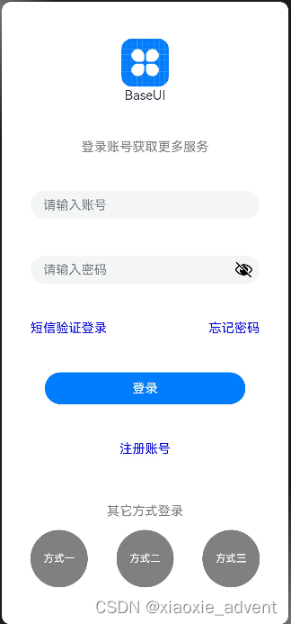

## 1、Column&Row组件

### 1.1、概述

一个页面由很多组件组成，如果需要把这些组件组织起来布局好，需要借助容器组件来实现。

容器组件是一种特殊的组件，它可以包含其他组件，而且按照一定的规律布局，一个容器组件中可以放置基础组件，也可以放置容器组件，通过多层布局的嵌套，可以布局出更丰富的页面。

### 1.2、组件介绍

#### 1.2.1、布局容器概念

线性布局容器表示按照垂直方向或水平方向排列子组件的容器，ArkTS中使用Column和Row来实现线性布局

Column：垂直方向的布局容器

Row：水平方向的布局容器

#### 1.2.2、主轴与交叉轴

主轴与交叉轴是默认存在的两个轴，它们是相互垂直的。在不同的容器中主轴的方向不一样。

**主轴**

在Column容器中按从上到下垂直方向布局，主轴是垂直方向

在Row容器中按从左到右水平方向布局，主轴是水平方向

**交叉轴**

与主轴垂直相交的轴

**组件在主轴与交叉轴上的排列方式**

Column和Row容器有丙个属性justifyContent，alignItems

justifyContent：在主轴上的对齐方式

其设置的参数是FlexAlign,它有如下几个可选值

+   Start：元素在主轴方向首端对齐，第一个元素与行首对齐，同时后续的元素与前一个对齐。
+   Cener：元素在主轴方向中心对齐，第一个元素与行首的距离以及最后一个元素与行尾距离相同
+   End：元素在主轴方向尾部对齐，最后一个元素与行尾对齐，其他元素与后一个对齐
+   SpaceBetween：元素在主轴方向均匀分配弹性元素，相邻元素之间距离相同。 第一个元素与行首对齐，最后一个元素与行尾对齐。
+   SpaceAround：元素在主轴方向均匀分配弹性元素，相邻元素之间距离相同。 第一个元素到行首的距离和最后一个元素到行尾的距离是相邻元素之间距离的一半
+   SpaceEvenly：元素在主轴方向等间距布局，无论是相邻元素还是边界元素到容器的间距都一样

alignItem：在交叉轴上的对齐方式

Column容器设置的参数类型HorizontalAlign,它有如上几种可选值

+   Start：设置子组件在水平方向上按照起始端对齐
+   Center：默认值，设置子组件在水平方向上居中对齐
+   End：设置子组件在水平方向上按照末端对齐

Row容器设置的参数类型是VerticalAlign,它有如下几种可选值

+   Top：设置子组件在垂直方向上居顶部对齐
+   Center：默认值，设置子组件在竖直方向上居中对齐
+   Bottom：设置子组件在竖直方向上居底部对齐

### 1.3、Column&Row容器的接口介绍

<table><tbody><tr><td><strong>容器组件</strong></td><td><strong>接口</strong></td></tr><tr><td>Column</td><td>Column(value?:{space?:string | number})</td></tr><tr><td>Row</td><td>Row(value?:{space?:string | number})</td></tr></tbody></table>

接口中有一个可选参数space表示子组件在主轴上的间距

实现如下页面：



```ts
@Entry
@Component
struct Login {


  build() {
    Column(){
      // 图片
      Image($r('app.media.icon'))
        .width(60)
        .height(60)
        .margin({bottom:-45})
      // appname
      Text($r('app.string.app_name'))
      // 提示语
      Text('登录账号获取更多服务')
        .fontColor(Color.Gray)
      // 账号,密码输入区
      TextInput({placeholder: '请输入账号'})
        .width('80%')
      TextInput({placeholder: '请输入密码'})
        .width('80%')
        .type(InputType.Password)
      // 两个链接信息放在一行上
      Row(){
        Text('短信验证登录')
          .fontColor(Color.Blue)
        Text('忘记密码')
          .fontColor(Color.Blue)
      }
      .width('80%')
      .justifyContent(FlexAlign.SpaceBetween)
      // 登录按钮
      Button($r('app.string.login_text'),{type: ButtonType.Capsule, stateEffect: true})
        .width('70%')
      // 注册账号
      Text('注册账号')
        .fontColor(Color.Blue)
      Text('其它方式登录')
        .fontColor(Color.Gray)
      .margin({bottom:-45})
      // 多种方式登录放在一行
      Row(){
        Button('方式一',{type: ButtonType.Circle,stateEffect: true})
          .width('20%')
          .fontColor(Color.White)
          .backgroundColor(Color.Gray)
        Button('方式二',{type: ButtonType.Circle,stateEffect: true})
          .width('20%')
          .fontColor(Color.White)
          .backgroundColor(Color.Gray)
        Button('方式三',{type: ButtonType.Circle,stateEffect: true})
          .width('20%')
          .fontColor(Color.White)
          .backgroundColor(Color.Gray)
      }
      .width('100%')
      .justifyContent(FlexAlign.SpaceEvenly)
    }
    .height('100%')
    .justifyContent(FlexAlign.SpaceEvenly)
    .alignItems(HorizontalAlign.Center) // 默认就是这种对齐方式可以不用配置
  }
}
```

## 2、List&Grid组件

### 2.1、组件介绍

在手机应用中通常会看到一些数据列表，组成这些列表的常用布局就是使用网络布局和列表布局。


### 2.2、List组件

它是最常用的滚动类容器组件，一般和子组件ListItem一起使用，List列表中的每一个列表项则对应一个ListItem组件。

#### 2.2.1、使用ForEach渲染列表

列表往往由多个列表项组成，在List组件中使用多个ListItem组件来构建列表，但这样操作会导致代码冗余，此时可以使用循环渲染（ForEach）遍历数组的方式来构建。

```ts
@Entry
@Component
struct ListTest {

  private arr: number[] = [0,1,2,3,4,5,6,7,8,9]

  build() {
    Column() {
      List({space: 10}){
        ForEach(this.arr, (item: number) => {
          ListItem(){
            Text(`${item}`)
              .width('100%')
              .height(100)
              .fontSize(20)
              .fontColor(Color.White)
              .textAlign(TextAlign.Center)
              .borderRadius(10)
              .backgroundColor(0x007DFF)
          }
        }, item => item)
      }
    }
    .padding(12)
    .height('100%')
    .backgroundColor(0xF1F3F5)
  }
}
```

List组件子组件ListItem之间默认是不会有分隔线的，如果需要在各子组件之间设置分隔线需要在List组件上使用divider属性，属性包含以下四个参数

+   strokeWidth：分割线的线宽
+   color：分割线的颜色
+   startMargin：分割线距离列表侧边起始端的距离
+   endMargin：分割线距离列表侧边结束端的距离

注意：设置这个之后会在各个ListItem组件之间加上一个分隔线，最后一个ListItem后不会加。

#### 2.2.2、List列表滚动事件监听

List组件提供了一系列事件方法用来监听列表的滚动，可根据需求监听这些事件来做一些操作

+   onScroll：列表滑动时触发，返回值scrollOffset为滑动偏移量，scrollState为当前滑动状态
+   onScrollIndex：列表滑动时触发，返回值分别为滑动起始位置索引值与滑动结束位置索引值
+   onReachStart：列表到达起始位置时触发
+   onReachEnd：列表到达结束位置时触发
+   onScrollStop：列表滑动停止时触发

```ts
@Entry
@Component
struct ListTest {

  private arr: number[] = [0,1,2,3,4,5,6,7,8,9];
  // 滑动起始索引与滑动结束过引
  @State firstIndex: number = -1;
  @State lastIndex: number = -1;
  // 滑动偏移量与状态
  @State scrollOffset: number = -1;
  @State scrollState: ScrollState = undefined;

  build() {
    Column() {
      Row(){
        Text(`滑动起始索引：${this.firstIndex === -1? '' : this.firstIndex}`)
        Text(`滑动结束索引：${this.lastIndex === -1? '' : this.lastIndex}`)
      }.width('90%')
      .justifyContent(FlexAlign.SpaceBetween)

      Row(){
        Text(`滑动偏移量：${this.scrollOffset === -1? '' : this.scrollOffset}`)
        Text(`滑动状态：${this.scrollState == undefined? '' : this.scrollState.toString()}`)
      }.width('90%')
      .justifyContent(FlexAlign.SpaceBetween)

      List({space: 10}){  // 这里{space: 10}设置了每个ListItem之间的距离
        ForEach(this.arr, (item: number) => {
          ListItem(){
            Text(`${item}`)
              .width('100%')
              .height(100)
              .fontSize(20)
              .fontColor(Color.White)
              .textAlign(TextAlign.Center)
              .borderRadius(10)
              .backgroundColor(0x007DFF)
          }
        }, item => item)
      }
      .divider({strokeWidth: 2,color: Color.Gray, startMargin: 10, endMargin: 10})
      // 滑动相关事件
      .onScrollIndex((firstIndex: number, lastIndex: number) => {
        this.firstIndex = -1;
        this.lastIndex = -1;
        this.scrollOffset = -1;
        this.scrollState = undefined;
        this.firstIndex = firstIndex;
        this.lastIndex = lastIndex;
      })
      .onScroll((scrollOffset: number, scrollState: ScrollState) =>{
        this.scrollOffset = Number(scrollOffset.toFixed(2))
        this.scrollState = scrollState;
      })
      .onReachStart(() => {
        console.info('触发List组件的onReachStart事件');
      })
      .onReachEnd(() => {
        console.info('触发List组件的onReachEnd事件');
      })
      .onScrollStop(() => {
        console.info('触发List组件的onScrollStop事件');
      })
    }
    .padding(12)
    .height('100%')
    .backgroundColor(0xF1F3F5)
  }
}
```

#### 2.2.3、设置List排列方向

在List组件中的列表默认是按垂直方向排列的。

如果我们需要改变这个默认的排列方向可以把List组件的listDirection属性设置为Axis.Horizontal

listDirection的参数类型是Axis,它支持两种选项

+   Vertical：默认值，子组件ListItem在List容器组件中呈纵向排列
+   Horizontal：子组件ListItem在List容器组件中呈横向排列

### 2.3、Grid组件的使用

Grid组件又称为网络容器，是一种网络列表，由“行”与“列”分隔单元格所组成。

Grid组件一般与子组件GridItem一起使用，其中的每一个条目则对应一个GridItem组件。

#### 2.3.1、使用ForEach渲染网格

```ts
@Entry
@Component
struct GridTest {

  // 定义一个数组
  private arr: string[] = new Array(16).fill('').map((_,index) => `item_${index}`)

  build() {
    Column(){
      Grid(){
        ForEach(this.arr,(item: string) => {
          GridItem(){
            Text(item)
              .fontSize(16)
              .fontColor(Color.White)
              .backgroundColor(0x007DFF)
              .width('100%')
              .height('100%')
              .textAlign(TextAlign.Center)
          }
        }, item => item)
      }
      .columnsTemplate('1fr 1fr 1fr 1fr')
      .rowsTemplate('1fr 1fr 1fr 1fr')
      .columnsGap(10)
      .rowsGap(10)
      .height(300)
    }
    .width('100%')
    .padding(12)
  }
}
```

上面创建了16个GridItem列表项。

columnsTemplate的值设置为'1fr 1fr 1fr 1fr'，表示网络是一个四列网络

rowsTemplate的值为’1fr 1fr 1fr 1fr‘，表示这个网格为四行网络

columnsGap设置列间距为10vp，rowsGap设置行间距为10vp

上面构建的网格布局就是一个4 \* 4的网格布局，固定的是行列数，如果我们内容较多，可以通过滚动方式来显示更多内容，则需要一个可以滚动的网络布局。只需要设置rowsTemplate和columnsTemplate中的一个即可。

## 3、Tabs组件

### 3.1、概述

在我们常用的应用中，经常会有视图内容的切换需求。比如底部有一个商城、购物车两个Tab标签页面，分别点击进入商城和购物车页面。

ArkUI开发框架提供了一种页签容器组件Tabs，使用这个组件可以很容易实现内容视图的切换。

页签容器Tabs的形式多种多样，不同的页面设计页签不一样，可以把页签放在底部、顶部或者侧边

```ts
@Entry
@Component
struct TabsTest {
  private controller: TabsController = new TabsController();

  build() {
    Column() {
      Tabs({barPosition: BarPosition.Start, controller: this.controller}){
        TabContent(){
          // 内容部分
          Column().width('100%').height('100%').backgroundColor(Color.Green)
        }
        .tabBar('green')  // 标签名称

        TabContent(){
          // 内容部分
          Column().width('100%').height('100%').backgroundColor(Color.Blue)
        }
        .tabBar('blue')  // 标签名称

        TabContent(){
          // 内容部分
          Column().width('100%').height('100%').backgroundColor(Color.Yellow)
        }
        .tabBar('yellow')  // 标签名称

        TabContent(){
          // 内容部分
          Column().width('100%').height('100%').backgroundColor(Color.Pink)
        }
        .tabBar('pink')  // 标签名称
      }
      .barWidth('100%') // TabBar宽度
      .barHeight(60)  // TabBar高度
      .width('100%')  // Tabs组件宽度
      .height('100%') // Tabs组件的高度
      .backgroundColor(0xF5F5F5)  // Tabs组件背景颜色
    }
    // .width('100%')
  }
}
```

Tabs组件包含多个TabContent，通过TabContent的tabBar属性设置TabBar的显示内容。

Tabs组件中使用width和height设置Tabs组件的宽高，而barWidth和barHeight设置TabBar的宽度和高度。

### 3.2、设置TabBar布局模式

Tabs默认是Fixed的，所以默认情况下Tabs页签是不可滑动的。在这种模式下如果页签比较多则可能会导致页签显示不全。如果把布局模式设置为Scrollable则可以实现页签的滚动。

Tabs的布局模式有如现两种

+   BarMode.Fixed：默认，所有TabBar平均分配barWidth宽度（纵向时平均分配barHeight高度），页签不可滚动
+   BarMode.Scrollable：每一个TabBar均使用实际布局宽度，超过总长度（横向Tabs的barWidth，纵向Tabs的barHeight）后可滑动

```ts
@Entry
@Component
struct TabsTest {
  private controller: TabsController = new TabsController();

  build() {
    Column() {
      Tabs({barPosition: BarPosition.Start, controller: this.controller}){
        TabContent(){
          // 内容部分
          Column().width('100%').height('100%').backgroundColor(Color.Green)
        }
        .tabBar('green')  // 标签名称

        TabContent(){
          // 内容部分
          Column().width('100%').height('100%').backgroundColor(Color.Blue)
        }
        .tabBar('blue')  // 标签名称

        TabContent(){
          // 内容部分
          Column().width('100%').height('100%').backgroundColor(Color.Yellow)
        }
        .tabBar('yellow')  // 标签名称

        TabContent(){
          // 内容部分
          Column().width('100%').height('100%').backgroundColor(Color.Pink)
        }
        .tabBar('pink')  // 标签名称
      }
      .barMode(BarMode.Scrollable)  // 设置布局模式,这里默认是BarMode.Fixed
      .barWidth('100%') // TabBar宽度
      .barHeight(60)  // TabBar高度
      .width('100%')  // Tabs组件宽度
      .height('100%') // Tabs组件的高度
      .backgroundColor(0xF5F5F5)  // Tabs组件背景颜色
    }
    // .width('100%')
  }
}
```

### 3.3、设置TabBar位置和排列方向

Tabs组件页签默认显示在顶部，可以使用Tabs组件接口中参数barPosititon设置标签位置。

页签显示位置还与vertical属性相关联，vertical属性用于设置页面的排列方向，当vertical的属性值为false（默认值）时页签横向排列，当为true时表示纵向排列

```ts
@Entry
@Component
struct TabsTest {
  private controller: TabsController = new TabsController();

  build() {
    Column() {
      Tabs({barPosition: /*BarPosition.Start*/ BarPosition.End, controller: this.controller}){
        TabContent(){
          // 内容部分
          Column().width('100%').height('100%').backgroundColor(Color.Green)
        }
        .tabBar('green')  // 标签名称

        TabContent(){
          // 内容部分
          Column().width('100%').height('100%').backgroundColor(Color.Blue)
        }
        .tabBar('blue')  // 标签名称

        TabContent(){
          // 内容部分
          Column().width('100%').height('100%').backgroundColor(Color.Yellow)
        }
        .tabBar('yellow')  // 标签名称

        TabContent(){
          // 内容部分
          Column().width('100%').height('100%').backgroundColor(Color.Pink)
        }
        .tabBar('pink')  // 标签名称
      }
      .vertical(true)
      // .barMode(BarMode.Scrollable)  // 设置布局模式,这里默认是BarMode.Fixed
      .barWidth(100) // TabBar宽度
      .barHeight(200)  // TabBar高度
      .width('100%')  // Tabs组件宽度
      .height('100%') // Tabs组件的高度
      .backgroundColor(0xF5F5F5)  // Tabs组件背景颜色
    }
    // .width('100%')
  }
}
```

Tabs组件接口中参数barPosititon加上他的属性vertical组合则可以让Tabs定位到顶部 底部 左侧 右侧。

```ts
@Entry
@Component
struct TabsTest2 {

  @State currentIndex: number = 0;
  private tabsController: TabsController = new TabsController();

  @Builder TabBuilder(title: string, targetIndex: number, selectedImg: Resource, normalImg: Resource){
    Column() {
      Image(this.currentIndex === targetIndex ? selectedImg : normalImg)
        .size({width: 32,height:32})
      Text(title)
        .fontColor(this.currentIndex === targetIndex ? '#1698CE' : '#6B6B6B')
    }
    .width('100%')
    .height(50)
    .justifyContent(FlexAlign.Center)
    .onClick(() => {
      this.currentIndex = targetIndex;
      this.tabsController.changeIndex(this.currentIndex);
    })
  }

  build() {
    Tabs({barPosition:BarPosition.End, controller: this.tabsController}){
      TabContent(){
        Column().width('100%').height('100%').backgroundColor('#00CB87')
      }
      .tabBar(this.TabBuilder('首页',0,$r('app.media.index2'),$r('app.media.index1')))

      TabContent(){
        Column().width('100%').height('100%').backgroundColor('#007DFF')
      }
      .tabBar(this.TabBuilder('我的',1,$r('app.media.my2'),$r('app.media.my1')))
    }
    .barWidth('100%')
    .barHeight(50)
    .onChange((index: number) => {
      this.currentIndex = index;
    })
  }
}
```
