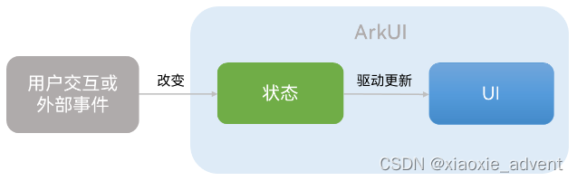

## 1、组件状态管理

### 1.1、概述

在应用中，界面一般都是动态的。界面会根据不同状态展示不一样的效果。

ArkUI作为一种声明式UI，具有状态驱动UI更新的特点，当用户进行界面交互或有外部事件引起状态改变时，状态的变会会触发组件的自动更新。这个时候南非要通过一个变量来记录状态。当改变态的时候，ArkUI则会自动更新界面中受影响的部分。



ArkUI框架提供了多种管理状态的装饰器来修饰变量，使用这些装饰器修饰的变量即称为状态变量。

在组件范围内传递的状态管理常见场景有如下一些：

<table><tbody><tr><td><strong>场景</strong></td><td><strong>装饰器</strong></td></tr><tr><td>组件内状态管理</td><td>@State</td></tr><tr><td>从父组件单向同步状态到子组件</td><td>@Prop</td></tr><tr><td>与父组件双向同步状态</td><td>@Link</td></tr><tr><td>跨组件层级双向同步状态</td><td>@Provide和@Consume</td></tr></tbody></table>

注意：在实际应用开发中，应用会根据需要封装数据模型。如果需要观察嵌套类对象属性变化，需要使用@Observed和@ObjectLink装饰器。因为上面表格中所说的装饰器只能观察到对象的第一层属性变化。

### 1.2、@State：组件内的状态管理

实际开发中由于交互，组件的内容呈现可能产生变化。当需要在组件内使用状态来控制UI的不同呈现方式时，可以使用@State装饰器。

```ts
@Entry
@Component
struct StateTest {
  private i: number = 0;
  @State text: string = '';

  build() {
    Row() {
      Column() {
        Button('切换',{type: ButtonType.Capsule, stateEffect: true})
          .width('50%')
          .fontColor(Color.White)
          .fontSize(16)
          .margin({bottom:15})
          .onClick(() => {
            if(this.i % 2 === 0) {
              this.text = 'Harmony OS';
            } else {
              this.text = '鸿蒙系统';
            }
            this.i += 1;
          })
          Text(this.text)
            .fontSize(16)
            .fontWeight(FontWeight.Bold)

      }
      .width('100%')
    }
    .height('100%')
  }
}
```

上面的例子中，text被修饰为@State，那么它就是一个组件内的状态变量，当这个值变化时，其相应的组件展示也会同时更新。

### 1.3、@Prop：从父组件单向同步状态

当子组件中的状态依赖于父组件传递过来时，需要使用@Prop装饰器，@Prop修饰的变量可以和其父组件中的状态建立单向同步关系。当父组件中状态变化时，该状态值也会更新至@Prop修饰的变量；对@Prop修饰的变量的修改不会影响其父组件中的状态。

```ts
// 子组件 sub.ets
@Component
export struct sub {
  @Prop text: string;

  build(){
    Row(){
      Column(){
        Button('修改text值',{type:ButtonType.Capsule, stateEffect: true})
          .width('50%')
          .margin({bottom:10})
          .fontSize(16)
          .onClick(()=>{
            this.text = 'text在子组件中被修改了'
          })
        Text(this.text)
          .fontSize(16)
      }.height(300)
    }.width('100%')
    .justifyContent(FlexAlign.Center)
  }
}
```

```ts
// 父组件 PropTest.ets
import { sub } from '../components/sub'
@Entry
@Component
struct PropTest {
  @State text:string = '父组件中初始值'
  build() {
    Row() {
      Column() {
        Button('在父组件中修改text',{type:ButtonType.Capsule,stateEffect:true})
          .width('80%')
          .fontSize(16)
          .margin({bottom:10})
          .onClick(()=>{
            this.text = '父组件中修改text的值';
          })
        Text(this.text)
          .fontSize(16)
          .margin({bottom:30})
        sub({text:this.text});
      }
      .width('100%')
    }
    .height('100%')
  }
}
```

 上面的例子在父组件中传递其text值给到子组件的text，当在父组件中修改这个值的时候子组件中相应的值也会同步变化，但是在子组件中修改这个值时，这个修改的结果不会同步到父组件。

@Prop修饰的变量是从父组件传递值来初始化的，所以在子组件中是不可以做本地初始化的只能接收来自父组件的值。

### 1.4、@Link：父子组件双向同步状态

如果父组件状态需要相互绑定进行双向同步时，可以使用@Link装饰。父亲组件中用于初始化子组件@Link变量的必须是在父组件中定义的状态变量。

```ts
// 子组件
@Component
export struct sub {
  @Link @Watch('OnTextChange') text: string ;
  @State Tip: string = ''

  OnTextChange(){
    if(this.text.indexOf('父组件') >= 0) {
      this.Tip = '使用父组件中的值';
    } else {
      this.Tip = '使用子组件中的值';
    }
  }

  build(){
    Row(){
      Column(){
        Button('修改text值',{type:ButtonType.Capsule, stateEffect: true})
          .width('50%')
          .margin({bottom:10})
          .fontSize(16)
          .onClick(()=>{
            this.text = 'text在子组件中被修改了'
          })
        Text(this.text)
          .fontSize(16)
          .margin({bottom:30})
        Text(`Tip：${this.Tip}`)
          .fontSize(16)

      }.height(300)
    }.width('100%')
    .justifyContent(FlexAlign.Center)
  }
}
```

```ts
// 父组件
import { sub } from '../components/sub'
@Entry
@Component
struct PropTest {
  @State text:string = '父组件中初始值'
  build() {
    Row() {
      Column() {
        Button('在父组件中修改text',{type:ButtonType.Capsule,stateEffect:true})
          .width('80%')
          .fontSize(16)
          .margin({bottom:10})
          .onClick(()=>{
            this.text = '父组件中修改text的值';
          })
        Text(this.text)
          .fontSize(16)
          .margin({bottom:30})
        sub({text:$text});
      }
      .width('100%')
    }
    .height('100%')
  }
}
```

说明:

1、在子组件中使用@Link修饰时，它就不可以本地化初始化只能通过父组件提供初始值

2、父组件中在给子组件@Link修饰变量进行初始化时需要使用$表示传递的是一个引用

3、@Watch装饰器其内提供的是一个回调函数，它监控变量的变化情况，当发生变化时会触发这个回调函数

### 1.5、@Provide和@Consume：跨组件层级双向同步状态

它们是用于与后代组件的双向数据同步，应用于数据在多层级之间的传递场景。

@Provide装饰的变量在祖先节点中，可以理解为被“提供”给后代的状态变量

@Consume装饰的变量是在后代组件中，去消费（绑定）祖先节点提供的变量

相关的特点：

+   @Provide装饰的状态变量自动对其所有后代组件可用，开发者无需多次在组件之间传递变量
+   后代组件通过@Consume去获取@Provide提供的变量，建立@Provide与@Consume之间的双向数据同步，而@State/@Link则不能在多层级父子组件之间传递
+   @Provide和@Consume可以通过相同的变量名或者相同的变量别名绑定，变量类型必须相同

```ts
// 通过相同的变量名绑定
@Provide a: number = 0;
@Consume a: number;

// 通过变量别名绑定
@Provide('a') b: number = 0;
@Consume('a') c: number;
```

```ts
// 后代子组件S2
@Component
export struct S2 {
  @Consume a:number;

  build(){
    Row(){
      Column(){
        Text('S2')
          .fontSize(16)
          .fontWeight(FontWeight.Bold)
          .margin({bottom:15})
        Text(`a = ${this.a}`)
          .fontSize(16)
          .fontWeight(FontWeight.Bold)
          .margin({bottom:15})
        Button('后代修改a的值',{type:ButtonType.Capsule,stateEffect:true})
          .width('40%')
          .onClick(() => {
            this.a += 10;
          })
      }

    }.width('100%').justifyContent(FlexAlign.Center)
  }

}
```

```ts
// 后代子组件S1
import { S2 } from './S2';
@Component
export struct S1 {
  @Consume a:number;

  build(){
    Row(){
      Column(){
        Text('S1')
          .fontSize(20)
          .fontWeight(FontWeight.Bold)
          .margin({bottom:15})
        Text(`a = ${this.a}`)
          .fontSize(16)
          .fontWeight(FontWeight.Bold)
          .margin({bottom:15})
        Divider()
        S2()
      }


    }.width('100%').justifyContent(FlexAlign.Center)

  }

}
```

```ts
父组件
import { S1 } from '../components/S1'
@Entry
@Component
struct ProvideTest {
  @Provide a: number = 100

  build() {
    Row() {
      Column() {
        Button('祖先修改a的值', {type:ButtonType.Capsule,stateEffect:true})
          .width('50%')
          .margin({bottom:15})
          .onClick(() => {
            this.a += 100;
          })
        Text(`祖先>a = ${this.a}`)
          .fontSize(24)
          .fontWeight(FontWeight.Bold)
          .margin({bottom:20})
        Divider()
        S1()

      }
      .width('100%')
    }
    .height('100%')
  }
}
```

## 2、Video组件

### 2.1、Video件用法介绍

Video组件的接口靛达形式为：

```ts
Video(value:{src?: string | Resource, currentProgressRate?:number | string | PlaybackSpeed, previewUri?: string | PixelMap | Resource, controller?: VideoController})
```

这其中包含四个可选参数：src，currentProgressRate，previewUri和controller。

+   src：视频播放源的路径，支持本地或网络路径，如果是网络地址时，需要在module.json5中申请网络权限。在使用本地资源播放时，可以使用的媒体库管理模块medialibrary来查询公共媒体库中的视频文件。
+   currentProgressRate：视频播放倍速，其参数类型是number，取值支持0.75，1.0，1.25，1.75，2.0，默认是.0
+    previewUri：表示视频未播放时的预览图片路径
+   controller：表示视频控制器

注意：支持的视频格式：mp4,mkv,webm,TS

### 2.2、Video组件属性

Video支持组件的尺寸设置、位置设置等通用属性外，Video还支持是否静音、是否自动播放、控制栏是否显示、视频显示模式及单个视频是否循环播放五个私有属性。

muted：参数类型为boolean，表示是否静音，默认值是false

autoPlay：参数类型为boolean，表示是否自动播放，默认值是false

controls：参数类型为boolean，控制视频播放的控制栏是否显示，默认值是true

objectFit：参数类型为ImageFit，设置视频显示模式。默认值是Cover

objectFit中显示模式可选值有：Contain,Cover,Auto,Fill,ScaleDown,None

默认情况一使用Cover（保持宽高比进行缩小或放大，使用图片两边都大于或等于显示边界）

loop：参数类型为boolean，控制单个视频是否循环播放。默认值是false

### 2.3、Video组件回调事件

<table><tbody><tr><td><strong>事件名称</strong></td><td><strong>功能描述</strong></td></tr><tr><td>onStart(event:() =&gt; void)</td><td>播放时触发这个事件</td></tr><tr><td>onPause(event:()=&gt; void)</td><td>暂停时触发这个事件</td></tr><tr><td>onFinish(event:()=&gt; void)</td><td>播放结束时触发这个事件</td></tr><tr><td>onError(event:()=&gt; void)</td><td>播放失败时触发这个事件</td></tr><tr><td>onPrepared(callback:(event?:{duration:number}) =&gt; void)</td><td>视频准备完成时触发这个事件，通过duration可以获取视频时长s</td></tr><tr><td>onSeeking(callback:(event?:{time:number}) =&gt; void)</td><td>操作进度条过程时上报时间信息，单位为s</td></tr><tr><td>onSeeked(callback:(event?:{time:number}) =&gt; void)</td><td>操作进度条完成后上报时间信息，单位为s</td></tr><tr><td>onUpdate(callback:(event?:{time:number}) =&gt; void)</td><td>播放进度变化时触发这个事件，单位为s,更新时间间隔为250ms</td></tr><tr><td>onFullscreenChange(callback:(event?:{fullscreen:boolean}) =&gt; void)</td><td>在全屏和非全屏播放状态之间切换时触发这个事件</td></tr></tbody></table>

### 2.4、自定义控制器

Video组件的原生控制器样式相对固定，当需要对其做一些特殊的显示时则可能无法满足，此时则可以自下义控制器。

可以使用Row容器实现整理体的布局，Text组件来显示起始时间和视频总时长，最后通过Slider组件来实现视频进度条的效果

```ts
@Component
export struct VidoSlider {
    ...
    
    build() {
        Row(...) {
            Image(...)
            Text(...)
            Slider(...)
            Text(...)
        }

    ...
    }
}
```

## 3、弹窗

在日常使用应用时，在做一些风险或敏感操作时，应用会给出一个弹框提示，提示用户是否需要执行这些风险操作。

弹窗是一种模态框，常用来提示用户当前需要关注的信息或操作。由于是模态的用户无法操作其它界面内容。在非必要的情况下不推荐使用弹窗，这会打断用户交互的过程。

ArkUI提供了两类弹窗

+   确认类：比如警告弹窗 AlertDialog
+   选择类：包含文本选择窗TextPickerDialog、日期选择窗DatePickerDialog、时间滑动选择窗TimePickerDialog...

除了上述的一些弹框，如不满足业务上的需求，还可以自定义弹窗CustomDialog

### 3.1、警告窗

AlertDialog，它由三部分组件

1.  标题：可选择
2.  内容：显示提示信息
3.  操作按钮：用户做确认或取消等操作


```ts
@Entry
@Component
struct DialogTest {

  build() {
    Row() {
      Column() {
        Button('点击显示弹窗',{type:ButtonType.Capsule, stateEffect:true})
          .width('50%')
          .fontSize(16)
          .onClick(() => {
            AlertDialog.show(
              {
                title: '提示',  // 标题
                message: '确定要删除所选择的记录?',  // 内容
                autoCancel: false,  // 点击遮罩层是否关闭弹窗
                alignment: DialogAlignment.Bottom,  // 弹窗在竖直方向的对齐方式
                offset: {dx: 0, dy: -20}, // 弹窗相对alignment位置的偏移量
                primaryButton: {
                  value: '取消',
                  action: () => {
                    console.info('点击了弹窗的取消按钮');
                  }
                },
                secondaryButton: {
                  value: '删除',
                  fontColor: '#D94838',
                  action: () => {
                    console.info('点击了弹窗的删除按钮');
                  }
                },
                cancel: () => {
                  console.info('点击遮罩层关闭dailog时回调');
                }
              }
            )
          })

      }
      .width('100%')
    }
    .height('100%')
  }
}
```

 上面这个弹框中有两个按钮，也可以构建只包含一个按钮的确认弹框，这个时候使用confirm响应和按钮回调

```ts
@Entry
@Component
struct DialogTest {

  build() {
    Row() {
      Column() {
        Button('点击显示弹窗',{type:ButtonType.Capsule, stateEffect:true})
          .width('50%')
          .fontSize(16)
          .onClick(() => {
            AlertDialog.show(
              {
                title: '提示',  // 标题
                message: '确定要删除所选择的记录?',  // 内容
                autoCancel: false,  // 点击遮罩层是否关闭弹窗
                alignment: DialogAlignment.Bottom,  // 弹窗在竖直方向的对齐方式
                offset: {dx: 0, dy: -20}, // 弹窗相对alignment位置的偏移量
                /*
                primaryButton: {
                  value: '取消',
                  action: () => {
                    console.info('点击了弹窗的取消按钮');
                  }
                },
                secondaryButton: {
                  value: '删除',
                  fontColor: '#D94838',
                  action: () => {
                    console.info('点击了弹窗的删除按钮');
                  }
                },
                */
                confirm: {
                  value: '确认',
                  fontColor: Color.Blue,
                  action: () => {
                    console.info('点击了确认按钮');
                  }
                },

                cancel: () => {
                  console.info('点击遮罩层关闭dailog时回调');
                }
              }
            )
          })

      }
      .width('100%')
    }
    .height('100%')
  }
}
```

### 3.2、选择类弹窗

选择类弹窗用于方便用户选择相关数据

#### 3.2.1、文本选择弹窗

TextPickerDialog，它是文本滑动选择器弹窗，根据指定的选择范围创建文本选择器，展示在弹窗上。

```ts
@Entry
@Component
struct TextPickerTest {
  @State text: string = ''
  @State index: number = 0;
  private lans: string[] = ['C','C++','Java','Typescript','ArkUI']

  build() {
    Column() {
      Text(`你的选择是：${this.text}`)
        .fontSize(18)
        .fontWeight(FontWeight.Bold)
        .fontColor('#4169E1')
        .margin({bottom:15})
      Button('请选择语言', {type:ButtonType.Capsule,stateEffect:true})
        .margin({bottom:15})
        .width('50%')
        .onClick(() => {
          TextPickerDialog.show(
            {
              range: this.lans, // 设置文本选择器的选择范围
              selected: this.index,  // 设置初始选中项的索引值
              onAccept: (value: TextPickerResult) => {  // 点击弹窗中的“确定”按钮时触发该回调
                this.text = value.value;
                this.index = value.index;
                console.info('TextPickerDialog:onAccept()' + JSON.stringify(value));
              },
              onCancel: () => { // 点击弹窗中的“取消”按钮时触发该回调
                console.info('TextPickerDialog:onCancel()');
              },
              onChange: (value: TextPickerResult) => {  //  滑动弹窗中的选择器使当前选中项改变时触发该回调
                console.info('TextPickerDialog:onChange' + JSON.stringify(value))
              }
            }
          )
        })
    }
    .width('100%')
    .height('100%')
    .justifyContent(FlexAlign.Center)
  }
}
```

#### 3.2.2、日期选择弹窗

DatePickerDialog，它是日期滑动选择器弹窗，根据指定的日期范围创建日期滑动选择器，展示在弹窗上。

```ts
@Entry
@Component
struct DatePickerTest {
  @State selectedDate: string = ''

  build() {
    Row() {
      Column() {
        Text(`你选择的日期是:${this.selectedDate}`)
          .fontSize(18)
          .fontWeight(FontWeight.Bold)
          .fontColor('#4169E1')
          .margin({ bottom: 15 })
        Button('选择日期', { type: ButtonType.Capsule, stateEffect: true })
          .width('50%')
          .margin({ bottom: 15 })
          .onClick(() => {
            DatePickerDialog.show({
              start: new Date("1900-1-1"), // 设置选择器的起始日期
              end: new Date("2023-12-31"), // 设置选择器的结束日期
              selected: this.selectedDate === '' ? new Date() : new Date(this.selectedDate), // 设置当前选中的日期
              lunar: false,
              onAccept: (value: DatePickerResult) => { // 点击弹窗中的“确定”按钮时触发该回调
                this.selectedDate = `${value.year}-${value.month + 1}-${value.day}`
                console.info("DatePickerDialog:onAccept()" + JSON.stringify(value))
              },
              onCancel: () => { // 点击弹窗中的“取消”按钮时触发该回调
                console.info("DatePickerDialog:onCancel()")
              },
              onChange: (value: DatePickerResult) => { // 滑动弹窗中的滑动选择器使当前选中项改变时触发该回调
                console.info("DatePickerDialog:onChange()" + JSON.stringify(value))
              }
            })
          })
      }
      .width('100%')
    }
    .height('100%')
  }
}
```

### 3.3、自定义弹窗

在自定义弹窗中可以自定义弹窗内容，用来构建丰富的弹窗界面。

自定义弹窗可以通过装饰器@CustomDialog定义组件来实现，然后结合CustomDialogController来控制自定义弹窗显示和隐藏。

在resources/base/element/下新增json文件：stringarray.json

```ts
{
  "strarray": [
    {
      "name": "hobbies_data",
      "value": [
        {
          "value": "Soccer"
        },
        {
          "value": "Badminton"
        },
        {
          "value": "Travelling"
        }
      ]
    }
  ]
}
```

同步在en\_US,zh\_CN目录下也需要新增

ets目录下新增目录viewmodel目录，并在其下新增一个HobbyBean的数据结构

```ts
export default class HobbyBean {
  label: string;
  isChecked: boolean;

  constructor(label:string, isChecked:boolean) {
    this.label = label;
    this.isChecked = isChecked
  }
}
```

ets目录下新增目录components,并在其下新增CustomDialogWidget.ets

```ts
import HobbyBean from '../viewmodel/HobbyBean'
@CustomDialog
export struct CustomDialogWidget {
  @State hobbyBeans: HobbyBean[] = [];
  @Link hobbies: string;
  private controller: CustomDialogController;

  aboutToAppear(){
    let context: Context = getContext(this);
    let manager = context.resourceManager;
    manager.getStringArrayValue($r('app.strarray.hobbies_data'),(error, hobbyResult)=>{
      hobbyResult.forEach((hobbyItem:string) =>{
        let hobbyBean = new HobbyBean(hobbyItem,false);
        this.hobbyBeans.push(hobbyBean);
      })
    })
  }

  setHobbiesValue(hobbyBeans: HobbyBean[]) {
    let hobbiesText: string = '';
    hobbiesText = hobbyBeans.filter((isCheckItem: HobbyBean) => isCheckItem?.isChecked)
      .map((checkedItem:HobbyBean) => {
        return checkedItem.label;
      }).join(',');
    this.hobbies = hobbiesText;
  }

  build(){
    Column(){
      Text('兴趣爱好')
        .fontSize(16)
        .fontWeight(FontWeight.Bold)
        .margin({bottom:10})
      .textAlign(TextAlign.Start)

      List() {
        ForEach(this.hobbyBeans,(itemHobby:HobbyBean) => {
          ListItem(){
            Row(){
              Text(itemHobby.label)
                .fontSize(14)
              Toggle({type: ToggleType.Checkbox,isOn:false})
                .onChange((isCheck)=>{
                  itemHobby.isChecked = isCheck;
                })
            }
          }
        },itemHobby => itemHobby.label)
      }
      Row() {
        Button('取消')
          .onClick(() => {
            this.controller.close();
          }).width('40%')
        Button('确定')
          .onClick(() => {
            this.setHobbiesValue(this.hobbyBeans);
            this.controller.close();
          })
          .width('40%')
      }
    }
    .width('95%')
  }
}
```

pages目录下新增一个页面：CustomDialogTest

```ts
import { CustomDialogWidget } from '../components/CustomDialogWidget'
import HobbyBean from '../viewmodel/HobbyBean';
@Entry
@Component
struct CustomDialogTest {
  @State hobbies:string = '';
  customDialogController: CustomDialogController = new CustomDialogController({
    builder: CustomDialogWidget({
      hobbies:$hobbies
    }),
    alignment: DialogAlignment.Bottom,
    customStyle: true,
    offset: { dx: 0,dy: -20 }
  });


  setHobbiesValue(hobbyArray: HobbyBean[]) {}

  build() {
    Row() {
      Column(){
        Text(this.hobbies)
          .fontSize(16)
          .margin({bottom:15})
        Button('点击打开')
          .onClick(()=>{
            this.customDialogController.open();
          })
      }
      .width('100%')
    }
    .height('100%')
  }
}
```
