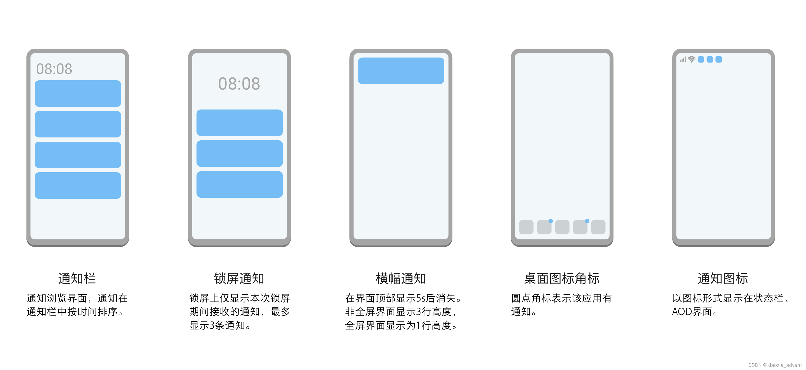
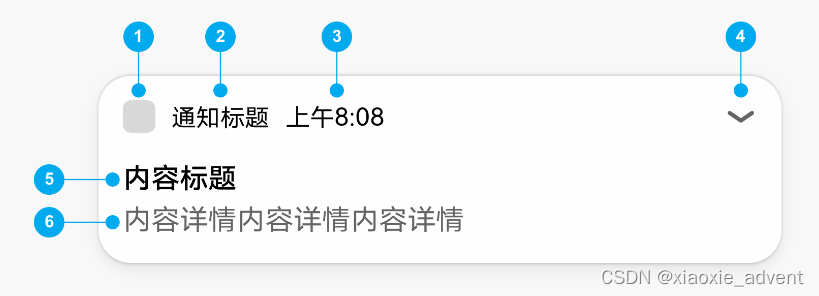
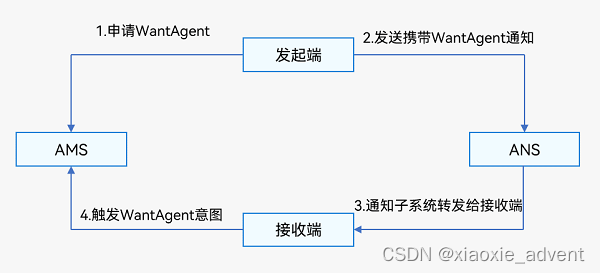

## 1、通知概述

### 1.1、简介

应用可以通过通知接口发送通知消息，终端用户可以通过通知栏查看通知内容，也可以点击通知来打开应用。

通知使用的的常见场景：

+   显示接收到的短消息、即使消息...
+   显示应用推送消息
+   显示当前正在进行的事件，如下载等

HarmonyOS通过ANS(Advanced Notification Service,通知系统服务)对通知消息进行管理，支持多种通知类型。

### 1.2、通知的业务流程


业务流程中由通知子系统、通知发送端、通知订阅组件

一条通知从通知发送端产生，发送到通知子系统，然后再由通知子系统分发给通知订阅端。

### 1.3、通知消息的表现形式

### 

###  1.4、通知结构



1、通知小图图标：表示通知的功能与类型

2、通知名称：应用名称或者功能名称

3、时间：发送通知的时间，系统默认显示

4、展示图标：用来展开被折叠的内容和按钮，如果没有折叠的内容和按钮，则不显示这个图标

5、内容标题

6、内容详情

## 2、基础类型通知

基础类型通知主要应用于发送短信息、提示信息、广告推送...，它支持普通文本类型、长文本类型、图片类型。

普通文本类型                NOTIFICATION\_CONTENT\_BASIC\_TEXT

长文本类型                    NOTIFICATION\_CONTENT\_LONG\_TEXT

多行文本类型                NOTIFICATION\_CONTENT\_MULTILINE

图片类型                       NOTIFICATION\_CONTENT\_PICTURE

### 2.1、相关接口

<table><tbody><tr><td><strong>接口名</strong></td><td><strong>描述</strong></td></tr><tr><td>publish(request:NotificatioinRequest,callback:AsyncCallback&lt;void&gt;):void</td><td>发布通知</td></tr><tr><td>cancel(id:number,label:string,callback:AsyncCallback&lt;void&gt;):void</td><td>取消指定的通知，通过id来判断是哪个通知</td></tr><tr><td>cancelAll(callback:AsycCallback&lt;void&gt;):void</td><td>取消所有该应用发布的通知</td></tr></tbody></table>

### 2.2、开发步骤

1、导入模块

```ts
import NotificationManager from '@ohos.notificationManager';

```

2、构造NotificationRequest对象，发布通知

```ts
import notificationManager from '@ohos.notificationManager'
import Prompt from '@system.prompt'
import image from '@ohos.multimedia.image';

@Entry
@Component
struct Index {

  publishNotification() {
    let notificationRequest: notificationManager.NotificationRequest = {
      id: 0,
      slotType: notificationManager.SlotType.SERVICE_INFORMATION,
      content: {
        contentType: notificationManager.ContentType.NOTIFICATION_CONTENT_BASIC_TEXT,
        normal:{
          title: '通知标题',
          text: '这是一个通知的消息内容',
          additionalText: '通知附加内容'  // 附加内容是对通知内容的补充
        }
      }
    };
    notificationManager.publish(notificationRequest).then(() => {
      // 发布通知
      Prompt.showToast({
        message: '发布通知消息成功',
        duration: 2000
      })
    }).catch((err) => {
      Prompt.showToast({
        message: `发布通知失败，失败代码：${err.code},失败原因：${err.message}`,
        duration: 2000
      })
    });
  }

  /* 多行文本通知 */
  publicNotification1(){
    let notificationRequest:notificationManager.NotificationRequest = {
      id: 1,
      content: {
        contentType: notificationManager.ContentType.NOTIFICATION_CONTENT_MULTILINE,
        multiLine: {
          title: '通知标题',
          text: '通知的内容简介',
          briefText: 'briefText内容',
          longTitle: 'longTitle内容',
          lines: ['第一行内容','第二行内容','第三行内容']
        }
      }
    };
    notificationManager.publish(notificationRequest).then(() => {
      // 发布通知
      Prompt.showToast({
        message: '发布通知消息成功',
        duration: 2000
      })
    }).catch((err) => {
      Prompt.showToast({
        message: `发布通知失败，失败代码：${err.code},失败原因：${err.message}`,
        duration: 2000
      })
    });
  }

  /* 图片通知 */
  async publishPictureNotification(){
    // 把资源图片转为PixelMap对象
    let resourceManager = getContext(this).resourceManager;
    let imageArray = await resourceManager.getMediaContent($r('app.media.image2').id);
    let imageResource = image.createImageSource(imageArray.buffer);
    let pixelMap = await imageResource.createPixelMap();

    // 描述通知信息
    let notificationRequest:notificationManager.NotificationRequest = {
      id: 2,
      content: {
        contentType: notificationManager.ContentType.NOTIFICATION_CONTENT_PICTURE,
        picture: {
          title: '通知消息的标题',
          text: '展开查看详情，通知内容',
          expandedTitle: '展开时的内容标题',
          briefText: '这里是通知的概要内容，对通知的总结',
          picture: pixelMap
        }
      }
    };

    notificationManager.publish(notificationRequest).then(() => {
      // 发布通知消息
      Prompt.showToast({
        message: '发布通知消息成功',
        duration: 2000
      })
    }).catch((err) => {
      Prompt.showToast({
        message: `发布通知失败，失败代码：${err.code},失败原因：${err.message}`,
        duration: 2000
      })
    });
  }

  build() {
    Row() {
      Column() {
        Button('发送通知')
          .width('50%')
          .margin({bottom:10})
          .onClick(() => {
            this.publishNotification()
          })
        Button('发送多行文本通知')
          .width('50%')
          .margin({bottom:10})
          .onClick(() => {
            this.publicNotification1()
          })
        Button('发送图片通知')
          .width('50%')
          .margin({bottom:10})
          .onClick(() => {
            this.publishPictureNotification()
          })
      }
      .width('100%')
    }
    .height('100%')
  }
}
```

## 3、进度条类型通知

进度条通知也是常见的通知类型，主要应用于文件下载、事务处理进度的显示。

HarmonyOS提供了进度条模板，发布通知应用设置好进度条模板的属性值，通过通知子系统发送到通知栏显示。

当前系统模板仅支持进度条模板，通知模板NotificationTemplate中的data参数为用户自定义数据，用来显示模块相关的数据。

### 3.1、相关接口

isSupportTemplate(templateName: string,callback:AsyncCallback<boolean>) : void        查询模板是否存在

### 3.2、开发步骤

1、导入模块

```ts
import NotificationManager from '@ohos.notificationManager'
```

2、查询系统是否支持进度条模板

```ts
NotificationManager.isSupportTemplate('downloadTemplate').then((data) => {
    let isSupportTpl: boolean = data;    // 这里为true则表示支持模板
    // ...
}).catch((err) => {
    console.error('查询失败')
})
```

3、在第2步之后，再构造进度条模板对象，发布通知

```ts
import notificationManager from '@ohos.notificationManager'
import Prompt from '@system.prompt'

@Entry
@Component
struct ProgressNotice {

  async publishProgressNotification() {
    let isSupportTpl: boolean;
    await notificationManager.isSupportTemplate('downloadTemplate').then((data) => {
      isSupportTpl = data;
    }).catch((err) => {
      Prompt.showToast({
        message: `判断是否支持进度条模板时报错,error[${err}]`,
        duration: 2000
      })
    })
    if(isSupportTpl) {
      // 构造模板
      let template = {
        name: 'downloadTemplate',
        data: {
          progressValue: 60, // 当前进度值
          progressMaxValue: 100 // 最大进度值
        }
      };

      let notificationRequest: notificationManager.NotificationRequest = {
        // id: 100, // 这里的id可以不传
        content : {
          contentType: notificationManager.ContentType.NOTIFICATION_CONTENT_BASIC_TEXT,
          normal: {
            title: '文件下载：鸿蒙学习手册.pdf',
            text: '下载进度',
            additionalText: '60%'
          }
        },
        template: template
      };

      // 发布通知
      notificationManager.publish(notificationRequest).then(() => {
        Prompt.showToast({
          message: `发布通知成功！`,
          duration: 2000
        })
      }).catch((err) => {
        Prompt.showToast({
          message: `发布通知失败,error[${err}]`,
          duration: 2000
        })
      })

    } else {
      Prompt.showToast({
        message: '不支持downloadTemplate进度条通知模板',
        duration: 2000
      })
    }

  }

  build() {
    Row() {
      Column() {
        Button('发送进度条通知')
          .width('50%')
          .onClick(()=>{
            this.publishProgressNotification()
          })
      }
      .width('100%')
    }
    .height('100%')
  }
}
```

## 4、通知其它配置

### 4.1、设置通道通知

设置通道知，可以让通知有不同的表现形式，如社交类型的通知是横幅显示的，并且有提示音。但一般的通知则不会横幅显示，可以使用slotType来实现。

+   SlotType.SOCIAL\_COMMUNICATION：社交 类型，状态栏中显示通知图标，有横幅提示音
+   SlotType.SERVICE\_INFORMATION：服务类型，在状态栏中显示通知图标，没有横幅但有提示音
+   SlotType.CONTENT\_INFORMATION：内容类型，状态栏中显示通知图标，没有横幅和提示音
+   SlotType.OTHER\_TYPE：其它类型，状态栏中不显示通知图标，没有横幅和提示音

```ts
import image from '@ohos.multimedia.image';
import notificationManager from '@ohos.notificationManager';
import Prompt from '@system.prompt';
@Entry
@Component
struct SlotTypeTest {
  async publishSlotTypeNotification(){
    let imageArray = await getContext(this).resourceManager.getMediaContent($r('app.media.tx').id);
    let imageResource = image.createImageSource(imageArray.buffer);
    let opts = {desiredSize: {height: 72, width: 72}};
    let largePixelMap = await imageResource.createPixelMap(opts);

    let notificationRequest: notificationManager.NotificationRequest = {
      id: 1,
      content: {
        contentType: notificationManager.ContentType.NOTIFICATION_CONTENT_BASIC_TEXT,
        normal:{
          title: '赵子龙',
          text: '等会大战三百回合~~'
        }
      },
      slotType:notificationManager.SlotType.SOCIAL_COMMUNICATION,
      largeIcon: largePixelMap  // 通知大图标
    };

    notificationManager.publish(notificationRequest).then(() => {
      // 发布通知
      Prompt.showToast({
        message: '发布通知消息成功',
        duration: 2000
      })
    }).catch((err) => {
      Prompt.showToast({
        message: `发布通知失败，失败代码：${err.code},失败原因：${err.message}`,
        duration: 2000
      })
    });
  }

  build() {
    Row() {
      Column() {
        Button('发送通知')
          .width('50%')
          .onClick(() => {
            this.publishSlotTypeNotification()
          })
      }
      .width('100%')
    }
    .height('100%')
  }
}
```

## 5、为通知添加行为意图

WantAgent提供了封装行为意图的能力，这里的行为意图能力就要是指拉起指定的应用组件及发布公共事件等能力。

HarmonyOS支持以通知的形式，把WantAgent从发布方传递到接收方，从而在接收方触发WantAgent中指定的意图。



为通知添加行为意图的实现方式如上图所示，发布通知的应用向组件管理服务AMS（Ability Manager Service）申请WantAgent，然后随其他通知信息 一起发送给桌面，当用户在桌面通知栏上点击通知时，触发WantAgent动作。

### 5.1、相关接口

<table><tbody><tr><td><strong>接口名</strong></td><td><strong>描述</strong></td></tr><tr><td>getWantAgent(info: WantAgentInfo, callback:AsyncCallback&lt;WantAgent&gt;):void</td><td>创建WantAgent</td></tr><tr><td>trigger(agent:WantAgent, triggerInfo:TrggerInfo,callback?:Callback&lt;CompleteData&gt;):void</td><td>触发WantAgent意图</td></tr><tr><td>cancel(agent:WantAgent,callback:AsyncCallback&lt;void&gt;):void</td><td>取消WantAgent</td></tr><tr><td>getWant(agent:WantAgent,callback:AsyncCallback&lt;Want&gt;):void</td><td>获取WantAgent的want</td></tr><tr><td>equal(agent:WantAgent,otherAgent:WantAgent,callback:AsyncCallback&lt;boolean&gt;):void</td><td>判断两个WantAgent实例是否相等</td></tr></tbody></table>

### 5.2、开发步骤

1、导入模块

```ts
import NotificationManager from '@ohos.notificationManager';
import wantAgent from '@ohos.app.ability.wantAgent';
```

2、发送通知

```ts
import notificationManager from '@ohos.notificationManager'
import wantAgent from '@ohos.wantAgent';
import Prompt from '@system.prompt';

let wantAgentObj = null;  // 保存创建成功的wantAgent对象，后续使用其完成触发的动作
// 通过WantAgentInfo的operationType设置动作类型
let wantAgentInfo = {
  wants: [
    {
      deviceId: '', // 这里为空表示是本设备
      bundleName: 'com.xiaoxie', // 在app.json5中查找
      // moduleName: 'entry', // 在module.json5中查找，如果待启动的ability在同一个module则可以不写
      abilityName: 'MyAbility', // 待启动ability的名称，在module.json5中查找
    }
  ],
  operationType: wantAgent.OperationType.START_ABILITY,
  requestCode: 0,
  wantAgentFlags:[wantAgent.WantAgentFlags.CONSTANT_FLAG]
}

@Entry
@Component
struct ButtonNotice {

  async publishButtonNotice(){

    // 创建WantAgent
    await wantAgent.getWantAgent(wantAgentInfo).then((data) => {
      wantAgentObj = data;
    }).catch((err) => {
      Prompt.showToast({
        message: `创建wangAgent失败，${JSON.stringify(err)}`
      })
    })

    let notificationRequest:notificationManager.NotificationRequest = {
      id: 1,
      slotType: notificationManager.SlotType.SOCIAL_COMMUNICATION,  // 这个是社交类型的通知
      content: {
        contentType: notificationManager.ContentType.NOTIFICATION_CONTENT_BASIC_TEXT,
        normal: {
          title: '赵子龙',
          text: '吃饭了吗?'
        }
      },
      actionButtons: [
        {
          title: '回复',
          wantAgent: wantAgentObj
        }
      ]
    };

    // 发布WantAgent通知
    notificationManager.publish(notificationRequest,(err) => {
      if(err) {
        Prompt.showToast({
          message: '发布通知失败！',
          duration: 2000
        })
      } else {
        Prompt.showToast({
          message: '发布通知成功！',
          duration: 2000
        })
      }
    })
  }

  build() {
    Row() {
      Column() {
        Button('发送通知')
          .width('50%')
          .onClick(() => {
            this.publishButtonNotice()
          })
      }
      .width('100%')
    }
    .height('100%')
  }
}
```

## 6、后台代理提醒

当应用需要在指定时刻向用户发送一些业务提醒通知时，HarmonyOS提供后台代理提醒功能，在应用退居后台或退出后，计时和提醒通知功能被系统后台代理接管。

后台代理提醒业务类型：

1、倒计时类：基于倒计时的提醒功能，适用于短时的计时提醒业务

2、日历类：基于日历的提醒功能，适用于较长时间的提醒业务

3、闹钟类：基于时钟的提醒功能，适用于指定时刻的提醒业务

后台代理提醒就是由系统后台进程代理应用的提醒功能。后台代理提醒服务通过reminderAgentManager模块提醒定义、创建提醒、取消提醒...


 提醒使用的前置条件

1、添加后台代理提醒的使用权限:**ohos.permission.PUBLISH\_AGENT\_REMINDER**

2、导入后台代理提醒reminderAgentManager模块

```ts
import reminderAgent from '@ohos.reminderAgentManager';
```

```ts
import reminderAgent from '@ohos.reminderAgentManager';
import Prompt from '@system.prompt';


@Entry
@Component
struct ReminderTest {
  @State message: string = 'Hello World';
  reminderId:number;

  myReminderAgent(){
    let reminderRequest:reminderAgent.ReminderRequestAlarm = {
      reminderType: reminderAgent.ReminderType.REMINDER_TYPE_ALARM,
      hour: 12,
      minute: 23,
      daysOfWeek: [1,2,3,4,5,6,7],  // 星期1~7
      title: '提醒信息 title',
      ringDuration: 10, // 响铃时长
      snoozeTimes: 1, // 延迟提醒次数，默认是0
      timeInterval: 60*60*5,  // 延迟提醒间隔时间
      actionButton: [
        {
          title: '关闭',
          type: reminderAgent.ActionButtonType.ACTION_BUTTON_TYPE_CLOSE
        }
      ]
    /*,
      wantAgent: { // 提醒到达时自动拉起的目标ability
        pkgName: 'com.xiaoxie',
        abilityName: 'MyAbility'
      }*/
    };
    reminderAgent.publishReminder(reminderRequest,(err,reminderId) => {
      if(err) {
        Prompt.showToast({
          message: '发布提醒失败',
          duration: 2000
        })
        return;
      }
      Prompt.showToast({
        message: '发布提醒成功！id = ' + reminderId,
        duration: 2000
      })
      this.reminderId = reminderId;
    })
  }

  build() {
    Row() {
      Column() {
        Text(this.message)
          .fontSize(20)
          .fontWeight(FontWeight.Bold)
          .margin({bottom:15})
        Button('发布提醒')
          .width('50%')
          .onClick(() => {
            this.myReminderAgent()
          })
      }
      .width('100%')
    }
    .height('100%')
  }
}
```

在本地模拟器上未成功，使用远程模拟器可以实现这个功能
