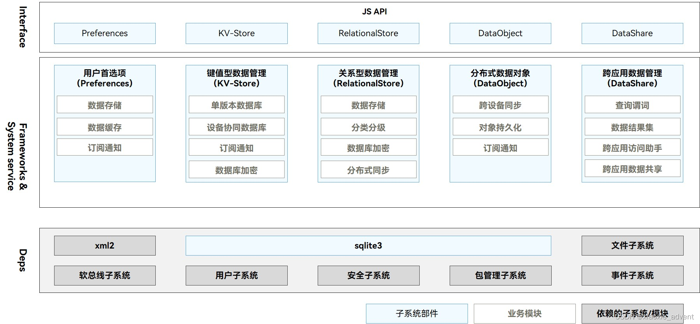
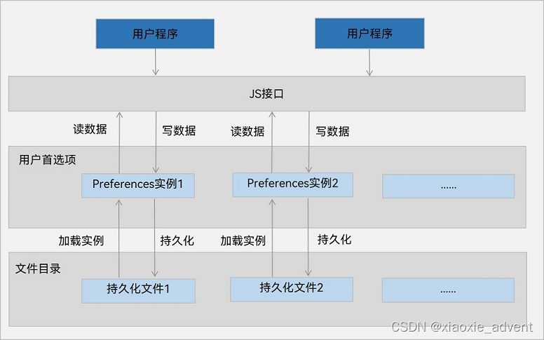
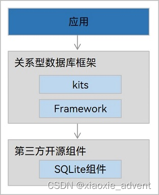

## 1、概述

### 1.1、功能简介

数据管理为开发者提供数据存储、数据管理能力。

它分为两个部分：

+   **数据存储：**提供通用数据持久化能力，根据数据特点，分为用户首选项、键值型数据库和关系型数据库。
+   **数据管理：**提供高效的数据管理能力，包括权限管理、数据备分恢复、数据共享等

注：应用创建的数据库，都保存到应用少盒，当应用卸载时，数据库也会自动删除。

### 1.2、运作机制

数据管理模块包括用户首选项、键值型数据管理、关系型数据管理、分布式数据对象和跨应用数据管理。

Interface接口层提供标准JS API接口

Frameworks&System service层负责实现部件数据存储功能

另外还有一些SQLite和其它子系统的依赖



+   **用户首选项：**Preferences， 提供轻量级配置数据持久化能力，支持订阅数据变化的通知能力。不支持分布式同步，常常用来保存应用配置信息、用户偏好设置等
+   **键值型数据管理：**KV-Store，提供了键值型数据库的读写、加密、手动备份能力。暂不支持分布式功能。
+   **关系型数据管理：**RelationalStore，提供了关系型数据库的增删改查、加密、手动备份能力。暂不支持分布式功能。
+   **分布式数据对象：**DataObject，独立提供地象型结构数据的分布式能力，暂不支持分布式功能。
+   **跨应用数据管理：**DataShare，提供了向其他应用共享以及管理其数据的方法。仅系统应用可用。

## 2、应用数据持久化概述

应用数据持久化，是指应用将内存中的数据通过文件或数据库的形式保存到设备上。内存中的数据形态通常是任意的数据结构或数据对象，存储介质上的数据形态可能是文本、数据库、二进制文件等。

HarmonyOS标准系统支持典型的存储数据形态有：用户首选项、键值型数据库、关系型数据库

## 3、用户首选项实现数据持久化

用户首选项为应用提供key-value键值型的数据处理能力，支持应用持久化轻量级数据，并对其进行修改和查询。

Preferences不适合存放过多数据，适用的场景一般为应用保存用户个性化的配置。

### 3.1、运作机制



用户程序通过JS接口调用用户首选项读写对应的数据文件。开发者可以把用户首选项持久化文件的内容加载到Preferences实例，每个文件唯一对应到一个Preferences实例，系统会通过静态容器把这个实例存储在内存中，直到主动从内存中移除这个实例或删除这个文件。

### 3.2、使用约束

1、key键为string类型，要求非空且长度不超过80个字节

2、value值为string类型时可以为空，不为空时长度不超过8192个字节

3、内存会随着存储数据量的增大而增大，所以存储的数据应该是轻量级的，建议存储的数据不要超过1万条

### 3.3、相关接口说明

接口大部分都是异步接口，异步接口都有callback和Promise两种返回形式。以下为callback为例说明

<table><tbody><tr><td><strong>接口名称</strong></td><td><strong>描述</strong></td></tr><tr><td>getPreferences(context:Context,name:string,callback:AsyncCallback&lt;Preferences&gt;):void</td><td>获取Preferences 实例</td></tr><tr><td>put(key:string,value:valueType,callback:AsyncCallback&lt;void&gt;):void</td><td>把数据写入Preferences实例，可以通过flush把实例进行持&nbsp;久化</td></tr><tr><td>has(key:string,callback:AsyncCallback&lt;boolean&gt;):void</td><td>检查实例中是否包含指定的key的存储键值对，给定的key不可以为空</td></tr><tr><td>get(key:string,defValue:valueType,callback:AsyncCallback&lt;valueType&gt;):void</td><td>获取指定键对应的值，如果值为null或者非默认值类型，返回默认数据defValue</td></tr><tr><td>delete(key:string,callback:AsyncCallback&lt;void&gt;):void</td><td>从实例中删除指定key的存储键值对</td></tr><tr><td>flush(callback:AsyncCallback&lt;void&gt;):void</td><td>把当前实例中的数据异步存储到用户首选项持久化文件中</td></tr><tr><td>on(type:'change',callback?:Callback&lt;{key:string}&gt;):void</td><td>订阅数据变更，订阅的key的值发生变化，在执行flush方法后，触发callback回调</td></tr><tr><td>off(type:'change',callback?:Callback&lt;{key:string}&gt;):void</td><td>取消订阅数据变更</td></tr><tr><td>deletePreferences(context:Context,name:string,callback:AsyncCallback&lt;void&gt;):void</td><td>从内存中移除指定实例，如果这个实例有对应的持久化文件则同时会把持外化文件删除</td></tr></tbody></table>

### 3.4、开发步骤

**1、导入用户首选项模块**

```ts
import dataPreferences from '@ohos.data.preferences';
```

 **2、获取Preferences实例，读取指定文件，把数据加载到Preferences实例，用于数据操作**

```ts
import UIAbility from '@ohos.app.ability.UIAbility';
import hilog from '@ohos.hilog';
import window from '@ohos.window';
import dataPreferences from '@ohos.data.preferences';

export default class EntryAbility extends UIAbility {

  onCreate(want, launchParam) {

  }

  onDestroy() {

  }

  onWindowStageCreate(windowStage: window.WindowStage) {
    // Main window is created, set main page for this ability
    try{
      dataPreferences.getPreferences(this.context,'mystore',(err,preferences) => {
        if(err) {
          console.error(`Failed to get preferences. Code:${err.code},Message:${err.message}`);
          return;
        }
        console.info('Succeeded in getting preferences.')
        // 进行相关的数据操作
      })
    } catch (err) {
      console.error(`Failed to get preferences. Code:${err.code},Message:${err.message}`);
    }

    windowStage.loadContent('pages/Index', (err, data) => {
      if (err.code) {
        hilog.error(0x0000, 'testTag', 'Failed to load the content. Cause: %{public}s', JSON.stringify(err) ?? '');
        return;
      }
    });
  }

  onWindowStageDestroy() {
    // Main window is destroyed, release UI related resources

  }

  onForeground() {
    // Ability has brought to foreground

  }

  onBackground() {
    // Ability has back to background

  }
}
```

在onWindowStageCreate方法中进行读取

**3、写入数据**

使用put()方法保存数据到缓存的Preferences实例中，在写入数据后如果有必要可以使用flush()方法把Preferences实例的数据存储到持久化文件。

注意：如果键此时已存在则会修改值，如果需要是在键不存在时新增键值对，则需要使用has()进行检查

**4、读取数据**

使用get()方法获取数据，如果值为null或者非默认值类型，则返回默认数据。

**5、删除数据**

使用delete()方法删除指定的键值对

**6、据的持久化**

应用存入数据到Preferences后，可以使用flush()方法实现数据持久化

**7、订阅数据更新**

使用on(),订阅key值发生变化，flush()执行时，会回调其中的回调方法

**8、删除指定文件**

使用deletePreferences()方法从内存中移除指定文件对应的Preferences实例，包括内存中的数据。若该Preference存在对应的持久化文件，则同时删除该持久化文件，包括指定文件及其备份文件、损坏文件。

```ts
// EntryAbility.ts

import UIAbility from '@ohos.app.ability.UIAbility';
import hilog from '@ohos.hilog';
import window from '@ohos.window';
import dataPreferences from '@ohos.data.preferences';

export default class EntryAbility extends UIAbility {

  onCreate(want, launchParam) {

  }

  onDestroy() {

  }

  onWindowStageCreate(windowStage: window.WindowStage) {
    // Main window is created, set main page for this ability
    try{
      dataPreferences.getPreferences(this.context,'mystore',(err,preferences) => {
        if(err) {
          console.error(`Failed to get preferences. Code:${err.code},Message:${err.message}`);
          return;
        }
        console.info('Succeeded in getting preferences.')
        // 进行相关的数据操作
        globalThis.dataPreferences = preferences;
      })
    } catch (err) {
      console.error(`Failed to get preferences. Code:${err.code},Message:${err.message}`);
    }

    windowStage.loadContent('pages/Index', (err, data) => {
      if (err.code) {
        hilog.error(0x0000, 'testTag', 'Failed to load the content. Cause: %{public}s', JSON.stringify(err) ?? '');
        return;
      }
    });
  }

  onWindowStageDestroy() {
    // Main window is destroyed, release UI related resources

  }

  onForeground() {
    // Ability has brought to foreground

  }

  onBackground() {
    // Ability has back to background

  }
}
```

```ts
// index.ets

import dataPreferences from '@ohos.data.preferences';
import Prompt from '@system.prompt';
import common from '@ohos.app.ability.common';

@Entry
@Component
struct Index {
  @State message: string = '';
  @State message1: string = '';
  dpf:dataPreferences.Preferences = globalThis.dataPreferences;

  build() {
    Row() {
      Column() {
        Text(this.message)
          .fontSize(50)
          .fontWeight(FontWeight.Bold)
          .margin({bottom:10})
        Text(this.message1)
          .fontSize(50)
          .fontWeight(FontWeight.Bold)
          .margin({bottom:10})
        Button('put')
          .margin({bottom:15})
          .onClick(() => {
            try{
              this.dpf.has('startup', (err,val) => {
                if(err) {
                  console.error(`Failed to check data. Code:${err.code}, message:${err.message}`);
                  return;
                }
                if (val) {
                  console.info('startup is exists!!')
                } else {
                  try {
                    this.dpf.put('startup', 'auto', (err) => {
                      if (err) {
                        console.error(`Failed to put data. Code:${err.code}, message:${err.message}`);
                        return;
                      }
                      console.info('succeeded in putting data.')
                    })
                  } catch (err) {
                    console.error(`Failed to put data. Code:${err.code}, message:${err.message}`);
                  }
                }
              })
            }catch(err) {
              console.error(`Failed to put data. Code:${err.code}, message:${err.message}`);
            }
          })
        Button('get')
          .margin({bottom:15})
          .onClick(() => {
            try{
              this.dpf.get('startup','default',(err,val) => {
                if(err) {
                  console.error(`Failed to get data. Code:${err.code}, message:${err.message}`);
                }
                console.info(`succeeded in getting value of 'startup'. val:${val} `);
                this.message = val.toString();
              })
            }catch (err) {
              console.error(`Failed to get data. Code:${err.code}, message:${err.message}`);
            }
          })
        Button('delete')
          .margin({bottom:15})
          .onClick(() => {
            try{
              this.dpf.delete('startup', (err) => {
                if(err) {
                  console.error(`Failed to delete data. Code:${err.code}, message:${err.message}`);
                  return;
                }
                console.info('succeeded in deleting the data')
              })
            } catch (err) {
              console.error(`Failed to delete data. Code:${err.code}, message:${err.message}`);
            }
          })
        Button('flush')
          .margin({bottom:15})
          .onClick(() => {
            try{
              this.dpf.flush((err) => {
                console.error(`Failed to flush data. Code:${err.code}, message:${err.message}`);
                return;
              })
              Prompt.showToast({
                message: '数据持久化成功！',
              })
            } catch (err) {
              console.error(`Failed to flush data. Code:${err.code}, message:${err.message}`);
            }
          })
        Button('订阅')
          .margin({bottom:15})
          .onClick(() => {
            this.dpf.on('change',(key) => {
              console.info(key + '数据发生变化')
            })
          })
        Button('更新')
          .margin({bottom:15})
          .onClick(() => {
            try{
              this.dpf.put('startup','manual',(err) => {
                if(err) {
                  console.error(`Failed to put data. Code:${err.code}, message:${err.message}`);
                  return;
                }
              })
            } catch (err){
              console.error(`Failed to put data. Code:${err.code}, message:${err.message}`);
            }
          })
        Button('deletePreferences')
          .onClick(() => {
            try{
              let context: common.UIAbilityContext = getContext(this) as common.UIAbilityContext;
              dataPreferences.getPreferences(context,'mystore', (err, val) => {
                if(err) {
                  console.error(`Failed to delete preferences. Code:${err.code}, message:${err.message}`);
                  return;
                }
                console.info(`successed to delete preferences.`);
              })
            } catch (err) {
              console.error(`Failed to delete preferences. Code:${err.code}, message:${err.message}`);
            }
          })
      }
      .width('100%')
    }
    .height('100%')
  }
  
}
```

## 4、键值型数据库实现数据持久化

### 4.1、使用场景介绍

键值型数据库存储键值对形式的数据，一般用来存储的数据没有复杂的关系模型。

### 4.2、使用约束

1、设备协同数据库，针对每条记录，key的长度小于等于896Byte，value小于4MB

2、单版本数据库，针对每条记录，key的长度小于等于1KB，value小于4MB

3、每个应用程序最多支持同时打开16个键值型分布式数据库

4、键值型数据库事件回调方法不允许进行阻塞操作

### 4.3、相关接口说明

接口大部分是异步操作，异步接口都有callback和Promise两种形式

<table><tbody><tr><td><strong>接口名称</strong></td><td><strong>描述</strong></td></tr><tr><td>createKVManager(config: KVManagerConfig): KVManager</td><td>创建一个KVManager对象实例，用于管数据库对象</td></tr><tr><td>getKVStore&lt;T&gt;(storeId:string,options:Options,callback:AsyncCallback&lt;T&gt;):void</td><td>指定Options和storeId,创建并得到指定类型的KVStore数据库</td></tr><tr><td>put(key:string,value:Uint8Array|string|number|boolean,callback:AsyncCallback&lt;void&gt;):void</td><td>添加指定类型的键值对到数据库</td></tr><tr><td>get(key:string,callback:AsyncCallback&lt;Uint8Array|string|number|boolean&gt;):void&nbsp;</td><td>获取指定键对应的值</td></tr><tr><td>delete(key:string,callback:AsyncCallback&lt;void&gt;):void</td><td>从数据库中删除指定键值数据</td></tr></tbody></table>

### 4.4、开发步骤

 1、获取一个KVManager实例

在EntryAbility.ts中onCreate()或onWindowStageCreate()中创建。

```ts
onWindowStageCreate(windowStage: window.WindowStage) {
    // Main window is created, set main page for this ability
    // KVManagerConfig
    let context = this.context;
    const KvManagerConfig = {
      context: context,
      bundleName: 'com.xiaoxie'
    };
    try{
      let kvManager = distributedKVStore.createKVManager(KvManagerConfig);
      console.info('Succeeded in create KVManager.')
      globalThis.kvManager = kvManager;
    } catch (err){
      console.error(`Failed to create KVManager, Code:${err.code},Message:${err.Message}`);
    }


    windowStage.loadContent('pages/KVStore', (err, data) => {
      if (err.code) {
        hilog.error(0x0000, 'testTag', 'Failed to load the content. Cause: %{public}s', JSON.stringify(err) ?? '');
        return;
      }
    });
  }
```

2、创建并获取键值数据库

3、调用put()方法向键值数据库中插入数据，当我们据时key值存在则会修改其值，否则新增一条数据

4、调用get()方法获取指定键值

5、调用delete()方法删除指定键值的数据

```ts
// KVStore.ets
import distributedKVStore from '@ohos.data.distributedKVStore';
import Prompt from '@system.prompt';

const options = {
  createIfMissing: true,  // 当数据库文件不存在的时候是否创建，默认创建
  encrypt: false, // 设置数据库文件是否加密，默认不加密
  backup: false, // 设置数据库文件是否备份，默认备份
  kvStoreType: distributedKVStore.KVStoreType.SINGLE_VERSION, // 设置要创建数据库的类型，默认为多设备协同
  securityLevel: distributedKVStore.SecurityLevel.S2  // 设置数据库的安全级别
};

@Entry
@Component
struct KVStore {
  @State message: string = '';
  kvManager:distributedKVStore.KVManager = globalThis.kvManager
  kvStore:distributedKVStore.SingleKVStore = undefined;


  build() {
    Row() {
      Column() {
        Text(this.message)
          .fontSize(20)
          .fontWeight(FontWeight.Bold)
          .margin({bottom:10})

        Button('1、创建并获取键值数据库')
          .width('50%')
          .margin({bottom:10})
          .onClick(() => {
            try{
              this.kvManager.getKVStore('storeId',options,(err,kvStore:distributedKVStore.SingleKVStore) => {
                if(err) {
                  console.error(`Failed to get KVStore, Code:${err.code},Message:${err.message}`);
                  return;
                }
                Prompt.showToast({
                  message: '获取键值数据库成功！',
                  duration: 1500
                })
                this.kvStore = kvStore;
              });
            } catch (e) {
              console.error(`Failed to get KVStore, Code:${e.code},Message:${e.message}`);
            }
          })

        Button('2、向键值数据库插入数据')
          .width('50%')
          .margin({bottom: 10})
          .onClick(() => {
            try{
              if(this.kvStore) {
                this.kvStore.put('test_key','test_value',(err) => {
                  if(err) {
                    console.error(`Failed to put data, Code:${err.code},Message:${err.message}`);
                    return;
                  }
                  Prompt.showToast({
                    message: '向键值数据加中插入数据成功！',
                    duration: 1500
                  })
                })
              } else {
                Prompt.showToast({
                  message: '错误：请先获取数据库！',
                  duration: 1500
                })
              }
            } catch (e) {
              console.error(`Failed to put data, Code:${e.code},Message:${e.message}`);
            }
          })

        Button('3、获取指定键的值')
          .width('50%')
          .margin({bottom:10})
          .onClick(() => {
            try{
              if(this.kvStore) {
                this.kvStore.get('test_key',(err,data) => {
                  if(err) {
                    this.message = '';
                    console.error(`Failed to get data, Code:${err.code},Message:${err.message}`);
                    return;
                  }
                  this.message = '';
                  this.message = data.toString();
                })
              } else {
                Prompt.showToast({
                  message: '错误：请先获取数据库！',
                  duration: 1500
                })
              }
            } catch (e) {
              console.error(`Failed to get data, Code:${e.code},Message:${e.message}`);
            }
          })

        Button('4、删除指定键值数据')
          .width('50%')
          .onClick(() => {
            try{
              if(this.kvStore) {
                this.kvStore.delete('test_key',(err) => {
                  if(err) {
                    console.error(`Failed to delete data, Code:${err.code},Message:${err.message}`);
                    return;
                  }
                  Prompt.showToast({
                    message: '删除指定键值数据成功！',
                    duration: 1500
                  })
                })
              } else {
                Prompt.showToast({
                  message: '错误：请先获取数据库！',
                  duration: 1500
                })
              }
            } catch (e){
              console.error(`Failed to delete data, Code:${e.code},Message:${e.message}`);
            }
          })

      }
      .width('100%')
    }
    .height('100%')
  }
}
```

## 5、关系型数据库实现数据持久化

### 5.1、使用场景介绍

关系型数据库基于SQLite组件，适用于存储包含复杂关系数据的场景。

### 5.2、相关术语介绍

1、谓词：数据库中用来代表数据实体的性质、特征或数据实体之间关系的词项，它主要用来定义数据库的操作条件。

2、结果集：指的是用户查询后的结果集合。

### 5.3、动作机制



关系型数据库对应用提供通用的操作接口，底层使用SQLite作为持久化存储引擎。

### 5.4、约束限制

1、系统默认日志方式是WAL(Write Ahead Log)模式，默认落盘方式是FULL模式

2、连接池最大个数是4个

3、数据库同一时间只能支持一个写操作

4、当应用被卸载完成后，设备上的相关数据库文件及临时文件会被自动清除

### 5.5、相关接口说明

大部分为异步接口，异步接口都有callback和Promise两种形式

<table><tbody><tr><td><strong>接口说明</strong></td><td><strong>描述</strong></td></tr><tr><td>getRdbStore(context: Context, config: StoreConfig, callback:AsyncCallback&lt;RdbStore&gt;): void</td><td>获得一个RdbStore,操作关系型数据库，用户可以根据自己的需求配置RdbStore的参数，然后通过RdbStore调用相关接口来执行相关的数据操作</td></tr><tr><td>executeSql(sql: string, bindArgs:Array&lt;ValueType&gt;,callback:AsyncCallback&lt;void&gt;): void</td><td>执行包含指定参数但是不返回值的sql语句</td></tr><tr><td>inser(table:string,values:valuesBucket,callback:AsyncCallback&lt;number&gt;): void</td><td>向表中插入一行数据</td></tr><tr><td>update(values:ValuesBucket,predicates:RdbPredicates,callback:AsyncCallback&lt;number&gt;): void</td><td>根据RdbPredicates的指定实例对象更新数据库中数据</td></tr><tr><td>delete(predicates:RdbPredicates,callback:AsyncCallback&lt;number&gt;):void</td><td>根据RdbPredicates的指定实例对象删除数据库中数据</td></tr><tr><td>query(predicates:RdbPredicates,columns:Array&lt;string&gt;,callback:AsyncCallback&lt;ResultSet&gt;):void</td><td>根据指定条件查询数据库中的数据</td></tr><tr><td>deleteRdbStore(context:Context,name:string,callback:AsyncCallback&lt;void&gt;):void</td><td>删除数据库</td></tr></tbody></table>

### 5.6、开发步骤

 1、获取一个RdbStore

在EntryAbility.ts文件件的onCreate()或onWindowStageCreate()方法中创建数据库获取到RdbStore对象并绑定到globalThis，便于后续使用。

```ts
// EntryAbility.ts
onWindowStageCreate(windowStage: window.WindowStage) {

    // RdbStore
        const STORE_CONFIG = {
          name: 'RdbTest.db', // 数据库名称
          securityLevel: relationalStore.SecurityLevel.S1 // 数据库的安全级别
        };

        relationalStore.getRdbStore(this.context, STORE_CONFIG, (err,store) => {
          if(err) {
            console.error(`Failed to create rdbstore. Code:${err.code},Message:${err.message}`);
            return;
          }
          console.info('Succeeded in create RdbStore.')
          globalThis.rdbStore = store;
    })
}
```

2、创建数据表，定义好建表语句，执行executeSql()方法

3、调用insert()方法来插入数据

注意：关系型数据库没有显式的flush操作实现持久化，数据插入即保存在持久化文件

4、根据谓词指定的实例对象，对数据进行修改或删除

5、根据谓词指定的查询条件查找数据，调用query()方法查找数据，会返回一个ResultSet结果集，当应用完成查询数据操作，不再使用ResultSet时，及时调用close方法关闭结查集，释放内存空间。

5、删除数据库，调用deleteRdbStore()方法，用来删除数据库及数据库相关的文件

```ts
import relationalStore from '@ohos.data.relationalStore'
import Prompt from '@system.prompt';
import common from '@ohos.app.ability.common';

@Entry
@Component
struct RdbStore {
  @State message: string = ''
  rdbStore: relationalStore.RdbStore = globalThis.rdbStore;


  build() {
    Row() {
      Column() {
        Text(this.message)
          .fontSize(20)
          .fontWeight(FontWeight.Bold)
          .margin({bottom:10})

        Button('创建数据表')
          .width('50%')
          .margin({bottom:10})
          .onClick(() => {
            try {
              // 数据库建表语句
              let SQL_CREATE_TABLE: string = 'create table if not exists employee(id integer primary key autoincrement, name text not null, age integer, salary real, codes blob)';
              this.rdbStore.executeSql(SQL_CREATE_TABLE); // 执行sql语句,创建数据表
              Prompt.showToast({
                message: '创建数据表成功',
                duration: 1500
              })
            } catch (err) {
              console.error(`创建数据表失败,Code:${err.code},Message:${err.Message}`);
            }
          })

        Button('向数据表中插入数据')
          .width('50%')
          .margin({bottom:10})
          .onClick(() => {
            let valueBucket = {
              'name': '张三',
              'age': 18,
              'salary': 20000.00,
              'codes' : new Uint8Array([1,2,3,4,5])
            };
            this.rdbStore.insert('employee',valueBucket,(err,rowId) => {
              if(err) {
                console.error(`Failed to insert data. Code:${err.code}，Message:${err.message}}`);
                return;
              }
              Prompt.showToast({
                message: `插入数据成功，插入数据id:${rowId}`,
                duration: 2000
              })
            })
          })

        Button('修改数据表中指定数据')
          .width('50%')
          .margin({bottom:10})
          .onClick(() => {
            let valueBucket = {
              'name': '李四',
              'age': 18,
              'salary': 20000.00,
              'codes' : new Uint8Array([1,2,3,4,5])
            };
            let predicates = new relationalStore.RdbPredicates('employee'); // 创建表employee的predicates
            predicates.equalTo('name','张三');  // 匹配employee中name为张三的字段
            this.rdbStore.update(valueBucket,predicates,(err,rows) => {
              if(err) {
                console.error(`Failed to update data. Code:${err.code}，Message:${err.message}}`);
                return;
              }
              Prompt.showToast({
                message: `修改数据成功，修改影响记录行数:${rows}`,
                duration: 2000
              })
            })
          })

        Button('删除数据表中指定数据')
          .width('50%')
          .margin({bottom:10})
          .onClick(() => {
            let predicates = new relationalStore.RdbPredicates('employee');
            predicates.equalTo('name','李四');
            this.rdbStore.delete(predicates, (err,rows) => {
              if(err) {
                console.error(`Failed to delete data. Code:${err.code}，Message:${err.message}}`);
                return;
              }
              Prompt.showToast({
                message: `删除数据成功，删除影响记录行数:${rows}`,
                duration: 2000
              })
            })
          })

        Button('查询数据')
          .width('50%')
          .margin({bottom:10})
          .onClick(() => {
            this.message = '';
            let predicates = new relationalStore.RdbPredicates('employee');
            predicates.equalTo('name','张三');
            this.rdbStore.query(predicates,['id','name','age','salary','codes'],(err,resultSet) => {
              if(err) {
                this.message = '';
                console.error(`Failed to query data. Code:${err.code}, message:${err.message}`);
                return;
              }
              // this.message = resultSet.columnNames.join('|')
              if(resultSet.rowCount > 0 ){
                resultSet.goToFirstRow();
                this.message = resultSet.getString(resultSet.getColumnIndex('name')) + ' - ' + resultSet.getDouble(resultSet.getColumnIndex('salary'));
              }
              resultSet.close();
            })
          })

        Button('删除数据库及相关文件')
          .width('50%')
          .onClick(() => {
            let context: common.UIAbilityContext = getContext(this) as common.UIAbilityContext;
            relationalStore.deleteRdbStore(context,'RdbTest.db',(err) => {
              if(err) {
                console.error(`Failed to delete RdbStore. Code:${err.code}, message:${err.message}`);
                return;
              }
              Prompt.showToast({
                message: '删除数据库成功！',
                duration: 1500
              })
            })
          })

      }
      .width('100%')
    }
    .height('100%')
  }
}
```

## 6、数据可靠性与安全性

### 6.1、功能场景说明

在系统运行中，存储损坏、存储空间不足、文件系统权限、系统掉电等等都可能导致数据库发生故障。为此数据管理提供了数据可靠与安全性相关的解决方案和保障。

+   备份、恢复功能：重要业务数据丢失出息严重异常场景，可以通过备份恢复数据库，保障数据不丢失
+   数据库加密功能：当数据库中存储一些敏感信息时，可以对数据库进行加密，提高数据的安全性
+   数据库分类分级：提供基于数据安全标签和设备安全等级进行访问控制的能力，保证数据安

另： 备份数据库存储在应用的沙箱中，当存储空间不足时，可以选择删除本地的数据库备份，释放空间。

### 6.2、基本概念

#### 6.2.1、数据库备份与恢复

+   数据库备份：对当前数据库的数据库文件进行完整备份,在做备份时不用关闭数据库，直接调用对应的备份接口就可以了
+   数据库恢复：从指定的备份文件恢复到当前数据库文件。恢复完后，当前数据库数据保持与指定备份文件一致

#### 6.2.2、数据库加密

加密是对整个数据库文件的加密，可以增强数据库的安全性，有效保护数据库内容

#### 6.2.3、数据库分类分级

分布式数据管理对数据实施分类分级保护，提供基于数据安全标签以及设备安全等级的访问控制机制。数据安全标签和设备安全等级越高，加密措施和访问控制措施越严格，数据安全性越高。

### 6.3、运作机制

#### 6.3.1、数据库备份与恢复机制

数据库在备份时，会把当前数据库备份在指定的文件件中，后续对数据库的操作不会影响备份的数据库文件，只有当恢复指定的数据库文件时，才会把备份的数据库文件件覆盖当前数据库，实现回滚。

键值型数据库备份路径：/data/service/el1(el2)/public/database/...{appId}/kvdb/backup/...{storeId}

关系型数据库备份路径：/data/app/el1(el2)/100/database/...{bundlename}/rdb

#### 6.3.2、数据库加密机制

在数据库加密时，开发者无需传入密钥，只需要设置数据库加密的状态即可。系统会自动帮助开发者把数据库加密。使用huks通用密钥库系统。

### 6.4、相关约束限制

数据库加密密钥一年自动更换一次

键值型数据库最多可以备份5份

键值型数据库的自动备份需要在熄屏且充电的状态下进行

### 6.5、数据库备份与恢复

键值型数据库和关系型数据库都支持数据库的备份与恢复。同时键值型数据库还可以删除数据库备份，以释放本地存储空间。

#### 6.5.1、键值型数据库的备份、恢复及删除

键值型数据库，通过backup接口实现数据库备份，通过restore接口实现数据库恢复，通过deletebackup接口删除数据库备份。

```ts

import distributedKVStore from '@ohos.data.distributedKVStore';
import Prompt from '@system.prompt';
const options = {
  createIfMissing: true,
  encrypt: false,
  backup: false,
  kvStoreType: distributedKVStore.KVStoreType.SINGLE_VERSION,
  securityLevel: distributedKVStore.SecurityLevel.S2
};

@Entry
@Component
struct KVStoreBack {
  @State message: string = '';
  kvManager: distributedKVStore.KVManager = globalThis.kvManager;
  kvStore: distributedKVStore.SingleKVStore;

  build() {
    Row() {
      Column() {
        Text(this.message)
          .fontSize(20)
          .fontWeight(FontWeight.Bold)
          .margin({bottom:10})
        Button('1.创建并获取键值数据库')
          .width('50%')
          .margin({bottom:10})
          .onClick(() => {
            let kvStorePromise = this.kvManager.getKVStore("myStore",options);
            kvStorePromise.then((store: distributedKVStore.SingleKVStore) => {
              this.kvStore = store;
            }).catch((err) => {
              console.error(`创建并获取键值数据库失败, 失败代码：${err.code}, 失败原因：${err.message}`);
              return;
            })
          })
        Button('2.键值数据库插入数据')
          .width('50%')
          .margin({bottom:10})
          .onClick(() => {
            try {
              this.kvStore.put('name', 'xiaoxie', (err) => {
                if (err) {
                  console.error(`存储数据失败, 失败代码：${err.code}, 失败原因：${err.message}`);
                  return;
                }
                Prompt.showToast({
                  message: '存储数据成功！！',
                  duration: 1500
                })
                this.message = 'xiaoxie'; // 添加数据成功把message赋值为写入的值
              })
            } catch (e) {
              console.error(`存储数据失败, 失败代码：${e.code}, 失败原因：${e.message}`);
            }
          })
        Button('3.备份数据')
          .width('50%')
          .margin({bottom:10})
          .onClick(() => {
            try{
              let file = 'bk001';
              this.kvStore.backup(file, (err) => {
                if(err) {
                  console.error(`备份数据失败, 失败代码：${err.code}, 失败原因：${err.message}`);
                } else {
                  Prompt.showToast({
                    message: `备份数据成功，备份文件：${file}`,
                    duration: 1500
                  })
                }
              })
            } catch (e) {
              console.error(`备份数据失败, 失败代码：${e.code}, 失败原因：${e.message}`);
            }
          })
        Button('4.删除数据')
          .width('50%')
          .margin({bottom:10})
          .onClick(() => {

            try{
              this.kvStore.delete('name',(err) => {
                if(err) {
                  console.error(`删除数据失败, 失败代码：${err.code}, 失败原因：${err.message}`);
                  return;
                }
                Prompt.showToast({
                  message: '删除数据成功！',
                  duration: 1500
                })
                this.message = ''; // 删除数据成功后把message置空
              })
            } catch (e) {
              console.error(`删除数据失败, 失败代码：${e.code}, 失败原因：${e.message}`);
            }
          })
        Button('5.恢复数据')
          .width('50%')
          .margin({bottom:10})
          .onClick(() => {
            this.message = ''
            try{
              this.kvStore.restore('bk001',(err) => {
                if(err) {
                  console.error(`删除数据失败, 失败代码：${err.code}, 失败原因：${err.message}`);
                } else {
                  try{
                    this.kvStore.get('name',(err,data) => {
                      if(err) {
                        console.error(`获取数据失败, 失败代码：${err.code}, 失败原因：${err.message}`);
                        return;
                      }
                      this.message = data.toString(); // 恢复数据后把message的值赋为恢复后的值
                    })
                  } catch (e) {
                    console.error(`获取数据失败, 失败代码：${err.code}, 失败原因：${err.message}`);
                  }
                }
              })
            } catch (e) {
              console.error(`恢复数据失败, 失败代码：${e.code}, 失败原因：${e.message}`);
            }
          })
        Button('6、删除备份')
          .width('50%')
          .onClick(() => {
            let files = ['bk001'];
            try{
              this.kvStore.deleteBatch(files).then((data) => {
                Prompt.showToast({
                  message: `删除备份成功，文件：${data[0]},结果：${data[1]}`,
                })
              }).catch((err) => {
                console.error(`删除备份失败, 失败代码：${err.code}, 失败原因：${err.message}`);
              })
            } catch (e) {
              console.error(`删除备份失败, 失败代码：${e.code}, 失败原因：${e.message}`);
            }
          })
      }
      .width('100%')
    }
    .height('100%')
  }
}
```

#### 6.5.2、关系型数据库备份与恢复

关系型数据库，通过backup接口实现数据库备份，通过restore接口实现数据库恢复。

```ts
import relationalStore from '@ohos.data.relationalStore';
import Prompt from '@system.prompt';
const SQL_CREATE_TABLE: string = 'create table if not exists employee(id integer primary key autoincrement, name text not null, age integer, salary real, codes blob)';

@Entry
@Component
struct RdbStroeBack {
  @State message: string = '';
  rdbStore: relationalStore.RdbStore = globalThis.rdbStore;

  build() {
    Row() {
      Column() {
        Text(this.message)
          .fontSize(20)
          .fontWeight(FontWeight.Bold)
          .margin({bottom:10})
        Button('1.创建数据表')
          .width('50%')
          .margin({bottom:10})
          .onClick(() => {
            try{
              this.rdbStore.executeSql(SQL_CREATE_TABLE);
              Prompt.showToast({
                message:'创建数据表成功',
                duration:1500
              })
            } catch (e){
              console.error(`创建数据表失败！Code:${e.code},Message:${e.message}`);
            }
          })
        Button('2.向数据表插入数据')
          .margin({bottom:10})
          .width('50%')
          .onClick(() => {
            let valueBucket = {
              'name': '赵子龙',
              'age': 20,
              'salary': 100.5,
              'codes': new Uint8Array([1,2,3,4,5])
            };
            this.rdbStore.insert('employee',valueBucket).then((rowId) => {
              Prompt.showToast({
                message: '插入数据成功！',
                duration: 1500
              })
              this.message = `${rowId} - ${valueBucket.name} - ${valueBucket.salary}`
            }).catch((err) => {
              console.error(`插入数据失败！Code:${err.code},Message:${err.message}`);
            })
          })
        Button('3.备份数据库')
          .margin({bottom:10})
          .width('50%')
          .onClick(() => {
            this.rdbStore.backup('dbBackup.db',(err) => {
              if(err) {
                console.error(`备份数据库失败！Code:${err.code},Message:${err.message}`);
                return;
              }
              Prompt.showToast({
                message: '备份数据库成功！',
                duration: 1500
              })
            })
          })
        Button('4.删除数据')
          .width('50%')
          .margin({bottom:10})
          .onClick(() => {
            let predicates = new relationalStore.RdbPredicates('employee');
            predicates.equalTo('name','赵子龙');
            this.rdbStore.delete(predicates).then((rows) => {
              if(rows > 0) {
                this.message = '';  // 删除后清空界面展示信息
              }
            }).catch((e) => {
              console.error(`删除指定数据失败！Code:${e.code},Message:${e.message}`);
            })
          })
        Button('5.恢复数据')
          .width('50%')
          .onClick(() => {
            this.rdbStore.restore('dbBackup.db',(err) => {
              if(err) {
                console.error(`恢复数据失败. Code:${err.code},message:${err.message}`);
              } else {
                let predicates = new relationalStore.RdbPredicates('employee');
                predicates.equalTo('name','赵子龙');
                this.rdbStore.query(predicates,['id','name','salary'],(err,resultSet) => {
                  if(err) {
                    console.error(`查询数据失败. Code:${err.code},message:${err.message}`);
                  } else {
                    if(resultSet.rowCount > 0) {
                      resultSet.goToFirstRow();
                      this.message = resultSet.getLong(resultSet.getColumnIndex('id')) + ' - '
                      + resultSet.getString(resultSet.getColumnIndex('name')) + ' - '
                      + resultSet.getDouble(resultSet.getColumnIndex('salary'));
                    }
                  }
                })
              }

            })
          })
      }
      .width('100%')
    }
    .height('100%')
  }
}
```

### 6.6、数据库加密

#### 6.6.1、使用场景

为了增强数据库的安全性，数据库提供了一个安全适用的数据库加密能力，从而对数据库存储的内容实施有效保护。通过数据库加密等安全方法实现了数据库数据存储的保密性和完整性要求，使得数据库以密文方式存储并在密态方式下工作，确保了数据安全。

注意：加密后的数据库只能通过接口进行访问，无法通过其它的方式来打开数据库文件。数据库加密的属性在创建数据库时确认，无法变更。

键值型数据库和关系型数据库都直接数据加密操作

#### 6.6.2、键值型数据库加密

通过options中encrypt参数来控制是否加密，默认是false,表示不加密，当这个参数为true时则表示加密处理。

```ts
import distributedKVStore from '@ohos.data.distributedKVStore'
import Prompt from '@system.prompt';

const options = {
  createIfMissing: true,
  encrypt: true, // 数据库加密
  backup: false,
  kvStoreType: distributedKVStore.KVStoreType.SINGLE_VERSION,
  securityLevel: distributedKVStore.SecurityLevel.S2
};

@Entry
@Component
struct KVStoreEncrypt {
  @State message: string = ''
  kvManager:distributedKVStore.KVManager = globalThis.kvManager;
  kvStore: distributedKVStore.SingleKVStore;

  build() {
    Row() {
      Column() {
        Text(this.message)
          .fontSize(20)
          .fontWeight(FontWeight.Bold)
          .margin({bottom:10})
        Button('创建加密数据库')
          .width('50%')
          .margin({bottom:10})
          .onClick(() => {
            this.kvManager.getKVStore('ms1',options,(err,store:distributedKVStore.SingleKVStore) => {
              if(err) {
                console.error(`创建加密数据库失败！，代码：${err.code},原因：${err.message}`);
                return;
              }
              this.kvStore = store;
              Prompt.showToast({
                message: `创建加密数据库成功！`,
                duration: 2000
              })
            })
          })
      }
      .width('100%')
    }
    .height('100%')
  }
}
```

其中kvManager对象还是在EntryAbility.ts的onCreate或onWindowStageCreate中创建的

```ts
    // KVManagerConfig
    let context = this.context;
    const KvManagerConfig = {
      context: context,
      bundleName: 'com.xiaoxie'
    };
    try{
      let kvManager = distributedKVStore.createKVManager(KvManagerConfig);
      console.info('Succeeded in create KVManager.')
      globalThis.kvManager = kvManager;
    } catch (err){
      console.error(`Failed to create KVManager, Code:${err.code},Message:${err.Message}`);
    }
```

#### 6.6.3、关系型数据库加密

关系型数据库，过在创建relationalStore.RdbStore时给定的config参数中指定encrypt:true即可。

这个参数默认是false的

```ts
    // RdbStore
    const STORE_CONFIG = {
      name: 'RdbTest.db', // 数据库名称
      securityLevel: relationalStore.SecurityLevel.S1 // 数据库的安全级别
    };

    relationalStore.getRdbStore(this.context, STORE_CONFIG, (err,store) => {
      if(err) {
        console.error(`Failed to create rdbstore. Code:${err.code},Message:${err.message}`);
        return;
      }
      console.info('Succeeded in create RdbStore.')
      globalThis.rdbStore = store;
    })
```
