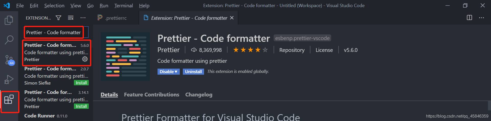

prettierrc.js配置文件
===

## 1、首先安装插件


## 2、.prettierrc常用配置

```js
module.exports = {
    printWidth: 150,                        // 单行代码的最大长度（字符个数，超过会折行），可选值是任意整数，默认值是80
    semi: false,                            //是否在语句末尾添加分号。设置为false表示不添加分号。
    tabWidth: 4,                            //一个制表符（tab）等于的空格数。这个选项将决定缩进的宽度。
    useTabs: true,                          //是否使用制表符（tab）进行缩进。设置为true表示使用制表符，false表示使用空格。
    trailingComma: 'none',                  //对象或数组最后一项后面是否添加逗号。可以设置为none、es5、all。
    // 对象中的空格 默认true
    // true: { foo: bar }
    // false: {foo: bar}
    bracketSpacing: true,                   //在对象字面量的括号之间是否添加空格。设置为false表示不添加空格。
    // JSX标签闭合位置 默认false
    // false: <div
    //          className=""
    //          style={{}}
    //       >
    // true: <div
    //          className=""
    //          style={{}} >
    jsxBracketSameLine: true,                //在多行的JSX元素的起始位置添加>符号，并将闭合标签放在同一行。设置为true表示将>符号放在同一行
    singleQuote: true,                       //是否使用单引号。设置为true表示使用单引号，false表示使用双引号。
    jsxSingleQuote: true,                    // 在JSX中是否使用单引号，可选值是true（使用单引号）或false（使用双引号）
    arrowParens: 'avoid',                    //箭头函数参数是否使用括号。默认avoid 可选 avoid| always, always 总是有括号,avoid 能省略括号的时候就省略 例如x => x
    objectCurlySpacing: true,                //在对象字面量的大括号之间是否添加空格。设置为true表示添加空格。
    proseWrap: "preserve",                   // 是否要换行符折行，可选值是"preserve"（保持原样）, "always"（始终折行）， "never"（从不折行）
    embeddedLanguageFormatting: "auto",      // 是否格式化内嵌的代码语言，可选值是"auto"（自动）， "off"（不格式化内嵌的代码语言）， "on"（始终格式化内嵌的代码语言）
    // 换行符的样式，可选值是"auto"（根据文件中的第一行决定换行符类型）, "lf"（强制使用 LF 作为换行符）, "crlf"（强制使用 CRLF 作为换行符） 或 "cr"（强制使用 CR 作为换行符）
    endOfLine: "auto", 
    quoteProps: "as-needed",                // 属性名是否使用引号，当有需要时，可选值是"as-needed"（只在必要时加引号）或"consistent"（保持一致性）
    rangeStart: 0,                          // 在某个字符处启动格式化（与rangeEnd配合使用），可选值是任意整数
    rangeEnd: Infinity,                     // 格式化到某个字符处（与rangeStart配合使用），可选值是任意整数         
    parser: "babel",                        // 使用的解析器，如 'babel', 'flow', 'typescript' 等，可选值是解析器的名称字符串
    filepath: null,                         // 用于确定哪些文件需要格式化，可选值是文件路径字符串或者null
    requirePragma: false,                   // 是否需要特殊标记（如 '@format'）才会格式化文件，可选值是true（需要标记）或false（不需要标记）
    insertPragma: false,                    // 是否插入特殊标记（如 '@format'）来格式化文件，可选值是true（插入标记）或false（不插入标记）
    overrides: [],                          // 针对某些文件类型的特殊配置，可选值是数组，数组元素是对象

}
```


## 3. 新建.prettierignore文件，忽略格式化
```shell
node_modules
**/*.svg
**/*.ejs
**/*.html
**/*.json
**/*.jsx
package.json
*.yaml
````
