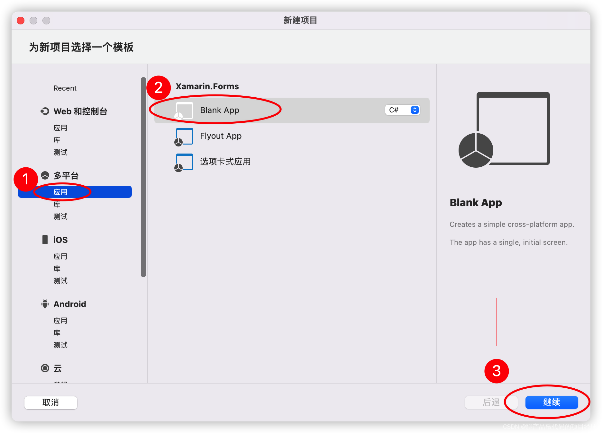
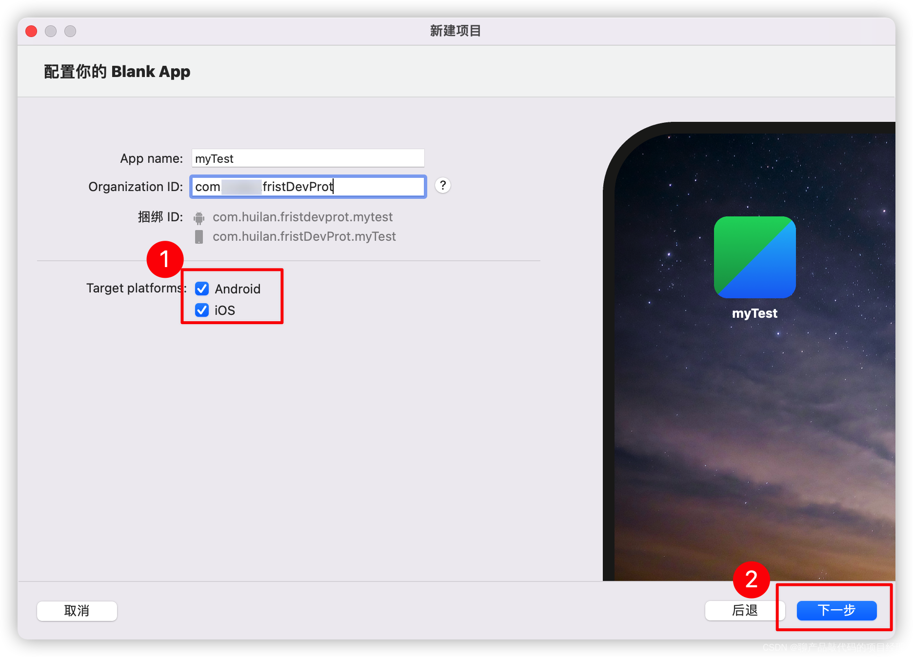
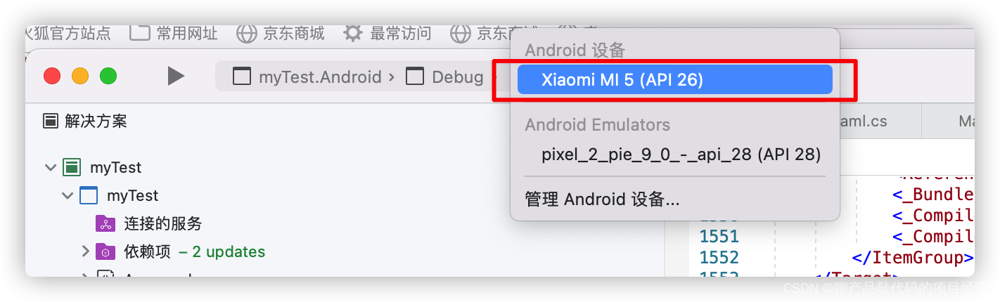
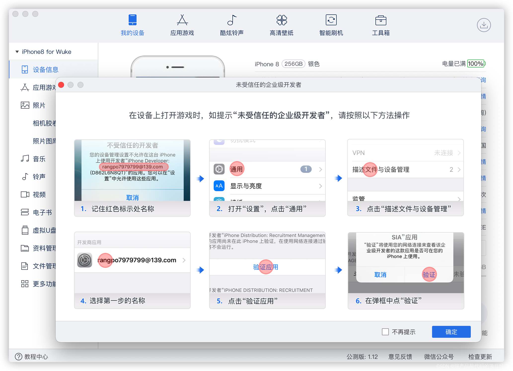
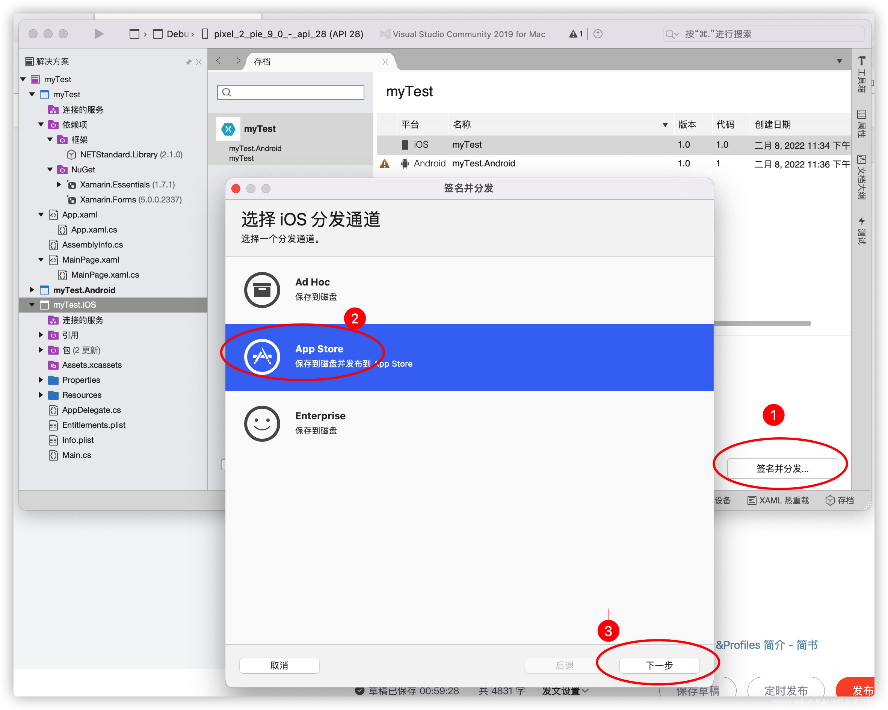
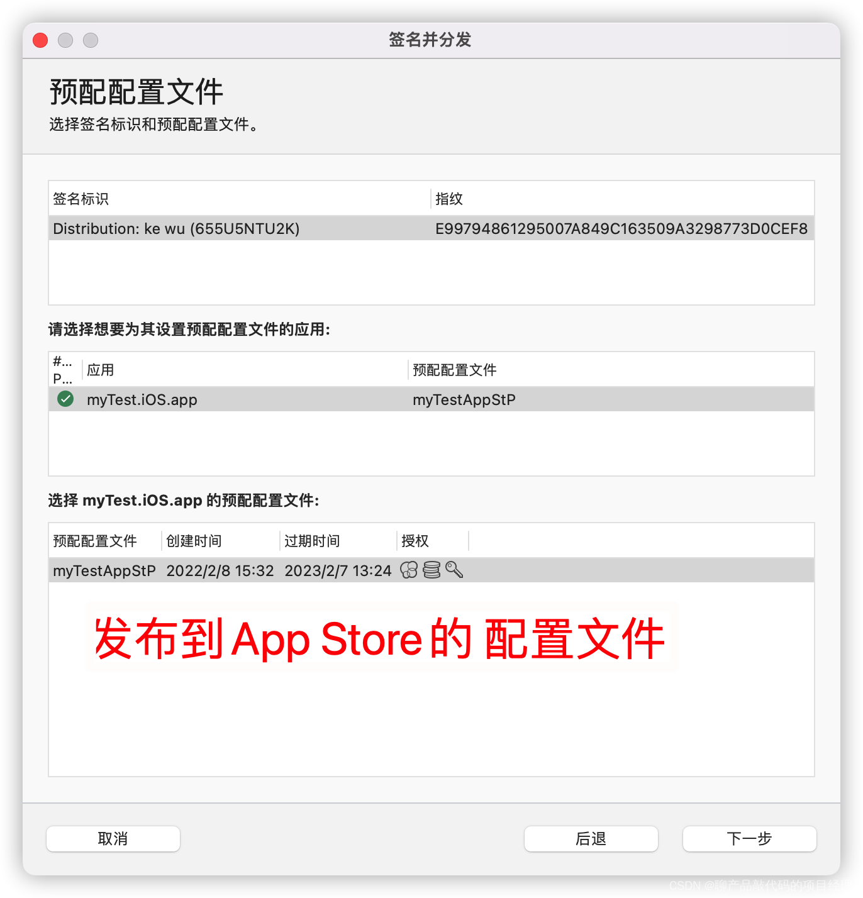

IOS开发证书配置(基于Xamarin.Forms, 其他开发环境配置大同小异)
===

## 一、前期需要准备的工具

**Xcode** ：用于设置、下载、上传本机证书。安装了Xcode之后，Visual studio for mac的一些功能才正常使用。

**Visual studio  2022 for mac 预览版** ：开发环境，不必多说。第一次配置我用的上Visual Studio Community for Mac，配置过程中没发现什么区别。下载地址：  [Visual Studio 2022 for Mac 预览](https://visualstudio.microsoft.com/zh-hans/vs/mac/preview/)。

Android 文件传输：可以直接将编译好的apk文件发布到Andriod手机上，B测试时方便快速发布。  下载地址：Android File Transfer-Android File Transfer mac下载 V1.0.12-PC6苹果网     备用百度网盘链接: https://pan.baidu.com/s/1iT0C_ZCpY2r1XqGc-KjF4g 提取码: 2bfl

**爱思助手**：可以将编译好的app直接安装到手机上，不用上传到APP store，方便测试。 下载地址：[爱思助手官网_苹果助手_苹果刷机助手_苹果越狱助手](https://www.i4.cn/)

**Transporter**：可让您以简单轻松的方式将内容交付到 Apple store的工具，比iTunes Connect 好用。（当时研究了3种上传工具，这个最好用）下载地址： [‎App Store 上的“Transporter”](https://apps.apple.com/cn/app/transporter/id1450874784)

安装完毕后如下图所示：

## 二、申请开发者证书和发布证书

相对于Android签名分发，Apple要复杂的得多，所以先说介绍Apple签发配置。

1、开发测试时用到的各项配置文件及作用说明

网上教程很多截图都是老版的Developer的，这里结合新版截图，先对说IOS开发中各项配置的文件从就用角度做简要说明（具体的申请程程在后文再详细介绍）。

首先要说明的中文developer Apple Developer (简体中文) 文站只是一个 摆设，所以的操作都发进入英文的“帐户”页面才能操作。

进入证书、身份和配置文件页面。前期开发和发面主要是用到Certificates, Identifiers 、Profiles为三项。

### （1）Certificate

​        针对于“人”的身份证，将来可以溯源APP是哪个企业或个人开发的，或者开发者在APP用应用了哪些特殊服务（例如消推送服务）。

从开发者要度来说，证书主要有3大类：

​        开发者证书（Development），安装了这个证书的mac计算机才能进行开发。

​        分发证书（Distribution），发布App时使用，只有能包含了Distribution证书的APP才能在上传到到App Store或是发布给其它人进行B测试，才能在非开发环境的系统上正常运行。

​         服务证书（Services），当开发者用到比较敏感的服务时，才需要添加这类证书。

具体细分说明如下：

### （2）Identifiers

针对**APP**的身份证，是每个APP或是给相关APP的都至少有一个标识，如果用到某项特别的服务还有可能需要添加服务的身份标识（例如消推送服务）。  Identifiers也有多种类型，一般开发APP主要用到的是**“App IDs ”**。

APP IDs分为2类，Explicit（专用型）和 Wildcard（通用型）

Explicit（专用型）与APP是一一对应的，Wildcard（通用型）可以给多APP证明，是一对多的关系，但是Wildcard（通用型）有很多权限用不了。所以，**一般选用Explicit（专用型）即可**。

### （3） Devices （可用设备）

只有添加到设备列表中的设备才可以有进行真机测试或者测试，否则在真机上运行时会提示“找不到证书”，然后退出。在开发时，相关证书都配置无误后，连接上真机调试程序，Visual Studio 会自动进行Devices注册，不需要手工注册。设备一旦注册不可以再删除，只能禁用。只能等到每年688元续费时，再申请删除。（当时我在删除的坑里找了好半的半天的安钮...）

### （4） Profiles（配置文件）

就是把 Certificates、Identifiers、Devices信息打包生成的一个文件，用于开发、发布、安装和运行。分为Development和Distribution两大类，其实Development类Xcode会自动生成，通常分发时主要用Distribution即可。Distribution中主要用两类：Ad Hoc（内部分发，用于B测试）和App Store（发布到App Store）

完整的Profile文件内容如下：

## 三、在Visual Stuio 2022 for Mac中 Apple及Android证书申请及配置流程说明

### 1、申请本地密钥

申请本地密钥文件，申请证书时需要上传，本地密钥文件即可以用于开发证书也可以用分发证书。

### 2 、在Visual studio 2022 for mac中登录AppleID并生成证书

(1)在Visual Studio 2022 for Mac 中可以直接一键生成证书（比登录developer网站方便很多）

需要提醒的是通过Apple ID登录后，并不能马上在”Apple开发者帐户“表中显示出来。退出VS后，重新进入才会显示。如果不行的就多操作几次，或者先在Xcode登录一下，再回到Visual Studio

(2)登录到 Apple Developer   [Sign In - Apple](https://developer.apple.com/account/) 网站 查看开发者证书和分发证书。

### 3、在Visual studio 2022 for mac中创建Android开发者密钥

输入证书信息后，点击OK按钮 

密码生成后，可以打开访达，将密钥保证起来，以备以后发生重装系统之类的事情后导入。

至此，开发前的配置工作，执行完毕，可以建立新的项目准备开发。

## 四、在Visual Stuido 2022 for Mac 中建立夸平台项目及真机测试设置说明

### 1、新建多平台应用

**Organization ID 填写的内容要记录下来，以后在Developer网站申请Identifier时需要。**

### 2、设定启动的调试程序，准备真机测试

#### 1）调试选项说明

在模拟器中运行效果如下图所示

#### 2）连接Iphone手机真机调试

在developer网站，添加新的项目

项目建立完成后，生成配置文件。配置文件至少需要3个，develop（开发用配置文件，其中定义了哪些设备可以开发时真机调试）、Ad  Hoc（内部测试配置文件，其中定义了哪些设备可以进运行B测试版的app）、App Store（发布到App Store用）。添加新配置文件的过程类似，下文件添加develop为例。

全部配置文件全部生成后，如下图所示：

打开Visual Studio 2020 for Mac 查看 配置文件是否已下载到本地。通常是自动下载的，如果没有自动同步，则需要手工下载。

关闭“首先项”窗口，将真机连接到计算机，开发始测试。如果接入电脑后，手机未在列表中显示，请检查在手机上是否设置为“信任”此计算机； 重新插拔电脑数据；稍等自动刷新等操作。

首次运行进，可能会弹出如下窗口，密码文本框中输入录入计算机的密码即可。

实际运行效查如下图所示

#### 3）连接Android手机真机调试

（可能是预览版还是我设置的原因，在Visual Studio 2022 for Mac下出现APP可以自动安装到真机但不是卡死（如下图）和Androi版本错与Xamarin版本不匹配的问题，同一个解决方案在2019版却没有这些问题。以下操作步骤在Visual Studio 2019 for Mac中进行，具体操作和菜单位置2019版和2022版基本一致）

手机端启动开发者选项，设置如下。

PS：华为手机连接之后是无法识别的（当时以为是我开发者设置的问题，浪费了很多时间，最后确认设置没有问题，还是连不上，不知道是不是为华操作系统的原因。）。我找朋友压榨来的小米5可以正深常识别。

在Visual Studio中设置识别的Android手机，注意如果Visual Studio 窗口上端处于窗口顶端，那么要点击下图所示的上箭头位置，才能显示出来。（此坑也害得本人，各种查找为才能手机连接之后V S看不到...浪费很多时间。）

选择连接的设备

运行效果如下

## 五、内部分发测试

APP开发完毕之后，需要分发给内部人员测试，这个时期程序升级较多而且用户量较少，可以能过考备分发的方式进行。

### 1、 iphone分发

能运行分发版本APP必须是AdHoc证书中包含的设备（不知道AdHoc是什么证书，以及如何添加设备请阅读本文前边的内容）

#### （1）编译IOS项目，签名发布到本地

第一次发布时需要新建立存档，第二次发布时可以通过“查看存档”进行发布。

#### （2) 通过爱思助手将程序安装测试设备中

确保手机连接成功

### 2、Android分发

### 1）编译Android项目，并发布到本地

选择文件保存的位置

共生成2个文件，一个含有签名，另一个不含签名。

### 2)通过Android文件传输入App，将程序传入Android手机

启动Android文件传输APP，将手机接入电脑

新建一个文件夹（推荐文件夹命以以ZZ开头，在手机中比较容易找到），并将签了名的apk文件考到andriod手机中。

在手上通过文件管理器进行安装（各款手机安装流程可能不相同，尽下图仅从参考） 

 安装、运行效果如下

## 六、 App Store 上架

因为Android的应用市场较多，具体上架流程不同，无多做说明。本文中对iso App上架到 App Store作说明。

### 1、编译上架App Store 的签名程序

### 2、在Developer网站中建立新的App Store Connet程序

注意：需要重新退回Developer 英文网站根页出下，才能找到链接。

网址是：[Sign In - Apple](https://developer.apple.com/account)

 根据实际情况输入需要信息后，点击**“保存”，****注意此时还没有上传App****不要“提交”**

### 3、 通过**Transporter上传APP程序**

上传成功后，回到Develoer网站，提交 等待审核。

各类文件的详细说明请查看 [iOS 申请证书，Certificates, Identifiers &Profiles 简介 - 简书](https://www.jianshu.com/p/ef61c4365e7f)

