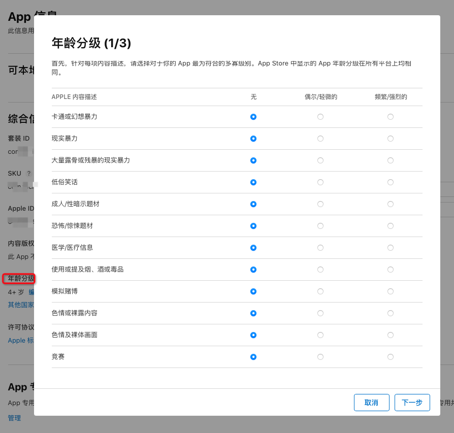
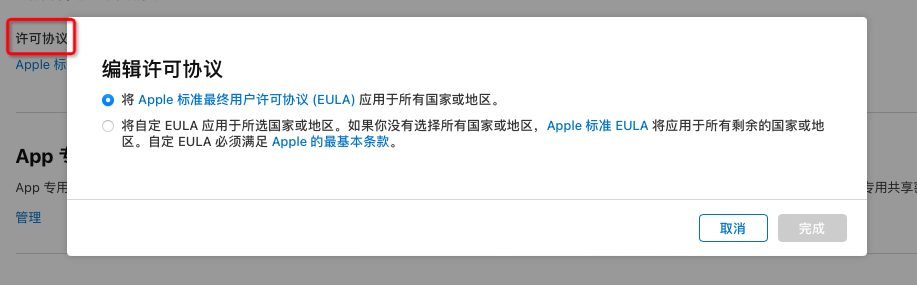
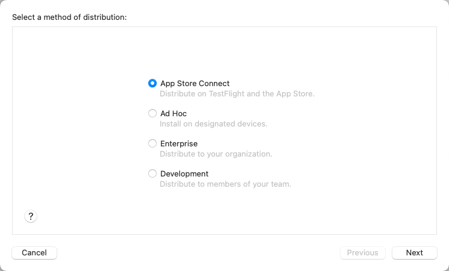

新版XCode上架iOS分发流程及打包详解
===

### 准备工作：付费开发者账号，个人账号和企业账号都行

**个人账号：**每年99美元，可以上架项目到App Store，账号内最多添加100台测试设备，需要先在网站上添加设备的udid，并生成描述文件。

**公司账号：**每年99美元，可以上架项目到App Store，账号内最多添加100台测试设备，需要先在网站上添加设备的udid，并生成描述文件。

**企业账号：**每年299美元，无法上架APP，只供企业内部测试使用，最多添加10000台测试设备，使用企业账号进行分发APP时不需要预先在开发者网站加入设备的udid，用户只需要安装并信任描述文件就行。

### 第一步：登录开发者网站，新建APPID

点击链接：[苹果开发者网站](https://links.jianshu.com/go?to=https%3A%2F%2Fdeveloper.apple.com%2Faccount)，进入网站首页(图1-1)，点击红框的地方进入证书管理网页(图1-2)

1-2.png

 点击图1-2的那个蓝色加号，添加appid，如图1-3和1-4，选择下一步

1-3.png

1-4.png

 来到1-5的页面，按照图内提示填写信息

1-5.png

 页面底下要选择功能（Capabilities）或者服务（App Services），例如地图，推送，NFC，你的APP用到什么功能就勾选哪个，服务同理（图1-6）。

1-6.png

 点击右上角continue，进入到下一个页面(图1-7)，该页面是给你预览的，看看信息正不正确。如果register按钮不可点击，说明你的bundle ID不符合要求，要back到上一个页面重新填写.点击register完成，回到1-2图示位置，选中左边的“identifiers”，可以在右侧列表中看到刚刚新建的APPID。

1-7.png

### 第二步：新建证书

新建证书之前，需要在你的苹果电脑上面从机构请求证书，打开电脑的钥匙串，然后点击左上角的菜单，从证书颁发机构请求证书

before-1.png

before-2.png

电子邮件就填写你的开发者账号邮箱，常用名称自行定义，选中存储到磁盘，点击继续，下载一个文件到你的电脑里面，扩展名是“ .certSigningRequest”

before-3.png

 下面可以来看开发者网站的证书了。
 如图2-1所示，点击蓝色加号，进入到2-2页面，如果你的电脑是初次安装这些证书，请先拉到页面最底部（图2-3），依次点击四个蓝色链接，下载文件并且安装好，否则等你新建好证书之后，安装到你的钥匙串里会发现证书不受信任，还需要手动设置信任才行

2-1.png

2-2.png

2-3.png

下面会依次介绍开发证书，发布证书，推送证书。
 如图所示，前面四个都可以使用，不过前两个需要你的xcode版本是在11及之后才行，红框里的说明支持分发模式，这个后面打包的时候再详细说明。

2-4.png

##### 1-开发证书和发布证书

选中图2-4中的第一个选项，然后到下一步页面点击“choose file”，选择上面从证书颁发机构请求的证书，然后点击下一步就可以下载证书了，到文件夹里吗找到证书，双击进行安装到钥匙串。

2-5.png

新建发布证书的时候选中图2-6所示，然后下一步，后面的流程和开发证书一样，最后下载下来双击要装打到钥匙串。

2-6.png

 访达中和钥匙串中证书如图所示

2-7.png

2-8.png

##### 2-推送证书

如图2-9所示，选中第一个证书创建测试推送证书，点击下一步到图2-10，然后选择你在第一步里面创建的那个APPID，点击下一步到2-11，选择钥匙串里面颁发的那个，点击下一步然后下载证书，生产推送证书创建方式也是一样的。

2-9.png

2-10.png

2-11.png

推送证书在访达中和钥匙串中如图所示

2-12.png

2-13.png

### 第三步：添加测试设备

如果是直接上架到App Store的可以跳过这一步，上架到类似蒲公英平台的，需要仔细看这一步。不过如果你是小白，还是建议上架完之后回过来看一下这个功能，以后肯定会用到
 点开图3-1所示的蓝色加号，进入到设备添加页面

3-1.png

 可以看到页面分为左右两块，
 左边是单个添加，*Platform*选择设备类型，*Device Name*表示设备名称，可以自行填写，*Device Name*即设备的udid，udid的获取方式可以自行百度，或者使用蒲公英网站一个工具获取：[udid获取](https://links.jianshu.com/go?to=https%3A%2F%2Fwww.pgyer.com%2Ftools%2Fudid)
 右侧的批量添加，可以点击*Download sample files*来下载模板，然后点击*Choose File*来上传。
 不过是使用单个添加设备，还是批量添加设备，**设备的总数量都不能超过100个**。

3-2.png

### 第四步：创建描述文件

如图4-1，点击蓝色加号，进入4-2的页面，描述文件也分开发证书和发布两种模式。

4-1.png

4-2.png

##### 1-创建开发描述文件

上架App Store的可以跳过次步骤。如图4-3，选中** Development**的第一个，如果你开发的是手表或者电脑的程序就选择第二个第三个，然后点击下一步到图4-4，在这里还要选择对应的APPID，点击下一步到图4-5选择证书，如果有多个开发证书，就全选，表示所有证书都能使用这个描述文件，点击下一步到4-6，选择设备，然后点击下一步填写一个名称，自己能区分就行。点击download进行下载，然后双击安装到本地。

4-3.png

4-4.png

4-5.png

4-6.png

##### 2-创建分发描述文件

如果是上架到App Store的可以跳过这一步，如果是上架到类似蒲公英平台的，就需要这一步。如图4-7所示，选择** Distribution**的第一个，如果是tv项目选择第二个，点击下一步，后面的步骤和开发描述文件一样

4-7.png

##### 3-创建发布描述文件

上架到App Store的话，如图4-8所示，点击下一步，除了不用选择设备，其他的步骤和创建开发描述文件一样，最后也下载下来安装到本地

4-8.png

**开发，分发，发布的描述文件在访达中的后缀都是一样的(. mobileprovision)，无法区分所以最好在填写名称的时候标注好。**
 如果你是创建的开发或者分发的描述文件，想看一下选中的设备里面有没有包含想要的设备，可以在命令行中用 vim 或者cat的命令来打开描述文件。
 打开Mac电脑自带的终端，输入"vim "或者“cat ”，记得加空格。然后把描述文件拖到终端，会自动填充文件路径，按下回车键就可以看到描述文件里面的内容了

4-9.png

 可以用鼠标滚轮上下滚动，或者键盘上下键来查看信息。
*<key>ProvisionedDevices</key>*下面的列表就是你选中的那些设备的udid。
 “<key>aps-environment</key>”下面string标签的文本表示描述文件的类型，因为分发和发布都是一样打出来的包都可以直接安装到手机，所以这两个是一样的。
 开发：<string>development</string>
 分发：<string>production</string>
 发布：<string>production</string>
 同时按下“command”键和"F"键进行查找，粘贴设备的udid，如果能搜索到，就证明设备已经被选中。
 如果是用vim命令查看的文件，英文模式输入法下依次按下“I”键，“esc”键，然后输入冒号“:”，会看到左下角出来冒号，再输入“q”，然后回车就能退到终端页面。如果是cat命令查看的文件，直接按一下回车就好。

### 第五步：在App Store Connect新建一个APP项目

打开[App Store Connect](https://links.jianshu.com/go?to=https%3A%2F%2Fappstoreconnect.apple.com%2Fapps)，在首页的左上角店家蓝色加号，选择新建APP会跳出来图5-2所示按照提示填写即可。名称不可以App Store商店中其他的APP名称重复。其中套装ID是选择APPID的，SKU一般都写bundle ID。然后点击创建。

5-1.png

5-2.png

##### 1-进入准备提交页面，填写审核内容

预览图需要无透明度的图片，不能使用模拟器的截屏(但是偶尔也可以通过)。

5-3.png

推广文本非必填，
 描述属于必填项，对APP进行简介。
 此版本新增内容是更新APP版本的时候填写，说明添加或者修改了那些功能。

5-4.png

 关键词：App Store搜索APP时的联想词，比如火影手游可以加上“火影忍者，横版格斗，热血手游”，圣斗士星矢手游“圣斗士，星矢，卡牌，公平竞技(当然并不公平)”。网易云音乐“网易，音乐，听歌”
 技术支持网址：填写你公司的官网。如果你帮别人开发的，填他给你提供的网址。

营销网址：可选型
 版本：这个月应该不用解释了吧，第一版一般都是1.0.0
 版权：非网址

5-5.png

 根据你自己的需求看看是否需要填写这三个信息

5-6.png

 构建版本：选择提交审核的二进制文件，现在还没开始打包，等打包后就会有“选择构建版本”的按钮
 登录信息：苹果审核 的时候，如果你的APP需要登录才可以，就勾选一下，并且提供一个账号。
 联系信息：填写你或者技术主管的联系方式，苹果审核中，如果遇到什么问题，可以通过这里和你们沟通。不过我没遇到过苹果打电话或者发邮件给你。
 备注：填写一些信息帮助审核。最好录制一个演示视频来展示APP的功能。APP中有NFC，定位这种功能，自觉录制就行。不能直接进行录屏，必须要用另一个手机从第三角度进行拍摄。

5-7.png

 附件：提供图片，语音或者短视频来帮助审核。
 下面三个应该不用解释了。

5-8.png

##### 2-APP信息

设置名称，副标题，APP类型别。Apple ID是你的APP在App Store中的唯一标识，APP内检测版本更新会用的到。

5-9.png

内容版权：如果APP内有嵌入广告等，就选是

5-10.png

 年龄分级，如实选择就行

5-11.png

许可协议：如果没有，就不用管

5-12.png

##### 3-价格与销售范围

免费的就选择免费就行，销售范围勾选APP面向客户的国家和地区，税务类别默认App Store软件，如果是游戏或者音乐，选择对应的类别。

5-13.png

##### 4-APP隐私

隐私政策网址，里面叙述一下APP用到哪些权限，cookie如何处理，责任声明。

5-14.png

数据收集，如果APP内没有记录用户任何行为，就选择否。像美团，淘宝那些喜欢搜集用户行为的，就要如实选择。

5-15.png

##### 5-APP审核

这里会记录历史审核内容，点击进*APP提交内容*，进入详情页面，消息那里会看到和苹果审核团队的沟通记录

5-16.png

###### 6-功能模块

账户内有付费内容，订阅等功能的自行设置，没有的话忽略。

5-17.png

##### 7-TestFlight页面

构建版本记录了你打包上传过的二进制文件，如果正在审核中，对应的构建版本后面会跟“正在审核”的描述，图内是审核完成后的。图5-7那里选择构建版本的时候，就是选择这里的内容。

5-18.png

点击进对应的构建版本详情，群组中，可以添加测试组，独立测试员可以添加一个其他的测试账号

5-19.png

5-20.png

 内部测试：点击内部测试后面的蓝色加号添加一个测试组，点击测试员后面的蓝色加号再添加测试人员，添加的测试人员，必须是你在用户和访问中添加好的开发者邮箱。添加后，邮箱内会受到一封邮件，查看详情会得到一组大写的邀请码，testflight中的构建版本审核完成后，测试人员在手机上下载“TestFlight”APP，登录上开发者账号，通过邀请码即可获取APP。下拉到底部可以给这个群组指定测试某一个构建版本

5-21.png

5-22.png

5-23.png

5-24.png

外部测试：外部测试添加测试员和图5-20相同

5-25.png

### 第六步：在xcode中打包项目并上传文件

先用xcode打开项目

##### 1-xcode中的配置

TARGETS里面设置版本号version和构建版本build，构建版本就是图5-18中“版本1.0.0”下面的1和2，在你打包上传完成后，如果发现源码还有问题，修改后还需要再上传的话，就保持版本号不变，构建版本要+1。

6-1.png

设置证书：可以通过勾选"aUtomatically manage sigining"，然后选择Team来自动匹配描述文件，也可以不勾选，点击“Provisioning Pofile”进行手动指定描述文件

6-2.png

6-3.png

##### 2-打包上传

点击菜单栏的Product--Archive，xcode会进行自动打包，等待一会就好。打包的时候xcode不能指定任何设备，要选择“Any ios Device”，如图6-4

6-4.png

 打包完成后，桌面会自动跳出来上传配置页面，点击“Distribute App”进入图6-6

6-5.png

 选中第一个代表上传到App Store。
 选中第二个属于测试分发，上传类似蒲公英的平台，或者有需要超级签名的。
 选中第三个是企业账号进行打包
 选中第四个表示测试环境的，也无法作为正式版APP使用。
 -----------分割线----------------------
**更新xcode之后的补充**
 xcode更新了15版本以后，APP打包完想导出IPA包的界面已经更改了。如图6-5-1，想要用企业证书导出IPA的话，需要选中如图所示，点击next，才会出现图6-5的页面。如果只是上架App Store或者进行adhoc打包的话，直接选中第一个或者第二个就行。

6-5-1.png

 --------------分割线----------------------
 接下来的流程以第一个为例

6-6.png

 选中App Store connect，点击next到图6-7，这里的upload或者export代表两种上传方式。upload可以直接进行上传，export会先导出来一个IPA包，然后配合Transporter工具进行上传，好处是可以把IPA包放到另一台电脑上传。

6-7.png

 选中upload一路next到图6-8，第一个表示自动匹配描述文件，点击next后，再点击upload就会开始上传，第二个表示手动指定，点击next进入6-9进行指定，然后next，再点击upload开始上传

6-8.png

6-9.png

6-10.png

 选中export，next到图6-8所示，这里手动指定还是自动指定都和upload的流程一样，next之后，点击export，选择一个文件夹存放导出来的内容。在访达内如图6-11所示，扩展名为“.ipa”的就是用来上传的文件，如果是中文名请改成英文

6-11.png

 然后电脑在App Store中下载Transpoeter，打开并登录开发者账号，点击左上角的加号，从访达中选择IPA文件进行上传。

6-12.png

### 第七步：提交上架

回到APP store connect网站，刚刚打包上传的文件会显示在testflight中，刚上传的会在构建版本好后面有“正在审核”的字样，审核时间大概半个小时.如果在3-5分钟左右，刷新页面后发现构建版本没了，说你的IPA包有错误，被苹果退回了，可以去开发者账号的邮箱查看苹果审核团队发给你的邮件，修改源码后重新打包上传，这时候的构建版本号不需要再+1。这里的审核完成后，开发者邮箱会收到邮件，如果有开起了测试，那么测试手机上“testflight”APP也会有推送消息。

7-1.png

点击到图7-2，testflight审核成功后，这里的构建版本会出现一个按钮让你选择要上架的构架版本，选择后点击右上角的添加以供审核，再点击一下提交审核，APP状态变成“正在等待审核”，表示提交完成，等待苹果的人工审核就好了，人工审核时间理论上是两天，但是现在一般一天就会有结果。

7-2.png

### 其他介绍-钥匙串导出P12文件

如果另一台电脑也想对同一个项目进行调试，甚至打包上传怎么办，还需要通过第二步的内容进行新建证书吗，当然会不需要，况且发布证书最多只能创建三个，不可能每台电脑都要新建证书。这时候就要用到p12文件了。某一台电脑新建过证书，并且也下载安装到钥匙串了，这时候就可以从钥匙串导出一个p12文件传给另一台电脑，另一台电脑接收后，双击安装到钥匙串，就可以看到该证书了。
 选中证书右击，注意不要展开，是选中证书主体，选择“导出*****证书名*****”，到图p-2，文件格式扩展名为.p12，然后选择文件夹，填写名称，点击存储，设置密码后存储到磁盘，然后就可以发给其他设备了

p-1.png

p-2.png

