## iOS 打包

> 🚧 `打包前需要准备工具`<!--rehype:style=color: white; background: #1c7bd0;-->
> 1. 🪲 iOS项目打包前，需要先准备 `开发者账号`<!--rehype:style=color: #1c7bd0; background: ##E6E6E6-->、`需要打包的项目`<!--rehype:style=color: #1c7bd0; background: ##E6E6E6--> 及 `mac电脑和Xcode`<!--rehype:style=color: #1c7bd0; background: ##E6E6E6-->。
> 2. 📦 如果没有开发者账号，可进入[Developer苹果开发者官网](https://developer.apple.com),点击“Account”登录/注册会员。
<!--rehype:style=border-left: 8px solid #ffe564;background-color: #ffe56440;padding: 12px 16px;-->


## 打包前修改 APP 版本号
### 修改 `ios/<应用名称>/Info.plist` 配置

```xml
<key>CFBundleShortVersionString</key>
<string>1.2.0</string>
```

## iOS打包后HTTP请求不到解决方法

修改 `ios/<应用名称>/Info.plist` 配置

```xml
<key>NSAppTransportSecurity</key>
<dict>
  <key>NSAllowsArbitraryLoads</key>
  <true/>
</dict>
```

## 一. 配置iOS证书
### `配置证书`<!--rehype:style=color: white; background: #1c7bd0;-->


登陆成功后，登录开发者账号，进入`Certificates`<!--rehype:style=color: #1c7bd0; background: ##E6E6E6-->, `Identifiers & Profiles`<!--rehype:style=color: #1c7bd0; background: ##E6E6E6-->，选择`Certificates`<!--rehype:style=color: #1c7bd0; background: ##E6E6E6-->新建。

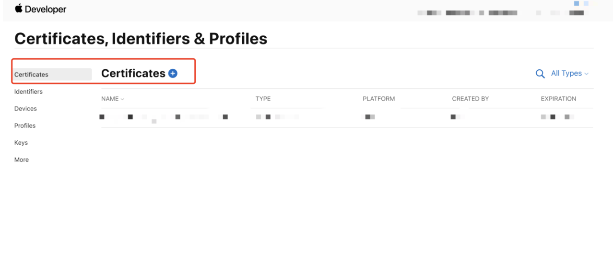

### `选择类型`<!--rehype:style=color: white; background: #1c7bd0;-->

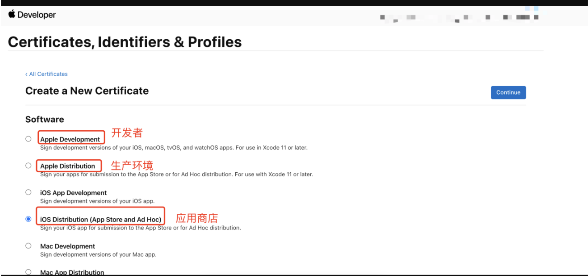


### `选择证书文件`<!--rehype:style=color: white; background: #1c7bd0;-->

#### `无证书文件可通过钥匙串访问创建`<!--rehype:style=color: white; background: #ffb703;-->

进入启动台，点击进入钥匙串访问。

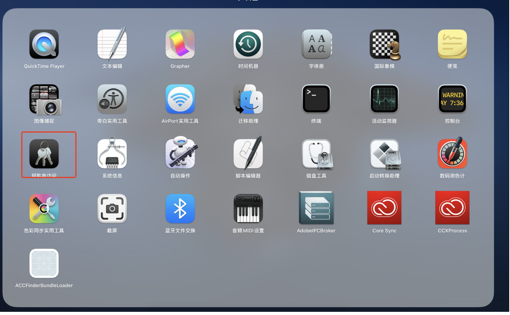

进入钥匙串访问，通过`证书助理`-选择`从证书颁发机构请求`申请证书。

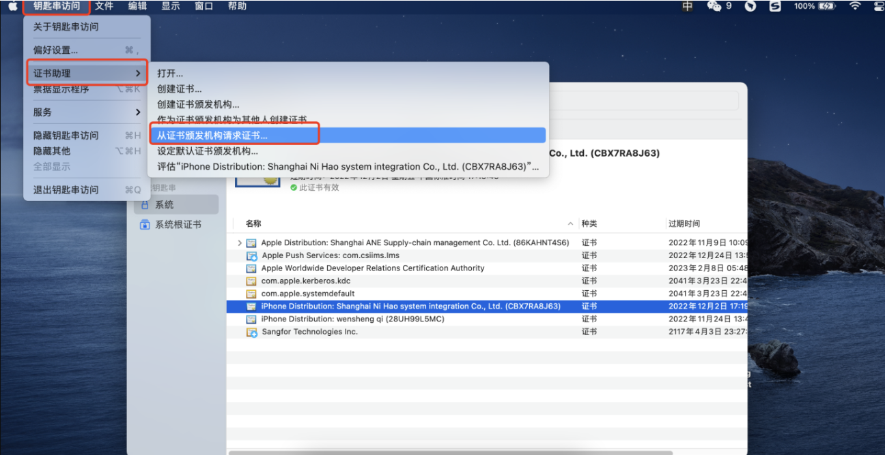

填写常用邮箱及姓名，选择`保存到磁盘，生成本地证书文件。

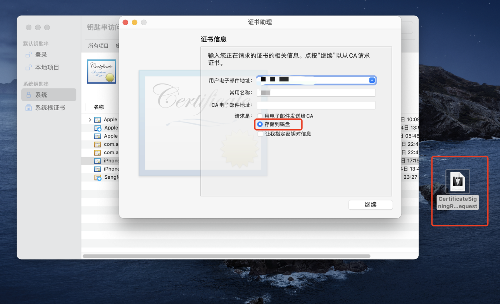

本地证书生成后，回到`Certificates, Identifiers & Profiles`<!--rehype:style=color: #1c7bd0; background: ##E6E6E6-->-`Create a New Certificate`<!--rehype:style=color: #1c7bd0; background: ##E6E6E6-->选择该文件即可进入下一步，选择已生成的本地证书创建新的证书。

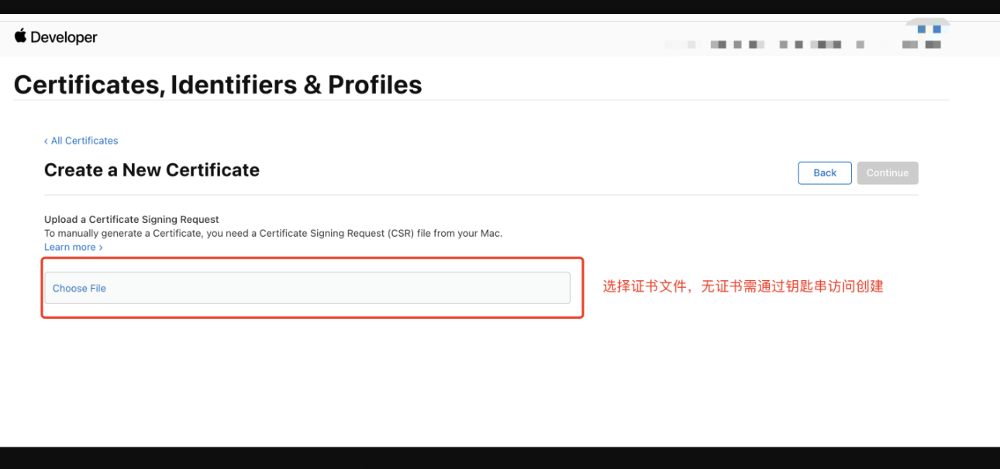<!--rehype:style=max-width: 650px;width: 100%;-->

### `创建APP IP`<!--rehype:style=color: white; background: #1c7bd0;-->

如果没有可用的APP IP，可参考[发布iOS应用商店](https://uimjs.github.io/#/docs/app-store/ios)中第一章节创建新的 AppID，。

> 开发者账号注册完成，相关证书及配置完成之后，即可准备用`Xcode`<!--rehype:style=color: #1c7bd0; background: ##E6E6E6-->对项目进行打包。
<!--rehype:style=border-left: 8px solid #ffe564;background-color: #ffe56440;padding: 12px 16px;-->

## 二. Xcode配置iOS证书和打包环境

### `Xcode打开需要打包的项目`<!--rehype:style=color: white; background: #1c7bd0;-->

项目打开后，首先需要选择`Xcode`<!--rehype:style=color: #1c7bd0; background: ##E6E6E6-->中的`Preferences`<!--rehype:style=color: #1c7bd0; background: ##E6E6E6-->中登录已注册好的开发者账号。

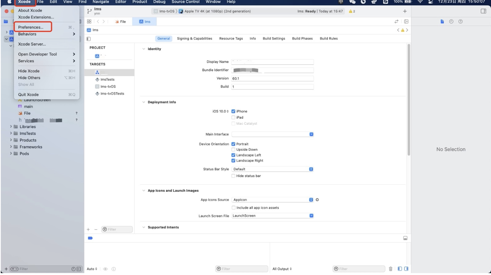

账号登录成功后，确保是否存在已配置好的打包证书，证书配置完成可进行之后的设置。

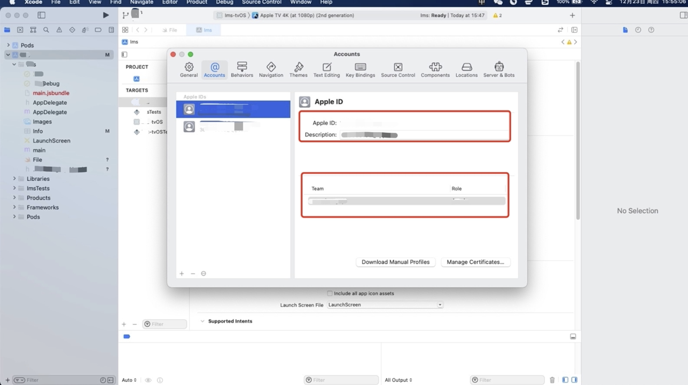

### `配置provisioning profile与证书`<!--rehype:style=color: white; background: #1c7bd0;-->

确保`General`<!--rehype:style=color: #1c7bd0; background: ##E6E6E6-->中，项目`Bundle Identifier`<!--rehype:style=color: #1c7bd0; background: ##E6E6E6-->与申请的证书APP IDs、描述文件的Bundle Identifier相同。

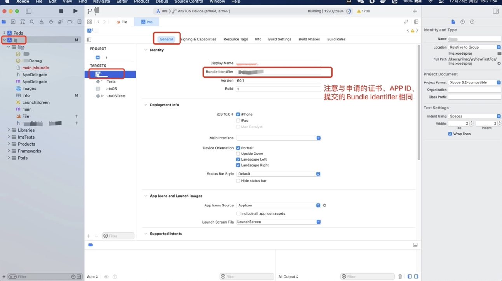

点击`Signing & Capabilities`<!--rehype:style=color: #1c7bd0; background: ##E6E6E6-->中，选择`项目开发证书`<!--rehype:style=color: #1c7bd0; background: ##E6E6E6-->及填写Bundle Identifier。

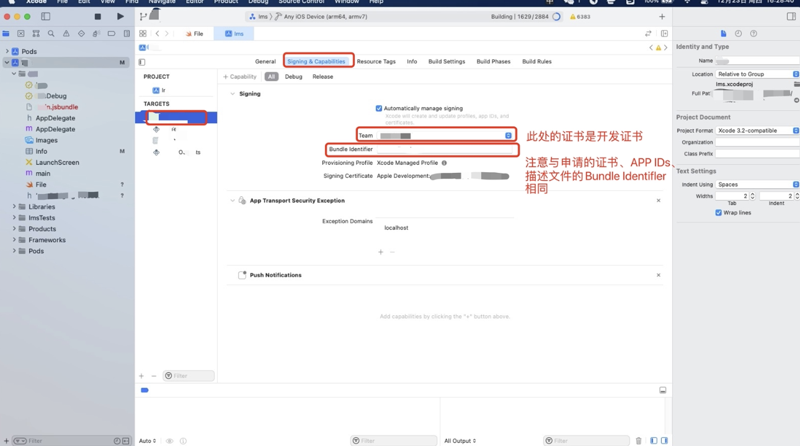

> 打包之前，现将模式调整为`Generic IOS Device`<!--rehype:style=color: #1c7bd0; background: ##E6E6E6-->模式
<!--rehype:style=border-left: 8px solid #ffe564;background-color: #ffe56440;padding: 12px 16px;-->

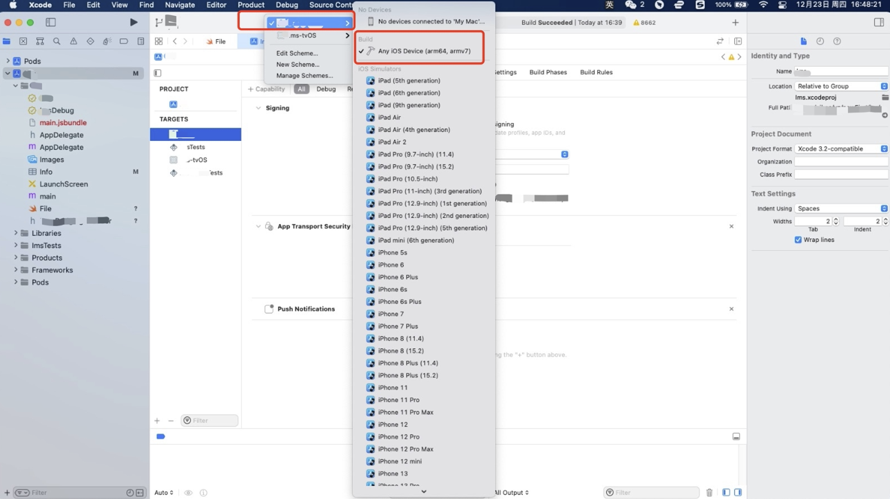

### `开始打包`<!--rehype:style=color: white; background: #1c7bd0;-->

点击`Product`<!--rehype:style=color: #1c7bd0; background: ##E6E6E6-->中，选择`Archive`<!--rehype:style=color: #1c7bd0; background: ##E6E6E6-->进行打包。

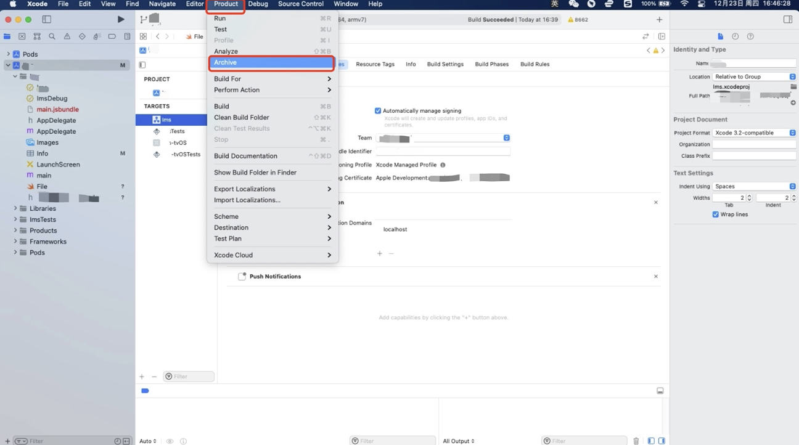

### `打包完成输出包`<!--rehype:style=color: white; background: #1c7bd0;-->

打包完成后自动弹出输出选择框。

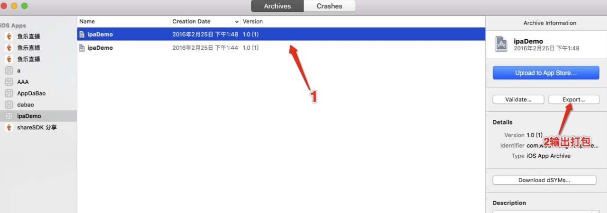

> 🚧 企业证书打包 选Enterprise,一版测试打包选择第二项，可直接上传到蒲公英进行发布。
<!--rehype:style=border-left: 8px solid #ffe564;background-color: #ffe56440;padding: 12px 16px;-->

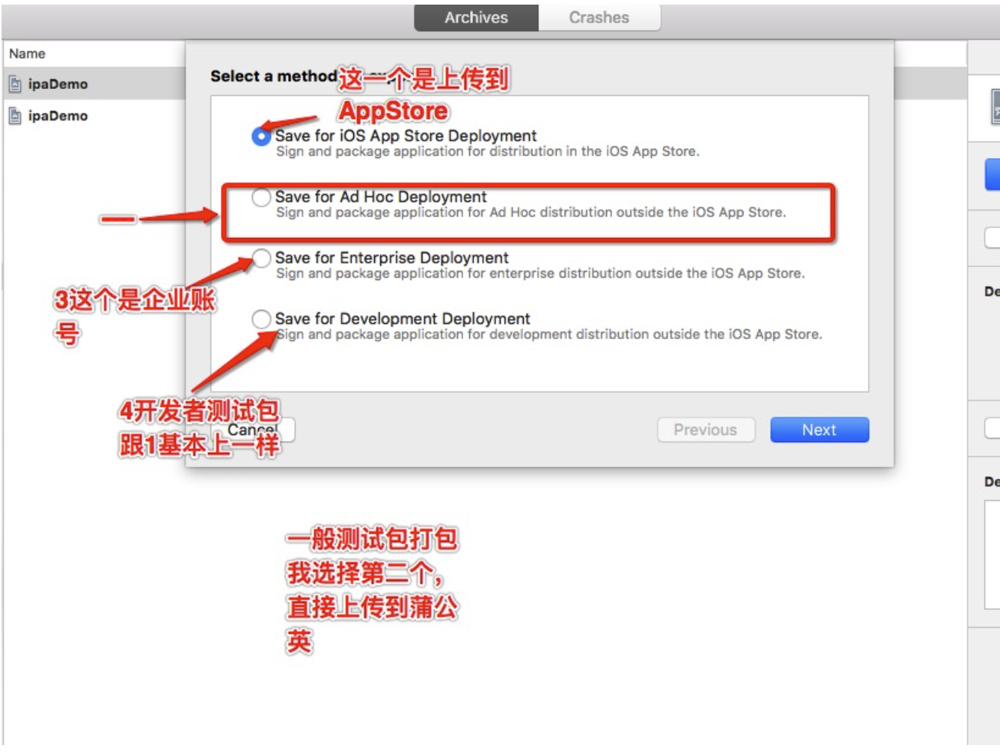


选择自己的开发证书。

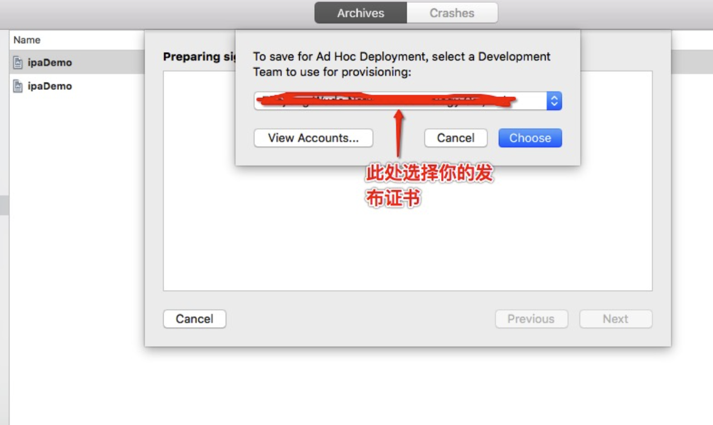

之后一直点击下一步即可。

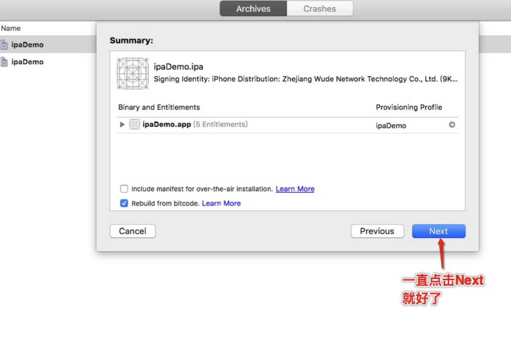

> 🚧 输出完成后即可在所选的保存路径看到安装包。
<!--rehype:style=border-left: 8px solid #ffe564;background-color: #ffe56440;padding: 12px 16px;-->
