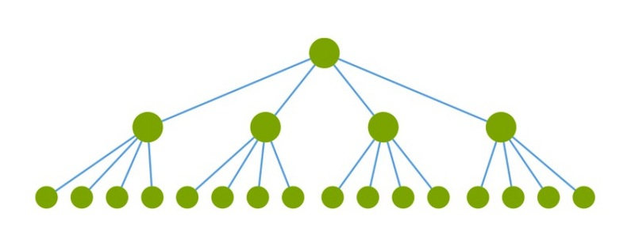
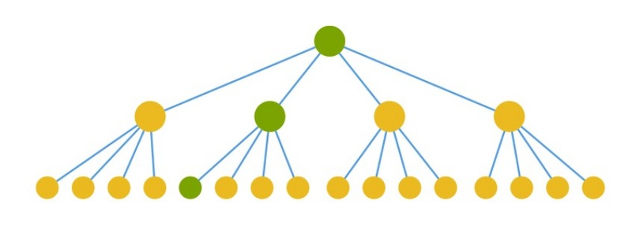

---
nav:
    title: React系列
    path: /react
    order: 5
group:
  title: 进阶指引
  order: 2
title: render
order: 1
---

# render

通常一个组件要发挥作用，总是要渲染内容，`render` 函数并不往 DOM 树上渲染或者装载内容，它只是返回一个 JSX 描述的结构，最终由 React 来操作渲染过程。而 React 肯定是把所有组件返回的结果综合起来，才能知道该如何产生对应的 DOM 修改。

当然，某些特殊组件的作用不是渲染界面，或者，组件在某些情况下选择没有东西可绘制，那就让 `render` 函数返回 `false` 或 `null`，等于告诉 React ，这个组件这次不需要渲染任何 DOM 元素。

需要注意，`render` 函数应该是一个纯函数，完全根据 `this.state` 和 `this.props` 来决定返回的结果，而且不要产生任何副作用。在 `render` 函数中调用 `this.setState` 毫无疑问是错误的，因为一个纯函数不应该引起状态的改变。

`render` 函数当且仅当下列两种情况才会被调用：

- 组件初始化
- 组件的 `props` 或 `state` 发生变化

虽然组件的 `render` 函数只在上述 2 种情况下才发生调用，但有时 `props` 的改变却很难察觉到。比如组件的父级组件如果调用 `render` 函数，则该组件的 `props` 一定会发生改变，虽然该 `props` 与之前的未变化前的 `props` 的属性和值都没有改变，该这个 `props` 对象的地址却发生了变化。

所以，当父组件的 `render` 函数被调用时，会触发 `componentWillReceiveProps()` 和 `shouldComponentUpdate()`，在里面可以比较下 `this.props` 和 `nextProps`，可以发现两个对象其实真的是分别的两个对象而已。

值得注意的是，父组件调用了 `render` 函数，子组件一定也会调用其 `render` 函数，但我在上面的三种情况并没有列出，主要是因为，父组件调用其 `render` 函数，会改变子组件的 `props` 对象的地址，所以也可以被归纳在第二种情况下。

## 渲染过程

`render` 函数的渲染分为初始化渲染和更新渲染。初始化渲染就是就是在页面初始化的时候调用根组件下所有组件的 `render` 方法。

如下图所示，一个 DOM 树表示根组件与各组件之间的联系，绿色表示已经渲染的。



现在讲的这种情况，如果我们只需要对某一个子组件进行更新，如图绿色代表的是需要更新的子组件：


而该子组件依靠于父组件传过来的 `props` 进行更新渲染，因此，我们的理想状态就是只更新此子组件与其父组件这条路径，如图绿色所示：


然而，由于最上层的根组件需要重新执行 `render`，必定导致其所有子组件都要重新 `render`，再将生成的虚拟 DOM 进行对比，如果不变则不更新真实的 DOM 树。即使有些组件的并没有改变，没有导致视图改变的 `props` 改变，但是也要重新执行 `render` 对虚拟 DOM 树进行对比，因为 React 难以置信简单地将默认行为设计为每次都重新执行 `render` 生成新的虚拟 DOM 进行对比，因为在 shouldComponentUpdate 非方法里面默认是返回 `true`，这样的对比明显是浪费的。如图黄色代表浪费的 `render`：



**⚠️ 注意：**

- 执行了 `render` 方法不代表会更新 DOM 树，在 React 当中你使用了 `setState` 更新了 `state` 或者改变了传入的 `props`，都会执行 `render` 方法，执行了`render` 方法以后，才会生成 DOM 树进行对比，如果 DOM 有差异才会进行构建新的渲染树，更新对应的 DOM，否则，不会更新。因此，生成虚拟 DOM 树进行对比是在 `render` 函数执行了之后进行，而不是执行之前。
- 拆分组件有助于性能优化。组件拆分了，各组件之间的耦合性小了，某个子组件需要更新的时候，牵涉到其他的组件就少，就能减少牵一发而动全身这种情况。

## 渲染优化策略

### 不要在 `render` 函数中绑定值

假设你有一个项目列表，每个项目都传递一个唯一的参数到父方法。为了绑定参数，你可能会这么做：

```jsx | pure
<CommentItem likeComment={() => this.likeComment(user.id)} />
```

这个问题会导致每次父组件 `render` 方法被调用时，一个新的函数被创建，已将其传入 `likeComment`。这会有一个改变每个子组件 `props` 的副作用，它将会造成他们全部重新渲染，即时数据本身没有发生改变。

为了解决这个问题，只需要将父组件的原型方法的引用传递给子组件。子组件的 `likeComment` 属性将总是有相同的引用，这样就不会造成不必要的重新渲染。

```jsx | pure
<CommentItem likeCommet={this.likeComment} userId={user.id} />
```

然后再子组件中创建一个引用了传入属性的类方法：

```jsx | pure
class CommentItem extends PureComponent {
  handleLike() {
    this.props.likeCommet(this.props.userID);
  }
}
```

### 不要在 `render` 函数里派生数据

考虑一下你的配置组件将从一系列文章中展示用户最喜欢的十篇文章。

```jsx | pure
render {
  const { posts } = this.props
  const topTen = posts.sort((a, b) => b.likes - a.likes).slice(0, 9)
  return //...
}
```

每次组件重新渲染时 `topTen` 都将有一个新的引用，即使 `posts` 没有改变并且派生数据也是相同的。这将造成列表不必要的重新渲染。

你可以通过缓存你的派生数据来解决这个问题。例如，设置派生数据在你的组件`state`中，仅当 `posts` 更新时它才更新。

```js
componentWillMount() {
  this.setTopTenPosts(this.props.posts)
}
componentWillReceiveProps(nextProps) {
  if (this.props.posts !== nextProps.posts) {
    this.setTopTenPosts(nextProps)
  }
}
setTopTenPosts(posts) {
  this.setState({
    topTen: posts.sort((a, b) => b.likes - a.likes).slice(0, 9)
  })
}
```

如果你正在使用 Redux，可以考虑使用 [reselect](https://github.com/reduxjs/reselect) 来创建 `selectors` 来组合和缓存派生数据。
