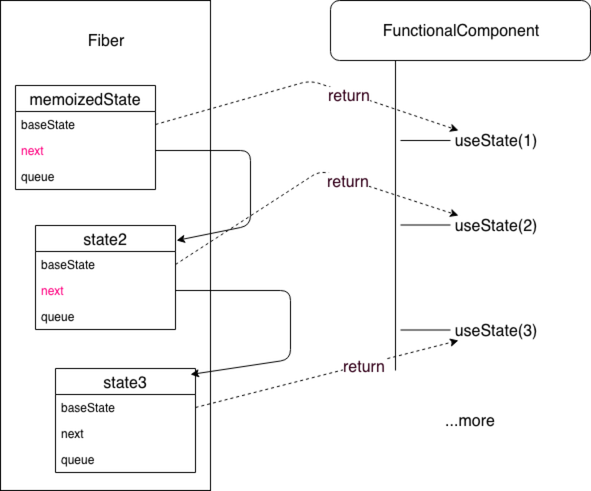

---
nav:
    title: React系列
    path: /react
    order: 5
group:
  title: Hooks
  order: 11
title: useState
order: 10
---

# useState

## 实现原理

首先 `useState` 是一个方法，它本身是无法存储状态的。其次，他运行在无状态组件中，本身也是无法保存状态的。

`useState` 只接收一个初始化参数，并看不出有什么特殊的地方。所以 React 在一次重新渲染的时候如何获取之前更新过的 `state` 呢？

### 基础概念

#### React Element

JSX 编译解析后执行 `React.createElement()` 创建并返回的是一个 `ReactElement` 对象，他的数据解构如下：

```js
const element = {
  // 是否是普通Element_Type
  ?typeof: REACT_ELEMENT_TYPE,

  // Built-in properties that belong on the element
  // 我们的组件，比如 `class MyComponent`
  type: type,
  key: key,
  ref: ref,
  props: props,

  // Record the component responsible for creating this element.
  _owner: owner,
};
```

这其中需要注意的是 `type`，在我们写 `<MyClassComponent {...props} />` 的时候，他的值就是 `MyClassComponent` 这个 `class`，而不是他的实例，实例是在后续渲染的过程中创建的。

#### Fiber

每个节点都会有一个对应的 Fiber 对象，他的数据解构如下：

```js
function FiberNode(tag: WorkTag, pendingProps: mixed, key: null | string, mode: TypeOfMode) {
  // Instance
  this.tag = tag;
  this.key = key;
  // 就是 ReactElement 的 `?typeof`
  this.elementType = null;
  // 就是 ReactElement 的 type
  this.type = null;
  this.stateNode = null;

  // Fiber
  this.return = null;
  this.child = null;
  this.sibling = null;
  this.index = 0;

  this.ref = null;

  this.pendingProps = pendingProps;
  this.memoizedProps = null;
  this.updateQueue = null;
  // 上次渲染过程中最终获得的节点的状态 State
  // 每次 render 之前会计算出最新的状态，然后赋值给组件实例，再调用 render
  this.memoizedState = null;
  this.firstContextDependency = null;

  // ...others
}
```

在这里我们需要注意的是 `this.memoizedState`，这个 `key` 就是用来存储在上次渲染过程中最终获得的节点的 `state` 的，每次执行 `render` 方法之前，React 会计算出当前组件最新的 `state` 然后赋值给 `class` 的实例，再调用 `render`。

所以很多不是很清楚 React 原理的同学会对 React 的 Class 类组件有误解，认为 `state` 和生命周期钩子都是自己主动调用的，因为我们继承了 React.Component，它里面肯定有很多相关逻辑。事实上如果有兴趣可以去看一下 Component 的源码，大概也就是 100 多行，非常简单。所以在 React 中，class 仅仅是一个载体，让我们写组件的时候更容易理解一点，毕竟组件和 class 都是封闭性较强的。

### 原理分析

在知道上面的基础之后，对于 Hooks 为什么能够保存无状态组件的原理就比较好理解了。

我们假设有这么一段代码：

```js
function FunctionalComponent() {
  const [state1, setState1] = useState(1);
  const [state2, setState2] = useState(2);
  const [state3, setState3] = useState(3);
}
```



在我们执行函数组件的时候，在第一次执行到 `useState` 的时候，对应的是 Fiber 对象上的 `memoizedState`，这个属性原本是设计来存储 Class 状态组件的 `state` 的，因为在 Class 状态组件中 `state` 是一整个对象，所以可以和 `memoizedState` 相对应。

但是在 Hooks 中，React 并不知道我们调用了几次 `useState`，所以在保存 `state` 这件事情上，React 想出了一个比较有意思的方案，那就是调用 `useState` 后设置在 `memoizedState` 上的对象长这样：

```js
{
  baseState, next, baseUpdate, queue, memoizedState;
}
```

我们叫他 Hook 对象。这里面我们最需要关心的是 `memoizedState` 和 `next`，`memoizedState` 是用来记录这个 `useState` 应该返回的结果的，而 `next` 指向的是下一次调用 `useState` 对应的 Hook 对象。

```js
// 链表式结构
hook1 => Fiber.memoizedState
state1 === hook1.memoizedState
hook1.next => hook2
state2 === hook2.memoizedState
hook2.next => hook3
state3 === hook2.memoizedState
```

每个在函数组件中调用的 `useState` 都会有一个对应的 Hook 对象，他们按照执行的顺序以类似链表的数据格式存放在 `Fiber.memoizedState` 上。

⚠️ 注意：就是因为是以这种链表的方式进行 `state` 的存储，所以 `useState`（包括其他的 Hooks）都必须在 <strong style="color:red">函数组件的根作用域</strong> 中声明，也就是不能在 **条件语句** 或者 **循环语句** 中声明。

```js
if (something) {
  const [state1] = useState(1)
}

// 或者
for (something) {
  const [state2] = useState(2)
}
```

最主要的原因就是你不能确保这些条件语句每次执行的次数是一样的，也就是说如果第一次我们创建了 `state1 => hook1`，`state2 => hook2`，`state3 => hook3` 这样的对应关系之后，下一次执行因为 `something` 条件没达成，导致 `useState(1)` 没有执行，那么运行 `useState(2)` 的时候，拿到的 Hooks 对象是 `state1` 的，那么整个逻辑就乱套了，所以这个原则是必须遵守的。

### 状态更新

上面讲了 Hooks 中 `state` 是如何保存的，那么接下去来讲讲如何更新 `state`。

我们调用的调用 `useState` 返回的方法是这样的：

[源码地址](https://github.com/facebook/react/blob/ddd1faa1972b614dfbfae205f2aa4a6c0b39a759/packages/react-dom/src/server/ReactPartialRendererHooks.js#L335)

```js
var dispatch = (queue.dispatch = dispatchAction.bind(null, currentlyRenderingFiber$1, queue));

return [workInProgressHook.memoizedState, dispatch];
```

调用这个方法会创建一个 `update`：

```js
var update = {
  expirationTime: _expirationTime,
  action: action,
  callback: callback !== undefined ? callback : null,
  next: null,
};
```

这里的 `action` 是我们调用 `setState1` 传入的值，而这个 `update` 会被加入到 `queue` 上，因为可能存在一次性调用多次 `setState1` 的清空（跟 React 的 `batchUpdate` 批量更新有关）。

在收集完这所有 `update` 之后，会调度一次 React 的更新，在更新的过程中，肯定会执行到我们的函数组件，那么就会执行到对应的 `useState`，然后我们就拿到了 Hook 对象，他保存了 `queue` 对象表示有哪些更新存在，然后依次进行更新，拿到最新的 `state` 保存在 `memoizedState` 上，并且返回，最终达到了 `setState` 的效果。

其实本质上跟 Class 类组件是差不多的，只不过因为 `useState` 拆分了单一对象 `state`，所以要用一个相对独特的方式进行数据保存，而且会存在一定的规则限制。

但是这些条件完全不能掩盖 Hooks 的光芒，他的意义是在是太大了，让 React 这个函数式编程范式的框架终于摆脱了要用类来创建组件的尴尬场面。事实上类的存在意义确实不大，比如 PuerComponent 现在也有对应的 `React.memo` 来让函数组件也能达到相同的效果。

最后，因为真的要把源码摊开来讲，就会涉及到一些其他的源码内容，比如 `workInProgress => current` 的转换，`expirationTime` 涉及的调度等，反而会导致大家无法理解本篇文章的主体 Hooks，所以我在写完完整源码解析后又总结归纳了这篇文章来单独发布。希望能帮助各位童鞋更好得理解 Hooks，并能大胆用到实际开发中去。
