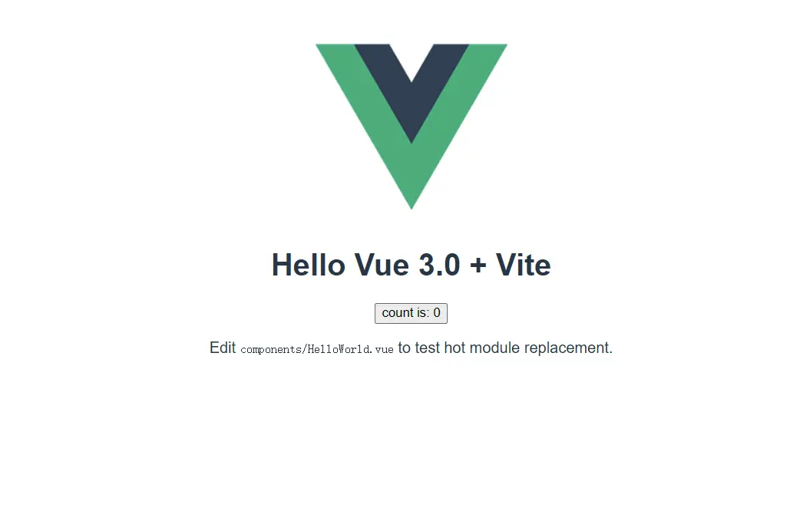

---
nav:
    title: Vue系列
    path: /vue
    order: 5
group:
    path: /front_end
    title: 前置知识
    order: 1    
title: Vite 入门
order: 15
---

# Vite 入门

[Vite](https://vitejs.dev/) 是一个构建工具，最初只是作为 [Vue 单文件组件](https://vuejs.org/guide/scaling-up/sfc.html)（SFC）的开发服务器，但现在已经发展成为一个无捆绑的 JavaScript 开发服务器。它旨在为现代 Web 项目提供更快、更精简的开发体验。

Vite 不会在开发环境中捆绑我们的项目，而是使用原生 ES 模块导入。

根据官方[文档](https://github.com/vitejs/vite)：

> Vite 是一个固执己见的 Web 开发构建工具，它在开发过程中通过原生 ES 模块导入为您的代码提供服务，并将其与用于生产的 [Rollup](https://rollupjs.org/) 捆绑在一起。

Vite 与当前可用的其他开发服务器之间的主要区别在于，它在开发过程中不会捆绑您的文件。

## 它是如何工作的？

模块打包器如今流行的原因之一是，当 ES 模块首次在 ES2016 中引入时，浏览器对 ES6 模块的支持较差。许多现代浏览器现在都支持原生 ES 模块，您可以使用原生的 `import` 和 `export` 语句，我们可以使用 `script` 标签中的 `type="module"` 属性在 HTML 中包含我们的导入，以指定我们要导入的模块：

```html
<script type="module" src="/path/to/file.js"></script>
```

根据[文档](https://vitejs.dev/guide/)，源代码中的 ES 导入语法直接提供给浏览器，任何支持原生 `<script module>` 的浏览器都会自动解析它们，然后为每次导入发出 HTTP 请求。开发服务器拦截来自浏览器的 HTTP 请求，并在必要时执行代码转换。

启动时间大幅提升。

### Vite 特性

使用 Vite 的一些好处包括：

- 裸模块解析
- 模块热替换（HMR）
- 按需编译
- 配置选项

您可以通过在开发模式下的配置文件中添加 [Koa 中间件](https://github.com/koajs/koa)和为构建生成一个 [Rollup 插件](https://github.com/rollup/plugins)来添加对自定义文件转换的支持。

Vite 的其他功能包括：

- 支持 `.tsx` 和 `.jsx` 文件使用 [esbuild](https://github.com/evanw/esbuild) 进行编译
- 对 TypeScript 的开箱即用支持，也使用 [esbuild](https://github.com/evanw/esbuild) 进行编译
- 资源 URL 处理
- 支持 CSS 预处理器、PostCSS 和 CSS 模块
- 支持模式选项和环境变量
- etc

## 基本用法

为了开始使用 Vite，我们将使用 `create-vite-app`，这是一个引导新 Vite 项目的样板文件，除了 Vue 以外，它还支持 React 和 Preact 等多个样板。

依次输入以下命令，使用模板创建新的 Vite 应用程序：

```bash
npx create-vite-app my-vite-project
npm i
npm run dev
```

效果如下：



运行以下命令打包应用程序：

```bash
vite build
```

Vite 使用 Rollup 进行生产构建，生产构建输出位于项目根目录中的 `dist` 目录中。它包含可以部署在任何地方的静态资源（并且可以进行 polyfill 以支持旧版浏览器）。

## 最后

本文简单介绍了 Vite 是如何工作的，它的一些特性，已经如何使用 Vite 构建前端项目。

后面，我会深入它的内部，带您了解它内部的各种工作原理。
