---
nav:
    title: Vue系列
    path: /vue
    order: 4
group:
    path: /front_end
    title: 前置知识
    order: 1    
title: CSS/HTML基础
order: 100    
---

## 第一章 HTML基础强化 

### 1-1 HTML常见元素和理解

以 上 的 标 签 是 出 现 在 head 中 ， 因 为 不 会 在 页 面 上 留 下 什 么 内 容 ， 一 般 是 页 面 相 关 资 源 和 信 息 描 述 等 。

以 上 这 些 则 是 出 现 在 body 中 的 元 素 。

比 较 重 要 的 是 meta：

其 charset 属 性 表 示 页 面 使 用 什 么 字 符 集 （ 编 码 字 符 ， 一 般 都 用 utf-8， 可 以 囊 括 很 多 语 言 ）；

其 name 属 性 一 般 是 写 viewport 即 视 口（ 手 机 /电 脑 屏 幕 能 代 表 的 口 有 多 大 ）。

base 用 的 比 较 少 ，出 现 在 ngo 框 架 中 ，作 用 是 指 定 一 个 基 础 路 径 ， 所 有 路 径 都 是 以 该 路 径 为 基 准 进 行 计 算 ， 就 像 是 baseURL!

viewport 指 定 的 宽 度 越 大 我 们 看 到 的 东 西 就 越 小 ， 通 常 是 用 来 设 备 移 动 端 的 第 一 步 ！

### 1-2HTML常见元素和理解

合 并 单 元 格 是 使 用 colspan、 rowspan。

对 于 表 单 来 说 ，target 是 要 提 交 到 的 地 址 ，method 是 用 什 么 方 式 提 交 、enctype 是 采 用 什 么 编 码（ 针 对 post，URLencode 提 交 文 本 /form-data， form-data 的 好 处 是 把 数 据 编 码 然 后 提 交 ， 可 以 上 传 文 件 ）。

label 的 好 处 就 是 可 以 点 击 文 字 的 时 候（ ○ 关 联 了 文 字 ）就 进 行 选 择 ！

单 选 组 件 中 name 相 同 代 表 是 一 组 的 ， 只 能 选 一 个 ， 当 然 id 是 不 同 的 。

提 交 按 钮 和 重 置 按 钮 都 应 该 放 在 form 表 单 中 才 能 生 效 ， 提 交 按 钮 可 以 用 input 实 现 （ type 也 是 写 成 submit）。

哪 怕 是 使 用 ajax 也 建 议 用 表 单 进 行 提 交 ，好 处 是 可 以 利 用 提 交 和 重 置 ；可 以 批 量 获 取 表 单 数 据 ；与 框 架 /验 证 组 件 结 合 做 一 些 验 证 。

### 1-3HTML 常 见 元 素 和 理 解（3）

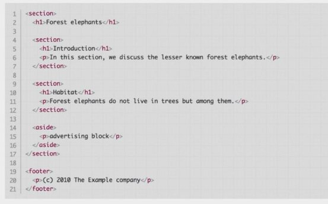

虽 然 是 html 但 是 看 起 来 很 像 是 文 档 /大 纲 ， 结 构 清 晰 语 义 明 显 。

h5O 就 可 以 将 html 转 换 成 一 个 大 纲 （ chrome 插 件 /书 签 ）， 类 似 于 json 的 格 式 化 ， 它 是 将 html 格 式 化 成 大 纲 /文 档 。 好 处 就 是 利 于 SEO 或 其 它 阅 读 器 ！

### 1-4HTML 版 本 问 题

H5 已 经 成 为 标 准 ， 学 习 之 前 的 基 本 没 有 什 么 D 用 ， 不 过 可 以 了 解 。

HTML4 是 基 于 SGML， 写 的 时 候 比 较 随 意 ， 所 以 浏 览 器 需 要 做 很 多 的 修 正 容 错 等 ， 这 就 不 太 科 学 。

XHTML 就 基 于 XML，提 出 比 较 严 格 的 标 准 ，比 如 所 有 的 属 性 都 必 须 有 值 ， 比 较 好 的 约 束 了 开 发 者 良 好 的 编 码 习 惯 。 XHTML2.0 则 提 出 了 更 多 的 规 则 且 不 向 下 兼 容 ，这 就 又 让 人 反 感 。

HTML5 基 于 HTML4 就 去 掉 太 过 严 格 的 规 则 等 等 。

http：//validator.w3.org/check 这 个 网 站 可 以 检 验 html 写 的 如 何 。

以 上 是 在 大 纲 中 会 出 现 的 标 签 ，aside 一 般 用 来 代 表 不 是 很 重 要 的 东 西 （ 广 告 、 简 介 、 友 情 链 接 等 等 ）。

section/article 一 般 用 来 代 表 比 较 有 意 义 的 块（ 前 者 范 围 大 些 如 热 点 新 闻 ，后 者 分 为 小 一 些 如 文 章 标 题 作 者 什 么 的 也 可 以 说 是 相 对 完 整 的 部 分 ）。

i 的 话 原 本 是 代 表 斜 体 ，现 在 被 em 替 代 了 。但 是 保 留 下 来 作 为 图 标 即 icon。

### 1-5 元 素 父 类

select 默 认 是 inline-block 元 素 ；

inline 不 一 定 有 规 则 形 状 （ 就 是 说 空 间 不 够 时 会 换 行 ， 一 半 在 上 一 半 在 下 ）；

W3C 的 phrasing-content 有 详 细 的 具 体 元 素 说 明 （ 了 解 ）。

### 1-6嵌套关系

嵌 套 关 系 就 是 元 素 允 许 出 现 的 位 置 。

p 是 块 级 元 素 表 示 的 是 段 落 ， 它 就 不 能 包 含 div；

a 元 素 是 行 内 元 素 但 是 它 可 以 包 含 块 级 元 素（ 如 a 包 含 div）； HTML4.01 和 XML 的 规 范 本 来 就 是 把 元 素 分 成 块 和 行 内 ， 块 包 含 行 内 而 行 内 不 能 包 含 块 ， 也 就 是 说 a 包 含 div 是 不 合 法 的 只 能 包 含 inline 元 素 当 然 也 不 能 再 包 a， 但 是 所 有 主 流 浏 览 器 都 支 持 a 包 含 div....，因 为 它 太 常 见 了（ 一 个 广 告 是 由 块 级 包 含 的 ， 整 体 又 被 包 到 a， 可 以 跳 转 ）， 所 以 H5 就 做 了 个 合 法 化 ，当 然 合 法 是 重 新 划 分 分 类 ，不 是 说 a 就 可 以 包 含 div。 H5 规 定 a 是 一 个 透 明 的 内 容 模 型 ，也 就 是 计 算 内 容 模 型 的 时 候 a 是 不 参 与 计 算 的 ，算 嵌 套 合 法 性 的 时 候 可 以 当 a 不 存 在 。

第 一 种 看 成 只 有 单 纯 的 div；

第 二 种 也 是 ；

第 三 种 忽 略 了 a 后 是 p 包 含 div 就 不 合 法 了 ；

p 的 内 容 模 型 被 规 定 为 零 碎 的 文 本 模 型 ， 而 div 不 属 于 文 本 模 型 所 以 就 不 合 法 了 。

所 以 嵌 套 关 系 的 依 据 是 分 类 和 内 容 模 型 ，可 以 去 W3C 验 证 看 看 是 否 合 法 ，或 者 看 文 档（ 看 元 素 的 content-model 是 什 么 ， 然 后 它 包 含 的 元 素 属 于 这 个 content-model， 属 于 就 可 嵌 套 ， 不 属 于 就 不 可 嵌 套 ）。

总 之 a包 含 div不 一 定 合 法 需 要 看 a外 面 的 元 素 能 否 包 含 div， 因 为 a 是 透 明 的 内 容 模 型 ， 计 算 嵌 套 关 系 需 要 把 a 拿 掉 ！

1-7 默 认 样 式 和 reset

默 认 样 式 的 意 义 在 于 可 以 给 元 素 一 些 基 本 的 样 式 ，不 用 从 头 到 尾 重 新 写 样 式 ， 不 符 合 HTML 简 洁 的 特 性 。

默 认 样 式 的 问 题 就 是 可 能 带 来 我 们 不 喜 欢 的 样 式 ，需 要 自 己 清 除 原 本 样 式 再 添 加 ；更 加 裂 开 的 是 有 些 默 认 样 式 很 难 清 除

- 如 表 单 元 素 ）。

注 意 html 本 身 也 是 有 样 式 的 ， 样 式 问 题 应 该 从 html 标 签 查 起 。

ul 本 身 是 有 一 个 小 圆 点 ，默 认 样 式 的 时 候 小 圆 点 是 不 会 包 含 在 li 元 素 中 （ 就 是 点 和 li 分 开 成 两 个 块 ）， 我 们 可 以 在 ul 加 上 list-style-position：inside 就 可 以 把 小 圆 点 和 li 放 在 一 起（ 合 成 一 个 块 ， 并 不 是 说 贴 一 起 ）。

cssReset 是 实 际 生 产 形 成 的 写 法 而 非 标 准 故 有 多 种 不 同 的 写 法 ，比 较 著 名 有 YU（I 雅 虎 前 端 框 架 现 在 不 行 了 ）的 CSS Reset、

normalize.css（ 保 留 修 正 一 些 默 认 样 式 而 不 是 全 部 去 掉 ）。

### 1-8 真题

IE 之 前 就 有 自 己 的 渲 染 模 式 ， 这 样 容 易 造 成 不 兼 容 问 题 ，当 然 其 它 浏 览 器 也 有 一 些 不 兼 容 问 题 。

H5 自 己 就 是 一 个 规 范 。

em 和 i 都 是 斜 体 ， 但 是 语 义 层 面 上 不 同 ， i 只 是 单 纯 的 斜 体 没 有 强 调 的 意 思 。

最 后 一 种 是 另 外 一 种 规 范 ，它 会 在 html 做 一 些 标 记 ，进 一 步 语 义 化 ， 和 语 义 化 标 签 并 不 是 很 相 同 。

HTML 写 的 是 文 档 是 文 本 是 一 串 串 字 符 串 而 已 ， 并 不 是 真 的 有 什 么 结 构 ， 解 析 完 才 有 结 构 ！ 哪 怕 是 使 用 innerHtml 也 不 是 直 接 插 入 html 而 是 经 过 了 解 析 变 成 DOM。

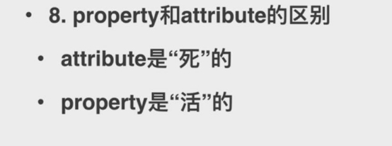

property 是 特 性 ， attribute 是 属 性 （ 写 在 标 签 中 的 任 何 属 性 如 type、 value 什 么 的 ）；

attribute 是 写 在 html 中 的 ， 经 过 DOM 初 始 化 解 析 后 每 个 DOM元 素 就 会 有 一 个 propert（y 把 attribute的 属 性 赋 值 过 去 ）。 而 我 们 直 接 获 取 属 性 值 （ 即 property） 和 通 过 API 获 取 的 是 同 一 个 ，如 果 直 接 修 改 属 性 值 则 开 始 不 同 步 了 ，我 们 标 签 上 的 属 性 仍 然 是 原 值 但 是 页 面 显 示 修 改 后 的 值 ； 如 果 是 通 过 API 修 改 的 话 则 是 标 签 的 值 改 但 是 页 面 不 会 修 改 ， 所 以 两 者

的 改 变 不 会 互 相 影 响 。

## 第 二 章 CSS基础 

### 2-1 选择器 （1）

层 叠 就 是 样 式 可 以 重 叠 （ 后 面 相 同 的 样 式 会 覆 盖 前 面 的 ）。 CSS 一 般 要 求 每 一 行 都 加 ； 作 为 分 隔 符 （ 不 是 语 句 结 束 符 ）。

浏 览 器 解 析 CSS 的 过 程 是 反 过 来 的（ 如 .body div .hello 会 先 找 到 .hello 再 往 上 找 到 div 进 行 验 证 再 往 上 找 到 body 验 证 ， 这 个 是 处 于 性 能 考 虑 ，因 为 反 过 来 找 到 话 可 能 有 很 多 的 子 元 素 ， 类 似 1：n，从 1 找 有 n 个 但 是 从 n 找 就 只 有 1 个 要 找 然 后 再 往 上 验 证 ！）。

伪 元 素 双 冒 号 不 会 出 现 在 HTML、 DOM 树 中 ，但 是 是 一 个 真 实 存 在 的 元 素 可 以 显 示 内 容 可 以 设 置 样 式 ；

属 性 选 择 器 就 是 HTML 标 签 上 有 属 性（ 如 input 标 签 上 有 type 属 性 ）， 通 过 [type=xxx]就 可 以 找 到 这 个 标 签 ；

伪 类 是 单 冒 号 ，是 一 个 元 素 的 状 态（ 伪 元 素 之 前 就 是 合 并 在 伪 类 中 ）；

+表 示 兄 弟 元 素 ；

否 定 选 择 器 是 （ ） 里 面 的 都 不 要 ；

注 意 计 算 的 话 是 不 能 进 位 的 也 就 是 不 能 跨 越 的 ，有 点 像 阶 级 那 种 ， 再 多 也 没 有 ， 不 给 跨 级 。

### 2-2 选择器（2）

元 素 属 性 就 是 style 上 写 样 式 。

### 2-3 非布局样式（字 体 ）

字 体 族 就 是 一 堆 的 字 体 包 括 衬 线 字 体（ 字 周 围 有 一 些 弯 弯 曲 曲 之 类 的 装 饰 性 东 西 如 宋 体 ）、 非 衬 线 字 体 、 等 宽 字 体 、 非 等 宽 字 体 、 手 写 体 、 花 体 （ 华 丽 的 ）。

多 字 体 就 是 写 很 多 个 ，有 一 个 满 足 浏 览 器 就 不 再 往 后 去 找 字 体 。

其 实 浏 览 器 本 身 也 有 默 认 的 多 字 体 ， 可 以 查 看 computed 中 的 渲 染 字 体 用 的 是 什 么 （ 针 对 每 个 字 符 去 找 ！）！

切 记 字 体 名 称 可 以 加 “ ”， 但 是 字 体 族 是 不 可 以 的 ， 它 不 是 具 体 的 字 体 名 （ serif）！

多 字 体 一 般 是 针 对 不 同 平 台 设 置 的 ，而 且 一 个 平 台 应 该 设 置 其 独 有 的 字 体 或 者 用 的 最 多 的 字 体 。

自 定 义 一 个 字 体 可 用 @font-face 实 现 ， 网 络 字 体 类 似 ， 只 不 过 是 用 的 远 程 地 址 则 需 要 考 虑 跨 域 问 题 ，也 是 iconfont 原 理 。

### 2-4 非布局样式（行高）

行 高 由 line-box 组 成 ， line-box 由 inline-box 决 定 ， inline-box 的 高 度 决 定 行 高 的 高 度 。

注 意 底 部 对 齐 的 话 就 是 看 所 有 inline-box 的 底 部 ， 我 们 设 置 vertical-align： middle（ 基 于 baseline） 的 话 如 果 有 一 个 不 设 置 ， 会 因 为 为 了 保 持 底 部 对 齐 而 无 效 ， 除 非 都 设 置 。

只 要 是 行 内 的 元 素 就 会 按 照 行 高 的 构 成 ， vertical-align 按 照 baseline 基 线 对 齐 ， 那 么 基 线 和 底 线 就 会 产 生 空 隙 （ 按 照 字 体 的 大 小 决 定 ， 如 12px 则 空 隙 则 为 3px）， 我 们 只 需 要 把 vertical-align 设 置 成 bottom 就 行 ，当 然 我 们 把 图 片 的 display 改 成 block 也 可 以 。

### 2-5 非 布 局 样 式 （ 背 景 ）

多 背 景 叠 加 就 是 可 以 给 同 一 个 东 西 设 置 多 个 背 景 图 或 渐 变 色 ， 是 CSS3 新 增 ；

雪 碧 图 就 是 方 便 我 们 只 需 要 请 求 一 次 就 能 拿 到 所 有 的 图 片 ， 而 不 用 一 张 图 片 请 求 一 次 ；

背 景 色 可 以 用 单 词（ 除 非 是 非 常 常 见 区 分 度 比 较 高 的 颜 色 才 用 ）、rgb（ 比 较 精 准 但 是 看 不 懂 ）、hsl（ 色 相 0-360 度 、饱 和 度 0-100%、 亮 度 0-100%、 透 明 度 ， 看 起 来 就 比 较 认 识 比 较 友 好 ， 甚 至 可 以 微 调 计 算 ）。

linear-gradient 线 性 渐 变 色 ， 接 收 to 方 向 或 者 直 接 是 一 个 角

度 deg（ 0deg 是 从 下 到 上 ）作 为 渐 变 方 向 、颜 色 1、颜 色 2.... 其 中 每 个 颜 色 都 还 可 以 加 上 百 分 比 规 定 占 比 多 少 （ 可 以 写 transparent 代 表 透 明 ， 如 此 可 以 写 出 形 状 不 同 的 图 形 ）， 同 时 也 可 以 设 置 background-size！

可 以 查 阅 background-size 构 成 的 各 种 图 像 怎 么 实 现 ！ repeat 可 以 控 制 平 铺 与 否 、 平 铺 方 向 ；

position 可 以 设 置 图 片 位 置 ；

size 可 以 设 置 图 片 的 大 小 ；

雪 碧 图 变 化 截 出 来 的 图 片 时 容 器 /图 标 大 小 变 化 就 需 要 改 变 size 和 position！

雪 碧 图 大 小 变 化 一 般 是 在 适 配 移 动 端 的 时 候 ，因 为 移 动 端 分 辨 率 比 较 高（ 原 本 1px 的 东 西 可 能 要 变 成 7/8/9px 就 会 模 糊 ）， 所 以 我 们 缩 小 一 半 图 片 就 比 较 清 晰 （ 二 倍 图 /高 清 屏 /二 倍 屏 等 ）。

把 图 片 变 成 base64 同 样 是 在 节 省 HTTP 的 请 求 数 比 较 适 合 小 图 片 ，缺 点 就 是 文 件 的 体 积 会 增 大（ 一 个 是 图 片 体 积 增 大 为 原 来 的 4/3， 另 一 个 是 原 本 图 片 是 一 个 单 独 文 件 如 此 用 文 字 则 相 当 于 把 它 放 到 CSS 文 字 ）、也 增 大 了 解 码 的 开 销（ 需 要 先 解 码 成 图 片 数 据 再 转 换 成 图 片 ）。

当 然 了 如 果 直 接 写 其 实 到 时 候 不 知 道 这 个 是 什 么 图 片 ，一 般 还 是 引 用 图 片 直 到 构 建 的 时 候 才 转 换 成 base64.

#### 2-6 非 布 局 样 式 （ 边 框 ）

边 框 其 实 是 可 以 拆 成 三 个 属 性 color、 style、 width， 甚 至 还 可 以 拆 成 上 下 左 右 于 是 总 共 12 个 。

这 里 背 景 图 的 30 其 实 代 表 四 个 角 上 的 形 状 （ 30 恰 好 可 以 把 一 个 ◆ 完 整 的 切 出 来 ）， 变 小 的 话 会 越 来 越 不 像 ◆ ， 目 前 区 域 部 分 是 被 拉 伸 不 好 看 ，我 们 可 以 加 上 一 个 repeat 则 可 以 保 持 完 整 重 复 的 ◆ ，但 是 还 是 有 一 点 问 题 ，填 充 的 时 候 还 有 一 些 边 边 角 角 只 能 是 部 分 ◆ ， 所 以 我 们 可 以 改 成 round， 它 就 是 将 中 间 的 图 片 整 个 整 个 去 拼 ，拼 成 整 数 个 ，不 管 宽 高 什 么 的 （ 也 因 为 要 凑 成 整 数 所 以 会 有 部 分 比 较 拥 挤 /宽 松 ）， 这 种 拼 图 用 的 少 但 是 必 要 的 时 候 可 以 不 用 自 己 写 九 宫 格 ！

边 框 如 果 颜 色 不 同 且 相 对 宽 一 点 的 话 可 以 很 明 显 的 看 出 不 同 边 框 交 界 处 是 斜 切 的 形 状 。

我 们 可 以 利 用 这 个 特 性 做 一 些 有 意 思 的 东 西 ，比 如 设 置 右 边 为 透 明 则 可 以 形 成 一 个 红 色 梯 形 ，左 边 也 透 明 就 是 等 边 梯 形 了 ，那 么 我 们 再 把 盒 子 width 设 置 成 0 就 构 成 三 角 形 了 ！（ 因 为 梯 形 是 由 于 盒 子 的 宽 度 撑 开 的 ， 就 是 多 了 上 面 一 条 线 嘛 ， 这 条 线 就 是 盒 子 宽 度 ）。 另 外 改 变 边 框 的 宽 度 也 可 以 调 整 三 角 形 的 大 小 尺 寸 角 度 ， 加 多 一 个 border-radius： xxpx 可 以 变 成 一 个 扇 形 。

### 2-7 非 布 局 样 式 （ 滚 动 ）

内 容 比 容 器 多 就 会 产 生 滚 动 。 设 置 overflow 四 种 值 ：

auto 是 内 容 比 较 多 无 需 滚 动 就 不 显 示 滚 动 条 ， 超 出 就 显 示 ； scroll 是 始 终 显 示 ！

mac 上 面 由 于 系 统 可 以 设 置 滚 动 条 行 为 ， 所 以 auto 和 scroll 很 难 分 出 区 别 ， 但 是 window 可 以 。

### 2-8 非 布 局 样 式 （ 文 本 折 行 ）

overflow-wrap 兼 容 性 差 一 些 ，用 word-wrap 多 一 些 ，当 然 两 者 一 样 东 西 ，控 制 是 否 换 行 和 换 行 是 否 保 留 单 词 ，即 使 是 打 断 单 词 break-word 也 是 会 尽 量 保 持 单 词（ 不 然 太 长 的 单 词 会 占 一 行 ）。

word-break 是 要 不 要 把 单 词 /字 母 看 成 一 个 单 位 ，就 是 尽 量 让 单 词 不 换 行 或 尽 量 让 单 词 去 换 行 ，取 决 于 把 谁 当 单 位 ；打 断 单 词 break-all 就 是 直 接 不 管 单 词 不 把 单 词 看 成 单 位 ，拼 命 拆 ； 若 是 keep-all 就 是 把 单 词 都 保 留 下 来 ， 把 单 词 看 成 单 位 （ 句 子 也 是 ）。

white-space 就 是 说 有 空 白 的 时 候 是 否 需 要 换 行 ，很 多 时 候 我 们 会 用 空 格 来 作 为 换 行 时 机 ，一 般 是 只 用 nowrap，全 部 不 换 行 ！ 一 行 显 示 ！。

彼 此 组 合 是 非 常 之 复 杂 。

默 认 都 是 normal， 单 词 不 会 打 断 、 中 文 按 一 个 个 字 换 行 。

### 2-9 非 布 局 样 式 （ 装 饰 性 属 性 ）

注 意 font-weight 如 果 用 数 字 表 示 只 能 是 100-900（ 不 一 定 所 有 操 作 系 统 都 支 持 这 些 值 ， 所 以 不 一 定 500 对 于 400， 但 是 900 就 一 定 大 于 100）；

bolder 和 lighter 具 体 的 值 不 确 定 而 是 相 对 于 父 元 素 ；

### 2-10 hack 和 案 例 （ 1）

CSS hack 比 较 少 用 了 ， 除 非 是 要 来 兼 容 IE8/7/6；

CSS hack 就 是 针 对 一 部 分 浏 览 器 生 效 的 写 法 ， 处 理 兼 容 性 ； 特 性 检 测 就 是 检 测 浏 览 器 有 无 这 种 特 性 ，没 有 就 针 对 性 处 理 ， 也 就 是 针 对 性 加 class， 就 无 需 太 多 的 hack， 相 对 比 较 标 准 ； hack 好 处 就 是 简 单 粗 暴 ，马 上 解 决 问 题 ，如 果 真 的 要 使 用 时 ， 标 准 属 性 写 到 前 面 ， hack 写 到 后 面 ！ 不 然 会 生 效 标 准 属 性 ！

### 2-11 hack 案 例 （ 2）

雪 碧 图 主 要 是 由 于 背 景 图 、 边 框 ；

这 次 我 们 试 一 下 如 何 实 现 点 击 图 片 的 切 换 （ 不 用 js）

可 以 看 到 我 们 其 实 是 有 一 个 input，但 是 隐 藏 了 ，同 时 文 字 加 上 了 label 就 是 为 了 隐 藏 的 时 候 还 能 联 动 input 的 状 态 ！不 然 隐 藏 达 到 预 期 图 样 却 点 击 无 效 ；

+代 表 兄 弟 元 素 ；

样 式 就 可 以 加 到 label 上 去 ， 如 此 美 化 就 非 常 的 炫 酷 ！

甚 至 还 可 以 做 成 选 项 卡 、 树 等 等 。

### 2-12 面 试 题 （ 1）

### 2-13 面 试 题 （ 2）

考 虑 到 兼 容 性 ， 可 能 伪 类 也 需 要 写 单 冒 号 。

## 第 三 章 CSS 布 局

3-1 布 局 简 介

现 在 表 格 布 局 也 是 流 式 加 载 了 ，之 前 是 加 载 完 全 部 的 再 加 载 表 格 ； 当 然 还 是 有 语 义 不 明 显 的 缺 点 ；

### 3-2 布 局 方 式 （ 表 格 ）

表 格 布 局 也 可 以 用 div 外 加 display 为 table 实 现（ 适 合 偷 懒 ）！

### 3-3 一 些 布 局 属 性

默 认 情 况 下 ， 宽 高 只 是 对 内 容 生 效 ；

默 认 情 况 下 是 static 也 就 是 静 态 布 局 、 按 照 文 档 流 一 个 个 去 布 局 （ 一 行 一 个 向 下 排 ）；

relative 的 偏 移 是 相 对 于 元 素 本 身 ，且 不 会 改 变 其 占 据 的 空 间 ！ 就 是 偏 移 后 计 算 布 局 还 是 按 原 本 的 空 间 计 算（ 假 装 还 在 那 个 地 方 ）；

absolute 脱 离 文 档 流 就 不 会 对 其 它 元 素 的 布 局 造 成 影 响 （ 就 不 会 占 据 原 本 的 空 间 ）， 相 当 于 一 个 独 立 的 存 在 ； 相 对 于 最 近 父 级 的 relative 或 者 absolute 定 位 （ 就 是 不 算 兄 弟 元 素 ）； fixed 也 是 脱 离 文 档 流 ， 相 对 于 可 视 区 域 是 固 定 的 ；

层 叠 一 般 是 按 照 定 义 的 顺 序 来 叠 的 ， 当 然 可 以 设 置 z-index

- 定 位 为 relative、absolute、fixed 是 可 以 设 置 z-index）手 动 修 改 重 叠 ；

### 3-4flexbox 布 局

  

  由 于 兼 容 性 问 题 还 是 没 有 大 规 模 的 使 用 ，低 版 本 IE 完 全 不 支 持 、 flex 本 身 版 本 也 更 新 了 三 次 ；

  移 动 端 的 话 使 用 flexbox 倒 是 极 好 ！

### 3-5float 布 局

  

  浮 动 元 素 会 脱 离 文 档 流 不 会 对 其 它 元 素 的 布 局 产 生 影 响 ，不 会 占 据 原 本 的 空 间 ；

  但 是 它 不 脱 离 文 本 流 ！也 就 是 会 影 响 原 本 空 间 的 文 本 ，它 本 身 也 就 是 为 了 做 图 文 混 排 环 绕 的 效 果 ！

  

  如 上 图 绿 色 盒 子 是 浮 动 了 ，红 色 盒 子 直 接 占 据 其 位 置 但 是 文 本 却 不 行 。

  

  float 形 成 块 即 BFC 可 以 让 行 内 元 素 能 够 设 置 宽 高 ，就 是 自 己 接 管 宽 高 ；

  尽 量 靠 是 依 据 往 哪 里 浮 动 （ 上 是 确 定 的 ，左 右 看 方 向 ） 但 是 不 能 挤 掉 原 本 的 元 素 ， 宽 度 如 果 不 够 也 会 往 下 掉 ；

  

  

  高 度 塌 陷 就 是 子 元 素 浮 动 在 布 局 上 消 失 ，父 元 素 无 法 感 知 其 高 度 加 上 没 有 其 它 子 元 素 帮 忙 撑 开 就 会 高 度 为 0；

  如 果 不 想 高 度 塌 陷 的 话 有 两 个 思 路 ， 可 以 给 父 元 素 加 一 个 BFC 让 它 接 管 自 己 的 宽 高 ， 也 可 以 里 面 有 其 它 元 素 撑 开 高 度

- 如 下 ）！

clear both 就 是 保 证 元 素 的 左 右 两 边 没 有 浮 动 元 素 ，由 于 浮 动 元 素 都 是 靠 上 的 基 本 ，那 么 保 证 左 右 两 边 没 有 就 是 在 浮 动 元 素 的 下 面 了 ；

默 认 是 inline 记 得 补 上 一 个 block，当 然 这 样 子 我 们 是 加 入 了 一 个 多 余 的 元 素 又 挤 在 下 面 ，我 们 可 以 设 置 高 度 为 0 就 不 会 超 出 预 期 的 高 度 什 么 的 ， 隐 藏 里 面 的 内 容 ；

用 float 做 两 栏 布 局 的 时 候 记 得 没 有 浮 动 的 一 方 要 给 空 出

- margin） 一 定 的 空 间 给 浮 动 元 素 （ 因 为 不 会 占 据 空 间 ） 也 就 是 一 边 浮 动 ， 另 一 边 给 个 margin；

  做 三 栏 布 局 记 得 左 右 先 写 ，原 因 很 简 单 ，float 会 尽 量 向 上 靠 但 是 被 中 间 挡 住 了 ，要 把 中 间 丢 后 面 去 就 不 会 被 挡 住 导 致 右 边 的 偏 下 ；

### 3-6inline-block 布 局

  其 实 我 们 布 局 的 核 心 就 是 为 了 让 块 排 成 一 行 ；

  

  其 实 有 个 独 特 的 问 题 ，设 置 了 inline-block 的 盒 子 可 以 认 为 是 一 个 文 字 ，那 么 文 字 与 文 字 之 间 就 会 有 间 隙 ，所 以 盒 子 与 盒 子 就 有 间 隙 ；

  比 较 简 单 的 解 决 方 法 就 是 给 父 元 素 加 一 个 font-size：0，毕 竟 大 小 为 0 了 还 怎 么 有 间 隙 ；

  不 过 由 于 font-size 会 继 承 ， 所 以 左 右 盒 子 需 要 重 新 设 置 font-size 大 小 ；

  

  观 察 一 下 我 们 可 以 看 到 间 隙 是 来 自 于 html 标 记 中 的 空 白 ，那 么 另 一 种 去 掉 间 隙 的 方 式 是 把 两 个 div 标 签 中 间 部 分 给 注 释 或 者 直 接 不 换 行 ；

  

  比 较 适 合 定 宽 ， 不 好 做 响 应 式 ！

### 3-7 响应式布局（1）

实 现 主 要 从 设 计 和 实 践 上 考 虑 适 配 ；

设 计 上 需 要 考 虑 隐 藏（ 确 定 好 移 动 端 可 以 隐 藏 什 么 内 容 ，比 如 导 航 个 人 中 心 什 么 的 改 成 弹 窗 、侧 边 框 框 和 链 接 什 么 的 可 能 就 不 要 了 ）、折 行（ 从 一 行 n 个 改 成 一 行 1 或 者 2 个 ）、自 适 应 空 间 就 是 留 一 些 空 间 ；

方 法 上 考 虑 rem（ 根 据 html 标 签 字 体 大 小 确 定 元 素 大 小 ，根 据 不 同 大 小 屏 幕 给 出 不 同 大 小 的 字 号 就 可 以 改 变 元 素 ）单 位 、 viewport 用 js 或 手 动 确 定 界 面 放 到 多 大 、 media 媒 体 查 询 根 据 不 同 设 备 特 性 匹 配 不 同 的 样 式 ；

第 一 件 事 就 是 设 置 viewport，content 那 里 的 意 思 是 可 视 区 域 的 大 小 等 于 屏 幕 大 小 ， 不 设 置 的 话 很 经 常 会 被 默 认 设 置 为 960px 宽 度 （ 就 是 屏 幕 显 示 的 内 容 是 有 960px 宽 度 的 内 容 ，

那 么 就 要 缩 的 很 小 ）；

考 虑 到 把 一 些 没 有 用 的 给 隐 藏 掉 ， 640px 以 下 的 手 机 ；

### 3-8 响应式布局（2）

我 们 如 果 需 要 折 行 可 以 考 虑 加 一 下 margin 同 时 设 置 为 block 就 不 会 排 在 一 行 了 ；

这 样 子 还 是 有 一 些 问 题 ，我 们 可 能 屏 幕 大 小 不 一 样 而 显 示 的 内 容 差 不 多 大 小 ， 如 果 想 要 等 比 缩 放 页 面 可 以 修 改 一 下 content， 给 定 一 个 宽 度 则 不 同 宽 度 的 就 会 去 等 比 缩 放 内 容 ！ 那 么 宽 度 大 的 就 会 放 大 内 容 ！

当 然 ，做 的 更 好 的 是 用 一 个 脚 本 去 计 算 应 该 多 少 宽 度 去 动 态 适 配 ；

等 比 缩 放 的 话 还 可 以 使 用 rem， html 标 签 默 认 的 font-size 为 16px（ 可 改 成 方 便 计 算 的 数 ），那 么 1rem 就 等 于 16px，我 们 可 以 自 己 规 定 多 少 px 然 后 用 rem 去 代 替 ， 然 后 添 加 媒 体 查 询 根 据 不 同 设 备 改 变 html 中 字 体 大 小 ；

注 意 ！写 媒 体 查 询 的 时 候 需 要 把 大 的 写 在 前 面 ！！（ 因 为 不 这 样 的 话 到 时 候 大 小 屏 幕 都 匹 配 到 后 面 那 个 适 配 最 大 的 ）另 外 rem 的 精 度 不 一 定 准 确 ， 可 能 出 现 小 数 等 情 况 ！

### 3-9 主 流 网 站 使 用 的 布 局 方 式

腾 讯 网 用 两 栏 布 局 ，采 用 左 右 浮 动 加 定 宽 ，清 除 浮 动 加 ：after； 网 易 同 上 ；

淘 宝 也 是 如 此 ；

百 度 左 右 浮 动 ，然 后 直 接 在 最 后 面 加 上 一 个 盒 子 来 清 除 浮 动 避 免 不 支 持 伪 元 素 的 浏 览 器 ；

浮 动 布 局 必 须 掌 握 ，使 用 太 广 泛 适 应 性 太 好 了 ，一 般 都 是 采 用 定 宽 没 有 自 适 应 ；

3-10CSS 面 试 题

第 二 种 国 内 使 用 广 泛 ， 记 得 清 除 浮 动 ；

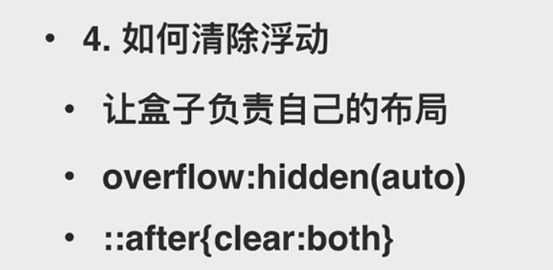

## 第 四 章 CSS 效 果 

### 4-1box-shadow

前 两 个 参 数 是 偏 移 量 （ x、 y） 就 是 阴 影 虚 线 框 与 原 本 图 形 相 距 的 位 置 ；

第 三 个 是 阴 影 的 模 糊 区 域 多 大（ 虚 的 模 糊 的 地 方 ，一 般 就 是 填 充 在 周 边 ）；

第 四 个 是 阴 影 要 拓 展 多 少（ 实 的 ，填 充 原 图 与 模 糊 地 方 交 界 的 地 方 ） 即 拓 展 区 域 （ 若 为 负 值 就 可 以 缩 小 阴 影 ）；

insert 是 内 阴 影 ， 阴 影 在 盒 子 里 面 ；

注 意 阴 影 的 形 状 与 原 图 一 致 （ 比 如 加 了 radius， 阴 影 也 会 加 上 ）；

可 以 利 用 box-shadow 实 现 一 个 div 画 什 么 什 么 ，而 且 有 很 多 东 西 是 靠 一 个 个 点 拼 起 来 的 （ 无 限 投 影 ）。

靠 box-shadow 做 出 来 的 边 框 是 不 会 占 据 空 间 ！！ 所 以 不 会 影 响 布 局 排 版 ！！

### 4-2text-shadow

### 4-3border-radius

百 分 比 的 取 值 是 看 元 素 的 宽 高 （ 若 有 边 框 需 要 加 上 边 框 ）， 超 过 50%则 无 效 ；

左 上 有 border-radius， 其 余 为 0 则 可 以 实 现 一 个 扇 形 ；

上 图 是 写 法 是 写 成 长 短 轴 也 就 是 椭 圆 （ 每 组 10px 和 20px 是 一 个 角 ）， 代 表 水 平 和 垂 直 方 向 ；

### 4-4background

background 可 以 叠 加 和 渐 变 ；

雪 碧 图 动 画 就 是 做 切 换 动 画 的 时 候 ，可 以 通 过 移 动 位 置 改 变 很 轻 易 改 变 一 个 图 标 ， 同 时 还 可 以 加 transition！

背 景 图 比 容 器 大 则 会 被 截 掉 一 部 分 图 片 ， 可 以 设 置 position 来 选 择 背 景 图 的 位 置 ；

也 可 以 设 置 size 来 决 定 背 景 图 的 大 小 （ 可 能 会 重 复 ）， 有 一 个 cover 可 以 保 证 长 宽 比 不 变 同 时 覆 盖 整 个 容 器 ， 超 出 部 分

被 隐 藏 而 contain 则 是 保 持 长 宽 比 不 变 且 多 的 部 分 也 显 示 出 来 （ 即 展 示 整 个 背 景 图 ）， 可 能 会 导 致 有 一 部 分 空 白 ； repeat 用 来 设 置 重 复 与 否 和 重 复 出 现 的 位 置 ；

### 4-5clip-path

clip 就 是 裁 剪 ， 整 个 意 思 就 是 按 路 径 裁 剪 （ 指 定 裁 剪 容 器 部 分 ）；

inset 是 一 个 方 形 区 域（ 在 某 个 某 个 地 方 显 示 一 个 方 形 内 容 ）； circle 是 一 个 圆 形 的 区 域 ， 与 我 们 border-radius 的 区 别 就 是 clip-path 的 容 器 占 位 /定 位 是 不 变 的 即 无 需 调 整 容 器 大 小 、方 便 做 容 器 内 的 动 画 （ 也 就 不 用 调 整 容 器 ）；

polygon 是 多 边 形 （ 其 实 就 是 定 义 了 几 个 重 要 的 点 然 后 连 起 来 ）；

也 可 以 通 过 加 载 svg 来 裁 剪 ；

### 4-6 3D-transform

2D 变 换 就 是 前 面 没 有 加 3D 的 ， 包 括 四 种 ： 位 移 、 缩 放 、 斜 切 （ 比 如 一 个 正 方 形 被 拉 成 一 个 平 行 四 边 形 ）、 旋 转 。

2D 变 换 中 X 是 右 移 、 Y 是 下 移 、 rotate 是 旋 转 ；

注 意 三 者 的 顺 序 如 果 改 变 了 就 会 导 致 结 果 不 同（ 底 层 原 理 结 果 是 靠 矩 阵 运 算 得 出 的 ）；

z-index 其 实 就 是 z 轴 即 从 里 面 到 外 面 ；

如 果 只 是 单 纯 的 设 置 z 是 没 有 效 果 的 ，因 为 投 影 的 话 ，3D 空 间 需 要 利 用 一 些 视 觉 原 理 来 实 现 （ 透 视 ， 不 然 看 不 出 来 ）；

所 以 需 要 设 置 perspective、 和 transform-style 就 能 有 一 个 初 步 的 立 体 的 感 觉 ；

perspective 决 定 了 各 个 侧 边 的 大 小 （ 值 越 大 则 侧 边 越 小 立 体 越 不 明 显 ）， 可 以 理 解 为 我 离 这 个 立 方 体 的 距 离 （ 值 越 小 越 近 我 看 到 的 自 然 是 越 大 的 侧 边 ，越 远 看 到 的 自 然 是 一 个 越 来 越 小 的 侧 边 甚 至 只 剩 下 给 点 ）， 其 实 就 是 透 视 角 度 ；

注 意 transform 只 是 对 元 素 样 式 的 变 换 ， 跟 动 画 没 有 不 然 的

关 系 ， 不 过 确 实 可 以 用 transition 监 听 transform 的 变 化 来 添 加 动 画 ；

### 4-7 CSS 面 试 真 题

outline 可 定 性 并 不 是 行 高 ；

## 第 五 章 CSS 动 画 
### 5-1 动 画 介 绍

让 每 个 画 面 保 持 每 秒 多 少 帧 也 就 是 每 秒 多 少 个 画 面 去 持 续 不 断 的 呈 现 且 差 异 性 比 较 小 就 能 有 动 画 ；

好 处 是 体 现 愉 悦 感 、引 起 注 意 、反 馈 、掩 饰 运 算 加 载 过 程（ 就 是 加 载 的 时 候 用 loading 来 展 示 而 不 是 尴 尬 的 等 待 中 ）；

补 间 动 画 就 是 一 个 动 画 可 以 从 一 个 状 态 变 成 另 一 个 状 态 且 状 态 的 切 换 是 有 动 画 ， 有 开 头 有 结 尾 中 间 过 程 靠 补 ；

关 键 帧 动 画 也 包 含 了 补 间 动 画 ， 区 别 是 有 很 多 帧 ；

逐 帧 动 画 是 中 间 无 补 间 的 动 画 ， 画 面 之 间 无 计 算 ；

### 5-2 transition 动 画 （1）

补 间 动 画 其 实 是 确 定 了 起 始 和 结 束 然 后 中 间 靠 浏 览 器 计 算

- 并 不 是 全 部 都 能 计 算 ， 一 般 是 下 面 这 些 ）；

前 面 介 绍 的 旋 转 、 缩 放 、 位 移 等 都 是 线 性 变 换 的 特 例 ；

补 间 动 画 的 属 性 是 transition，也 可 以 称 为 过 渡 动 画 ，接 收 延 迟 时 间 、 动 画 针 对 的 属 性 、 执 行 时 间 ；

transition 其 实 是 合 起 来 的 属 性 ， 可 以 拆 开 写 ， 如 transition-delay 就 是 动 画 要 延 迟 多 久 才 触 发 ；

transition 支 持 同 时 指 定 多 个 属 性 或 者 说 多 个 动 画（ 直 接 写 all 也 行 ）；

是 不 是 线 性 变 换 就 是 说 是 不 是 匀 速 ， 这 个 要 靠 transition-timing-function 指 定 动 画 时 间 与 进 度 的 关 系（ 缓 动 ）；

其 实 chrome 是 支 持 动 画 面 板 调 试 的 ， 在 打 开 了 调 试 工 具 后 按 ESC 就 会 出 现 ， 里 面 有 animation 选 项 卡 可 以 看 到 相 关 的 内 容 ；

### 5-2 transition 动画（1）

CSS 内 置 的 缓 动 函 数 不 是 很 多 ， 也 可 以 自 己 使 用 贝 塞 尔 曲 线 去 做 （ 网 上 找 工 具 如 Ceaser）；

### 5-4 keyframes 动 画

关 键 帧 比 如 说 指 定 ABC 的 状 态 然 后 中 间 部 分 由 CSS 自 动 计 算 ； 多 个 补 间 动 画 就 是 说 有 多 个 状 态 的 变 更 （ 不 只 是 两 个 ）；

与 transition 最 大 的 区 别 就 是 元 素 不 需 要 一 定 有 变 化（ 比 如 加 hover 或 者 class） 才 能 有 动 画 ；

可 以 看 到 transition 要 求 一 定 要 有 状 态 的 变 更 才 能 有 过 渡 而 关 键 帧 不 需 要 ，可 以 直 接 指 定 就 行 ，也 就 是 说 进 去 就 开 始 动 画 了 ；

只 有 0%和 100%时 可 以 换 成 from 和 to， 当 然 还 有 其 它 的 话 就 要 写 百 分 比 了 ；

direction 可 以 规 定 动 画 方 向 ；

iteration-count 可 以 决 定 动 画 次 数 ；

play-statue 可 以 指 定 动 画 的 状 态 （ 如 paused 是 暂 停 ）； fill-mode 可 以 决 定 动 画 播 放 完 的 状 态 （ 默 认 是 回 到 原 本 的 状 态 ）， 比 如 说 forwards 就 是 播 放 完 就 停 留 在 结 束 时 的 状 态 ， backwards 就 是 相 反 的 ；

其 实 播 放 完 的 状 态 也 可 以 在 百 分 比 那 里 修 改 ；

注 意 keyframes 的 话 是 非 常 灵 活 （ 可 以 控 制 各 个 进 度 和 具 体 状 态 、 方 向 等 ）。

### 5-5 逐 帧 动 画

每 一 帧 都 是 关 键 帧 ， 中 间 没 有 补 间 过 程 没 有 过 渡 （ 有 就 是 keyframes 了 ）；

注 意 依 然 是 使 用 keyframe（s 所 以 CSS 只 有 两 种 动 画 transition 和 keyframes）， 可 以 理 解 为 是 特 例 ；

无 法 补 间 需 要 自 己 手 动 一 帧 帧 搞 ，也 意 味 着 要 很 多 帧 图 片 故 资 源 大 ；

实 现 猎 豹 动 画 （ 因 为 有 八 张 图 片 所 以 需 要 八 段 ）；

但 是 仅 仅 是 这 样 子 写 是 有 问 题 的 ，会 不 断 的 闪 动（ 因 为 补 间 会 帮 我 们 加 上 一 些 过 渡 动 画 ）， 所 以 我 们 需 要 去 掉 这 个 自 动 加 上 的 过 渡 动 画 ， 可 以 利 用 timing-function（ 指 定 时 间 与 动 画 进 度 的 关 系 ）指 定 在 时 间 动 的 时 候 动 画 不 要 动（ 除 非 切 换 ） 就 可 以 了 。

steps 其 实 就 是 指 定 关 键 帧 间 有 几 个 画 面 ，写 1 可 以 实 现 逐 帧 动 画 （ 也 就 是 每 个 区 间 之 间 没 有 其 它 画 面 没 有 过 渡 ）， 写 2 则 关 键 帧 之 间 有 1 个 过 渡 （ 竖 线 ）， 图 是 写 了 3 的 时 候 （ 两

个 竖 线 三 个 画 面 ）。

适 用 于 动 画 面 积 小 、 时 长 不 大 的 时 候 。

5-6CSS 面 试 真 题

## 第 六 章 预 处 理 器 

### 6-1 介 绍

less 是 js 写 的 ， 编 译 速 度 快 且 浏 览 器 中 有 可 以 使 用 的 版 本 ， 不 需 要 预 先 编 译 ，入 门 相 对 简 单 但 是 一 些 复 杂 的 情 况 比 较 繁 琐 ；

sass 是 R 写 的 ， 编 译 比 较 慢 （ 可 以 使 用 移 植 版 本 解 决 这 个 问 题 ）；

CSS 的 import 不 会 合 并 代 码 而 是 在 浏 览 器 动 态 引 用 CSS 文 件 则 需 要 每 个 文 件 都 发 送 一 个 独 立 的 请 求 ， 也 就 是 性 能 差 ； 但 是 预 处 理 器 可 以 帮 我 们 把 这 些 拆 开 的 模 块 组 合 起 来 减 少 请 求 。

### 6-2less 嵌 套

首 先 需 要 安 装 less 的 编 译 包 ，npm install less，然 后 就 可 以 使 用 lessc 工 具 了 ；

注 意 后 缀 名 是 是 less；

可 以 看 到 是 允 许 嵌 套 其 子 元 素 的 样 式 ；

&则 相 当 于 是 平 级 的 关 系 ；

写 完 之 后 就 可 以 通 过 lessc less 文 件 来 做 编 译 （ >xxx， 可 以 生 成 到 xxx）。

### 6-3sass 嵌 套

sass 就 是 scss；

需 要 先 安 装 node-sass；

后 缀 是 scss；

编 译 可 以 通 过 node-sass scss 文 件 ；

### 6-4less 变 量

变 量 存 在 就 是 为 了 让 我 们 避 免 写 重 复 的 值 同 时 可 以 参 与 运 算 ；

less 中 变 量 的 写 法 是 @变 量 名 ： 值 ；

其 实 less 和 sass 提 供 了 很 多 颜 色 函 数 ，比 如 lighten 就 是 让 颜 色 变 浅 ；

一 旦 需 要 改 颜 色 什 么 的 就 可 以 通 过 变 量 来 进 行 修 改 ；

当 然 实 际 开 发 的 话 可 能 会 有 很 多 的 变 量 ，而 不 是 直 接 靠 这 几 个 去 计 算 ！ 也 就 是 要 有 规 划 ， 看 看 什 么 是 有 关 联 的 ！

### 6-5sass 变 量

sass 变 量 是 $变 量 名 ： 值 ； 其 余 的 核 心 功 能 基 本 一 样 。

### 6-6less mixin

考 虑 到 要 复 用 一 段 公 共 代 码 ， css 可 以 利 用 公 共 的 class（ 主 要 是 在 div 里 面 出 来 ，标 签 添 加 class 的 时 候 ，加 多 一 个 公 共 class）， 再 去 写 它 本 身 的 class， 然 而 如 此 只 是 在 html 中 复 用 而 已 ；

mixin 有 点 像 参 数 ， 选 择 器 （ 参 数 ） {具 体 样 式 }；

使 用 的 时 候 就 调 用 这 个 选 择 器 即 可 ；

注 意 less 中 如 果 mixin 是 加 了 （ ） 是 不 会 编 译 出 来 ， 不 加 就 会 被 编 译 出 来 ；

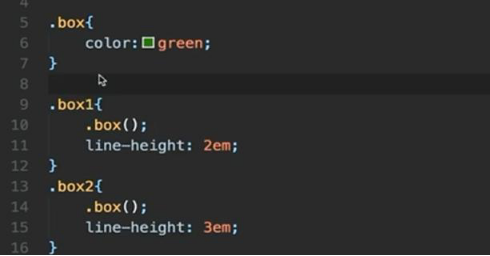

### 6-6 sess mixin

概 念 与 less 几 乎 一 致 ；

但 是 less 的 mixin 是 可 以 直 接 用 class 去 做 ，但 是 sass 要 求 必 须 显 示 的 声 明 这 个 是 mixin，就 不 能 既 是 class 又 是 mixin，且 名 字 不 需 要 class 直 接 写 名 字 就 行 ；

调 用 的 时 候 也 是 需 要 通 过 @include 显 示 声 明 ，同 时 函 数 名 称 不 是 一 个 class；

### 6-8less extend

其 实 按 照 前 面 说 的 mixin，就 是 直 接 拷 贝 一 份 到 使 用 mixin 的 地 方 ， 那 么 会 增 加 很 多 重 复 的 代 码 ；

如 果 不 使 用 预 处 理 器 则 是 这 么 写 比 较 合 适 ；

那 么 如 何 使 用 预 处 理 器 来 解 决 这 样 的 问 题 ？ 就 是 使 用 extend；

extend 有 如 上 两 种 写 法 ， 其 实 都 一 样 ；

编 译 之 后 CSS 就 会 提 取 成 公 共 样 式 了 而 不 是 直 接 复 制 ，如 下 ：

mixin 是 直 接 复 制 （ 场 景 太 复 杂 ， 需 要 参 数 什 么 的 时 候 ） 而 extend 是 把 选 择 器 提 取 出 来 然 后 把 公 共 样 式 写 到 一 起（ 利 用 编 译 产 生 更 小 的 代 码 但 是 不 能 使 用 参 数 ）。

### 6-9 sass extend

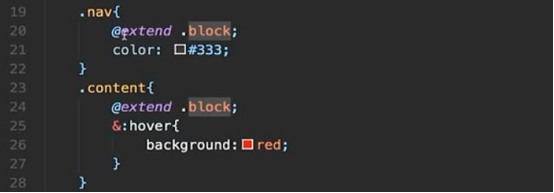

sass 直 接 @extend 类 名 ， 无 需 ：（ 类 名 ）；

### 6-10less loop

对 于 一 些 有 规 律 的 样 式（ 网 格 系 统 、多 个 差 不 多 样 式 但 是 有 微 小 差 异 的 ） 就 可 以 利 用 预 处 理 器 循 环 去 做 ；

由 于 mixin 可 以 调 用 自 己 ，所 以 我 们 可 以 在 mixin 调 用 自 己 达 到 递 归 的 效 果 ， 不 过 记 得 给 个 出 口 也 就 是 结 束 条 件 when； 由 于 是 先 递 归 再 给 的 样 式 ，所 以 样 式 的 顺 序 应 该 是 从 1到 12；

### 6-11 sass loop

sass 的 条 件 判 断 是 支 持 if 的 而 不 是 写 在 外 面 ；

但 是 sass 是 支 持 for 循 环 的 ， 我 们 可 以 不 用 递 归 ！

这 里 $i 是 变 量 ， 1 和 12 是 代 表 变 量 的 值 （ 从 1-12）；

### 6-12 less import

CSS 中 也 是 如 此 做 的 ， 但 是 它 不 会 做 任 何 合 并 或 者 复 用 链 接 的 事 情 ，只 能 一 个 个 去 加 载 ，导 致 添 加 http 请 求 ，降 低 性 能 ； 而 less 允 许 我 们 引 入 很 多 不 同 的 模 块 但 是 编 译 的 时 候 会 帮 我 们 合 并 成 一 个 css 文 件 ；

注 意 预 处 理 器 的 变 量 是 可 以 跨 文 件 使 用 的 ，但 是 必 须 合 理 正 确 的 引 入 （ import）；

### 6-15 sass import

基 本 一 致 ；

### 6-14 预 处 理 器 框 架

预 处 理 器 的 模 块 化 让 我 们 能 够 按 需 的 引 入 别 人 的 代 码 ；

这 些 框 架 就 是 提 供 了 很 多 写 好 的 mixin 供 人 调 用 （ 也 就 是 js 中 的 类 库 ）；

简 单 讲 讲 compass， 它 可 以 帮 我 们 把 里 面 可 能 导 致 兼 容 性 的 写 法 完 善 一 下 ；

EST 是 百 度 团 队 写 的 ；

Autoprefixer 可 以 帮 助 我 们 解 决 前 缀 问 题 （ 自 动 加 浏 览 器 前 缀 ）；

est本 身 就 是 按 需 的 ，根 据 我 们 使 用 的 什 么 mixin编 译 出 什 么 ， 使 用 我 们 写 all引 入 所 有 的 less和 分 模 块 引 入 less文 件 是 没 有 区 别 的 ；

然 后 两 个 @是 添 加 一 下 全 局 的 配 置 如 兼 容 i7和 取 消 自 动 加 前 缀 ；

紧 接 着 是 重 置 样 式 ；

在 .box 中 使 用 了 一 些 mixin；

最 后 一 个 是 加 了 个 三 角 形 ；

### 6-15 真 题

预 处 理 器 不 属 于 基 础 知 识 ，考 察 的 时 候 更 多 的 是 其 具 体 的 实 现 ；

## 第 七 章 Bootstrap

###  7-1 Bootstrap 介 绍

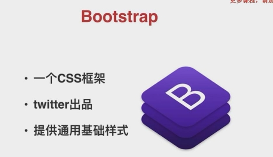

### 7-2 Bootstrap 基 本 用 法

使 用 bootstrap 可 以 先 下 载 ，打 开 后 会 有 css 和 js两 个 文 件 夹 ； 然 后 就 可 以 在 需 要 使 用 的 地 方 link 引 入 其 中 的 样 式 文 件 ；

### 7-3 Bootstrap 基 本 用 法 （ 2）

需 要 让 我 们 的 内 容 居 中 可 以 利 用 网 格 布 局 ；

在 bootstrap 中 可 以 添 加 样 式 即 添 加 一 些 class 名 称 来 实 现 ， 如 col-数 字 决 定 我 们 当 前 容 器 占 据 多 少 份 空 间 、offset-数 字 是 距 离 左 边 多 少 空 间 ；

row 的 话 代 表 又 新 开 一 行 ， 空 间 重 新 分 配 ， 所 以 姓 名 和 下 面 的 input 合 起 来 才 能 占 据 12 份 ；

### 7-4 Bootstrap JS

光 有 样 式 也 不 能 实 现 复 杂 的 交 互 ，所 以 肯 定 会 存 在 一 些 js 来 实 现 一 些 交 互 ；

Js 组 件 是 基 于 jquery 写 的 ， 所 以 需 要 引 入 jquery； Popper.js 是 专 门 来 处 理 弹 出 框 的 插 件 ；

需 要 引 入 这 三 个 js；

Bootstrap Js 组 件 的 操 作 一 般 有 两 种 ， 但 是 常 用 的 是 第 二 种 ；

注 意 bundle.js 是 包 含 了 bootstrap.js 和 popper.js；

使 用 第 一 种 方 式 ，可 以 看 到 button 是 有 一 个 data-toggle 的 属 性 来 切 换 弹 窗 的 状 态 ，而 data-target 是 表 示 切 换 哪 个 目 标 的 状 态 ；

如 此 即 可 以 不 需 要 绑 定 任 何 的 js 实 现 弹 窗 的 开 关（ 对 应 的 开 光 绑 定 了 data-dismiss）；

使 用 第 二 种 方 式 ，需 要 手 动 绑 定 事 件（ 基 于 jquery，其 中 modal 是 显 示 弹 窗 ， 这 个 是 bootstrap 提 供 的 ）；

缺 点 在 于 其 js 组 件 限 制 比 较 大 ， 包 括 结 构 严 格 限 制 、 依 据 jquery。

### 7-5 Bootstrap 响 应 式 布 局

以 上 是 网 格 系 统 ， 在 不 同 的 分 辨 率 下 可 以 有 不 同 的 分 配 ； 每 一 行 是 对 应 特 性 ；

这 里 的 大 小 指 的 是 屏 幕 或 者 说 可 视 区 域 的 大 小（ 最 大 容 器 宽 度 、 样 式 名 、 有 多 少 列 ...）；

col-3 意 味 着 每 个 容 器 占 据 一 行 是 3 份 ， 所 以 4 个 就 是 一 行 ， 也 可 以 理 解 为 超 小 屏 幕 下 占 据 的 行 数 ；

需 要 适 配 不 同 的 屏 幕 可 以 是 加 多 对 应 屏 幕 下 的 col！！（ 根 据 样 式 名 加 ）；

这 个 是 匹 配 了 992 的 ， 还 想 匹 配 更 多 的 可 以 继 续 加 ；

这 个 就 是 全 部 都 加 的 。

### 7-6 Bootstrap 定 制 化

由 于 bootstrap 是 由 sass 和 less 写 的 ， 我 们 可 以 下 载 源 码 然 后 直 接 在 源 码 上 改 ；

引 入 scss 是 说 把 它 当 成 一 个 mixin， 引 入 使 用 修 改 ；

第 一 种 方 式 直 接 修 改 其 对 应 样 式 的 class；

好 处 是 操 作 简 单 ， 坏 处 是 无 法 再 使 用 bootstrap 原 本 写 好 的 变 量 的 关 系 （ 比 如 边 框 、按 钮 、 输 入 框 的 颜 色 会 被 计 算 后 得 出 ， 而 如 果 修 改 则 只 能 写 死 ， 无 法 使 用 其 计 算 关 系 ）、 需 要 非 常 全 面 的 覆 盖 样 式 （ 不 然 容 易 遗 漏 产 生 bug）；

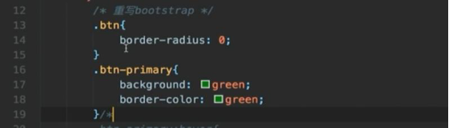

第 二 种 方 式 我 们 需 要 拿 到 bootstrap-custom 即 源 码 ，找 到 scss 文 件 夹 ， 入 口 在 bootstrap.scss（ 包 含 很 多 模 块 ）， 其 中 的 variables 就 包 含 了 各 种 变 量 ；

可 以 直 接 修 改 然 后 重 新 构 建 一 下 就 可 以 引 用 了 ；

好 处 是 只 要 清 楚 了 bootstrap 的 源 码 结 构 然 后 去 修 改 变 量 /mixin 就 可 以 定 制 的 比 较 彻 底 ， 坏 处 是 有 一 定 的 门 槛 。

第 三 种 是 自 己 写 sass 然 后 引 入 bootstrap 作 为 mixin 来 使 用 ； 当 然 也 需 要 把 自 己 的 sass 构 建 成 css 才 能 被 引 用 ；

注 意 如 果 不 需 要 这 么 多 bootstrap 的 模 块 我 们 可 以 是 引 用 bootstrap.scss 中 需 要 的 模 块 即 可 。

### 7-7css 真 题

## 第 八 章 CSS 工 程 化

### 8-1 PostCSS 介 绍

工 程 化 就 是 在 一 个 项 目 /工 程 中 ， 如 何 让 工 程 /项 目 更 好 的 跑 起 来 ；

组 织 是 代 码 的 组 织 即 代 码 分 成 什 么 模 块 、 目 录 ；

优 化 是 采 用 更 好 的 写 法 ；

构 建 是 代 码 写 完 需 要 经 过 什 么 处 理 步 骤 （ 压 缩 什 么 的 ）；

维 护 是 如 何 修 改 等 等 ；

PostCSS 是 后 置 的 意 思 ， sass/less 是 预 处 理 器 则 把 不 是 css 的 语 言 变 成 css 也 就 是 先 有 sass/less 再 有 css， 而 postCSS 是 先 有 css 再 对 代 码 进 行 处 理 ；

当 然 需 要 明 白 的 是 ，预 处 理 器 和 postCSS 本 质 上 没 有 太 大 的 区 别 ， 都 是 把 一 段 代 码 进 行 转 换 解 析 得 到 一 个 最 终 的 css。

### 8-2 PostCSS 插 件 的 使 用 （ 1）

多 种 使 用 方 式 ，当 然 其 本 身 也 有 专 门 的 cli，安 装 postcss-cli， 然 后 就 是 命 令 行 执 行 postcss 文 件 即 可 （ 不 使 用 插 件 的 话 就 只 是 解 析 ）；

新 建 一 个 postcss.config.js 作 为 配 置 文 件 用 来 引 入 插 件 和 导 出 配 置 项 （ plugins 决 定 使 用 哪 个 引 入 的 插 件 ）；

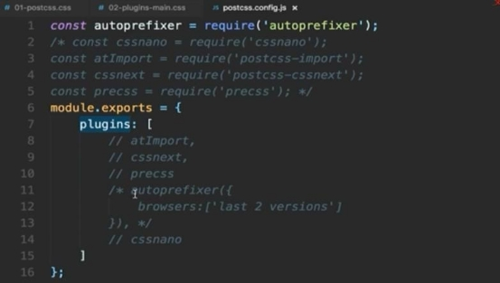

注 意 autoprefixer 允 许 指 定 浏 览 器 的 类 型（ 有 默 认 值 ），也 可 以 写 大 于 等 于 小 于 百 分 比 即 指 定 份 额 等 于 大 于 小 于 百 分 比 的 浏 览 器 就 支 持 ，当 然 直 接 写 适 配 的 浏 览 器 也 行（ 适 配 某 浏 览 器 某 版 本 以 上 ）；

数 据 来 源 于 can I use；

如 果 一 个 css 文 件 里 面 有 引 入 其 他 CSS 文 件 ， 那 么 会 导 致 发 送 两 个 css 请 求 ，为 了 合 并 请 求 可 以 使 用 postcss-import（ 会 帮 我 们 把 引 入 的 css文 件 内 联 进 来 ，就 是 引 入 的 直 接 写 进 去 ）；

### 8-3PostCSS 插 件 的 使 用 （ 2）

cssnano 是 对 代 码 进 行 压 缩 ， 而 且 记 得 导 出 配 置 的 时 候 需 要 把 它 放 到 最 后 ，因 为 要 做 完 前 面 的 处 理 才 需 要 压 缩（ 压 缩 如 简 写 、 合 并 选 择 器 ）；

### 8-4cssnext

允 许 我 们 使 用 已 经 在 规 范 中 提 出 且 定 稿 但 是 浏 览 器 还 没 有 实 现 的 语 法 （ 类 似 于 babel 的 转 换 ）；

它 允 许 我 们 定 义 变 量 ， 但 是 必 须 在 ： root 中 定 义 ， 然 后 使 用 的 时 候 就 是 var（ 变 量 ）；

当 然 也 允 许 我 们 定 义 一 段 代 码 类 似 于 mixin， 那 么 使 用 的 话 就 需 要 @apply 变 量 ；

注 意 这 个 插 件 还 是 需 要 引 入 和 配 置 ；

### 8-5 precss

更 像 预 处 理 器 ，属 性 值 引 用 就 是 我 定 义 了 一 个 属 性 如 margin 的 值 ， 在 另 一 个 属 性 可 以 直 接 就 用 之 前 定 义 过 值 的 属 性 即 margin 来 代 替 值 ；

### 8-6 gulp-postcss

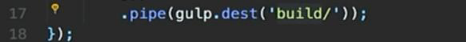

### 8-7 webpack 处 理 CSS

CSS 的 引 用 是 通 过 js 来 完 成 ；

如 果 是 这 种 有 js 也 有 css 的 文 件 其 实 是 无 法 打 包 的 ， 因 为 require 的 话 会 被 webpack 认 为 是 js 模 块 ， 但 是 这 其 实 是 css 的 语 法 那 么 就 会 报 错 ；

可 以 使 用 loader（ webpack 为 一 些 后 缀 提 供 一 些 处 理 工 具 ）， 因 为 webpack 是 处 理 js 的 ， 那 么 我 们 就 需 要 一 个 把 css 变 成 js 的 工 具 即 css-loader，同 时 为 了 将 样 式 注 入 到 页 面 中 去 所 以 就 需 要 这 个 style-loader（ 这 也 意 味 着 不 需 要 在 页 面 中 引 用 CSS 文 件 ）；

安 装 完 这 两 个 loader 还 需 要 在 配 置 文 件 webpack.config.js 中 使 用 ， 发 现 是 css 结 尾 的 文 件 就 使 用 这 两 个 loader；

如 此 的 话 打 包 就 会 成 功 且 正 确 执 行 ！

8-8 css-modules 和 extract-text-plugin

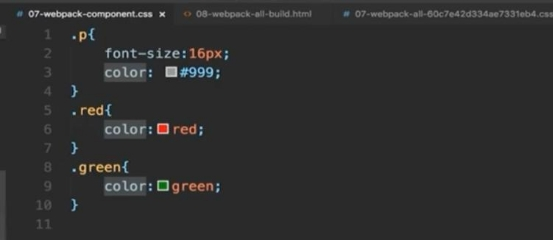

目 前 这 样 子 可 以 实 现 样 式 的 注 入 ，但 是 无 法 做 到 隔 离 ，就 所 有 样 式 都 会 作 用 到 对 应 元 素 而 不 是 控 制 在 组 件 内 部 ，会 干 扰

- 因 为 可 能 会 在 其 他 地 方 也 有 同 名 的 样 式 ）；

样 式 是 包 含 在 js 中 的 ，没 有 css 文 件 ，写 到 head 标 签 中 ，这

样 子 会 导 致 性 能 问 题 （ 等 js 执 行 完 页 面 才 有 样 式 ）；

第 一 个 问 题 早 期 解 决 方 法 就 是 加 前 缀 来 避 免 干 扰 ，但 是 想 这 些 比 较 麻 烦 ，比 较 好 的 方 法 就 是 正 常 的 写 但 是 也 不 会 产 生 干 扰 ，这 就 需 要 css-modules（ 其 实 它 就 是 把 样 式 名 改 了 来 避 免 冲 突 ， 相 当 于 自 动 帮 我 们 写 样 式 名 ）；

但 是 变 了 的 话 我 们 并 不 知 道 是 什 么 样 式 名 ，样 式 会 失 效 ，我 们 可 以 拿 到 其 样 式 列 表（ 原 样 式 名 和 编 译 后 样 式 名 的 对 应 关 系 ）， 来 修 改 原 本 的 样 式 即 可 拿 到 样 式 ， 而 且 样 式 名 也 被 改 掉 了 ， 组 件 样 式 冲 突 就 解 决 了 ；

另 一 个 问 题 是 css 真 的 是 需 要 js 来 引 入 吗 ， 为 什 么 不 用 浏 览

器 原 本 的 机 制 来 渲 染 ？ 可 以 ，需 要 安 装 下 面 这 个 插 件 同 时 修 改 配 置 项 ：

如 此 可 以 做 到 从 js 中 抽 离 css 但 是 无 法 形 成 一 个 文 件 ， 还 需 要 加 一 个 插 件 才 能 生 成 css 文 件 ：

既 然 生 成 了 css 文 件 就 可 以 在 html 中 引 入 了 ：

### 8-9 webpack 小 结

loader 就 是 为 了 直 接 在 js 中 require 一 些 文 件 ， 由 loader 进 行 编 译 ；

### 8-10 真 题

以 上 处 理 都 需 要 通 过 编 译 才 能 实 现 （ 解 决 css import 是 分 开 加 载 css 的 问 题 ）；

## 第 九 章 三 大 框 架 中 的 css 

### 9-1 Angular 中 的 css

典 型 如 video， 只 是 一 个 DOM 标 签 却 有 播 放 按 钮 、 进 度 条 、 声 音 等 等 ， 实 际 上 由 很 多 内 部 结 构 组 成 ；

方 案 一 就 是 类 似 css-modules 那 种 给 出 随 机 样 式 名 来 避 免 冲 突 样 式 ， 但 是 在 angular 中 不 能 用 ；

### 9-2 Vue 中 的 CSS（ 1）

### 9-3 Vue 中 的 CSS（ 2）

Vue 脚 手 架 用 init 完 成 初 始 化 ；

第 一 种 利 用 是 scoped可 以 看 出 来 vue还 是 加 了 一 些 自 定 义 的 属 性 来 限 制 其 范 围 避 免 冲 突（ scoped 给 的 ，如 果 去 掉 则 .demo 后 面 的 []就 没 有 了 ， 就 会 让 .demo 成 为 全 局 的 样 式 ）；

第 二 种 是 利 用 module 这 个 属 性 ， 然 后 动 态 绑 定 样 式 ， 指 向 我 们 style 中 的 样 式 ， 底 层 是 vue-loader 来 实 现 的 ；

注 意 css 会 被 抽 离 出 来 。

### 9-4 React 中 的 CSS（ 1）

官 方 无 支 持 ， 需 要 从 社 区 获 取 ；

第 二 种 与 第 一 种 实 现 的 功 能 一 样 ，不 过 是 多 了 一 个 编 译 的 过 程 即 可 以 正 常 的 写 样 式 名 ， 在 编 译 中 解 决 ；

第 三 种 是 进 一 步 封 装 形 成 一 个 带 有 样 式 的 组 件 ；

第 四 种 是 直 接 在 jsx 中 写 样 式 ；

### 9-5 React 中 的 CSS（ 2）

默 认 的 react 其 实 是 没 有 对 css 做 什 么 处 理 ，直 接 注 入 在 全 局 中 ，我 们 必 须 去 修 改 其 构 建 工 具 换 成 底 层 的 构 建 工 具 ，因 为 react-scripts 会 屏 蔽 底 层 的 构 建 工 具 ， 所 以 需 要 执 行 eject， 把 所 有 的 依 赖 、 构 建 工 具 配 置 等 都 暴 露 出 来 ；

### 9-6 React 中 的 CSS（ 3）

配 置 modules 并 且 通 过 对 引 入 CSS 文 件 的 引 用 ；

### 9-7React 中 的 CSS（ 4）

需 要 先 安 装 styled-components 才 能 使 用 带 有 样 式 的 组 件 ；

也 可 以 修 饰 或 者 说 复 用 另 一 个 组 件 ；

还 可 以 使 用 组 件 的 属 性 来 针 对 性 的 写 一 些 样 式 ；

## 第 十 章 课 程 总 结 

### 10-1 课 程 总 结

所 谓 设 计 思 路 是 指 会 意 识 到 诸 如 图 标 、文 字 的 变 大 变 小 时 应 该 预 留 一 些 空 间 而 不 是 写 死 等 细 节 ；

用 户 体 验 意 识 比 如 可 点 击 区 域 可 以 给 一 个 手 势 图 标 ；

### 10-2 CSS 展 望 CSS 存 在 的 问 题 

深 入 学 习 CSS 的 价 值 ↓

## 第 十 一 章  CSS 架 构 设 计

###  11-1 CSS 设 计 模 式 完 结 （ 1）

这 种 就 是 面 向 对 象 的 CSS， 如 此 既 可 以 保 证 memu 的 源 码 不 被 修 改 又 可 以 对 需 要 的 div 修 改 样 式 。

容 器 写 容 器 的 代 码 ，内 容 写 内 容 的 代 码 ，毕 竟 容 器 下 写 内 容 即 .xx.yy 的 话 内 容 的 样 式 就 只 能 被 限 制 在 该 容 器 下 ， 无 法 复 用 了 ， 所 以 要 拆 开 ， 这 就 是 原 则 一 。

基 础 对 象 不 改 ， 不 断 新 增 皮 肤 对 象 （ 即 fix2） 来 对 基 础 对 象 不 断 的 修 正 和 拓 展 。

由 m 进 行 微 调 ，可 以 调 menu（ 块 ）也 可 以 调 tab 栏（ 元 素 ）， 这 里 是 tab 栏 的 颜 色 不 一 样 ， 所 以 调 tab 的 样 式 。

### 11-2 CSS 设 计 模 式 完 结 （ 2）

Base 就 是 对 浏 览 器 默 认 样 式 重 置 以 及 配 置 （ 一 般 是 利 用 normalize.css， 另 外 还 可 能 定 制 化 一 些 标 签 如 a）；

Layout 是 对 全 部 页 面 可 能 存 在 布 局 方 式 ；

Modules 是 公 共 可 复 用 的 小 模 块 的 样 式 ；

State 是 模 块 的 不 同 状 态 效 果 样 式 ；

Theme 是 维 护 一 个 网 站 可 能 有 很 多 套 皮 肤 ，到 特 殊 的 时 间 就 整 个 别 的 皮 肤 。

公 共 样 式 引 入 然 后 直 接 使 用 类 名 即 可 ，如 果 是 不 通 用 的 只 有 一 处 地 方 有 可 以 直 接 在 页 面 写 。

如 果 是 在 Vue 环 境 下 ，依 然 是 在 style 文 件 夹 下 建 base、state、 theme，但 是 不 存 在 layout 和 modules，因 为 这 两 个 是 以 vue 组 件 的 方 式 存 在 components 中 。

这 些 层 可 以 自 己 决 定 哪 些 需 要 自 己 处 理 ， 重 点 是 分 类 。

### 11-3 CSS 设 计 模 式 完 结 （ 3）

ITCSS 侧 重 分 层 也 就 是 纵 向 的 （ 目 前 更 加 推 荐 ）， 而 SMACSS 是 侧 重 分 类 。

越 往 上 复 用 性 越 好 。

Setting 是 维 护 整 个 网 站 的 样 式 变 量 ；

Tools 维 护 样 式 的 工 具 库 比 如 说 省 略 号 ，垂 直 居 中 之 类 的 ，类 似 sass 中 的 mixin；

Generic 是 重 置 浏 览 器 样 式 ；

Base 是 定 制 化 一 些 样 式 ， 这 两 个 在 SMACSS 是 合 并 到 一 起 ； Objects 是 所 有 网 站 oocss 也 就 是 维 护 通 用 组 件 （ 可 以 与 components 层 合 起 来 ）；

Trumps 是 存 放 权 重 最 高 的 样 式 ， 也 因 此 会 加 ！ Important。

### 11-4 CSS 架 构 方 案

注 意 ITCSS 中 下 一 层 永 远 继 承 上 一 层 的 内 容 ， 可 以 复 用 。 越 上 层 复 用 性 越 高 但 是 权 重 越 低 。

BEM 主 要 是 用 在 组 件 这 一 块 也 就 是 objects 和 components 这 两 层 ， 因 为 组 件 就 是 oocss 嘛 ， BEM 是 进 阶 版 。

ACSS 也 可 以 加 入 进 来 ， 放 到 最 下 面 写 一 些 简 写 的 样 式 。

电 商 由 于 可 能 存 在 多 个 皮 肤 ，所 以 还 需 要 theme层（ 最 下 面 ）。 其 实 style 目 录 下 也 就 setting、 tools、 base、 ACSS、 theme， 因 为 generic 是 引 入 normalize 包 即 可 ，components 是 写 在 组 件 中 。

### 11-5 CSS 架 构 之 Settings 层 代 码 实 现

接 下 来 处 理 公 共 变 量 ， 在 settings 下 面 创 建 var.scss， 一 般 从 PPT那 些 列 举 的 方 向 抽 离 。可 以 参 考 ElementUI对 应 的 var.scss 文 件 。

### 11-6 CSS 架 构 之 Tools 层 代 码 实 现 （ 上 ）

这 里 主 要 是 抽 象 出 一 些 公 共 的 mixin 或 者 function，不 过 基 本 上 靠 引 入 库 来 解 决 ， 不 需 要 自 己 手 写 了 。

但 是 注 意 没 有 提 供 官 方 的 引 入 方 案 ， 所 以 下 载 复 制 src 里 面 的 三 个 文 件 丢 入 tools 即 可 ， 只 不 过 现 在 还 用 不 了 hhh。

### 11-7 CSS 架 构 之 Tools 层 代 码 实 现 （ 下 ）

现 在 对 这 些 tools 做 一 个 全 局 配 置 让 所 有 页 面 都 能 使 用 ， 这 个 需 要 vue.config.js 做 配 置（ scss 与 真 实 的 css 更 接 近 因 为 有 {}， sass 去 掉 了 {}）， 注 意 看 loader 版 本 配 不 同 的 字 段 。

这 里 的 \_sassMagic.scss 入 口 文 件 还 是 有 问 题 的 ，有 一 些 mixin 或 者 function 的 引 入 失 效 了 要 注 释 掉 ， 现 在 即 可 使 用 ， 自 己 也 可 以 通 过 增 减 scss文 件 同 时 入 口 文 件 增 减 文 件 的 引 入 来 定 制 化 。（ 上 面 应 该 是 scss）

### 11-8 CSS 架 构 之 Base 层 代 码 实 现 （ 1）

Npm 下 载 normalize， 打 开 main.js import 导 入 之 即 可 。

### 11-9 CSS 架 构 之 Base 层 代 码 实 现 （ 2）

Base 下 面 重 写 一 些 自 带 有 特 殊 样 式 的 标 签 如 a 等 等 。这 些 主 要 是 靠 个 人 经 验 和 设 计 稿 。 注 意 其 中 image 的 vertical-align 是 为 了 清 除 图 片 的 间 隙 。

### 11-10 CSS 架 构 之 Base 层 代 码 实 现 （ 3）

基 本 还 是 阅 读 设 计 稿 得 出 多 次 出 现 的 内 容 。

目 前 维 护 的 base 和 setting 还 没 有 被 全 局 使 用 ， 所 以 需 要 建 一 个 index.scss 入 口 文 件 导 入 各 个 文 件 夹 各 个 文 件 ， 再 在 main.js 导 入 index。

需 要 注 意 的 是 settings 的 var.scss 需 要 放 到 vue.config.js。

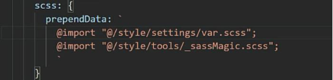

### 11-11 CSS 架 构 之 Base 层 代 码 实 现 （ 4）

为 什 么 scss 引 入 的 方 式 不 同 ？

其 实 在 vue.config.js 配 置 的 就 相 当 于 在 每 一 个 文 件 （ 任 何 文 件 ，包 括 scss）的 style 标 签 的 开 头 加 上 如 下 的 引 入 ，因 此 任 何 页 面 都 可 以 使 用 它 们 。

至 于 其 他 的 ，因 为 不 需 要 使 用 ，只 是 纯 样 式 所 以 可 以 直 接 在 main.js 引 入 生 效 即 可（ 不 存 在 变 量 什 么 的 可 以 给 页 面 使 用 所 以 不 需 要 每 个 页 面 import 也 就 不 需 要 配 在 vue 里 了 ，它 仅 仅 是 生 效 这 个 样 式 ， 换 句 话 说 页 面 改 不 了 ）。

### 11-12 CSS 架 构 之 components 层 代 码 实 现 （ 上 ）

注 意 需 要 先 有 很 固 定 的 基 础 对 象（ 确 保 基 本 的 复 用 ）再 有 皮 肤 类 修 改 之（ 确 保 不 会 修 改 到 源 码 ，影 响 其 它 组 件 之 类 的 ）。 Vue 的 组 件 恰 好 就 符 合 这 种 固 定 结 构 ，也 因 此 说 它 是 BEM 的 实 现 ， BEM 和 OOCSS 一 模 一 样 除 了 命 名 需 要 处 理 一 下 。

### 11-13 CSS 架 构 之 components 层 代 码 实 现 （ 中 ）

栅 格 组 件 就 是 将 宽 度 均 分 成 n 份 ， 宽 度 总 值 为 x（ 例 如 24）。 这 里 打 算 用 vant 写 好 的 栅 格 组 件 ， 需 要 先 安 装 vant3， 由 于 不 是 全 部 引 用 ， 所 以 在 components 下 面 新 建 一 个 index.js， 导 入 vant 中 的 col、 row 以 及 对 应 的 样 式 即 可 成 功 导 入 。

需 要 注 意 install，它 是 做 Vue的 插 件 ，只 需 要 对 象 中 含 有 install 即 可（ 这 里 就 是 Mui 对 象 包 含 了 install，install 就 是 插 件 实 现 的 功 能 ），这 样 子 index.js就 相 当 于 一 个 插 件 了 ，需 要 在 main.js 导 入 使 用 。

这 里 install 做 的 就 是 把 vant 的 栅 格 系 统 做 成 全 局 组 件 ，不 用 一 次 次 导 入 组 件 了 。

注 意 我 们 组 件 的 名 称 改 成 了 c 代 表 组 件 ， 所 以 使 用 就 不 能 在 vant 开 头 了 。

### 11-14 CSS 架 构 之 components 层 代 码 实 现 （ 下 ）

Header、 footer、 aside、 main 等 组 件 ， 它 们 都 是 由 layout 包 裹 ， 可 以 互 相 搭 配 。

Layout 组 件 依 然 是 需 要 在 layout 文 件 下 建 一 个 index.js 做 插 件 来 给 全 局 使 用 ， 同 时 外 面 的 index 就 可 以 导 入 并 且 注 册 到 全 局 （ 这 里 用 if 做 了 逻 辑 判 断 是 否 是 第 三 方 的 插 件 ）。

在 views 下 新 建 layout 页 面 ， router 中 注 册 。

注 意 样 式 中 的 b e m 其 实 就 是 BEM， 它 们 （ ） 里 面 就 是 对 应 的 元 素 类 名 之 类 的 。

### 11-15 CSS 架 构 之 Acss 层 代 码 实 现 （ 上 ）

ACSS 就 是 每 一 个 样 式 都 用 一 个 类 来 表 示 不 过 就 没 有 语 义 化 了 。

解 决 方 法 就 是 不 要 把 这 些 写 到 class， class 按 平 常 写 ， 然 后 ACSS 作 为 属 性 写 入 。

那 我 们 ACSS 的 实 现 就 要 像 下 面 这 样 ：

### 11-16 CSS 架 构 之 ACSS 层 代 码 实 现 （ 中 ）

抽 离 的 话 依 然 还 是 需 要 考 虑 适 用 性 ， 出 现 多 次 才 把 它 作 为 ACSS， 技 巧 是 参 考 settings 下 面 的 变 量 来 实 现 ， 其 它 来 源 就 需 要 仔 细 分 析 设 计 稿 了 。

### 11-17 CSS 架 构 之 ACSS 层 代 码 实 现

这 个 还 需 要 代 入 全 局 ，只 需 要 导 入 一 次（ 不 需 要 每 次 都 import 来 使 用 变 量 这 种 ，它 就 是 个 样 式 文 件 ），所 以 我 们 丢 index.scss 即 可 。

### 11-18 CSS 架 构 之 Theme 层 代 码 实 现 （ 上 ）

这 里 就 是 实 现 点 击 不 同 的 颜 色 ，某 些 组 件 就 显 示 不 同 的 颜 色 。 依 然 是 依 赖 属 性 选 择 器 来 实 现 ，根 据 属 性 不 同 ，类 呈 现 不 一 样 的 样 式 。

### 11-19 CSS 架 构 之 Theme 层 代 码 实 现 （ 中 ）

目 前 只 是 适 用 于 单 个 页 面 ，想 要 适 配 全 局 需 要 对 这 个 样 式 做 一 个 提 升 到 最 高 的 html 标 签 中 ，同 时 这 些 样 式 也 弄 成 全 局 即 可 。

因 此 theme 文 件 夹 下 面 建 立 3 种 scss，依 然 是 通 过 index.scss 导 入 全 局 ，同 时 为 了 提 升 标 签 到 html 应 该 利 用 JS 来 给 HTML 标 签 注 入 属 性 （ 因 为 不 能 写 死 嘛 ）， 这 边 是 在 APP.vue（ 入 口 文 件 ， 必 定 会 执 行 ） 写 了 ：

针 对 书 写 过 程 中 需 要 和 theme一 起 配 合 组 件 什 么 的 我 们 都 可 以 添 加 到 对 应 的 scss 中 来 建 立 切 换 联 系 （ 切 记 .之 前 要 空 格 ！！！！！）。

### 11-20 CSS 架 构 之 Theme 层 代 码 实 现 （ 下 ）

注 意 目 前 这 种 做 法 可 能 会 影 响 到 不 同 页 面 的 同 名 类 名 ，所 以 可 以 让 命 名 复 杂 一 点 来 避 免 其 它 页 面 也 使 用 到 这 个 命 名 。

这 样 子 其 实 还 是 一 种 css， 可 以 利 用 scss 来 生 成 ， 如 果 太 复 杂 可 以 采 用 原 本 的 css 来 实 现 。 如 果 使 用 scss 则 使 用 到 话 需 要 采 用 include 的 方 式 而 不 是 直 接 加 在 类 名 那 。

